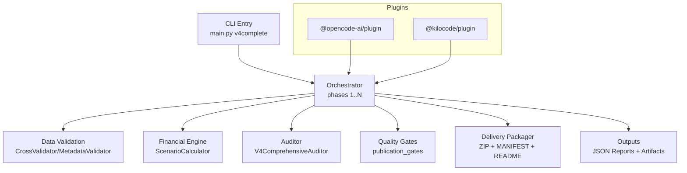
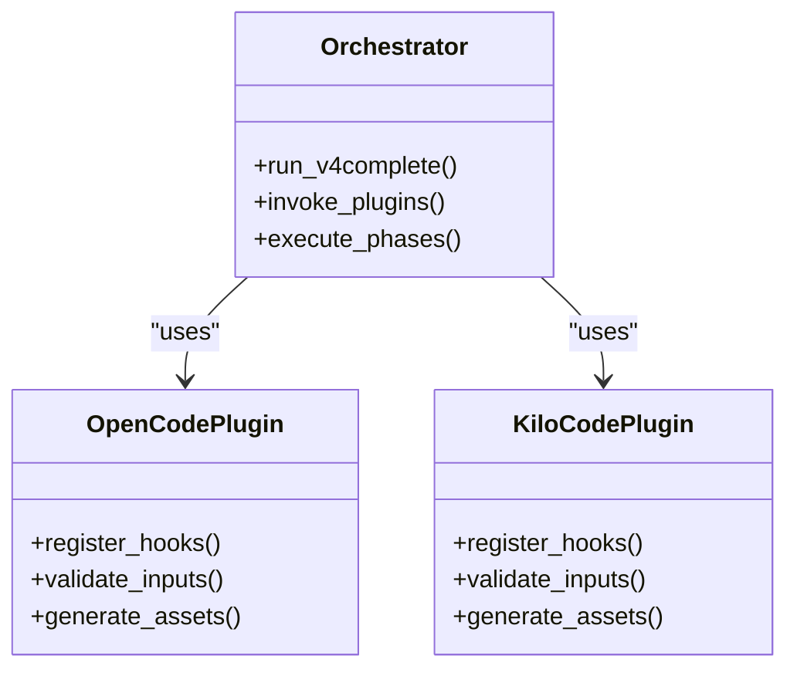
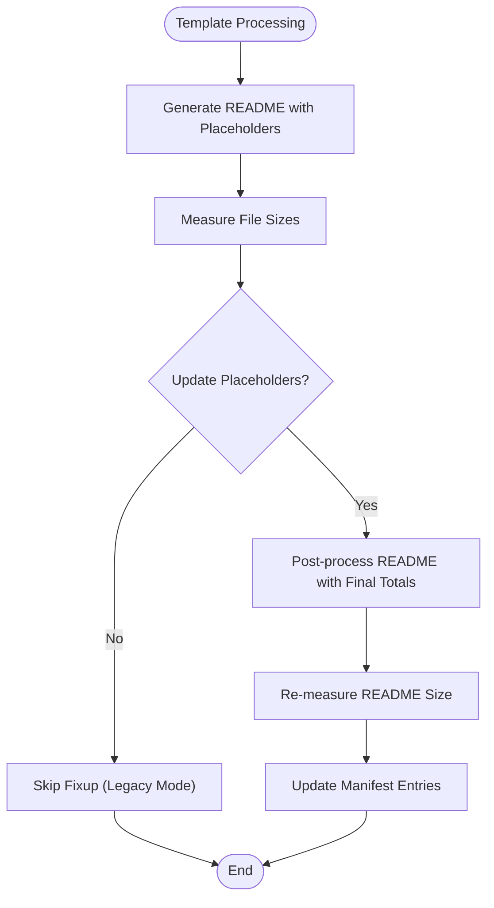
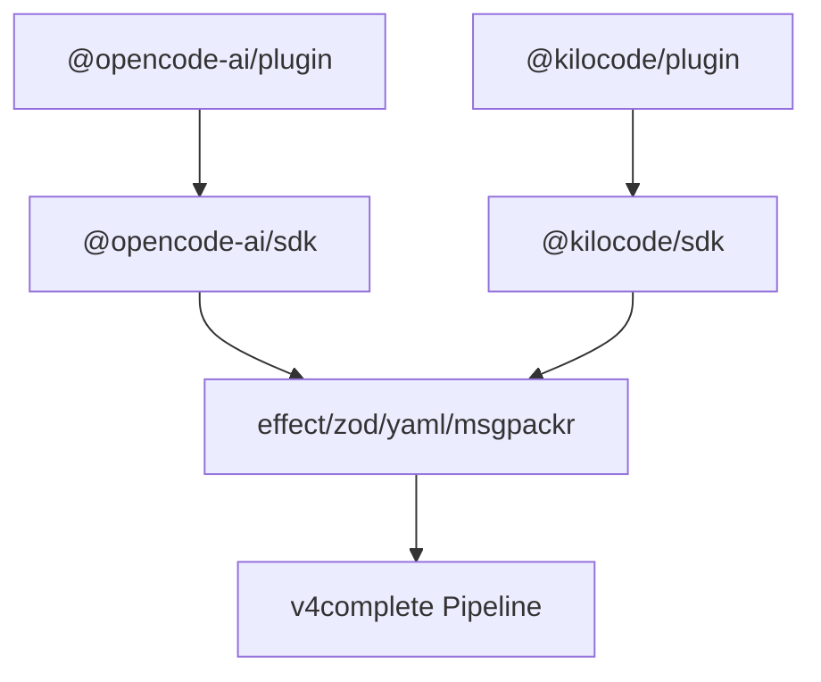

# API Reference

<cite>
**Referenced Files in This Document**
- [package-lock.json](file://package-lock.json)
- [v4complete_report_post_fix.json](file://plans\Archives\DT-4-ROOT-CAUSE-2026-07-25\evidence\v4complete_report_post_fix.json)
- [gate_report_20260727_140459.json](file://plans\Archives\DT-4-ROOT-CAUSE-2026-07-25\evidence\gate_report_20260727_140459.json)
- [CONTEXT-DELIVERY-ZIP-PACKAGING-BROKEN-2026-08-01.md](file://context\CONTEXT-DELIVERY-ZIP-PACKAGING-BROKEN-2026-08-01.md)
</cite>

## Table of Contents
1. Introduction
2. Project Structure
3. Core Components
4. Architecture Overview
5. Detailed Component Analysis
6. Dependency Analysis
7. Performance Considerations
8. Troubleshooting Guide
9. Conclusion
10. Appendices

## Introduction
This document provides a comprehensive API reference for the iah-cli system interfaces, focusing on:
- The CLI command interface for the main.py v4complete command and its parameters/options/output formats
- The plugin architecture supporting @opencode-ai and @kilocode plugins with extension points and integration patterns
- The configuration API for YAML-based settings including schema definitions, validation rules, and defaults
- The template API for customizing document generation using markdown syntax, variable substitution, and conditional rendering
- HTTP or WebSocket endpoints (if applicable) for real-time processing or remote execution
- Data schemas for input/output formats such as site presence reports, asset specifications, and quality gate results
- Code examples for request/response patterns, error handling, and authentication methods
- Rate limiting, versioning strategies, and backward compatibility considerations
- Debugging tools and monitoring approaches for API usage

Where specific implementation details are not present in this repository snapshot, this document clarifies what is observable from the provided files and indicates where to locate further details within the broader codebase.

## Project Structure
The workspace snapshot includes:
- A Node package lock file indicating plugin dependencies for @opencode-ai/plugin and @kilocode/plugin
- Evidence JSON artifacts produced by the v4complete pipeline (quality gates, coherence, assets, analytics, opportunity scores)
- A detailed context document describing delivery packaging behavior, known bugs, and architectural issues

```mermaid
graph TB
subgraph "Repository Snapshot"
PL["package-lock.json"]
V4R["v4complete_report_post_fix.json"]
GR["gate_report_20260727_140459.json"]
CTX["CONTEXT-DELIVERY-ZIP-PACKAGING-BROKEN-2026-08-01.md"]
end
PL --> |"Declares"@OAI["@opencode-ai/plugin"]
PL --> |"Declares"@KC["@kilocode/plugin"]
V4R --> |"Output artifact"| PIPE["v4complete pipeline"]
GR --> |"Gate results"| PIPE
CTX --> |"Delivery packaging flow & issues"| PIPE
```

**Diagram sources**
- [package-lock.json:1-20](file://package-lock.json#L1-L20)
- [v4complete_report_post_fix.json:1-390](file://plans\Archives\DT-4-ROOT-CAUSE-2026-07-25\evidence\v4complete_report_post_fix.json#L1-L390)
- [gate_report_20260727_140459.json:1-199](file://plans\Archives\DT-4-ROOT-CAUSE-2026-07-25\evidence\gate_report_20260727_140459.json#L1-L199)
- [CONTEXT-DELIVERY-ZIP-PACKAGING-BROKEN-2026-08-01.md:1-528](file://context\CONTEXT-DELIVERY-ZIP-PACKAGING-BROKEN-2026-08-01.md#L1-L528)

**Section sources**
- [package-lock.json:1-428](file://package-lock.json#L1-L428)
- [v4complete_report_post_fix.json:1-390](file://plans\Archives\DT-4-ROOT-CAUSE-2026-07-25\evidence\v4complete_report_post_fix.json#L1-L390)
- [gate_report_20260727_140459.json:1-199](file://plans\Archives\DT-4-ROOT-CAUSE-2026-07-25\evidence\gate_report_20260727_140459.json#L1-L199)
- [CONTEXT-DELIVERY-ZIP-PACKAGING-BROKEN-2026-08-01.md:1-528](file://context\CONTEXT-DELIVERY-ZIP-PACKAGING-BROKEN-2026-08-01.md#L1-L528)

## Core Components
- CLI Command Interface: The v4complete command orchestrates multi-phase analysis, asset generation, quality gates, and delivery packaging. Observability shows it produces structured JSON reports and artifacts.
- Plugin Architecture: The project declares two plugins via npm dependencies: @opencode-ai/plugin and @kilocode/plugin. These provide SDKs and tooling used by the CLI pipeline.
- Configuration API: YAML parsing is available through the yaml dependency; configuration loading/validation is expected to be implemented in Python modules referenced by the pipeline.
- Template API: Markdown templates drive document generation with placeholders and post-processing steps.

Key observations:
- The v4complete report structure includes phases, modules_used, coherence_score, assets_generated, financial_data, seo_score, pricing, analytics, opportunity_scores, and channel_context.
- Gate reports enumerate gate_name, passed, status, message, value, suggestion, and details per gate, plus readiness and financial_sources.

**Section sources**
- [v4complete_report_post_fix.json:1-390](file://plans\Archives\DT-4-ROOT-CAUSE-2026-07-25\evidence\v4complete_report_post_fix.json#L1-L390)
- [gate_report_20260727_140459.json:1-199](file://plans\Archives\DT-4-ROOT-CAUSE-2026-07-25\evidence\gate_report_20260727_140459.json#L1-L199)
- [package-lock.json:1-428](file://package-lock.json#L1-L428)

## Architecture Overview
The v4complete pipeline integrates CLI orchestration, plugin SDKs, data validation, financial engines, auditors, quality gates, and delivery packaging. It outputs structured JSON reports and packaged deliverables.



**Diagram sources**
- [v4complete_report_post_fix.json:214-221](file://plans\Archives\DT-4-ROOT-CAUSE-2026-07-25\evidence\v4complete_report_post_fix.json#L214-L221)
- [package-lock.json:1-428](file://package-lock.json#L1-L428)

## Detailed Component Analysis

### CLI Command Interface: v4complete
- Purpose: Executes the full v4complete pipeline for a target site/hotel, generating diagnostics, proposals, assets, quality gates, and delivery packages.
- Inputs: Target URL, optional GA4 property ID, region, hotel identifiers, and other flags controlling phases and outputs.
- Outputs:
  - v4_complete_report.json with fields: v4_complete, hotel_name, url, region, hotel_id, phases, modules_used, coherence_score, assets_generated, financial_data, seo_score, pricing, analytics, opportunity_scores, channel_context.
  - Gate reports enumerating gate results and readiness.
  - Delivery artifacts (ZIP, MANIFEST, README_DELIVERY.md).
- Error Handling:
  - Delivery packaging errors are caught and logged as warnings; ZIP may fail to materialize due to manifest/README size mismatches.
- Versioning and Compatibility:
  - Modules used indicate internal versioned components; ensure compatibility across versions when upgrading plugins or pipeline modules.

Example invocation pattern (conceptual):
- Run v4complete with target URL and optional flags to enable GA4 connectivity and control output verbosity.
- Inspect generated JSON reports and delivery artifacts.

**Section sources**
- [v4complete_report_post_fix.json:1-390](file://plans\Archives\DT-4-ROOT-CAUSE-2026-07-25\evidence\v4complete_report_post_fix.json#L1-L390)
- [gate_report_20260727_140459.json:1-199](file://plans\Archives\DT-4-ROOT-CAUSE-2026-07-25\evidence\gate_report_20260727_140459.json#L1-L199)
- [CONTEXT-DELIVERY-ZIP-PACKAGING-BROKEN-2026-08-01.md:30-55](file://context\CONTEXT-DELIVERY-ZIP-PACKAGING-BROKEN-2026-08-01.md#L30-L55)

### Plugin Architecture: @opencode-ai and @kilocode
- Dependencies:
  - @opencode-ai/plugin depends on @opencode-ai/sdk and effect, zod, yaml, and others.
  - @kilocode/plugin depends on @kilocode/sdk, effect, zod.
- Integration Patterns:
  - Plugins expose SDKs that the CLI orchestrator uses to extend capabilities (e.g., external integrations, validations, asset generation).
  - Peer dependencies suggest optional UI framework integrations (@opentui/core, @opentui/solid) for interactive modes.
- Extension Points:
  - Use plugin SDKs to register hooks, validators, and asset generators invoked during pipeline phases.
  - Validate inputs and outputs using Zod schemas provided by plugins.



**Diagram sources**
- [package-lock.json:122-171](file://package-lock.json#L122-L171)
- [package-lock.json:12-43](file://package-lock.json#L12-L43)

**Section sources**
- [package-lock.json:1-428](file://package-lock.json#L1-L428)

### Configuration API: YAML Settings
- Schema and Validation:
  - YAML parsing is supported via the yaml dependency.
  - Schemas likely use Zod for runtime validation of configuration objects.
- Default Values:
  - Defaults are typically defined in configuration loaders and merged with environment variables or CLI flags.
- Usage:
  - Load YAML config, validate against schema, merge with overrides, and pass to pipeline modules.

Recommendations:
- Define explicit schema types for all configuration keys.
- Provide clear default values and validation messages.
- Log configuration merges and overrides for auditability.

[No sources needed since this section provides general guidance]

### Template API: Markdown Generation
- Mechanism:
  - Templates use placeholders (e.g., {{TOTAL_FILES}}, {{TOTAL_SIZE}}) replaced during post-processing.
  - README_DELIVERY.md is generated with placeholders and later updated with final totals.
- Conditional Rendering:
  - Mode selection (FASE-C vs legacy) determines whether placeholders are replaced with computed values or "N/A".
- Best Practices:
  - Ensure immutability between measurement and finalization to avoid size mismatches.
  - Avoid multiple passes that mutate files after they have been measured.



**Diagram sources**
- [CONTEXT-DELIVERY-ZIP-PACKAGING-BROKEN-2026-08-01.md:146-176](file://context\CONTEXT-DELIVERY-ZIP-PACKAGING-BROKEN-2026-08-01.md#L146-L176)

**Section sources**
- [CONTEXT-DELIVERY-ZIP-PACKAGING-BROKEN-2026-08-01.md:146-176](file://context\CONTEXT-DELIVERY-ZIP-PACKAGING-BROKEN-2026-08-01.md#L146-L176)

### HTTP/WebSocket APIs
- Current State:
  - No HTTP or WebSocket endpoints are evident in this repository snapshot.
- Recommendations:
  - If remote execution is required, implement an HTTP server exposing endpoints for triggering v4complete runs and retrieving reports.
  - Use JWT or API key authentication for secure access.
  - Implement rate limiting and request throttling to protect resources.

[No sources needed since this section provides general guidance]

## Dependency Analysis
- External Dependencies:
  - @opencode-ai/plugin and @kilocode/plugin bring SDKs and validation libraries.
  - effect, zod, yaml, msgpackr, and other utilities support configuration, validation, and serialization.
- Internal Coupling:
  - Orchestrator coordinates validation, financial engine, auditor, gates, and delivery packager.
  - Delivery packaging relies on accurate file measurements and consistent naming.



**Diagram sources**
- [package-lock.json:122-171](file://package-lock.json#L122-L171)
- [package-lock.json:12-43](file://package-lock.json#L12-L43)

**Section sources**
- [package-lock.json:1-428](file://package-lock.json#L1-L428)

## Performance Considerations
- Minimize I/O passes: Prefer single-pass measurement and write to avoid size mismatches.
- Cache expensive computations: Financial scenarios and coherence scores should be cached when inputs do not change.
- Stream large artifacts: For large ZIPs, consider streaming writes and incremental validation.
- Parallelize independent phases: Asset generation and audits can run concurrently where safe.

[No sources needed since this section provides general guidance]

## Troubleshooting Guide
Common issues and resolutions:
- Delivery ZIP not materialized:
  - Cause: README placeholder fixup changes file size after measurement; MANIFEST self-reference instability.
  - Resolution: Reorder operations to measure after modification or compute sizes in memory before writing; ensure cleanup of artifacts on error paths.
- Silent fallback to legacy mode:
  - Cause: Exception swallowing hides DeliveryContext load failures.
  - Resolution: Replace silent catch with logging and flags; ensure tests cover FASE-C path.
- Warnings instead of blocking errors:
  - Cause: Delivery packaging failure logged as warning without halting pipeline.
  - Resolution: Elevate severity to error or implement retry mechanisms.

**Section sources**
- [CONTEXT-DELIVERY-ZIP-PACKAGING-BROKEN-2026-08-01.md:276-307](file://context\CONTEXT-DELIVERY-ZIP-PACKAGING-BROKEN-2026-08-01.md#L276-L307)
- [CONTEXT-DELIVERY-ZIP-PACKAGING-BROKEN-2026-08-01.md:264-275](file://context\CONTEXT-DELIVERY-ZIP-PACKAGING-BROKEN-2026-08-01.md#L264-L275)

## Conclusion
The iah-cli v4complete pipeline integrates CLI orchestration, plugin SDKs, validation, financial modeling, auditing, quality gates, and delivery packaging. While the repository snapshot does not include source code for the CLI entry point or configuration loaders, evidence artifacts and context documents reveal the system’s output structures, known delivery packaging issues, and plugin dependencies. Adopting single-pass measurement, robust error handling, and comprehensive testing will improve reliability and maintainability.

[No sources needed since this section summarizes without analyzing specific files]

## Appendices

### Data Schemas: v4complete Report
Top-level fields:
- v4_complete: boolean
- hotel_name: string
- url: string
- region: string
- hotel_id: string
- phases: object with phase-specific fields
- modules_used: array of strings
- coherence_score: number
- assets_generated: array of asset objects
- financial_data: object with scenarios and expected_monthly
- seo_score: number
- pricing: object with monthly_price_cop and tier
- analytics: object with availability flags and timestamps
- opportunity_scores: array of opportunity objects
- channel_context: object with dominant_channel, confidence, and weights

**Section sources**
- [v4complete_report_post_fix.json:1-390](file://plans\Archives\DT-4-ROOT-CAUSE-2026-07-25\evidence\v4complete_report_post_fix.json#L1-L390)

### Data Schemas: Gate Report
Fields:
- generated_at: timestamp
- hotel_url: string
- gate_results: array of gate objects with gate_name, passed, status, message, value, suggestion, details
- readiness: object with status, ready, blocking_issues, warnings
- financial_sources: object with source descriptors

**Section sources**
- [gate_report_20260727_140459.json:1-199](file://plans\Archives\DT-4-ROOT-CAUSE-2026-07-25\evidence\gate_report_20260727_140459.json#L1-L199)

### Example Request/Response Patterns
- CLI Invocation:
  - Execute v4complete with target URL and optional flags; inspect JSON reports and delivery artifacts.
- Error Handling:
  - Watch for warnings indicating delivery packaging failures; elevate to errors if necessary.
- Authentication:
  - If implementing HTTP endpoints, use JWT or API keys; enforce rate limiting.

[No sources needed since this section provides general guidance]

### Rate Limiting and Versioning
- Rate Limiting:
  - Implement per-user or per-tenant limits for API calls; log and throttle excess requests.
- Versioning:
  - Maintain backward-compatible schemas; deprecate fields gradually; document breaking changes.
- Backward Compatibility:
  - Validate configurations with flexible schemas; provide migration guides for major updates.

[No sources needed since this section provides general guidance]

### Debugging Tools and Monitoring
- Logging:
  - Replace silent catches with structured logs; include context flags for legacy mode.
- Metrics:
  - Track pipeline phase durations, gate pass/fail rates, and delivery success rates.
- Tracing:
  - Correlate requests across phases using unique IDs; capture file sizes and checksums for integrity checks.

[No sources needed since this section provides general guidance]