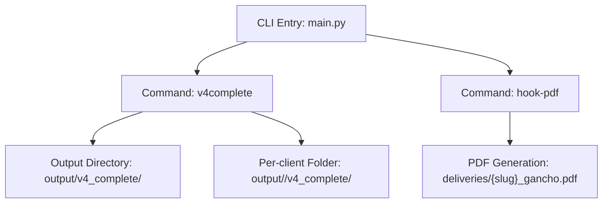
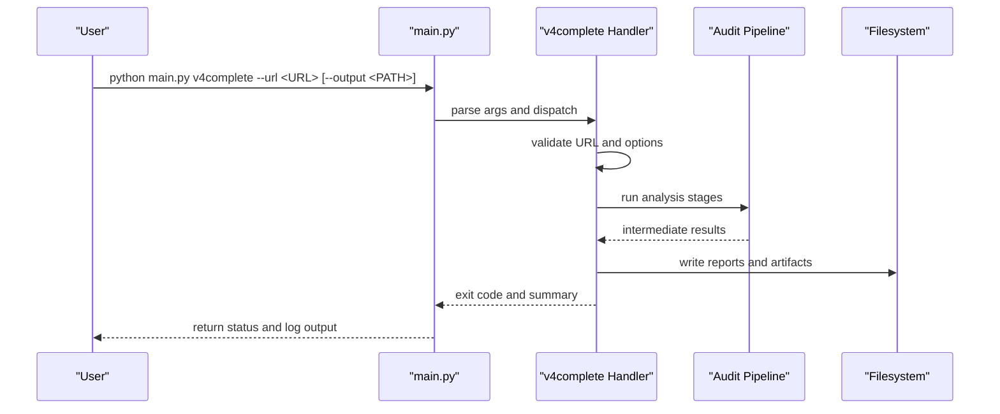
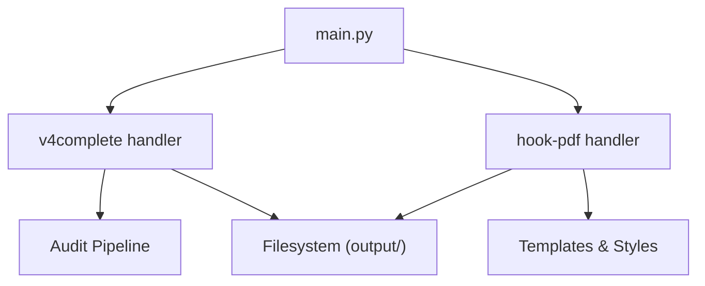

# CLI Commands

<cite>
**Referenced Files in This Document**
- [main.py](file://main.py)
- [MODULO-HOOK-PDF.md](file://context/Historico/MODULO-HOOK-PDF.md)
- [01-plan-maestro.md](file://plans/Archives/DT-2-DELIVERY-CONTRACT-RESIDUAL-2026-07-24/01-plan-maestro.md)
- [07-prompt-fase-release.md](file://plans/Archives/DT-4-ROOT-CAUSE-2026-07-25/07-prompt-fase-release.md)
- [05-prompt-inicio-sesion-fase-6.md](file://plans/Archives/DT4-RESIDUAL-FIXES/05-prompt-inicio-sesion-fase-6.md)
</cite>

## Table of Contents
1. [Introduction](#introduction)
2. [Project Structure](#project-structure)
3. [Core Components](#core-components)
4. [Architecture Overview](#architecture-overview)
5. [Detailed Component Analysis](#detailed-component-analysis)
6. [Dependency Analysis](#dependency-analysis)
7. [Performance Considerations](#performance-considerations)
8. [Troubleshooting Guide](#troubleshooting-guide)
9. [Conclusion](#conclusion)
10. [Appendices](#appendices)

## Introduction
This document provides comprehensive CLI command documentation for the iah-cli system, focusing on the main.py v4complete command and related integration patterns. It consolidates usage, parameters, output formats, environment configuration, error handling, exit codes, logging, and operational guidance derived from repository artifacts. Where applicable, it also references the hook-pdf command to illustrate how additional commands integrate with the same CLI entrypoint.

## Project Structure
The iah-cli project is a Python-based CLI tool that orchestrates hotel onboarding, audit generation, and delivery packaging workflows. The primary entrypoint is main.py, which defines subcommands (e.g., v4complete, hook-pdf) and dispatches execution to corresponding handlers. Output artifacts are written under an output directory, typically organized per client or flat depending on mode.

**Diagram sources**
- [main.py](file://main.py)
- [MODULO-HOOK-PDF.md](file://context/Historico/MODULO-HOOK-PDF.md)

**Section sources**
- [MODULO-HOOK-PDF.md](file://context/Historico/MODULO-HOOK-PDF.md)

## Core Components
- CLI entrypoint (main.py): Defines argument parsing and command dispatch for v4complete and other commands.
- v4complete command: Executes end-to-end analysis and artifact generation for a given hotel URL.
- hook-pdf command: Generates a PDF deliverable from v4complete outputs using templates and styles.

Key responsibilities:
- Parse CLI arguments and validate inputs.
- Execute pipeline stages (audit, coherence validation, asset generation, commercial gates).
- Write structured outputs (JSON reports, Markdown diagnostics, gate reports).
- Provide hooks for downstream processing (e.g., PDF generation).

**Section sources**
- [main.py](file://main.py)
- [MODULO-HOOK-PDF.md](file://context/Historico/MODULO-HOOK-PDF.md)

## Architecture Overview
The v4complete workflow processes a target hotel URL and produces a set of diagnostic and audit artifacts. The flow includes input validation, data loading, analysis phases, report generation, and optional gating checks.

**Diagram sources**
- [main.py](file://main.py)
- [05-prompt-inicio-sesion-fase-6.md](file://plans/Archives/DT4-RESIDUAL-FIXES/05-prompt-inicio-sesion-fase-6.md)

## Detailed Component Analysis

### v4complete Command
Purpose:
- Run a complete audit and analysis pipeline for a hotel website identified by its URL.
- Generate diagnostic documents, audit reports, and evidence files required for quality assurance and delivery readiness.

Parameters and Options:
- Required:
  - --url: Target hotel URL (string). Must be a valid HTTP(S) URL.
- Optional:
  - --output: Base output directory path (string). Defaults may vary; commonly writes to output/v4_complete/ or a per-client folder under output/<hotel_id>/v4_complete/.
  - Additional flags may exist for verbosity, dry-run, force overwrite, etc., following the pattern used by other commands in main.py.

Validation Rules:
- URL must be non-empty and well-formed.
- Output path must be writable.
- If per-client mode is enabled, slug derivation must succeed from the URL.

Default Values:
- Default output directory behavior depends on mode; see “Output Directory Structure” below.

Exit Codes:
- 0: Success.
- Non-zero: Failure (specific codes depend on error categories such as invalid input, network errors, or pipeline failures).

Logging Output Formats:
- Console logs include progress, warnings, and errors.
- Structured JSON reports are written to the output directory.

Common Usage Examples:
- Basic execution:
  - python main.py v4complete --url https://example.com
- Custom output directory:
  - python main.py v4complete --url https://example.com --output output/clientes
- Verbose mode (if supported):
  - python main.py v4complete --url https://example.com --verbose

Output Directory Structure:
- Flat mode:
  - output/v4_complete/ contains top-level artifacts like 01_DIAGNOSTICO_*.md and 02_PROPUESTA_*.md.
- Per-client mode:
  - output/<hotel_id>/v4_complete/ contains per-hotel folders with audit artifacts.
- Key evidence files (examples):
  - v4_complete_report.json
  - BLOCKED_BY_GATES.md
  - v4_audit/gate_report_*.json
  - v4_audit/coherence_validation.json
  - v4_audit/coherence_validation_post_gen.json
  - v4_audit/asset_generation_report.json
  - v4_audit/pain_ledger_resolved.json
  - v4_audit/commercial_gates_report.json
  - v4_audit/delivery_quality_report.json

Environment Variables:
- ONBOARDING_FRESHNESS_HOURS: Controls freshness window for onboarding data matching (when applicable).
- Other variables may influence logging level, timeouts, or feature toggles; consult main.py argument parsing and handler implementations.

Error Handling Patterns:
- Input validation errors produce immediate non-zero exit codes.
- Network or I/O errors are logged and propagated up the call stack.
- Cleanup routines ensure partial outputs are handled consistently.

Integration Points:
- hook-pdf can consume v4complete outputs to generate PDF deliverables.
- Shell scripts can chain v4complete with post-processing steps (e.g., copying evidence, running validations).

**Section sources**
- [01-plan-maestro.md](file://plans/Archives/DT-2-DELIVERY-CONTRACT-RESIDUAL-2026-07-24/01-plan-maestro.md)
- [07-prompt-fase-release.md](file://plans/Archives/DT-4-ROOT-CAUSE-2026-07-25/07-prompt-fase-release.md)
- [05-prompt-inicio-sesion-fase-6.md](file://plans/Archives/DT4-RESIDUAL-FIXES/05-prompt-inicio-sesion-fase-6.md)
- [MODULO-HOOK-PDF.md](file://context/Historico/MODULO-HOOK-PDF.md)

### hook-pdf Command
Purpose:
- Generate a PDF deliverable from v4complete outputs using templates and styles.

Parameters and Options:
- Required:
  - --output-dir: Path to the v4complete output directory.
- Optional:
  - --template: Path to template file (default: templates/hook_template.md).
  - --style: Path to style file (default: templates/hook_styles.css).
  - --dry-run: Preview without writing files.
  - --force: Overwrite existing outputs.
  - --verbose: Enable detailed logging.

Workflow:
- Reads source artifacts from the specified output directory.
- Applies templates and styles to generate a PDF.
- Writes result to deliveries/{slug}_gancho.pdf within the output directory.

Example Usage:
- python main.py hook-pdf --output-dir output/v4_complete/

**Section sources**
- [MODULO-HOOK-PDF.md](file://context/Historico/MODULO-HOOK-PDF.md)

## Dependency Analysis
The CLI entrypoint coordinates multiple modules and external resources:
- Argument parsing and dispatch reside in main.py.
- v4complete relies on audit pipelines and filesystem I/O.
- hook-pdf depends on template and style assets.

**Diagram sources**
- [main.py](file://main.py)
- [MODULO-HOOK-PDF.md](file://context/Historico/MODULO-HOOK-PDF.md)

**Section sources**
- [main.py](file://main.py)
- [MODULO-HOOK-PDF.md](file://context/Historico/MODULO-HOOK-PDF.md)

## Performance Considerations
- Execution time: v4complete typically takes several minutes due to multi-stage analysis and report generation.
- I/O optimization: Use dedicated output directories and avoid excessive disk contention.
- Parallelization: Chain commands via shell scripts to process multiple URLs concurrently where feasible.
- Logging: Reduce verbosity in production runs to minimize overhead.

[No sources needed since this section provides general guidance]

## Troubleshooting Guide
Common Issues:
- Invalid URL: Ensure the URL is correctly formatted and accessible.
- Permission errors: Verify write permissions for the output directory.
- Missing templates/styles: Confirm paths for hook-pdf templates and styles.
- Timeouts: Increase terminal timeout when executing long-running commands.

Debugging Steps:
- Enable verbose logging to capture detailed progress and errors.
- Inspect generated JSON reports for intermediate failures.
- Validate file existence in expected output locations.

Recovery Actions:
- Clean partial outputs and re-run with corrected parameters.
- Update environment variables if necessary (e.g., ONBOARDING_FRESHNESS_HOURS).

**Section sources**
- [07-prompt-fase-release.md](file://plans/Archives/DT-4-ROOT-CAUSE-2026-07-25/07-prompt-fase-release.md)
- [05-prompt-inicio-sesion-fase-6.md](file://plans/Archives/DT4-RESIDUAL-FIXES/05-prompt-inicio-sesion-fase-6.md)

## Conclusion
The iah-cli system provides a robust CLI interface for hotel onboarding, auditing, and delivery packaging. The v4complete command orchestrates comprehensive analysis and generates structured outputs suitable for quality assurance and stakeholder review. Integration with hook-pdf enables automated PDF generation from these outputs. Proper parameter usage, environment configuration, and error handling ensure reliable operation across diverse scenarios.

[No sources needed since this section summarizes without analyzing specific files]

## Appendices

### Environment Variables
- ONBOARDING_FRESHNESS_HOURS: Configures freshness window for onboarding data matching.

### Input File Formats
- Onboarding YAML files may be referenced during matching and data normalization.

### Output Directory Structure
- Flat mode: output/v4_complete/
- Per-client mode: output/<hotel_id>/v4_complete/
- Key artifacts include diagnostic Markdowns, JSON reports, and gate evaluations.

### Command Chaining and Batch Processing
- Use shell scripts to chain v4complete with post-processing steps.
- Example: Run v4complete, copy evidence, and execute validations in sequence.

**Section sources**
- [01-plan-maestro.md](file://plans/Archives/DT-2-DELIVERY-CONTRACT-RESIDUAL-2026-07-24/01-plan-maestro.md)
- [07-prompt-fase-release.md](file://plans/Archives/DT-4-ROOT-CAUSE-2026-07-25/07-prompt-fase-release.md)
- [05-prompt-inicio-sesion-fase-6.md](file://plans/Archives/DT4-RESIDUAL-FIXES/05-prompt-inicio-sesion-fase-6.md)