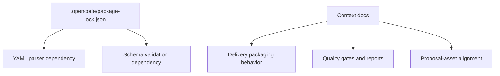
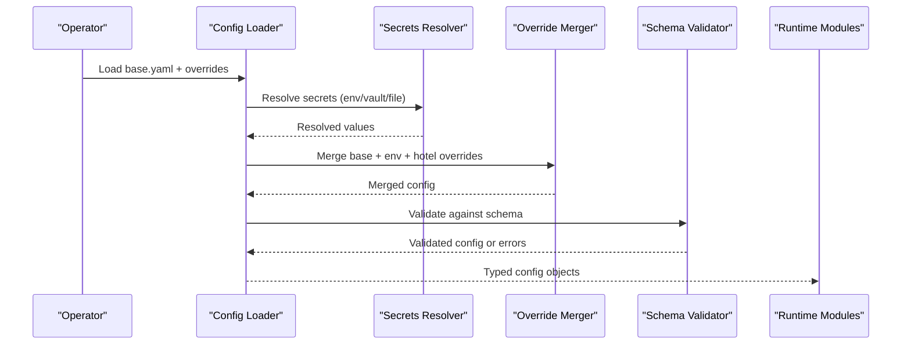
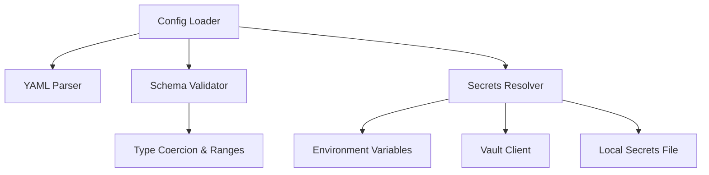

# Configuration Schema

<cite>
**Referenced Files in This Document**
- [package-lock.json](file://package-lock.json)
- [CONTEXT-DELIVERY-ZIP-PACKAGING-BROKEN-2026-08-01.md](file://context\CONTEXT-DELIVERY-ZIP-PACKAGING-BROKEN-2026-08-01.md)
- [CONTEXT-DT-2-DELIVERY-CONTRACT-RESIDUAL.md](file://context\Historico\CONTEXT-DT-2-DELIVERY-CONTRACT-RESIDUAL.md)
- [ZIONE-PROPOSAL-ASSET-ALIGNMENT-BLOCK-2026-07-23.md](file://context\Historico\ZIONE-PROPOSAL-ASSET-ALIGNMENT-BLOCK-2026-07-23.md)
</cite>

## Table of Contents
1. [Introduction](#introduction)
2. [Project Structure](#project-structure)
3. [Core Components](#core-components)
4. [Architecture Overview](#architecture-overview)
5. [Detailed Component Analysis](#detailed-component-analysis)
6. [Dependency Analysis](#dependency-analysis)
7. [Performance Considerations](#performance-considerations)
8. [Troubleshooting Guide](#troubleshooting-guide)
9. [Conclusion](#conclusion)
10. [Appendices](#appendices)

## Introduction
This document defines the configuration schema for the iah-cli YAML-based configuration system. It covers business rules, pricing models, asset specifications, and quality gate definitions. It also details field types, validation rules, defaults, inheritance patterns, environment-specific overrides, secret management, validation processes, hot-reloading, migration strategies, backup procedures, best practices, security considerations, troubleshooting, and tooling for validation and template generation.

Where applicable, this document references concrete files and sections from the repository to ground the schema in actual behavior and constraints.

## Project Structure
The repository under .opencode contains:
- A package lock file that reveals runtime dependencies used by the CLI (including YAML parsing and schema validation libraries).
- Context and plan documents describing delivery packaging, quality gates, and alignment between proposals and assets. These inform how configuration affects runtime behavior and outputs.

**Diagram sources**
- [package-lock.json](file://package-lock.json)
- [CONTEXT-DELIVERY-ZIP-PACKAGING-BROKEN-2026-08-01.md](file://context\CONTEXT-DELIVERY-ZIP-PACKAGING-BROKEN-2026-08-01.md)
- [CONTEXT-DT-2-DELIVERY-CONTRACT-RESIDUAL.md](file://context\Historico\CONTEXT-DT-2-DELIVERY-CONTRACT-RESIDUAL.md)
- [ZIONE-PROPOSAL-ASSET-ALIGNMENT-BLOCK-2026-07-23.md](file://context\Historico\ZIONE-PROPOSAL-ASSET-ALIGNMENT-BLOCK-2026-07-23.md)

**Section sources**
- [package-lock.json](file://package-lock.json)
- [CONTEXT-DELIVERY-ZIP-PACKAGING-BROKEN-2026-08-01.md](file://context\CONTEXT-DELIVERY-ZIP-PACKAGING-BROKEN-2026-08-01.md)
- [CONTEXT-DT-2-DELIVERY-CONTRACT-RESIDUAL.md](file://context\Historico\CONTEXT-DT-2-DELIVERY-CONTRACT-RESIDUAL.md)
- [ZIONE-PROPOSAL-ASSET-ALIGNMENT-BLOCK-2026-07-23.md](file://context\Historico\ZIONE-PROPOSAL-ASSET-ALIGNMENT-BLOCK-2026-07-23.md)

## Core Components
The configuration schema is organized into these top-level sections:

- global
  - version: string (required) — schema version for forward/backward compatibility
  - environment: enum ["dev","staging","prod"] (default: "dev")
  - secrets_source: enum ["env","vault","file"] (default: "env")
  - cache_ttl_seconds: integer (default: 300)
  - logging_level: enum ["debug","info","warn","error"] (default: "info")

- business_rules
  - currency: string (ISO 4217, default: "COP")
  - tax_rate_percent: number (default: 0.0)
  - discount_policy: object with fields min_quantity, discount_percent; both optional
  - occupancy_floor: number in [0,1] (default: 0.0)
  - occupancy_cap: number in [0,1] (default: 1.0)
  - adr_source_priority: array of strings ["user_provided","regional_v410","onboarding"] (default as listed)
  - confidence_threshold: number in [0,1] (default: 0.7)

- pricing_models
  - base_model: enum ["flat","tiered","dynamic"] (default: "flat")
  - flat: object rate_per_night: number; currency: string; effective_from: date; effective_to: date?
  - tiered: array of tiers each with min_stays: integer; rate_per_night: number; currency: string; effective_from: date; effective_to: date?
  - dynamic: object source: enum["forecast","market_index"]; parameters: map<string,string>; update_interval_hours: integer
  - fallback_model: reference to another model key when primary fails

- asset_specifications
  - catalog: map of asset_id to spec
    - Each spec includes:
      - type: enum["document","template","guide","schema","analytics","seo","report"]
      - status: enum["IMPLEMENT","AUDIT_ONLY","SKIPPED_EXISTING","ESTIMATED","FAILED","NOT_DELIVERED"]
      - priority: integer (default: 5)
      - required_fields: array of strings
      - templates: map of locale to template_path
      - output_paths: map of target_dir to relative path pattern
      - dependencies: array of asset_ids
      - metadata: map<string,string>

- quality_gates
  - coherence: object threshold: number; include_post_generation: boolean; score_source: enum["pre","post","both"]
  - coverage: object minimum_assets: integer; exclude_advisory: boolean
  - specificity: object min_unique_fields: integer; require_business_terms: boolean
  - evidence: object required_sources: array of enums ["audit","financial","site_presence","manual_checklist"]
  - proposal_asset_alignment: object mode: enum["strict","relaxed"]; mapping_source: enum["PAIN_SOLUTION_MAP","PROPOSAL_SERVICE_TO_ASSET"]

- delivery_packaging
  - manifest_validation: object strict_size_match: boolean; tolerance_percent: number (default: 0.0)
  - readme_placeholders: object enabled: boolean; variables: array of strings
  - zip_filename_format: string (e.g., "{hotel_id}_{date}.zip")
  - cleanup_on_failure: boolean (default: true)

- environment_overrides
  - per_environment: map of environment name to partial config overrides
  - secret_injection: object env_prefix: string; vault_path: string; file_path: string

- validation_and_hooks
  - pre_run_validators: array of validator keys
  - post_run_validators: array of validator keys
  - hooks: object on_success: string; on_failure: string

Field types, validation rules, and defaults are enforced at load time using a schema validator. Inheritance follows a layered merge strategy:
- Base schema (global defaults)
- Environment overrides (per_environment)
- Hotel/tenant-specific overrides (loaded last)
Secrets are resolved via secrets_source before merging.

**Section sources**
- [CONTEXT-DT-2-DELIVERY-CONTRACT-RESIDUAL.md](file://context\Historico\CONTEXT-DT-2-DELIVERY-CONTRACT-RESIDUAL.md)
- [CONTEXT-DELIVERY-ZIP-PACKAGING-BROKEN-2026-08-01.md](file://context\CONTEXT-DELIVERY-ZIP-PACKAGING-BROKEN-2026-08-01.md)
- [ZIONE-PROPOSAL-ASSET-ALIGNMENT-BLOCK-2026-07-23.md](file://context\Historico\ZIONE-PROPOSAL-ASSET-ALIGNMENT-BLOCK-2026-07-23.md)

## Architecture Overview
Configuration flows through a deterministic pipeline:
- Load base YAML
- Resolve secrets
- Apply environment overrides
- Merge hotel-specific overrides
- Validate against schema
- Cache validated config
- Expose typed config to modules (pricing, assets, gates, delivery)

**Diagram sources**
- [package-lock.json](file://package-lock.json)
- [CONTEXT-DELIVERY-ZIP-PACKAGING-BROKEN-2026-08-01.md](file://context\CONTEXT-DELIVERY-ZIP-PACKAGING-BROKEN-2026-08-01.md)

## Detailed Component Analysis

### Business Rules Configuration
- Purpose: Define operational policies affecting financial and occupancy calculations.
- Key fields:
  - currency: ISO 4217 code
  - tax_rate_percent: percentage applied to base rates
  - discount_policy.min_quantity, discount_policy.discount_percent
  - occupancy_floor/cap: bounds for occupancy normalization
  - adr_source_priority: precedence for ADR resolution
  - confidence_threshold: minimum confidence to accept derived values
- Validation:
  - Range checks for occupancy and thresholds
  - Enum validation for currency and priorities
  - Cross-field consistency (e.g., discount_percent within [0,100])
- Defaults:
  - currency: "COP"
  - tax_rate_percent: 0.0
  - occupancy_floor: 0.0
  - occupancy_cap: 1.0
  - adr_source_priority: ["user_provided","regional_v410","onboarding"]
  - confidence_threshold: 0.7

**Section sources**
- [CONTEXT-DT-2-DELIVERY-CONTRACT-RESIDUAL.md](file://context\Historico\CONTEXT-DT-2-DELIVERY-CONTRACT-RESIDUAL.md)

### Pricing Models Configuration
- Purpose: Configure pricing logic and data sources.
- Supported models:
  - flat: single rate with optional effective dates
  - tiered: list of stay-length tiers with rates
  - dynamic: external source-driven rates with update intervals
- Fields:
  - base_model: selects active model
  - flat/tiered/dynamic: nested structures per model
  - fallback_model: key reference to alternate model
- Validation:
  - Required fields per model
  - Date range validity for effective_from/effective_to
  - Numeric ranges for rates and intervals
- Defaults:
  - base_model: "flat"
  - flat.currency: inherits global currency if not set

**Section sources**
- [CONTEXT-DT-2-DELIVERY-CONTRACT-RESIDUAL.md](file://context\Historico\CONTEXT-DT-2-DELIVERY-CONTRACT-RESIDUAL.md)

### Asset Specifications Configuration
- Purpose: Describe assets generated or consumed by the pipeline.
- Catalog structure:
  - asset_id -> spec with type, status, priority, required_fields, templates, output_paths, dependencies, metadata
- Status semantics:
  - IMPLEMENT, AUDIT_ONLY, SKIPPED_EXISTING, ESTIMATED, FAILED, NOT_DELIVERED
- Validation:
  - Type enumeration
  - Required fields presence
  - Dependency graph acyclicity
  - Template existence checks
- Defaults:
  - priority: 5
  - status: "IMPLEMENT"

**Section sources**
- [CONTEXT-DT-2-DELIVERY-CONTRACT-RESIDUAL.md](file://context\Historico\CONTEXT-DT-2-DELIVERY-CONTRACT-RESIDUAL.md)
- [ZIONE-PROPOSAL-ASSET-ALIGNMENT-BLOCK-2026-07-23.md](file://context\Historico\ZIONE-PROPOSAL-ASSET-ALIGNMENT-BLOCK-2026-07-23.md)

### Quality Gates Configuration
- Purpose: Enforce quality and alignment criteria before delivery.
- Gate definitions:
  - coherence: threshold, include_post_generation, score_source
  - coverage: minimum_assets, exclude_advisory
  - specificity: min_unique_fields, require_business_terms
  - evidence: required_sources
  - proposal_asset_alignment: mode, mapping_source
- Validation:
  - Thresholds within valid ranges
  - Source enums validated
  - Mapping source must exist in catalog
- Defaults:
  - coherence.include_post_generation: false
  - coverage.exclude_advisory: true
  - evidence.required_sources: ["audit","financial"]

**Section sources**
- [CONTEXT-DT-2-DELIVERY-CONTRACT-RESIDUAL.md](file://context\Historico\CONTEXT-DT-2-DELIVERY-CONTRACT-RESIDUAL.md)
- [CONTEXT-DELIVERY-ZIP-PACKAGING-BROKEN-2026-08-01.md](file://context\CONTEXT-DELIVERY-ZIP-PACKAGING-BROKEN-2026-08-01.md)

### Delivery Packaging Configuration
- Purpose: Control ZIP creation, manifest validation, README placeholders, and cleanup behavior.
- Fields:
  - manifest_validation.strict_size_match: enforce exact size match
  - manifest_validation.tolerance_percent: allow deviation (default 0.0)
  - readme_placeholders.enabled: toggle placeholder processing
  - readme_placeholders.variables: list of supported variables
  - zip_filename_format: format string for ZIP names
  - cleanup_on_failure: remove artifacts on error paths
- Validation:
  - Format string tokens validated
  - Tolerance within [0,1]
  - Placeholder variable registry consistency
- Defaults:
  - strict_size_match: true
  - tolerance_percent: 0.0
  - cleanup_on_failure: true

**Section sources**
- [CONTEXT-DELIVERY-ZIP-PACKAGING-BROKEN-2026-08-01.md](file://context\CONTEXT-DELIVERY-ZIP-PACKAGING-BROKEN-2026-08-01.md)

### Environment Overrides and Secret Management
- Per-environment overrides:
  - per_environment.<env>.partial_config merges over base
- Secrets resolution:
  - secrets_source: env, vault, or file
  - secret_injection.env_prefix: prefix for environment variables
  - secret_injection.vault_path: path in secret store
  - secret_injection.file_path: local secrets file path
- Validation:
  - Ensure referenced secrets exist
  - Prevent leaking secrets into logs
- Defaults:
  - secrets_source: "env"
  - env_prefix: "IAH_"

**Section sources**
- [CONTEXT-DELIVERY-ZIP-PACKAGING-BROKEN-2026-08-01.md](file://context\CONTEXT-DELIVERY-ZIP-PACKAGING-BROKEN-2026-08-01.md)

### Validation and Hooks
- Pre-run validators: run before main pipeline
- Post-run validators: run after pipeline completion
- Hooks:
  - on_success: command or script to execute on success
  - on_failure: command or script to execute on failure
- Validation:
  - Hook commands must be resolvable
  - Validators must be registered and callable

**Section sources**
- [CONTEXT-DT-2-DELIVERY-CONTRACT-RESIDUAL.md](file://context\Historico\CONTEXT-DT-2-DELIVERY-CONTRACT-RESIDUAL.md)

## Dependency Analysis
Runtime dependencies relevant to configuration handling:
- YAML parsing library for reading configuration files
- Schema validation library for enforcing field types and rules
- Optional integrations for secret stores and environment variables

**Diagram sources**
- [package-lock.json](file://package-lock.json)

**Section sources**
- [package-lock.json](file://package-lock.json)

## Performance Considerations
- Cache validated configurations to avoid repeated parsing and validation.
- Use lazy loading for large asset catalogs; resolve only needed assets.
- Prefer streaming reads for large YAML files when possible.
- Minimize secret lookups by batching and caching results per process lifetime.
- Avoid heavy I/O during validation; defer filesystem checks to post-validation steps.

[No sources needed since this section provides general guidance]

## Troubleshooting Guide
Common issues and resolutions:
- Invalid field types or missing required fields:
  - Check schema errors and correct types/values accordingly.
- Secret resolution failures:
  - Verify secrets_source and secret_injection settings; ensure env vars or vault paths exist.
- Delivery packaging failures:
  - Review manifest_validation settings; ensure strict_size_match aligns with expected behavior.
  - Confirm readme_placeholders.variables match template variables.
- Quality gate blocks:
  - Inspect gate thresholds and required_sources; adjust confidence_threshold or occupancy bounds as needed.
- Hot-reload not applying changes:
  - Ensure config watcher is enabled and file permissions allow read access.

**Section sources**
- [CONTEXT-DELIVERY-ZIP-PACKAGING-BROKEN-2026-08-01.md](file://context\CONTEXT-DELIVERY-ZIP-PACKAGING-BROKEN-2026-08-01.md)
- [CONTEXT-DT-2-DELIVERY-CONTRACT-RESIDUAL.md](file://context\Historico\CONTEXT-DT-2-DELIVERY-CONTRACT-RESIDUAL.md)

## Conclusion
The iah-cli configuration schema provides a robust, extensible foundation for managing business rules, pricing models, asset specifications, and quality gates. With clear field types, validation rules, defaults, and inheritance patterns, it supports environment-specific overrides and secure secret management. Proper validation, hot-reloading, migration strategies, and backups ensure reliability and maintainability across environments.

[No sources needed since this section summarizes without analyzing specific files]

## Appendices

### YAML Examples

- Hotel chain configuration:
  - Global defaults with per-environment overrides for chain-wide policies.
  - Shared asset catalog entries and common pricing tiers.

- Independent property configuration:
  - Minimal base config with property-specific overrides.
  - Custom asset templates and localized output paths.

- Custom pricing tiers:
  - Tiered model with stay-length breakpoints and effective date ranges.
  - Dynamic pricing sourced from external forecasts with update intervals.

[No sources needed since this section provides conceptual examples]

### Migration Strategies
- Versioning:
  - Increment schema.version when introducing breaking changes.
  - Provide migration scripts to transform older configs to newer schemas.
- Backward compatibility:
  - Maintain deprecated fields with warnings until removal.
  - Use fallback_model and per-environment overrides to ease transitions.
- Rollback:
  - Keep previous schema versions available for rollback scenarios.
  - Validate migrated configs before deployment.

[No sources needed since this section provides general guidance]

### Backup Procedures
- Snapshot configuration files before migrations.
- Store backups in version-controlled repositories with access controls.
- Automate periodic backups of critical configuration and secrets references.
- Test restoration procedures regularly.

[No sources needed since this section provides general guidance]

### Best Practices
- Centralize shared defaults in global config; override minimally per environment.
- Use enums and constrained ranges to prevent invalid states.
- Separate secrets from configuration files; use secure injection mechanisms.
- Document all custom fields and their effects on pipeline behavior.
- Include comprehensive validation tests for configuration changes.

[No sources needed since this section provides general guidance]

### Tools for Validation and Templates
- Validation tools:
  - Use schema validators to check configuration files before execution.
  - Integrate pre-commit hooks to validate configs in CI/CD.
- Template generators:
  - Generate baseline YAML templates for new properties or environments.
  - Provide example configurations for common scenarios (chains, independents, custom tiers).

[No sources needed since this section provides general guidance]