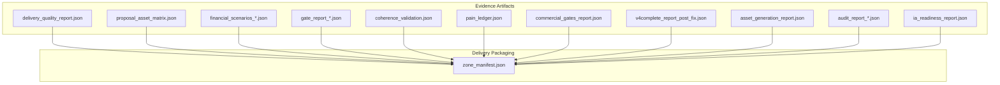
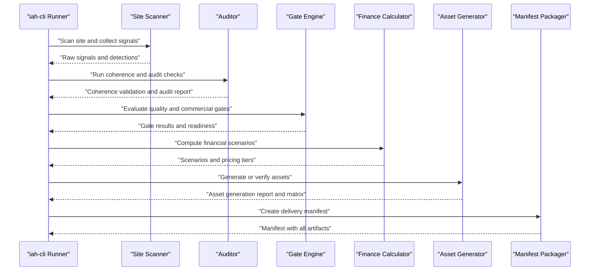
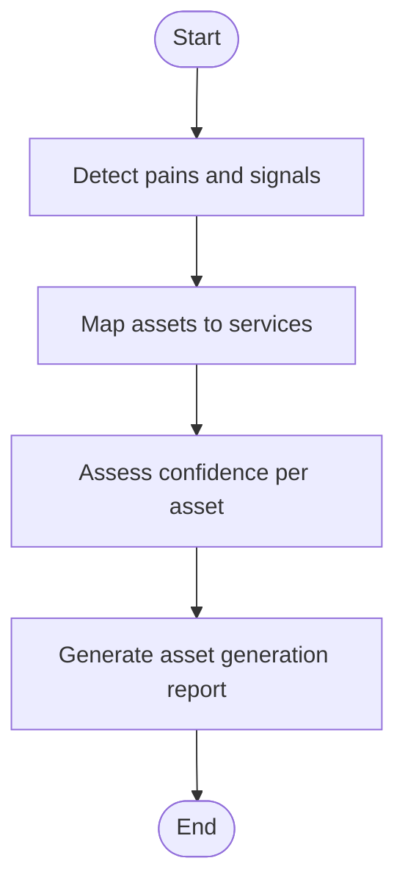
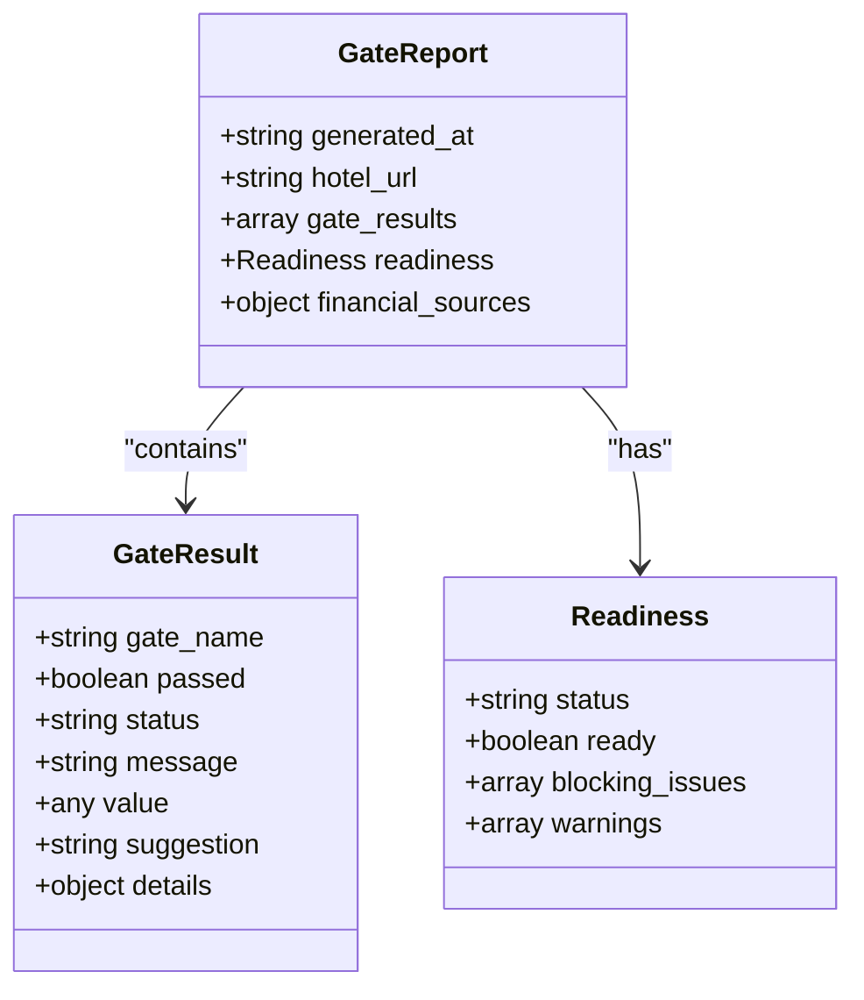
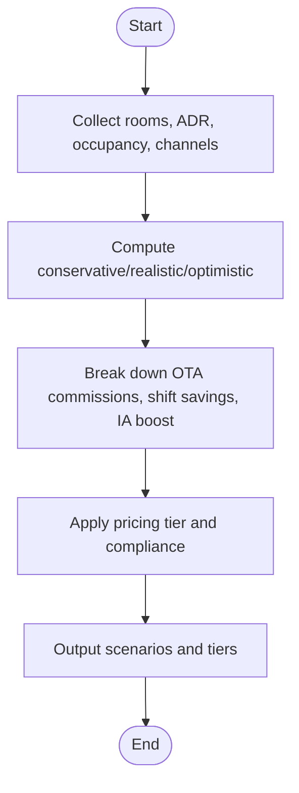
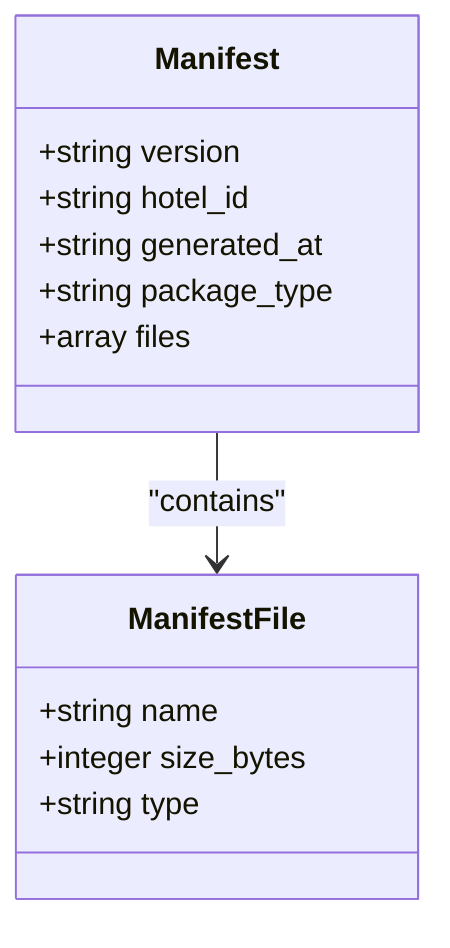
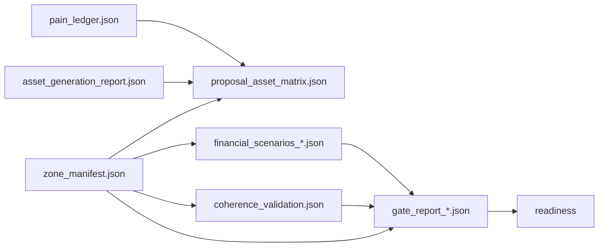

# Data Schemas

<cite>
**Referenced Files in This Document**
- [delivery_quality_report.json](file://plans/Archives/DT-3-TECH-DEBT-2026-07-25/evidence/delivery_quality_report.json)
- [proposal_asset_matrix.json](file://plans/Archives/DT-3-TECH-DEBT-2026-07-25/evidence/proposal_asset_matrix.json)
- [financial_scenarios_20260728_091940.json](file://plans/Archives/DT4-RESIDUAL-FIXES/evidence/FASE-6/financial_scenarios_20260728_091940.json)
- [gate_report_20260727_140459.json](file://plans/Archives/DT-4-ROOT-CAUSE-2026-07-25/evidence/gate_report_20260727_140459.json)
- [coherence_validation.json](file://plans/Archives/DT-3-TECH-DEBT-2026-07-25/evidence/coherence_validation.json)
- [pain_ledger.json](file://plans/Archives/DT-3-TECH-DEBT-2026-07-25/evidence/pain_ledger.json)
- [commercial_gates_report.json](file://plans/Archives/DT-4-ROOT-CAUSE-2026-07-25/evidence/commercial_gates_report.json)
- [v4complete_report_post_fix.json](file://plans/Archives/DT-4-ROOT-CAUSE-2026-07-25/evidence/v4complete_report_post_fix.json)
- [asset_generation_report.json](file://plans/Archives/DT4-RESIDUAL-FIXES/evidence/FASE-6/asset_generation_report.json)
- [audit_report_20260728_091940.json](file://plans/Archives/DT4-RESIDUAL-FIXES/evidence/FASE-6/audit_report_20260728_091940.json)
- [ia_readiness_report.json](file://plans/Archives/DT4-RESIDUAL-FIXES/evidence/FASE-6/ia_readiness_report.json)
- [zone_manifest.json](file://plans/Archives/EVIDENCE-TIER-FALSE-CONFIDENCE-IAO-2026-07-31/evidence/FASE-5/zione/zione_20260731_MANIFEST.json)
</cite>

## Table of Contents
1. Introduction
2. Project Structure
3. Core Components
4. Architecture Overview
5. Detailed Component Analysis
6. Dependency Analysis
7. Performance Considerations
8. Troubleshooting Guide
9. Conclusion

## Introduction
This document defines the data schemas used by the iah-cli system for site presence reports, asset specifications, quality gate results, delivery manifests, and financial analysis outputs. It provides field definitions, types, validation rules, relationships, and evolution guidance. It also explains serialization/deserialization patterns, transformation pipelines, and validation workflows with practical examples and troubleshooting techniques.

## Project Structure
The repository contains evidence artifacts produced by iah-cli runs. The most relevant JSON schemas are stored under plans/Archives/*/evidence directories and a manifest file that catalogs generated assets per run.

[No sources needed since this diagram shows conceptual workflow, not actual code structure]

## Core Components
This section documents the primary JSON schemas observed across iah-cli evidence files. Each schema includes:
- Purpose
- Top-level fields and nested structures
- Types and constraints
- Validation rules and relationships
- Example usage references (by file path)

### Site Presence Reports
Site presence is captured via asset alignment matrices and asset generation reports. These define what assets exist or are missing, their confidence, and linkage to services.

#### Asset Alignment Matrix Schema
- Purpose: Maps proposed services to concrete assets and their alignment status.
- Key fields:
  - alignment_status_version: string version tag
  - delivery_ready: boolean indicating overall readiness
  - entries: array of alignment items
    - alignment: enum {linked, missing_asset, no_breach}
    - asset_path: string | null
    - asset_type: string identifier for asset kind
    - confidence: number in [0,1]
    - pain_ids: array of strings referencing detected pains
    - service_name: string human-readable service name
    - status: enum {LINKED, MISSING_ASSET, NO_BREACH}
  - proposal_asset_matrix_version: string version tag
- Validation rules:
  - confidence must be between 0 and 1 inclusive
  - status must match alignment semantics
  - pain_ids should be non-empty when alignment indicates a breach or missing asset
- Relationships:
  - Entries link service_name to asset_type; pain_ids connect to pain ledger
- Example reference: [proposal_asset_matrix.json](file://plans/Archives/DT-3-TECH-DEBT-2026-07-25/evidence/proposal_asset_matrix.json)

#### Asset Generation Report Schema
- Purpose: Summarizes asset generation outcomes per asset type.
- Typical fields inferred from naming and context:
  - total_assets: integer count
  - generated: integer count successfully generated
  - failed: integer count failures
  - failure_rate: float ratio
  - details: object with additional metrics
- Validation rules:
  - counts must be non-negative integers
  - failure_rate must be within [0,1]
- Example reference: [asset_generation_report.json](file://plans/Archives/DT4-RESIDUAL-FIXES/evidence/FASE-6/asset_generation_report.json)

**Section sources**
- [proposal_asset_matrix.json:1-92](file://plans/Archives/DT-3-TECH-DEBT-2026-07-25/evidence/proposal_asset_matrix.json#L1-L92)
- [asset_generation_report.json:1-200](file://plans/Archives/DT4-RESIDUAL-FIXES/evidence/FASE-6/asset_generation_report.json#L1-L200)

### Quality Gate Results
Quality gates evaluate coherence, coverage, financial validity, ethics, content quality, and asset confidence.

#### Gate Report Schema
- Purpose: Aggregates multiple gate checks with pass/fail/warning statuses and messages.
- Key fields:
  - generated_at: ISO timestamp
  - hotel_url: string URL
  - gate_results: array of gate objects
    - gate_name: string identifier
    - passed: boolean
    - status: enum {PASSED, WARNING, FAILED}
    - message: string explanation
    - value: number | boolean | null depending on gate
    - suggestion: string remediation advice
    - details: object with gate-specific metrics
  - readiness: object summarizing overall readiness
    - status: enum {READY, NOT_READY}
    - ready: boolean
    - blocking_issues: array of issue objects
      - gate: string
      - message: string
      - suggestion: string
      - value: number | null
    - warnings: array of warning objects
  - financial_sources: object mapping inputs to source tags
- Validation rules:
  - gate_results must include all required gates for the pipeline
  - readiness.status must reflect the union of gate statuses
  - blocking_issues must list all FAILED gates
- Relationships:
  - readiness depends on gate_results; financial_sources feed financial_validity gate
- Example reference: [gate_report_20260727_140459.json](file://plans/Archives/DT-4-ROOT-CAUSE-2026-07-25/evidence/gate_report_20260727_140459.json)

#### Commercial Gates Report Schema
- Purpose: Higher-level commercial gating decisions derived from technical gates and business rules.
- Typical fields inferred from naming and context:
  - status: enum {PASS, FAIL, WARNING}
  - blocking: boolean whether the report blocks delivery
  - summary: object with counts and scores
- Validation rules:
  - Must align with underlying gate_results where applicable
- Example reference: [commercial_gates_report.json](file://plans/Archives/DT-4-ROOT-CAUSE-2026-07-25/evidence/commercial_gates_report.json)

#### Delivery Quality Report Schema
- Purpose: Consolidated view of specific quality gates such as coverage, proposal alignment, asset specificity, and evidence availability.
- Key fields:
  - status: enum {PASS, FAIL}
  - blocking: boolean
  - coverage_gate: object with passed, details, gate
  - proposal_asset_gate: object with passed, gate, aligned, total
  - asset_specificity_gate: object with passed, details, gate
  - evidence_gate: object with passed, details, gate
  - advisory_warnings: array of strings
  - human_review_items: array of strings
  - summary: object with totals, scores, and lists of blocking/warning gates
- Validation rules:
  - All gate objects must have consistent passed booleans and gate identifiers
  - summary counts must match underlying gate details
- Example reference: [delivery_quality_report.json](file://plans/Archives/DT-3-TECH-DEBT-2026-07-25/evidence/delivery_quality_report.json)

#### Coherence Validation Schema
- Purpose: Validates internal consistency across problems, solutions, assets, pricing, and promises.
- Key fields:
  - is_coherent: boolean
  - overall_score: number in [0,1]
  - checks: array of check objects
    - name: string
    - passed: boolean
    - score: number
    - message: string
    - severity: enum {info, warning, error}
  - errors: array of strings
  - warnings: array of strings
  - timestamp: ISO timestamp
  - version: string
- Validation rules:
  - overall_score should reflect weighted aggregation of checks
  - errors must correspond to failed checks with severity error
- Example reference: [coherence_validation.json](file://plans/Archives/DT-3-TECH-DEBT-2026-07-25/evidence/coherence_validation.json)

#### IA Readiness Report Schema
- Purpose: Indicates readiness for AI-driven features based on data availability and quality.
- Typical fields inferred from naming and context:
  - readiness: boolean
  - score: number
  - blockers: array of strings
- Validation rules:
  - Must align with coherence and financial tiers
- Example reference: [ia_readiness_report.json](file://plans/Archives/DT4-RESIDUAL-FIXES/evidence/FASE-6/ia_readiness_report.json)

**Section sources**
- [gate_report_20260727_140459.json:1-199](file://plans/Archives/DT-4-ROOT-CAUSE-2026-07-25/evidence/gate_report_20260727_140459.json#L1-L199)
- [commercial_gates_report.json:1-200](file://plans/Archives/DT-4-ROOT-CAUSE-2026-07-25/evidence/commercial_gates_report.json#L1-L200)
- [delivery_quality_report.json:1-51](file://plans/Archives/DT-3-TECH-DEBT-2026-07-25/evidence/delivery_quality_report.json#L1-L51)
- [coherence_validation.json:1-55](file://plans/Archives/DT-3-TECH-DEBT-2026-07-25/evidence/coherence_validation.json#L1-L55)
- [ia_readiness_report.json:1-200](file://plans/Archives/DT4-RESIDUAL-FIXES/evidence/FASE-6/ia_readiness_report.json#L1-L200)

### Financial Analysis Outputs
Financial scenarios provide revenue estimates, cost breakdowns, pricing tiers, and evidence precision levels.

#### Financial Scenarios Schema
- Purpose: Computes expected monthly revenue and scenario-based projections with transparent assumptions.
- Key fields:
  - hotel: string
  - url: string URL
  - input_data: object
    - rooms: integer
    - adr_cop: number
    - adr_source: string tag
    - occupancy_rate: number in [0,1]
    - direct_channel_percentage: number in [0,1]
  - scenarios: object with conservative, realistic, optimistic values
  - expected_monthly_cop: number
  - breakdown: object detailing OTAs, shift savings, IA boost, evidence tier, disclaimer, data_sources
  - pricing: object with tier, monthly_price_cop, pain_ratio, is_compliant, source
  - precision_tier: string
  - can_show_exact_money: boolean
  - tier_explanation: object explaining evidence and precision tiers and their relationship
- Validation rules:
  - input_data fields must be valid ranges and present
  - scenarios values must be numeric and consistent with expected_monthly_cop logic
  - breakdown.data_sources must explain each assumption
  - pricing.is_compliant reflects policy thresholds
- Example reference: [financial_scenarios_20260728_091940.json](file://plans/Archives/DT4-RESIDUAL-FIXES/evidence/FASE-6/financial_scenarios_20260728_091940.json)

**Section sources**
- [financial_scenarios_20260728_091940.json:1-53](file://plans/Archives/DT4-RESIDUAL-FIXES/evidence/FASE-6/financial_scenarios_20260728_091940.json#L1-L53)

### Delivery Manifests
Delivery manifests catalog all artifacts produced in a run, including diagnostics, proposals, assets, guides, and audit reports.

#### Manifest Schema
- Purpose: Provides an inventory of files with metadata for packaging and verification.
- Key fields:
  - version: string semantic version
  - hotel_id: string identifier
  - generated_at: ISO timestamp
  - package_type: string category
  - files: array of file descriptors
    - name: string relative path
    - size_bytes: integer
    - type: enum {diagnostic, proposal, schema, guide, code, other}
- Validation rules:
  - All referenced files must exist at runtime
  - size_bytes must match actual file sizes
- Example reference: [zone_manifest.json](file://plans/Archives/EVIDENCE-TIER-FALSE-CONFIDENCE-IAO-2026-07-31/evidence/FASE-5/zione/zione_20260731_MANIFEST.json)

**Section sources**
- [zone_manifest.json:1-800](file://plans/Archives/EVIDENCE-TIER-FALSE-CONFIDENCE-IAO-2026-07-31/evidence/FASE-5/zione/zione_20260731_MANIFEST.json#L1-L800)

### Additional Evidence Schemas
These schemas support auditing, completeness, and post-fix validation.

#### Audit Report Schema
- Purpose: Comprehensive audit output aggregating multiple validations and findings.
- Typical fields inferred from naming and context:
  - generated_at: ISO timestamp
  - hotel_url: string
  - sections: object containing various audit categories
  - summary: object with pass/fail counts and scores
- Validation rules:
  - Must be consistent with gate reports and coherence validation
- Example reference: [audit_report_20260728_091940.json](file://plans/Archives/DT4-RESIDUAL-FIXES/evidence/FASE-6/audit_report_20260728_091940.json)

#### Pain Ledger Schema
- Purpose: Catalogs detected pains with confidence, severity, and provenance.
- Key fields:
  - entries: array of pain objects
    - confidence: number in [0,1]
    - evidence_refs: array of strings
    - human_label: string
    - pain_id: string unique identifier
    - severity: enum {HIGH, MEDIUM, LOW}
    - source_file: string module origin
    - source_module: string component name
    - status: enum {DETECTED, RESOLVED, SKIPPED}
  - pain_ledger_version: string version tag
- Validation rules:
  - pain_id must be unique per entry
  - confidence and severity must be consistent with detection logic
- Example reference: [pain_ledger.json](file://plans/Archives/DT-3-TECH-DEBT-2026-07-25/evidence/pain_ledger.json)

#### V4 Complete Report Post Fix Schema
- Purpose: Finalized report after fixes, consolidating all validations and readiness.
- Typical fields inferred from naming and context:
  - generated_at: ISO timestamp
  - hotel_url: string
  - sections: aggregated results from audits, gates, coherence, financials
  - readiness: object similar to gate report readiness
- Validation rules:
  - Must reflect resolved issues and updated scores
- Example reference: [v4complete_report_post_fix.json](file://plans/Archives/DT-4-ROOT-CAUSE-2026-07-25/evidence/v4complete_report_post_fix.json)

**Section sources**
- [audit_report_20260728_091940.json:1-200](file://plans/Archives/DT4-RESIDUAL-FIXES/evidence/FASE-6/audit_report_20260728_091940.json#L1-L200)
- [pain_ledger.json:1-95](file://plans/Archives/DT-3-TECH-DEBT-2026-07-25/evidence/pain_ledger.json#L1-L95)
- [v4complete_report_post_fix.json:1-200](file://plans/Archives/DT-4-ROOT-CAUSE-2026-07-25/evidence/v4complete_report_post_fix.json#L1-L200)

## Architecture Overview
The iah-cli pipeline produces interconnected artifacts. Gate reports drive readiness; coherence validation ensures internal consistency; financial scenarios quantify value; asset matrices map promises to deliverables; manifests package everything for delivery.

[No sources needed since this diagram shows conceptual workflow, not actual code structure]

## Detailed Component Analysis

### Site Presence Reports
- Asset alignment maps services to assets with confidence and status.
- Asset generation summarizes success/failure rates.
- Validation:
  - Confidence bounds and status alignment
  - Consistency with pain ledger and asset paths

[No sources needed since this diagram shows conceptual workflow, not actual code structure]

**Section sources**
- [proposal_asset_matrix.json:1-92](file://plans/Archives/DT-3-TECH-DEBT-2026-07-25/evidence/proposal_asset_matrix.json#L1-L92)
- [asset_generation_report.json:1-200](file://plans/Archives/DT4-RESIDUAL-FIXES/evidence/FASE-6/asset_generation_report.json#L1-L200)

### Quality Gate Results
- Gate engine evaluates multiple dimensions and aggregates readiness.
- Validation:
  - Gate statuses must be consistent with messages and values
  - Readiness must reflect blocked and warning conditions

**Diagram sources**
- [gate_report_20260727_140459.json:1-199](file://plans/Archives/DT-4-ROOT-CAUSE-2026-07-25/evidence/gate_report_20260727_140459.json#L1-L199)

**Section sources**
- [gate_report_20260727_140459.json:1-199](file://plans/Archives/DT-4-ROOT-CAUSE-2026-07-25/evidence/gate_report_20260727_140459.json#L1-L199)

### Financial Analysis Outputs
- Financial calculator uses input parameters and benchmarks to produce scenarios and pricing.
- Validation:
  - Input ranges and source tags
  - Scenario consistency and tier explanations

[No sources needed since this diagram shows conceptual workflow, not actual code structure]

**Section sources**
- [financial_scenarios_20260728_091940.json:1-53](file://plans/Archives/DT4-RESIDUAL-FIXES/evidence/FASE-6/financial_scenarios_20260728_091940.json#L1-L53)

### Delivery Manifests
- Manifest packages all artifacts with metadata for distribution.
- Validation:
  - File existence and size integrity
  - Type categorization correctness

**Diagram sources**
- [zone_manifest.json:1-800](file://plans/Archives/EVIDENCE-TIER-FALSE-CONFIDENCE-IAO-2026-07-31/evidence/FASE-5/zione/zione_20260731_MANIFEST.json#L1-L800)

**Section sources**
- [zone_manifest.json:1-800](file://plans/Archives/EVIDENCE-TIER-FALSE-CONFIDENCE-IAO-2026-07-31/evidence/FASE-5/zione/zione_20260731_MANIFEST.json#L1-L800)

## Dependency Analysis
Schemas interrelate through shared identifiers and cross-references:
- proposal_asset_matrix.entries.pain_ids reference pain_ledger.entries.pain_id
- gate_results.financial_validity depends on financial_scenarios.input_data and breakdown.data_sources
- readiness.blocking_issues derive from gate_results.failed gates
- manifest.files enumerate all artifact outputs

**Diagram sources**
- [pain_ledger.json:1-95](file://plans/Archives/DT-3-TECH-DEBT-2026-07-25/evidence/pain_ledger.json#L1-L95)
- [proposal_asset_matrix.json:1-92](file://plans/Archives/DT-3-TECH-DEBT-2026-07-25/evidence/proposal_asset_matrix.json#L1-L92)
- [financial_scenarios_20260728_091940.json:1-53](file://plans/Archives/DT4-RESIDUAL-FIXES/evidence/FASE-6/financial_scenarios_20260728_091940.json#L1-L53)
- [gate_report_20260727_140459.json:1-199](file://plans/Archives/DT-4-ROOT-CAUSE-2026-07-25/evidence/gate_report_20260727_140459.json#L1-L199)
- [coherence_validation.json:1-55](file://plans/Archives/DT-3-TECH-DEBT-2026-07-25/evidence/coherence_validation.json#L1-L55)
- [asset_generation_report.json:1-200](file://plans/Archives/DT4-RESIDUAL-FIXES/evidence/FASE-6/asset_generation_report.json#L1-L200)
- [zone_manifest.json:1-800](file://plans/Archives/EVIDENCE-TIER-FALSE-CONFIDENCE-IAO-2026-07-31/evidence/FASE-5/zione/zione_20260731_MANIFEST.json#L1-L800)

**Section sources**
- [pain_ledger.json:1-95](file://plans/Archives/DT-3-TECH-DEBT-2026-07-25/evidence/pain_ledger.json#L1-L95)
- [proposal_asset_matrix.json:1-92](file://plans/Archives/DT-3-TECH-DEBT-2026-07-25/evidence/proposal_asset_matrix.json#L1-L92)
- [financial_scenarios_20260728_091940.json:1-53](file://plans/Archives/DT4-RESIDUAL-FIXES/evidence/FASE-6/financial_scenarios_20260728_091940.json#L1-L53)
- [gate_report_20260727_140459.json:1-199](file://plans/Archives/DT-4-ROOT-CAUSE-2026-07-25/evidence/gate_report_20260727_140459.json#L1-L199)
- [coherence_validation.json:1-55](file://plans/Archives/DT-3-TECH-DEBT-2026-07-25/evidence/coherence_validation.json#L1-L55)
- [asset_generation_report.json:1-200](file://plans/Archives/DT4-RESIDUAL-FIXES/evidence/FASE-6/asset_generation_report.json#L1-L200)
- [zone_manifest.json:1-800](file://plans/Archives/EVIDENCE-TIER-FALSE-CONFIDENCE-IAO-2026-07-31/evidence/FASE-5/zione/zione_20260731_MANIFEST.json#L1-L800)

## Performance Considerations
- Serialization: Use compact JSON for large artifacts; consider streaming for very large manifests.
- Validation: Perform incremental validation during pipeline stages to fail fast.
- Caching: Cache intermediate results like coherence scores and financial calculations to avoid recomputation.
- Memory: Stream asset generation reports to reduce memory footprint when processing many assets.

[No sources needed since this section provides general guidance]

## Troubleshooting Guide
Common data-related issues and debugging techniques:
- Missing pain coverage: Check gate_report.coverage_no_silent_drop.uncovered and ensure pain_ledger includes all detected pains.
- Low asset confidence: Review proposal_asset_matrix.entries.confidence and validate asset_path presence.
- Financial tier downgrade: Inspect financial_scenarios.breakdown.data_sources and ensure GA4 integration improves evidence tier.
- Readiness blocked: Examine readiness.blocking_issues and resolve corresponding gate failures.
- Manifest integrity: Verify manifest.files.size_bytes matches actual files and types are correct.

Validation tools and practices:
- Implement JSON schema validators for each artifact type.
- Add unit tests for boundary conditions (confidence bounds, percentage ranges).
- Log detailed error messages from coherence checks and gate suggestions.

**Section sources**
- [gate_report_20260727_140459.json:1-199](file://plans/Archives/DT-4-ROOT-CAUSE-2026-07-25/evidence/gate_report_20260727_140459.json#L1-L199)
- [proposal_asset_matrix.json:1-92](file://plans/Archives/DT-3-TECH-DEBT-2026-07-25/evidence/proposal_asset_matrix.json#L1-L92)
- [financial_scenarios_20260728_091940.json:1-53](file://plans/Archives/DT4-RESIDUAL-FIXES/evidence/FASE-6/financial_scenarios_20260728_091940.json#L1-L53)
- [coherence_validation.json:1-55](file://plans/Archives/DT-3-TECH-DEBT-2026-07-25/evidence/coherence_validation.json#L1-L55)
- [zone_manifest.json:1-800](file://plans/Archives/EVIDENCE-TIER-FALSE-CONFIDENCE-IAO-2026-07-31/evidence/FASE-5/zione/zione_20260731_MANIFEST.json#L1-L800)

## Conclusion
The iah-cli data schemas provide a robust foundation for site presence reporting, asset specification, quality gating, financial analysis, and delivery packaging. By adhering to defined field types, validation rules, and relationships, teams can ensure consistency, traceability, and reliability across runs. Versioned schemas and clear evolution strategies support backward compatibility and continuous improvement.

[No sources needed since this section summarizes without analyzing specific files]