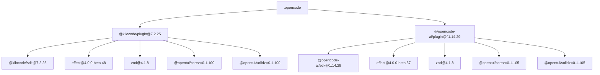
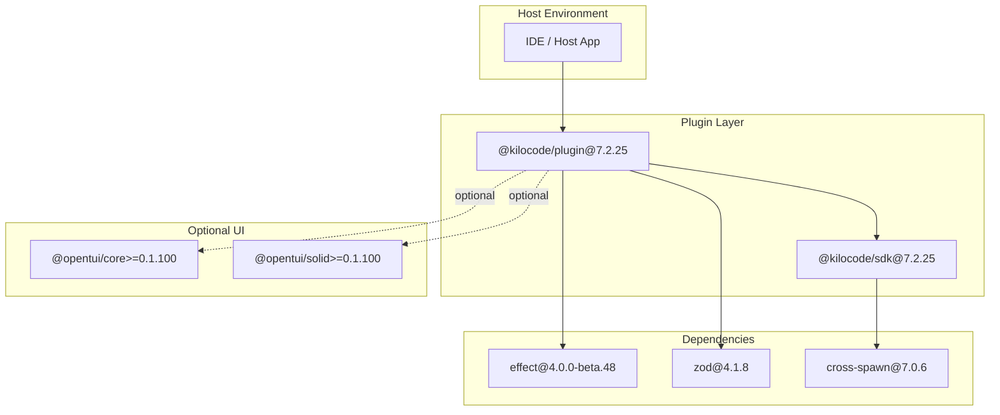
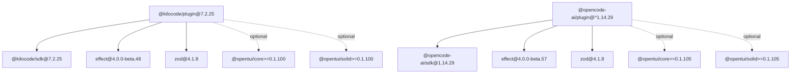

# @kilocode Plugin System

<cite>
**Referenced Files in This Document**
- [package-lock.json](file://package-lock.json)
</cite>

## Table of Contents
1. [Introduction](#introduction)
2. [Project Structure](#project-structure)
3. [Core Components](#core-components)
4. [Architecture Overview](#architecture-overview)
5. [Detailed Component Analysis](#detailed-component-analysis)
6. [Dependency Analysis](#dependency-analysis)
7. [Performance Considerations](#performance-considerations)
8. [Troubleshooting Guide](#troubleshooting-guide)
9. [Conclusion](#conclusion)
10. [Appendices](#appendices)

## Introduction
This document provides a comprehensive guide to the @kilocode plugin system (v7.2.25) as it is used within this repository. The focus is on code intelligence and development tooling capabilities, including how plugins integrate with the SDK, event-driven workflows, UI extensions via opentui, and dependency management using effect and zod. It also covers configuration, manifest expectations, distribution approaches, debugging strategies, performance optimization, testing practices, and migration guidance for upgrades while maintaining backward compatibility.

## Project Structure
The repository includes a lock file that records the exact versions and dependencies of the @kilocode plugin and its SDK, along with related libraries. This section summarizes the relevant parts of the dependency graph visible in the lock file.

**Diagram sources**
- [package-lock.json:1-428](file://package-lock.json#L1-L428)

**Section sources**
- [package-lock.json:1-428](file://package-lock.json#L1-L428)

## Core Components
- @kilocode/plugin (v7.2.25): The primary plugin runtime that integrates with the host environment and exposes extension points for code intelligence and tooling.
- @kilocode/sdk (v7.2.25): The SDK package providing interfaces and utilities for building plugins, including cross-platform process execution helpers.
- effect (v4.0.0-beta.48): Functional effects library used by the plugin for composable asynchronous operations and error handling.
- zod (v4.1.8): Runtime schema validation library used to validate plugin configurations and payloads.
- opentui peer dependencies (@opentui/core, @opentui/solid): Optional UI framework integration for extending IDE UI components.

Key observations from the lock file:
- The plugin depends on the SDK and uses effect and zod for runtime behavior and validation.
- UI extensions are optional via peer dependencies to opentui packages.
- The SDK relies on cross-spawn for cross-platform command execution.

**Section sources**
- [package-lock.json:12-43](file://package-lock.json#L12-L43)

## Architecture Overview
The plugin architecture centers around a plugin runtime that loads and manages plugins, which use the SDK to interact with the host environment. Plugins can extend code intelligence features (e.g., analysis, refactoring), automate development workflows, and optionally contribute UI elements through opentui.

**Diagram sources**
- [package-lock.json:12-43](file://package-lock.json#L12-L43)
- [package-lock.json:35-43](file://package-lock.json#L35-L43)
- [package-lock.json:202-219](file://package-lock.json#L202-L219)
- [package-lock.json:419-425](file://package-lock.json#L419-L425)
- [package-lock.json:178-191](file://package-lock.json#L178-L191)

## Detailed Component Analysis

### Plugin Runtime and SDK Integration
- The plugin runtime coordinates lifecycle events and invokes SDK methods to perform code analysis and automation tasks.
- The SDK exposes cross-platform utilities (via cross-spawn) for executing commands and interacting with external tools.
- Validation of inputs and outputs is performed using zod schemas to ensure robustness and type safety at runtime.
- Asynchronous operations and error propagation are handled through the effect library, enabling predictable control flow.

Practical implications:
- Implement custom analyzers by composing effect-based operations and validating data with zod.
- Use SDK helpers to run linters, formatters, or language servers reliably across platforms.

**Section sources**
- [package-lock.json:12-43](file://package-lock.json#L12-L43)
- [package-lock.json:35-43](file://package-lock.json#L35-L43)
- [package-lock.json:202-219](file://package-lock.json#L202-L219)
- [package-lock.json:419-425](file://package-lock.json#L419-L425)
- [package-lock.json:178-191](file://package-lock.json#L178-L191)

### UI Extensions with opentui
- UI extensions are optional and integrated via peer dependencies to @opentui/core and @opentui/solid.
- Plugins can contribute panels, menus, or interactive widgets that render within the host IDE using these libraries.
- Version constraints ensure compatibility between the plugin and the UI frameworks.

Best practices:
- Keep UI logic decoupled from core analysis logic.
- Validate UI state and user input with zod before invoking SDK operations.

**Section sources**
- [package-lock.json:22-33](file://package-lock.json#L22-L33)

### Configuration and Manifest Expectations
- While specific manifest fields are not present in this repository snapshot, typical plugin manifests include metadata, version constraints, and capability declarations.
- Use zod to define and validate configuration schemas for plugins, ensuring consistent settings across environments.
- Store configuration in standard locations recognized by the host (e.g., project-level files or global config directories).

Guidance:
- Define strict schemas for all configurable options.
- Provide default values and clear error messages when validation fails.

[No sources needed since this section provides general guidance]

### Event System and Lifecycle
- The plugin runtime typically emits lifecycle events (e.g., initialization, activation, deactivation) and domain-specific events (e.g., file change, symbol resolution).
- Plugins subscribe to events to trigger analysis, suggestions, or automated actions.
- Use effect to manage async event handlers and ensure proper resource cleanup.

Implementation tips:
- Centralize event registration and unregistration to avoid memory leaks.
- Debounce high-frequency events like file changes to reduce overhead.

[No sources needed since this section provides general guidance]

### Data Structures for Code Intelligence
- Common structures include diagnostics, code actions, completions, and semantic symbols.
- Validate payloads with zod to maintain consistency and prevent runtime errors.
- Cache results where appropriate to improve performance.

Example patterns:
- Represent diagnostics as immutable objects with severity, range, message, and source.
- Use typed enums for statuses and categories.

[No sources needed since this section provides general guidance]

### Practical Examples
- Custom Code Analyzer: Compose effect-based steps to parse code, analyze AST, and emit diagnostics validated by zod.
- Refactoring Tool: Implement transformations that produce safe edits, validated against schema constraints before applying.
- Development Assistant: Hook into editor events to provide contextual suggestions based on project context and user intent.

[No sources needed since this section provides general guidance]

## Dependency Analysis
The lock file reveals a clear separation between the plugin runtime, SDK, and optional UI integrations. It also highlights potential version mismatches between @kilocode/plugin and @opencode-ai/plugin regarding the effect library.

**Diagram sources**
- [package-lock.json:12-43](file://package-lock.json#L12-L43)
- [package-lock.json:122-144](file://package-lock.json#L122-L144)
- [package-lock.json:145-162](file://package-lock.json#L145-L162)

Potential issues:
- Different versions of effect may lead to incompatibilities if shared modules expect a single instance.
- Ensure peer dependencies for opentui are satisfied by the host environment.

Mitigation strategies:
- Align effect versions across plugins where possible.
- Pin opentui versions in the host to meet plugin requirements.

**Section sources**
- [package-lock.json:12-43](file://package-lock.json#L12-L43)
- [package-lock.json:122-144](file://package-lock.json#L122-L144)
- [package-lock.json:145-162](file://package-lock.json#L145-L162)

## Performance Considerations
- Prefer lazy evaluation and memoization in effect-based pipelines to avoid redundant computations.
- Cache expensive analysis results keyed by file content hashes or timestamps.
- Debounce and throttle frequent events (e.g., save, cursor movement) to reduce CPU usage.
- Use streaming APIs where available to process large files incrementally.
- Minimize synchronous blocking operations; offload heavy work to worker processes or background tasks.

[No sources needed since this section provides general guidance]

## Troubleshooting Guide
Common issues and resolutions:
- Missing opentui peer dependencies: Install compatible versions of @opentui/core and @opentui/solid in the host environment.
- Version conflicts with effect: Align effect versions across plugins or isolate instances to prevent module duplication.
- Validation failures: Inspect zod error messages to identify invalid configuration or payload structures.
- Cross-platform command execution: Verify cross-spawn availability and correct PATH configuration for external tools.

Debugging strategies:
- Enable verbose logging in the plugin runtime to trace event flows and errors.
- Use structured logs with correlation IDs to track requests across async boundaries.
- Write unit tests for analyzers and refactoring functions using fast-check for property-based testing.

**Section sources**
- [package-lock.json:22-33](file://package-lock.json#L22-L33)
- [package-lock.json:145-162](file://package-lock.json#L145-L162)
- [package-lock.json:419-425](file://package-lock.json#L419-L425)
- [package-lock.json:178-191](file://package-lock.json#L178-L191)

## Conclusion
The @kilocode plugin system (v7.2.25) provides a robust foundation for building code intelligence and development tooling plugins. By leveraging the SDK, effect, and zod, developers can create reliable, validated, and composable extensions. Optional UI integration via opentui enables rich IDE experiences. Careful attention to dependency alignment, performance optimization, and testing ensures stable and scalable plugins.

[No sources needed since this section summarizes without analyzing specific files]

## Appendices

### Migration and Upgrade Guidance
- Upgrade path: When moving to newer versions of @kilocode/plugin or @kilocode/sdk, review changelogs for breaking changes in SDK interfaces and event contracts.
- Backward compatibility: Maintain support for older plugin versions during transition periods by detecting runtime capabilities and adapting behavior accordingly.
- Dependency alignment: Resolve version mismatches, especially for shared libraries like effect and opentui, to avoid runtime conflicts.
- Testing strategy: Run comprehensive test suites covering analyzers, refactoring tools, and UI components after upgrades.

[No sources needed since this section provides general guidance]