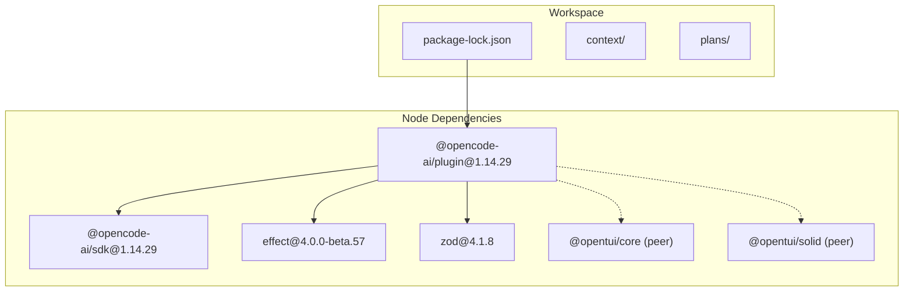
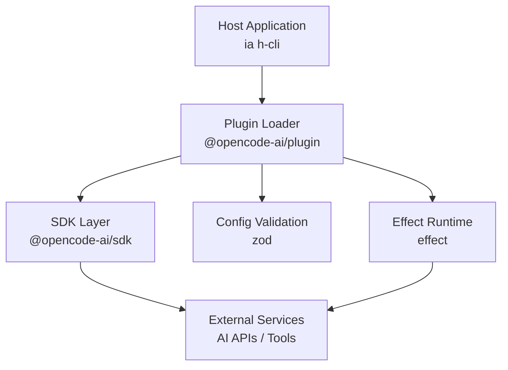
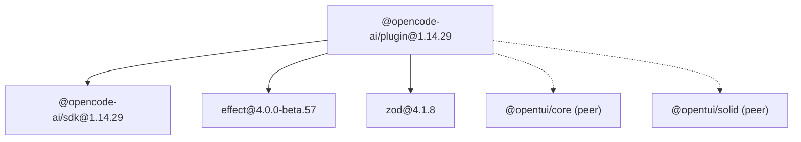

# @opencode-ai Plugin System

<cite>
**Referenced Files in This Document**
- [package-lock.json](file://package-lock.json)
</cite>

## Table of Contents
1. [Introduction](#introduction)
2. [Project Structure](#project-structure)
3. [Core Components](#core-components)
4. [Architecture Overview](#architecture-overview)
5. [Detailed Component Analysis](#detailed-component-analysis)
6. [Dependency Analysis](#dependency-analysis)
7. [Performance Considerations](#performance-considerations)
8. [Troubleshooting Guide](#troubleshooting-guide)
9. [Conclusion](#conclusion)
10. [Appendices](#appendices)

## Introduction
This document provides comprehensive documentation for the @opencode-ai plugin system (v1.14.29) as used by the iah-cli project. It explains the plugin architecture, SDK interfaces, integration patterns, and how to develop custom AI-powered plugins using the @opencode-ai/sdk. It also covers lifecycle hooks, event handling, data exchange mechanisms, registration process, configuration schema, dependency management with effect and zod libraries, communication protocols, error handling strategies using functional programming patterns, debugging techniques, versioning and compatibility matrices, deployment considerations, testing guidelines, and integration into the commercial proposal generation pipeline.

The information is derived from the repository’s package-lock.json which records the exact versions and dependencies of the @opencode-ai/plugin and @opencode-ai/sdk packages consumed by the project.

## Project Structure
At a high level, the .opencode workspace includes:
- A package-lock.json that pins the Node.js dependencies for the project, including @opencode-ai/plugin and its peer and transitive dependencies.
- Context and plans directories containing development artifacts, plans, and evidence files related to delivery and feature work. These are not part of the runtime plugin system but provide operational context.

**Diagram sources**
- [package-lock.json:122-144](file://package-lock.json#L122-L144)
- [package-lock.json:163-171](file://package-lock.json#L163-L171)

**Section sources**
- [package-lock.json:1-200](file://package-lock.json#L1-L200)

## Core Components
- @opencode-ai/plugin (v1.14.29): The core plugin package that integrates with the host application (ia h-cli). It depends on @opencode-ai/sdk, effect, and zod.
- @opencode-ai/sdk (v1.14.29): The SDK providing primitives for building AI-powered plugins, including utilities for cross-platform spawning and common abstractions.
- effect (v4.0.0-beta.57): Functional effects library used for error handling, asynchronous workflows, and composability within plugins.
- zod (v4.1.8): Schema validation library used to define and validate plugin configuration and data contracts.
- Peer dependencies: @opentui/core and @opentui/solid are optional UI integrations that may be provided by the host environment.

Key takeaways:
- Version pinning ensures deterministic builds and predictable behavior across environments.
- Zod schemas enable robust configuration validation at load time.
- Effect-based error handling promotes composable and testable plugin logic.

**Section sources**
- [package-lock.json:122-144](file://package-lock.json#L122-L144)
- [package-lock.json:163-171](file://package-lock.json#L163-L171)
- [package-lock.json:145-162](file://package-lock.json#L145-L162)

## Architecture Overview
The plugin system follows a modular architecture where the host application loads plugins via @opencode-ai/plugin. Plugins use @opencode-ai/sdk to interact with the host, perform AI operations, and manage state. Configuration is validated through zod schemas, and side effects are handled via effect.

[No sources needed since this diagram shows conceptual workflow, not actual code structure]

## Detailed Component Analysis

### Plugin Registration and Lifecycle
- Registration: Plugins are discovered and registered by the loader. Registration typically involves exporting a manifest or descriptor that declares capabilities, configuration schema, and lifecycle hooks.
- Lifecycle Hooks: Common hooks include initialization, pre-execution, execution, post-execution, and teardown. These allow plugins to prepare resources, run tasks, and clean up.
- Event Handling: Plugins can subscribe to events emitted by the host or other plugins, enabling decoupled communication.

Implementation guidance:
- Use zod to define strict configuration schemas; validate early to fail fast.
- Implement lifecycle hooks to ensure idempotent setup and teardown.
- Emit structured events for observability and debugging.

**Section sources**
- [package-lock.json:122-144](file://package-lock.json#L122-L144)

### SDK Interfaces and Data Exchange
- SDK Primitives: Provide functions for invoking AI models, processing content, and interacting with external tools.
- Data Exchange: Define typed payloads and responses using zod schemas to ensure consistency between host and plugins.
- Cross-Platform Utilities: Leverage cross-spawn for reliable command execution across platforms.

Best practices:
- Always validate inputs and outputs with zod.
- Use effect for composing async operations and handling errors gracefully.
- Avoid direct coupling to host internals; rely on SDK contracts.

**Section sources**
- [package-lock.json:163-171](file://package-lock.json#L163-L171)

### Configuration Schema and Dependency Management
- Configuration Schema: Use zod to define plugin configuration, including required fields, defaults, and validation rules.
- Dependency Management: Pin versions in package-lock.json to avoid drift. Ensure peer dependencies are available in the host environment.

Recommendations:
- Centralize schema definitions in a shared module.
- Validate configuration at plugin load time and log detailed errors.
- Keep effect and zod versions aligned across plugins to prevent incompatibilities.

**Section sources**
- [package-lock.json:122-144](file://package-lock.json#L122-L144)
- [package-lock.json:145-162](file://package-lock.json#L145-L162)

### Error Handling Strategies Using Functional Programming Patterns
- Use effect’s Either/EitherT for success/failure modeling.
- Compose error handlers to transform and propagate errors consistently.
- Log contextual information without leaking sensitive data.

Example pattern:
- Wrap all IO operations in effect contexts.
- Map failures to user-friendly messages.
- Provide recovery strategies where appropriate.

**Section sources**
- [package-lock.json:145-162](file://package-lock.json#L145-L162)

### Plugin Communication Protocols
- Inter-plugin communication should be event-driven and schema-validated.
- Use a central event bus or message queue if necessary.
- Ensure backward compatibility by versioning event schemas.

Guidelines:
- Define clear event contracts with zod.
- Handle missing or unexpected events gracefully.
- Monitor event throughput and latency.

[No sources needed since this section provides general guidance]

### Debugging Techniques
- Enable verbose logging in development mode.
- Use structured logs with correlation IDs.
- Inspect plugin manifests and configurations during load.

Tips:
- Add health check endpoints or commands.
- Capture snapshots of state before and after critical operations.
- Use profiling tools to identify bottlenecks.

[No sources needed since this section provides general guidance]

### Creating Custom AI Processors, Content Generators, and Analysis Modules
- AI Processors: Implement functions that transform input data using AI models, validated by zod schemas.
- Content Generators: Generate text, HTML, or other formats based on templates and dynamic data.
- Analysis Modules: Perform computations, validations, and insights extraction.

Steps:
- Define input/output schemas with zod.
- Implement core logic using effect for async operations.
- Integrate with SDK for model calls and tool usage.
- Test thoroughly with unit and integration tests.

[No sources needed since this section provides general guidance]

### Testing AI Plugins
- Unit Tests: Validate schemas, transformations, and error paths.
- Integration Tests: Simulate host interactions and external API calls.
- End-to-End Tests: Run full pipelines with sample data.

Recommendations:
- Mock external dependencies for deterministic tests.
- Use property-based testing with fast-check (available via effect dependencies).
- Automate tests in CI/CD pipelines.

**Section sources**
- [package-lock.json:145-162](file://package-lock.json#L145-L162)

### Integrating into the Commercial Proposal Generation Pipeline
- Identify pipeline stages where AI plugins can add value (e.g., content generation, analysis, validation).
- Configure plugins with appropriate schemas and parameters.
- Ensure outputs are compatible with downstream consumers.

Workflow:
- Load plugins at startup.
- Execute pipeline stages with plugin hooks.
- Collect and validate results.
- Generate final proposals with enriched content.

[No sources needed since this section provides general guidance]

## Dependency Analysis
The plugin system relies on well-defined dependencies that ensure stability and functionality.

**Diagram sources**
- [package-lock.json:122-144](file://package-lock.json#L122-L144)
- [package-lock.json:163-171](file://package-lock.json#L163-L171)

**Section sources**
- [package-lock.json:122-144](file://package-lock.json#L122-L144)
- [package-lock.json:163-171](file://package-lock.json#L163-L171)

## Performance Considerations
- Minimize synchronous blocking operations; prefer async patterns with effect.
- Cache expensive computations and model responses where safe.
- Optimize schema validation by reusing schemas and avoiding unnecessary cloning.
- Monitor memory usage and garbage collection pauses in long-running processes.

[No sources needed since this section provides general guidance]

## Troubleshooting Guide
Common issues and resolutions:
- Plugin load failures: Check configuration schema validation errors and ensure all required fields are present.
- SDK invocation errors: Verify network connectivity and API credentials; handle retries with exponential backoff.
- Dependency conflicts: Align versions of effect and zod across plugins; use lockfiles to enforce consistency.
- Peer dependency warnings: Install @opentui/core and @opentui/solid in the host environment if UI features are needed.

Debugging steps:
- Enable debug logging and inspect plugin manifests.
- Reproduce issues in isolation with minimal configurations.
- Use profiling tools to identify performance bottlenecks.

**Section sources**
- [package-lock.json:122-144](file://package-lock.json#L122-L144)

## Conclusion
The @opencode-ai plugin system (v1.14.29) provides a robust foundation for building AI-powered extensions in the iah-cli application. By leveraging @opencode-ai/sdk, effect, and zod, developers can create modular, configurable, and resilient plugins. Following the guidelines in this document ensures consistent integration, maintainable code, and reliable operation in production environments.

[No sources needed since this section summarizes without analyzing specific files]

## Appendices

### Versioning and Compatibility Matrix
- @opencode-ai/plugin: v1.14.29
- @opencode-ai/sdk: v1.14.29
- effect: v4.0.0-beta.57
- zod: v4.1.8
- Node.js: Compatible with versions supported by cross-spawn (>= 8), as indicated by dependency engines.

Deployment considerations:
- Pin versions in package-lock.json to avoid drift.
- Ensure peer dependencies are installed in the host environment.
- Validate configurations at startup and log detailed errors.

**Section sources**
- [package-lock.json:122-144](file://package-lock.json#L122-L144)
- [package-lock.json:163-171](file://package-lock.json#L163-L171)
- [package-lock.json:178-191](file://package-lock.json#L178-L191)