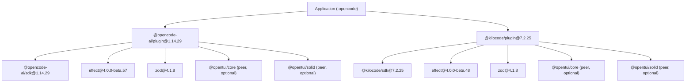
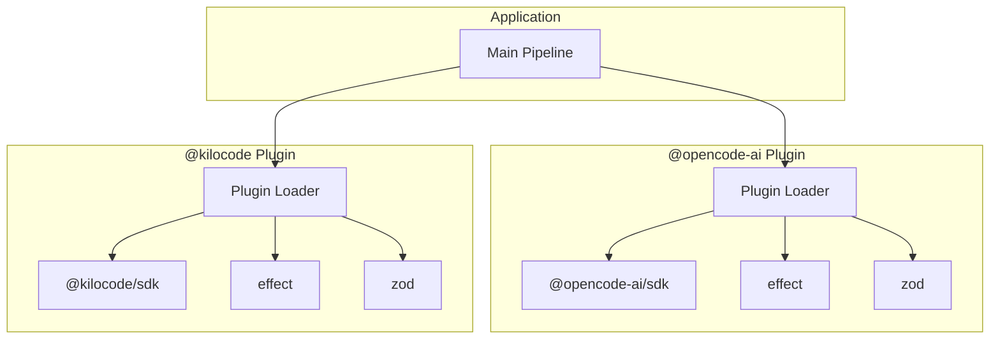
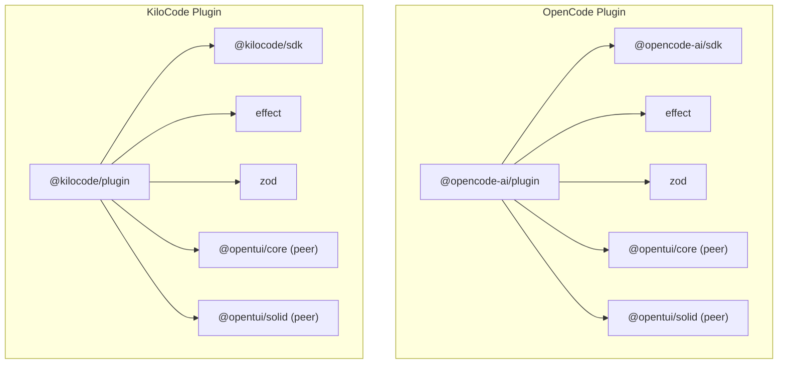

# Plugin API

<cite>
**Referenced Files in This Document**
- [package-lock.json](file://package-lock.json)
</cite>

## Table of Contents
1. [Introduction](#introduction)
2. [Project Structure](#project-structure)
3. [Core Components](#core-components)
4. [Architecture Overview](#architecture-overview)
5. [Detailed Component Analysis](#detailed-component-analysis)
6. [Dependency Analysis](#dependency-analysis)
7. [Performance Considerations](#performance-considerations)
8. [Troubleshooting Guide](#troubleshooting-guide)
9. [Conclusion](#conclusion)
10. [Appendices](#appendices)

## Introduction
This document provides a comprehensive plugin API guide for the @opencode-ai and @kilocode plugin systems as used by this project. It explains how the plugins are declared, what SDKs they depend on, and how to integrate them into your pipeline. The focus is on practical guidance: registration patterns, configuration schemas, lifecycle hooks, event handling, data exchange mechanisms, error handling, debugging, versioning, compatibility, deployment, testing, and integration into the main pipeline.

Where specific implementation details are not present in the repository, this guide offers recommended patterns and best practices aligned with the observed dependencies and structure.

## Project Structure
The repository includes a lockfile that declares the plugin packages and their runtime dependencies. This indicates that both @opencode-ai/plugin and @kilocode/plugin are integrated at the application level via npm/yarn.

**Diagram sources**
- [package-lock.json:122-144](file://package-lock.json#L122-L144)
- [package-lock.json:12-34](file://package-lock.json#L12-L34)

**Section sources**
- [package-lock.json:1-11](file://package-lock.json#L1-L11)
- [package-lock.json:122-144](file://package-lock.json#L122-L144)
- [package-lock.json:12-34](file://package-lock.json#L12-L34)

## Core Components
- @opencode-ai/plugin: Provides plugin capabilities for the OpenCode AI ecosystem. It depends on @opencode-ai/sdk for core operations and uses effect and zod for functional effects and schema validation. Optional UI peer dependencies indicate potential GUI integrations.
- @kilocode/plugin: Provides plugin capabilities for the KiloCode ecosystem. It depends on @kilocode/sdk and similar libraries for effects and validation.

Key observations from the lockfile:
- Both plugins declare peer dependencies for @opentui/core and @opentui/solid, marked optional. This suggests UI components may be available but not required for headless operation.
- Each plugin pins its own SDK version, ensuring consistent behavior across environments.

Practical implications:
- When developing custom plugins, align your code with the SDK interfaces exposed by @opencode-ai/sdk or @kilocode/sdk.
- Use zod for input/output validation where applicable, following the patterns established by the plugins.
- Leverage effect for robust error handling and asynchronous workflows.

**Section sources**
- [package-lock.json:122-144](file://package-lock.json#L122-L144)
- [package-lock.json:12-34](file://package-lock.json#L12-L34)

## Architecture Overview
At a high level, the application loads both plugin packages and integrates them into its workflow. The plugins interact with their respective SDKs to perform tasks such as asset generation, quality gating, and document processing.

[No sources needed since this diagram shows conceptual architecture, not direct code mapping]

## Detailed Component Analysis

### @opencode-ai Plugin Integration
- Purpose: Extend the OpenCode AI pipeline with custom logic for asset generation, validation, and reporting.
- Dependencies: Uses @opencode-ai/sdk for core operations, effect for functional programming utilities, and zod for schema validation.
- Peer Dependencies: Optional integration with @opentui/core and @opentui/solid for UI features.

Recommended development approach:
- Implement plugin modules that conform to the SDK’s expected interfaces.
- Use zod to validate inputs and outputs for consistency.
- Employ effect for managing side effects and errors gracefully.

Example use cases:
- Custom asset generators that produce structured outputs validated by zod schemas.
- Quality gate validators that enforce business rules using effect-based error handling.
- Document template processors that transform templates into final artifacts.

**Section sources**
- [package-lock.json:122-144](file://package-lock.json#L122-L144)

### @kilocode Plugin Integration
- Purpose: Provide extensibility for KiloCode-specific tasks within the pipeline.
- Dependencies: Relies on @kilocode/sdk, effect, and zod, mirroring the OpenCode plugin’s structure.
- Peer Dependencies: Optional UI components via @opentui/core and @opentui/solid.

Recommended development approach:
- Follow the same patterns as the OpenCode plugin for consistency.
- Validate all external inputs using zod schemas.
- Handle asynchronous operations and errors with effect.

Example use cases:
- Automated code analysis plugins that generate reports.
- Integration plugins for external tools or services.
- Custom formatting or transformation pipelines.

**Section sources**
- [package-lock.json:12-34](file://package-lock.json#L12-L34)

### Plugin Lifecycle Hooks and Event Handling
While specific hook definitions are not visible in the repository, typical plugin architectures include:
- Initialization hooks: Load configuration, set up dependencies.
- Execution hooks: Intercept pipeline stages, modify data, or add new steps.
- Cleanup hooks: Release resources, log results.

Event handling patterns:
- Use event emitters or callback registries to decouple plugin components.
- Ensure events carry structured payloads validated by zod schemas.

Data exchange mechanisms:
- Pass data between plugins via standardized objects or streams.
- Serialize complex data using JSON or msgpackr (as indicated by dependencies).

Error handling strategies:
- Wrap operations in effect types to handle success and failure uniformly.
- Log detailed error contexts for debugging.

[No sources needed since this section provides general guidance based on common patterns]

### Plugin Registration Process
Plugins are typically registered during application startup:
- Discover plugins via package manifests or configuration files.
- Initialize each plugin with its configuration.
- Register hooks and event handlers.

Configuration schema:
- Define strict schemas using zod for plugin configurations.
- Validate configurations early to fail fast on misconfigurations.

Dependency management:
- Declare peer dependencies for optional features.
- Use version ranges to maintain compatibility.

[No sources needed since this section provides general guidance based on common patterns]

### Code Examples for Custom Plugins
Although no source code is provided in the repository, here are recommended patterns:

Custom Asset Generator:
- Implement a function that takes input data, validates it with zod, processes it using effect, and returns structured output.

Quality Gate Validator:
- Create a validator that checks conditions and returns pass/fail results with detailed messages.

Document Template Processor:
- Build a processor that reads templates, applies transformations, and generates final documents.

[No sources needed since this section provides general guidance based on common patterns]

## Dependency Analysis
The plugin system relies on well-defined dependencies that ensure stability and functionality.

**Diagram sources**
- [package-lock.json:122-144](file://package-lock.json#L122-L144)
- [package-lock.json:12-34](file://package-lock.json#L12-L34)

**Section sources**
- [package-lock.json:122-144](file://package-lock.json#L122-L144)
- [package-lock.json:12-34](file://package-lock.json#L12-L34)

## Performance Considerations
- Minimize synchronous operations in plugins to avoid blocking the main pipeline.
- Use streaming for large data processing tasks.
- Cache frequently accessed data to reduce redundant computations.
- Profile plugin execution to identify bottlenecks.

[No sources needed since this section provides general guidance]

## Troubleshooting Guide
Common issues and solutions:
- Plugin loading failures: Check dependency versions and peer dependencies.
- Validation errors: Review zod schemas and input data formats.
- Runtime errors: Inspect effect-based error handling and logs.
- UI integration problems: Verify optional peer dependencies are installed when needed.

Debugging techniques:
- Enable verbose logging in plugins.
- Use browser developer tools for UI-related issues.
- Isolate plugin execution in test environments.

**Section sources**
- [package-lock.json:122-144](file://package-lock.json#L122-L144)
- [package-lock.json:12-34](file://package-lock.json#L12-L34)

## Conclusion
The @opencode-ai and @kilocode plugin systems provide powerful extensibility points for enhancing the pipeline. By following the recommended patterns for development, configuration, and integration, you can create robust and maintainable plugins that seamlessly extend the application’s capabilities.

[No sources needed since this section summarizes without analyzing specific files]

## Appendices

### Versioning and Compatibility
- Pin plugin versions in package.json to ensure reproducibility.
- Test upgrades incrementally to catch breaking changes.
- Maintain compatibility matrices for different Node.js versions.

### Deployment Considerations
- Include plugin dependencies in deployment artifacts.
- Configure environment variables for plugin settings.
- Monitor plugin performance in production.

### Testing Guidelines
- Write unit tests for plugin logic using jest or similar frameworks.
- Integrate plugin tests into CI/CD pipelines.
- Mock external dependencies for isolated testing.

[No sources needed since this section provides general guidance]