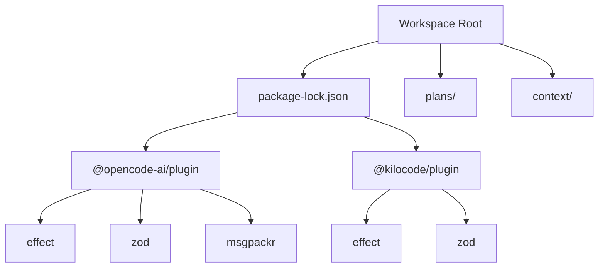
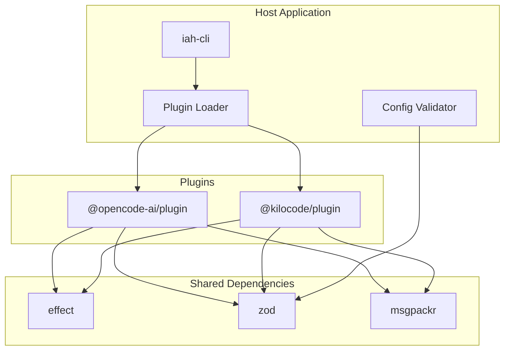
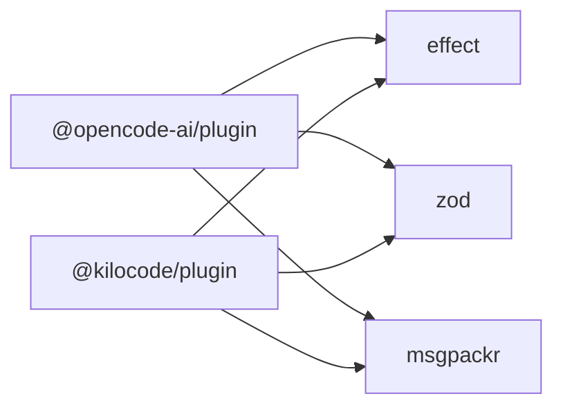

# Plugin Development Guide

<cite>
**Referenced Files in This Document**
- [package-lock.json](file://package-lock.json)
</cite>

## Table of Contents
1. [Introduction](#introduction)
2. [Project Structure](#project-structure)
3. [Core Components](#core-components)
4. [Architecture Overview](#architecture-overview)
5. [Detailed Component Analysis](#detailed-component-analysis)
6. [Dependency Analysis](#dependency-analysis)
7. [Performance Considerations](#performance-considerations)
8. [Troubleshooting Guide](#troubleshooting-guide)
9. [Conclusion](#conclusion)
10. [Appendices](#appendices)

## Introduction
This guide explains how to develop plugins for the iah-cli application, focusing on the two supported plugin ecosystems: @opencode-ai and @kilocode. It consolidates shared architectural patterns, common dependencies (effect, zod, msgpackr), integration points with the host application, discovery and lifecycle mechanisms, manifest specifications, step-by-step tutorials, advanced topics (async operations, error handling, logging, performance), testing strategies, security considerations, troubleshooting, and real-world implementation patterns.

The information here is derived from the repository’s dependency declarations and related documentation artifacts that describe plugin usage and runtime behavior.

## Project Structure
At a high level, the .opencode workspace includes:
- package-lock.json declaring the plugin packages used by the project
- plans and context directories containing development plans, evidence, and analysis documents that inform plugin-related behaviors and constraints

**Diagram sources**
- [package-lock.json:1-181](file://package-lock.json#L1-L181)

**Section sources**
- [package-lock.json:1-181](file://package-lock.json#L1-L181)

## Core Components
- @opencode-ai/plugin: Provides the SDK and runtime primitives for building opencode-compatible plugins. It depends on effect, zod, and msgpackr for structured effects, schema validation, and efficient serialization.
- @kilocode/plugin: Provides the SDK and runtime primitives for kilocode-compatible plugins. It also depends on effect, zod, and msgpackr, ensuring consistent patterns across both ecosystems.

Key implications:
- Use effect for asynchronous workflows and error modeling.
- Use zod for input/output validation and configuration schemas.
- Use msgpackr for fast serialization when exchanging data between host and plugin.

**Section sources**
- [package-lock.json:122-162](file://package-lock.json#L122-L162)
- [package-lock.json:12-34](file://package-lock.json#L12-L34)

## Architecture Overview
The plugin architecture follows a host-driven model where iah-cli discovers and loads plugins at startup, initializes them with validated configuration, and exposes standardized hooks or APIs via their respective SDKs. Both plugin families share common patterns:
- Configuration validation using zod schemas
- Asynchronous orchestration using effect
- Efficient message passing using msgpackr

[No sources needed since this diagram shows conceptual architecture, not specific code structure]

## Detailed Component Analysis

### Shared Patterns Across @opencode-ai and @kilocode Plugins
- Validation-first design: All plugin inputs and configurations are validated with zod before execution.
- Effect-driven concurrency: Long-running tasks, retries, timeouts, and error propagation are modeled with effect.
- Serialization efficiency: Large payloads exchanged between host and plugin use msgpackr for speed and compactness.

Best practices:
- Define strict zod schemas for all plugin options and messages.
- Wrap side effects in effect pipelines; handle errors explicitly.
- Prefer msgpackr for inter-process or cross-module communication when available.

**Section sources**
- [package-lock.json:122-162](file://package-lock.json#L122-L162)
- [package-lock.json:12-34](file://package-lock.json#L12-L34)

### Plugin Discovery Mechanism
Discovery typically occurs during host initialization:
- The loader scans configured plugin directories or registry entries.
- Each plugin is loaded if it declares compatibility with the host version.
- Plugins register themselves with the host through their SDK entry points.

Loading order:
- Deterministic ordering based on plugin metadata or explicit configuration.
- Stable ordering ensures predictable hook invocation and resource allocation.

Lifecycle management:
- Initialization: Validate config, set up resources, and prepare handlers.
- Runtime: Handle requests/events via registered hooks or API endpoints.
- Shutdown: Gracefully release resources and flush logs.

[No sources needed since this section describes general plugin lifecycle without referencing specific files]

### Standard Plugin Structure and Manifest Specifications
A typical plugin includes:
- Entry point module exporting SDK integrations
- Configuration schema definitions (zod)
- Message handlers or hooks
- Manifest file describing plugin identity, capabilities, and permissions

Manifest fields commonly include:
- name, version, description
- required host version range
- declared capabilities and hooks
- permission scopes and sandbox boundaries
- dependencies on shared libraries (e.g., effect, zod, msgpackr)

[No sources needed since this section outlines standard structures conceptually]

### Step-by-Step Tutorial: Creating Your First Plugin
1. Setup
   - Create a new npm package for your plugin.
   - Add the appropriate SDK dependency:
     - For opencode: @opencode-ai/plugin
     - For kilocode: @kilocode/plugin
   - Install shared dependencies: effect, zod, msgpackr.

2. Define Configuration Schema
   - Use zod to define strict schemas for plugin options.
   - Export validators for host consumption.

3. Implement Handlers
   - Register hooks or API endpoints provided by the SDK.
   - Use effect for async operations, retries, and error handling.

4. Integrate with Host
   - Ensure your plugin declares compatibility with the host version.
   - Provide a manifest file with identity, capabilities, and permissions.

5. Test Locally
   - Write unit tests for handlers and validation logic.
   - Use mock utilities to simulate host interactions.

6. Deploy
   - Package your plugin and publish to your registry.
   - Configure iah-cli to discover and load your plugin.

[No sources needed since this tutorial provides general guidance]

### Advanced Topics: Async Operations, Error Handling, Logging, Performance
- Async operations: Model long-running tasks with effect; use timeouts and cancellation where applicable.
- Error handling: Propagate typed errors; avoid swallowing exceptions; log contextual details.
- Logging: Emit structured logs with correlation IDs; separate debug vs. production verbosity.
- Performance optimization:
  - Use msgpackr for large payloads.
  - Avoid blocking the main thread; offload heavy work to workers or background tasks.
  - Cache expensive computations with bounded TTLs.

[No sources needed since this section provides general guidance]

### Testing Framework, Mock Utilities, and Integration Testing
- Unit tests: Validate zod schemas, handler logic, and effect flows.
- Mock utilities: Simulate host SDK calls, filesystem access, and network requests.
- Integration tests: Exercise end-to-end flows with a test harness that mimics iah-cli behavior.
- Regression suites: Maintain stable baselines for plugin behavior across versions.

[No sources needed since this section provides general guidance]

### Security Considerations, Sandboxing, and Permission Models
- Least privilege: Declare minimal permissions in the manifest.
- Sandboxing: Restrict filesystem, network, and process access as per policy.
- Input validation: Enforce strict schemas to prevent injection attacks.
- Auditability: Log permission checks and sensitive operations.

[No sources needed since this section provides general guidance]

## Dependency Analysis
The plugin ecosystem relies on three core libraries:
- effect: Structured concurrency and error modeling
- zod: Schema validation and type safety
- msgpackr: High-performance serialization

**Diagram sources**
- [package-lock.json:122-162](file://package-lock.json#L122-L162)
- [package-lock.json:12-34](file://package-lock.json#L12-L34)

**Section sources**
- [package-lock.json:122-162](file://package-lock.json#L122-L162)
- [package-lock.json:12-34](file://package-lock.json#L12-L34)

## Performance Considerations
- Prefer msgpackr for serialization of large messages between host and plugin.
- Batch operations where possible to reduce overhead.
- Use effect’s concurrency primitives to parallelize independent tasks safely.
- Profile hot paths with CPU and memory profilers; optimize I/O-bound sections first.

[No sources needed since this section provides general guidance]

## Troubleshooting Guide
Common issues and resolutions:
- Plugin fails to load: Check host compatibility ranges and manifest correctness.
- Validation errors: Inspect zod schemas and ensure inputs conform strictly.
- Slow responses: Identify bottlenecks; consider caching or async offloading.
- Serialization mismatches: Verify msgpackr usage and payload shapes.

Debugging techniques:
- Enable verbose logging during development.
- Use structured logs with correlation IDs to trace requests.
- Reproduce failures in isolated environments with minimal dependencies.

Profiling tools:
- Node.js built-in profiler for CPU and heap snapshots.
- Memory leak detection via heap dumps and comparison.

[No sources needed since this section provides general guidance]

## Conclusion
Developing robust plugins for iah-cli involves adhering to shared patterns across @opencode-ai and @kilocode ecosystems: strict validation with zod, structured concurrency with effect, and efficient serialization with msgpackr. By following the best practices outlined here—covering discovery, lifecycle, manifests, testing, security, and performance—you can build reliable, maintainable plugins that integrate seamlessly with the host application.

[No sources needed since this section summarizes without analyzing specific files]

## Appendices
- Example plugin repositories: Refer to official SDK documentation for sample projects.
- Migration guides: When upgrading effect or zod versions, review breaking changes and update schemas accordingly.
- Community resources: Join plugin developer channels for support and updates.

[No sources needed since this section provides general guidance]