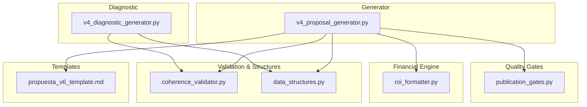
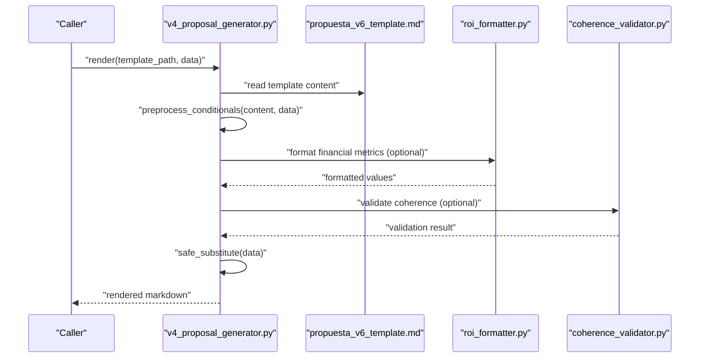
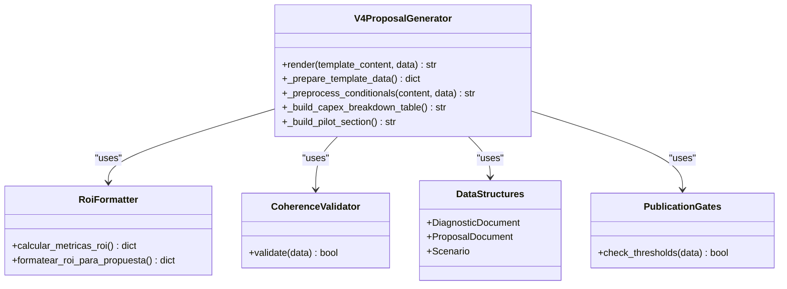

# Template API

<cite>
**Referenced Files in This Document**
- [v4_proposal_generator.py](file://modules/commercial_documents/v4_proposal_generator.py)
- [propuesta_v6_template.md](file://modules/commercial_documents/templates/propuesta_v6_template.md)
- [roi_formatter.py](file://modules/financial_engine/roi_formatter.py)
- [coherence_validator.py](file://modules/commercial_documents/coherence_validator.py)
- [data_structures.py](file://modules/commercial_documents/data_structures.py)
- [publication_gates.py](file://modules/quality_gates/publication_gates.py)
- [v4_diagnostic_generator.py](file://modules/commercial_documents/v4_diagnostic_generator.py)
</cite>

## Table of Contents
1. [Introduction](#introduction)
2. [Project Structure](#project-structure)
3. [Core Components](#core-components)
4. [Architecture Overview](#architecture-overview)
5. [Detailed Component Analysis](#detailed-component-analysis)
6. [Dependency Analysis](#dependency-analysis)
7. [Performance Considerations](#performance-considerations)
8. [Troubleshooting Guide](#troubleshooting-guide)
9. [Conclusion](#conclusion)
10. [Appendices](#appendices)

## Introduction
This document provides a comprehensive template API reference for the markdown-based document generation system used to produce commercial proposals, financial reports, and quality assessments. It explains how templates are structured, how data binds to placeholders, how conditional rendering works, and how to extend the system with custom sections and filters. It also covers validation, debugging, performance optimization, versioning, localization, and customization guidelines for client-specific requirements.

## Project Structure
The template engine is implemented as a Python generator that:
- Loads a markdown template file
- Preprocesses conditionals
- Substitutes variables using a safe string templating mechanism
- Produces final markdown output

Key files:
- Generator: v4_proposal_generator.py
- Templates: propuesta_v6_template.md
- Financial formatting: roi_formatter.py
- Validation and structure definitions: coherence_validator.py, data_structures.py
- Quality gates: publication_gates.py
- Diagnostic generator (related): v4_diagnostic_generator.py

**Diagram sources**
- [v4_proposal_generator.py](file://modules/commercial_documents/v4_proposal_generator.py)
- [propuesta_v6_template.md](file://modules/commercial_documents/templates/propuesta_v6_template.md)
- [roi_formatter.py](file://modules/financial_engine/roi_formatter.py)
- [coherence_validator.py](file://modules/commercial_documents/coherence_validator.py)
- [data_structures.py](file://modules/commercial_documents/data_structures.py)
- [publication_gates.py](file://modules/quality_gates/publication_gates.py)
- [v4_diagnostic_generator.py](file://modules/commercial_documents/v4_diagnostic_generator.py)

**Section sources**
- [v4_proposal_generator.py](file://modules/commercial_documents/v4_proposal_generator.py)
- [propuesta_v6_template.md](file://modules/commercial_documents/templates/propuesta_v6_template.md)

## Core Components
- Template engine: Uses a safe string substitution mechanism to replace placeholders like ${key} with values from a data dictionary.
- Conditional rendering: Supports block-level conditionals processed before substitution.
- Data binding: A generator prepares a rich data dictionary that maps directly to template placeholders.
- Section builders: Helper methods generate complex markdown fragments (tables, lists, sections) that can be injected via placeholders.
- Financial formatting: Centralized ROI and currency formatting utilities ensure consistent presentation across documents.
- Validation: Coherence checks and quality gates validate outputs against business rules and benchmarks.

Key responsibilities:
- v4_proposal_generator.py: Orchestrates template loading, preprocessing, data preparation, and rendering.
- propuesta_v6_template.md: Defines the layout, placeholders, and structure of the proposal document.
- roi_formatter.py: Provides standardized ROI calculations and formatting.
- coherence_validator.py and data_structures.py: Define structures and validation logic for consistency.
- publication_gates.py: Enforces quality thresholds and publishability criteria.
- v4_diagnostic_generator.py: Generates diagnostic content consumed by downstream processes.

**Section sources**
- [v4_proposal_generator.py](file://modules/commercial_documents/v4_proposal_generator.py)
- [propuesta_v6_template.md](file://modules/commercial_documents/templates/propuesta_v6_template.md)
- [roi_formatter.py](file://modules/financial_engine/roi_formatter.py)
- [coherence_validator.py](file://modules/commercial_documents/coherence_validator.py)
- [data_structures.py](file://modules/commercial_documents/data_structures.py)
- [publication_gates.py](file://modules/quality_gates/publication_gates.py)
- [v4_diagnostic_generator.py](file://modules/commercial_documents/v4_diagnostic_generator.py)

## Architecture Overview
The template rendering pipeline follows a clear sequence:
1. Load template content from the markdown file.
2. Preprocess conditionals to include or exclude blocks based on runtime data.
3. Substitute placeholders with values from the prepared data dictionary.
4. Return the rendered markdown for further processing or output.

**Diagram sources**
- [v4_proposal_generator.py](file://modules/commercial_documents/v4_proposal_generator.py)
- [propuesta_v6_template.md](file://modules/commercial_documents/templates/propuesta_v6_template.md)
- [roi_formatter.py](file://modules/financial_engine/roi_formatter.py)
- [coherence_validator.py](file://modules/commercial_documents/coherence_validator.py)

## Detailed Component Analysis

### Template Syntax and Variable Substitution
- Placeholders: Use ${key} syntax to bind values from the data dictionary.
- Safe substitution: Missing keys remain literal; no exceptions are raised.
- Complex values: Strings, lists, and pre-rendered markdown fragments can be bound.

Examples of usage patterns:
- Simple text: ${company_name}, ${date}
- Lists: ${activos_digitales_lista}
- Tables: ${capex_breakdown_table} (must not be embedded inside another table cell)

Best practices:
- Keep placeholders at the top level of sections to avoid markdown parsing issues.
- Avoid embedding full tables within table cells due to markdown limitations.

**Section sources**
- [v4_proposal_generator.py](file://modules/commercial_documents/v4_proposal_generator.py)
- [propuesta_v6_template.md](file://modules/commercial_documents/templates/propuesta_v6_template.md)

### Conditional Rendering
- Block conditionals: Use {{if}}...{{endif}} blocks to include or exclude sections based on runtime data.
- Preprocessing: Conditionals are processed before placeholder substitution.

Guidelines:
- Ensure conditional expressions evaluate to boolean-like values.
- Keep conditions simple and testable.

**Section sources**
- [v4_proposal_generator.py](file://modules/commercial_documents/v4_proposal_generator.py)

### Loops and Iteration
- While there is no explicit loop syntax in templates, iteration is achieved by generating list items or table rows in the generator and injecting them via placeholders.
- Example: Building a bullet list of assets or a breakdown table in Python and passing it as a single string.

Recommendations:
- Generate complete markdown fragments in the generator.
- Inject these fragments into the template where appropriate.

**Section sources**
- [v4_proposal_generator.py](file://modules/commercial_documents/v4_proposal_generator.py)

### Custom Filters and Formatting
- Financial formatting: Use centralized functions for currency and ROI formatting to ensure consistency.
- Text manipulation: Apply transformations in the generator before injecting into templates.

Example utilities:
- Currency formatting for COP amounts.
- ROI percentage formatting with controlled precision.

**Section sources**
- [roi_formatter.py](file://modules/financial_engine/roi_formatter.py)
- [v4_proposal_generator.py](file://modules/commercial_documents/v4_proposal_generator.py)

### Template Inheritance and Composition
- Composition pattern: Build reusable sections in the generator and inject them via placeholders.
- Inheritance pattern: Not natively supported; instead, maintain base templates and override specific sections by swapping template files or injecting overrides.

Guidelines:
- Keep templates focused on layout and placeholders.
- Implement dynamic content generation in the generator.

**Section sources**
- [propuesta_v6_template.md](file://modules/commercial_documents/templates/propuesta_v6_template.md)
- [v4_proposal_generator.py](file://modules/commercial_documents/v4_proposal_generator.py)

### Data Binding Mechanism
- Data dictionary: Prepared by the generator with keys matching template placeholders.
- Types: Strings, lists, and pre-rendered markdown fragments are supported.
- Fallback behavior: Missing keys remain literal; provide defaults in the generator if needed.

Best practices:
- Validate required keys before rendering.
- Provide meaningful fallbacks for optional sections.

**Section sources**
- [v4_proposal_generator.py](file://modules/commercial_documents/v4_proposal_generator.py)

### Built-in Functions and Utilities
- Date formatting: Format dates consistently in the generator before injection.
- Currency conversion: Use centralized formatting functions for currency display.
- Mathematical calculations: Perform calculations in the generator and format results for templates.
- Text manipulation: Apply transformations such as capitalization, truncation, and sanitization in the generator.

**Section sources**
- [roi_formatter.py](file://modules/financial_engine/roi_formatter.py)
- [v4_proposal_generator.py](file://modules/commercial_documents/v4_proposal_generator.py)

### Examples of Template Usage
- Commercial proposal templates: Use placeholders for company details, financial summaries, and asset lists.
- Financial report templates: Include ROI metrics, cost breakdowns, and scenario comparisons.
- Quality assessment templates: Present validation scores, gate results, and recommendations.

Note: Refer to the template file for concrete placeholder names and section layouts.

**Section sources**
- [propuesta_v6_template.md](file://modules/commercial_documents/templates/propuesta_v6_template.md)

## Dependency Analysis
The generator depends on several modules for data preparation, formatting, and validation:

**Diagram sources**
- [v4_proposal_generator.py](file://modules/commercial_documents/v4_proposal_generator.py)
- [roi_formatter.py](file://modules/financial_engine/roi_formatter.py)
- [coherence_validator.py](file://modules/commercial_documents/coherence_validator.py)
- [data_structures.py](file://modules/commercial_documents/data_structures.py)
- [publication_gates.py](file://modules/quality_gates/publication_gates.py)

**Section sources**
- [v4_proposal_generator.py](file://modules/commercial_documents/v4_proposal_generator.py)
- [roi_formatter.py](file://modules/financial_engine/roi_formatter.py)
- [coherence_validator.py](file://modules/commercial_documents/coherence_validator.py)
- [data_structures.py](file://modules/commercial_documents/data_structures.py)
- [publication_gates.py](file://modules/quality_gates/publication_gates.py)

## Performance Considerations
- Minimize template size: Keep templates concise and modular.
- Avoid heavy computations in templates: Perform all calculations in the generator.
- Cache reusable fragments: Generate complex markdown sections once and reuse them.
- Validate early: Fail fast on missing or invalid data to prevent expensive rendering.

[No sources needed since this section provides general guidance]

## Troubleshooting Guide
Common issues and resolutions:
- Corrupted markdown tables: Avoid embedding full tables within table cells. Move complex tables to their own sections.
- Missing placeholders: Ensure all required keys exist in the data dictionary or provide defaults.
- Conditional blocks not rendering: Verify conditional expressions and preprocessing logic.
- Inconsistent formatting: Use centralized formatting utilities for numbers and currencies.

Debugging techniques:
- Inspect the data dictionary before rendering.
- Log intermediate steps in preprocessing and substitution.
- Validate output structure with automated tests.

**Section sources**
- [v4_proposal_generator.py](file://modules/commercial_documents/v4_proposal_generator.py)
- [propuesta_v6_template.md](file://modules/commercial_documents/templates/propuesta_v6_template.md)

## Conclusion
The template API provides a robust and extensible framework for generating markdown documents. By separating layout (templates) from logic (generator), it enables flexible customization while maintaining consistency and reliability. Following the best practices outlined here will help you create high-quality commercial proposals, financial reports, and quality assessments tailored to client needs.

[No sources needed since this section summarizes without analyzing specific files]

## Appendices

### Template Versioning and Localization
- Versioning: Maintain separate template files per major version and document changes in a changelog.
- Localization: Use language-specific template files and select the appropriate one based on locale settings.

### Customization Guidelines
- Client-specific branding: Override logos, colors, and headers via configuration.
- Domain-specific content: Add new sections by extending the generator and corresponding template placeholders.
- Testing: Include unit tests for critical sections and integration tests for full document generation.

[No sources needed since this section provides general guidance]