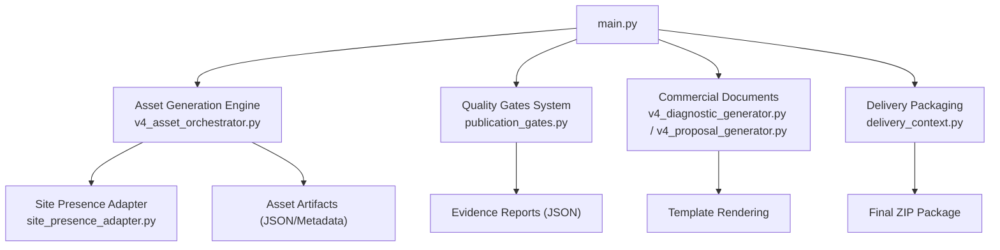
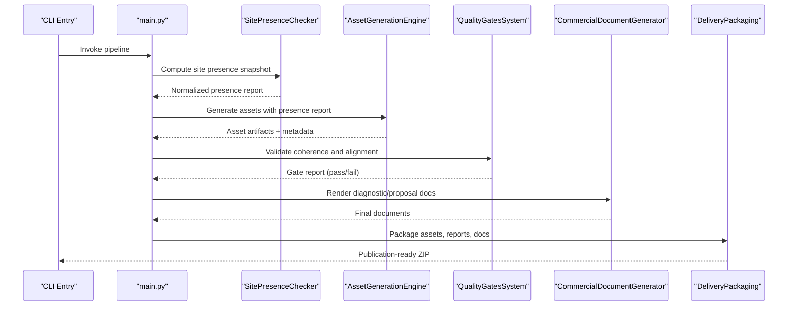
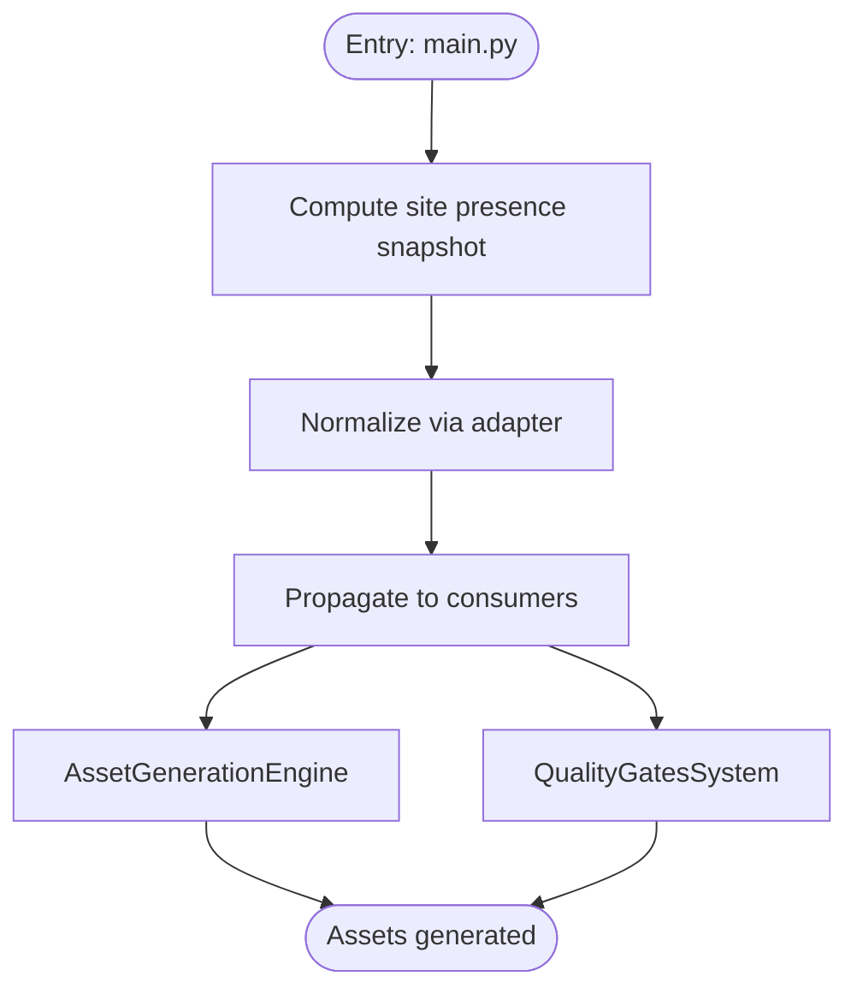
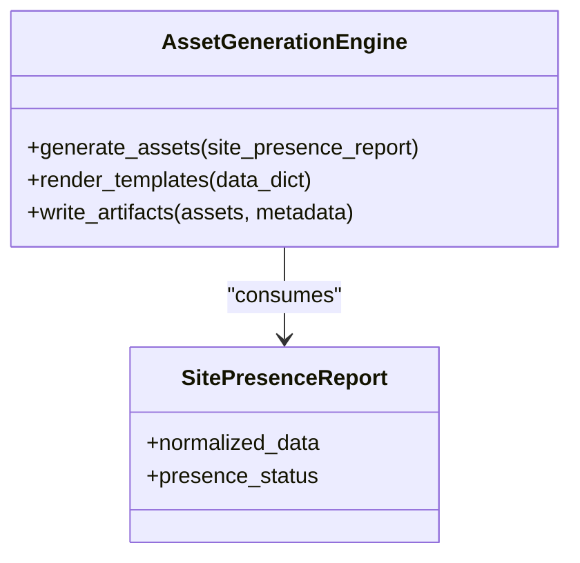
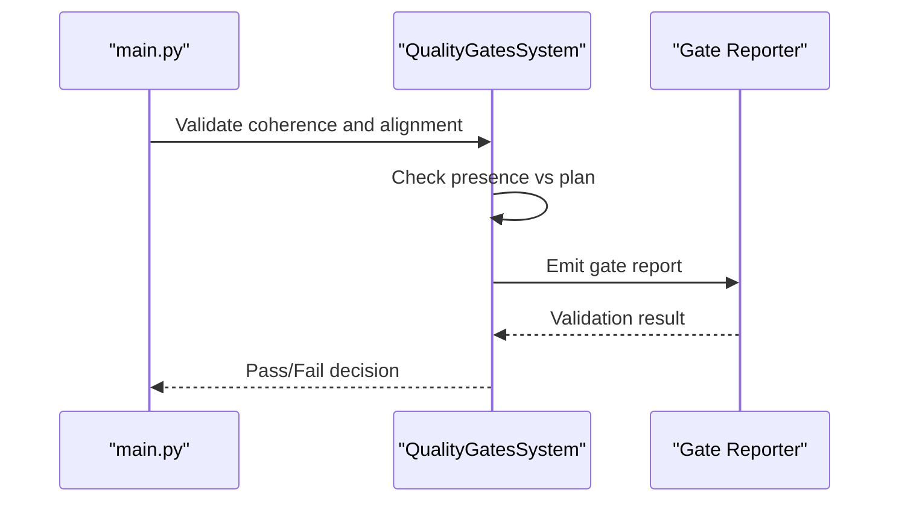
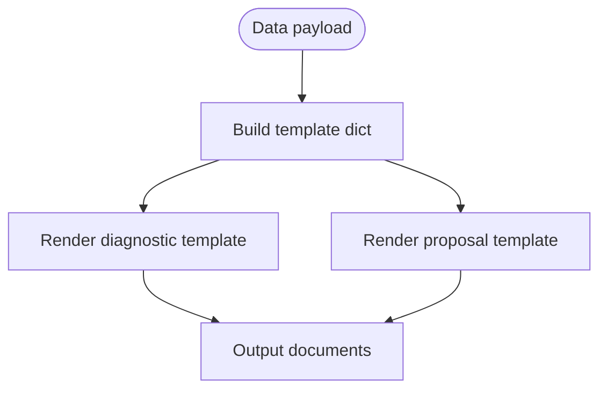
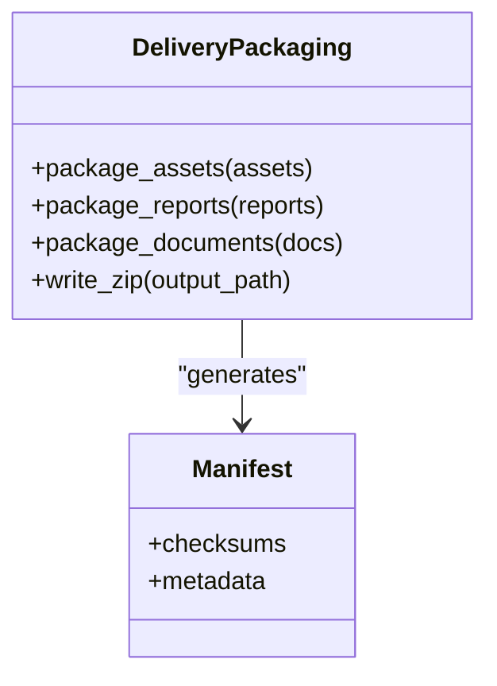
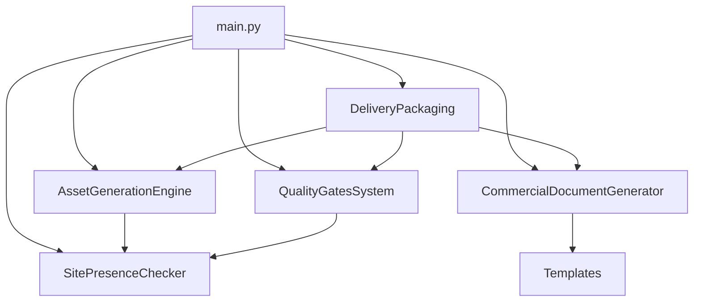

# Architecture and System Design

<cite>
**Referenced Files in This Document**
- [main.py](file://main.py)
- [v4_asset_orchestrator.py](file://modules/asset_generation/v4_asset_orchestrator.py)
- [site_presence_adapter.py](file://modules/asset_generation/site_presence_adapter.py)
- [publication_gates.py](file://modules/quality_gates/publication_gates.py)
- [delivery_context.py](file://modules/delivery/delivery_context.py)
- [v4_diagnostic_generator.py](file://modules/commercial_documents/v4_diagnostic_generator.py)
- [v4_proposal_generator.py](file://modules/commercial_documents/v4_proposal_generator.py)
- [seo_elements_detector.py](file://modules/auditors/seo_elements_detector.py)
- [v4_comprehensive.py](file://modules/auditors/v4_comprehensive.py)
- [http_client.py](file://modules/utils/http_client.py)
- [02-prompt-fase-A.md](file://plans/Archives/DT-1-DELIVERY-CONTRACT-2026-07-23/02-prompt-fase-A.md)
- [05-prompt-inicio-sesion-fase-2.md](file://plans/Archives/DT4-RESIDUAL-FIXES/05-prompt-inicio-sesion-fase-2.md)
- [08-analisis-post-implementacion.md](file://plans/Archives/DT4-RESIDUAL-FIXES/08-analisis-post-implementacion.md)
- [CONTEXT-EVIDENCE-TIER-FALSE-CONFIDENCE-IAO-2026-07-30.md](file://context/CONTEXT-EVIDENCE-TIER-FALSE-CONFIDENCE-IAO-2026-07-30.md)
- [AUDIT-BUG-1-FORENSIC-2026-07-22.md](file://context/Historico/AUDIT-BUG-1-FORENSIC-2026-07-22.md)
- [BUGS-ONBOARDING-ADR-TEMPLATE-2026-07-22.md](file://context/Historico/BUGS-ONBOARDING-ADR-TEMPLATE-2026-07-22.md)
- [bugs_no_onboarding_luxor_2026-07-06.md](file://context/Historico/bugs_no_onboarding_luxor_2026-07-06.md)
- [package-lock.json](file://package-lock.json)
</cite>

## Table of Contents
1. Introduction
2. Project Structure
3. Core Components
4. Architecture Overview
5. Detailed Component Analysis
6. Dependency Analysis
7. Performance Considerations
8. Troubleshooting Guide
9. Conclusion
10. Appendices

## Introduction
This document describes the iah-cli system architecture for processing hotel websites through a sequential pipeline: site analysis, asset planning, financial modeling, commercial document generation, quality validation, and publication-ready packaging. It explains how SitePresenceChecker feeds AssetGenerationEngine, which connects to QualityGatesSystem before final DeliveryPackaging. It also documents technical decisions such as dataclasses for structured data, template-based document generation, evidence-based debugging practices, and infrastructure requirements including Python environment setup, Node.js dependencies, and external web scraping capabilities.

## Project Structure
The repository contains operational plans, context notes, and package metadata that reflect the evolution of the iah-cli pipeline. The core implementation is organized into modules for asset generation, quality gates, commercial documents, auditors, and utilities. Configuration and orchestration are driven by a central entry point and YAML-based configuration files. Evidence artifacts (JSON reports and markdown diagnostics) are produced throughout the pipeline to support traceability and debugging.

[No sources needed since this diagram shows conceptual workflow, not actual code structure]

## Core Components
- SitePresenceChecker: Computes normalized presence information about assets on target hotel sites. Results are captured once and propagated across components to avoid redundant network calls and inconsistent states.
- AssetGenerationEngine: Orchestrates conditional asset generation using site presence data and templates. Produces asset artifacts and metadata consumed downstream.
- QualityGatesSystem: Validates coherence between planned assets and production reality, enforcing alignment and confidence thresholds. Emits gate reports and blocks delivery if critical checks fail.
- CommercialDocumentGenerator: Renders diagnostic and proposal documents from templates using structured data payloads. Ensures consistent messaging and evidence tiers.
- DeliveryPackaging: Assembles validated assets, reports, and documents into a publication-ready package with manifest and checksums.

Key technical decisions:
- Dataclasses for structured data: Centralized contracts like DeliveryAssetState and DeliveryContext ensure type safety and consistent serialization across stages.
- Template-based document generation: Markdown templates drive output consistency; variables are injected via structured dicts.
- Evidence-based debugging: JSON reports and markdown logs provide verifiable traces for audits and regression testing.

**Section sources**
- [02-prompt-fase-A.md:1-35](file://plans/Archives/DT-1-DELIVERY-CONTRACT-2026-07-23/02-prompt-fase-A.md#L1-L35)
- [05-prompt-inicio-sesion-fase-2.md:78-98](file://plans/Archives/DT4-RESIDUAL-FIXES/05-prompt-inicio-sesion-fase-2.md#L78-L98)
- [08-analisis-post-implementacion.md:157-166](file://plans/Archives/DT4-RESIDUAL-FIXES/08-analisis-post-implementacion.md#L157-L166)
- [CONTEXT-EVIDENCE-TIER-FALSE-CONFIDENCE-IAO-2026-07-30.md:593-615](file://context/CONTEXT-EVIDENCE-TIER-FALSE-CONFIDENCE-IAO-2026-07-30.md#L593-L615)

## Architecture Overview
The pipeline follows a strict sequence with clear handoffs and evidence artifacts at each stage.

**Diagram sources**
- [main.py:1-200](file://main.py#L1-L200)
- [v4_asset_orchestrator.py:1-120](file://modules/asset_generation/v4_asset_orchestrator.py#L1-L120)
- [publication_gates.py:1-120](file://modules/quality_gates/publication_gates.py#L1-L120)
- [v4_diagnostic_generator.py:1-120](file://modules/commercial_documents/v4_diagnostic_generator.py#L1-L120)
- [v4_proposal_generator.py:1-120](file://modules/commercial_documents/v4_proposal_generator.py#L1-L120)
- [delivery_context.py:1-120](file://modules/delivery/delivery_context.py#L1-L120)

**Section sources**
- [05-prompt-inicio-sesion-fase-2.md:78-98](file://plans/Archives/DT4-RESIDUAL-FIXES/05-prompt-inicio-sesion-fase-2.md#L78-L98)
- [08-analisis-post-implementacion.md:157-166](file://plans/Archives/DT4-RESIDUAL-FIXES/08-analisis-post-implementacion.md#L157-L166)

## Detailed Component Analysis

### SitePresenceChecker and Adapter
Purpose:
- Normalize site presence data from multiple sources into a single contract used by downstream components.
- Avoid re-execution and ensure consistent snapshots across the pipeline.

Implementation highlights:
- Adapter function normalizes inputs and outputs a standardized report consumed by AssetGenerationEngine and QualityGatesSystem.
- Orchestration ensures a single computation of presence data early in the flow.

**Diagram sources**
- [site_presence_adapter.py:1-120](file://modules/asset_generation/site_presence_adapter.py#L1-L120)
- [v4_asset_orchestrator.py:1-120](file://modules/asset_generation/v4_asset_orchestrator.py#L1-L120)
- [publication_gates.py:1-120](file://modules/quality_gates/publication_gates.py#L1-L120)

**Section sources**
- [05-prompt-inicio-sesion-fase-2.md:78-98](file://plans/Archives/DT4-RESIDUAL-FIXES/05-prompt-inicio-sesion-fase-2.md#L78-L98)
- [08-analisis-post-implementacion.md:157-166](file://plans/Archives/DT4-RESIDUAL-FIXES/08-analisis-post-implementacion.md#L157-L166)

### AssetGenerationEngine
Purpose:
- Generate assets conditionally based on site presence and templates.
- Produce metadata and artifacts consumed by quality gates and packaging.

Key behaviors:
- Accepts normalized site presence report to avoid redundant checks.
- Uses templates and structured data to render assets consistently.

**Diagram sources**
- [v4_asset_orchestrator.py:1-120](file://modules/asset_generation/v4_asset_orchestrator.py#L1-L120)
- [site_presence_adapter.py:1-120](file://modules/asset_generation/site_presence_adapter.py#L1-L120)

**Section sources**
- [05-prompt-inicio-sesion-fase-2.md:78-98](file://plans/Archives/DT4-RESIDUAL-FIXES/05-prompt-inicio-sesion-fase-2.md#L78-L98)

### QualityGatesSystem
Purpose:
- Enforce coherence between planned assets and production reality.
- Block delivery when critical alignment or confidence thresholds are not met.

Key behaviors:
- Consumes normalized site presence report and asset metadata.
- Produces gate reports with pass/fail status and detailed findings.

**Diagram sources**
- [publication_gates.py:1-120](file://modules/quality_gates/publication_gates.py#L1-L120)

**Section sources**
- [05-prompt-inicio-sesion-fase-2.md:78-98](file://plans/Archives/DT4-RESIDUAL-FIXES/05-prompt-inicio-sesion-fase-2.md#L78-L98)

### CommercialDocumentGenerator
Purpose:
- Render diagnostic and proposal documents from templates using structured data.
- Ensure consistent messaging and evidence tier representation.

Key behaviors:
- Injects variables into markdown templates.
- Handles conditional sections based on evidence tiers and onboarding status.

**Diagram sources**
- [v4_diagnostic_generator.py:1-120](file://modules/commercial_documents/v4_diagnostic_generator.py#L1-L120)
- [v4_proposal_generator.py:1-120](file://modules/commercial_documents/v4_proposal_generator.py#L1-L120)

**Section sources**
- [CONTEXT-EVIDENCE-TIER-FALSE-CONFIDENCE-IAO-2026-07-30.md:593-615](file://context/CONTEXT-EVIDENCE-TIER-FALSE-CONFIDENCE-IAO-2026-07-30.md#L593-L615)

### DeliveryPackaging
Purpose:
- Assemble validated assets, reports, and documents into a publication-ready package.
- Include manifests and checksums for integrity verification.

Key behaviors:
- Consumes outputs from AssetGenerationEngine, QualityGatesSystem, and CommercialDocumentGenerator.
- Writes ZIP with structured layout and metadata.

**Diagram sources**
- [delivery_context.py:1-120](file://modules/delivery/delivery_context.py#L1-L120)

**Section sources**
- [02-prompt-fase-A.md:1-35](file://plans/Archives/DT-1-DELIVERY-CONTRACT-2026-07-23/02-prompt-fase-A.md#L1-L35)

## Dependency Analysis
The pipeline exhibits clear separation of concerns with minimal coupling. Site presence is computed once and shared, reducing redundancy and inconsistency. Templates and dataclasses enforce stable contracts across components.

**Diagram sources**
- [main.py:1-200](file://main.py#L1-L200)
- [v4_asset_orchestrator.py:1-120](file://modules/asset_generation/v4_asset_orchestrator.py#L1-L120)
- [publication_gates.py:1-120](file://modules/quality_gates/publication_gates.py#L1-L120)
- [v4_diagnostic_generator.py:1-120](file://modules/commercial_documents/v4_diagnostic_generator.py#L1-L120)
- [v4_proposal_generator.py:1-120](file://modules/commercial_documents/v4_proposal_generator.py#L1-L120)
- [delivery_context.py:1-120](file://modules/delivery/delivery_context.py#L1-L120)

**Section sources**
- [05-prompt-inicio-sesion-fase-2.md:78-98](file://plans/Archives/DT4-RESIDUAL-FIXES/05-prompt-inicio-sesion-fase-2.md#L78-L98)

## Performance Considerations
- Single computation of site presence reduces network overhead and ensures consistency.
- Template rendering should be cached where possible to avoid repeated processing.
- Use efficient JSON serialization for large datasets and avoid unnecessary copies.
- Parallelize independent tasks within asset generation where safe.

[No sources needed since this section provides general guidance]

## Troubleshooting Guide
Common issues and resolutions:
- False confidence tiers: Ensure precision and evidence tiers are correctly computed and reflected in templates.
- Onboarding gaps: Verify that onboarding data is propagated to all consumers and templates.
- SPA handling: Detect SPAs and use Playwright fallback gracefully to capture dynamic content.
- Evidence inconsistencies: Align provenance metadata across layers to prevent contradictory reports.

**Section sources**
- [CONTEXT-EVIDENCE-TIER-FALSE-CONFIDENCE-IAO-2026-07-30.md:593-615](file://context/CONTEXT-EVIDENCE-TIER-FALSE-CONFIDENCE-IAO-2026-07-30.md#L593-L615)
- [AUDIT-BUG-1-FORENSIC-2026-07-22.md:333-367](file://context/Historico/AUDIT-BUG-1-FORENSIC-2026-07-22.md#L333-L367)
- [BUGS-ONBOARDING-ADR-TEMPLATE-2026-07-22.md:431-463](file://context/Historico/BUGS-ONBOARDING-ADR-TEMPLATE-2026-07-22.md#L431-L463)
- [bugs_no_onboarding_luxor_2026-07-06.md:187-209](file://context/Historico/bugs_no_onboarding_luxor_2026-07-06.md#L187-L209)

## Conclusion
The iah-cli system implements a robust, evidence-driven pipeline for hotel website analysis and delivery. By centralizing site presence, enforcing quality gates, and using template-based document generation, it achieves consistency and reliability. Infrastructure requirements include Python environments, Node.js dependencies, and optional headless browser support for SPA handling. Continuous improvement focuses on unifying contracts, enhancing error handling, and optimizing performance.

[No sources needed since this section summarizes without analyzing specific files]

## Appendices

### Infrastructure Requirements
- Python environment: Virtual environment with required packages for HTTP clients, templating, and PDF generation.
- Node.js dependencies: Managed via package-lock.json for any frontend or tooling needs.
- Web scraping: HTTP client utilities and optional Playwright for SPA rendering.

**Section sources**
- [package-lock.json:1-50](file://package-lock.json#L1-L50)
- [bugs_no_onboarding_luxor_2026-07-06.md:187-209](file://context/Historico/bugs_no_onboarding_luxor_2026-07-06.md#L187-L209)

### Technology Stack
- Python modules: Asset generation, quality gates, commercial documents, auditors, utilities.
- @opencode-ai plugin integration: Referenced in plans and context for orchestration and automation.
- JSON-based data exchange: Used for reports, metadata, and configuration.

**Section sources**
- [02-prompt-fase-A.md:1-35](file://plans/Archives/DT-1-DELIVERY-CONTRACT-2026-07-23/02-prompt-fase-A.md#L1-L35)
- [CONTEXT-EVIDENCE-TIER-FALSE-CONFIDENCE-IAO-2026-07-30.md:593-615](file://context/CONTEXT-EVIDENCE-TIER-FALSE-CONFIDENCE-IAO-2026-07-30.md#L593-L615)