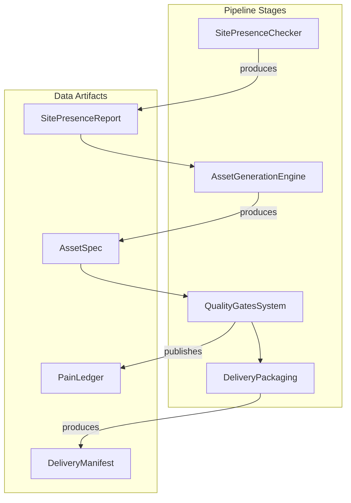
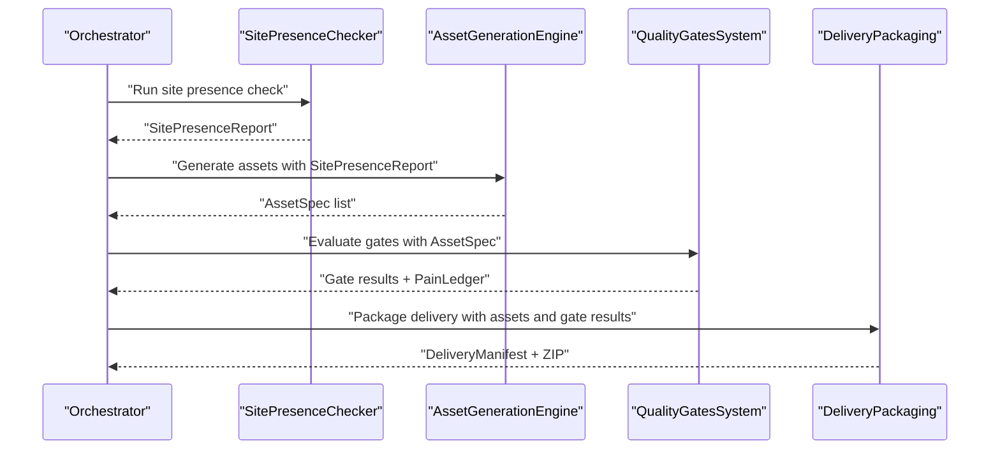
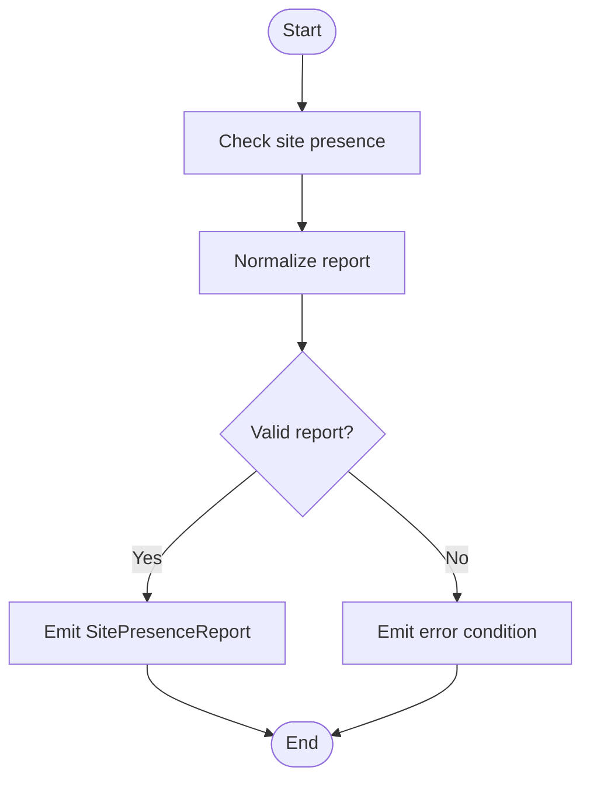
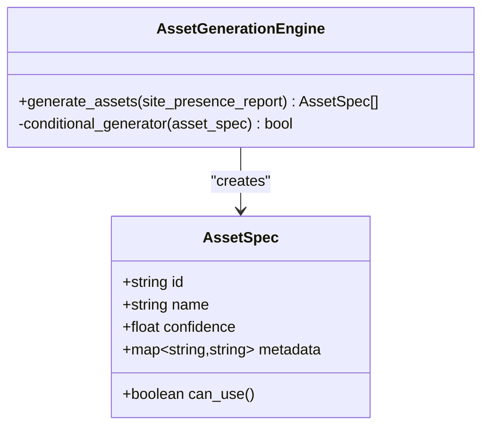
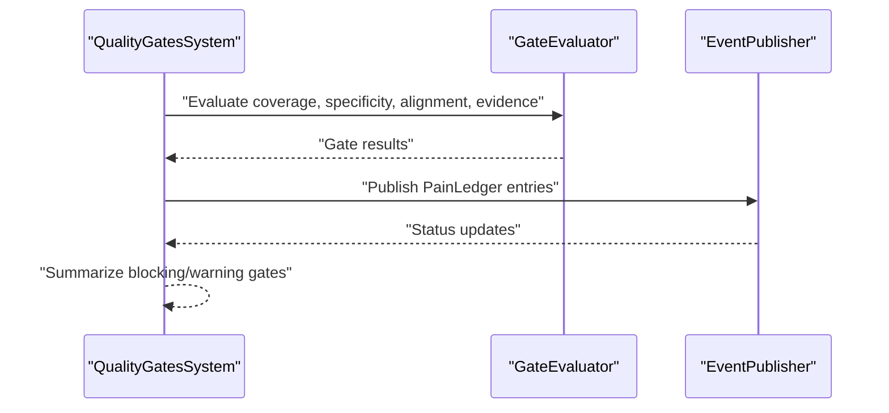
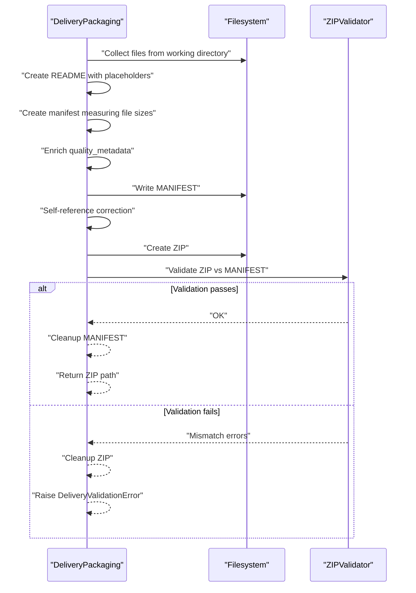
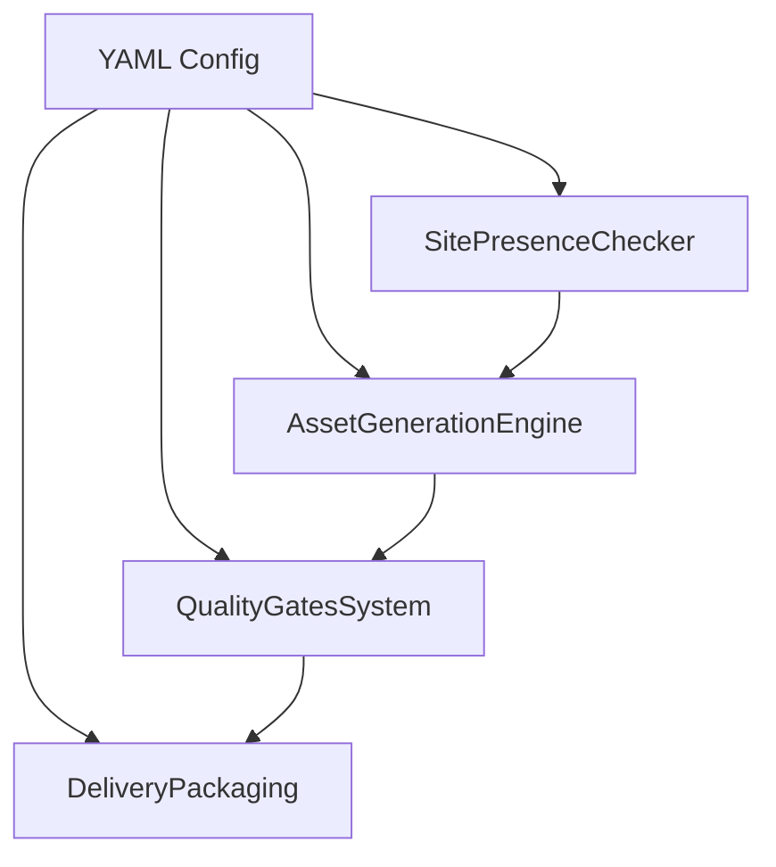
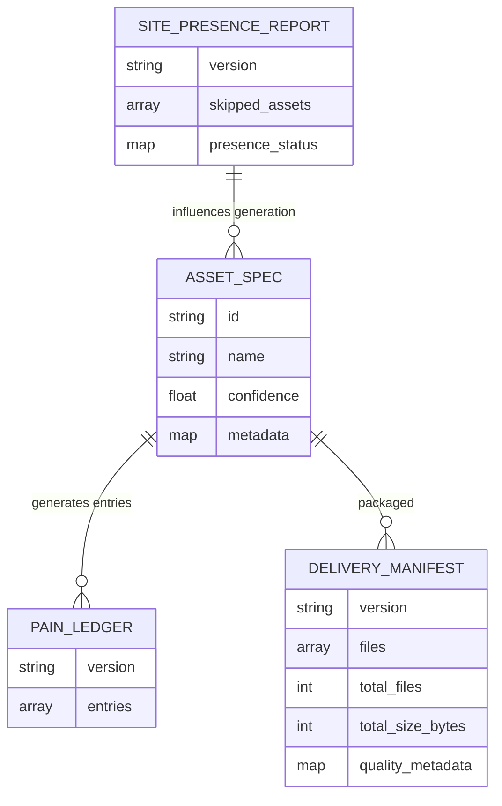

# Component Interactions and Data Flow

<cite>
**Referenced Files in This Document**
- [CONTEXT-DELIVERY-ZIP-PACKAGING-BROKEN-2026-08-01.md](file://context/CONTEXT-DELIVERY-ZIP-PACKAGING-BROKEN-2026-08-01.md)
- [pain_ledger.json](file://plans/Archives/DT-3-TECH-DEBT-2026-07-25/evidence/pain_ledger.json)
- [delivery_quality_report.json](file://plans/Archives/DT-3-TECH-DEBT-2026-07-25/evidence/delivery_quality_report.json)
- [02-prompt-fase-A.md](file://plans/Archives/DT-1-DELIVERY-CONTRACT-2026-07-23/02-prompt-fase-A.md)
- [05-prompt-inicio-sesion-fase-2.md](file://plans/Archives/DT4-RESIDUAL-FIXES/05-prompt-inicio-sesion-fase-2.md)
- [package-lock.json](file://package-lock.json)
</cite>

## Table of Contents
1. [Introduction](#introduction)
2. [Project Structure](#project-structure)
3. [Core Components](#core-components)
4. [Architecture Overview](#architecture-overview)
5. [Detailed Component Analysis](#detailed-component-analysis)
6. [Dependency Analysis](#dependency-analysis)
7. [Performance Considerations](#performance-considerations)
8. [Troubleshooting Guide](#troubleshooting-guide)
9. [Conclusion](#conclusion)
10. [Appendices](#appendices)

## Introduction
This document explains the iah-cli system’s component interactions and data flow patterns across SitePresenceChecker, AssetGenerationEngine, QualityGatesSystem, and DeliveryPackaging. It details the data models exchanged between components (SitePresenceReport, AssetSpec, PainLedger, DeliveryManifest), the event-driven status updates and error propagation, YAML-based configuration controls, and how financial modeling data flows from ROI calculations to document generation templates. It also includes sequence diagrams for typical execution flows and exception scenarios, along with troubleshooting guidance and performance considerations.

## Project Structure
The repository contains implementation context, plans, evidence artifacts, and dependency metadata that describe the pipeline behavior and issues:
- Context documents explain end-to-end pipeline behavior and known defects in delivery packaging.
- Plans define contracts, normalization, and wiring of components like SitePresenceChecker and asset orchestrator.
- Evidence files capture runtime data structures such as PainLedger and delivery quality reports.
- Dependency metadata shows YAML parsing support used by the system.

[No sources needed since this diagram shows conceptual workflow, not actual code structure]

**Section sources**
- [CONTEXT-DELIVERY-ZIP-PACKAGING-BROKEN-2026-08-01.md](file://context/CONTEXT-DELIVERY-ZIP-PACKAGING-BROKEN-2026-08-01.md)
- [package-lock.json](file://package-lock.json)

## Core Components
- SitePresenceChecker: Scans site presence and produces a normalized report consumed downstream.
- AssetGenerationEngine: Generates assets based on inputs and produces structured asset specifications.
- QualityGatesSystem: Evaluates gates and publishes pain ledger entries and gate outcomes.
- DeliveryPackaging: Packages final deliverables into ZIPs and manifests, enriching with quality metadata.

Key responsibilities and interactions are defined in plan documents and evidenced by runtime artifacts.

**Section sources**
- [02-prompt-fase-A.md](file://plans/Archives/DT-1-DELIVERY-CONTRACT-2026-07-23/02-prompt-fase-A.md)
- [05-prompt-inicio-sesion-fase-2.md](file://plans/Archives/DT4-RESIDUAL-FIXES/05-prompt-inicio-sesion-fase-2.md)
- [delivery_quality_report.json](file://plans/Archives/DT-3-TECH-DEBT-2026-07-25/evidence/delivery_quality_report.json)

## Architecture Overview
The pipeline follows a sequential flow with event-driven status publishing at each stage:
- SitePresenceChecker outputs SitePresenceReport.
- AssetGenerationEngine consumes the report and emits AssetSpec instances.
- QualityGatesSystem evaluates assets and gates, publishing PainLedger entries and gate results.
- DeliveryPackaging consumes gate outputs and asset artifacts to produce DeliveryManifest and ZIP packages.

[No sources needed since this diagram shows conceptual workflow, not actual code structure]

## Detailed Component Analysis

### SitePresenceChecker
- Purpose: Normalize site presence data and provide a consistent snapshot for downstream consumers.
- Outputs: SitePresenceReport containing presence statuses and skipped assets.
- Integration: Called once early in the pipeline; its output is passed to AssetGenerationEngine and QualityGatesSystem without re-execution.

[No sources needed since this diagram shows conceptual workflow, not actual code structure]

**Section sources**
- [05-prompt-inicio-sesion-fase-2.md](file://plans/Archives/DT4-RESIDUAL-FIXES/05-prompt-inicio-sesion-fase-2.md)

### AssetGenerationEngine
- Purpose: Generate assets using inputs from SitePresenceReport and orchestrate conditional generation.
- Inputs: SitePresenceReport and configuration.
- Outputs: AssetSpec objects describing generated assets, confidence, and metadata.

[No sources needed since this diagram shows conceptual workflow, not actual code structure]

**Section sources**
- [02-prompt-fase-A.md](file://plans/Archives/DT-1-DELIVERY-CONTRACT-2026-07-23/02-prompt-fase-A.md)

### QualityGatesSystem
- Purpose: Evaluate publication and coherence gates, publish PainLedger entries, and summarize gate outcomes.
- Inputs: AssetSpec list and related validation data.
- Outputs: Gate reports and PainLedger entries indicating detected pains, severities, and statuses.

[No sources needed since this diagram shows conceptual workflow, not actual code structure]

**Section sources**
- [delivery_quality_report.json](file://plans/Archives/DT-3-TECH-DEBT-2026-07-25/evidence/delivery_quality_report.json)
- [pain_ledger.json](file://plans/Archives/DT-3-TECH-DEBT-2026-07-25/evidence/pain_ledger.json)

### DeliveryPackaging
- Purpose: Package final deliverables into ZIP and manifest, enrich with quality metadata, and validate integrity.
- Inputs: Generated assets, gate results, and optional delivery context.
- Outputs: DeliveryManifest and ZIP package; raises errors on validation failures.

**Section sources**
- [CONTEXT-DELIVERY-ZIP-PACKAGING-BROKEN-2026-08-01.md](file://context/CONTEXT-DELIVERY-ZIP-PACKAGING-BROKEN-2026-08-01.md)

## Dependency Analysis
- YAML parsing: The system uses YAML libraries for configuration management.
- Event publishing: QualityGatesSystem publishes PainLedger entries and gate outcomes.
- Filesystem operations: DeliveryPackaging performs multi-pass measurements and validations.

**Section sources**
- [package-lock.json](file://package-lock.json)

## Performance Considerations
- Minimize redundant computations: Compute SitePresenceReport once and reuse it across components.
- Avoid multiple passes over filesystem: Prefer single-write strategies for manifest creation to reduce I/O and timing issues.
- Validate early and fail fast: Gate evaluations should short-circuit when blocking conditions are met.
- Optimize ZIP creation: Batch file collection and avoid repeated datetime calls to prevent filename divergence.

[No sources needed since this section provides general guidance]

## Troubleshooting Guide
Common issues and resolutions:
- Missing ZIP delivery: Ensure DeliveryPackaging completes validation successfully; investigate size mismatches and self-reference corrections.
- Silent fallbacks: Replace silent exceptions with explicit logging to detect legacy mode or missing context.
- Orphaned artifacts: Implement cleanup for MANIFEST and README on failure paths.
- Tolerance discrepancies: Align test tolerances with production validation rules to avoid masking real issues.

**Section sources**
- [CONTEXT-DELIVERY-ZIP-PACKAGING-BROKEN-2026-08-01.md](file://context/CONTEXT-DELIVERY-ZIP-PACKAGING-BROKEN-2026-08-01.md)

## Conclusion
The iah-cli pipeline integrates SitePresenceChecker, AssetGenerationEngine, QualityGatesSystem, and DeliveryPackaging through well-defined data models and event-driven communication. Ensuring correct ordering, immutability between measurement and packaging, and robust error handling is critical for reliable delivery. YAML configuration drives component behavior, while evidence artifacts validate runtime states and gate outcomes.

[No sources needed since this section summarizes without analyzing specific files]

## Appendices

### Data Models
- SitePresenceReport: Contains presence statuses and skipped assets for downstream consumption.
- AssetSpec: Represents generated assets with identifiers, confidence scores, and metadata.
- PainLedger: Lists detected pains with severity, confidence, and source modules.
- DeliveryManifest: Describes packaged contents, sizes, and quality metadata for delivery.

[No sources needed since this diagram shows conceptual data models, not actual code structure]

**Section sources**
- [pain_ledger.json](file://plans/Archives/DT-3-TECH-DEBT-2026-07-25/evidence/pain_ledger.json)
- [delivery_quality_report.json](file://plans/Archives/DT-3-TECH-DEBT-2026-07-25/evidence/delivery_quality_report.json)

### Configuration Management
- YAML files control component behavior, including thresholds, feature flags, and template parameters.
- Libraries used for YAML parsing ensure compatibility and reliability across platforms.

**Section sources**
- [package-lock.json](file://package-lock.json)

### Financial Modeling Data Flow
- ROI calculations feed into document generation templates via AssetSpec metadata and quality metadata enrichment.
- Templates use computed values to produce diagnostic and proposal documents aligned with financial insights.

[No sources needed since this section provides general guidance]