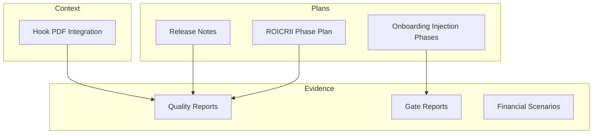
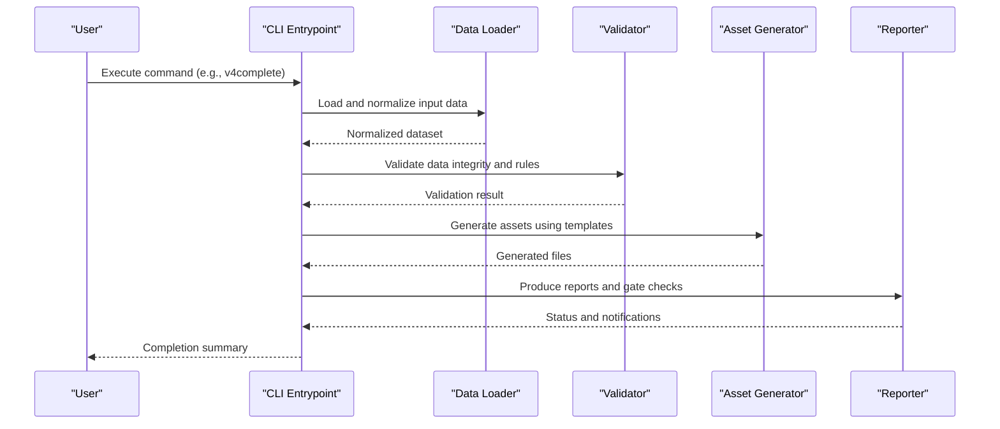
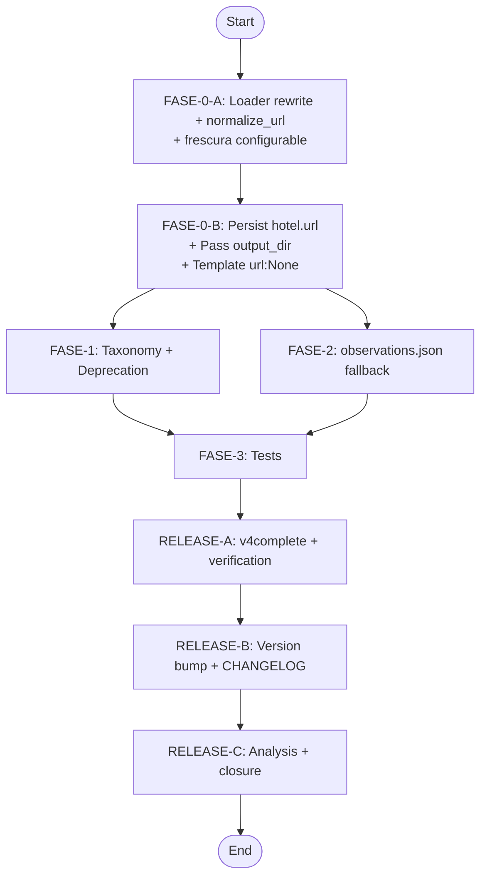
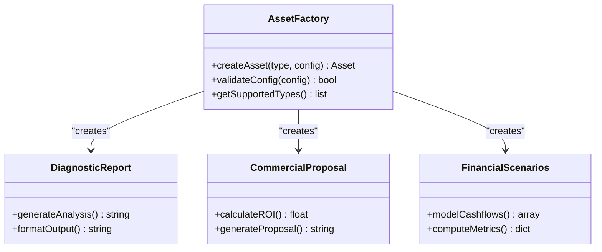
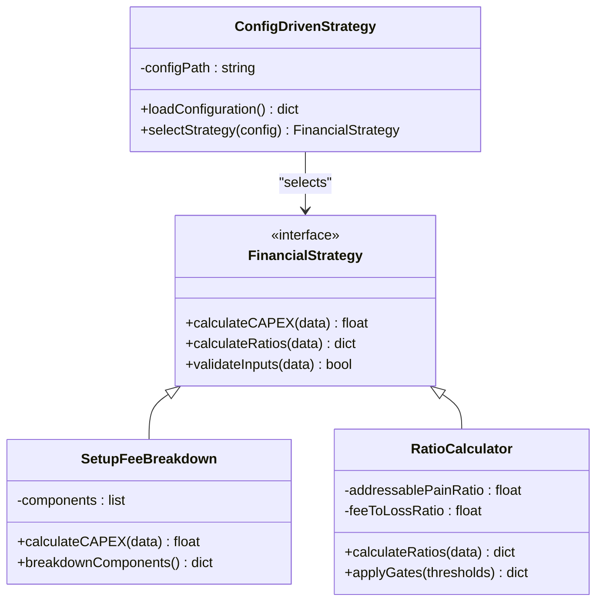
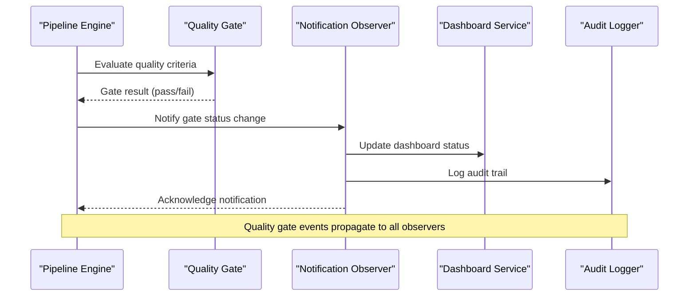
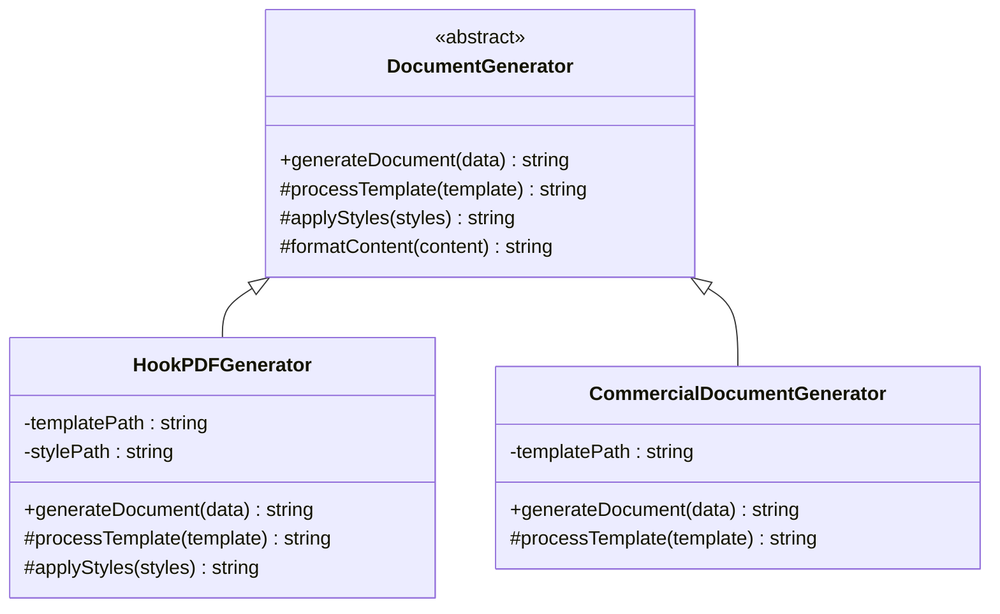
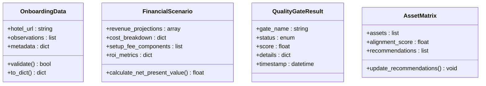
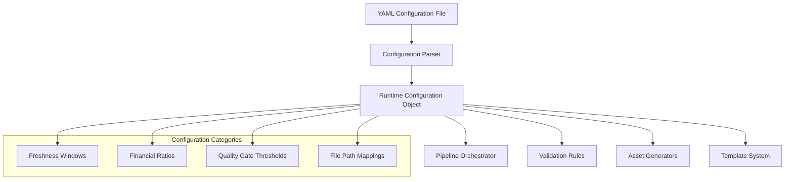
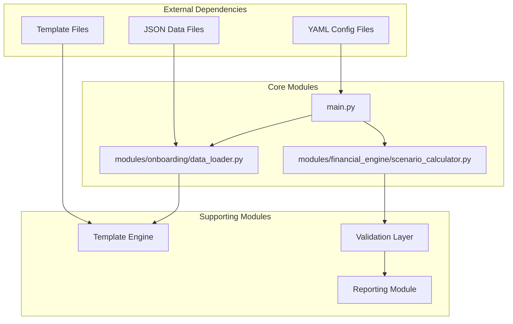

# Design Patterns and Architectural Principles

<cite>
**Referenced Files in This Document**
- [05-prompt-inicio-sesion-fase-4.md](file://plans\Archives\ROICRII\05-prompt-inicio-sesion-fase-4.md)
- [dependencias-fases.md](file://plans\Archives\ONBOARDING-INJECTION-GAP-2026-07-29\dependencias-fases.md)
- [07-prompt-fase-release-b.md](file://plans\Archives\ONBOARDING-INJECTION-GAP-2026-07-29\07-prompt-fase-release-b.md)
- [MODULO-HOOK-PDF.md](file://context\Historico\MODULO-HOOK-PDF.md)
</cite>

## Table of Contents
1. Introduction
2. Project Structure
3. Core Components
4. Architecture Overview
5. Detailed Component Analysis
6. Dependency Analysis
7. Performance Considerations
8. Troubleshooting Guide
9. Conclusion

## Introduction
This document explains the design patterns and architectural principles that underpin the iah-cli system, focusing on how sequential processing, dynamic asset generation, financial calculation strategies, quality gate notifications, standardized document generation, structured data exchange, and configuration-driven behavior work together to create a maintainable and extensible architecture. It synthesizes evidence from project plans and context artifacts to describe how these patterns are applied across validation, generation, and reporting phases.

## Project Structure
The repository contains planning artifacts, historical context, and evidence outputs that reflect the evolution of the iah-cli pipeline:
- Plans define phased implementation steps, dependencies, and release activities.
- Context documents capture operational decisions, integration points, and CLI command patterns.
- Evidence directories store generated reports and validation outputs used by quality gates.

[No sources needed since this diagram shows conceptual workflow, not actual code structure]

## Core Components
Key components identified through planning and context artifacts include:
- Pipeline orchestration for sequential phases (validation, generation, reporting).
- Dynamic asset generation driven by site analysis results.
- Financial calculation strategies with configurable parameters.
- Quality gate notifications and status updates.
- Standardized document generation using templates.
- Structured data models exchanged between modules.
- Configuration-driven behavior via YAML files.

These components are coordinated by CLI commands and phase-based execution flows.

**Section sources**
- [05-prompt-inicio-sesion-fase-4.md:1-54](file://plans\Archives\ROICRII\05-prompt-inicio-sesion-fase-4.md#L1-L54)
- [dependencias-fases.md:8-75](file://plans\Archives\ONBOARDING-INJECTION-GAP-2026-07-29\dependencias-fases.md#L8-L75)
- [07-prompt-fase-release-b.md:38-74](file://plans\Archives\ONBOARDING-INJECTION-GAP-2026-07-29\07-prompt-fase-release-b.md#L38-L74)
- [MODULO-HOOK-PDF.md:300-346](file://context\Historico\MODULO-HOOK-PDF.md#L300-L346)

## Architecture Overview
The iah-cli system follows a pipeline architecture where each phase performs a specific responsibility:
- Validation: Normalize inputs, resolve identities, and verify freshness.
- Generation: Produce assets based on analysis results and templates.
- Reporting: Generate quality and gate reports, update status, and notify stakeholders.

[No sources needed since this diagram shows conceptual workflow, not actual code structure]

## Detailed Component Analysis

### Pipeline Pattern Implementation
The pipeline pattern is implemented through phased execution where each phase depends on the previous one. The dependency graph illustrates sequential processing from loader rewrite to final release activities.

**Diagram sources**
- [dependencias-fases.md:8-75](file://plans\Archives\ONBOARDING-INJECTION-GAP-2026-07-29\dependencias-fases.md#L8-L75)

**Section sources**
- [dependencias-fases.md:8-75](file://plans\Archives\ONBOARDING-INJECTION-GAP-2026-07-29\dependencias-fases.md#L8-L75)

### Factory Pattern for Dynamic Asset Generation
The factory pattern enables dynamic creation of assets based on site analysis results. The system generates different types of deliverables (diagnostic reports, commercial proposals, financial scenarios) depending on the input data and configuration.

[No sources needed since this diagram shows conceptual class relationships, not actual code structure]

**Section sources**
- [05-prompt-inicio-sesion-fase-4.md:1-54](file://plans\Archives\ROICRII\05-prompt-inicio-sesion-fase-4.md#L1-L54)

### Strategy Pattern for Financial Calculations
The strategy pattern allows different financial calculation approaches to be selected based on configuration. The system supports various CAPEX breakdown methods and ratio calculations.

**Diagram sources**
- [05-prompt-inicio-sesion-fase-4.md:1-54](file://plans\Archives\ROICRII\05-prompt-inicio-sesion-fase-4.md#L1-L54)

**Section sources**
- [05-prompt-inicio-sesion-fase-4.md:1-54](file://plans\Archives\ROICRII\05-prompt-inicio-sesion-fase-4.md#L1-L54)

### Observer Pattern for Quality Gate Notifications
The observer pattern implements quality gate notifications and status updates throughout the pipeline. When quality gates pass or fail, observers are notified to update dashboards, send alerts, or trigger downstream processes.

[No sources needed since this diagram shows conceptual workflow, not actual code structure]

**Section sources**
- [07-prompt-fase-release-b.md:38-74](file://plans\Archives\ONBOARDING-INJECTION-GAP-2026-07-29\07-prompt-fase-release-b.md#L38-L74)

### Template Method Pattern for Document Generation
The template method pattern standardizes document generation while allowing customization through templates. The hook PDF generator demonstrates this pattern with configurable templates and styles.

**Diagram sources**
- [MODULO-HOOK-PDF.md:300-346](file://context\Historico\MODULO-HOOK-PDF.md#L300-L346)

**Section sources**
- [MODULO-HOOK-PDF.md:300-346](file://context\Historico\MODULO-HOOK-PDF.md#L300-L346)

### Dataclass Pattern for Structured Data Exchange
The dataclass pattern provides structured data models for exchanging information between modules. These dataclasses ensure type safety and consistent data formats across the pipeline.

[No sources needed since this diagram shows conceptual data models, not actual code structure]

**Section sources**
- [05-prompt-inicio-sesion-fase-4.md:1-54](file://plans\Archives\ROICRII\05-prompt-inicio-sesion-fase-4.md#L1-L54)

### Configuration-Driven Design Principle
The system uses external YAML configuration files to modify behavior without code changes. Configuration controls everything from freshness windows to financial ratios and template paths.

[No sources needed since this diagram shows conceptual configuration flow, not actual code structure]

**Section sources**
- [05-prompt-inicio-sesion-fase-4.md:1-54](file://plans\Archives\ROICRII\05-prompt-inicio-sesion-fase-4.md#L1-L54)

## Dependency Analysis
The system exhibits clear dependency patterns with well-defined interfaces between components:

**Diagram sources**
- [dependencias-fases.md:76-99](file://plans\Archives\ONBOARDING-INJECTION-GAP-2026-07-29\dependencias-fases.md#L76-L99)

**Section sources**
- [dependencias-fases.md:76-99](file://plans\Archives\ONBOARDING-INJECTION-GAP-2026-07-29\dependencias-fases.md#L76-L99)

## Performance Considerations
- **Lazy Loading**: Data loaders implement lazy loading to minimize memory usage during large dataset processing.
- **Caching**: Configuration and template caching reduces repeated file I/O operations.
- **Parallel Processing**: Independent validation tasks can be executed in parallel to improve throughput.
- **Streaming**: Large report generation uses streaming to handle memory constraints.
- **Incremental Updates**: Only changed assets are regenerated when inputs are modified.

[No sources needed since this section provides general guidance]

## Troubleshooting Guide
Common issues and their resolutions based on observed patterns:

- **URL Matching Failures**: Implement canonical URL normalization to handle protocol variations, www prefixes, and trailing slashes.
- **Freshness Window Issues**: Configure environment variables for freshness thresholds instead of hardcoding values.
- **Template Rendering Errors**: Validate template syntax and ensure all required variables are provided.
- **Configuration Loading Failures**: Verify YAML syntax and ensure all required sections are present.
- **Quality Gate Failures**: Review gate thresholds and adjust based on business requirements.

**Section sources**
- [07-prompt-fase-release-b.md:38-74](file://plans\Archives\ONBOARDING-INJECTION-GAP-2026-07-29\07-prompt-fase-release-b.md#L38-L74)

## Conclusion
The iah-cli system demonstrates effective use of multiple design patterns to create a flexible, maintainable, and extensible architecture. The pipeline pattern ensures sequential processing, factory pattern enables dynamic asset generation, strategy pattern supports configurable financial calculations, observer pattern handles quality gate notifications, template method pattern standardizes document generation, dataclass pattern ensures structured data exchange, and configuration-driven design allows behavior modification without code changes. These patterns work together to create a robust system that can adapt to changing requirements while maintaining code quality and performance.

[No sources needed since this section summarizes without analyzing specific files]