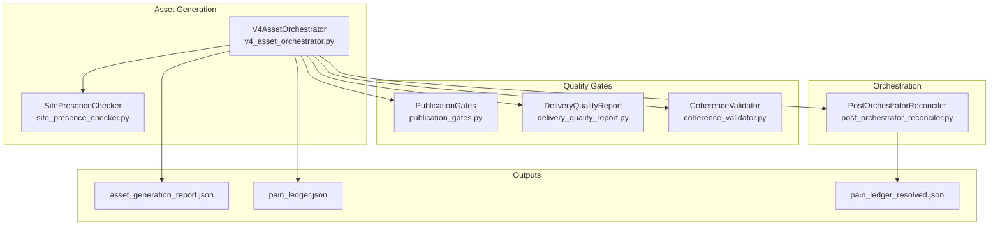
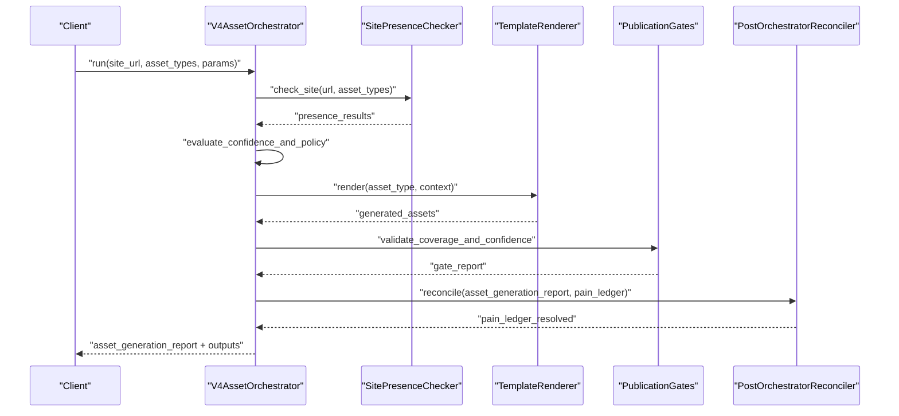
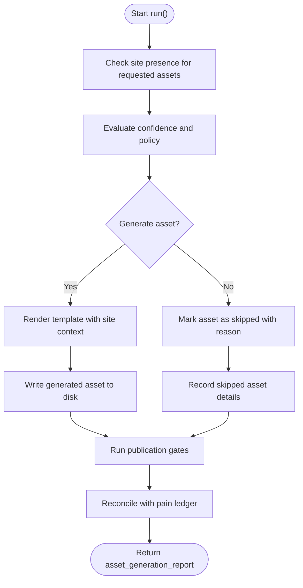
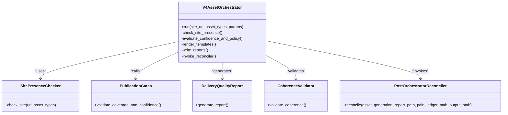

# Asset Generation Engine

<cite>
**Referenced Files in This Document**
- [v4_asset_orchestrator.py](file://modules/asset_generation/v4_asset_orchestrator.py)
- [site_presence_checker.py](file://modules/asset_generation/site_presence_checker.py)
- [post_orchestrator_reconciler.py](file://modules/orchestration/post_orchestrator_reconciler.py)
- [publication_gates.py](file://modules/quality_gates/publication_gates.py)
- [delivery_quality_report.py](file://modules/quality_gates/delivery_quality_report.py)
- [coherence_validator.py](file://modules/quality_gates/coherence_validator.py)
- [proposal_asset_alignment.py](file://modules/commercial_documents/proposal_asset_alignment.py)
- [pain_ledger.json](file://output/v4_audit/pain_ledger.json)
- [asset_generation_report.json](file://output/v4_audit/asset_generation_report.json)
- [asset_generation_report.json (FASE-6)](file://plans/Archives/DT4-RESIDUAL-FIXES/evidence/FASE-6/asset_generation_report.json)
- [gate_report_20260728_091951.json](file://plans/Archives/DT4-RESIDUAL-FIXES/evidence/FASE-6/gate_report_20260728_091951.json)
- [CONTEXT-DELIVERY-ZIP-PACKAGING-BROKEN-2026-08-01.md](file://context/CONTEXT-DELIVERY-ZIP-PACKAGING-BROKEN-2026-08-01.md)
- [CONTEXT-DT-3-POST-ANALYSIS-VALIDATED-2026-07-25.md](file://context/Historico/CONTEXT-DT-3-POST-ANALYSIS-VALIDATED-2026-07-25.md)
- [CONTEXT-DT-4.md](file://context/Historico/CONTEXT-DT-4.md)
- [CONTEXT-DT4-RESIDUAL-FIXES.md](file://context/Historico/CONTEXT-DT4-RESIDUAL-FIXES.md)
</cite>

## Table of Contents
1. [Introduction](#introduction)
2. [Project Structure](#project-structure)
3. [Core Components](#core-components)
4. [Architecture Overview](#architecture-overview)
5. [Detailed Component Analysis](#detailed-component-analysis)
6. [Dependency Analysis](#dependency-analysis)
7. [Performance Considerations](#performance-considerations)
8. [Troubleshooting Guide](#troubleshooting-guide)
9. [Conclusion](#conclusion)

## Introduction
This document explains the Asset Generation Engine that powers dynamic, site-aware asset creation through V4AssetOrchestrator. It focuses on how site analysis results drive conditional generation decisions for assets such as FAQ pages, optimization guides, WhatsApp integration, and analytics setup. It also documents the asset catalog management system, template rendering engine, quality validation processes, and the reconciliation step that aligns generated assets with pain points. Practical examples of asset specifications, generation parameters, and output formats are included to help both technical and non-technical readers understand the end-to-end flow.

## Project Structure
The Asset Generation Engine is implemented across several modules:
- Orchestrator and conditional generation logic live in the asset generation module.
- Site presence checks are performed by a dedicated checker.
- Quality gates validate coverage, confidence, and coherence before publication.
- A post-orchestration reconciler ensures alignment between assets and identified pain points.
- Outputs include structured reports and generated assets under versioned directories.

**Diagram sources**
- [v4_asset_orchestrator.py](file://modules/asset_generation/v4_asset_orchestrator.py)
- [site_presence_checker.py](file://modules/asset_generation/site_presence_checker.py)
- [publication_gates.py](file://modules/quality_gates/publication_gates.py)
- [delivery_quality_report.py](file://modules/quality_gates/delivery_quality_report.py)
- [coherence_validator.py](file://modules/quality_gates/coherence_validator.py)
- [post_orchestrator_reconciler.py](file://modules/orchestration/post_orchestrator_reconciler.py)

**Section sources**
- [CONTEXT-DELIVERY-ZIP-PACKAGING-BROKEN-2026-08-01.md](file://context/CONTEXT-DELIVERY-ZIP-PACKAGING-BROKEN-2026-08-01.md)
- [CONTEXT-DT-3-POST-ANALYSIS-VALIDATED-2026-07-25.md](file://context/Historico/CONTEXT-DT-3-POST-ANALYSIS-VALIDATED-2026-07-25.md)

## Core Components
- V4AssetOrchestrator: Central controller that coordinates site analysis, conditional asset generation, template rendering, and report writing. It decides which assets to create based on site presence and quality thresholds.
- SitePresenceChecker: Inspects the target site to determine whether specific assets already exist or have issues, returning structured presence results used by the orchestrator’s decision logic.
- PostOrchestratorReconciler: Runs after asset generation to reconcile the pain ledger with the asset generation report, producing a resolved ledger that reflects actual coverage and gaps.
- Quality Gates: Enforce confidence thresholds, coverage ratios, and coherence constraints; they can block or warn about assets below required standards.

Key responsibilities:
- Conditional generation: Decide whether to generate an asset based on presence checks, confidence scores, and policy rules.
- Catalog management: Maintain a canonical list of supported asset types and their metadata.
- Template rendering: Populate templates with site-specific data to produce final assets.
- Validation: Ensure outputs meet quality criteria before marking them ready for publication.

**Section sources**
- [v4_asset_orchestrator.py](file://modules/asset_generation/v4_asset_orchestrator.py)
- [site_presence_checker.py](file://modules/asset_generation/site_presence_checker.py)
- [post_orchestrator_reconciler.py](file://modules/orchestration/post_orchestrator_reconciler.py)
- [publication_gates.py](file://modules/quality_gates/publication_gates.py)

## Architecture Overview
The orchestration flow integrates site analysis, conditional generation, and quality validation into a cohesive pipeline. The orchestrator uses presence checks to avoid redundant work and ensure assets address real gaps. After generation, a reconciler aligns outcomes with pain points, while quality gates enforce publishability.

**Diagram sources**
- [v4_asset_orchestrator.py](file://modules/asset_generation/v4_asset_orchestrator.py)
- [site_presence_checker.py](file://modules/asset_generation/site_presence_checker.py)
- [post_orchestrator_reconciler.py](file://modules/orchestration/post_orchestrator_reconciler.py)
- [publication_gates.py](file://modules/quality_gates/publication_gates.py)

## Detailed Component Analysis

### V4AssetOrchestrator
Responsibilities:
- Coordinates site analysis via SitePresenceChecker.
- Applies conditional generation logic using confidence thresholds and policy rules.
- Renders templates to produce final assets.
- Writes asset_generation_report.json and interacts with pain_ledger.json.
- Invokes PostOrchestratorReconciler to produce pain_ledger_resolved.json.

Conditional generation logic highlights:
- Assets with presence_status indicating existing or redundant items may be skipped or flagged.
- Confidence scores below thresholds trigger warnings or blocks depending on gate policies.
- Skipped assets record affected pain_ids to support reconciliation.

**Diagram sources**
- [v4_asset_orchestrator.py](file://modules/asset_generation/v4_asset_orchestrator.py)
- [post_orchestrator_reconciler.py](file://modules/orchestration/post_orchestrator_reconciler.py)

**Section sources**
- [CONTEXT-DT-3-POST-ANALYSIS-VALIDATED-2026-07-25.md](file://context/Historico/CONTEXT-DT-3-POST-ANALYSIS-VALIDATED-2026-07-25.md)
- [CONTEXT-DT-4.md](file://context/Historico/CONTEXT-DT-4.md)
- [CONTEXT-DT4-RESIDUAL-FIXES.md](file://context/Historico/CONTEXT-DT4-RESIDUAL-FIXES.md)

### SitePresenceChecker
Purpose:
- Determines whether specific assets exist on the target site or have known issues.
- Returns structured results per asset type, including status and confidence indicators.

Usage:
- Called by V4AssetOrchestrator to inform conditional generation decisions.
- Results feed into quality gates to assess coverage and redundancy.

Example verification pattern:
- Isolated tests call the checker with a URL and asset types, asserting expected statuses like “exists”.

**Section sources**
- [site_presence_checker.py](file://modules/asset_generation/site_presence_checker.py)
- [CONTEXT-DT4-RESIDUAL-FIXES.md](file://context/Historico/CONTEXT-DT4-RESIDUAL-FIXES.md)

### PostOrchestratorReconciler
Purpose:
- Aligns generated assets with identified pain points.
- Reads asset_generation_report.json and pain_ledger.json to produce pain_ledger_resolved.json.

Integration:
- Invoked from V4AssetOrchestrator after asset generation completes.
- Ensures unresolved gaps are documented and actionable.

**Section sources**
- [post_orchestrator_reconciler.py](file://modules/orchestration/post_orchestrator_reconciler.py)
- [CONTEXT-DT-3-POST-ANALYSIS-VALIDATED-2026-07-25.md](file://context/Historico/CONTEXT-DT-3-POST-ANALYSIS-VALIDATED-2026-07-25.md)

### Quality Gates (PublicationGates, DeliveryQualityReport, CoherenceValidator)
Responsibilities:
- Enforce confidence thresholds (e.g., minimum 0.7).
- Measure coverage ratios and flag uncovered pain points.
- Validate coherence between proposed services and generated assets.

Gate behaviors observed:
- Confidence warnings when assets fall below threshold.
- Coverage failures when certain pain points remain uncovered.
- Alignment metrics summarizing promised vs. generated vs. present assets.

**Section sources**
- [publication_gates.py](file://modules/quality_gates/publication_gates.py)
- [delivery_quality_report.py](file://modules/quality_gates/delivery_quality_report.py)
- [coherence_validator.py](file://modules/quality_gates/coherence_validator.py)
- [asset_generation_report.json (FASE-6)](file://plans/Archives/DT4-RESIDUAL-FIXES/evidence/FASE-6/asset_generation_report.json)
- [gate_report_20260728_091951.json](file://plans/Archives/DT4-RESIDUAL-FIXES/evidence/FASE-6/gate_report_20260728_091951.json)

### Asset Catalog Management System
Scope:
- Maintains a canonical list of supported asset types (e.g., faq_page, optimization_guide, whatsapp_button, llms_txt, schema assets).
- Associates each asset with metadata such as purpose, mapping to pain IDs, and deprecation status.

Operational notes:
- Deprecated assets are filtered at render/output stages without altering the core generation pipeline.
- Mapping between asset types and pain IDs supports semantic validation and alignment reporting.

**Section sources**
- [CONTEXT-DT4-RESIDUAL-FIXES.md](file://context/Historico/CONTEXT-DT4-RESIDUAL-FIXES.md)
- [CONTEXT-DT-3-POST-ANALYSIS-VALIDATED-2026-07-25.md](file://context/Historico/CONTEXT-DT-3-POST-ANALYSIS-VALIDATED-2026-07-25.md)

### Template Rendering Engine
Role:
- Populates templates with site-specific data to produce final assets.
- Supports multiple asset formats (e.g., Markdown for guides, JSON for FAQs).

Rendering inputs:
- Site analysis results and contextual parameters.
- Asset specifications and configuration options.

Outputs:
- Versioned files under working directories (e.g., output/v4_complete/<slug>/).

**Section sources**
- [CONTEXT-DELIVERY-ZIP-PACKAGING-BROKEN-2026-08-01.md](file://context/CONTEXT-DELIVERY-ZIP-PACKAGING-BROKEN-2026-08-01.md)
- [v4_asset_orchestrator.py](file://modules/asset_generation/v4_asset_orchestrator.py)

### Quality Validation Processes
Validation layers:
- Pre-generation checks: Presence verification and confidence assessment.
- Post-generation checks: Publication gates evaluate coverage, confidence, and coherence.
- Reconciliation: Aligns outcomes with pain points and documents unresolved gaps.

Evidence:
- Reports include alignment metrics, presence verification, and gate pass/fail statuses.

**Section sources**
- [asset_generation_report.json (FASE-6)](file://plans/Archives/DT4-RESIDUAL-FIXES/evidence/FASE-6/asset_generation_report.json)
- [gate_report_20260728_091951.json](file://plans/Archives/DT4-RESIDUAL-FIXES/evidence/FASE-6/gate_report_20260728_091951.json)

## Dependency Analysis
The orchestrator depends on site presence checks, quality gates, and reconciliation to make informed decisions and ensure publishable outputs.

**Diagram sources**
- [v4_asset_orchestrator.py](file://modules/asset_generation/v4_asset_orchestrator.py)
- [site_presence_checker.py](file://modules/asset_generation/site_presence_checker.py)
- [publication_gates.py](file://modules/quality_gates/publication_gates.py)
- [delivery_quality_report.py](file://modules/quality_gates/delivery_quality_report.py)
- [coherence_validator.py](file://modules/quality_gates/coherence_validator.py)
- [post_orchestrator_reconciler.py](file://modules/orchestration/post_orchestrator_reconciler.py)

**Section sources**
- [CONTEXT-DT-3-POST-ANALYSIS-VALIDATED-2026-07-25.md](file://context/Historico/CONTEXT-DT-3-POST-ANALYSIS-VALIDATED-2026-07-25.md)
- [CONTEXT-DT-4.md](file://context/Historico/CONTEXT-DT-4.md)

## Performance Considerations
- Batch processing: Group asset generations by site to minimize repeated presence checks.
- Caching presence results: Store presence checks per site and asset type to avoid redundant network calls.
- Parallel rendering: Render independent assets concurrently where safe.
- Incremental updates: Regenerate only assets whose dependencies changed.
- Resource limits: Enforce timeouts and memory caps during large-scale generation runs.

[No sources needed since this section provides general guidance]

## Troubleshooting Guide
Common issues and resolutions:
- Low confidence scores: Assets marked with ESTIMATED_ prefix and confidence below threshold require additional data or adjusted thresholds.
- Coverage failures: Uncovered pain points indicate missing assets or misalignment; review gate reports and reconcile ledgers.
- Redundant assets: Presence checks may detect existing assets; skip generation or update templates to avoid duplication.
- Syntax warnings: Address preexisting warnings in orchestrator code to prevent runtime issues.

Diagnostic artifacts:
- asset_generation_report.json: Summarizes generated and skipped assets with statuses and confidence scores.
- pain_ledger.json and pain_ledger_resolved.json: Track identified pains and their resolution status.
- Gate reports: Provide detailed pass/fail metrics and alignment summaries.

**Section sources**
- [asset_generation_report.json (FASE-6)](file://plans/Archives/DT4-RESIDUAL-FIXES/evidence/FASE-6/asset_generation_report.json)
- [gate_report_20260728_091951.json](file://plans/Archives/DT4-RESIDUAL-FIXES/evidence/FASE-6/gate_report_20260728_091951.json)
- [CONTEXT-DT4-RESIDUAL-FIXES.md](file://context/Historico/CONTEXT-DT4-RESIDUAL-FIXES.md)

## Conclusion
The Asset Generation Engine leverages site analysis, conditional generation, and robust quality validation to produce targeted digital assets. V4AssetOrchestrator coordinates presence checks, template rendering, and reconciliation to ensure assets address real business needs. Quality gates and ledgers provide transparency and accountability, enabling reliable, scalable asset production aligned with site conditions and strategic goals.