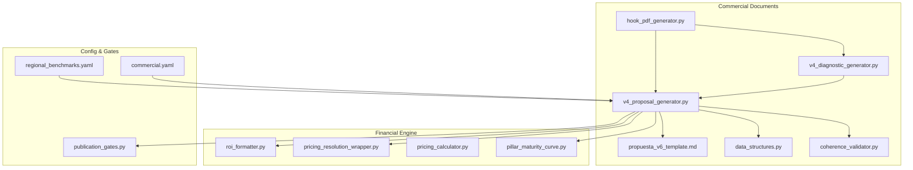
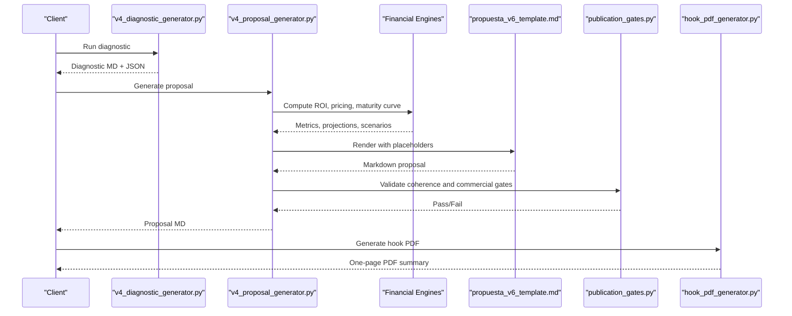
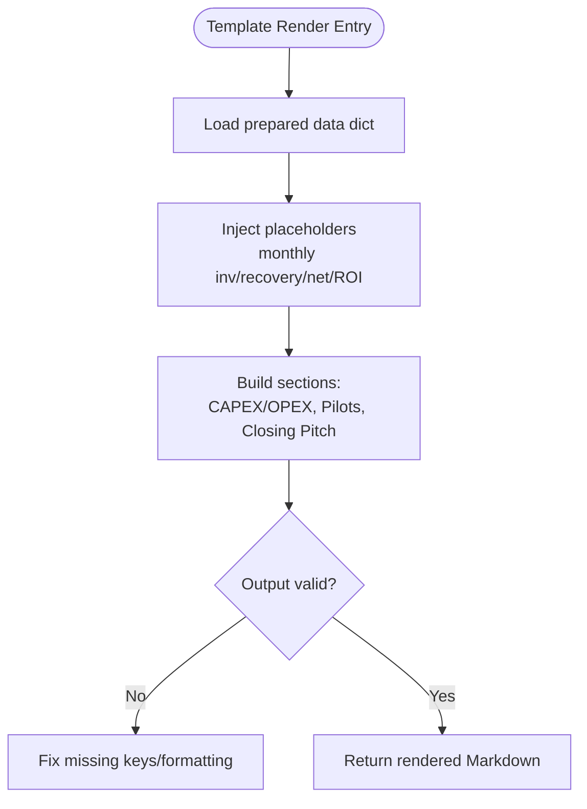
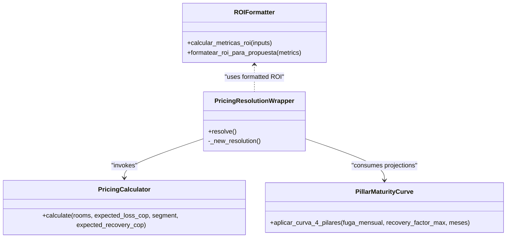
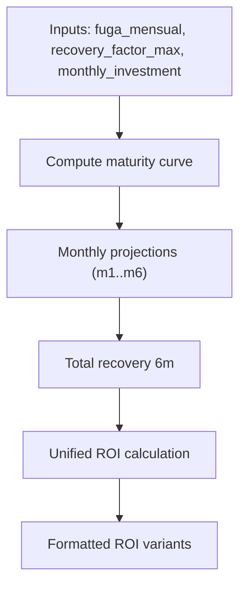
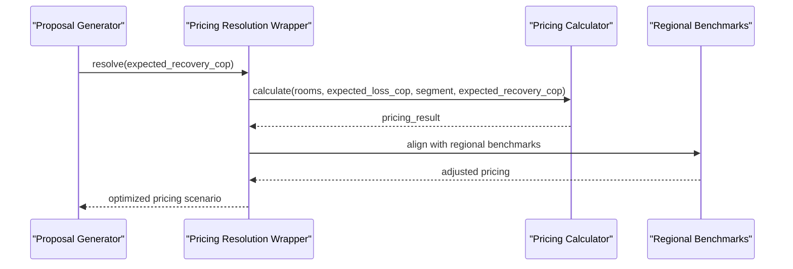
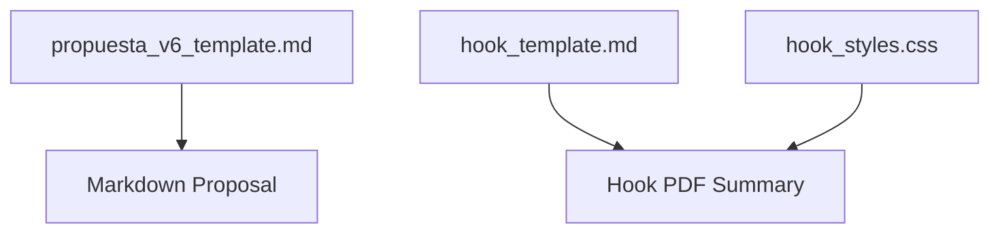
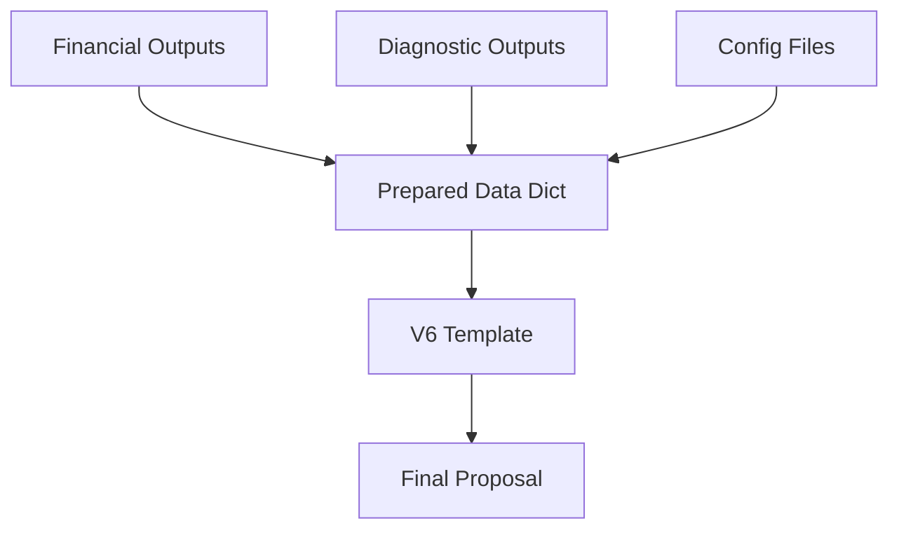
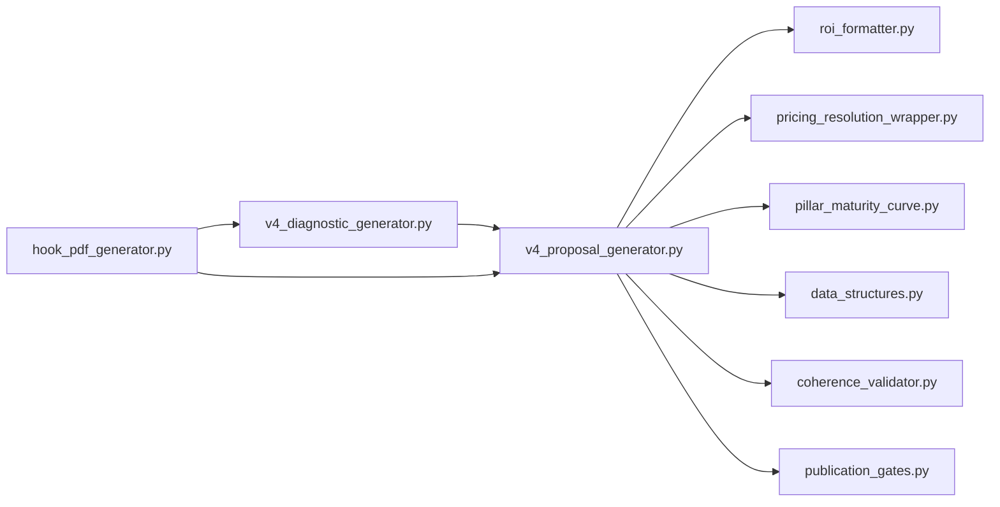

# Commercial Document Generator

<cite>
**Referenced Files in This Document**
- [v4_proposal_generator.py](file://modules/commercial_documents/v4_proposal_generator.py)
- [propuesta_v6_template.md](file://modules/commercial_documents/templates/propuesta_v6_template.md)
- [roi_formatter.py](file://modules/financial_engine/roi_formatter.py)
- [pricing_resolution_wrapper.py](file://modules/financial_engine/pricing_resolution_wrapper.py)
- [pricing_calculator.py](file://modules/financial_engine/pricing_calculator.py)
- [pillar_maturity_curve.py](file://modules/financial_engine/pillar_maturity_curve.py)
- [data_structures.py](file://modules/commercial_documents/data_structures.py)
- [coherence_validator.py](file://modules/commercial_documents/coherence_validator.py)
- [commercial.yaml](file://config/commercial.yaml)
- [regional_benchmarks.yaml](file://config/regional_benchmarks.yaml)
- [publication_gates.py](file://modules/quality_gates/publication_gates.py)
- [v4_diagnostic_generator.py](file://modules/commercial_documents/v4_diagnostic_generator.py)
- [hook_pdf_generator.py](file://modules/commercial_documents/hook_pdf_generator.py)
- [hook_template.md](file://templates/hook_template.md)
- [hook_styles.css](file://templates/hook_styles.css)
- [test_financial_coherence.py](file://tests/commercial_documents/test_financial_coherence.py)
- [ROICRIII.md](file://context/Historico/ROICRIII.md)
- [05-prompt-inicio-sesion-fase-1.md](file://plans/Archives/ROICRII/05-prompt-inicio-sesion-fase-1.md)
- [05-prompt-inicio-sesion-fase-2.md](file://plans/Archives/ROICRII/05-prompt-inicio-sesion-fase-2.md)
- [06-checklist-implementacion.md](file://plans/Archives/ROICRII/06-checklist-implementacion.md)
- [MODULO-HOOK-PDF.md](file://context/Historico/MODULO-HOOK-PDF.md)
</cite>

## Table of Contents
1. [Introduction](#introduction)
2. [Project Structure](#project-structure)
3. [Core Components](#core-components)
4. [Architecture Overview](#architecture-overview)
5. [Detailed Component Analysis](#detailed-component-analysis)
6. [Dependency Analysis](#dependency-analysis)
7. [Performance Considerations](#performance-considerations)
8. [Troubleshooting Guide](#troubleshooting-guide)
9. [Conclusion](#conclusion)
10. [Appendices](#appendices)

## Introduction
This document explains the Commercial Document Generator module that produces professional business proposals using a V6 template engine with dynamic content injection. It covers financial modeling integration, multi-format output generation (Markdown and PDF), ROI calculations, maturity curve modeling, pricing optimization, and how financial analysis outputs feed into document generation inputs. It also documents template versioning, customization patterns, and integration points within the broader pipeline architecture.

## Project Structure
The Commercial Document Generator is centered around:
- A proposal generator that prepares data and renders templates
- A V6 Markdown template for commercial proposals
- Financial engines for ROI formatting, pricing resolution, and maturity curves
- Quality gates and coherence validation
- Optional PDF hook generation for compact one-page summaries

**Diagram sources**
- [v4_proposal_generator.py](file://modules/commercial_documents/v4_proposal_generator.py)
- [propuesta_v6_template.md](file://modules/commercial_documents/templates/propuesta_v6_template.md)
- [roi_formatter.py](file://modules/financial_engine/roi_formatter.py)
- [pricing_resolution_wrapper.py](file://modules/financial_engine/pricing_resolution_wrapper.py)
- [pricing_calculator.py](file://modules/financial_engine/pricing_calculator.py)
- [pillar_maturity_curve.py](file://modules/financial_engine/pillar_maturity_curve.py)
- [data_structures.py](file://modules/commercial_documents/data_structures.py)
- [coherence_validator.py](file://modules/commercial_documents/coherence_validator.py)
- [v4_diagnostic_generator.py](file://modules/commercial_documents/v4_diagnostic_generator.py)
- [hook_pdf_generator.py](file://modules/commercial_documents/hook_pdf_generator.py)
- [commercial.yaml](file://config/commercial.yaml)
- [regional_benchmarks.yaml](file://config/regional_benchmarks.yaml)
- [publication_gates.py](file://modules/quality_gates/publication_gates.py)

**Section sources**
- [v4_proposal_generator.py](file://modules/commercial_documents/v4_proposal_generator.py)
- [propuesta_v6_template.md](file://modules/commercial_documents/templates/propuesta_v6_template.md)
- [roi_formatter.py](file://modules/financial_engine/roi_formatter.py)
- [pricing_resolution_wrapper.py](file://modules/financial_engine/pricing_resolution_wrapper.py)
- [pricing_calculator.py](file://modules/financial_engine/pricing_calculator.py)
- [pillar_maturity_curve.py](file://modules/financial_engine/pillar_maturity_curve.py)
- [data_structures.py](file://modules/commercial_documents/data_structures.py)
- [coherence_validator.py](file://modules/commercial_documents/coherence_validator.py)
- [v4_diagnostic_generator.py](file://modules/commercial_documents/v4_diagnostic_generator.py)
- [hook_pdf_generator.py](file://modules/commercial_documents/hook_pdf_generator.py)
- [commercial.yaml](file://config/commercial.yaml)
- [regional_benchmarks.yaml](file://config/regional_benchmarks.yaml)
- [publication_gates.py](file://modules/quality_gates/publication_gates.py)

## Core Components
- Proposal Generator (V4): Orchestrates data preparation, financial calculations, template rendering, and output generation.
- V6 Template Engine: Renders Markdown proposals with placeholders for dynamic financials, projections, and sections like CAPEX/OPEX, pilot offers, and closing pitch.
- Financial Engines:
  - ROI Formatter: Centralized ROI calculation and formatting.
  - Pricing Resolution Wrapper: Bridges diagnostic data to pricing calculator with expected recovery.
  - Pillar Maturity Curve: Models monthly recovery across four pillars over six months.
- Data Structures: Typed models for diagnostic/proposal artifacts and scenarios.
- Coherence Validator: Ensures alignment between diagnosis and proposal.
- Publication Gates: Enforces quality and commercial viability checks.
- Hook PDF Generator: Produces a concise PDF summary from diagnostic and proposal outputs.

Key responsibilities and interactions are detailed in subsequent sections.

**Section sources**
- [v4_proposal_generator.py](file://modules/commercial_documents/v4_proposal_generator.py)
- [propuesta_v6_template.md](file://modules/commercial_documents/templates/propuesta_v6_template.md)
- [roi_formatter.py](file://modules/financial_engine/roi_formatter.py)
- [pricing_resolution_wrapper.py](file://modules/financial_engine/pricing_resolution_wrapper.py)
- [pricing_calculator.py](file://modules/financial_engine/pricing_calculator.py)
- [pillar_maturity_curve.py](file://modules/financial_engine/pillar_maturity_curve.py)
- [data_structures.py](file://modules/commercial_documents/data_structures.py)
- [coherence_validator.py](file://modules/commercial_documents/coherence_validator.py)
- [publication_gates.py](file://modules/quality_gates/publication_gates.py)
- [hook_pdf_generator.py](file://modules/commercial_documents/hook_pdf_generator.py)

## Architecture Overview
The system follows a layered architecture:
- Input Layer: Diagnostic outputs and configuration files provide context and parameters.
- Processing Layer: The proposal generator orchestrates financial modeling (ROI, pricing, maturity curve).
- Rendering Layer: V6 template engine injects dynamic values into Markdown; optional PDF hook generator creates a compact summary.
- Validation Layer: Coherence validator and publication gates ensure consistency and commercial viability.

**Diagram sources**
- [v4_diagnostic_generator.py](file://modules/commercial_documents/v4_diagnostic_generator.py)
- [v4_proposal_generator.py](file://modules/commercial_documents/v4_proposal_generator.py)
- [roi_formatter.py](file://modules/financial_engine/roi_formatter.py)
- [pricing_resolution_wrapper.py](file://modules/financial_engine/pricing_resolution_wrapper.py)
- [pricing_calculator.py](file://modules/financial_engine/pricing_calculator.py)
- [pillar_maturity_curve.py](file://modules/financial_engine/pillar_maturity_curve.py)
- [propuesta_v6_template.md](file://modules/commercial_documents/templates/propuesta_v6_template.md)
- [publication_gates.py](file://modules/quality_gates/publication_gates.py)
- [hook_pdf_generator.py](file://modules/commercial_documents/hook_pdf_generator.py)

## Detailed Component Analysis

### V6 Template Engine and Dynamic Content Injection
- Purpose: Transform structured data into a polished Markdown proposal with consistent sections and financial narratives.
- Placeholders: Monthly investment, recovery per month, net benefit, ROI variants, CAPEX breakdown, pilot offer details, closing pitch, and traceability notes.
- Customization: Template supports modular sections (e.g., pilot 30 days, CAPEX detail table) and can be extended without changing generator logic.

**Diagram sources**
- [propuesta_v6_template.md](file://modules/commercial_documents/templates/propuesta_v6_template.md)
- [v4_proposal_generator.py](file://modules/commercial_documents/v4_proposal_generator.py)

**Section sources**
- [propuesta_v6_template.md](file://modules/commercial_documents/templates/propuesta_v6_template.md)
- [v4_proposal_generator.py](file://modules/commercial_documents/v4_proposal_generator.py)

### Financial Modeling Integration
- ROI Formatter: Centralizes ROI computation and formatting, ensuring consistent precision and display across outputs.
- Pricing Resolution Wrapper: Integrates diagnostic loss estimates with pricing calculator via expected recovery, enabling a three-step pipeline.
- Pillar Maturity Curve: Models recovery across four pillars over six months, providing monthly projections and totals used by both proposal and PDF outputs.

**Diagram sources**
- [roi_formatter.py](file://modules/financial_engine/roi_formatter.py)
- [pricing_resolution_wrapper.py](file://modules/financial_engine/pricing_resolution_wrapper.py)
- [pricing_calculator.py](file://modules/financial_engine/pricing_calculator.py)
- [pillar_maturity_curve.py](file://modules/financial_engine/pillar_maturity_curve.py)

**Section sources**
- [roi_formatter.py](file://modules/financial_engine/roi_formatter.py)
- [pricing_resolution_wrapper.py](file://modules/financial_engine/pricing_resolution_wrapper.py)
- [pricing_calculator.py](file://modules/financial_engine/pricing_calculator.py)
- [pillar_maturity_curve.py](file://modules/financial_engine/pillar_maturity_curve.py)

### ROI Calculations and Maturity Curve Modeling
- ROI Calculation: Uses unified formatter to compute conservative, realistic, optimistic, and SaaS ROI metrics with precise formatting.
- Maturity Curve: Generates monthly recovery projections based on pillar adoption rates and recovery factors, summing to a total recovery over six months.
- Consistency: Ensures single source of truth for total recovery and ROI, eliminating contradictory displays in templates.

**Diagram sources**
- [pillar_maturity_curve.py](file://modules/financial_engine/pillar_maturity_curve.py)
- [roi_formatter.py](file://modules/financial_engine/roi_formatter.py)
- [v4_proposal_generator.py](file://modules/commercial_documents/v4_proposal_generator.py)

**Section sources**
- [pillar_maturity_curve.py](file://modules/financial_engine/pillar_maturity_curve.py)
- [roi_formatter.py](file://modules/financial_engine/roi_formatter.py)
- [v4_proposal_generator.py](file://modules/commercial_documents/v4_proposal_generator.py)

### Pricing Optimization Features
- Expected Recovery: Pricing wrapper passes expected recovery derived from pain ratio and recovery factor to activate the three-step pipeline.
- Scenario Generation: Generates multiple pricing scenarios aligned with diagnostic insights and regional benchmarks.
- Validation: Commercial gates enforce feasibility and coherence before finalizing outputs.

**Diagram sources**
- [pricing_resolution_wrapper.py](file://modules/financial_engine/pricing_resolution_wrapper.py)
- [pricing_calculator.py](file://modules/financial_engine/pricing_calculator.py)
- [regional_benchmarks.yaml](file://config/regional_benchmarks.yaml)
- [v4_proposal_generator.py](file://modules/commercial_documents/v4_proposal_generator.py)

**Section sources**
- [pricing_resolution_wrapper.py](file://modules/financial_engine/pricing_resolution_wrapper.py)
- [pricing_calculator.py](file://modules/financial_engine/pricing_calculator.py)
- [regional_benchmarks.yaml](file://config/regional_benchmarks.yaml)
- [v4_proposal_generator.py](file://modules/commercial_documents/v4_proposal_generator.py)

### Multi-Format Output Generation
- Markdown Proposals: Generated via V6 template with rich financial narratives and structured sections.
- PDF Summaries: Hook PDF generator creates a concise one-page summary using a dedicated template and styles.
- Versioning: Templates support versioned rendering paths and fallbacks for backward compatibility.

**Diagram sources**
- [propuesta_v6_template.md](file://modules/commercial_documents/templates/propuesta_v6_template.md)
- [hook_template.md](file://templates/hook_template.md)
- [hook_styles.css](file://templates/hook_styles.css)
- [hook_pdf_generator.py](file://modules/commercial_documents/hook_pdf_generator.py)

**Section sources**
- [propuesta_v6_template.md](file://modules/commercial_documents/templates/propuesta_v6_template.md)
- [hook_template.md](file://templates/hook_template.md)
- [hook_styles.css](file://templates/hook_styles.css)
- [hook_pdf_generator.py](file://modules/commercial_documents/hook_pdf_generator.py)

### Relationship Between Financial Analysis Outputs and Document Generation Inputs
- Financial outputs (ROI metrics, maturity projections, pricing scenarios) are injected into the proposal template as placeholders.
- Diagnostic outputs (pain ratios, opportunity scores, asset matrices) inform narrative sections and traceability notes.
- Configuration files (commercial.yaml, regional_benchmarks.yaml) drive defaults, caps, and regional adjustments.

**Diagram sources**
- [v4_proposal_generator.py](file://modules/commercial_documents/v4_proposal_generator.py)
- [propuesta_v6_template.md](file://modules/commercial_documents/templates/propuesta_v6_template.md)
- [commercial.yaml](file://config/commercial.yaml)
- [regional_benchmarks.yaml](file://config/regional_benchmarks.yaml)

**Section sources**
- [v4_proposal_generator.py](file://modules/commercial_documents/v4_proposal_generator.py)
- [propuesta_v6_template.md](file://modules/commercial_documents/templates/propuesta_v6_template.md)
- [commercial.yaml](file://config/commercial.yaml)
- [regional_benchmarks.yaml](file://config/regional_benchmarks.yaml)

### Template Versioning and Customization Patterns
- Versioned Templates: V6 template provides stable structure with extensible sections.
- Customization Points: Pilot offers, CAPEX breakdown, closing pitch, and traceability notes can be customized via configuration and template edits.
- Fallbacks: Generator supports fallback mechanisms for missing or deprecated template keys.

**Section sources**
- [propuesta_v6_template.md](file://modules/commercial_documents/templates/propuesta_v6_template.md)
- [v4_proposal_generator.py](file://modules/commercial_documents/v4_proposal_generator.py)

### Integration with Broader Pipeline Architecture
- Diagnostic Generator: Feeds proposal generator with validated insights and opportunities.
- Coherence Validator: Ensures alignment between diagnosis and proposal content.
- Publication Gates: Enforces commercial viability and quality thresholds before release.
- Hook PDF Generator: Consumes diagnostic and proposal outputs to produce a compact summary.

**Section sources**
- [v4_diagnostic_generator.py](file://modules/commercial_documents/v4_diagnostic_generator.py)
- [coherence_validator.py](file://modules/commercial_documents/coherence_validator.py)
- [publication_gates.py](file://modules/quality_gates/publication_gates.py)
- [hook_pdf_generator.py](file://modules/commercial_documents/hook_pdf_generator.py)

## Dependency Analysis
The Commercial Document Generator depends on financial engines, configuration, and quality gates. Coupling is minimized through clear interfaces and typed data structures.

**Diagram sources**
- [v4_proposal_generator.py](file://modules/commercial_documents/v4_proposal_generator.py)
- [roi_formatter.py](file://modules/financial_engine/roi_formatter.py)
- [pricing_resolution_wrapper.py](file://modules/financial_engine/pricing_resolution_wrapper.py)
- [pillar_maturity_curve.py](file://modules/financial_engine/pillar_maturity_curve.py)
- [data_structures.py](file://modules/commercial_documents/data_structures.py)
- [coherence_validator.py](file://modules/commercial_documents/coherence_validator.py)
- [publication_gates.py](file://modules/quality_gates/publication_gates.py)
- [v4_diagnostic_generator.py](file://modules/commercial_documents/v4_diagnostic_generator.py)
- [hook_pdf_generator.py](file://modules/commercial_documents/hook_pdf_generator.py)

**Section sources**
- [v4_proposal_generator.py](file://modules/commercial_documents/v4_proposal_generator.py)
- [roi_formatter.py](file://modules/financial_engine/roi_formatter.py)
- [pricing_resolution_wrapper.py](file://modules/financial_engine/pricing_resolution_wrapper.py)
- [pillar_maturity_curve.py](file://modules/financial_engine/pillar_maturity_curve.py)
- [data_structures.py](file://modules/commercial_documents/data_structures.py)
- [coherence_validator.py](file://modules/commercial_documents/coherence_validator.py)
- [publication_gates.py](file://modules/quality_gates/publication_gates.py)
- [v4_diagnostic_generator.py](file://modules/commercial_documents/v4_diagnostic_generator.py)
- [hook_pdf_generator.py](file://modules/commercial_documents/hook_pdf_generator.py)

## Performance Considerations
- Centralized ROI Formatting: Reduces redundant calculations and ensures consistent precision.
- Efficient Template Rendering: Placeholder injection is linear with respect to data size; avoid excessive nested loops in templates.
- Caching: Consider caching expensive financial computations when generating multiple proposals with shared inputs.
- PDF Generation: Optimize CSS and template complexity to reduce rendering time for hook PDFs.

[No sources needed since this section provides general guidance]

## Troubleshooting Guide
Common issues and resolutions:
- Inconsistent ROI Displays: Ensure single source of truth for total recovery and ROI; remove redundant totals in templates.
- Missing Placeholders: Verify data dict keys match template placeholders; add fallbacks for missing keys.
- Gate Failures: Review commercial gate thresholds and adjust pricing or assumptions accordingly.
- PDF Rendering Errors: Validate hook template syntax and CSS; ensure all required assets are present.

**Section sources**
- [ROICRIII.md](file://context/Historico/ROICRIII.md)
- [05-prompt-inicio-sesion-fase-1.md](file://plans/Archives/ROICRII/05-prompt-inicio-sesion-fase-1.md)
- [05-prompt-inicio-sesion-fase-2.md](file://plans/Archives/ROICRII/05-prompt-inicio-sesion-fase-2.md)
- [06-checklist-implementacion.md](file://plans/Archives/ROICRII/06-checklist-implementacion.md)
- [MODULO-HOOK-PDF.md](file://context/Historico/MODULO-HOOK-PDF.md)

## Conclusion
The Commercial Document Generator delivers robust, financially coherent business proposals through a V6 template engine integrated with advanced financial modeling. By centralizing ROI calculations, leveraging maturity curves, and enforcing quality gates, it ensures consistent and persuasive outputs. The modular design supports customization, versioning, and multi-format generation, making it adaptable to diverse client needs and pipeline requirements.

[No sources needed since this section summarizes without analyzing specific files]

## Appendices
- Practical Examples:
  - Template Customization: Add pilot offer sections and CAPEX breakdown tables via template edits and configuration updates.
  - Financial Scenarios: Adjust recovery factors and regional benchmarks to generate alternative pricing scenarios.
  - Document Formatting: Modify hook template and styles for different PDF layouts and branding.

**Section sources**
- [propuesta_v6_template.md](file://modules/commercial_documents/templates/propuesta_v6_template.md)
- [commercial.yaml](file://config/commercial.yaml)
- [regional_benchmarks.yaml](file://config/regional_benchmarks.yaml)
- [hook_template.md](file://templates/hook_template.md)
- [hook_styles.css](file://templates/hook_styles.css)