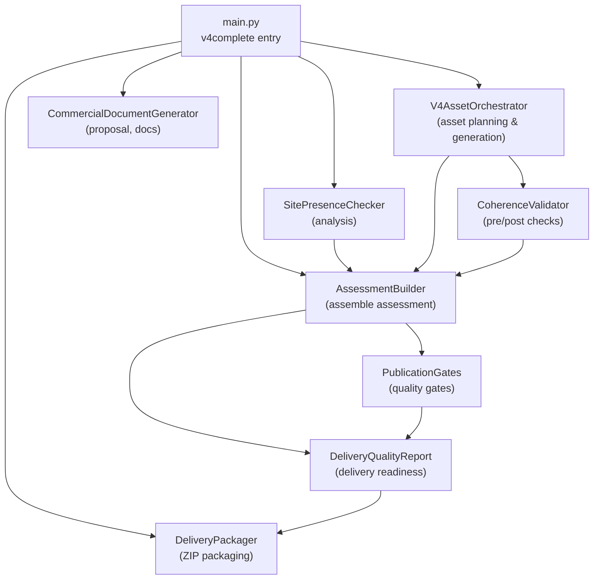
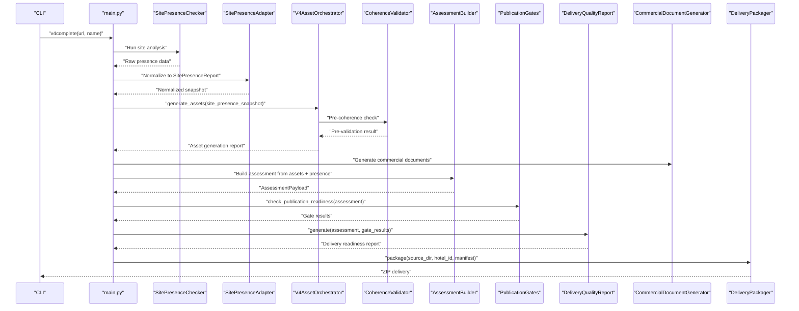
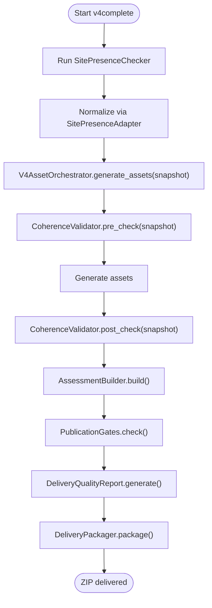
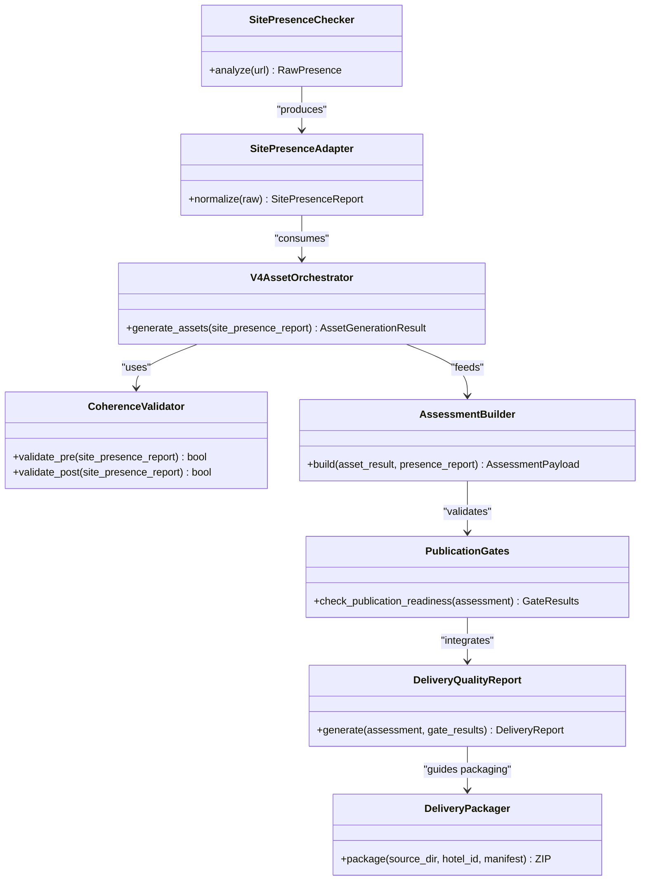
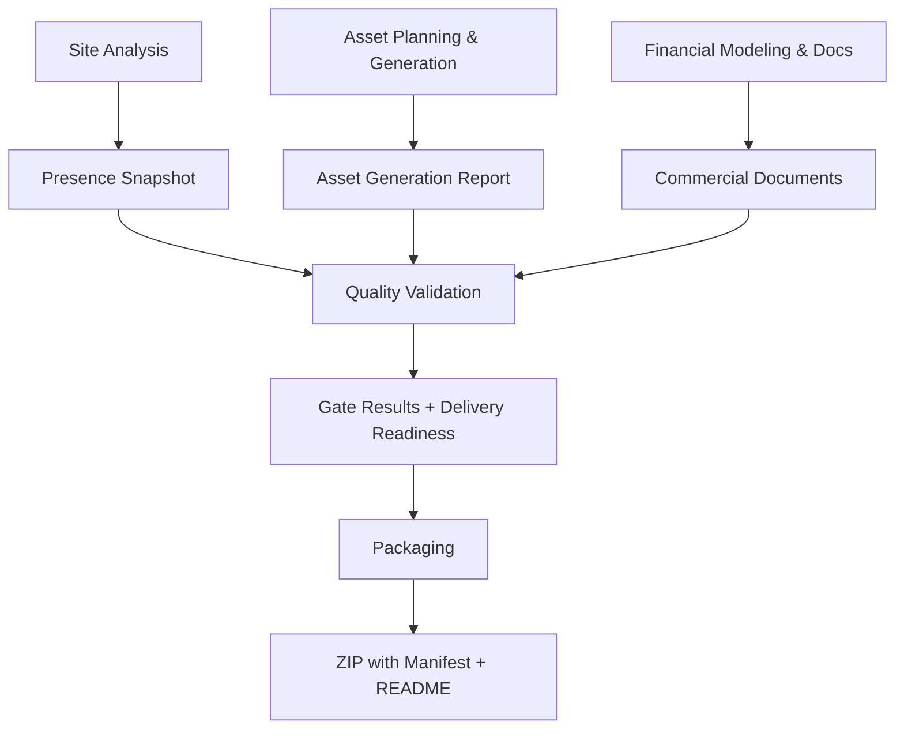
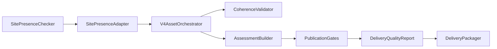

# Pipeline Overview and Main Flow

<cite>
**Referenced Files in This Document**
- [main.py](file://main.py)
- [v4_asset_orchestrator.py](file://modules/asset_generation/v4_asset_orchestrator.py)
- [site_presence_adapter.py](file://modules/asset_generation/site_presence_adapter.py)
- [coherence_validator.py](file://modules/commercial_documents/coherence_validator.py)
- [publication_gates.py](file://modules/quality_gates/publication_gates.py)
- [delivery_quality_report.py](file://modules/quality_gates/delivery_quality_report.py)
- [delivery_packager.py](file://modules/delivery/delivery_packager.py)
- [assessment_builder.py](file://modules/assessment_builder.py)
</cite>

## Table of Contents
1. [Introduction](#introduction)
2. [Project Structure](#project-structure)
3. [Core Components](#core-components)
4. [Architecture Overview](#architecture-overview)
5. [Detailed Component Analysis](#detailed-component-analysis)
6. [Dependency Analysis](#dependency-analysis)
7. [Performance Considerations](#performance-considerations)
8. [Troubleshooting Guide](#troubleshooting-guide)
9. [Conclusion](#conclusion)

## Introduction
This document explains the iah-cli hotel business intelligence pipeline overview and main flow. The system processes a target website through sequential stages: site analysis, asset planning, financial modeling, document generation, quality validation, and publication-ready packaging. The orchestrator in main.py coordinates AssetGenerationEngine (V4AssetOrchestrator), QualityGatesSystem (Publication Gates + Delivery Quality Report), CommercialDocumentGenerator, and DeliveryPackager to produce a ZIP delivery with evidence artifacts at each stage.

The architecture is intentionally multi-phase so that each stage produces verifiable outputs and supports evidence-based debugging. Quality gates are enforced at key checkpoints to prevent downstream propagation of incomplete or inconsistent data.

## Project Structure
At runtime, the pipeline follows a clear sequence from input URL to final ZIP output. The core modules interact as follows:

**Diagram sources**
- [main.py](file://main.py)
- [v4_asset_orchestrator.py](file://modules/asset_generation/v4_asset_orchestrator.py)
- [site_presence_adapter.py](file://modules/asset_generation/site_presence_adapter.py)
- [coherence_validator.py](file://modules/commercial_documents/coherence_validator.py)
- [publication_gates.py](file://modules/quality_gates/publication_gates.py)
- [delivery_quality_report.py](file://modules/quality_gates/delivery_quality_report.py)
- [delivery_packager.py](file://modules/delivery/delivery_packager.py)
- [assessment_builder.py](file://modules/assessment_builder.py)

**Section sources**
- [DT-1 README DELIVERY PRESENT IN PRODUCTION.md:696-752](file://context/Historico/DT-1-README-DELIVERY-PRESENT-IN-PRODUCTION.md#L696-L752)

## Core Components
- SitePresenceChecker: Performs initial site analysis and produces a normalized presence report used by multiple consumers.
- V4AssetOrchestrator: Plans and generates assets based on detected pains and service catalog; exposes intermediate results for downstream use.
- CoherenceValidator: Validates coherence before and after asset generation using normalized SitePresence data.
- AssessmentBuilder: Aggregates all intermediate results into a single assessment payload consumed by gates and reports.
- PublicationGates: Enforces quality gates (e.g., coherence, coverage, evidence, proposal alignment).
- DeliveryQualityReport: Computes delivery readiness and integrates gate outcomes into a unified report.
- CommercialDocumentGenerator: Produces commercial documents (e.g., proposal) aligned with generated assets.
- DeliveryPackager: Packages all outputs into a ZIP with manifest and README.

Key responsibilities and interactions are wired in main.py’s v4complete flow.

**Section sources**
- [DT4 Residual Fixes 05-prompt-inicio-sesion-fase-2.md:78-166](file://plans/Archives/DT4-RESIDUAL-FIXES/05-prompt-inicio-sesion-fase-2.md#L78-L166)
- [DT4 Residual Fixes 09-documentacion-post-proyecto.md:64-79](file://plans/Archives/DT4-RESIDUAL-FIXES/09-documentacion-post-proyecto.md#L64-L79)

## Architecture Overview
The high-level orchestration in main.py coordinates the following phases:

1. Site Analysis: Run SitePresenceChecker once and normalize its output via SitePresenceAdapter.
2. Asset Planning & Generation: V4AssetOrchestrator plans assets and generates them; passes normalized SitePresence to CoherenceValidator pre-checks.
3. Financial Modeling & Documents: Generate commercial documents aligned with planned/generated assets.
4. Quality Validation: Build assessment and run PublicationGates; compute DeliveryQualityReport.
5. Packaging: DeliveryPackager creates ZIP with manifest and README.

**Diagram sources**
- [main.py](file://main.py)
- [v4_asset_orchestrator.py](file://modules/asset_generation/v4_asset_orchestrator.py)
- [site_presence_adapter.py](file://modules/asset_generation/site_presence_adapter.py)
- [coherence_validator.py](file://modules/commercial_documents/coherence_validator.py)
- [assessment_builder.py](file://modules/assessment_builder.py)
- [publication_gates.py](file://modules/quality_gates/publication_gates.py)
- [delivery_quality_report.py](file://modules/quality_gates/delivery_quality_report.py)
- [delivery_packager.py](file://modules/delivery/delivery_packager.py)

## Detailed Component Analysis

### Orchestrator Flow in main.py
- Single computation of SitePresenceChecker early in the flow; normalized snapshot propagated to all consumers.
- V4AssetOrchestrator receives normalized presence and performs pre-coherence validation before asset generation.
- AssessmentBuilder aggregates asset generation results, presence snapshot, and other diagnostics into AssessmentPayload.
- PublicationGates runs quality checks using the assessment; DeliveryQualityReport computes delivery readiness and integrates gate results.
- DeliveryPackager packages all outputs into a ZIP with manifest and README.

**Diagram sources**
- [main.py](file://main.py)
- [v4_asset_orchestrator.py](file://modules/asset_generation/v4_asset_orchestrator.py)
- [site_presence_adapter.py](file://modules/asset_generation/site_presence_adapter.py)
- [coherence_validator.py](file://modules/commercial_documents/coherence_validator.py)
- [assessment_builder.py](file://modules/assessment_builder.py)
- [publication_gates.py](file://modules/quality_gates/publication_gates.py)
- [delivery_quality_report.py](file://modules/quality_gates/delivery_quality_report.py)
- [delivery_packager.py](file://modules/delivery/delivery_packager.py)

**Section sources**
- [DT4 Residual Fixes 05-prompt-inicio-sesion-fase-2.md:78-166](file://plans/Archives/DT4-RESIDUAL-FIXES/05-prompt-inicio-sesion-fase-2.md#L78-L166)
- [DT4 Residual Fixes 09-analisis-fases-1-4--OBSOLETO.md:126-135](file://plans/Archives/DT4-RESIDUAL-FIXES/09-analisis-fases-1-4--OBSOLETO.md#L126-L135)

### Data Flow: SitePresenceChecker → V4AssetOrchestrator → ZIP
- SitePresenceChecker runs once and returns raw presence data.
- SitePresenceAdapter normalizes it into a canonical SitePresenceReport.
- V4AssetOrchestrator uses the normalized snapshot for pre/post coherence checks and asset generation.
- AssessmentBuilder consolidates outputs into an assessment consumed by gates and delivery report.
- DeliveryPackager collects files, builds manifest, writes README, and creates ZIP.

**Diagram sources**
- [site_presence_adapter.py](file://modules/asset_generation/site_presence_adapter.py)
- [v4_asset_orchestrator.py](file://modules/asset_generation/v4_asset_orchestrator.py)
- [coherence_validator.py](file://modules/commercial_documents/coherence_validator.py)
- [assessment_builder.py](file://modules/assessment_builder.py)
- [publication_gates.py](file://modules/quality_gates/publication_gates.py)
- [delivery_quality_report.py](file://modules/quality_gates/delivery_quality_report.py)
- [delivery_packager.py](file://modules/delivery/delivery_packager.py)

**Section sources**
- [DT-1 README DELIVERY PRESENT IN PRODUCTION.md:696-752](file://context/Historico/DT-1-README-DELIVERY-PRESENT-IN-PRODUCTION.md#L696-L752)

### Evidence-Based Debugging and Quality Gates
- Each phase emits structured artifacts (asset generation report, coherence validations, gate results, delivery readiness).
- PublicationGates enforce critical checks such as coherence, coverage, evidence, and proposal alignment.
- DeliveryQualityReport integrates gate outcomes to determine if the package is ready for publication.
- Normalized SitePresence ensures consistent inputs across validators and avoids redundant computations.

[No sources needed since this diagram shows conceptual workflow, not actual code structure]

## Dependency Analysis
The pipeline exhibits low coupling between phases due to explicit contracts:
- SitePresenceAdapter provides a canonical interface for presence data.
- V4AssetOrchestrator depends on normalized presence but does not recompute it.
- AssessmentBuilder centralizes aggregation, reducing duplication across consumers.
- PublicationGates consume AssessmentPayload without reconstructing internal state.
- DeliveryQualityReport consumes both assessment and gate results to compute readiness.
- DeliveryPackager focuses solely on packaging logic and manifest creation.

**Diagram sources**
- [site_presence_adapter.py](file://modules/asset_generation/site_presence_adapter.py)
- [v4_asset_orchestrator.py](file://modules/asset_generation/v4_asset_orchestrator.py)
- [coherence_validator.py](file://modules/commercial_documents/coherence_validator.py)
- [assessment_builder.py](file://modules/assessment_builder.py)
- [publication_gates.py](file://modules/quality_gates/publication_gates.py)
- [delivery_quality_report.py](file://modules/quality_gates/delivery_quality_report.py)
- [delivery_packager.py](file://modules/delivery/delivery_packager.py)

**Section sources**
- [DT4 Residual Fixes 05-prompt-inicio-sesion-fase-2.md:78-166](file://plans/Archives/DT4-RESIDUAL-FIXES/05-prompt-inicio-sesion-fase-2.md#L78-L166)

## Performance Considerations
- Single computation of SitePresenceChecker avoids redundant network calls and ensures consistency across validators.
- Early normalization reduces branching complexity in downstream components.
- Idempotent gates prevent repeated execution and ensure deterministic outputs.
- Packaging step consolidates file collection, manifest generation, and ZIP creation in one pass.

[No sources needed since this section provides general guidance]

## Troubleshooting Guide
Common issues and resolutions:
- Missing SitePresence snapshot: Ensure adapter normalization occurs before orchestrator and validators.
- Gate bypass: Verify GATE_BLOCKING_ENABLED default and that delivery report consumes real gate results.
- Proposal alignment failures: Confirm proposal services match generated assets and that mapping is consistent.
- Packaging inconsistencies: Validate manifest includes all expected artifacts and README references correct paths.

**Section sources**
- [CONTEXT DT-3 POST ANALYSIS VALIDATED.md:314-332](file://context/Historico/CONTEXT-DT-3-POST-ANALYSIS-VALIDATED-2026-07-25.md#L314-L332)
- [CONTEXT ZIONE PROPOSAL ASSET ALIGNMENT BLOCK.md:171-351](file://context/Historico/ZIONE-PROPOSAL-ASSET-ALIGNMENT-BLOCK-2026-07-23.md#L171-L351)

## Conclusion
The iah-cli pipeline implements a robust, multi-phase architecture that emphasizes evidence-based debugging and quality enforcement at each stage. By centralizing SitePresence normalization, coordinating asset generation with coherence checks, and enforcing publication gates before packaging, the system ensures reliable, production-ready outputs. The modular design facilitates maintenance, testing, and future enhancements while maintaining clear data flows and contract boundaries.