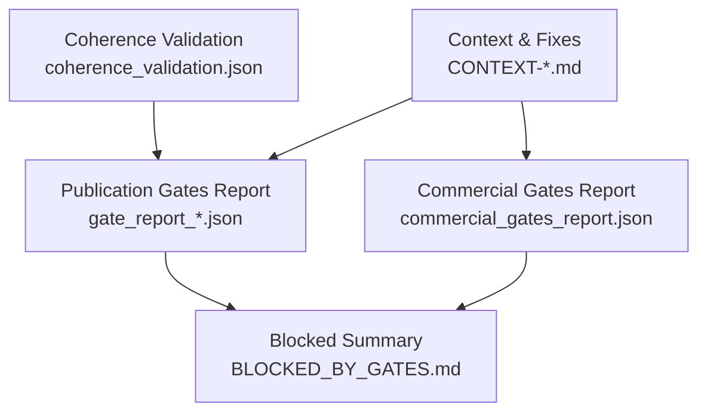
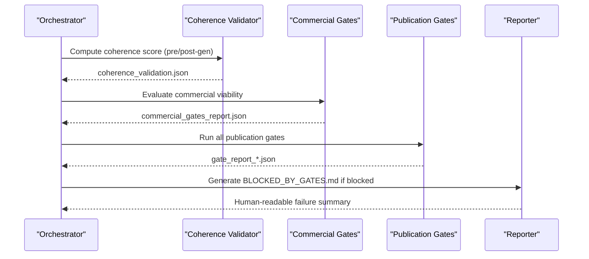
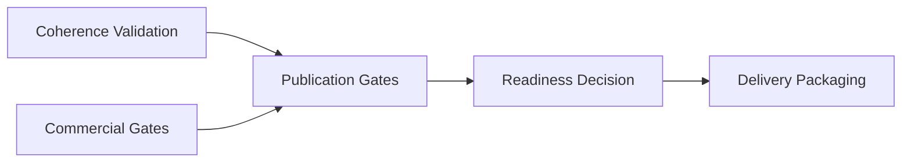

# Quality Gates System

<cite>
**Referenced Files in This Document**
- [coherence_validation.json](file://plans/Archives/DT-3-TECH-DEBT-2026-07-25/evidence/coherence_validation.json)
- [commercial_gates_report.json](file://plans/Archives/DT-4-ROOT-CAUSE-2026-07-25/evidence/commercial_gates_report.json)
- [gate_report_20260727_140459.json](file://plans/Archives/DT-4-ROOT-CAUSE-2026-07-25/evidence/gate_report_20260727_140459.json)
- [gate_report_20260728_091951.json](file://plans/Archives/DT4-RESIDUAL-FIXES/evidence/FASE-6/gate_report_20260728_091951.json)
- [BLOCKED_BY_GATES.md](file://plans/Archives/DT-4-ROOT-CAUSE-2026-07-25/evidence/BLOCKED_BY_GATES.md)
- [CONTEXT-DT4-RESIDUAL-FIXES.md](file://context/Historico/CONTEXT-DT4-RESIDUAL-FIXES.md)
- [CONTEXT-EVIDENCE-TIER-FALSE-CONFIDENCE-IAO-2026-07-30.md](file://context/CONTEXT-EVIDENCE-TIER-FALSE-CONFIDENCE-IAO-2026-07-30.md)
- [ZIONE-PROPOSAL-ASSET-ALIGNMENT-BLOCK-2026-07-23.md](file://context/Historico/ZIONE-PROPOSAL-ASSET-ALIGNMENT-BLOCK-2026-07-23.md)
- [05-prompt-inicio-sesion-fase-3.md](file://plans/Archives/DT4-RESIDUAL-FIXES/05-prompt-inicio-sesion-fase-3.md)
- [05-prompt-inicio-sesion-fase-5.md](file://plans/Archives/DT4-RESIDUAL-FIXES/05-prompt-inicio-sesion-fase-5.md)
</cite>

## Table of Contents
1. [Introduction](#introduction)
2. [Project Structure](#project-structure)
3. [Core Components](#core-components)
4. [Architecture Overview](#architecture-overview)
5. [Detailed Component Analysis](#detailed-component-analysis)
6. [Dependency Analysis](#dependency-analysis)
7. [Performance Considerations](#performance-considerations)
8. [Troubleshooting Guide](#troubleshooting-guide)
9. [Conclusion](#conclusion)

## Introduction
This document explains the Quality Gates System that validates proposal coherence and alignment throughout the pipeline. It covers multi-layered validation (coherence scoring, commercial alignment checks, publication readiness), gate definitions, thresholds, and scoring mechanisms. It also documents evidence collection for debugging and validation, failure handling and reporting, and how gates integrate with the overall pipeline flow.

## Project Structure
The quality system is evidenced by structured reports and markdown summaries produced during execution:
- Coherence validation report (per-hotel)
- Commercial gates report (blocking and warnings)
- Publication gates report (readiness, blocking issues, warnings)
- Human-readable BLOCKED_BY_GATES summary
- Contextual plans and analysis files describing evolution and fixes

**Diagram sources**
- [coherence_validation.json](file://plans/Archives/DT-3-TECH-DEBT-2026-07-25/evidence/coherence_validation.json)
- [commercial_gates_report.json](file://plans/Archives/DT-4-ROOT-CAUSE-2026-07-25/evidence/commercial_gates_report.json)
- [gate_report_20260727_140459.json](file://plans/Archives/DT-4-ROOT-CAUSE-2026-07-25/evidence/gate_report_20260727_140459.json)
- [BLOCKED_BY_GATES.md](file://plans/Archives/DT-4-ROOT-CAUSE-2026-07-25/evidence/BLOCKED_BY_GATES.md)
- [CONTEXT-DT4-RESIDUAL-FIXES.md](file://context/Historico/CONTEXT-DT4-RESIDUAL-FIXES.md)

**Section sources**
- [CONTEXT-DT4-RESIDUAL-FIXES.md](file://context/Historico/CONTEXT-DT4-RESIDUAL-FIXES.md)

## Core Components
- Coherence Validator: Produces a weighted coherence score from multiple checks (e.g., problems_have_solutions, assets_are_justified, financial_data_validated, whatsapp_verified, price_matches_pain, promised_assets_exist). The final score may be pre-gen or post-gen; post-gen preferred with fallback to pre-gen.
- Commercial Gate Engine: Evaluates business viability constraints (e.g., ROI negativity, technical jargon in management view). Blocking results prevent proceeding without resolution.
- Publication Gates: Multi-gate evaluation including coherence, coverage, evidence, asset confidence, ethics, content quality, critical recall, and alignment between proposed services and generated/present assets. Computes readiness status with explicit blocking issues and warnings.
- Evidence Ledger and Reports: Persisted JSON artifacts capture per-gate results, values, suggestions, and details. Markdown summaries provide human-readable guidance.

Key behaviors observed in evidence:
- Coherence score threshold typically around 0.8; failures include low-confidence WhatsApp verification and missing promised assets.
- Commercial gating can block due to negative ROI and inappropriate jargon.
- Publication readiness fails when gaps are uncovered without justification (coverage_no_silent_drop).

**Section sources**
- [coherence_validation.json](file://plans/Archives/DT-3-TECH-DEBT-2026-07-25/evidence/coherence_validation.json)
- [commercial_gates_report.json](file://plans/Archives/DT-4-ROOT-CAUSE-2026-07-25/evidence/commercial_gates_report.json)
- [gate_report_20260727_140459.json](file://plans/Archives/DT-4-ROOT-CAUSE-2026-07-25/evidence/gate_report_20260727_140459.json)
- [gate_report_20260728_091951.json](file://plans/Archives/DT4-RESIDUAL-FIXES/evidence/FASE-6/gate_report_20260728_091951.json)

## Architecture Overview
The pipeline integrates three layers of validation:
1. Coherence scoring layer: assesses internal consistency and data validity.
2. Commercial alignment layer: ensures proposals meet business viability criteria.
3. Publication readiness layer: aggregates all gates into a single readiness decision.

**Diagram sources**
- [coherence_validation.json](file://plans/Archives/DT-3-TECH-DEBT-2026-07-25/evidence/coherence_validation.json)
- [commercial_gates_report.json](file://plans/Archives/DT-4-ROOT-CAUSE-2026-07-25/evidence/commercial_gates_report.json)
- [gate_report_20260727_140459.json](file://plans/Archives/DT-4-ROOT-CAUSE-2026-07-25/evidence/gate_report_20260727_140459.json)
- [BLOCKED_BY_GATES.md](file://plans/Archives/DT-4-ROOT-CAUSE-2026-07-25/evidence/BLOCKED_BY_GATES.md)

## Detailed Component Analysis

### Coherence Scoring Mechanism
- Inputs: Multiple checks with individual scores and pass/fail flags.
- Aggregation: Weighted combination yields an overall coherence score.
- Pre/Post Generation: Prefer post-generation coherence when available; otherwise fall back to pre-generation.
- Thresholds: Typical threshold around 0.8; specific checks may require higher confidence (e.g., whatsapp_verified >= 0.9).

Common failure patterns:
- Insufficient confidence on WhatsApp verification.
- Missing promised assets (e.g., whatsapp_button).
- Financial data validation below desired confidence.

Resolution paths:
- Improve data inputs and asset generation to satisfy check thresholds.
- Ensure post-generation coherence is computed and used as the authoritative score.

**Section sources**
- [coherence_validation.json](file://plans/Archives/DT-3-TECH-DEBT-2026-07-25/evidence/coherence_validation.json)
- [05-prompt-inicio-sesion-fase-3.md](file://plans/Archives/DT4-RESIDUAL-FIXES/05-prompt-inicio-sesion-fase-3.md)

### Commercial Alignment Checks
- Gate examples:
  - CG-ROI-NEGATIVE: Blocks when net benefit is negative and ROI is insufficient without alternative onboarding plan.
  - CG-TECH-JARGON: Flags technical jargon in management-facing sections.
- Severity:
  - BLOCKING gates halt progression until resolved.
  - WARNING gates suggest improvements but do not block.

Resolution paths:
- Restructure offer to present quick wins first, separate diagnostic/onboarding phases, recalculate ROI with real evidence, or propose a low-risk initial phase.
- Move technical terms to annexes; keep management view business-focused.

**Section sources**
- [commercial_gates_report.json](file://plans/Archives/DT-4-ROOT-CAUSE-2026-07-25/evidence/commercial_gates_report.json)
- [BLOCKED_BY_GATES.md](file://plans/Archives/DT-4-ROOT-CAUSE-2026-07-25/evidence/BLOCKED_BY_GATES.md)

### Publication Readiness Criteria
- Gates evaluated include: hard_contradictions, evidence_coverage, financial_validity, coherence, critical_recall, ethics, content_quality, asset_confidence, proposal_asset_alignment, tier_c_onboarding_required, coverage_no_silent_drop.
- Readiness:
  - NOT_READY when any blocking issue exists (e.g., coverage_no_silent_drop).
  - Warnings indicate areas needing attention (e.g., financial_validity Tier C warning).
- Details:
  - Each gate returns passed status, message, value, suggestion, and detailed breakdown where applicable.

Failure example:
- coverage_no_silent_drop fails when uncovered gaps exist (e.g., no_whatsapp_visible) without justification or mapping to service.

Resolution path:
- Add uncovered gaps to diagnosis, justify them (JUSTIFIED_SKIP/BLOCKED/MAPPED_TO_SERVICE), or include them in the proposal.

**Section sources**
- [gate_report_20260727_140459.json](file://plans/Archives/DT-4-ROOT-CAUSE-2026-07-25/evidence/gate_report_20260727_140459.json)
- [gate_report_20260728_091951.json](file://plans/Archives/DT4-RESIDUAL-FIXES/evidence/FASE-6/gate_report_20260728_091951.json)

### Evidence-Based Assessment and Debugging
- Evidence artifacts:
  - coherence_validation.json: Per-check scores and messages.
  - commercial_gates_report.json: Gate results with severity and suggestions.
  - gate_report_*.json: Comprehensive publication gate outcomes and readiness.
  - BLOCKED_BY_GATES.md: Human-readable summary guiding next steps.
- Usage:
  - Developers and operators inspect these artifacts to identify root causes and apply targeted fixes.
  - Consistency checks ensure evidence tiers match documented claims (e.g., GA4/GSC configuration vs. asserted tier).

Evidence integrity fix example:
- Internal consistency gate for evidence tier: If document asserts Tier A but GA4/GSC are not configured, block delivery with a clear contradiction message.

**Section sources**
- [CONTEXT-EVIDENCE-TIER-FALSE-CONFIDENCE-IAO-2026-07-30.md](file://context/CONTEXT-EVIDENCE-TIER-FALSE-CONFIDENCE-IAO-2026-07-30.md)
- [BLOCKED_BY_GATES.md](file://plans/Archives/DT-4-ROOT-CAUSE-2026-07-25/evidence/BLOCKED_BY_GATES.md)

### Pipeline Flow Integration and Failure Handling
- Execution order:
  - Coherence scoring runs early; post-gen preferred over pre-gen.
  - Commercial gates evaluate viability; blocking prevents further progress.
  - Publication gates aggregate all validations; readiness determines whether to proceed.
- Failure handling:
  - When blocked, generate BLOCKED_BY_GATES.md with actionable guidance.
  - Persist commercial_gates_report.json to highlight blocking commercial gates.
  - Avoid re-execution without resolving blocking issues to prevent identical failures.

Idempotency and single execution:
- Ensure gates run once; derive readiness from existing results without re-executing gates.
- Eliminate mutations of assessment within gates to avoid order-dependent behavior.

**Section sources**
- [05-prompt-inicio-sesion-fase-5.md](file://plans/Archives/DT4-RESIDUAL-FIXES/05-prompt-inicio-sesion-fase-5.md)
- [CONTEXT-DT4-RESIDUAL-FIXES.md](file://context/Historico/CONTEXT-DT4-RESIDUAL-FIXES.md)

## Dependency Analysis
Quality gates depend on upstream artifacts and feed downstream decisions:
- Coherence validation influences publication readiness and may affect commercial narrative.
- Commercial gates can block progression regardless of other passes.
- Publication gates consolidate coherence, coverage, evidence, asset confidence, and alignment to determine readiness.

[No diagram sources needed since this diagram shows conceptual relationships]

**Section sources**
- [gate_report_20260727_140459.json](file://plans/Archives/DT-4-ROOT-CAUSE-2026-07-25/evidence/gate_report_20260727_140459.json)
- [commercial_gates_report.json](file://plans/Archives/DT-4-ROOT-CAUSE-2026-07-25/evidence/commercial_gates_report.json)

## Performance Considerations
- Single execution of gates avoids redundant computation and mutation side effects.
- Prefer post-generation coherence to reduce rework and improve accuracy.
- Keep gate evaluations deterministic and idempotent to ensure consistent readiness decisions.

[No sources needed since this section provides general guidance]

## Troubleshooting Guide
Common failures and resolutions:
- Coverage gap without justification:
  - Symptom: coverage_no_silent_drop FAILED with uncovered gaps.
  - Resolution: Add gaps to diagnosis, justify them, or map to services.
- Commercial ROI negative:
  - Symptom: CG-ROI-NEGATIVE blocks.
  - Resolution: Restructure offer, introduce phased approach, recalculate ROI with real evidence.
- Technical jargon in management view:
  - Symptom: CG-TECH-JARGON warning.
  - Resolution: Move technical terms to annex; keep management sections business-focused.
- Evidence tier inconsistency:
  - Symptom: Document asserts Tier A but GA4/GSC not configured.
  - Resolution: Align evidence tier with actual data sources; add internal consistency gate.

Debugging steps:
- Inspect gate_report_*.json for per-gate details and suggestions.
- Review commercial_gates_report.json for blocking commercial gates.
- Use BLOCKED_BY_GATES.md for human-readable guidance.

**Section sources**
- [gate_report_20260727_140459.json](file://plans/Archives/DT-4-ROOT-CAUSE-2026-07-25/evidence/gate_report_20260727_140459.json)
- [commercial_gates_report.json](file://plans/Archives/DT-4-ROOT-CAUSE-2026-07-25/evidence/commercial_gates_report.json)
- [BLOCKED_BY_GATES.md](file://plans/Archives/DT-4-ROOT-CAUSE-2026-07-25/evidence/BLOCKED_BY_GATES.md)
- [CONTEXT-EVIDENCE-TIER-FALSE-CONFIDENCE-IAO-2026-07-30.md](file://context/CONTEXT-EVIDENCE-TIER-FALSE-CONFIDENCE-IAO-2026-07-30.md)

## Conclusion
The Quality Gates System enforces coherent, commercially viable, and publication-ready outputs through layered validation. Coherence scoring ensures internal consistency; commercial gates protect business viability; publication gates consolidate all checks into a readiness decision. Evidence artifacts enable precise debugging and continuous improvement. By adhering to thresholds, maintaining idempotency, and following resolution paths, the pipeline delivers high-quality proposals aligned with both technical and business requirements.