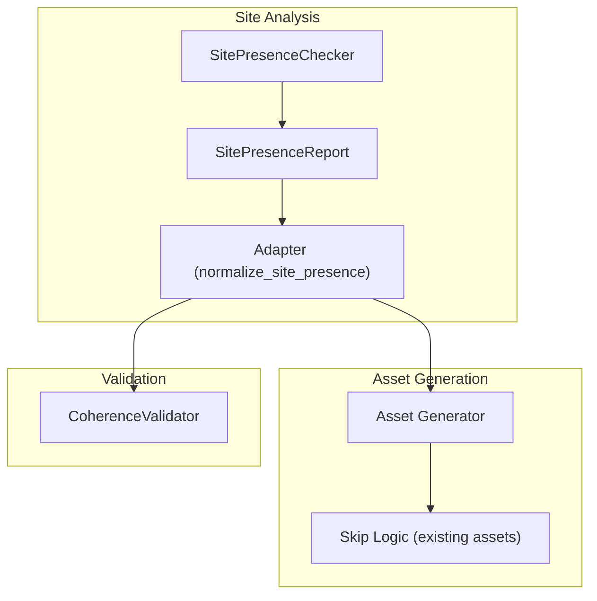
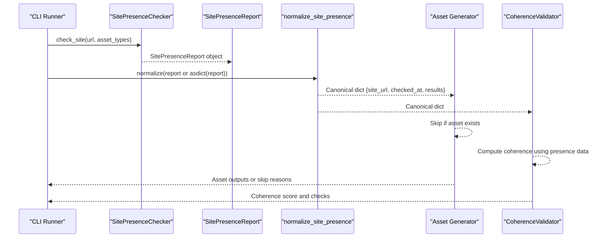
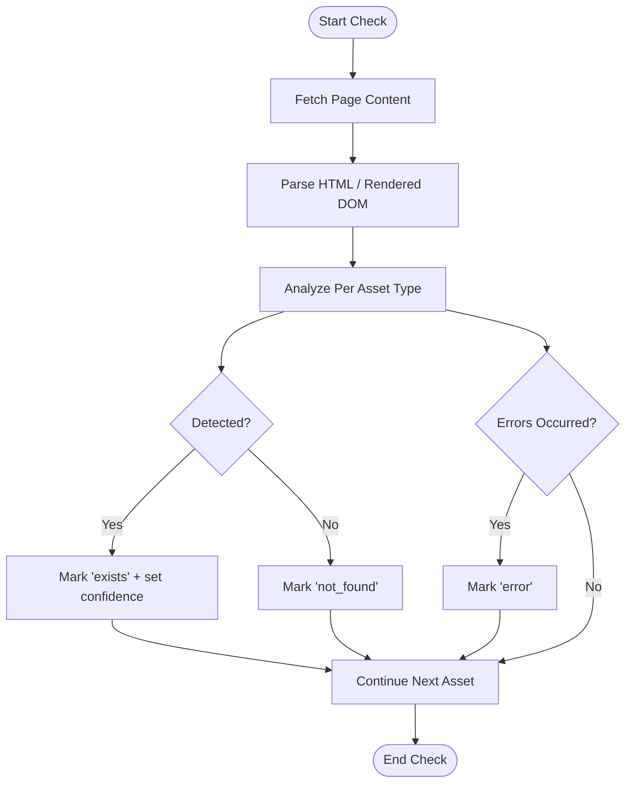
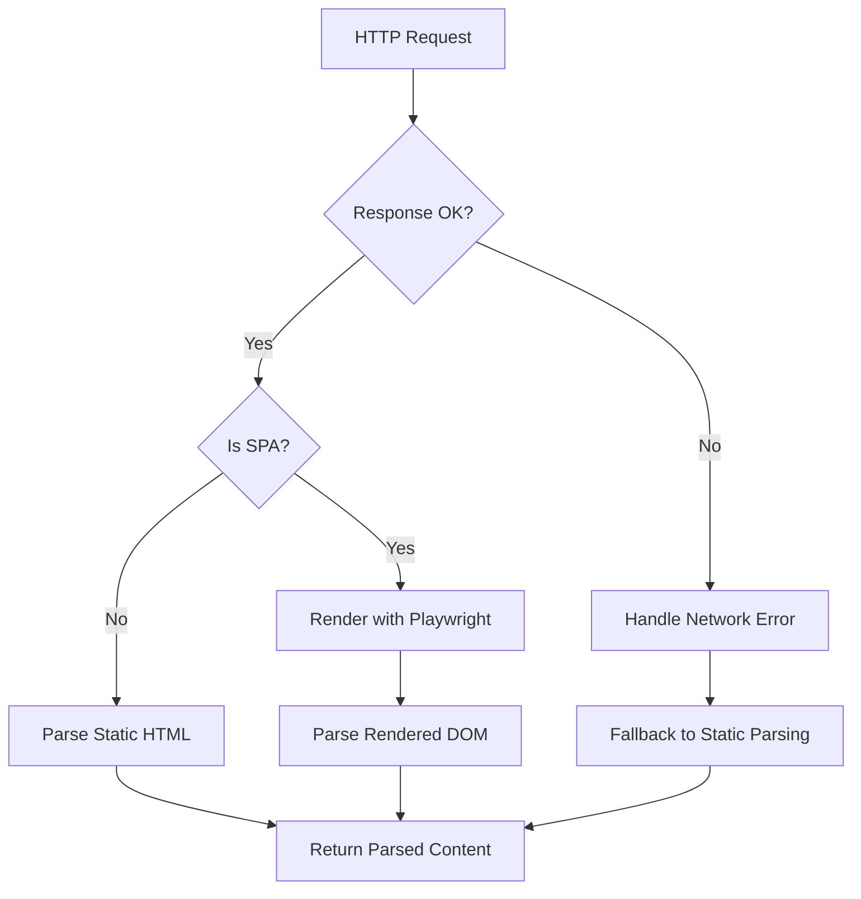
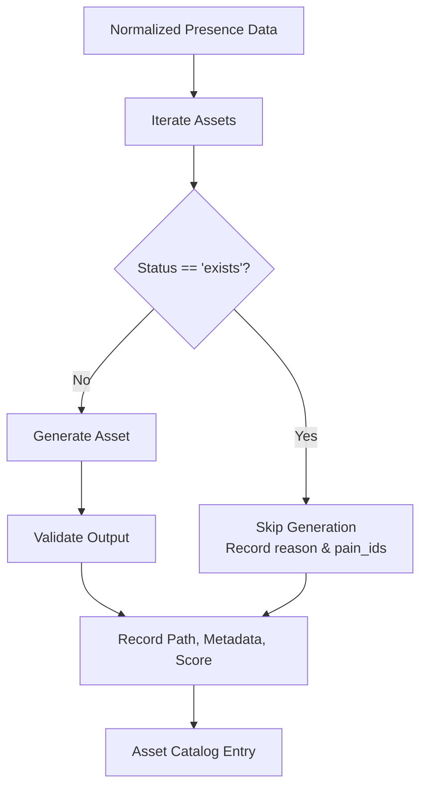
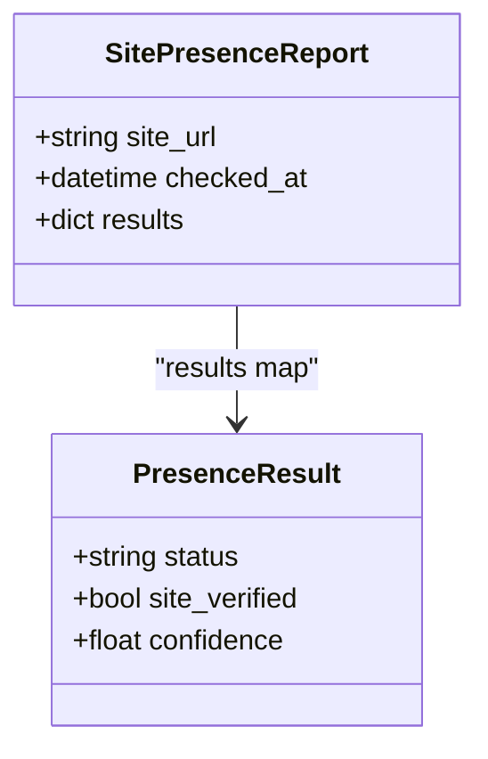
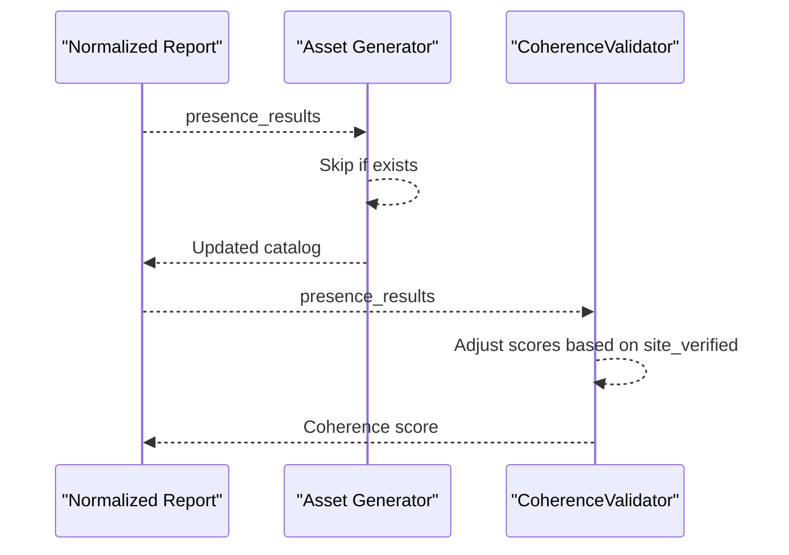
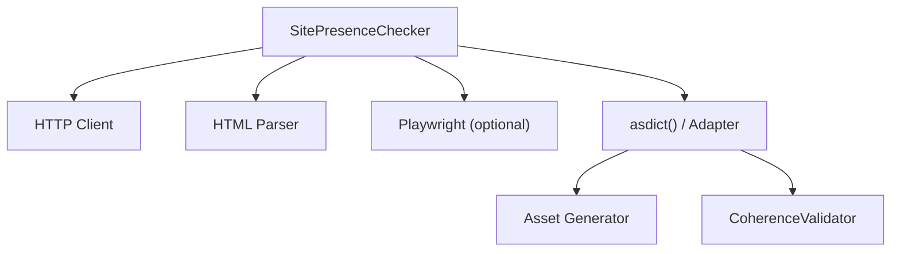

# Site Analysis Phase

<cite>
**Referenced Files in This Document**
- [05-prompt-inicio-sesion-fase-2.md](file://plans/Archives/DT4-RESIDUAL-FIXES/05-prompt-inicio-sesion-fase-2.md)
- [INVESTIGACION_RESULTADOS.md](file://context/Historico/INVESTIGACION_RESULTADOS.md)
- [asset_generation_report.json](file://plans/Archives/DT4-RESIDUAL-FIXES/evidence/FASE-6/asset_generation_report.json)
- [bugs_no_onboarding_luxor_2026-07-06.md](file://context/Historico/bugs_no_onboarding_luxor_2026-07-06.md)
</cite>

## Table of Contents
1. [Introduction](#introduction)
2. [Project Structure](#project-structure)
3. [Core Components](#core-components)
4. [Architecture Overview](#architecture-overview)
5. [Detailed Component Analysis](#detailed-component-analysis)
6. [Dependency Analysis](#dependency-analysis)
7. [Performance Considerations](#performance-considerations)
8. [Troubleshooting Guide](#troubleshooting-guide)
9. [Conclusion](#conclusion)

## Introduction
This document explains the site analysis phase of the iah-cli pipeline, focusing on how the SitePresenceChecker analyzes hotel websites to identify existing digital assets, gaps, and competitive positioning. It covers presence detection algorithms, website scraping mechanisms, asset catalog generation, and the SitePresenceReport data structure. It also documents how downstream components consume this report for asset generation and coherence validation, and addresses common operational issues such as network timeouts, anti-bot measures, and partial site access scenarios.

## Project Structure
The site analysis phase is implemented across modules that:
- Perform site checks and build a canonical SitePresenceReport
- Normalize reports for downstream consumers
- Generate or skip assets based on detected presence
- Validate coherence between identified problems and proposed solutions

Key artifacts referenced in this document include:
- A plan describing the canonical structure and adapter for SitePresenceReport normalization
- Investigation notes detailing empirical behavior of SitePresenceChecker and serialization pitfalls
- An asset generation report showing skipped assets due to existing presence
- Notes on SPA handling with Playwright fallbacks

[No sources needed since this diagram shows conceptual workflow, not actual code structure]

## Core Components
- SitePresenceChecker: Probes target hotel sites to detect specific digital assets (e.g., WhatsApp button, analytics tags, SEO meta, social integrations). It returns a structured SitePresenceReport summarizing findings per asset type.
- SitePresenceReport: A dataclass-like container holding metadata (site URL, timestamp) and per-asset results with status, confidence, and verification flags.
- Adapter (normalize_site_presence): Converts various input forms (dataclass, dict via asdict, None) into a canonical dictionary consumed by downstream logic.
- Asset Generator: Consumes normalized presence data to decide whether to generate an asset or skip it if already present.
- CoherenceValidator: Uses presence data to validate that proposed solutions align with detected realities and compute coherence scores.

**Section sources**
- [05-prompt-inicio-sesion-fase-2.md:28-50](file://plans/Archives/DT4-RESIDUAL-FIXES/05-prompt-inicio-sesion-fase-2.md#L28-L50)
- [INVESTIGACION_RESULTADOS.md:45-64](file://context/Historico/INVESTIGACION_RESULTADOS.md#L45-L64)

## Architecture Overview
The site analysis pipeline follows a clear flow:
- The checker inspects the target site and builds a SitePresenceReport.
- The adapter normalizes the report into a canonical dict.
- Downstream components (asset generator and coherence validator) consume the normalized report to make decisions about asset creation and scoring.

**Section sources**
- [05-prompt-inicio-sesion-fase-2.md:28-50](file://plans/Archives/DT4-RESIDUAL-FIXES/05-prompt-inicio-sesion-fase-2.md#L28-L50)
- [INVESTIGACION_RESULTADOS.md:45-64](file://context/Historico/INVESTIGACION_RESULTADOS.md#L45-L64)

## Detailed Component Analysis

### SitePresenceChecker and Presence Detection Algorithms
- Presence detection targets multiple asset categories:
  - Analytics setup: Detects tracking scripts or pixels.
  - SEO optimization: Scans meta tags, Open Graph, structured data.
  - Social media integration: Identifies social links, share buttons, platform-specific widgets.
  - Mobile responsiveness: Checks viewport meta, responsive patterns, and mobile-specific indicators.
- For each asset type, the checker assigns a status:
  - "exists": Detected with high confidence.
  - "not_found": Not detected after thorough scanning.
  - "error": Encountered during inspection (network, parsing, rendering).
  - "not_checked": Skipped due to configuration or constraints.
- Confidence scores reflect certainty based on signal strength and context.
- Verification flags indicate whether the asset is verified as live on the production site.

[No sources needed since this diagram shows conceptual workflow, not actual code structure]

**Section sources**
- [05-prompt-inicio-sesion-fase-2.md:28-50](file://plans/Archives/DT4-RESIDUAL-FIXES/05-prompt-inicio-sesion-fase-2.md#L28-L50)
- [INVESTIGACION_RESULTADOS.md:45-64](file://context/Historico/INVESTIGACION_RESULTADOS.md#L45-L64)

### Website Scraping Mechanisms
- Primary scraping uses HTTP requests followed by HTML parsing.
- For Single Page Applications (SPAs), a rendering step is required:
  - Playwright is used to render dynamic content before parsing.
  - If Playwright is unavailable or fails, the system falls back to static HTML parsing.
- Timeouts and graceful degradation are essential to avoid blocking the pipeline.

**Section sources**
- [bugs_no_onboarding_luxor_2026-07-06.md:187-209](file://context/Historico/bugs_no_onboarding_luxor_2026-07-06.md#L187-L209)

### Asset Catalog Generation and Skipping Logic
- Based on presence results, the asset generator decides whether to create new assets or skip existing ones.
- When an asset is marked as "exists" and verified, the generator skips creation and records skip reasons and affected pain IDs.
- The asset generation report captures:
  - Asset type and filenames
  - Paths and metadata paths
  - Preflight status and confidence scores
  - Pain IDs resolved or affected
  - Skip reasons when assets are already present

**Section sources**
- [asset_generation_report.json:125-166](file://plans/Archives/DT4-RESIDUAL-FIXES/evidence/FASE-6/asset_generation_report.json#L125-L166)

### SitePresenceReport Data Structure and Normalization
- SitePresenceReport contains:
  - site_url: Target website URL
  - checked_at: Timestamp of analysis
  - results: Map of asset_type to presence details including status, confidence, and verification flags
- Normalization ensures downstream consumers receive a consistent dictionary regardless of input form:
  - From dataclass instance
  - From dataclasses.asdict() output
  - From None (returns empty results)
- Status enums are converted to strings for compatibility.

**Diagram sources**
- [05-prompt-inicio-sesion-fase-2.md:28-50](file://plans/Archives/DT4-RESIDUAL-FIXES/05-prompt-inicio-sesion-fase-2.md#L28-L50)
- [INVESTIGACION_RESULTADOS.md:45-64](file://context/Historico/INVESTIGACION_RESULTADOS.md#L45-L64)

**Section sources**
- [05-prompt-inicio-sesion-fase-2.md:28-50](file://plans/Archives/DT4-RESIDUAL-FIXES/05-prompt-inicio-sesion-fase-2.md#L28-L50)
- [INVESTIGACION_RESULTADOS.md:45-64](file://context/Historico/INVESTIGACION_RESULTADOS.md#L45-L64)

### Downstream Consumption: Asset Generation and Coherence Validation
- Asset Generator:
  - Reads normalized presence data
  - Skips assets already present on the site
  - Generates missing assets and records metadata
- CoherenceValidator:
  - Uses presence data to ensure proposed solutions match detected conditions
  - Adjusts scores based on verified presence (e.g., boosting scores when WhatsApp button exists)

**Section sources**
- [05-prompt-inicio-sesion-fase-2.md:118-140](file://plans/Archives/DT4-RESIDUAL-FIXES/05-prompt-inicio-sesion-fase-2.md#L118-L140)
- [asset_generation_report.json:125-166](file://plans/Archives/DT4-RESIDUAL-FIXES/evidence/FASE-6/asset_generation_report.json#L125-L166)

## Dependency Analysis
The site analysis phase depends on:
- HTTP client for fetching pages
- HTML parser for static content
- Optional headless browser (Playwright) for SPA rendering
- Serialization utilities for converting dataclass to dict
- Asset generation module for creating files
- Coherence validation module for scoring alignment

**Section sources**
- [bugs_no_onboarding_luxor_2026-07-06.md:187-209](file://context/Historico/bugs_no_onboarding_luxor_2026-07-06.md#L187-L209)
- [INVESTIGACION_RESULTADOS.md:45-64](file://context/Historico/INVESTIGACION_RESULTADOS.md#L45-L64)

## Performance Considerations
- Network timeouts: Configure reasonable timeouts to prevent blocking; implement retries with exponential backoff where appropriate.
- Anti-bot measures: Rotate user agents, respect robots.txt, and handle CAPTCHAs gracefully by marking as errors and skipping.
- Partial site access: Use fallback strategies (static parsing when dynamic rendering fails) to ensure progress even with incomplete data.
- Caching: Cache parsed pages and rendered DOM to avoid repeated expensive operations during the same run.
- Concurrency: Parallelize checks across asset types while respecting rate limits and server load.

[No sources needed since this section provides general guidance]

## Troubleshooting Guide
Common issues and resolutions:
- Network timeouts:
  - Increase timeout thresholds
  - Implement retry logic with jitter
  - Log detailed error contexts for diagnosis
- Anti-bot measures:
  - Add headers and cookies mimicking real browsers
  - Introduce delays between requests
  - Fall back to cached or previously scraped content
- SPA rendering failures:
  - Ensure Playwright is installed and Chromium is available
  - Gracefully degrade to static parsing if rendering fails
  - Capture screenshots or logs for debugging
- Serialization mismatches:
  - Use the adapter to normalize inputs consistently
  - Verify enum-to-string conversion for statuses
  - Test both dataclass and dict forms

**Section sources**
- [bugs_no_onboarding_luxor_2026-07-06.md:187-209](file://context/Historico/bugs_no_onboarding_luxor_2026-07-06.md#L187-L209)
- [05-prompt-inicio-sesion-fase-2.md:118-140](file://plans/Archives/DT4-RESIDUAL-FIXES/05-prompt-inicio-sesion-fase-2.md#L118-L140)

## Conclusion
The site analysis phase in iah-cli leverages SitePresenceChecker to systematically evaluate hotel websites for digital assets, generating a structured SitePresenceReport that drives asset generation and coherence validation. By implementing robust scraping mechanisms, adaptive rendering for SPAs, and comprehensive normalization, the pipeline ensures reliable analysis even under challenging conditions like network issues and anti-bot protections. The resulting insights enable precise asset catalog generation and informed decision-making for competitive positioning.

[No sources needed since this section summarizes without analyzing specific files]