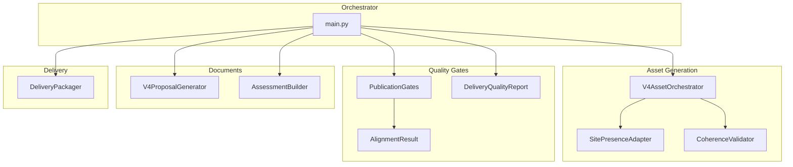
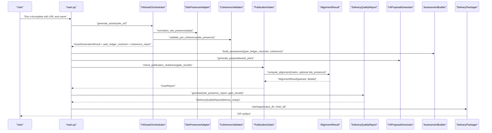
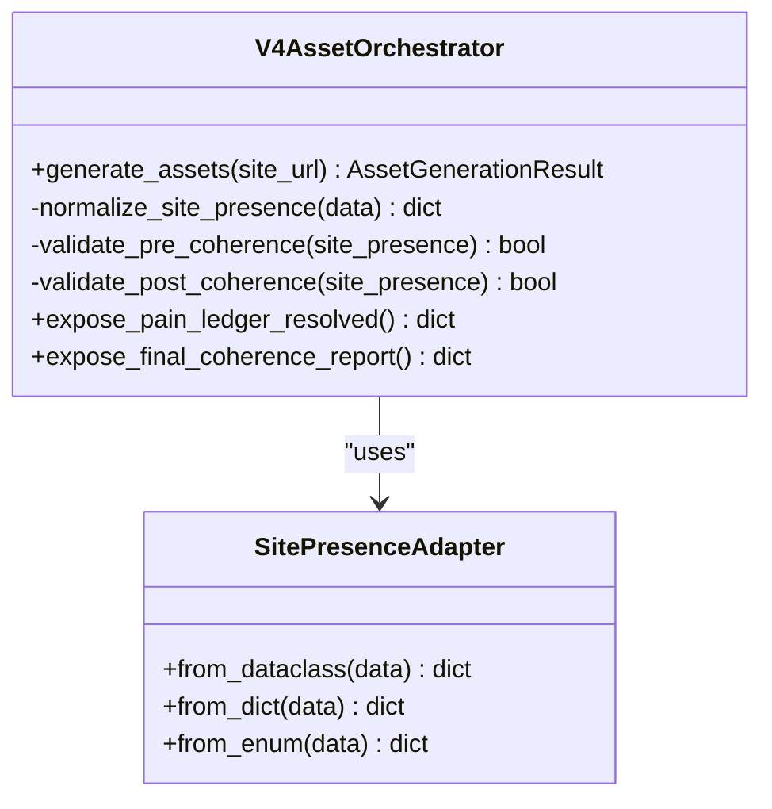
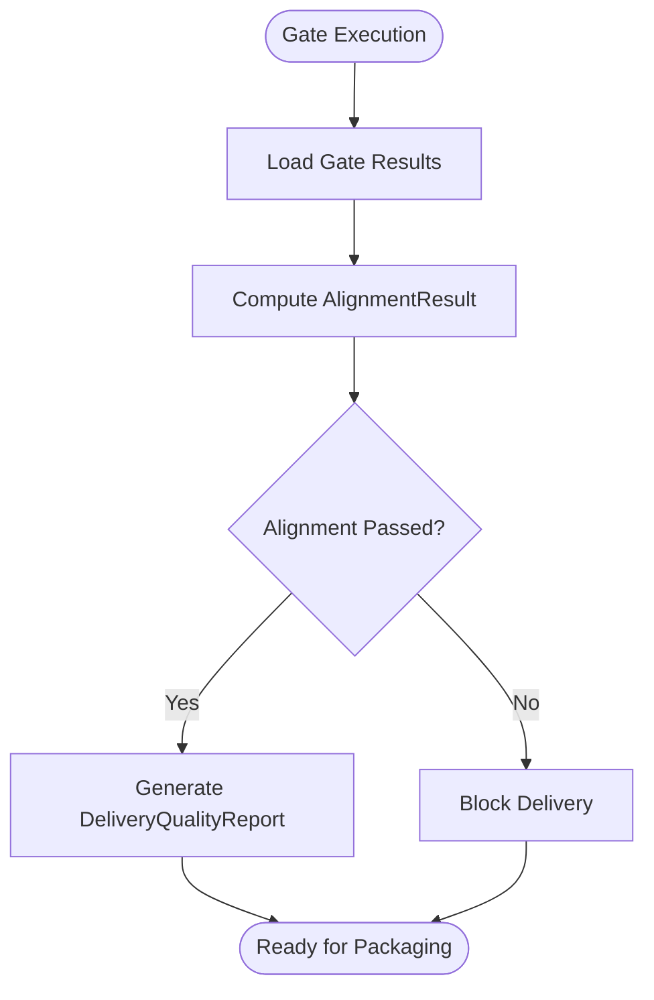
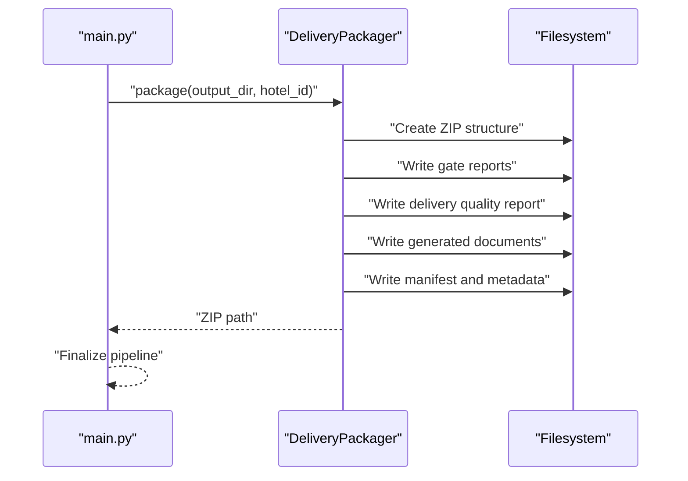
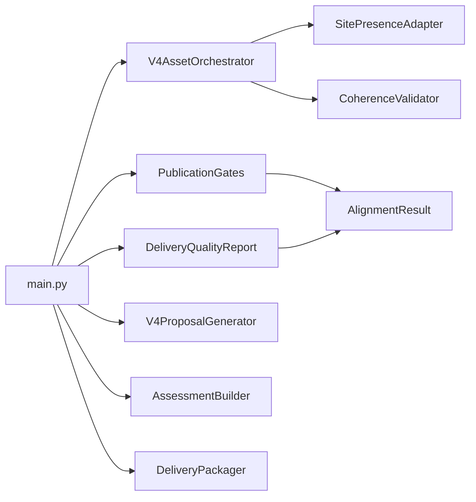

# System Overview and Pipeline Architecture

<cite>
**Referenced Files in This Document**
- [main.py](file://main.py)
- [v4_asset_orchestrator.py](file://modules/asset_generation/v4_asset_orchestrator.py)
- [site_presence_adapter.py](file://modules/asset_generation/site_presence_adapter.py)
- [coherence_validator.py](file://modules/commercial_documents/coherence_validator.py)
- [publication_gates.py](file://modules/quality_gates/publication_gates.py)
- [alignment_result.py](file://modules/quality_gates/alignment_result.py)
- [delivery_quality_report.py](file://modules/quality_gates/delivery_quality_report.py)
- [delivery_packager.py](file://modules/delivery/delivery_packager.py)
- [v4_proposal_generator.py](file://modules/commercial_documents/v4_proposal_generator.py)
- [assessment_builder.py](file://modules/assessment_builder.py)
- [05-prompt-inicio-sesion-fase-RELEASE.md](file://.opencode/plans/Archives/DT4-RESIDUAL-FIXES/05-prompt-inicio-sesion-fase-RELEASE.md)
- [CONTEXT-DT4-RESIDUAL-FIXES.md](file://.opencode/context/Historico/CONTEXT-DT4-RESIDUAL-FIXES.md)
- [ZIONE-PROPOSAL-ASSET-ALIGNMENT-BLOCK-2026-07-23.md](file://.opencode/context/Historico/ZIONE-PROPOSAL-ASSET-ALIGNMENT-BLOCK-2026-07-23.md)
</cite>

## Table of Contents
1. Introduction
2. Project Structure
3. Core Components
4. Architecture Overview
5. Detailed Component Analysis
6. Dependency Analysis
7. Performance Considerations
8. Troubleshooting Guide
9. Conclusion

## Introduction
This document provides a comprehensive overview of the iah-cli system’s hotel business intelligence pipeline. The pipeline processes websites through sequential stages: site analysis, asset planning, financial modeling, document generation, quality validation, and publication-ready packaging. It is orchestrated by a main entrypoint that coordinates AssetGenerationEngine, QualityGatesSystem, CommercialDocumentGenerator, and DeliveryPackager modules. Data flows from SitePresenceChecker through V4AssetOrchestrator to final ZIP delivery, with evidence-based debugging and quality gates at each stage to ensure reliability and traceability.

## Project Structure
The repository contains implementation code and extensive plans/context artifacts that describe the evolution and fixes of the pipeline. Key areas include:
- Orchestrator and flow control (main.py)
- Asset generation and coherence validation (V4AssetOrchestrator, CoherenceValidator)
- Quality gates and alignment reporting (PublicationGates, AlignmentResult, DeliveryQualityReport)
- Delivery packaging (DeliveryPackager)
- Commercial documents (Proposal generator)
- Assessment building and data normalization (AssessmentBuilder, SitePresenceAdapter)

[No sources needed since this diagram shows conceptual workflow, not actual code structure]

## Core Components
- Orchestrator (main.py): Coordinates the full pipeline, loads inputs, wires components, executes phases, and triggers packaging.
- Asset Generation (V4AssetOrchestrator): Plans assets based on detected pains, runs generation, and exposes results including resolved pain ledger and coherence reports.
- Site Presence Adapter (SitePresenceAdapter): Normalizes site presence data across formats for consistent consumption.
- Coherence Validator (CoherenceValidator): Validates consistency between assets and site presence before and after generation.
- Quality Gates (PublicationGates): Enforces evidence-based checks (coverage, coherence, alignment, etc.) and produces gate reports.
- Alignment Result (AlignmentResult): Canonical DTO for alignment outcomes used across gates and delivery reporting.
- Delivery Quality Report (DeliveryQualityReport): Produces a final delivery readiness report aligned with alignment results.
- Commercial Documents (V4ProposalGenerator): Generates commercial proposals aligned with planned assets and validated findings.
- Assessment Builder (AssessmentBuilder): Builds assessment payloads, including resolved pain ledgers and coherence scores.
- Delivery Packager (DeliveryPackager): Packages outputs into a ZIP artifact for distribution.

**Section sources**
- [main.py](file://main.py)
- [v4_asset_orchestrator.py](file://modules/asset_generation/v4_asset_orchestrator.py)
- [site_presence_adapter.py](file://modules/asset_generation/site_presence_adapter.py)
- [coherence_validator.py](file://modules/commercial_documents/coherence_validator.py)
- [publication_gates.py](file://modules/quality_gates/publication_gates.py)
- [alignment_result.py](file://modules/quality_gates/alignment_result.py)
- [delivery_quality_report.py](file://modules/quality_gates/delivery_quality_report.py)
- [v4_proposal_generator.py](file://modules/commercial_documents/v4_proposal_generator.py)
- [assessment_builder.py](file://modules/assessment_builder.py)

## Architecture Overview
The iah-cli pipeline follows a multi-phase design with explicit gates and evidence tracking at each stage. The orchestrator drives the sequence, ensuring deterministic data flow and reproducible outputs.

**Diagram sources**
- [main.py](file://main.py)
- [v4_asset_orchestrator.py](file://modules/asset_generation/v4_asset_orchestrator.py)
- [site_presence_adapter.py](file://modules/asset_generation/site_presence_adapter.py)
- [coherence_validator.py](file://modules/commercial_documents/coherence_validator.py)
- [publication_gates.py](file://modules/quality_gates/publication_gates.py)
- [alignment_result.py](file://modules/quality_gates/alignment_result.py)
- [delivery_quality_report.py](file://modules/quality_gates/delivery_quality_report.py)
- [v4_proposal_generator.py](file://modules/commercial_documents/v4_proposal_generator.py)
- [assessment_builder.py](file://modules/assessment_builder.py)

## Detailed Component Analysis

### Orchestrator Flow in main.py
The orchestrator coordinates the entire pipeline:
- Loads inputs and initializes components
- Executes asset generation via V4AssetOrchestrator
- Builds assessments using AssessmentBuilder
- Generates commercial documents via V4ProposalGenerator
- Runs quality gates via PublicationGates and computes alignment via AlignmentResult
- Produces delivery quality report via DeliveryQualityReport
- Packages outputs via DeliveryPackager

Key responsibilities:
- Single computation of SitePresence to avoid duplication
- Idempotent gate execution to prevent double runs
- Wiring normalized site presence to coherence validators and delivery reporting
- Path corrections for resolved pain ledger loading

**Section sources**
- [main.py](file://main.py)
- [05-prompt-inicio-sesion-fase-RELEASE.md](file://.opencode/plans/Archives/DT4-RESIDUAL-FIXES/05-prompt-inicio-sesion-fase-RELEASE.md)

### V4AssetOrchestrator and SitePresenceAdapter
V4AssetOrchestrator manages asset planning and generation:
- Accepts normalized site presence via SitePresenceAdapter
- Runs pre- and post-generation coherence validation
- Exposes resolved pain ledger and final coherence report

SitePresenceAdapter normalizes diverse input formats into a canonical representation consumed by downstream components.

**Diagram sources**
- [v4_asset_orchestrator.py](file://modules/asset_generation/v4_asset_orchestrator.py)
- [site_presence_adapter.py](file://modules/asset_generation/site_presence_adapter.py)

**Section sources**
- [v4_asset_orchestrator.py](file://modules/asset_generation/v4_asset_orchestrator.py)
- [site_presence_adapter.py](file://modules/asset_generation/site_presence_adapter.py)

### CoherenceValidator Integration
CoherenceValidator ensures assets align with site presence both before and after generation:
- Three call sites updated to accept normalized site presence report
- Pre-validation prevents inconsistent planning
- Post-validation confirms generated assets match expectations

**Section sources**
- [coherence_validator.py](file://modules/commercial_documents/coherence_validator.py)
- [05-prompt-inicio-sesion-fase-RELEASE.md](file://.opencode/plans/Archives/DT4-RESIDUAL-FIXES/05-prompt-inicio-sesion-fase-RELEASE.md)

### Quality Gates and Alignment
PublicationGates enforces evidence-based checks:
- Coverage, coherence, alignment, and other gates produce detailed reports
- AlignmentResult provides a canonical DTO for alignment outcomes
- DeliveryQualityReport derives delivery readiness from alignment results

**Diagram sources**
- [publication_gates.py](file://modules/quality_gates/publication_gates.py)
- [alignment_result.py](file://modules/quality_gates/alignment_result.py)
- [delivery_quality_report.py](file://modules/quality_gates/delivery_quality_report.py)

**Section sources**
- [publication_gates.py](file://modules/quality_gates/publication_gates.py)
- [alignment_result.py](file://modules/quality_gates/alignment_result.py)
- [delivery_quality_report.py](file://modules/quality_gates/delivery_quality_report.py)

### Commercial Document Generation
V4ProposalGenerator creates commercial proposals aligned with planned assets:
- Uses service-to-asset mappings to list services
- Integrates semantic validation to avoid hallucinated promises
- Filters deprecated assets and ensures narrative consistency

**Section sources**
- [v4_proposal_generator.py](file://modules/commercial_documents/v4_proposal_generator.py)
- [CONTEXT-DT4-RESIDUAL-FIXES.md](file://.opencode/context/Historico/CONTEXT-DT4-RESIDUAL-FIXES.md)

### Assessment Building
AssessmentBuilder constructs assessment payloads:
- Includes resolved pain ledger and coherence scores
- Provides builder methods for fluent construction
- Ensures final coherence uses consolidated data

**Section sources**
- [assessment_builder.py](file://modules/assessment_builder.py)
- [05-prompt-inicio-sesion-fase-RELEASE.md](file://.opencode/plans/Archives/DT4-RESIDUAL-FIXES/05-prompt-inicio-sesion-fase-RELEASE.md)

### Critical Delivery Packaging Phase
DeliveryPackager consolidates all outputs into a ZIP artifact:
- Ensures consistent directory structure per hotel
- Includes gate reports, delivery quality reports, generated documents, and manifests
- Serves as the final handoff point for distribution

**Diagram sources**
- [delivery_packager.py](file://modules/delivery/delivery_packager.py)
- [main.py](file://main.py)

**Section sources**
- [delivery_packager.py](file://modules/delivery/delivery_packager.py)

## Dependency Analysis
The pipeline exhibits clear separation of concerns with minimal coupling:
- main.py depends on orchestratable components but does not implement their logic
- V4AssetOrchestrator depends on adapters and validators but remains agnostic of gate specifics
- Quality gates depend on canonical DTOs (AlignmentResult) for consistent reporting
- Delivery packaging depends only on output artifacts without knowledge of generation internals

**Diagram sources**
- [main.py](file://main.py)
- [v4_asset_orchestrator.py](file://modules/asset_generation/v4_asset_orchestrator.py)
- [site_presence_adapter.py](file://modules/asset_generation/site_presence_adapter.py)
- [coherence_validator.py](file://modules/commercial_documents/coherence_validator.py)
- [publication_gates.py](file://modules/quality_gates/publication_gates.py)
- [alignment_result.py](file://modules/quality_gates/alignment_result.py)
- [delivery_quality_report.py](file://modules/quality_gates/delivery_quality_report.py)
- [v4_proposal_generator.py](file://modules/commercial_documents/v4_proposal_generator.py)
- [assessment_builder.py](file://modules/assessment_builder.py)
- [delivery_packager.py](file://modules/delivery/delivery_packager.py)

**Section sources**
- [main.py](file://main.py)
- [v4_asset_orchestrator.py](file://modules/asset_generation/v4_asset_orchestrator.py)
- [publication_gates.py](file://modules/quality_gates/publication_gates.py)
- [delivery_quality_report.py](file://modules/quality_gates/delivery_quality_report.py)
- [delivery_packager.py](file://modules/delivery/delivery_packager.py)

## Performance Considerations
- Single computation of SitePresence avoids redundant processing
- Idempotent gate execution prevents duplicate work and ensures consistency
- Normalized data structures reduce parsing overhead across components
- Modular design enables parallelization opportunities in future iterations

[No sources needed since this section provides general guidance]

## Troubleshooting Guide
Common issues and resolutions:
- Coverage gate failures due to missing resolved pain ledger: Ensure correct path resolution for pain_ledger_resolved.json
- Delivery alignment divergence: Verify site presence report propagation to delivery quality report
- Proposal asset misalignment: Confirm service-to-asset mappings and semantic validation are active
- Gate blocking bypass: Validate GATE_BLOCKING_ENABLED configuration and delivery report logic

**Section sources**
- [CONTEXT-DT4-RESIDUAL-FIXES.md](file://.opencode/context/Historico/CONTEXT-DT4-RESIDUAL-FIXES.md)
- [ZIONE-PROPOSAL-ASSET-ALIGNMENT-BLOCK-2026-07-23.md](file://.opencode/context/Historico/ZIONE-PROPOSAL-ASSET-ALIGNMENT-BLOCK-2026-07-23.md)
- [05-prompt-inicio-sesion-fase-RELEASE.md](file://.opencode/plans/Archives/DT4-RESIDUAL-FIXES/05-prompt-inicio-sesion-fase-RELEASE.md)

## Conclusion
The iah-cli system implements a robust, multi-phase pipeline for hotel business intelligence processing. Through evidence-based debugging and quality gates at each stage, it ensures reliable asset generation, coherent documentation, and publication-ready packaging. The modular architecture facilitates maintenance and extension while maintaining clear data flow from site analysis through final ZIP delivery.

[No sources needed since this section summarizes without analyzing specific files]