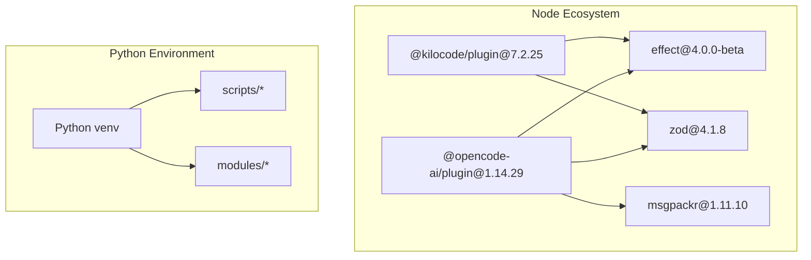
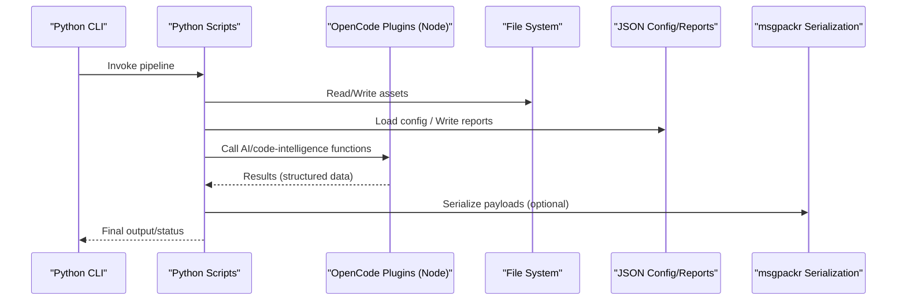
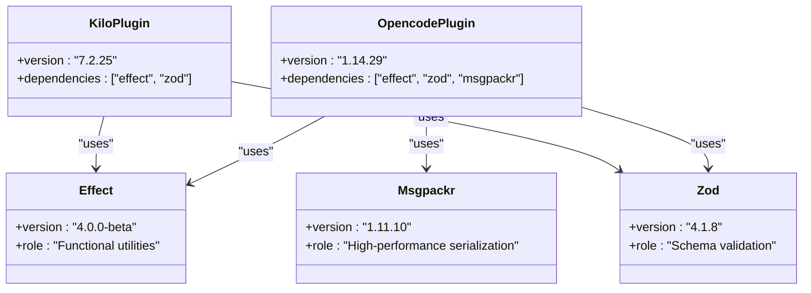
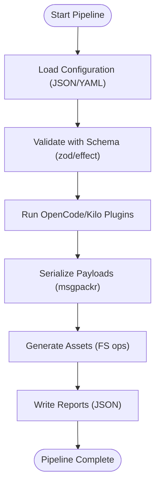
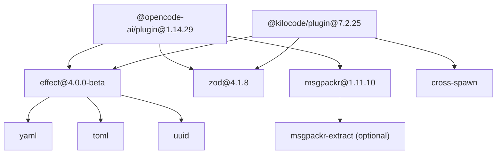

# Technology Stack and Dependencies

<cite>
**Referenced Files in This Document**
- [package-lock.json](file://package-lock.json)
</cite>

## Table of Contents
1. [Introduction](#introduction)
2. [Project Structure](#project-structure)
3. [Core Components](#core-components)
4. [Architecture Overview](#architecture-overview)
5. [Detailed Component Analysis](#detailed-component-analysis)
6. [Dependency Analysis](#dependency-analysis)
7. [Performance Considerations](#performance-considerations)
8. [Troubleshooting Guide](#troubleshooting-guide)
9. [Conclusion](#conclusion)
10. [Appendices](#appendices)

## Introduction
This document describes the technology stack and dependencies used by the iah-cli system, focusing on:
- Python environment requirements and core modules (dataclasses for structured data, JSON processing for configuration and reports, file system operations for asset management).
- Node.js dependency ecosystem including @opencode-ai/plugin (v1.14.29), @kilocode/plugin (v7.2.25), effect (v4.0.0-beta), zod (v4.1.8), and msgpackr (v1.11.10).
- Integration points between Python and JavaScript components.
- Version compatibility matrices and upgrade procedures.
- External dependencies such as web scraping capabilities and their configuration.
- Setup instructions for development and production environments, including virtual environment creation and dependency installation.

## Project Structure
The repository snapshot relevant to this documentation centers around a Node.js lockfile that captures the JavaScript/TypeScript dependency tree used by the OpenCode plugins integrated into iah-cli. The Python side is referenced through scripts and workflows executed via a local virtual environment.

[No sources needed since this diagram shows conceptual workflow, not actual code structure]

## Core Components
- Python environment and core modules:
  - Structured data modeling with dataclasses.
  - JSON processing for configuration and report generation.
  - File system operations for asset management and packaging.
- Node.js plugin ecosystem:
  - AI-powered code generation via @opencode-ai/plugin.
  - Code intelligence via @kilocode/plugin.
  - Functional programming utilities via effect.
  - Schema validation via zod.
  - High-performance message packing via msgpackr.

These components are orchestrated by Python scripts invoked from a virtual environment and rely on Node.js packages installed under .opencode.

**Section sources**
- [package-lock.json:1-428](file://package-lock.json#L1-L428)

## Architecture Overview
The iah-cli system integrates Python-based orchestration with Node.js plugins. Python scripts manage assets, generate reports, and coordinate tasks, while Node.js plugins provide AI-driven code generation and intelligent code analysis. Data flows between layers typically use JSON for configuration and reports, and msgpackr for high-performance serialization where applicable.

[No sources needed since this diagram shows conceptual workflow, not actual code structure]

## Detailed Component Analysis

### Node.js Dependency Ecosystem
The following table summarizes the key Node.js dependencies and their roles within iah-cli’s plugin ecosystem.

| Package | Version | Role |
|---------|---------|------|
| @opencode-ai/plugin | 1.14.29 | AI-powered code generation integration |
| @kilocode/plugin | 7.2.25 | Code intelligence and SDK integration |
| effect | 4.0.0-beta | Functional programming utilities |
| zod | 4.1.8 | Schema validation |
| msgpackr | 1.11.10 | High-performance message packing |

Additional supporting libraries include cross-spawn, yaml, toml, uuid, and platform-specific optional prebuilds for msgpackr-extract.

**Section sources**
- [package-lock.json:1-428](file://package-lock.json#L1-L428)

#### Class Diagram: Plugin and Utility Relationships

**Diagram sources**
- [package-lock.json:122-162](file://package-lock.json#L122-L162)
- [package-lock.json:12-34](file://package-lock.json#L12-L34)
- [package-lock.json:202-219](file://package-lock.json#L202-L219)
- [package-lock.json:269-277](file://package-lock.json#L269-L277)

### Python Environment Requirements and Core Modules
- Python virtual environment:
  - Use a local venv to isolate dependencies and ensure reproducibility across development and production.
  - Scripts are executed via the venv interpreter path (e.g., ./venv/Scripts/python.exe on Windows).
- Core modules:
  - dataclasses: Define structured data models for configuration and reports.
  - JSON processing: Read/write configuration files and generate reports in JSON format.
  - File system operations: Manage assets, paths, and packaging pipelines; normalize paths for cross-platform compatibility.

Typical usage patterns:
- Load YAML/JSON configuration, validate with schema-like checks, and convert to dataclass instances.
- Generate reports by serializing dataclass instances to JSON.
- Perform asset management using pathlib-style operations and ensure POSIX normalization when creating archives.

**Section sources**
- [package-lock.json:1-428](file://package-lock.json#L1-L428)

### Integration Points Between Python and JavaScript Components
- Python scripts invoke Node.js plugins through process spawning or command-line interfaces.
- Data exchange formats:
  - JSON for configuration and reports.
  - msgpackr for high-performance serialization when required by plugins.
- Cross-platform considerations:
  - Normalize paths to POSIX when generating archives or manifests.
  - Ensure consistent environment variables and toolchain availability (Node.js version, Python version).

[No sources needed since this diagram shows conceptual workflow, not actual code structure]

## Dependency Analysis
The Node.js dependency tree is captured in the lockfile. Key relationships:
- @opencode-ai/plugin depends on effect, zod, and msgpackr.
- @kilocode/plugin depends on effect and zod.
- msgpackr includes optional native prebuilds for various platforms.
- Supporting libraries like yaml, toml, uuid, and cross-spawn are used by plugins and SDKs.

**Diagram sources**
- [package-lock.json:122-162](file://package-lock.json#L122-L162)
- [package-lock.json:12-34](file://package-lock.json#L12-L34)
- [package-lock.json:202-219](file://package-lock.json#L202-L219)
- [package-lock.json:269-277](file://package-lock.json#L269-L277)

**Section sources**
- [package-lock.json:1-428](file://package-lock.json#L1-L428)

## Performance Considerations
- msgpackr provides high-performance serialization compared to JSON, reducing payload size and improving throughput for large datasets.
- Using effect and zod enables efficient functional composition and runtime validation, minimizing overhead in error paths.
- Path normalization and careful file I/O reduce cross-platform issues and improve reliability during asset packaging.

[No sources needed since this section provides general guidance]

## Troubleshooting Guide
Common issues and resolutions:
- Node.js version mismatch:
  - Ensure Node.js meets minimum engine requirements indicated by dependencies (e.g., some packages require Node >= 14.6 or higher).
- Native prebuilds for msgpackr-extract:
  - If optional native binaries fail to install, verify platform compatibility and network access for downloading prebuilds.
- Virtual environment activation:
  - On Windows, activate the venv and use the venv Python executable explicitly to avoid PATH conflicts.
- Cross-platform path handling:
  - Normalize paths to POSIX when creating archives or manifests to prevent backslash issues on Windows.

**Section sources**
- [package-lock.json:1-428](file://package-lock.json#L1-L428)

## Conclusion
The iah-cli system combines Python-based orchestration with a robust Node.js plugin ecosystem. By leveraging dataclasses, JSON processing, and file system operations in Python, alongside AI-powered code generation and code intelligence from OpenCode plugins, the system achieves reliable asset management and reporting. The dependency tree is well-defined and supports high-performance serialization and schema validation. Proper setup of the Python virtual environment and adherence to cross-platform best practices ensure smooth operation in both development and production.

[No sources needed since this section summarizes without analyzing specific files]

## Appendices

### Version Compatibility Matrix
- Node.js:
  - Minimum versions vary by dependency; ensure at least Node >= 14.6 for yaml and other core libraries.
- Python:
  - Use a recent stable release compatible with dataclasses and standard library features.
- Plugins:
  - @opencode-ai/plugin: 1.14.29
  - @kilocode/plugin: 7.2.25
  - effect: 4.0.0-beta (specific patch may vary per plugin)
  - zod: 4.1.8
  - msgpackr: 1.11.10

**Section sources**
- [package-lock.json:1-428](file://package-lock.json#L1-L428)

### Upgrade Procedures
- Update Node.js dependencies:
  - Review package-lock.json for new versions and integrity hashes.
  - Reinstall dependencies to refresh node_modules and ensure consistency.
- Update Python environment:
  - Recreate the virtual environment if necessary.
  - Verify script execution paths and dependencies.
- Validate integrations:
  - Run validation scripts and doctor checks to confirm compatibility.
  - Test asset packaging and report generation end-to-end.

**Section sources**
- [package-lock.json:1-428](file://package-lock.json#L1-L428)

### External Dependencies: Web Scraping Capabilities
- If web scraping is required, configure HTTP clients and parsers consistently with project standards.
- Respect rate limits, robots.txt policies, and legal constraints.
- Cache responses where appropriate to improve performance and reduce load.

[No sources needed since this section provides general guidance]

### Setup Instructions: Development and Production
- Create a Python virtual environment:
  - Initialize venv and install required Python packages.
  - Activate the environment before running scripts.
- Install Node.js dependencies:
  - Navigate to .opencode and install dependencies using the lockfile.
- Configure environment variables:
  - Set any required keys for plugins or external services.
- Validate setup:
  - Execute doctor and validation scripts to ensure everything is configured correctly.

[No sources needed since this section provides general guidance]