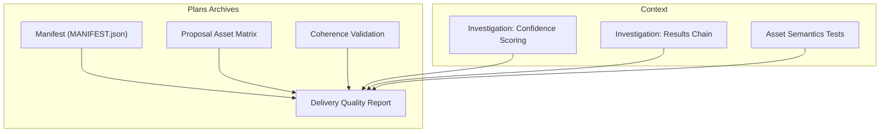
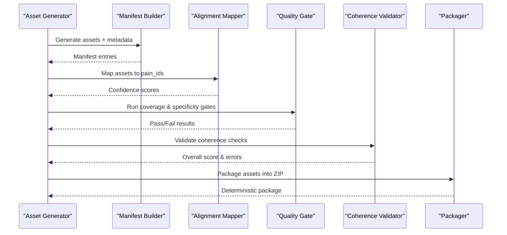
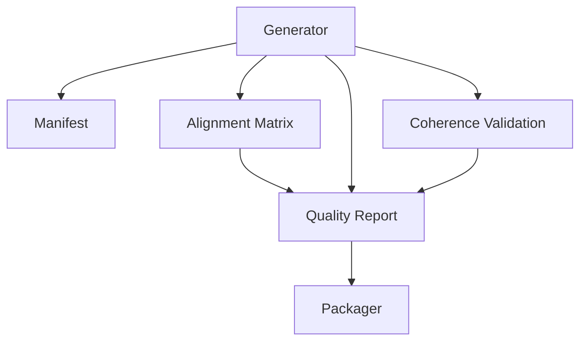

# Asset Catalog Management

<cite>
**Referenced Files in This Document**
- [zione_20260731_MANIFEST.json](file://plans/Archives/EVIDENCE-TIER-FALSE-CONFIDENCE-IAO-2026-07-31/evidence/FASE-5/zione/zione_20260731_MANIFEST.json)
- [proposal_asset_matrix.json](file://plans/Archives/DT-4-ROOT-CAUSE-2026-07-25/evidence/proposal_asset_matrix.json)
- [delivery_quality_report.json](file://plans/Archives/DT-3-TECH-DEBT-2026-07-25/evidence/delivery_quality_report.json)
- [coherence_validation.json](file://plans/Archives/DT-4-ROOT-CAUSE-2026-07-25/evidence/coherence_validation.json)
- [ROICRIII.md](file://context/Historico/ROICRIII.md)
- [INVESTIGACION_CONTEXTO.md](file://context/Historico/INVESTIGACION_CONTEXTO.md)
- [INVESTIGACION_RESULTADOS.md](file://context/Historico/INVESTIGACION_RESULTADOS.md)
- [dependencias-fases.md](file://plans/Archives/ASSET-ALIGNMENT-ZIONE-2026-07-23/dependencias-fases.md)
- [01-plan-maestro.md](file://plans/Archives/DT-1-DELIVERY-CONTRACT-2026-07-23/01-plan-maestro.md)
- [09-documentacion-post-proyecto.md](file://plans/Archives/DT-1-DELIVERY-CONTRACT-2026-07-23/09-documentacion-post-proyecto.md)
- [03-prompt-fase-B.md](file://plans/Archives/DT-2-DELIVERY-CONTRACT-RESIDUAL-2026-07-24/03-prompt-fase-B.md)
</cite>

## Table of Contents
1. Introduction
2. Project Structure
3. Core Components
4. Architecture Overview
5. Detailed Component Analysis
6. Dependency Analysis
7. Performance Considerations
8. Troubleshooting Guide
9. Conclusion
10. Appendices

## Introduction
This document provides comprehensive guidance for managing the asset catalog within the project, focusing on asset specifications, confidence scoring rules, generation priorities, registry structure, metadata definitions, validation schemas, lifecycle management, and maintenance best practices. It synthesizes evidence from manifests, alignment matrices, quality reports, coherence validations, and investigation notes to present a clear, actionable reference for both technical and non-technical stakeholders.

## Project Structure
The repository organizes asset-related artifacts under plans and context directories:
- Plans archives contain evidence files (manifests, alignment matrices, quality reports, coherence validations) that reflect generated assets and their states.
- Context documents capture investigations, decisions, and tests related to asset semantics, confidence scoring, and delivery packaging.

[No sources needed since this diagram shows conceptual workflow, not actual code structure]

**Section sources**
- [01-plan-maestro.md:54-84](file://plans/Archives/DT-1-DELIVERY-CONTRACT-2026-07-23/01-plan-maestro.md#L54-L84)

## Core Components
- Asset Manifest: Enumerates all generated assets with type, size, and path; includes versioning and timestamps.
- Proposal Asset Matrix: Maps pain IDs to asset types and service names, capturing alignment status and confidence levels.
- Delivery Quality Report: Aggregates gate results (coverage, proposal alignment, asset specificity, evidence).
- Coherence Validation: Scores cross-checks such as problem-solution alignment, financial data validity, and promised assets existence.
- Asset Semantics Validator: Ensures correct mapping between pain IDs and asset IDs, enforcing semantic consistency.

Key responsibilities:
- Define asset types and required fields via manifest entries and metadata schemas.
- Compute confidence scores based on data availability, priority, and fallback actions.
- Enforce gates and thresholds to block or warn on low-quality outputs.
- Maintain semantic mappings to prevent misalignment between problems and solutions.

**Section sources**
- [zione_20260731_MANIFEST.json:1-800](file://plans/Archives/EVIDENCE-TIER-FALSE-CONFIDENCE-IAO-2026-07-31/evidence/FASE-5/zione/zione_20260731_MANIFEST.json#L1-L800)
- [proposal_asset_matrix.json:1-83](file://plans/Archives/DT-4-ROOT-CAUSE-2026-07-25/evidence/proposal_asset_matrix.json#L1-L83)
- [delivery_quality_report.json:1-51](file://plans/Archives/DT-3-TECH-DEBT-2026-07-25/evidence/delivery_quality_report.json#L1-L51)
- [coherence_validation.json:1-55](file://plans/Archives/DT-4-ROOT-CAUSE-2026-07-25/evidence/coherence_validation.json#L1-L55)
- [ROICRIII.md:649-715](file://context/Historico/ROICRIII.md#L649-L715)

## Architecture Overview
The asset catalog system integrates generation, validation, and packaging through a pipeline:
- Generation produces assets and metadata, recorded in the manifest.
- Alignment maps assets to pain points and computes confidence.
- Quality and coherence checks enforce thresholds and flag issues.
- Packaging ensures consistent delivery with POSIX paths and deterministic ZIP creation.

**Diagram sources**
- [01-plan-maestro.md:54-84](file://plans/Archives/DT-1-DELIVERY-CONTRACT-2026-07-23/01-plan-maestro.md#L54-L84)

**Section sources**
- [01-plan-maestro.md:54-84](file://plans/Archives/DT-1-DELIVERY-CONTRACT-2026-07-23/01-plan-maestro.md#L54-L84)

## Detailed Component Analysis

### Asset Registry and Manifest Structure
- The manifest enumerates assets with name, size_bytes, and type. Types include diagnostic, proposal, guide, schema, code, and other.
- Each asset group often has a corresponding metadata file (e.g., _metadata.json) describing schema details.
- Versioning is captured at the manifest level (version, generated_at), enabling traceability across runs.

Best practices:
- Use consistent naming conventions for assets and metadata.
- Ensure size_bytes reflects actual content post-generation.
- Maintain POSIX paths internally for cross-platform compatibility.

**Section sources**
- [zione_20260731_MANIFEST.json:1-800](file://plans/Archives/EVIDENCE-TIER-FALSE-CONFIDENCE-IAO-2026-07-31/evidence/FASE-5/zione/zione_20260731_MANIFEST.json#L1-L800)

### Confidence Scoring Rules and Generation Priorities
- Confidence calculation considers data availability, asset priority (REQUIRED vs RECOMMENDED), and fallback actions.
- WARNING with REQUIRED priority yields lower confidence than WARNING with RECOMMENDED + fallback.
- Thresholds (e.g., 0.7) determine pass/fail behavior; mismatches between required_confidence and gate thresholds can cause false warnings.

Recommendations:
- Align required_confidence with gate thresholds to avoid inconsistent blocking.
- Prefer RECOMMENDED priority for assets with controlled fallbacks to improve confidence.
- Enrich data sources (e.g., DOM scraping) to increase natural confidence.

**Section sources**
- [INVESTIGACION_CONTEXTO.md:255-277](file://context/Historico/INVESTIGACION_CONTEXTO.md#L255-L277)
- [INVESTIGACION_RESULTADOS.md:109-137](file://context/Historico/INVESTIGACION_RESULTADOS.md#L109-L137)

### Semantic Validation and Coherence Checking
- Semantic validation ensures correct mapping between pain IDs and asset IDs, preventing misalignment.
- Coherence validation checks problem-solution alignment, financial data validity, and promised assets existence.
- Tests enforce that keys are pain_ids, not asset_ids, avoiding regression bugs.

Guidelines:
- Maintain explicit mappings in the validator configuration.
- Use coherence scores to identify weak areas requiring attention.
- Block delivery when critical coherence checks fail.

**Section sources**
- [ROICRIII.md:649-715](file://context/Historico/ROICRIII.md#L649-L715)
- [coherence_validation.json:1-55](file://plans/Archives/DT-4-ROOT-CAUSE-2026-07-25/evidence/coherence_validation.json#L1-L55)

### Asset Lifecycle and Versioning
- Assets progress through creation, generation, validation, packaging, and potential deprecation.
- Versioning is tracked via manifest headers and per-asset metadata files.
- Migration procedures involve updating mappings, adjusting thresholds, and re-running validation.

Lifecycle steps:
- Creation: Define asset type, required fields, and metadata schema.
- Generation: Produce content and metadata, record in manifest.
- Validation: Run semantic and coherence checks; adjust if needed.
- Packaging: Build deterministic ZIP with POSIX paths and accurate sizes.
- Deprecation: Archive old versions, update references, and ensure backward compatibility.

**Section sources**
- [01-plan-maestro.md:54-84](file://plans/Archives/DT-1-DELIVERY-CONTRACT-2026-07-23/01-plan-maestro.md#L54-L84)
- [09-documentacion-post-proyecto.md:1-25](file://plans/Archives/DT-1-DELIVERY-CONTRACT-2026-07-23/09-documentacion-post-proyecto.md#L1-L25)

### Configuring Technical, Content, and Hybrid Assets
- Technical assets (e.g., schemas, code) require strict schema validation and precise metadata.
- Content assets (e.g., guides, reports) focus on readability and alignment with pain points.
- Hybrid assets combine both aspects, needing robust validation and flexible generation rules.

Configuration tips:
- Define required fields per asset type in metadata schemas.
- Set appropriate priorities and fallback actions for each asset.
- Use templates for consistent content generation while allowing customization.

**Section sources**
- [proposal_asset_matrix.json:1-83](file://plans/Archives/DT-4-ROOT-CAUSE-2026-07-25/evidence/proposal_asset_matrix.json#L1-L83)

### Managing Dependencies and Resolving Conflicts
- Phase dependencies are documented to ensure proper sequencing of development tasks.
- File conflicts are avoided by assigning unique files to phases where possible.
- Dependency resolution involves understanding inter-phase requirements and maintaining clear boundaries.

Strategies:
- Follow phase dependency diagrams to plan work sequences.
- Isolate changes to specific files to minimize conflict risks.
- Review dependency tables before merging changes.

**Section sources**
- [dependencias-fases.md:1-44](file://plans/Archives/ASSET-ALIGNMENT-ZIONE-2026-07-23/dependencias-fases.md#L1-L44)

## Dependency Analysis
The asset catalog system relies on several interconnected components:
- Manifest depends on generator output and metadata schemas.
- Alignment matrix depends on pain-to-asset mappings and confidence calculations.
- Quality report aggregates results from multiple gates.
- Coherence validation depends on semantic and factual checks.

**Diagram sources**
- [01-plan-maestro.md:54-84](file://plans/Archives/DT-1-DELIVERY-CONTRACT-2026-07-23/01-plan-maestro.md#L54-L84)

**Section sources**
- [01-plan-maestro.md:54-84](file://plans/Archives/DT-1-DELIVERY-CONTRACT-2026-07-23/01-plan-maestro.md#L54-L84)

## Performance Considerations
- Optimize data enrichment to reduce reliance on fallback mechanisms.
- Cache intermediate results where possible to speed up repeated validations.
- Use deterministic processes to ensure reproducible outputs and faster debugging.
- Monitor confidence scores to identify bottlenecks in data availability.

[No sources needed since this section provides general guidance]

## Troubleshooting Guide
Common issues and resolutions:
- Low confidence scores: Enrich data sources or adjust priorities and thresholds.
- Semantic mismatches: Verify pain-to-asset mappings and ensure keys are pain_ids.
- Coherence failures: Address specific check failures (e.g., missing assets, insufficient confidence).
- Packaging inconsistencies: Ensure POSIX paths and accurate file sizes in manifest.

Debugging steps:
- Inspect asset_generation_report.json for detailed confidence breakdowns.
- Review coherence_validation.json for specific check failures and severity levels.
- Re-run semantic validation tests to catch regressions early.

**Section sources**
- [delivery_quality_report.json:1-51](file://plans/Archives/DT-3-TECH-DEBT-2026-07-25/evidence/delivery_quality_report.json#L1-L51)
- [coherence_validation.json:1-55](file://plans/Archives/DT-4-ROOT-CAUSE-2026-07-25/evidence/coherence_validation.json#L1-L55)
- [ROICRIII.md:649-715](file://context/Historico/ROICRIII.md#L649-L715)

## Conclusion
Effective asset catalog management requires careful definition of specifications, rigorous validation, and consistent lifecycle management. By aligning confidence scoring with generation priorities, maintaining semantic integrity, and optimizing performance, teams can deliver high-quality assets reliably. Adhering to best practices for auditing, cleanup, and maintenance ensures long-term sustainability and scalability of the asset ecosystem.

[No sources needed since this section summarizes without analyzing specific files]

## Appendices

### Example Configuration Scenarios
- Technical Asset: Define schema with required fields, set priority to REQUIRED, and configure strict validation.
- Content Asset: Create guide template with placeholders, set priority to RECOMMENDED, and enable fallback generation.
- Hybrid Asset: Combine schema validation with content templating, use conditional logic for data-driven sections.

[No sources needed since this section provides general guidance]

### Migration Procedures
- Update asset mappings in alignment matrix.
- Adjust confidence thresholds in quality gates.
- Re-run validation and coherence checks.
- Archive previous versions and update documentation.

[No sources needed since this section provides general guidance]