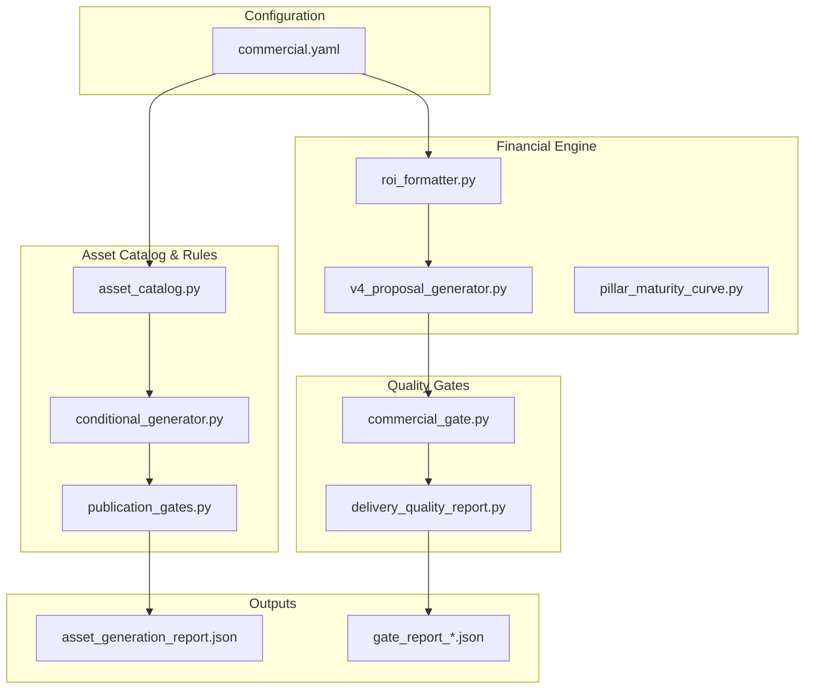
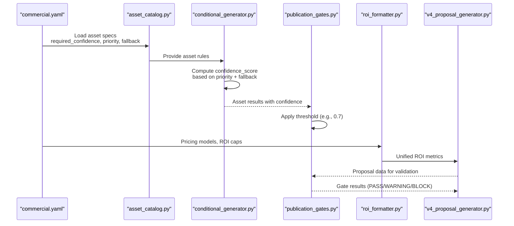
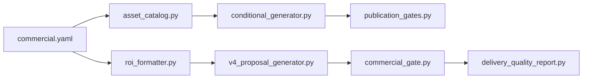

# Business Rules Configuration

<cite>
**Referenced Files in This Document**
- [INVESTIGACION_CONTEXTO.md](file://context/Historico/INVESTIGACION_CONTEXTO.md)
- [ROICRIII.md](file://context/Historico/ROICRIII.md)
- [roadmap-enrichlabs-vertical-hotels-strategy.md](file://context/Historico/roadmap-enrichlabs-vertical-hotels-strategy.md)
- [05-prompt-inicio-sesion-fase-1.md](file://plans/Archives/ROICRII/05-prompt-inicio-sesion-fase-1.md)
- [05-prompt-inicio-sesion-fase-2.md](file://plans/Archives/ROICRII/05-prompt-inicio-sesion-fase-2.md)
- [09-documentacion-post-proyecto.md](file://plans/Archives/ROICRII/09-documentacion-post-proyecto.md)
- [04-prompt-fase-3.md](file://plans/Archives/EVIDENCE-TIER-FALSE-CONFIDENCE-IAO-2026-07-31/04-prompt-fase-3.md)
- [asset_generation_report.json](file://plans/Archives/DT4-RESIDUAL-FIXES/evidence/FASE-6/asset_generation_report.json)
</cite>

## Table of Contents
1. Introduction
2. Project Structure
3. Core Components
4. Architecture Overview
5. Detailed Component Analysis
6. Dependency Analysis
7. Performance Considerations
8. Troubleshooting Guide
9. Conclusion

## Introduction
This document explains the business rules configuration system used to govern asset generation, confidence thresholds, priority levels, fallback behaviors, and commercial parameters. It focuses on how YAML-based configuration (notably commercial.yaml) drives pricing models, ROI calculations, maturity curves, and financial parameters; how the asset catalog defines required fields, validation rules, and generation priorities; and how business rules adapt to hotel segments, market conditions, and client profiles. It also covers version management strategies, environment-specific configurations, deployment considerations, troubleshooting guidance, and performance optimization tips for large-scale deployments.

## Project Structure
The repository contains extensive context and plan artifacts that describe the behavior and evolution of the business rules engine:
- Context documents detail root causes, contradictions, and fixes related to asset confidence, gates, and financial coherence.
- Plan archives describe phased implementations for ROI unification, financial coherence, evidence-tier consistency, and delivery contract alignment.
- Evidence files show runtime outputs such as asset generation reports and gate results.

[No sources needed since this diagram shows conceptual workflow, not actual code structure]

## Core Components
- Asset Catalog and Confidence Scoring
  - The asset catalog defines assets with required fields, confidence thresholds, priority levels, and fallback behaviors. Assets like faq_page and optimization_guide have been analyzed for their required_confidence and priority settings, which directly influence preflight checks and confidence scoring.
  - Conditional generator logic computes confidence scores based on priority and fallback presence. For example, a WARNING with REQUIRED priority yields a lower score than RECOMMENDED with fallback, affecting whether publication gates pass.

- Publication Gates and Thresholds
  - Publication gates enforce minimum confidence thresholds (e.g., 0.7). If an asset’s computed confidence is below threshold, the gate issues a warning or blocks depending on severity.

- Financial Engine and ROI
  - ROI calculation has been unified through a dedicated formatter module, ensuring consistent formatting and caps from commercial.yaml. The proposal generator uses this unified engine to compute ROI metrics across scenarios.

- Maturity Curves and Financial Parameters
  - Maturity curves model recovery over time, influencing total recovered amounts and ROI projections. These are integrated into the proposal generator to ensure coherent financial narratives.

- Evidence Tiers and Consistency Gates
  - Evidence tiers (A/B/C) reflect data availability and verification status. New gates ensure consistency between claimed tiers and available analytics connectivity (e.g., GA4/GSC), blocking delivery when inconsistent.

**Section sources**
- [INVESTIGACION_CONTEXTO.md:186-277](file://context/Historico/INVESTIGACION_CONTEXTO.md#L186-L277)
- [ROICRIII.md:573-647](file://context/Historico/ROICRIII.md#L573-L647)
- [05-prompt-inicio-sesion-fase-1.md:1-67](file://plans/Archives/ROICRII/05-prompt-inicio-sesion-fase-1.md#L1-L67)
- [09-documentacion-post-proyecto.md:1-28](file://plans/Archives/ROICRII/09-documentacion-post-proyecto.md#L1-L28)
- [04-prompt-fase-3.md:20-127](file://plans/Archives/EVIDENCE-TIER-FALSE-CONFIDENCE-IAO-2026-07-31/04-prompt-fase-3.md#L20-L127)

## Architecture Overview
The business rules configuration system integrates YAML-driven commercial parameters with asset catalog rules, conditional generation logic, and quality gates to produce validated proposals and assets.

**Diagram sources**
- [INVESTIGACION_CONTEXTO.md:186-277](file://context/Historico/INVESTIGACION_CONTEXTO.md#L186-L277)
- [05-prompt-inicio-sesion-fase-1.md:1-67](file://plans/Archives/ROICRII/05-prompt-inicio-sesion-fase-1.md#L1-L67)
- [04-prompt-fase-3.md:20-127](file://plans/Archives/EVIDENCE-TIER-FALSE-CONFIDENCE-IAO-2026-07-31/04-prompt-fase-3.md#L20-L127)

## Detailed Component Analysis

### Asset Catalog Configuration
- Required Fields and Validation Rules
  - Assets define required fields (e.g., faqs, metadata) and required_confidence thresholds. Preflight checks assess field quality; low-quality fields trigger warnings and fallback actions.
  - block_on_failure controls whether generation proceeds despite warnings.

- Priority Levels and Fallback Behaviors
  - Priority affects confidence scoring: REQUIRED with WARNING yields lower scores than RECOMMENDED with fallback.
  - Fallback mechanisms allow generation to continue with reduced confidence when data is incomplete.

- Generation Priorities
  - Assets like indirect_traffic_optimization use RECOMMENDED priority with lower required_confidence, enabling higher confidence scores when fallback is present.

**Section sources**
- [INVESTIGACION_CONTEXTO.md:186-277](file://context/Historico/INVESTIGACION_CONTEXTO.md#L186-L277)

### Commercial.yaml Structure
- Pricing Models and ROI Calculations
  - commercial.yaml provides pricing inputs and ROI caps. The ROI formatter ensures consistent formatting and applies caps as configured.
  - Proposal generator uses unified ROI metrics to avoid discrepancies between inline calculations and formatted outputs.

- Maturity Curves and Financial Parameters
  - Maturity curves model monthly recovery progression, impacting total recovered amounts and ROI projections.
  - Financial parameters include room counts, ADR, occupancy rates, and channel mix, influencing scenario calculations.

**Section sources**
- [05-prompt-inicio-sesion-fase-1.md:1-67](file://plans/Archives/ROICRII/05-prompt-inicio-sesion-fase-1.md#L1-L67)
- [09-documentacion-post-proyecto.md:1-28](file://plans/Archives/ROICRII/09-documentacion-post-proyecto.md#L1-L28)
- [ROICRIII.md:573-647](file://context/Historico/ROICRIII.md#L573-L647)

### Business Rules for Hotel Segments, Market Conditions, and Client Profiles
- Segment-Specific Rules
  - Business rules can be tailored per hotel segment (e.g., luxury vs. boutique) by adjusting asset priorities, confidence thresholds, and financial assumptions in commercial.yaml.

- Market Condition Adjustments
  - Market conditions influence required_confidence and fallback behaviors. For example, volatile markets may require higher confidence thresholds or more conservative ROI projections.

- Client Profile Customization
  - Client profiles affect evidence tiers and analytics connectivity requirements. Tier A clients may require verified GA4/GSC integration, enforced by consistency gates.

**Section sources**
- [roadmap-enrichlabs-vertical-hotels-strategy.md:1-85](file://context/Historico/roadmap-enrichlabs-vertical-hotels-strategy.md#L1-L85)
- [04-prompt-fase-3.md:20-127](file://plans/Archives/EVIDENCE-TIER-FALSE-CONFIDENCE-IAO-2026-07-31/04-prompt-fase-3.md#L20-L127)

### Practical Examples of Asset Configuration
- faq_page
  - Configure required_confidence and priority to balance generation flexibility with quality assurance. Use RECOMMENDED priority with fallback for improved confidence scores.

- optimization_guide
  - Similar to faq_page, adjust priority and fallback to ensure adequate confidence while allowing generation under partial data conditions.

- whatsapp_button
  - Validate presence in production using site presence checks. Skipped assets should use AUDIT_ONLY narrative when existing.

- Custom Assets
  - Define new assets with clear required fields, confidence thresholds, and fallback strategies. Ensure alignment with pain-to-asset mappings for automatic planning.

**Section sources**
- [INVESTIGACION_CONTEXTO.md:186-277](file://context/Historico/INVESTIGACION_CONTEXTO.md#L186-L277)
- [ROICRIII.md:649-715](file://context/Historico/ROICRIII.md#L649-L715)

### Version Management Strategies
- Configuration Versioning
  - Maintain separate versions of commercial.yaml for different environments (development, staging, production). Use feature flags to enable/disable specific rules.

- Asset Catalog Evolution
  - Introduce new assets incrementally, starting with RECOMMENDED priority and gradually increasing to REQUIRED after validation.

- Financial Model Updates
  - Update ROI formulas and maturity curves in controlled releases, ensuring backward compatibility with existing proposals.

**Section sources**
- [05-prompt-inicio-sesion-fase-2.md:1-58](file://plans/Archives/ROICRII/05-prompt-inicio-sesion-fase-2.md#L1-L58)

### Environment-Specific Configurations
- Development vs. Production
  - Development environments may use relaxed confidence thresholds and broader fallback options. Production requires strict validation and higher confidence thresholds.

- Analytics Connectivity
  - GA4/GSC availability varies by environment. Consistency gates enforce appropriate evidence tiers based on actual connectivity.

**Section sources**
- [04-prompt-fase-3.md:20-127](file://plans/Archives/EVIDENCE-TIER-FALSE-CONFIDENCE-IAO-2026-07-31/04-prompt-fase-3.md#L20-L127)

### Deployment Considerations
- Gate Enforcement
  - Ensure all quality gates are enabled in production to prevent delivery of non-compliant assets or proposals.

- Monitoring and Auditing
  - Log asset generation results and gate outcomes for auditability. Use manifest files to track delivered assets and their metadata.

- Rollback Strategies
  - Maintain previous versions of commercial.yaml and asset catalog configurations to enable quick rollbacks if issues arise.

**Section sources**
- [asset_generation_report.json:249-268](file://plans/Archives/DT4-RESIDUAL-FIXES/evidence/FASE-6/asset_generation_report.json#L249-L268)

## Dependency Analysis
The business rules system exhibits clear dependencies between configuration, asset catalog, generation logic, and quality gates.

**Diagram sources**
- [INVESTIGACION_CONTEXTO.md:186-277](file://context/Historico/INVESTIGACION_CONTEXTO.md#L186-L277)
- [05-prompt-inicio-sesion-fase-1.md:1-67](file://plans/Archives/ROICRII/05-prompt-inicio-sesion-fase-1.md#L1-L67)
- [04-prompt-fase-3.md:20-127](file://plans/Archives/EVIDENCE-TIER-FALSE-CONFIDENCE-IAO-2026-07-31/04-prompt-fase-3.md#L20-L127)

**Section sources**
- [INVESTIGACION_CONTEXTO.md:186-277](file://context/Historico/INVESTIGACION_CONTEXTO.md#L186-L277)
- [05-prompt-inicio-sesion-fase-1.md:1-67](file://plans/Archives/ROICRII/05-prompt-inicio-sesion-fase-1.md#L1-L67)
- [04-prompt-fase-3.md:20-127](file://plans/Archives/EVIDENCE-TIER-FALSE-CONFIDENCE-IAO-2026-07-31/04-prompt-fase-3.md#L20-L127)

## Performance Considerations
- Efficient Asset Generation
  - Use RECOMMENDED priority with fallback to reduce generation failures and improve throughput in large-scale deployments.

- Optimized ROI Calculations
  - Leverage unified ROI formatter to avoid redundant calculations and ensure consistent formatting across scenarios.

- Gate Evaluation Optimization
  - Precompute analytics connectivity status (GA4/GSC) to minimize repeated checks during gate evaluation.

- Memory and I/O Efficiency
  - Stream asset generation results and use efficient serialization formats for large datasets.

[No sources needed since this section provides general guidance]

## Troubleshooting Guide
- Common Configuration Issues
  - Mismatch between required_confidence and gate thresholds: Align asset catalog thresholds with publication gate requirements.
  - Incorrect priority settings: Ensure REQUIRED assets do not rely on fallback unless intended; consider RECOMMENDED for assets with robust fallback mechanisms.

- Financial Discrepancies
  - Verify ROI calculations use unified formatter and correct financial parameters from commercial.yaml.
  - Check maturity curve integration for accurate total recovered amounts and ROI projections.

- Evidence Tier Inconsistencies
  - Confirm analytics connectivity matches claimed evidence tier. Block delivery if Tier A is claimed without verified GA4/GSC access.

- Asset Generation Failures
  - Review preflight checks for missing or low-quality required fields. Enable appropriate fallback strategies to maintain generation flow.

**Section sources**
- [INVESTIGACION_CONTEXTO.md:186-277](file://context/Historico/INVESTIGACION_CONTEXTO.md#L186-L277)
- [05-prompt-inicio-sesion-fase-1.md:1-67](file://plans/Archives/ROICRII/05-prompt-inicio-sesion-fase-1.md#L1-L67)
- [04-prompt-fase-3.md:20-127](file://plans/Archives/EVIDENCE-TIER-FALSE-CONFIDENCE-IAO-2026-07-31/04-prompt-fase-3.md#L20-L127)

## Conclusion
The business rules configuration system provides a robust framework for managing asset generation, financial modeling, and quality assurance through YAML-based configuration. By carefully tuning asset catalog settings, commercial parameters, and gate thresholds, organizations can achieve reliable, scalable, and financially coherent outputs. Proper version management, environment-specific configurations, and proactive troubleshooting ensure smooth operations in large-scale deployments.

[No sources needed since this section summarizes without analyzing specific files]