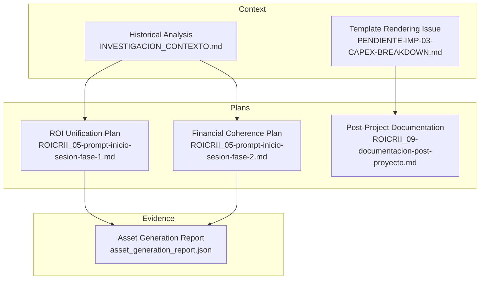
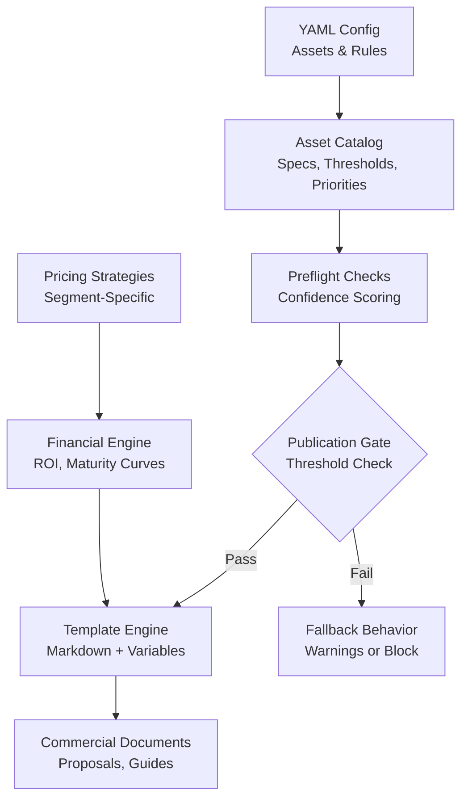
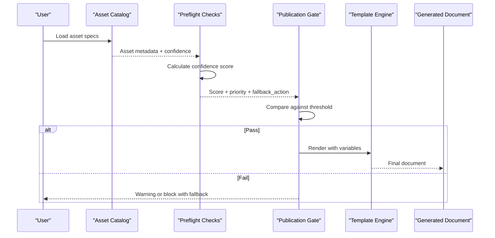
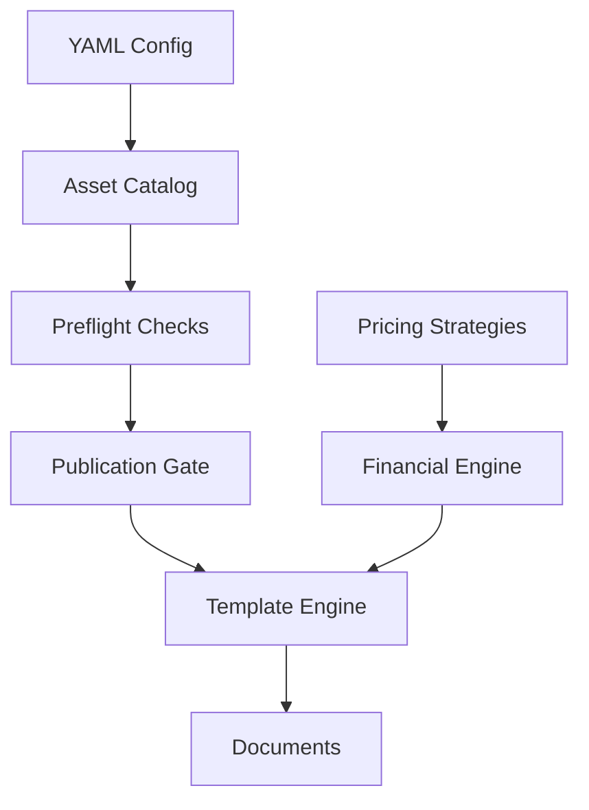

# Configuration and Customization

<cite>
**Referenced Files in This Document**
- [INVESTIGACION_CONTEXTO.md](file://context/Historico/INVESTIGACION_CONTEXTO.md)
- [ROICRII_05-prompt-inicio-sesion-fase-1.md](file://plans/Archives/ROICRII/05-prompt-inicio-sesion-fase-1.md)
- [ROICRII_05-prompt-inicio-sesion-fase-2.md](file://plans/Archives/ROICRII/05-prompt-inicio-sesion-fase-2.md)
- [ROICRII_09-documentacion-post-proyecto.md](file://plans/Archives/ROICRII/09-documentacion-post-proyecto.md)
- [PENDIENTE-IMP-03-CAPEX-BREAKDOWN.md](file://context/Historico/PENDIENTE-IMP-03-CAPEX-BREAKDOWN.md)
- [asset_generation_report.json](file://plans/Archives/DT4-RESIDUAL-FIXES/evidence/FASE-6/asset_generation_report.json)
</cite>

## Table of Contents
1. [Introduction](#introduction)
2. [Project Structure](#project-structure)
3. [Core Components](#core-components)
4. [Architecture Overview](#architecture-overview)
5. [Detailed Component Analysis](#detailed-component-analysis)
6. [Dependency Analysis](#dependency-analysis)
7. [Performance Considerations](#performance-considerations)
8. [Troubleshooting Guide](#troubleshooting-guide)
9. [Conclusion](#conclusion)
10. [Appendices](#appendices)

## Introduction
This document explains how to configure and customize the system’s business rules, pricing models, templates, and asset catalog. It focuses on:
- YAML-based configuration for assets, confidence thresholds, priorities, and fallback behaviors
- Financial model customization (ROI calculations, maturity curves, pricing strategies by hotel segment)
- Template system for commercial documents (markdown syntax, variable substitution, conditional rendering)
- Asset catalog structure, required fields, confidence scoring, and generation priorities
- Practical examples for assets like faq_page, optimization_guide, whatsapp_button, and custom assets
- Version management, environment-specific configurations, deployment considerations
- Troubleshooting common issues and performance tips for large-scale deployments

## Project Structure
The repository contains planning artifacts, evidence reports, and historical context that inform the configuration and customization behavior. Key areas relevant to this guide include:
- Context and historical analysis files describing asset catalog behavior, confidence scoring, and financial model inconsistencies
- Plans detailing ROI unification, financial coherence fixes, and template rendering issues
- Evidence JSON outputs showing asset validation results and gate checks

**Diagram sources**
- [INVESTIGACION_CONTEXTO.md](file://context/Historico/INVESTIGACION_CONTEXTO.md)
- [PENDIENTE-IMP-03-CAPEX-BREAKDOWN.md](file://context/Historico/PENDIENTE-IMP-03-CAPEX-BREAKDOWN.md)
- [ROICRII_05-prompt-inicio-sesion-fase-1.md](file://plans/Archives/ROICRII/05-prompt-inicio-sesion-fase-1.md)
- [ROICRII_05-prompt-inicio-sesion-fase-2.md](file://plans/Archives/ROICRII/05-prompt-inicio-sesion-fase-2.md)
- [ROICRII_09-documentacion-post-proyecto.md](file://plans/Archives/ROICRII/09-documentacion-post-proyecto.md)
- [asset_generation_report.json](file://plans/Archives/DT4-RESIDUAL-FIXES/evidence/FASE-6/asset_generation_report.json)

**Section sources**
- [INVESTIGACION_CONTEXTO.md](file://context/Historico/INVESTIGACION_CONTEXTO.md)
- [ROICRII_05-prompt-inicio-sesion-fase-1.md](file://plans/Archives/ROICRII/05-prompt-inicio-sesion-fase-1.md)
- [ROICRII_05-prompt-inicio-sesion-fase-2.md](file://plans/Archives/ROICRII/05-prompt-inicio-sesion-fase-2.md)
- [ROICRII_09-documentacion-post-proyecto.md](file://plans/Archives/ROICRII/09-documentacion-post-proyecto.md)
- [PENDIENTE-IMP-03-CAPEX-BREAKDOWN.md](file://context/Historico/PENDIENTE-IMP-03-CAPEX-BREAKDOWN.md)
- [asset_generation_report.json](file://plans/Archives/DT4-RESIDUAL-FIXES/evidence/FASE-6/asset_generation_report.json)

## Core Components
This section outlines the core components involved in configuration and customization:
- Business Rules Configuration: Defines asset specifications, confidence thresholds, priority levels, and fallback behaviors via YAML
- Pricing Model Customization: ROI calculations, maturity curves, and pricing strategies per hotel segment
- Template System: Markdown-based commercial document generation with variable substitution and conditional rendering
- Asset Catalog Management: Required fields, confidence scoring rules, and generation priorities

Key insights from the repository:
- Asset catalog entries define required_confidence, priority, and block_on_failure; these influence preflight checks and publication gates
- Confidence scoring logic penalizes certain combinations of priority and fallback, affecting whether assets pass publication gates
- ROI calculation was unified into a single engine with consistent formatting and opex-only denominators
- Template rendering uses markdown-safe substitution; nested tables can cause parsing issues

**Section sources**
- [INVESTIGACION_CONTEXTO.md](file://context/Historico/INVESTIGACION_CONTEXTO.md)
- [ROICRII_05-prompt-inicio-sesion-fase-1.md](file://plans/Archives/ROICRII/05-prompt-inicio-sesion-fase-1.md)
- [ROICRII_05-prompt-inicio-sesion-fase-2.md](file://plans/Archives/ROICRII/05-prompt-inicio-sesion-fase-2.md)
- [ROICRII_09-documentacion-post-proyecto.md](file://plans/Archives/ROICRII/09-documentacion-post-proyecto.md)
- [PENDIENTE-IMP-03-CAPEX-BREAKDOWN.md](file://context/Historico/PENDIENTE-IMP-03-CAPEX-BREAKDOWN.md)

## Architecture Overview
The configuration and customization architecture integrates asset catalog definitions, financial engines, and template rendering into a cohesive pipeline.

**Diagram sources**
- [INVESTIGACION_CONTEXTO.md](file://context/Historico/INVESTIGACION_CONTEXTO.md)
- [ROICRII_05-prompt-inicio-sesion-fase-1.md](file://plans/Archives/ROICRII/05-prompt-inicio-sesion-fase-1.md)
- [ROICRII_05-prompt-inicio-sesion-fase-2.md](file://plans/Archives/ROICRII/05-prompt-inicio-sesion-fase-2.md)
- [ROICRII_09-documentacion-post-proyecto.md](file://plans/Archives/ROICRII/09-documentacion-post-proyecto.md)
- [PENDIENTE-IMP-03-CAPEX-BREAKDOWN.md](file://context/Historico/PENDIENTE-IMP-03-CAPEX-BREAKDOWN.md)

## Detailed Component Analysis

### Business Rules Configuration (YAML-Based)
- Asset specifications include required_confidence, priority (REQUIRED/RECOMMENDED), and block_on_failure
- Confidence thresholds determine whether assets pass publication gates
- Fallback behaviors are triggered when data quality is insufficient; outcomes depend on priority and fallback_action

Practical guidance:
- Use RECOMMENDED priority for assets with controlled fallbacks to achieve higher confidence scores
- Align required_confidence with publication gate thresholds to avoid mismatches
- Define clear fallback_action values to ensure graceful degradation

**Section sources**
- [INVESTIGACION_CONTEXTO.md](file://context/Historico/INVESTIGACION_CONTEXTO.md)

### Pricing Model Customization
- ROI calculations were unified into a single engine with consistent formatting (two decimal places)
- Financial coherence ensures ROI uses OPEX-only denominators and aligns with pricing pipelines
- Maturity curves and pricing strategies can be customized per hotel segment using scenario parameters

Implementation notes:
- Replace inline ROI methods with the unified formatter
- Ensure expected_recovery_cop is passed through pricing wrappers to activate multi-step pipelines
- Validate ROI consistency between gates and generated documents

**Section sources**
- [ROICRII_05-prompt-inicio-sesion-fase-1.md](file://plans/Archives/ROICRII/05-prompt-inicio-sesion-fase-1.md)
- [ROICRII_05-prompt-inicio-sesion-fase-2.md](file://plans/Archives/ROICRII/05-prompt-inicio-sesion-fase-2.md)
- [ROICRII_09-documentacion-post-proyecto.md](file://plans/Archives/ROICRII/09-documentacion-post-proyecto.md)

### Template Modification
- Templates use markdown syntax with variable substitution
- Conditional content rendering supports dynamic sections based on asset availability and confidence
- Nested markdown tables can cause parsing issues; avoid embedding tables within table cells

Best practices:
- Use safe_substitute for variable injection to prevent injection vulnerabilities
- Preprocess conditionals before template rendering
- Validate template output for structural integrity

**Section sources**
- [PENDIENTE-IMP-03-CAPEX-BREAKDOWN.md](file://context/Historico/PENDIENTE-IMP-03-CAPEX-BREAKDOWN.md)

### Asset Catalog Management
- Required fields include metadata, confidence scores, and priority levels
- Confidence scoring rules penalize REQUIRED priority with fallbacks unless properly configured
- Generation priorities determine asset selection order and fallback chains

Examples:
- faq_page and optimization_guide should use RECOMMENDED priority with controlled fallbacks
- whatsapp_button may require implementation validation before publication
- Custom assets should follow the same schema and validation rules

**Section sources**
- [INVESTIGACION_CONTEXTO.md](file://context/Historico/INVESTIGACION_CONTEXTO.md)
- [asset_generation_report.json](file://plans/Archives/DT4-RESIDUAL-FIXES/evidence/FASE-6/asset_generation_report.json)

#### Sequence Diagram: Asset Generation Flow

**Diagram sources**
- [INVESTIGACION_CONTEXTO.md](file://context/Historico/INVESTIGACION_CONTEXTO.md)
- [asset_generation_report.json](file://plans/Archives/DT4-RESIDUAL-FIXES/evidence/FASE-6/asset_generation_report.json)

## Dependency Analysis
The configuration and customization system has clear dependencies between asset catalog definitions, financial engines, and template rendering.

**Diagram sources**
- [INVESTIGACION_CONTEXTO.md](file://context/Historico/INVESTIGACION_CONTEXTO.md)
- [ROICRII_05-prompt-inicio-sesion-fase-1.md](file://plans/Archives/ROICRII/05-prompt-inicio-sesion-fase-1.md)
- [ROICRII_05-prompt-inicio-sesion-fase-2.md](file://plans/Archives/ROICRII/05-prompt-inicio-sesion-fase-2.md)
- [ROICRII_09-documentacion-post-proyecto.md](file://plans/Archives/ROICRII/09-documentacion-post-proyecto.md)
- [PENDIENTE-IMP-03-CAPEX-BREAKDOWN.md](file://context/Historico/PENDIENTE-IMP-03-CAPEX-BREAKDOWN.md)

**Section sources**
- [INVESTIGACION_CONTEXTO.md](file://context/Historico/INVESTIGACION_CONTEXTO.md)
- [ROICRII_05-prompt-inicio-sesion-fase-1.md](file://plans/Archives/ROICRII/05-prompt-inicio-sesion-fase-1.md)
- [ROICRII_05-prompt-inicio-sesion-fase-2.md](file://plans/Archives/ROICRII/05-prompt-inicio-sesion-fase-2.md)
- [ROICRII_09-documentacion-post-proyecto.md](file://plans/Archives/ROICRII/09-documentacion-post-proyecto.md)
- [PENDIENTE-IMP-03-CAPEX-BREAKDOWN.md](file://context/Historico/PENDIENTE-IMP-03-CAPEX-BREAKDOWN.md)

## Performance Considerations
- Optimize asset catalog loading by caching frequently accessed configurations
- Use efficient confidence scoring algorithms to minimize preflight check overhead
- Validate templates once during deployment to reduce runtime parsing errors
- Implement batch processing for large-scale asset generation to improve throughput

[No sources needed since this section provides general guidance]

## Troubleshooting Guide
Common configuration issues and their resolutions:
- Confidence threshold mismatches: Align required_confidence with publication gate thresholds
- Template rendering errors: Avoid nested markdown tables and validate variable substitution
- Asset validation failures: Ensure all required fields are present and confidence scores meet minimums
- ROI inconsistencies: Verify OPEX-only denominators and unified ROI engine usage

Diagnostic steps:
- Review asset_generation_report.json for validation errors and warnings
- Check preflight logs for confidence scoring details
- Validate template syntax and variable names
- Confirm financial engine parameters match segment-specific requirements

**Section sources**
- [asset_generation_report.json](file://plans/Archives/DT4-RESIDUAL-FIXES/evidence/FASE-6/asset_generation_report.json)
- [INVESTIGACION_CONTEXTO.md](file://context/Historico/INVESTIGACION_CONTEXTO.md)
- [PENDIENTE-IMP-03-CAPEX-BREAKDOWN.md](file://context/Historico/PENDIENTE-IMP-03-CAPEX-BREAKDOWN.md)

## Conclusion
The configuration and customization system provides a robust framework for managing business rules, pricing models, templates, and asset catalogs. By following the guidelines outlined in this document, users can effectively configure assets, customize financial models, generate commercial documents, and manage asset lifecycles. Proper version management, environment-specific configurations, and deployment best practices ensure reliable operation at scale.

[No sources needed since this section summarizes without analyzing specific files]

## Appendices

### Practical Examples: Asset Configuration
- faq_page: Set priority=RECOMMENDED, required_confidence=0.5, block_on_failure=False
- optimization_guide: Configure with controlled fallback_action and confidence scoring
- whatsapp_button: Implement validation checks and update asset_generation_report.json
- Custom assets: Follow the same schema and validation rules as built-in assets

**Section sources**
- [INVESTIGACION_CONTEXTO.md](file://context/Historico/INVESTIGACION_CONTEXTO.md)
- [asset_generation_report.json](file://plans/Archives/DT4-RESIDUAL-FIXES/evidence/FASE-6/asset_generation_report.json)

### Version Management and Deployment
- Use semantic versioning for configuration changes
- Maintain environment-specific YAML files for development, staging, and production
- Implement configuration validation during CI/CD pipelines
- Document breaking changes and migration paths for major updates

[No sources needed since this section provides general guidance]