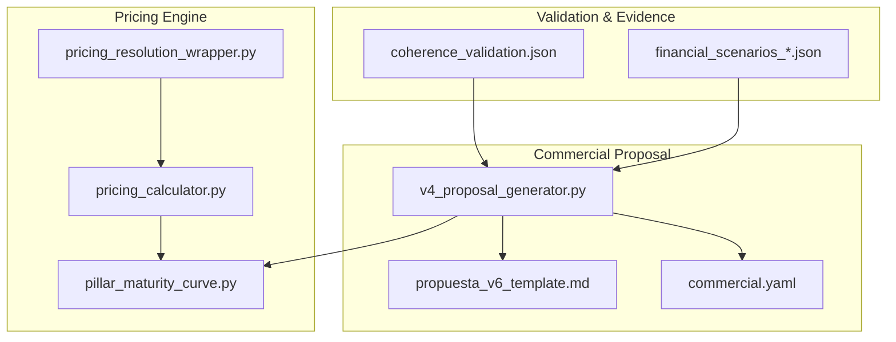
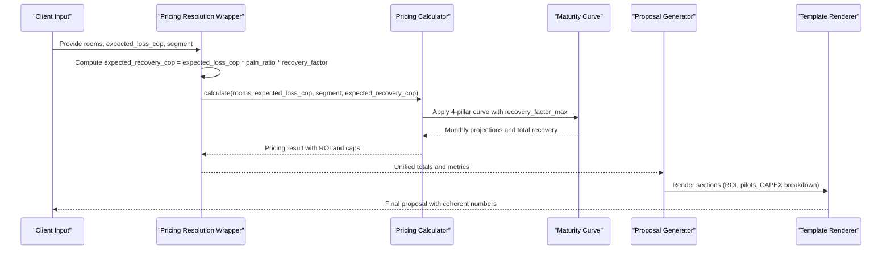
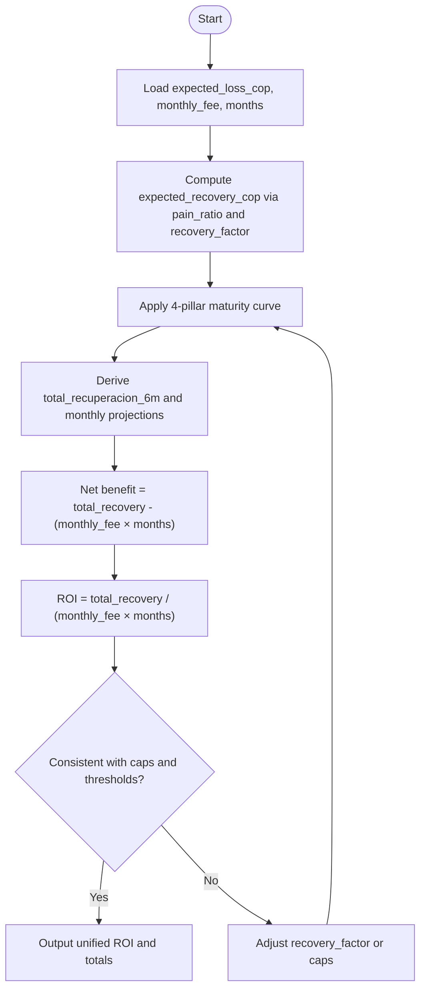
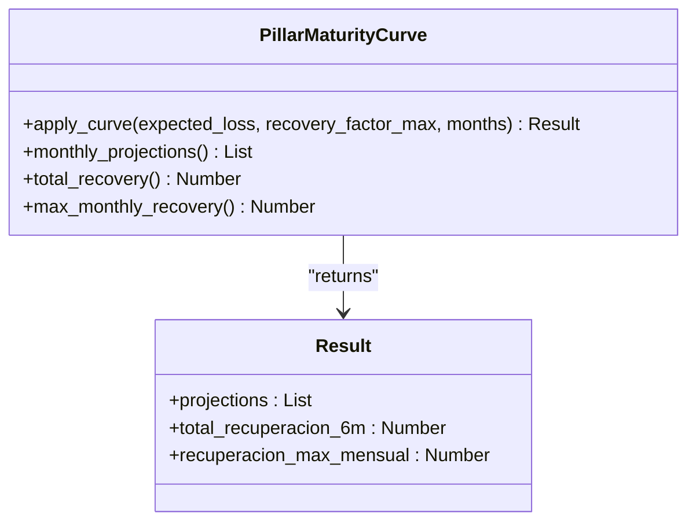
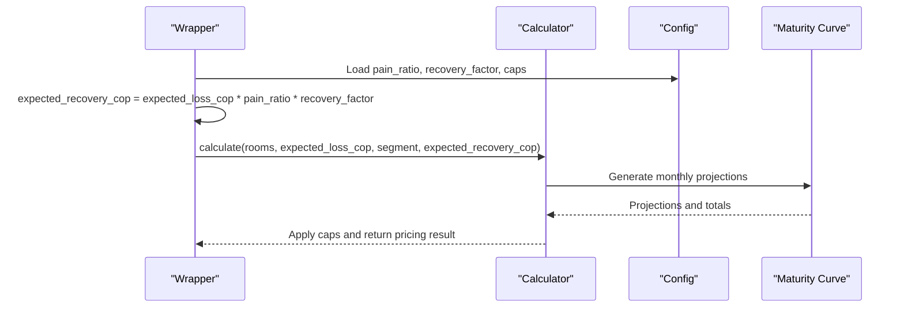
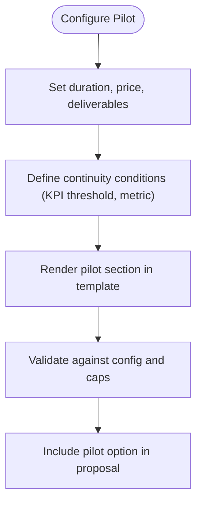
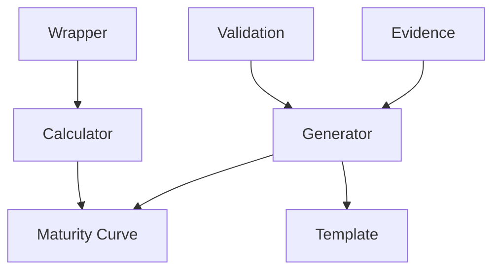

# Pricing Models Customization

<cite>
**Referenced Files in This Document**
- [ROICRIII.md](file://context/Historico/ROICRIII.md)
- [05-prompt-inicio-sesion-fase-2.md](file://plans/Archives/ROICRII/05-prompt-inicio-sesion-fase-2.md)
- [05-prompt-inicio-sesion-fase-1.md](file://plans/Archives/ROICRIII/05-prompt-inicio-sesion-fase-1.md)
- [05-prompt-inicio-sesion-fase-5.md](file://plans/Archives/ROICRIII/05-prompt-inicio-sesion-fase-5.md)
- [coherence_validation.json](file://plans/Archives/DT-3-TECH-DEBT-2026-07-25/evidence/coherence_validation.json)
- [financial_scenarios_20260728_091940.json](file://plans/Archives/DT4-RESIDUAL-FIXES/evidence/FASE-6/financial_scenarios_20260728_091940.json)
</cite>

## Table of Contents
1. [Introduction](#introduction)
2. [Project Structure](#project-structure)
3. [Core Components](#core-components)
4. [Architecture Overview](#architecture-overview)
5. [Detailed Component Analysis](#detailed-component-analysis)
6. [Dependency Analysis](#dependency-analysis)
7. [Performance Considerations](#performance-considerations)
8. [Troubleshooting Guide](#troubleshooting-guide)
9. [Conclusion](#conclusion)
10. [Appendices](#appendices)

## Introduction
This document explains how to customize pricing models for hotel segments, including ROI calculations, maturity curves, and financial engines that compute fee structures, recovery factors, pain ratio metrics, and value-capture caps. It also provides guidance on configuring pilot programs, trial periods, promotional pricing, and the mathematical foundations behind ROI projections and coherence validation. Finally, it includes testing strategies and debugging techniques to ensure financial consistency across outputs.

## Project Structure
The repository contains planning artifacts, historical context, and evidence files that describe the evolution and validation of the pricing engine and commercial proposal generation. Key areas include:
- Historical analysis and fixes for ROI consistency and maturity curve usage
- Wrapper and calculator wiring for expected recovery and pain ratio inputs
- Pilot program configuration and CAPEX breakdown rendering
- Coherence validation and financial scenario evidence

**Diagram sources**
- [05-prompt-inicio-sesion-fase-2.md](file://plans/Archives/ROICRII/05-prompt-inicio-sesion-fase-2.md)
- [05-prompt-inicio-sesion-fase-1.md](file://plans/Archives/ROICRIII/05-prompt-inicio-sesion-fase-1.md)
- [05-prompt-inicio-sesion-fase-5.md](file://plans/Archives/ROICRIII/05-prompt-inicio-sesion-fase-5.md)
- [coherence_validation.json](file://plans/Archives/DT-3-TECH-DEBT-2026-07-25/evidence/coherence_validation.json)
- [financial_scenarios_20260728_091940.json](file://plans/Archives/DT4-RESIDUAL-FIXES/evidence/FASE-6/financial_scenarios_20260728_091940.json)

**Section sources**
- [ROICRIII.md](file://context/Historico/ROICRIII.md)
- [05-prompt-inicio-sesion-fase-2.md](file://plans/Archives/ROICRII/05-prompt-inicio-sesion-fase-2.md)
- [05-prompt-inicio-sesion-fase-1.md](file://plans/Archives/ROICRIII/05-prompt-inicio-sesion-fase-1.md)
- [05-prompt-inicio-sesion-fase-5.md](file://plans/Archives/ROICRIII/05-prompt-inicio-sesion-fase-5.md)
- [coherence_validation.json](file://plans/Archives/DT-3-TECH-DEBT-2026-07-25/evidence/coherence_validation.json)
- [financial_scenarios_20260728_091940.json](file://plans/Archives/DT4-RESIDUAL-FIXES/evidence/FASE-6/financial_scenarios_20260728_091940.json)

## Core Components
- Financial wrapper and calculator: The wrapper computes expected recovery using a pain ratio and recovery factor, then passes it to the calculator to derive pricing results.
- Maturity curve: A four-pillar curve (GEO→SEO→AEO→IAO) projects monthly recoveries over time with a maximum recovery factor cap.
- Commercial generator and templates: The generator unifies totals from the maturity curve, formats ROI consistently, and renders sections like pilots and CAPEX breakdowns from configuration.
- Validation and evidence: Coherence validation and financial scenarios provide checks and audit trails for pricing decisions.

Key configuration and behavior:
- Fee structure: Monthly OPEX is used as the investment base; CAPEX can be broken down into components.
- Recovery factor: A realistic percentage applied to addressable loss to estimate recoverable revenue per month.
- Pain ratio: Internal metric indicating price-to-loss ratio; must not be presented as a formula multiplier in customer-facing text.
- Value-capture cap: Ensures monthly recovery does not exceed a defined percentage of projected gain.

**Section sources**
- [05-prompt-inicio-sesion-fase-2.md](file://plans/Archives/ROICRII/05-prompt-inicio-sesion-fase-2.md)
- [ROICRIII.md](file://context/Historico/ROICRIII.md)
- [05-prompt-inicio-sesion-fase-1.md](file://plans/Archives/ROICRIII/05-prompt-inicio-sesion-fase-1.md)
- [05-prompt-inicio-sesion-fase-5.md](file://plans/Archives/ROICRIII/05-prompt-inicio-sesion-fase-5.md)

## Architecture Overview
The pricing system integrates three layers:
- Input layer: Hotel segment data, expected monthly loss, and configuration parameters (pain ratio, recovery factor, caps).
- Calculation layer: Wrapper computes expected recovery; calculator applies constraints; maturity curve generates monthly projections.
- Output layer: Generator produces consistent totals, ROI, and narrative sections; templates render structured proposals with optional pilots and CAPEX breakdowns.

**Diagram sources**
- [05-prompt-inicio-sesion-fase-2.md](file://plans/Archives/ROICRII/05-prompt-inicio-sesion-fase-2.md)
- [05-prompt-inicio-sesion-fase-1.md](file://plans/Archives/ROICRIII/05-prompt-inicio-sesion-fase-1.md)
- [05-prompt-inicio-sesion-fase-5.md](file://plans/Archives/ROICRIII/05-prompt-inicio-sesion-fase-5.md)

## Detailed Component Analysis

### ROI Calculations and Financial Coherence
- Unify totals: Ensure total recovery and net benefit derive from the same source (maturity curve), avoiding dual calculation paths that produce conflicting ROIs.
- ROI formula: Use total recovery over the projection period divided by total OPEX (monthly fee × months). Include CAPEX only when applicable and clearly separated.
- Consistency checks: Validate that displayed ROI matches underlying totals and that percentages (e.g., investment vs. loss) are computed directly from fee and loss figures.

**Diagram sources**
- [ROICRIII.md](file://context/Historico/ROICRIII.md)
- [05-prompt-inicio-sesion-fase-1.md](file://plans/Archives/ROICRIII/05-prompt-inicio-sesion-fase-1.md)

**Section sources**
- [ROICRIII.md](file://context/Historico/ROICRIII.md)
- [05-prompt-inicio-sesion-fase-1.md](file://plans/Archives/ROICRIII/05-prompt-inicio-sesion-fase-1.md)

### Maturity Curves Algorithms
- Four-pillar progression: GEO → SEO → AEO → IAO with increasing monthly recovery percentages culminating at a steady state.
- Maximum recovery factor: Caps monthly recovery to a realistic percentage of addressable loss.
- Summation and projections: Each month’s recovery is derived from the curve; totals must match the sum of monthly projections.

**Diagram sources**
- [ROICRIII.md](file://context/Historico/ROICRIII.md)

**Section sources**
- [ROICRIII.md](file://context/Historico/ROICRIII.md)

### Financial Engines Configuration
- Wrapper pipeline: Compute expected recovery using pain ratio and recovery factor before calling the calculator.
- Calculator constraints: Enforce value-capture caps and ensure recovery does not exceed configured limits.
- Fee structures: Separate OPEX (monthly fee) from CAPEX (setup fees); present CAPEX as a breakdown when available.

**Diagram sources**
- [05-prompt-inicio-sesion-fase-2.md](file://plans/Archives/ROICRII/05-prompt-inicio-sesion-fase-2.md)

**Section sources**
- [05-prompt-inicio-sesion-fase-2.md](file://plans/Archives/ROICRII/05-prompt-inicio-sesion-fase-2.md)

### Pain Ratio Calculations and Value-Capture Caps
- Pain ratio definition: Internal metric representing price-to-loss ratio; do not present as a formula multiplier in customer-facing materials.
- Value-capture cap: Ensure monthly recovery does not exceed a defined percentage of projected gain; validate against fee levels.
- Narrative correction: Replace internal artifacts (e.g., “13% of prioritized pain”) with transparent origins based on maturity curve and recovery factor.

**Section sources**
- [ROICRIII.md](file://context/Historico/ROICRIII.md)

### Customizing Pricing for Market Conditions, Hotel Sizes, and Service Tiers
- Segment inputs: Adjust expected monthly loss and room counts per segment to reflect market conditions.
- Tiering logic: Use evidence tiers and onboarding status to tailor proposal precision and disclaimers.
- Promotional pricing: Configure pilot options and trial periods with clear continuity conditions and KPI thresholds.

**Section sources**
- [05-prompt-inicio-sesion-fase-5.md](file://plans/Archives/ROICRIII/05-prompt-inicio-sesion-fase-5.md)

### Pilot Programs, Trial Periods, and Promotional Pricing
- Pilot configuration: Define duration, one-time investment, deliverables, and continuity conditions tied to measurable improvements.
- CAPEX breakdown: Present setup fees as componentized costs rather than a single number.
- Guarantee with KPI: Specify metrics and thresholds for service guarantees to enhance trust and accountability.

**Diagram sources**
- [05-prompt-inicio-sesion-fase-5.md](file://plans/Archives/ROICRIII/05-prompt-inicio-sesion-fase-5.md)

**Section sources**
- [05-prompt-inicio-sesion-fase-5.md](file://plans/Archives/ROICRIII/05-prompt-inicio-sesion-fase-5.md)

## Dependency Analysis
The pricing system depends on:
- Wrapper-calculator coupling for expected recovery computation
- Maturity curve integration for monthly projections
- Generator-template linkage for consistent output
- Validation-evidence linkage for auditability

**Diagram sources**
- [05-prompt-inicio-sesion-fase-2.md](file://plans/Archives/ROICRII/05-prompt-inicio-sesion-fase-2.md)
- [05-prompt-inicio-sesion-fase-1.md](file://plans/Archives/ROICRIII/05-prompt-inicio-sesion-fase-1.md)
- [coherence_validation.json](file://plans/Archives/DT-3-TECH-DEBT-2026-07-25/evidence/coherence_validation.json)
- [financial_scenarios_20260728_091940.json](file://plans/Archives/DT4-RESIDUAL-FIXES/evidence/FASE-6/financial_scenarios_20260728_091940.json)

**Section sources**
- [coherence_validation.json](file://plans/Archives/DT-3-TECH-DEBT-2026-07-25/evidence/coherence_validation.json)
- [financial_scenarios_20260728_091940.json](file://plans/Archives/DT4-RESIDUAL-FIXES/evidence/FASE-6/financial_scenarios_20260728_091940.json)

## Performance Considerations
- Avoid dual calculation paths: Use a single source of truth for totals to prevent redundant computations and inconsistencies.
- Cap enforcement: Apply value-capture caps early to limit unnecessary recalculations.
- Template rendering: Minimize repeated formatting operations; cache computed values where appropriate.

[No sources needed since this section provides general guidance]

## Troubleshooting Guide
Common issues and resolutions:
- Conflicting ROIs: Ensure all totals derive from the maturity curve; remove redundant totals in simple tables.
- Incorrect percentages: Compute investment vs. loss directly from fee and expected loss; avoid using internal pain ratio artifacts in narratives.
- Missing pilot sections: Verify configuration keys and template placeholders; ensure generator methods load and render correctly.
- Deprecated assets: Filter out deprecated asset types from lists and catalogs to maintain clarity.

**Section sources**
- [ROICRIII.md](file://context/Historico/ROICRIII.md)
- [05-prompt-inicio-sesion-fase-1.md](file://plans/Archives/ROICRIII/05-prompt-inicio-sesion-fase-1.md)
- [05-prompt-inicio-sesion-fase-5.md](file://plans/Archives/ROICRIII/05-prompt-inicio-sesion-fase-5.md)

## Conclusion
Customizing pricing models requires disciplined financial modeling, consistent data flows, and transparent communication. By unifying calculation sources, enforcing caps, and validating outputs through coherence checks, you can deliver accurate, trustworthy proposals tailored to different hotel segments and market conditions. Pilot programs and CAPEX breakdowns further enhance credibility and flexibility.

[No sources needed since this section summarizes without analyzing specific files]

## Appendices
- Testing strategies: Use unit tests to validate maturity curve sums, ROI coherence, and percentage calculations.
- Audit trails: Leverage coherence validation and financial scenario evidence to trace pricing decisions and ensure reproducibility.

**Section sources**
- [ROICRIII.md](file://context/Historico/ROICRIII.md)
- [coherence_validation.json](file://plans/Archives/DT-3-TECH-DEBT-2026-07-25/evidence/coherence_validation.json)
- [financial_scenarios_20260728_091940.json](file://plans/Archives/DT4-RESIDUAL-FIXES/evidence/FASE-6/financial_scenarios_20260728_091940.json)