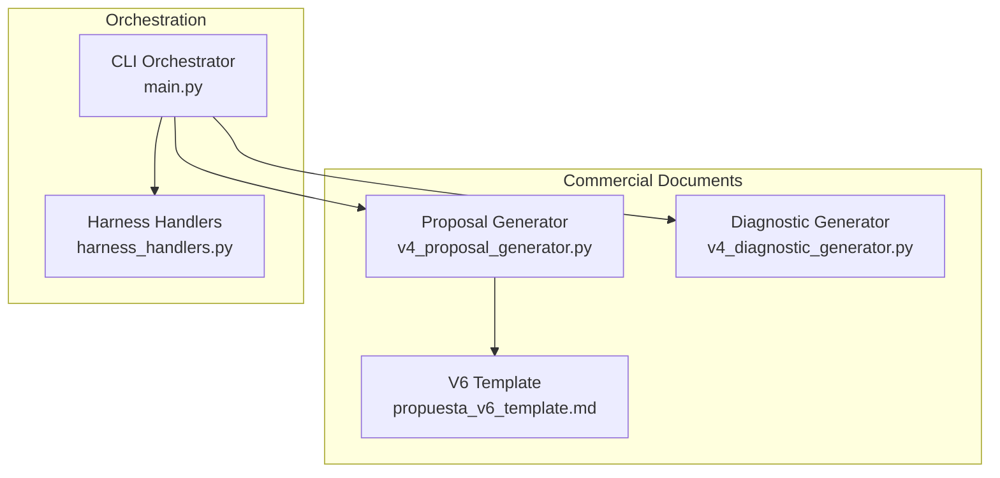
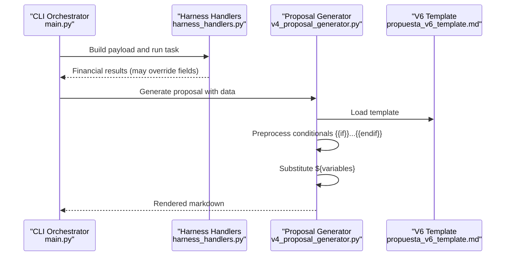
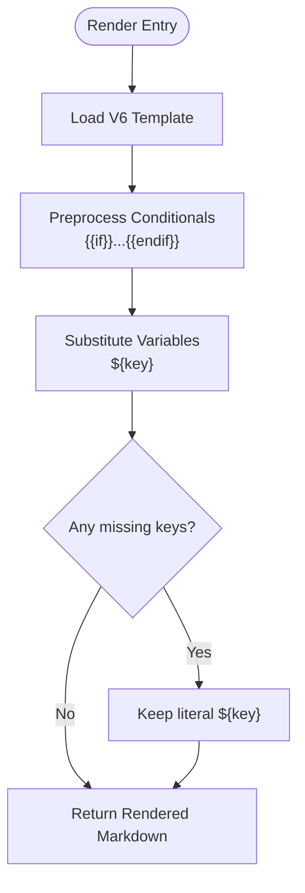
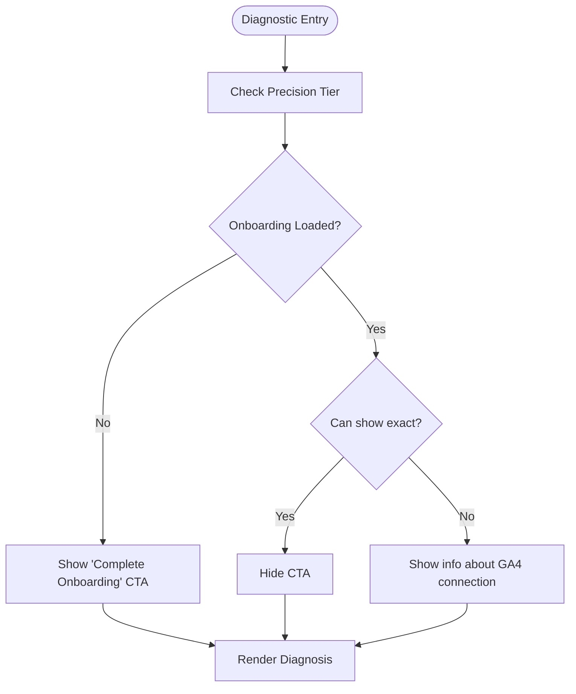
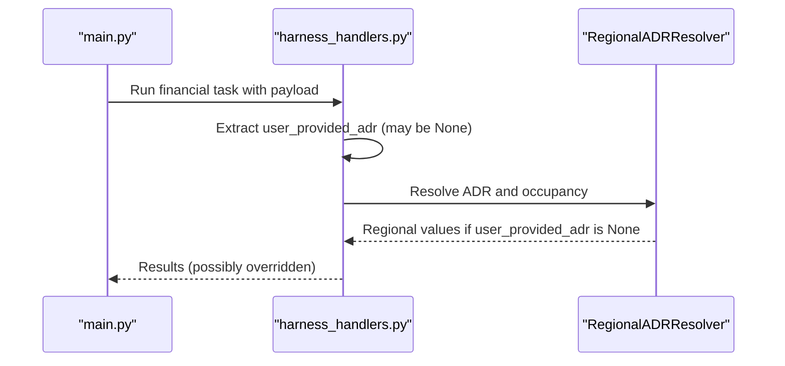
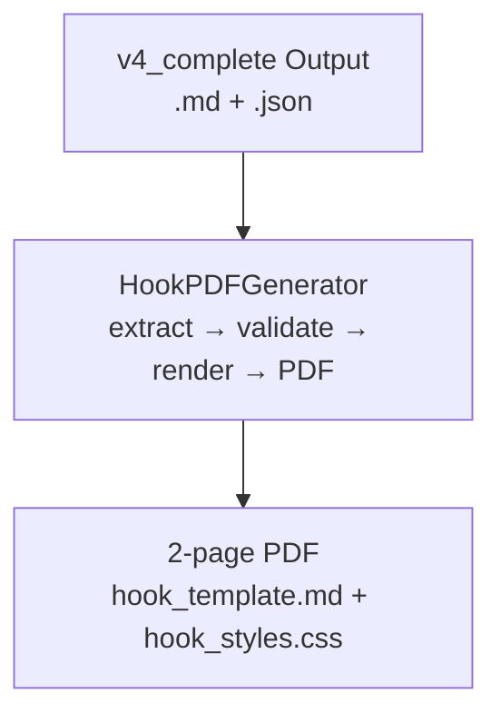
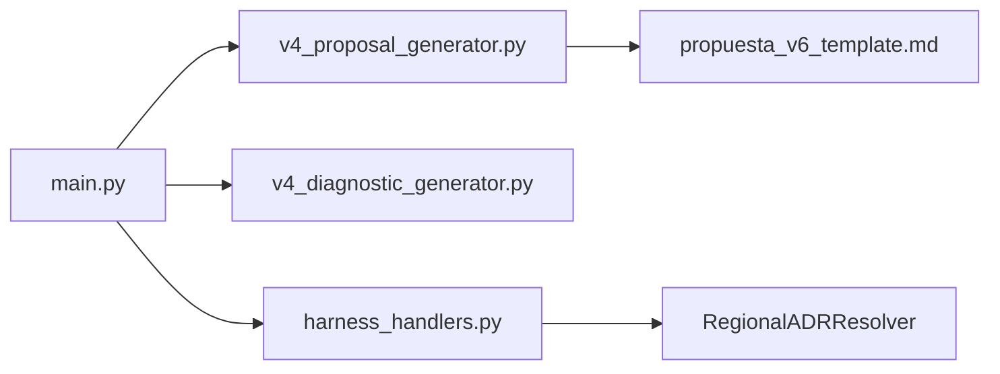

# Template System Customization

<cite>
**Referenced Files in This Document**
- [v4_proposal_generator.py](file://modules/commercial_documents/v4_proposal_generator.py)
- [propuesta_v6_template.md](file://modules/commercial_documents/templates/propuesta_v6_template.md)
- [v4_diagnostic_generator.py](file://modules/commercial_documents/v4_diagnostic_generator.py)
- [main.py](file://main.py)
- [harness_handlers.py](file://agent_harness/harness_handlers.py)
- [MODULO-HOOK-PDF.md](file://.opencode/context/MODULO-HOOK-PDF.md)
</cite>

## Table of Contents
1. [Introduction](#introduction)
2. [Project Structure](#project-structure)
3. [Core Components](#core-components)
4. [Architecture Overview](#architecture-overview)
5. [Detailed Component Analysis](#detailed-component-analysis)
6. [Dependency Analysis](#dependency-analysis)
7. [Performance Considerations](#performance-considerations)
8. [Troubleshooting Guide](#troubleshooting-guide)
9. [Conclusion](#conclusion)
10. [Appendices](#appendices)

## Introduction
This document explains the template system used to generate commercial documents (diagnosis and proposal), focusing on markdown syntax, variable substitution, conditional rendering, and customization patterns for V6 templates. It covers how data is bound into templates, how conditionals and loops are implemented, how to create or modify sections, and how to manage versions, environments, testing, and deployment strategies. It also includes guidance on debugging and error handling based on observed behaviors in the codebase.

## Project Structure
The template system centers around:
- A proposal generator that loads a V6 markdown template, preprocesses conditionals, performs variable substitution, and returns rendered markdown.
- A diagnostic generator that produces diagnosis content with its own templating and conditional logic.
- Orchestration and harness layers that supply runtime data and may override certain values based on feature flags or regional benchmarks.
- Supporting documentation and plans that describe template evolution, known issues, and extension points.

**Diagram sources**
- [v4_proposal_generator.py](file://modules/commercial_documents/v4_proposal_generator.py)
- [propuesta_v6_template.md](file://modules/commercial_documents/templates/propuesta_v6_template.md)
- [v4_diagnostic_generator.py](file://modules/commercial_documents/v4_diagnostic_generator.py)
- [main.py](file://main.py)
- [harness_handlers.py](file://agent_harness/harness_handlers.py)

**Section sources**
- [v4_proposal_generator.py](file://modules/commercial_documents/v4_proposal_generator.py)
- [propuesta_v6_template.md](file://modules/commercial_documents/templates/propuesta_v6_template.md)
- [v4_diagnostic_generator.py](file://modules/commercial_documents/v4_diagnostic_generator.py)
- [main.py](file://main.py)
- [harness_handlers.py](file://agent_harness/harness_handlers.py)

## Core Components
- Proposal Generator: Loads the V6 template, preprocesses conditionals, substitutes variables using a safe string template engine, and returns rendered markdown.
- Diagnostic Generator: Produces diagnosis content with conditional blocks and dynamic sections; interacts with validation summaries and evidence tiers.
- Harness Handlers: Provide financial calculations and may override inputs (e.g., occupancy rate) based on feature flags or regional benchmarks.
- CLI Orchestrator: Coordinates loading of onboarding data, building payloads, running tasks, and assembling final outputs.

Key behaviors:
- Variable substitution uses `${key}` placeholders.
- Conditional blocks use `{{if}}...{{endif}}` preprocessing before substitution.
- Missing keys do not fail substitution; they remain as literal placeholders.
- Nested markdown tables inside table cells cause corruption due to markdown parsing rules.

**Section sources**
- [v4_proposal_generator.py](file://modules/commercial_documents/v4_proposal_generator.py)
- [propuesta_v6_template.md](file://modules/commercial_documents/templates/propuesta_v6_template.md)
- [v4_diagnostic_generator.py](file://modules/commercial_documents/v4_diagnostic_generator.py)
- [harness_handlers.py](file://agent_harness/harness_handlers.py)
- [main.py](file://main.py)

## Architecture Overview
The template rendering pipeline follows a clear sequence:
1. The orchestrator loads onboarding data and builds a payload for the harness.
2. The harness computes financial scenarios and may override certain fields based on feature flags.
3. The proposal generator reads the V6 template, preprocesses conditionals, substitutes variables, and renders markdown.
4. Outputs include diagnosis and proposal markdown files, plus JSON artifacts.

**Diagram sources**
- [main.py](file://main.py)
- [harness_handlers.py](file://agent_harness/harness_handlers.py)
- [v4_proposal_generator.py](file://modules/commercial_documents/v4_proposal_generator.py)
- [propuesta_v6_template.md](file://modules/commercial_documents/templates/propuesta_v6_template.md)

## Detailed Component Analysis

### Proposal Generator and V6 Template Rendering
- Template loading: The generator loads the V6 markdown template from the templates directory.
- Conditional preprocessing: Blocks wrapped in `{{if}}...{{endif}}` are evaluated against the data context before substitution.
- Variable substitution: Uses a safe string template engine with `${key}` placeholders; missing keys remain unmodified.
- Known pitfalls:
  - Placing full markdown tables inside table cells corrupts output because markdown does not support nested tables.
  - Ensure complex content like breakdown tables are placed outside table structures.

**Diagram sources**
- [v4_proposal_generator.py](file://modules/commercial_documents/v4_proposal_generator.py)
- [propuesta_v6_template.md](file://modules/commercial_documents/templates/propuesta_v6_template.md)

**Section sources**
- [v4_proposal_generator.py](file://modules/commercial_documents/v4_proposal_generator.py)
- [propuesta_v6_template.md](file://modules/commercial_documents/templates/propuesta_v6_template.md)

### Diagnostic Generator and Conditional Sections
- Generates diagnosis content with conditional blocks based on precision tier and onboarding status.
- Displays calls-to-action depending on whether onboarding data is available and whether exact figures can be shown.
- Interacts with validation summaries and evidence tiers to decide visibility of specific sections.

**Diagram sources**
- [v4_diagnostic_generator.py](file://modules/commercial_documents/v4_diagnostic_generator.py)

**Section sources**
- [v4_diagnostic_generator.py](file://modules/commercial_documents/v4_diagnostic_generator.py)

### Data Binding and Overrides via Harness
- The orchestrator builds a payload for the harness; if certain fields are missing, defaults or regional benchmarks may be used.
- Feature flags can cause overrides (e.g., occupancy rate replaced by regional value).
- Validation summaries may misattribute confidence levels if source tracking is inconsistent.

**Diagram sources**
- [main.py](file://main.py)
- [harness_handlers.py](file://agent_harness/harness_handlers.py)

**Section sources**
- [main.py](file://main.py)
- [harness_handlers.py](file://agent_harness/harness_handlers.py)

### Hook PDF Generator Conceptual Extension
While not part of the current template rendering pipeline, the repository contains planning documentation for a hook PDF generator that would consume v4_complete outputs and render a two-page PDF using a separate template and styles. This illustrates how additional output formats can be layered on top of existing generators.

**Diagram sources**
- [MODULO-HOOK-PDF.md](file://.opencode/context/MODULO-HOOK-PDF.md)

**Section sources**
- [MODULO-HOOK-PDF.md](file://.opencode/context/MODULO-HOOK-PDF.md)

## Dependency Analysis
- The proposal generator depends on the V6 template file and the data dictionary built by the orchestrator.
- The diagnostic generator depends on validation summaries and evidence tiers computed during orchestration.
- The harness handlers depend on feature flags and regional resolvers, which can override input values.
- The orchestrator coordinates all components and ensures consistent data flow.

**Diagram sources**
- [main.py](file://main.py)
- [v4_proposal_generator.py](file://modules/commercial_documents/v4_proposal_generator.py)
- [v4_diagnostic_generator.py](file://modules/commercial_documents/v4_diagnostic_generator.py)
- [harness_handlers.py](file://agent_harness/harness_handlers.py)
- [propuesta_v6_template.md](file://modules/commercial_documents/templates/propuesta_v6_template.md)

**Section sources**
- [main.py](file://main.py)
- [v4_proposal_generator.py](file://modules/commercial_documents/v4_proposal_generator.py)
- [v4_diagnostic_generator.py](file://modules/commercial_documents/v4_diagnostic_generator.py)
- [harness_handlers.py](file://agent_harness/harness_handlers.py)
- [propuesta_v6_template.md](file://modules/commercial_documents/templates/propuesta_v6_template.md)

## Performance Considerations
- Template preprocessing and substitution are lightweight operations but can become costly with large templates or excessive conditional blocks.
- Avoid embedding large markdown tables inside other tables to prevent parser overhead and corruption.
- Cache reusable configuration (e.g., commercial settings) to reduce repeated I/O.
- Use dry-run modes when validating templates to avoid unnecessary file generation.

[No sources needed since this section provides general guidance]

## Troubleshooting Guide
Common issues and resolutions:
- Corrupted markdown tables: Do not place full markdown tables inside table cells. Move such content outside table structures.
- Missing variables: Use safe substitution; missing keys remain as literals. Ensure all required keys are present in the data dictionary.
- Incorrect overrides: Verify feature flags and regional resolver behavior; ensure onboarding data is correctly propagated to the harness payload.
- Redundant CTAs: Adjust conditional logic to distinguish between “no onboarding” and “onboarding loaded but GA4 not connected.”

Debugging techniques:
- Inspect preprocessed template content before substitution to verify conditional evaluation.
- Log data dictionary keys and values passed to the template engine.
- Validate generated markdown structure programmatically (e.g., check table column counts).
- Use dry-run modes to preview changes without generating files.

**Section sources**
- [v4_proposal_generator.py](file://modules/commercial_documents/v4_proposal_generator.py)
- [propuesta_v6_template.md](file://modules/commercial_documents/templates/propuesta_v6_template.md)
- [v4_diagnostic_generator.py](file://modules/commercial_documents/v4_diagnostic_generator.py)
- [harness_handlers.py](file://agent_harness/harness_handlers.py)
- [main.py](file://main.py)

## Conclusion
The template system combines markdown templates with a robust preprocessing and substitution mechanism to generate commercial documents. By understanding the rendering pipeline, data binding patterns, and conditional logic, you can customize V6 templates effectively, add new sections, and maintain consistency across outputs. Proper debugging, validation, and versioning practices ensure reliable deployments and predictable behavior across environments.

[No sources needed since this section summarizes without analyzing specific files]

## Appendices

### Template Syntax Reference
- Variable substitution: `${key}`
- Conditional blocks: `{{if condition}}...{{endif}}`
- Loops: Not natively supported in the template engine; implement loops in Python generators and inject pre-rendered content.
- Formatting: Use markdown formatting within templates; avoid nested tables.

**Section sources**
- [v4_proposal_generator.py](file://modules/commercial_documents/v4_proposal_generator.py)
- [propuesta_v6_template.md](file://modules/commercial_documents/templates/propuesta_v6_template.md)

### Customizing V6 Templates
- Add new sections by inserting placeholders and computing their content in the generator’s data preparation method.
- Modify existing layouts by editing the markdown template directly; ensure structural integrity (e.g., table columns).
- Reuse components by extracting common blocks into helper methods and injecting them as variables.

**Section sources**
- [v4_proposal_generator.py](file://modules/commercial_documents/v4_proposal_generator.py)
- [propuesta_v6_template.md](file://modules/commercial_documents/templates/propuesta_v6_template.md)

### Managing Versions and Environments
- Version templates by naming conventions (e.g., V6) and store them in dedicated directories.
- Use environment-specific configurations to toggle features or adjust behavior (e.g., feature flags in harness handlers).
- Deploy templates alongside code to ensure consistency across environments.

**Section sources**
- [v4_proposal_generator.py](file://modules/commercial_documents/v4_proposal_generator.py)
- [harness_handlers.py](file://agent_harness/harness_handlers.py)

### Testing and Previewing Changes
- Unit tests: Validate template rendering with sample data dictionaries.
- Integration tests: End-to-end flows from orchestrator to generated outputs.
- Dry-run mode: Preview changes without writing files.
- Visual inspection: Review generated markdown and PDFs for correctness.

**Section sources**
- [v4_proposal_generator.py](file://modules/commercial_documents/v4_proposal_generator.py)
- [MODULO-HOOK-PDF.md](file://.opencode/context/MODULO-HOOK-PDF.md)