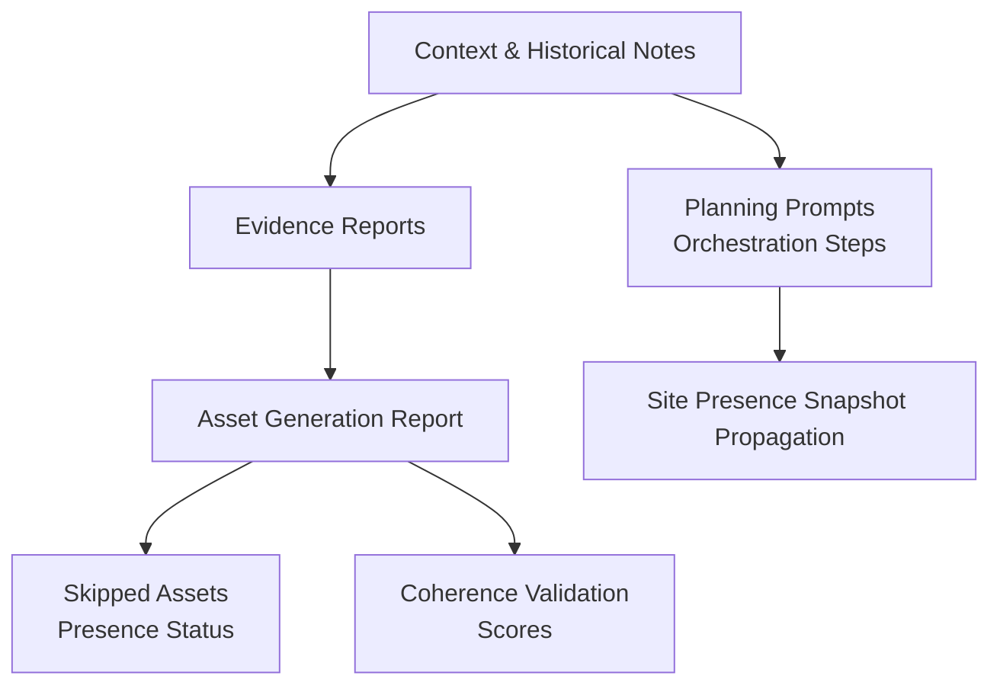
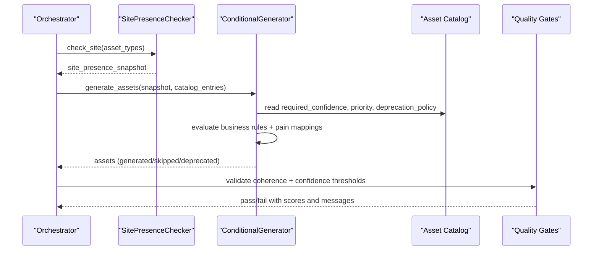
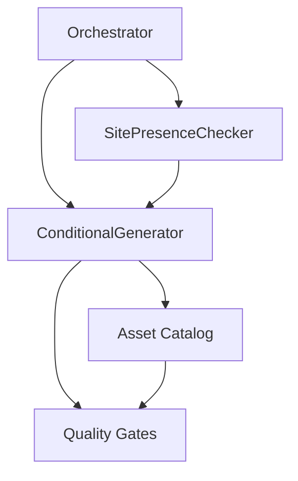

# Asset Generation Engine

<cite>
**Referenced Files in This Document**
- [ZIONE-PROPOSAL-ASSET-ALIGNMENT-BLOCK-2026-07-23.md](file://context/Historico/ZIONE-PROPOSAL-ASSET-ALIGNMENT-BLOCK-2026-07-23.md)
- [DT-1-README-DELIVERY-PRESENT-IN-PRODUCTION.md](file://context/Historico/DT-1-README-DELIVERY-PRESENT-IN-PRODUCTION.md)
- [CONTEXT-DT-4.md](file://context/Historico/CONTEXT-DT-4.md)
- [INVESTIGACION_CONTEXTO.md](file://context/Historico/INVESTIGACION_CONTEXTO.md)
- [05-prompt-inicio-sesion-fase-2.md](file://plans/Archives/DT4-RESIDUAL-FIXES/05-prompt-inicio-sesion-fase-2.md)
- [asset_generation_report.json](file://plans/Archives/DT4-RESIDUAL-FIXES/evidence/FASE-6/asset_generation_report.json)
</cite>

## Table of Contents
1. [Introduction](#introduction)
2. [Project Structure](#project-structure)
3. [Core Components](#core-components)
4. [Architecture Overview](#architecture-overview)
5. [Detailed Component Analysis](#detailed-component-analysis)
6. [Dependency Analysis](#dependency-analysis)
7. [Performance Considerations](#performance-considerations)
8. [Troubleshooting Guide](#troubleshooting-guide)
9. [Conclusion](#conclusion)

## Introduction
This document explains the conditional asset creation system within the Asset Generation Engine. It focuses on how the engine analyzes site presence to decide whether to generate, skip, or mark assets as deprecated; how SitePresenceChecker detects existing elements via HTML scraping and DOM analysis; and how ConditionalGenerator applies business rules, pain point mappings, and production site verification to make decisions for specific asset types such as whatsapp_button, faq_page, optimization_guide, and PDF hooks. It also documents the asset catalog’s required_confidence thresholds, deprecation policies, and generation strategies, and provides concrete examples from the codebase evidence to illustrate common issues and solutions.

## Project Structure
The repository contains extensive context and evidence files that describe the behavior and evolution of the Asset Generation Engine. The key areas relevant to this documentation are:
- Context and historical notes describing design inconsistencies, root causes, and fixes related to asset alignment and confidence scoring.
- Evidence artifacts (JSON reports) showing actual run outcomes, including skipped assets due to presence detection and coherence validation results.
- Planning prompts detailing implementation steps for orchestrating site presence checks and propagating snapshots across components.

[No sources needed since this diagram shows conceptual workflow, not actual code structure]

**Section sources**
- [azion-proposal-asset-alignment-block-2026-07-23.md:144-170](file://context/Historico/ZIONE-PROPOSAL-ASSET-ALIGNMENT-BLOCK-2026-07-23.md#L144-L170)
- [dt-1-readme-delivery-present-in-production.md:144-203](file://context/Historico/DT-1-README-DELIVERY-PRESENT-IN-PRODUCTION.md#L144-L203)
- [context-dt-4.md:312-329](file://context/Historico/CONTEXT-DT-4.md#L312-L329)
- [investigacion-contexto.md:122-162](file://context/Historico/INVESTIGACION_CONTEXTO.md#L122-L162)
- [05-prompt-inicio-sesion-fase-2.md:78-98](file://plans/Archives/DT4-RESIDUAL-FIXES/05-prompt-inicio-sesion-fase-2.md#L78-L98)
- [asset_generation_report.json:249-268](file://plans/Archives/DT4-RESIDUAL-FIXES/evidence/FASE-6/asset_generation_report.json#L249-L268)

## Core Components
- SitePresenceChecker: Detects existing elements on the production site by scraping HTML and analyzing the DOM to determine presence status for targeted assets. It returns a normalized report used across the pipeline.
- ConditionalGenerator: Applies decision logic based on asset type, business rules, pain point mappings, and site presence to decide whether to generate, skip, or mark an asset as deprecated. It computes confidence scores and enforces catalog thresholds.
- Asset Catalog: Defines asset metadata including required_confidence thresholds, priority, deprecation policy, and generation strategy per asset type.

Key behaviors observed in the evidence:
- Skipped assets when presence is detected (e.g., whatsapp_button already exists).
- Confidence scoring influenced by preflight warnings and fallback actions.
- Coherence validation checks relying on confidence metrics computed before site presence data is available.

**Section sources**
- [investigacion-contexto.md:122-162](file://context/Historico/INVESTIGACION_CONTEXTO.md#L122-L162)
- [azion-proposal-asset-alignment-block-2026-07-23.md:144-170](file://context/Historico/ZIONE-PROPOSAL-ASSET-ALIGNMENT-BLOCK-2026-07-23.md#L144-L170)
- [asset_generation_report.json:249-268](file://plans/Archives/DT4-RESIDUAL-FIXES/evidence/FASE-6/asset_generation_report.json#L249-L268)

## Architecture Overview
The conditional asset creation pipeline integrates site presence detection with asset generation decisions. The flow ensures that presence is computed once and propagated to all consumers to avoid redundant checks and inconsistent states.

**Diagram sources**
- [05-prompt-inicio-sesion-fase-2.md:78-98](file://plans/Archives/DT4-RESIDUAL-FIXES/05-prompt-inicio-sesion-fase-2.md#L78-L98)
- [azion-proposal-asset-alignment-block-2026-07-23.md:144-170](file://context/Historico/ZIONE-PROPOSAL-ASSET-ALIGNMENT-BLOCK-2026-07-23.md#L144-L170)
- [asset_generation_report.json:249-268](file://plans/Archives/DT4-RESIDUAL-FIXES/evidence/FASE-6/asset_generation_report.json#L249-L268)

**Section sources**
- [05-prompt-inicio-sesion-fase-2.md:78-98](file://plans/Archives/DT4-RESIDUAL-FIXES/05-prompt-inicio-sesion-fase-2.md#L78-L98)

## Detailed Component Analysis

### SitePresenceChecker
Purpose:
- Scrape production site HTML and analyze DOM to detect presence of specific elements (e.g., WhatsApp button, FAQ page markers, optimization guides).
- Return a normalized presence report indicating existence status per asset type.

Observed behavior:
- Presence detection correctly identifies existing elements (e.g., whatsapp_button present), leading to skipping generation.
- Integration points must ensure presence snapshot is computed early and passed to downstream components to avoid re-execution.

Common issues:
- False negatives if selectors or scraping logic do not match dynamic content or modern frameworks.
- Inconsistent usage where presence is recomputed instead of using the provided snapshot.

Solutions:
- Normalize presence computation at the orchestrator level and propagate the snapshot.
- Enhance selectors and fallback strategies for robustness against DOM variations.

**Section sources**
- [investigacion-contexto.md:122-162](file://context/Historico/INVESTIGACION_CONTEXTO.md#L122-L162)
- [05-prompt-inicio-sesion-fase-2.md:78-98](file://plans/Archives/DT4-RESIDUAL-FIXES/05-prompt-inicio-sesion-fase-2.md#L78-L98)

### ConditionalGenerator Decision Logic
Purpose:
- Decide whether to generate, skip, or mark assets as deprecated based on asset type, business rules, pain point mappings, and site presence.
- Compute confidence scores considering preflight warnings, fallback actions, and catalog thresholds.

Decision matrix highlights:
- whatsapp_button: Skip if presence detected; otherwise generate with confidence determined by preflight and catalog rules.
- faq_page: Generate unless explicitly blocked; confidence affected by required fields quality and fallback actions.
- optimization_guide: Similar to faq_page; confidence impacted by preflight warnings and priority settings.
- PDF hooks: Handled via specialized generators; presence and alignment evaluated similarly.

Business rules and pain mappings:
- Pain points map to assets (e.g., low SEO score maps to optimization_guide).
- Presence overrides generation when assets already exist on the production site.

Confidence calculation:
- Preflight warnings with REQUIRED priority reduce confidence to lower thresholds.
- RECOMMENDED priority with fallback can maintain higher confidence.

**Section sources**
- [azion-proposal-asset-alignment-block-2026-07-23.md:144-170](file://context/Historico/ZIONE-PROPOSAL-ASSET-ALIGNMENT-BLOCK-2026-07-23.md#L144-L170)
- [investigacion-contexto.md:186-223](file://context/Historico/INVESTIGACION_CONTEXTO.md#L186-L223)
- [asset_generation_report.json:249-268](file://plans/Archives/DT4-RESIDUAL-FIXES/evidence/FASE-6/asset_generation_report.json#L249-L268)

### Asset Catalog System
Purpose:
- Define asset metadata including required_confidence thresholds, priority, deprecation policy, and generation strategy.
- Enforce consistency between asset planning and generation.

Key attributes:
- required_confidence: Minimum confidence to proceed with generation.
- priority: REQUIRED vs RECOMMENDED affects confidence scoring under warnings.
- deprecation_policy: Determines handling of outdated or superseded assets.
- promised_by: Maps pain points or conditions that trigger asset generation.

Observed discrepancies:
- Some assets accept lower confidence during generation but fail gates due to stricter thresholds.
- Misalignment between promised services and actual generation behavior (e.g., Open Graph enhancement mode).

**Section sources**
- [investigacion-contexto.md:186-223](file://context/Historico/INVESTIGACION_CONTEXTO.md#L186-L223)
- [azion-proposal-asset-alignment-block-2026-07-23.md:144-170](file://context/Historico/ZIONE-PROPOSAL-ASSET-ALIGNMENT-BLOCK-2026-07-23.md#L144-L170)

### Concrete Examples from Evidence
- Skipped whatsapp_button due to presence detection:
  - asset_generation_report indicates skipped assets with reason “Asset ya implementado en sitio de producción” and presence_status “exists”.
- Coherence validation score for whatsapp_verified reflects insufficient confidence when presence data is not integrated early.
- faq_page and optimization_guide receive confidence 0.5 due to preflight warnings and REQUIRED priority, failing gate threshold of 0.7.

**Section sources**
- [asset_generation_report.json:249-268](file://plans/Archives/DT4-RESIDUAL-FIXES/evidence/FASE-6/asset_generation_report.json#L249-L268)
- [context-dt-4.md:312-329](file://context/Historico/CONTEXT-DT-4.md#L312-L329)
- [investigacion-contexto.md:186-223](file://context/Historico/INVESTIGACION_CONTEXTO.md#L186-L223)

## Dependency Analysis
The conditional asset creation system depends on tight integration between presence detection, asset catalog, and generator logic. Key dependencies include:
- Orchestrator computing and propagating site presence snapshot.
- ConditionalGenerator consuming presence data and catalog entries to make decisions.
- Quality Gates enforcing confidence thresholds and coherence checks.

**Diagram sources**
- [05-prompt-inicio-sesion-fase-2.md:78-98](file://plans/Archives/DT4-RESIDUAL-FIXES/05-prompt-inicio-sesion-fase-2.md#L78-L98)
- [azion-proposal-asset-alignment-block-2026-07-23.md:144-170](file://context/Historico/ZIONE-PROPOSAL-ASSET-ALIGNMENT-BLOCK-2026-07-23.md#L144-L170)

**Section sources**
- [05-prompt-inicio-sesion-fase-2.md:78-98](file://plans/Archives/DT4-RESIDUAL-FIXES/05-prompt-inicio-sesion-fase-2.md#L78-L98)

## Performance Considerations
- Avoid redundant site presence checks by computing once and sharing the snapshot.
- Optimize HTML scraping and DOM analysis to handle large pages and dynamic content efficiently.
- Cache presence results where appropriate to reduce network overhead.
- Ensure confidence calculations are lightweight and avoid unnecessary recomputation.

[No sources needed since this section provides general guidance]

## Troubleshooting Guide
Common issues and resolutions:
- False negatives in presence detection:
  - Verify selectors and scraping logic for dynamic content.
  - Use fallback strategies and normalize presence reporting.
- Confidence score miscalculations:
  - Align preflight warning handling with priority levels.
  - Ensure presence data is integrated before confidence computation.
- Asset alignment problems:
  - Reconcile promised services with actual generation behavior.
  - Implement enhancement modes for assets like Open Graph when tags already exist.

**Section sources**
- [investigacion-contexto.md:122-162](file://context/Historico/INVESTIGACION_CONTEXTO.md#L122-L162)
- [context-dt-4.md:312-329](file://context/Historico/CONTEXT-DT-4.md#L312-L329)
- [azion-proposal-asset-alignment-block-2026-07-23.md:144-170](file://context/Historico/ZIONE-PROPOSAL-ASSET-ALIGNMENT-BLOCK-2026-07-23.md#L144-L170)

## Conclusion
The conditional asset creation system effectively balances site presence detection, business rules, and confidence scoring to produce relevant assets while avoiding redundancy. By ensuring early computation and propagation of presence data, aligning catalog thresholds with gate expectations, and implementing robust presence detection, the system can deliver accurate and efficient asset generation. Addressing identified discrepancies and enhancing enhancement modes will further improve alignment and user experience.

[No sources needed since this section summarizes without analyzing specific files]