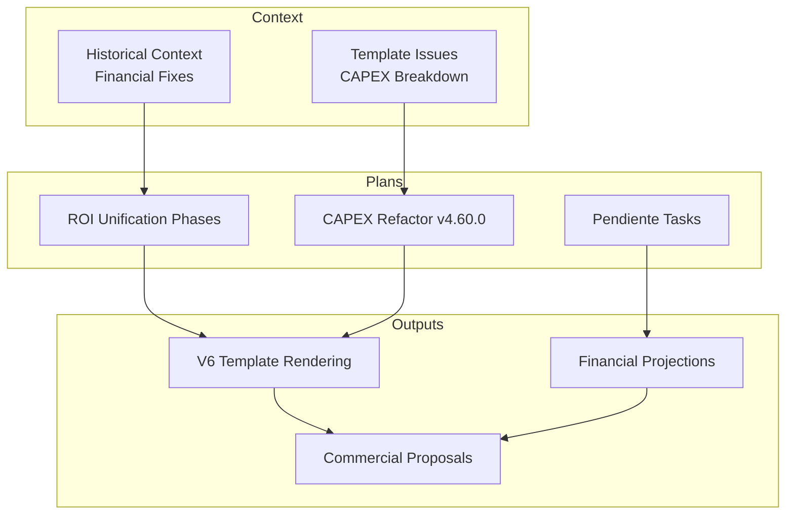
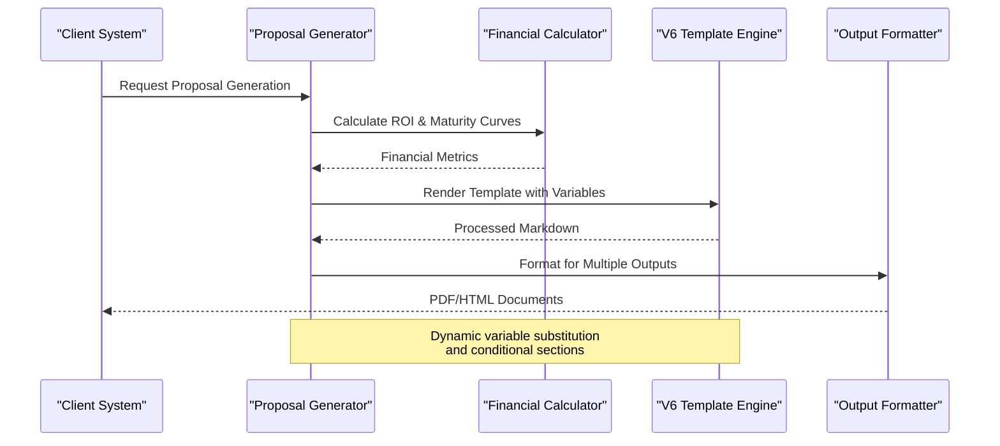
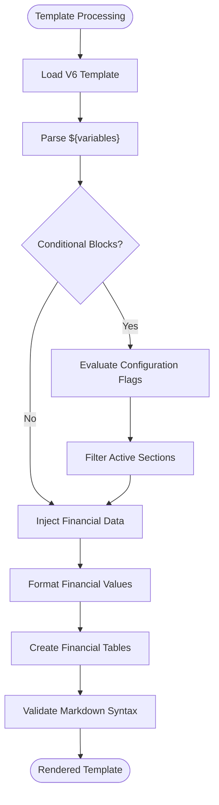
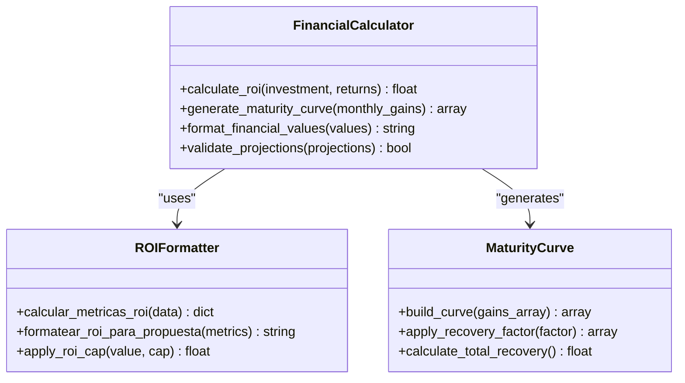
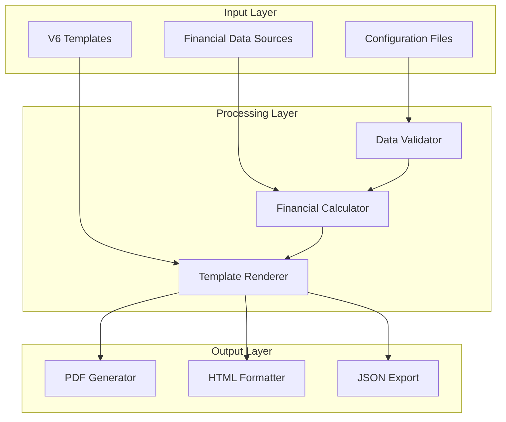

# Commercial Document Generator

<cite>
**Referenced Files in This Document**
- [ROICRIII.md](file://context/Historico/ROICRIII.md)
- [05-prompt-inicio-sesion-fase-1.md](file://plans/Archives/ROICRII/05-prompt-inicio-sesion-fase-1.md)
- [05-prompt-inicio-sesion-fase-2.md](file://plans/Archives/ROICRII/05-prompt-inicio-sesion-fase-2.md)
- [09-documentacion-post-proyecto.md](file://plans/Archives/ROICRII/09-documentacion-post-proyecto.md)
- [REFACTOR-CAPEX-BREAKDOWN-V4.60.0/01-plan-maestro.md](file://plans/Archives/REFACTOR-CAPEX-BREAKDOWN-V4.60.0/01-plan-maestro.md)
- [REFACTOR-PENDIENTE-V4.58.0/05-prompt-inicio-sesion-fase-0.md](file://plans/Archives/REFACTOR-PENDIENTE-V4.58.0/05-prompt-inicio-sesion-fase-0.md)
- [PENDIENTE-IMP-03-CAPEX-BREAKDOWN.md](file://context/Historico/PENDIENTE-IMP-03-CAPEX-BREAKDOWN.md)
- [MODULO-HOOK-PDF.md](file://context/Historico/MODULO-HOOK-PDF.md)
</cite>

## Table of Contents
1. [Introduction](#introduction)
2. [Project Structure](#project-structure)
3. [Core Components](#core-components)
4. [Architecture Overview](#architecture-overview)
5. [Detailed Component Analysis](#detailed-component-analysis)
6. [Dependency Analysis](#dependency-analysis)
7. [Performance Considerations](#performance-considerations)
8. [Troubleshooting Guide](#troubleshooting-guide)
9. [Conclusion](#conclusion)
10. [Appendices](#appendices)

## Introduction
This document explains the Commercial Document Generator focused on the V6 template system and dynamic content injection. It details how financial modeling data—ROI calculations, maturity curves, and CAPEX breakdowns—are processed into professional commercial proposals. The template rendering engine supports markdown templates with dynamic variables, conditional sections, and financial tables. Integration with financial calculators ensures accurate projections, benefit analyses, and investment return metrics. Multi-format output capabilities include PDF generation and web-ready formats, with support for client-specific branding. Common issues such as template syntax errors, financial calculation discrepancies, and formatting inconsistencies are addressed with troubleshooting guidance and best practices.

## Project Structure
The repository contains planning artifacts, historical context, and evidence related to the Commercial Document Generator’s evolution. Key areas include:
- Context documents describing bugs, fixes, and feature enhancements for the V6 template system and financial coherence.
- Plans detailing phases of work for ROI unification, CAPEX breakdown refactoring, and template improvements.
- Evidence files capturing gate reports and financial scenarios used to validate outputs.

**Section sources**
- [ROICRIII.md:304-357](file://context/Historico/ROICRIII.md#L304-L357)
- [REFACTOR-CAPEX-BREAKDOWN-V4.60.0/01-plan-maestro.md:1-27](file://plans/Archives/REFACTOR-CAPEX-BREAKDOWN-V4.60.0/01-plan-maestro.md#L1-L27)
- [REFACTOR-PENDIENTE-V4.58.0/05-prompt-inicio-sesion-fase-0.md:33-72](file://plans/Archives/REFACTOR-PENDIENTE-V4.58.0/05-prompt-inicio-sesion-fase-0.md#L33-L72)

## Core Components
The Commercial Document Generator comprises several core components:
- **V6 Template Engine**: Processes markdown templates with dynamic variables for financial data injection.
- **Financial Calculator Integration**: Computes ROI, maturity curves, and CAPEX breakdowns using unified engines.
- **Proposal Generator**: Orchestrates data preparation, template rendering, and output formatting.
- **Output Formatter**: Supports multiple formats including PDF and web-ready HTML with branding options.

Key implementation patterns include:
- Variable substitution using `${variable_name}` syntax in templates.
- Conditional section rendering based on configuration flags.
- Financial table generation with consistent formatting across outputs.

**Section sources**
- [ROICRIII.md:504-548](file://context/Historico/ROICRIII.md#L504-L548)
- [09-documentacion-post-proyecto.md:1-28](file://plans/Archives/ROICRII/09-documentacion-post-proyecto.md#L1-L28)

## Architecture Overview
The generator follows a modular architecture where financial data flows through calculators into template rendering engines.

**Diagram sources**
- [ROICRIII.md:304-357](file://context/Historico/ROICRIII.md#L304-L357)
- [05-prompt-inicio-sesion-fase-1.md:1-118](file://plans/Archives/ROICRII/05-prompt-inicio-sesion-fase-1.md#L1-L118)

## Detailed Component Analysis

### V6 Template System
The V6 template system uses markdown-based templates with sophisticated variable substitution and conditional logic.

#### Template Structure
Templates define sections for different proposal components:
- Executive Summary with dynamic company information
- Financial Projections with monthly breakdowns
- CAPEX/OPEX analysis with detailed cost breakdowns
- ROI calculations with standardized formatting

#### Variable Substitution Patterns
The system supports various placeholder formats:
- Simple variables: `${roi_saas}`, `${total_investment}`
- Formatted numbers: Currency values with proper decimal places
- Conditional blocks: Sections that render based on configuration
- Table rows: Dynamic generation of financial table entries

**Diagram sources**
- [ROICRIII.md:304-357](file://context/Historico/ROICRIII.md#L304-L357)
- [REFACTOR-CAPEX-BREAKDOWN-V4.60.0/01-plan-maestro.md:1-27](file://plans/Archives/REFACTOR-CAPEX-BREAKDOWN-V4.60.0/01-plan-maestro.md#L1-L27)

**Section sources**
- [ROICRIII.md:304-357](file://context/Historico/ROICRIII.md#L304-L357)

### Financial Calculator Integration
The generator integrates with financial calculators to ensure accurate projections and consistent ROI calculations.

#### ROI Calculation Engine
A unified ROI formatter provides consistent calculations across all proposal types:
- Standardized ROI formulas with proper decimal precision
- Support for different business models (SaaS, project-based, etc.)
- Configurable caps and thresholds for realistic projections

#### Maturity Curve Processing
Maturity curves model the gradual realization of benefits over time:
- Monthly progression from initial investment to full benefit realization
- Conservative recovery factors applied to projected gains
- Integration with pain point analysis for prioritized investments

**Diagram sources**
- [05-prompt-inicio-sesion-fase-1.md:1-118](file://plans/Archives/ROICRII/05-prompt-inicio-sesion-fase-1.md#L1-L118)
- [09-documentacion-post-proyecto.md:1-28](file://plans/Archives/ROICRII/09-documentacion-post-proyecto.md#L1-L28)

**Section sources**
- [05-prompt-inicio-sesion-fase-1.md:1-118](file://plans/Archives/ROICRII/05-prompt-inicio-sesion-fase-1.md#L1-L118)
- [09-documentacion-post-proyecto.md:1-28](file://plans/Archives/ROICRII/09-documentacion-post-proyecto.md#L1-L28)

### CAPEX Breakdown System
The CAPEX breakdown system provides detailed cost analysis for capital expenditures.

#### Cost Category Management
The system organizes costs into logical categories:
- Infrastructure costs (hardware, software licenses)
- Implementation costs (setup, configuration, training)
- Ongoing operational costs (maintenance, support)

#### Template Integration
CAPEX data is seamlessly integrated into proposal templates:
- Dynamic table generation with proper markdown formatting
- Consistent currency formatting across all cost items
- Conditional display based on client requirements

**Section sources**
- [REFACTOR-CAPEX-BREAKDOWN-V4.60.0/01-plan-maestro.md:1-27](file://plans/Archives/REFACTOR-CAPEX-BREAKDOWN-V4.60.0/01-plan-maestro.md#L1-L27)
- [PENDIENTE-IMP-03-CAPEX-BREAKDOWN.md](file://context/Historico/PENDIENTE-IMP-03-CAPEX-BREAKDOWN.md)

## Dependency Analysis
The generator has well-defined dependencies between components that ensure data consistency and processing reliability.

**Diagram sources**
- [REFACTOR-PENDIENTE-V4.58.0/05-prompt-inicio-sesion-fase-0.md:33-72](file://plans/Archives/REFACTOR-PENDIENTE-V4.58.0/05-prompt-inicio-sesion-fase-0.md#L33-L72)

**Section sources**
- [REFACTOR-PENDIENTE-V4.58.0/05-prompt-inicio-sesion-fase-0.md:33-72](file://plans/Archives/REFACTOR-PENDIENTE-V4.58.0/05-prompt-inicio-sesion-fase-0.md#L33-L72)

## Performance Considerations
The generator is optimized for performance through several strategies:
- **Lazy Loading**: Templates and configurations are loaded only when needed
- **Caching**: Financial calculations are cached to avoid redundant computations
- **Streaming**: Large documents are generated in chunks to minimize memory usage
- **Parallel Processing**: Independent calculations run concurrently where possible

Memory optimization techniques include:
- Efficient data structures for financial arrays
- Garbage collection triggers for large template renders
- Streaming output for PDF generation to handle large documents

## Troubleshooting Guide
Common issues and their solutions:

### Template Syntax Errors
**Problem**: Invalid markdown syntax causing rendering failures
**Solution**: 
- Validate template syntax before deployment
- Use linting tools to check markdown structure
- Test variable substitution with sample data

### Financial Calculation Discrepancies
**Problem**: Inconsistent ROI calculations across different proposal types
**Solution**:
- Ensure unified ROI formatter is used consistently
- Verify input data validation and normalization
- Cross-check calculations against known benchmarks

### Formatting Inconsistencies
**Problem**: Different number or currency formatting across outputs
**Solution**:
- Centralize formatting functions in shared utilities
- Implement consistent locale settings
- Add automated formatting validation tests

### PDF Generation Issues
**Problem**: PDF rendering failures or poor quality output
**Solution**:
- Verify PDF library compatibility
- Test with various template complexities
- Monitor memory usage during large document generation

**Section sources**
- [MODULO-HOOK-PDF.md](file://context/Historico/MODULO-HOOK-PDF.md)

## Conclusion
The Commercial Document Generator provides a robust, flexible system for creating professional commercial proposals with accurate financial modeling. The V6 template system enables dynamic content injection while maintaining consistency across outputs. Integration with financial calculators ensures reliable ROI calculations and projections. The modular architecture supports easy maintenance and extension while providing multi-format output capabilities for diverse client needs.

## Appendices

### Template Variable Reference
Common variables used in V6 templates:
- Financial metrics: `roi_saas`, `total_investment`, `monthly_gain`
- Projection data: `rec_m1` through `rec_m6` for monthly recoveries
- Configuration flags: `pilot_options`, `garantia_dia_55`
- Branding elements: Company logos, colors, and contact information

### Best Practices
- Always validate financial inputs before template rendering
- Use consistent decimal precision for monetary values
- Test templates with edge cases and boundary conditions
- Maintain backward compatibility when updating templates
- Document all new variables and their expected formats