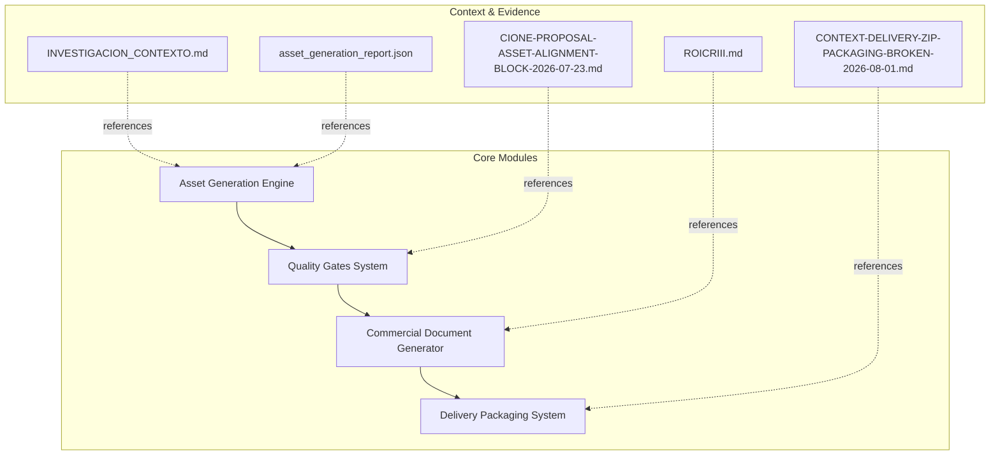
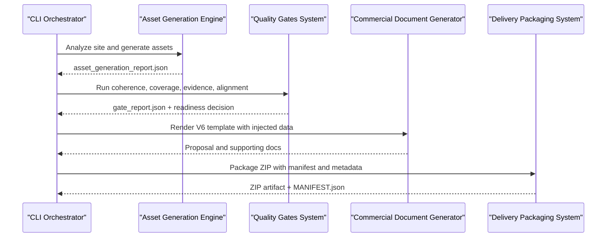
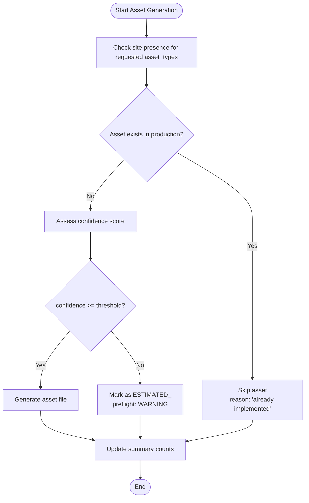
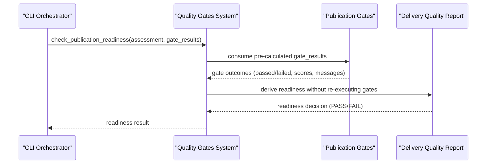
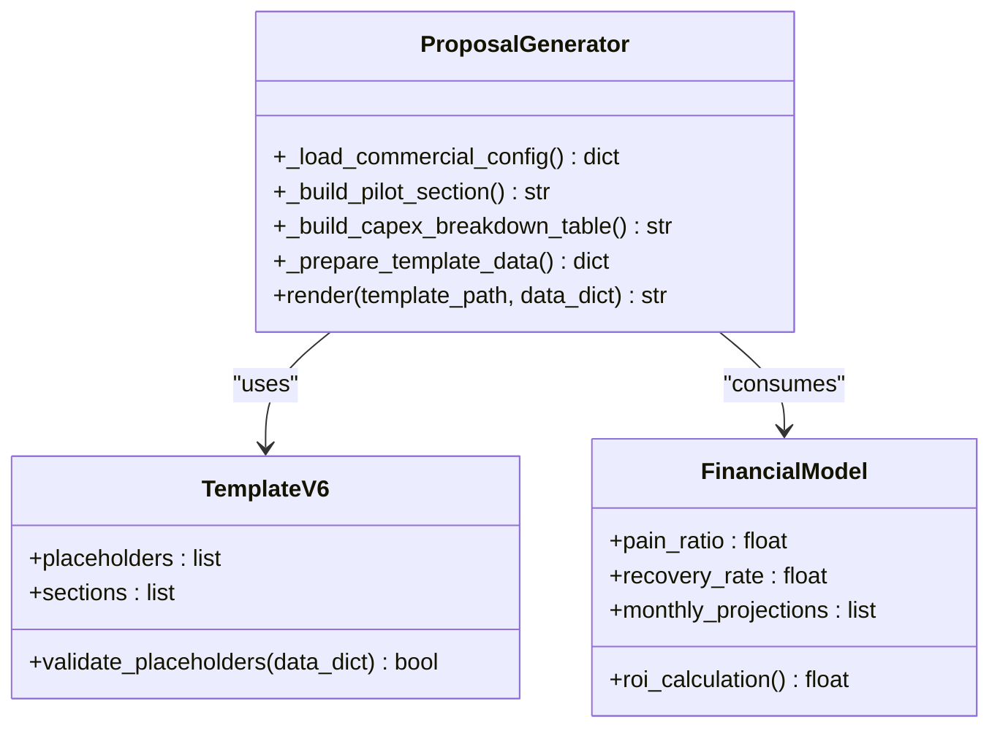
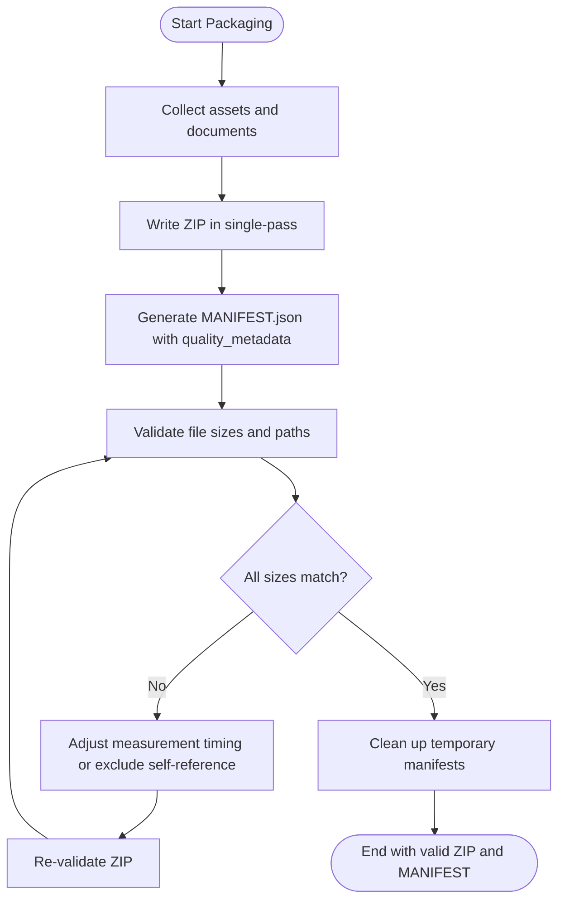
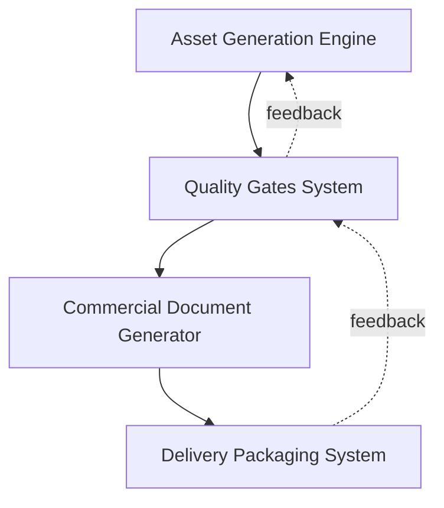

# Core Modules Documentation

<cite>
**Referenced Files in This Document**
- [INVESTIGACION_CONTEXTO.md](file://context/Historico/INVESTIGACION_CONTEXTO.md)
- [DT-1-README-DELIVERY-PRESENT-IN-PRODUCTION.md](file://context/Historico/DT-1-README-DELIVERY-PRESENT-IN-PRODUCTION.md)
- [CONTEXT-DELIVERY-ZIP-PACKAGING-BROKEN-2026-08-01.md](file://context/CONTEXT-DELIVERY-ZIP-PACKAGING-BROKEN-2026-08-01.md)
- [asset_generation_report.json](file://plans/Archives/DT4-RESIDUAL-FIXES/evidence/FASE-6/asset_generation_report.json)
- [ZIONE-PROPOSAL-ASSET-ALIGNMENT-BLOCK-2026-07-23.md](file://context/Historico/ZIONE-PROPOSAL-ASSET-ALIGNMENT-BLOCK-2026-07-23.md)
- [ROICRIII.md](file://context/Historico/ROICRIII.md)
- [05-prompt-inicio-sesion-fase-3.md](file://plans/Archives/DT4-RESIDUAL-FIXES/05-prompt-inicio-sesion-fase-3.md)
- [05-prompt-inicio-sesion-fase-5.md](file://plans/Archives/DT4-RESIDUAL-FIXES/05-prompt-inicio-sesion-fase-5.md)
- [02-prompt-fase-1.md](file://plans/Archives/ASSET-ALIGNMENT-ZIONE-2026-07-23/02-prompt-fase-1.md)
</cite>

## Table of Contents
1. Introduction
2. Project Structure
3. Core Components
4. Architecture Overview
5. Detailed Component Analysis
6. Dependency Analysis
7. Performance Considerations
8. Troubleshooting Guide
9. Conclusion

## Introduction
This document provides a comprehensive, code-grounded overview of the four core modules of the iah-cli system:
- Asset Generation Engine
- Quality Gates System
- Commercial Document Generator
- Delivery Packaging System

It explains how each module works, its configuration and parameters, return values, integration points, error handling, and common issues with solutions. Concrete examples are referenced from the repository’s context and evidence files to ensure traceability.

## Project Structure
The repository is organized around plans and context artifacts that capture implementation details, test results, and post-analysis notes for each module. The core modules are implemented under Python modules (e.g., asset generation, quality gates, commercial documents, delivery packaging), while the .opencode directory contains contextual documentation and evidence used to validate behavior and diagnose issues.

[No sources needed since this diagram shows conceptual workflow, not actual code structure]

## Core Components
This section summarizes the four primary components and their responsibilities:
- Asset Generation Engine: Creates site-specific assets conditionally based on presence checks and analysis results. Supports WhatsApp buttons, FAQ pages, optimization guides, and PDF hooks.
- Quality Gates System: Multi-layered validation including coherence scoring, alignment checking, coverage, evidence verification, and publication readiness criteria.
- Commercial Document Generator: Uses V6 templates with dynamic content injection for financial modeling and ROI calculations.
- Delivery Packaging System: Produces ZIP packages with manifest generation, quality metadata enrichment, and integrity validation.

**Section sources**
- [INVESTIGACION_CONTEXTO.md:122-162](file://context/Historico/INVESTIGACION_CONTEXTO.md#L122-L162)
- [CONTEXT-DELIVERY-ZIP-PACKAGING-BROKEN-2026-08-01.md:19-484](file://context/CONTEXT-DELIVERY-ZIP-PACKAGING-BROKEN-2026-08-01.md#L19-L484)
- [ROICRIII.md:304-548](file://context/Historico/ROICRIII.md#L304-L548)

## Architecture Overview
The iah-cli pipeline orchestrates asset generation, gate validation, document generation, and packaging into a cohesive delivery flow. Each stage produces artifacts consumed by subsequent stages.

**Diagram sources**
- [INVESTIGACION_CONTEXTO.md:122-162](file://context/Historico/INVESTIGACION_CONTEXTO.md#L122-L162)
- [CONTEXT-DELIVERY-ZIP-PACKAGING-BROKEN-2026-08-01.md:19-484](file://context/CONTEXT-DELIVERY-ZIP-PACKAGING-BROKEN-2026-08-01.md#L19-L484)
- [ROICRIII.md:304-548](file://context/Historico/ROICRIII.md#L304-L548)

## Detailed Component Analysis

### Asset Generation Engine
Responsibilities:
- Site presence detection and conditional asset creation.
- Support for WhatsApp buttons, FAQ pages, optimization guides, and PDF hooks.
- Confidence scoring per asset type; skipping assets already present in production.

Key behaviors:
- Presence checks determine whether an asset should be generated or skipped.
- Assets marked ESTIMATED_ when confidence is below threshold (e.g., 0.5).
- Reports include skipped assets with reasons and presence status.

Configuration and parameters:
- Input: site URL, asset_types list (e.g., whatsapp_button, faq_page, optimization_guide, pdf_hook).
- Output: structured report with summary counts, generated assets, skipped assets, and site verification flags.

Return values:
- Summary: total_assets, generated, failed, skipped, can_use, delivery_ready_percentage, site_verification_applied.
- Skipped assets: asset_type, reason, presence_status, site_verified, pain_ids_affected.

Examples from codebase:
- Presence checker usage and expected “exists” status for WhatsApp button.
- Asset generation report showing skipped assets due to presence in production.

Error conditions:
- Low confidence assets flagged as ESTIMATED_ with WARNING preflight status.
- Alignment below thresholds triggers warnings in gate reports.

Integration patterns:
- Consumed by Quality Gates System for alignment and coherence checks.
- Feeds Delivery Packaging System with generated assets and reports.

Common issues and solutions:
- Confidence score mismatches: Ensure asset types have sufficient signal; consider relaxing thresholds or improving input data.
- Asset alignment problems: Validate presence checks and alignment metrics; adjust thresholds if necessary.

**Section sources**
- [INVESTIGACION_CONTEXTO.md:122-162](file://context/Historico/INVESTIGACION_CONTEXTO.md#L122-L162)
- [DT-1-README-DELIVERY-PRESENT-IN-PRODUCTION.md:144-203](file://context/Historico/DT-1-README-DELIVERY-PRESENT-IN-PRODUCTION.md#L144-L203)
- [asset_generation_report.json:249-268](file://plans/Archives/DT4-RESIDUAL-FIXES/evidence/FASE-6/asset_generation_report.json#L249-L268)

#### Flowchart: Conditional Asset Creation

**Diagram sources**
- [INVESTIGACION_CONTEXTO.md:122-162](file://context/Historico/INVESTIGACION_CONTEXTO.md#L122-L162)
- [DT-1-README-DELIVERY-PRESENT-IN-PRODUCTION.md:144-203](file://context/Historico/DT-1-README-DELIVERY-PRESENT-IN-PRODUCTION.md#L144-L203)

### Quality Gates System
Responsibilities:
- Multi-layered validation: coherence scoring, coverage, evidence tier, alignment, and commercial gates.
- Publication readiness determination based on gate results.
- Idempotent execution without mutating assessment objects.

Key behaviors:
- Coherence scoring uses final_coherence_report as single source of truth.
- Alignment checking ensures assets match proposal promises; misalignment blocks delivery.
- Evidence tier consistency validates claims against configured analytics tools.

Configuration and parameters:
- Gate definitions and thresholds (coherence, coverage, evidence, alignment).
- Blocking gates list determines pass/fail decisions.
- Readiness function accepts pre-calculated gate_results to avoid re-execution.

Return values:
- Gate report with passed/failed gates, scores, messages, errors, warnings, timestamp, version.
- Readiness decision derived from gate_results without re-running gates.

Examples from codebase:
- Misaligned asset alignment causing BLOCKED status in publication gates.
- Fixed key mismatch ensuring real gate results are consumed by delivery quality report.

Error conditions:
- False confidence tiers leading to internal contradictions.
- Hardcoded defaults bypassing real gate outcomes.

Integration patterns:
- Consumes asset generation reports and feeds commercial document generator with validated assessments.
- Influences delivery packaging by blocking ZIP creation when readiness fails.

Common issues and solutions:
- Confidence score mismatches: Align evidence tier with actual analytics configuration; add consistency gate.
- Alignment problems: Use canonical alignment DTO; unify reporting across publication gates and delivery quality report.
- Gate idempotency: Ensure single execution and zero mutations to assessment.

**Section sources**
- [CIONE-PROPOSAL-ASSET-ALIGNMENT-BLOCK-2026-07-23.md:540-571](file://context/Historico/ZIONE-PROPOSAL-ASSET-ALIGNMENT-BLOCK-2026-07-23.md#L540-L571)
- [02-prompt-fase-1.md:28-61](file://plans/Archives/ASSET-ALIGNMENT-ZIONE-2026-07-23/02-prompt-fase-1.md#L28-L61)
- [05-prompt-inicio-sesion-fase-3.md:85-116](file://plans/Archives/DT4-RESIDUAL-FIXES/05-prompt-inicio-sesion-fase-3.md#L85-L116)
- [05-prompt-inicio-sesion-fase-5.md:65-103](file://plans/Archives/DT4-RESIDUAL-FIXES/05-prompt-inicio-sesion-fase-5.md#L65-L103)

#### Sequence Diagram: Publication Readiness

**Diagram sources**
- [05-prompt-inicio-sesion-fase-5.md:65-103](file://plans/Archives/DT4-RESIDUAL-FIXES/05-prompt-inicio-sesion-fase-5.md#L65-L103)
- [02-prompt-fase-1.md:28-61](file://plans/Archives/ASSET-ALIGNMENT-ZIONE-2026-07-23/02-prompt-fase-1.md#L28-L61)

### Commercial Document Generator
Responsibilities:
- Renders V6 templates with dynamic content injection for financial modeling and ROI calculations.
- Builds sections such as pilot options, CAPEX breakdown, and guarantees tied to KPIs.
- Ensures financial projections align with maturity curves and recovery rates.

Key behaviors:
- Template-driven generation using placeholders populated from commercial configuration.
- Financial modeling integrates pain ratios, recovery percentages, and monthly projections.
- Pilot sections offer conditional validation before commitment.

Configuration and parameters:
- Template path (e.g., propuesta_v6_template.md).
- Commercial config including pilot options, pricing, deliverables, and continuity conditions.
- Data dict includes capex_breakdown_detalle, roi_saas, and other financial fields.

Return values:
- Generated markdown documents with embedded financial tables and narrative sections.
- Consistent formatting and traceability notes linking back to underlying data sources.

Examples from codebase:
- Template modifications to remove redundant totals and unify ROI display.
- Adding pilot section builder and guarantee fields to template data.

Error conditions:
- Missing template variables cause rendering failures.
- Inconsistent financial inputs lead to contradictory projections.

Integration patterns:
- Consumes validated assessments from Quality Gates System.
- Outputs documents packaged by Delivery Packaging System.

Common issues and solutions:
- Redundant totals: Remove duplicate bullets and rely on maturity curve totals.
- Placeholder mismatches: Ensure all required keys exist in data dict before rendering.

**Section sources**
- [ROICRIII.md:304-548](file://context/Historico/ROICRIII.md#L304-L548)

#### Class Diagram: Template Rendering

**Diagram sources**
- [ROICRIII.md:304-548](file://context/Historico/ROICRIII.md#L304-L548)

### Delivery Packaging System
Responsibilities:
- Packages generated assets and documents into a ZIP archive.
- Generates MANIFEST.json with quality metadata enrichment and integrity validation.
- Ensures README coherence and correct file size declarations.

Key behaviors:
- Single-write architecture to prevent timing-related size mismatches.
- Manifest auto-references resolved via fixed iteration or exclusion strategies.
- Validation enforces exact file sizes and path consistency.

Configuration and parameters:
- Input paths for assets, documents, and reports.
- Output directory for ZIP and manifest artifacts.
- Quality metadata fields (evidence_tier, precision_tier, ga4_configured, gsc_configured, coherence_score, contradictions_detected).

Return values:
- ZIP file path and MANIFEST.json contents with file entries, total_files, total_size_bytes, and quality_metadata.

Examples from codebase:
- ZIP packaging failure due to validation errors in _validate_zip().
- README size discrepancies causing manifest inconsistencies.

Error conditions:
- Multi-pass manifest generation leads to circular self-reference issues.
- Silent catch blocks mask packaging failures.

Integration patterns:
- Consumes outputs from Asset Generation Engine and Commercial Document Generator.
- Blocks delivery if quality gates indicate unreadiness.

Common issues and solutions:
- ZIP never materializes: Implement single-write approach and fix validation logic.
- Manifest accumulation: Clean up previous manifests at start of execution.
- README size mismatch: Measure after final write and exclude self-reference during validation.

**Section sources**
- [CONTEXT-DELIVERY-ZIP-PACKAGING-BROKEN-2026-08-01.md:19-484](file://context/CONTEXT-DELIVERY-ZIP-PACKAGING-BROKEN-2026-08-01.md#L19-L484)

#### Flowchart: ZIP Packaging and Validation

**Diagram sources**
- [CONTEXT-DELIVERY-ZIP-PACKAGING-BROKEN-2026-08-01.md:19-484](file://context/CONTEXT-DELIVERY-ZIP-PACKAGING-BROKEN-2026-08-01.md#L19-L484)

## Dependency Analysis
The modules depend on each other in a linear pipeline with feedback loops for validation and packaging.

**Diagram sources**
- [INVESTIGACION_CONTEXTO.md:122-162](file://context/Historico/INVESTIGACION_CONTEXTO.md#L122-L162)
- [CONTEXT-DELIVERY-ZIP-PACKAGING-BROKEN-2026-08-01.md:19-484](file://context/CONTEXT-DELIVERY-ZIP-PACKAGING-BROKEN-2026-08-01.md#L19-L484)

**Section sources**
- [INVESTIGACION_CONTEXTO.md:122-162](file://context/Historico/INVESTIGACION_CONTEXTO.md#L122-L162)
- [CONTEXT-DELIVERY-ZIP-PACKAGING-BROKEN-2026-08-01.md:19-484](file://context/CONTEXT-DELIVERY-ZIP-PACKAGING-BROKEN-2026-08-01.md#L19-L484)

## Performance Considerations
- Asset generation should minimize network calls for presence checks; cache results where possible.
- Quality gates should execute once and reuse results to avoid redundant computations.
- Commercial document generation benefits from templating engines that support lazy evaluation.
- Delivery packaging should use single-pass writes to reduce I/O overhead and prevent size mismatches.

[No sources needed since this section provides general guidance]

## Troubleshooting Guide
Common issues and resolutions:
- Confidence score mismatches: Review asset confidence thresholds and input data quality; adjust thresholds or improve signals.
- Asset alignment problems: Ensure canonical alignment DTO is used consistently across publication gates and delivery quality report.
- Delivery packaging failures: Implement single-write architecture, fix validation logic, and clean up temporary manifests.

**Section sources**
- [INVESTIGACION_CONTEXTO.md:122-162](file://context/Historico/INVESTIGACION_CONTEXTO.md#L122-L162)
- [CONTEXT-DELIVERY-ZIP-PACKAGING-BROKEN-2026-08-01.md:19-484](file://context/CONTEXT-DELIVERY-ZIP-PACKAGING-BROKEN-2026-08-01.md#L19-L484)
- [CIONE-PROPOSAL-ASSET-ALIGNMENT-BLOCK-2026-07-23.md:540-571](file://context/Historico/ZIONE-PROPOSAL-ASSET-ALIGNMENT-BLOCK-2026-07-23.md#L540-L571)

## Conclusion
The iah-cli system integrates four core modules to produce validated, packaged deliverables. By addressing confidence scoring, alignment consistency, template rendering accuracy, and packaging integrity, the system ensures reliable output. Continuous improvements in validation, idempotency, and single-pass operations enhance robustness and performance.

[No sources needed since this section summarizes without analyzing specific files]