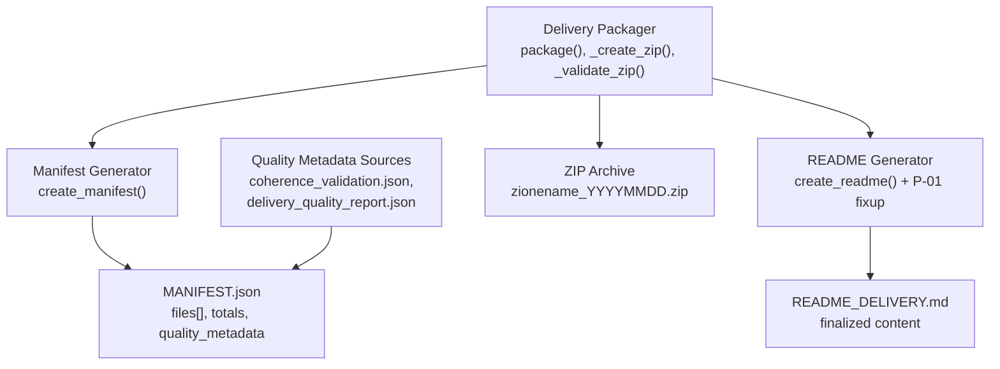
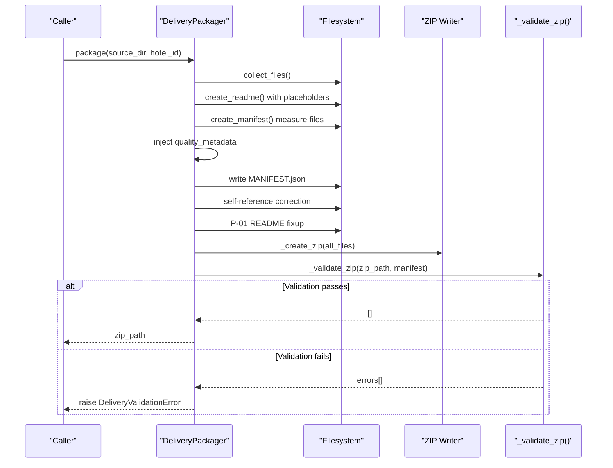
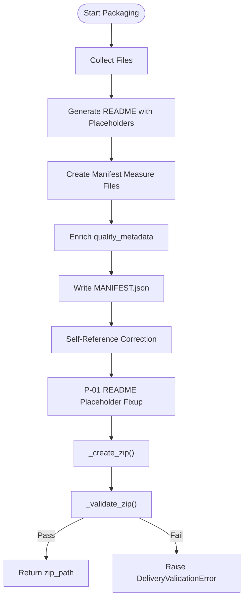
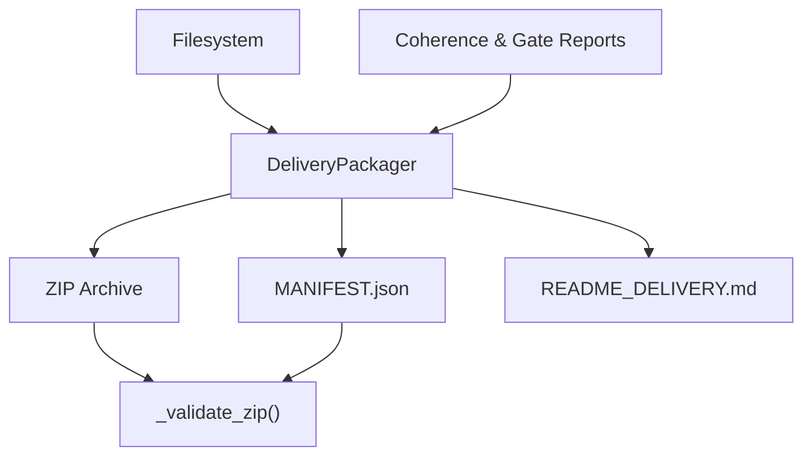

# Delivery Packaging System

<cite>
**Referenced Files in This Document**
- [CONTEXT-DELIVERY-ZIP-PACKAGING-BROKEN-2026-08-01.md](file://context/CONTEXT-DELIVERY-ZIP-PACKAGING-BROKEN-2026-08-01.md)
- [03-prompt-fase-B.md](file://plans/Archives/DT-1-DELIVERY-CONTRACT-2026-07-23/03-prompt-fase-B.md)
- [05-prompt-fase-D.md](file://plans/Archives/DT-1-DELIVERY-CONTRACT-2026-07-23/05-prompt-fase-D.md)
- [delivery_quality_report.json](file://plans/Archives/DT-3-TECH-DEBT-2026-07-25/evidence/delivery_quality_report.json)
- [coherence_validation.json](file://plans/Archives/DT-4-ROOT-CAUSE-2026-07-25/evidence/coherence_validation.json)
- [zione_20260731_MANIFEST.json](file://plans/Archives/EVIDENCE-TIER-FALSE-CONFIDENCE-IAO-2026-07-31/evidence/FASE-5/zione/zione_20260731_MANIFEST.json)
</cite>

## Table of Contents
1. [Introduction](#introduction)
2. [Project Structure](#project-structure)
3. [Core Components](#core-components)
4. [Architecture Overview](#architecture-overview)
5. [Detailed Component Analysis](#detailed-component-analysis)
6. [Dependency Analysis](#dependency-analysis)
7. [Performance Considerations](#performance-considerations)
8. [Troubleshooting Guide](#troubleshooting-guide)
9. [Conclusion](#conclusion)
10. [Appendices](#appendices)

## Introduction
This document explains the Delivery Packaging System that packages validated deliverables into distribution-ready ZIP archives, generates structured JSON manifests describing package contents and versioning, and enriches artifacts with quality metadata such as coherence scores and alignment results. It also documents integrity validation mechanisms ensuring completeness and consistency between the manifest and the packaged archive, and provides diagnostic procedures for common packaging failures, manifest corruption, metadata inconsistencies, and delivery validation errors.

## Project Structure
The delivery packaging system is implemented across several modules and plans:
- Packaging orchestration and ZIP creation/validation are defined in the delivery packager module and related prompts.
- Manifest generation and structure are evidenced by generated MANIFEST files.
- Quality metadata enrichment integrates coherence and gate reports into the final package.

**Diagram sources**
- [03-prompt-fase-B.md](file://plans/Archives/DT-1-DELIVERY-CONTRACT-2026-07-23/03-prompt-fase-B.md)
- [05-prompt-fase-D.md](file://plans/Archives/DT-1-DELIVERY-CONTRACT-2026-07-23/05-prompt-fase-D.md)
- [delivery_quality_report.json](file://plans/Archives/DT-3-TECH-DEBT-2026-07-25/evidence/delivery_quality_report.json)
- [coherence_validation.json](file://plans/Archives/DT-4-ROOT-CAUSE-2026-07-25/evidence/coherence_validation.json)
- [zione_20260731_MANIFEST.json](file://plans/Archives/EVIDENCE-TIER-FALSE-CONFIDENCE-IAO-2026-07-31/evidence/FASE-5/zione/zione_20260731_MANIFEST.json)

**Section sources**
- [CONTEXT-DELIVERY-ZIP-PACKAGING-BROKEN-2026-08-01.md](file://context/CONTEXT-DELIVERY-ZIP-PACKAGING-BROKEN-2026-08-01.md)

## Core Components
- DeliveryPackager.package(): Orchestrates file collection, README generation, manifest creation, quality metadata enrichment, ZIP creation, and validation.
- create_manifest(): Builds a structured manifest listing all files with exact sizes, totals, and types; includes self-reference handling for MANIFEST.json.
- create_readme() and P-01 fixup: Generates README with placeholders and replaces them with final totals; must be ordered to avoid size mismatches.
- _create_zip(): Packages all finalized files into a ZIP archive using POSIX paths.
- _validate_zip(): Performs strict integrity checks comparing manifest entries and sizes against the actual ZIP contents.

Key responsibilities:
- Ensure immutable measurement-to-packaging ordering to prevent size drift.
- Enforce POSIX path normalization across ZIP and manifest.
- Inject quality metadata (evidence tier, precision tier, coherence score, onboarding flags).
- Guarantee manifest self-consistency including total_files and total_size_bytes.

**Section sources**
- [03-prompt-fase-B.md](file://plans/Archives/DT-1-DELIVERY-CONTRACT-2026-07-23/03-prompt-fase-B.md)
- [05-prompt-fase-D.md](file://plans/Archives/DT-1-DELIVERY-CONTRACT-2026-07-23/05-prompt-fase-D.md)
- [CONTEXT-DELIVERY-ZIP-PACKAGING-BROKEN-2026-08-01.md](file://context/CONTEXT-DELIVERY-ZIP-PACKAGING-BROKEN-2026-08-01.md)

## Architecture Overview
The packaging pipeline follows a deterministic sequence:
1. Collect files from source directories.
2. Generate README with placeholders.
3. Create manifest measuring files on disk.
4. Enrich quality metadata from coherence and gate reports.
5. Write MANIFEST to disk.
6. Perform self-reference correction for MANIFEST.json entry.
7. Apply README placeholder fixup (P-01).
8. Create ZIP archive.
9. Validate ZIP vs manifest with exact match rules.
10. On success, clean up temporary artifacts; on failure, raise an error and remove invalid outputs.

**Diagram sources**
- [03-prompt-fase-B.md](file://plans/Archives/DT-1-DELIVERY-CONTRACT-2026-07-23/03-prompt-fase-B.md)
- [05-prompt-fase-D.md](file://plans/Archives/DT-1-DELIVERY-CONTRACT-2026-07-23/05-prompt-fase-D.md)
- [CONTEXT-DELIVERY-ZIP-PACKAGING-BROKEN-2026-08-01.md](file://context/CONTEXT-DELIVERY-ZIP-PACKAGING-BROKEN-2026-08-01.md)

## Detailed Component Analysis

### ZIP Packaging Flow
- File collection normalizes paths to POSIX format to ensure cross-platform compatibility.
- README generation uses placeholders for dynamic totals; P-01 fixup replaces placeholders after totals are known.
- ZIP creation reads finalized files from disk and writes them into the archive.
- Integrity validation compares each file’s declared size in the manifest with its actual size in the ZIP, enforcing exact matches without tolerance.

**Diagram sources**
- [03-prompt-fase-B.md](file://plans/Archives/DT-1-DELIVERY-CONTRACT-2026-07-23/03-prompt-fase-B.md)
- [05-prompt-fase-D.md](file://plans/Archives/DT-1-DELIVERY-CONTRACT-2026-07-23/05-prompt-fase-D.md)
- [CONTEXT-DELIVERY-ZIP-PACKAGING-BROKEN-2026-08-01.md](file://context/CONTEXT-DELIVERY-ZIP-PACKAGING-BROKEN-2026-08-01.md)

**Section sources**
- [03-prompt-fase-B.md](file://plans/Archives/DT-1-DELIVERY-CONTRACT-2026-07-23/03-prompt-fase-B.md)
- [05-prompt-fase-D.md](file://plans/Archives/DT-1-DELIVERY-CONTRACT-2026-07-23/05-prompt-fase-D.md)
- [CONTEXT-DELIVERY-ZIP-PACKAGING-BROKEN-2026-08-01.md](file://context/CONTEXT-DELIVERY-ZIP-PACKAGING-BROKEN-2026-08-01.md)

### Manifest Generation Process
- The manifest lists every file with name, size_bytes, and type.
- Totals include total_files and total_size_bytes computed from the file list.
- Self-reference for MANIFEST.json is handled via iterative convergence to stabilize size declarations.
- Quality metadata fields are injected into the manifest root or per-file entries depending on schema requirements.

Example manifest structure (from evidence):
- Top-level keys: version, hotel_id, generated_at, package_type, files, total_files, total_size_bytes, quality_metadata.
- Each file entry: name, size_bytes, type.

**Section sources**
- [03-prompt-fase-B.md](file://plans/Archives/DT-1-DELIVERY-CONTRACT-2026-07-23/03-prompt-fase-B.md)
- [zione_20260731_MANIFEST.json](file://plans/Archives/EVIDENCE-TIER-FALSE-CONFIDENCE-IAO-2026-07-31/evidence/FASE-5/zione/zione_20260731_MANIFEST.json)

### Quality Metadata Enrichment
- Coherence scores and alignment percentages are sourced from coherence_validation.json and delivery_quality_report.json.
- Evidence tier and precision tier are derived from assessment builders and gate evaluations.
- Flags such as ga4_configured, gsc_configured, onboarding_used indicate configuration status.
- Contradictions detected list captures any inconsistencies found during validation.

Sources:
- coherence_validation.json contains overall_score, checks, errors, warnings, timestamp, version.
- delivery_quality_report.json contains gate statuses, coverage details, summary, and blocking/warning gates.

**Section sources**
- [coherence_validation.json](file://plans/Archives/DT-4-ROOT-CAUSE-2026-07-25/evidence/coherence_validation.json)
- [delivery_quality_report.json](file://plans/Archives/DT-3-TECH-DEBT-2026-07-25/evidence/delivery_quality_report.json)
- [CONTEXT-DELIVERY-ZIP-PACKAGING-BROKEN-2026-08-01.md](file://context/CONTEXT-DELIVERY-ZIP-PACKAGING-BROKEN-2026-08-01.md)

### Validation and Integrity Checking
- _validate_zip() ensures:
  - All entries in ZIP exist in manifest and vice versa.
  - All paths use POSIX separators.
  - Per-file size equality between manifest and ZIP.
  - Total files and total size match declared values.
- Errors are collected and returned; non-empty lists cause packaging failure.
- Tests historically used tolerance but production enforces exactness.

**Section sources**
- [05-prompt-fase-D.md](file://plans/Archives/DT-1-DELIVERY-CONTRACT-2026-07-23/05-prompt-fase-D.md)
- [CONTEXT-DELIVERY-ZIP-PACKAGING-BROKEN-2026-08-01.md](file://context/CONTEXT-DELIVERY-ZIP-PACKAGING-BROKEN-2026-08-01.md)

## Dependency Analysis
The packaging system depends on:
- Filesystem I/O for reading assets and writing artifacts.
- JSON serialization for manifest and quality metadata.
- ZIP library for archive creation and inspection.
- Coherence and gate reports for quality metadata enrichment.

**Diagram sources**
- [03-prompt-fase-B.md](file://plans/Archives/DT-1-DELIVERY-CONTRACT-2026-07-23/03-prompt-fase-B.md)
- [05-prompt-fase-D.md](file://plans/Archives/DT-1-DELIVERY-CONTRACT-2026-07-23/05-prompt-fase-D.md)
- [CONTEXT-DELIVERY-ZIP-PACKAGING-BROKEN-2026-08-01.md](file://context/CONTEXT-DELIVERY-ZIP-PACKAGING-BROKEN-2026-08-01.md)

**Section sources**
- [CONTEXT-DELIVERY-ZIP-PACKAGING-BROKEN-2026-08-01.md](file://context/CONTEXT-DELIVERY-ZIP-PACKAGING-BROKEN-2026-08-01.md)

## Performance Considerations
- Single-write architecture minimizes I/O operations and reduces timing-related size drift.
- In-memory computation of totals and README content avoids repeated disk measurements.
- Fixed-point iteration for self-reference stabilizes manifest size quickly.
- Avoiding tolerance in validation prevents masking underlying issues at the cost of stricter checks.

[No sources needed since this section provides general guidance]

## Troubleshooting Guide
Common issues and resolutions:
- Packaging failures due to README size mismatch after placeholder replacement:
  - Ensure P-01 fixup occurs before manifest measurement or update manifest sizes post-fixup.
- Manifest corruption from self-reference instability:
  - Use iterative convergence to stabilize MANIFEST.json size declarations.
- Metadata inconsistencies:
  - Verify coherence and gate report schemas; ensure quality metadata injection aligns with expected fields.
- Delivery validation errors:
  - Check POSIX path normalization; confirm per-file size equality; review total counts and sizes.

Diagnostic steps:
- Inspect MANIFEST.json for correct file entries and totals.
- Compare README_DELIVERY.md referenced ZIP filename with actual output.
- Validate ZIP contents against manifest using _validate_zip() logic.
- Review logs for fallback modes and silent catches that may hide divergence.

**Section sources**
- [CONTEXT-DELIVERY-ZIP-PACKAGING-BROKEN-2026-08-01.md](file://context/CONTEXT-DELIVERY-ZIP-PACKAGING-BROKEN-2026-08-01.md)
- [05-prompt-fase-D.md](file://plans/Archives/DT-1-DELIVERY-CONTRACT-2026-07-23/05-prompt-fase-D.md)

## Conclusion
The Delivery Packaging System ensures robust, consistent, and verifiable delivery of validated assets through precise ZIP packaging, comprehensive manifest generation, and enriched quality metadata. By enforcing strict integrity checks and addressing architectural timing issues, the system delivers reliable, distribution-ready archives suitable for client consumption.

[No sources needed since this section summarizes without analyzing specific files]

## Appendices
- Example manifest structure and quality metadata fields are documented in referenced files.
- Validation rules and test expectations emphasize exact matching over tolerance.

[No sources needed since this section provides general guidance]