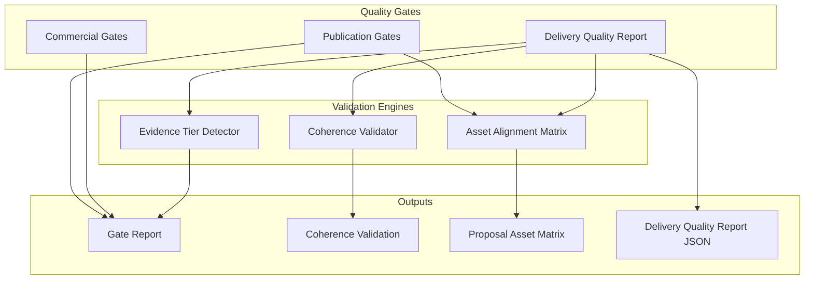
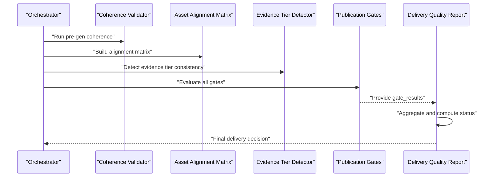
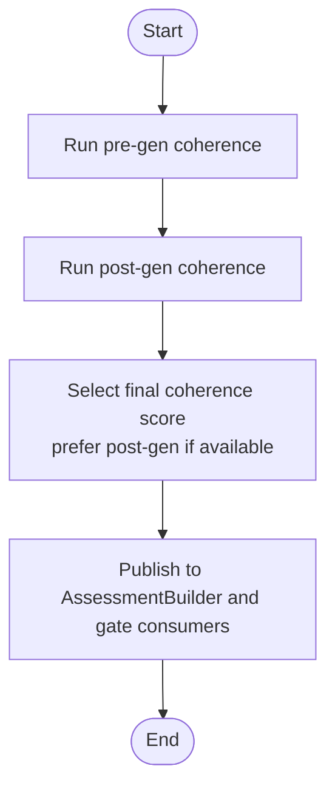
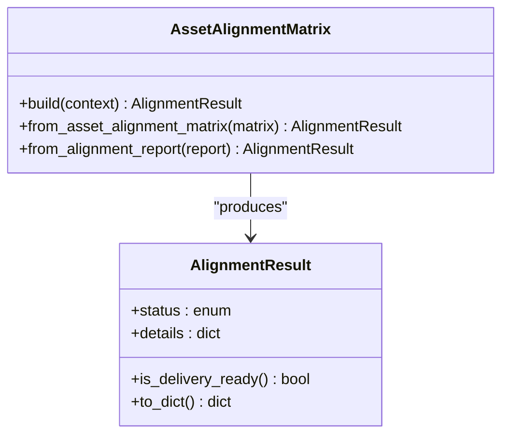
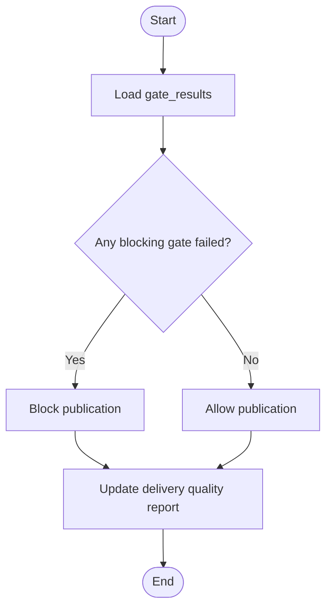
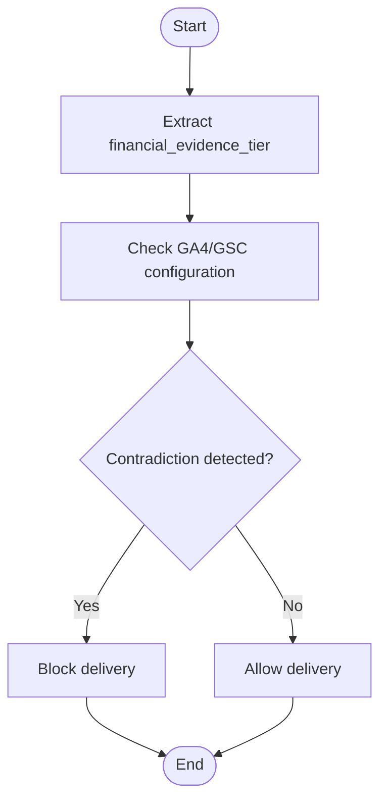
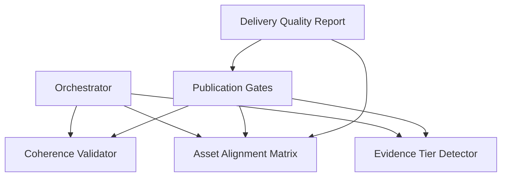

# Quality Gates System

<cite>
**Referenced Files in This Document**
- [CONTEXT-DT4-RESIDUAL-FIXES.md](file://context/Historico/CONTEXT-DT4-RESIDUAL-FIXES.md)
- [CONTEXT-EVIDENCE-TIER-FALSE-CONFIDENCE-IAO-2026-07-30.md](file://context/CONTEXT-EVIDENCE-TIER-FALSE-CONFIDENCE-IAO-2026-07-30.md)
- [ZIONE-PROPOSAL-ASSET-ALIGNMENT-BLOCK-2026-07-23.md](file://context/Historico/ZIONE-PROPOSAL-ASSET-ALIGNMENT-BLOCK-2026-07-23.md)
- [05-prompt-inicio-sesion-fase-3.md](file://plans/Archives/DT4-RESIDUAL-FIXES/05-prompt-inicio-sesion-fase-3.md)
- [04-prompt-fase-C.md](file://plans/Archives/DT-2-DELIVERY-CONTRACT-RESIDUAL/04-prompt-fase-C.md)
- [09-analisis-fases-1-4--OBSOLETO.md](file://plans/Archives/DT4-RESIDUAL-FIXES/09-analisis-fases-1-4--OBSOLETO.md)
</cite>

## Table of Contents
1. [Introduction](#introduction)
2. [Project Structure](#project-structure)
3. [Core Components](#core-components)
4. [Architecture Overview](#architecture-overview)
5. [Detailed Component Analysis](#detailed-component-analysis)
6. [Dependency Analysis](#dependency-analysis)
7. [Performance Considerations](#performance-considerations)
8. [Troubleshooting Guide](#troubleshooting-guide)
9. [Conclusion](#conclusion)
10. [Appendices](#appendices)

## Introduction
This document explains the multi-layered validation architecture of the Quality Gates System, focusing on:
- Coherence scoring across financial models, ROI calculations, and business narratives
- Alignment checking for asset-to-service mapping and pain-point coverage
- Publication readiness gates enforcing minimum thresholds for confidence, alignment, and quality metrics
- Concrete gate implementations such as proposal-asset alignment, coherence validation, and evidence tier assessment
- Gate report structure, scoring algorithms, and threshold configurations
- Common issues (confidence mismatches, alignment calculation errors, gate bypass scenarios) with debugging strategies and resolutions

## Project Structure
The repository organizes quality gates and related artifacts under plans and context directories that capture implementation prompts, post-analysis, and historical diagnostics. Key areas include:
- Plans archives containing phased prompts and checklists for alignment unification, coherence fixes, and delivery quality reporting
- Context documents detailing root causes, bypass chains, and evidence-tier inconsistencies
- Evidence artifacts referenced by reports (e.g., coherence_validation.json, commercial_gates_report.json, delivery_quality_report.json)

[No sources needed since this diagram shows conceptual workflow, not actual code structure]

## Core Components
- Publication Gates: Enforce go/no-go decisions before publishing assets; includes alignment checks, coherence, coverage, and evidence gates.
- Delivery Quality Report: Aggregates gate results into a unified status and can block packaging if critical gates fail.
- Commercial Gates: Evaluate business viability (e.g., ROI thresholds) and integrate with publication gating.
- Coherence Validator: Computes weighted scores across financial models, ROI, and narrative consistency; supports pre/post generation comparisons.
- Asset Alignment Matrix: Canonical representation of asset-to-service mapping and pain-point coverage.
- Evidence Tier Detector: Validates internal consistency between claimed evidence tiers and data source configuration.

**Section sources**
- [CONTEXT-DT4-RESIDUAL-FIXES.md:550-599](file://context/Historico/CONTEXT-DT4-RESIDUAL-FIXES.md#L550-L599)
- [04-prompt-fase-C.md:93-121](file://plans/Archives/DT-2-DELIVERY-CONTRACT-RESIDUAL/04-prompt-fase-C.md#L93-L121)
- [09-analisis-fases-1-4--OBSOLETO.md:150-164](file://plans/Archives/DT4-RESIDUAL-FIXES/09-analisis-fases-1-4--OBSOLETO.md#L150-L164)

## Architecture Overview
The system enforces publication readiness through layered gates:
- Coherence scoring validates consistency across financials, ROI, and narrative.
- Alignment ensures generated assets map to services and address identified pain points.
- Evidence tier checks prevent contradictory claims about data sources.
- Publication gates aggregate these validations and enforce thresholds.
- Delivery quality report consolidates results and can block packaging when critical gates fail.

[No sources needed since this diagram shows conceptual workflow, not actual code structure]

## Detailed Component Analysis

### Coherence Scoring Mechanism
- Purpose: Ensure consistency across financial models, ROI calculations, and business narratives.
- Implementation highlights:
  - Pre-generation and post-generation coherence evaluations are executed by the orchestrator.
  - A canonical final coherence score should be used consistently across consumers to avoid mismatched values.
  - Weighted scoring combines multiple dimensions; ensure formulas remain stable and verified.

**Section sources**
- [CONTEXT-DT4-RESIDUAL-FIXES.md:550-599](file://context/Historico/CONTEXT-DT4-RESIDUAL-FIXES.md#L550-L599)
- [05-prompt-inicio-sesion-fase-3.md:59-116](file://plans/Archives/DT4-RESIDUAL-FIXES/05-prompt-inicio-sesion-fase-3.md#L59-L116)

### Alignment Checking System
- Purpose: Validate asset-to-service mapping and ensure generated assets address identified pain points.
- Implementation highlights:
  - Canonical alignment result is produced via a unified dataclass or factory methods.
  - Both publication gates and delivery quality report must consume the same alignment result to avoid discrepancies.
  - Explicit categorization of statuses (generated/present/missing/redundant/indeterminate) improves clarity.

**Section sources**
- [09-analisis-fases-1-4--OBSOLETO.md:150-164](file://plans/Archives/DT4-RESIDUAL-FIXES/09-analisis-fases-1-4--OBSOLETO.md#L150-L164)

### Publication Readiness Gates
- Purpose: Enforce minimum thresholds for confidence scores, alignment percentages, and quality metrics before publishing.
- Implementation highlights:
  - Multiple gates evaluate coherence, coverage, evidence, and alignment.
  - Blocking behavior depends on configuration flags and aggregated gate results.
  - Delivery quality report must reflect real gate outcomes to prevent false PASS states.

**Section sources**
- [04-prompt-fase-C.md:52-92](file://plans/Archives/DT-2-DELIVERY-CONTRACT-RESIDUAL/04-prompt-fase-C.md#L52-L92)

### Evidence Tier Assessment
- Purpose: Prevent contradictions between claimed evidence tiers and actual data source configuration.
- Implementation highlights:
  - Extract evidence tier from frontmatter and compare with configured data sources.
  - If tier claims higher assurance than supported, block delivery with a clear message.

**Section sources**
- [CONTEXT-EVIDENCE-TIER-FALSE-CONFIDENCE-IAO-2026-07-30.md:249-259](file://context/CONTEXT-EVIDENCE-TIER-FALSE-CONFIDENCE-IAO-2026-07-30.md#L249-L259)

### Gate Report Structure and Scoring Algorithms
- Gate report aggregates results from coherence, coverage, evidence, and alignment gates.
- Scoring algorithms:
  - Coherence uses weighted scoring across financial models, ROI, and narrative consistency.
  - Alignment computes percentages based on asset-to-service mapping and pain-point coverage.
  - Evidence tier assesses internal consistency between claims and data sources.
- Threshold configurations define pass/fail criteria for each gate.

**Section sources**
- [CONTEXT-DT4-RESIDUAL-FIXES.md:550-599](file://context/Historico/CONTEXT-DT4-RESIDUAL-FIXES.md#L550-L599)
- [04-prompt-fase-C.md:93-121](file://plans/Archives/DT-2-DELIVERY-CONTRACT-RESIDUAL/04-prompt-fase-C.md#L93-L121)

## Dependency Analysis
Key dependencies and relationships:
- Publication gates depend on coherence validator, alignment matrix, and evidence tier detector.
- Delivery quality report consumes gate results and alignment data to determine overall status.
- Orchestration layer coordinates pre/post coherence runs and aligns consumers to canonical scores.

[No sources needed since this diagram shows conceptual workflow, not actual code structure]

## Performance Considerations
- Prefer single-source canonical scores (e.g., final coherence score) to reduce redundant computations.
- Cache intermediate results (coherence reports, alignment matrices) where appropriate.
- Optimize evidence tier detection by limiting source checks to relevant modules.
- Avoid unnecessary re-evaluation of gates unless inputs change.

[No sources needed since this section provides general guidance]

## Troubleshooting Guide
Common issues and resolutions:
- Confidence score mismatches:
  - Ensure consumers use the canonical final coherence score rather than pre/post variants.
  - Verify fallback logic when post-gen coherence is unavailable.
- Alignment calculation errors:
  - Confirm both publication gates and delivery quality report consume the same alignment result.
  - Validate explicit status categorization and semantic equality between reports.
- Gate bypass scenarios:
  - Investigate configuration flags that disable blocking behavior.
  - Fix hardcoded defaults in delivery quality report to reflect real gate outcomes.

Debugging strategies:
- Inspect gate_results keys and ensure correct naming conventions.
- Add tests for semantic equality between alignment outputs.
- Use logs to trace coherence score selection and alignment computation paths.

**Section sources**
- [CONTEXT-DT4-RESIDUAL-FIXES.md:550-599](file://context/Historico/CONTEXT-DT4-RESIDUAL-FIXES.md#L550-L599)
- [05-prompt-inicio-sesion-fase-3.md:59-116](file://plans/Archives/DT4-RESIDUAL-FIXES/05-prompt-inicio-sesion-fase-3.md#L59-L116)
- [04-prompt-fase-C.md:52-92](file://plans/Archives/DT-2-DELIVERY-CONTRACT-RESIDUAL/04-prompt-fase-C.md#L52-L92)

## Conclusion
The Quality Gates System enforces robust validation through layered checks for coherence, alignment, and evidence consistency. By standardizing canonical scores and alignment results, and ensuring delivery quality reports reflect real gate outcomes, the system prevents publication of inconsistent or misaligned assets. Continuous monitoring and testing are essential to maintain reliability and accuracy.

[No sources needed since this section summarizes without analyzing specific files]

## Appendices
- References to key implementation prompts and analysis documents provide detailed task breakdowns and verification steps.
- Historical context documents highlight root causes and resolution strategies for common pitfalls.

[No sources needed since this section provides general guidance]