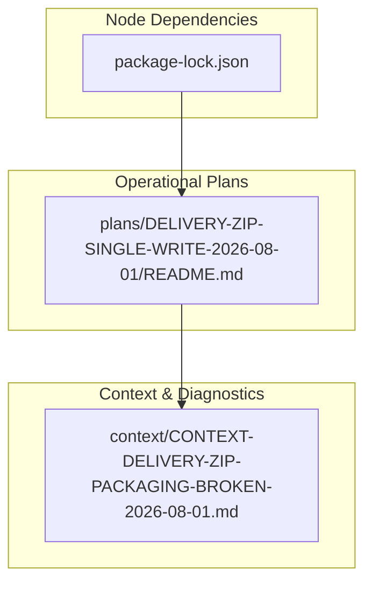
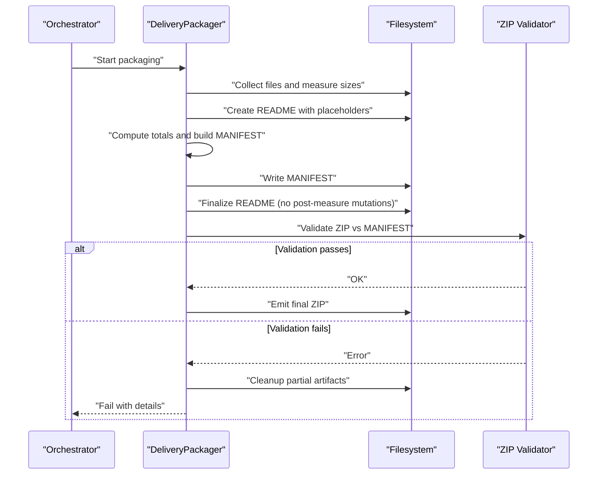
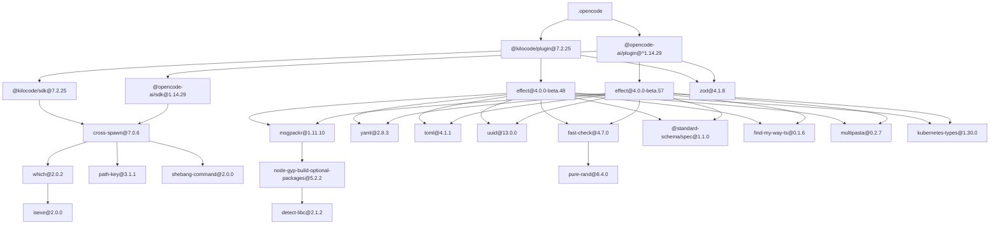

# Deployment and Operations

<cite>
**Referenced Files in This Document**
- [package-lock.json](file://package-lock.json)
- [README.md](file://plans/DELIVERY-ZIP-SINGLE-WRITE-2026-08-01/README.md)
- [CONTEXT-DELIVERY-ZIP-PACKAGING-BROKEN-2026-08-01.md](file://context/CONTEXT-DELIVERY-ZIP-PACKAGING-BROKEN-2026-08-01.md)
</cite>

## Table of Contents
1. [Introduction](#introduction)
2. [Project Structure](#project-structure)
3. [Core Components](#core-components)
4. [Architecture Overview](#architecture-overview)
5. [Detailed Component Analysis](#detailed-component-analysis)
6. [Dependency Analysis](#dependency-analysis)
7. [Performance Considerations](#performance-considerations)
8. [Troubleshooting Guide](#troubleshooting-guide)
9. [Conclusion](#conclusion)
10. [Appendices](#appendices)

## Introduction
This document provides deployment and operations guidance for the project, focusing on environment setup, Node.js dependency management, package synchronization, multi-environment deployment strategies, monitoring and logging, operational maintenance at scale, backup and recovery, security considerations, troubleshooting, performance optimization, capacity planning, and incident response runbooks. It synthesizes findings from the repository’s delivery packaging context and plan artifacts to ensure reliable, auditable deployments and robust operations.

## Project Structure
The repository includes:
- A Node.js lockfile defining dependencies for plugins and SDKs used by the tooling.
- Operational plans and context documents describing delivery packaging behavior, known issues, and phased remediation steps.

**Diagram sources**
- [package-lock.json:1-428](file://package-lock.json#L1-L428)
- [README.md:1-80](file://plans/DELIVERY-ZIP-SINGLE-WRITE-2026-08-01/README.md#L1-L80)
- [CONTEXT-DELIVERY-ZIP-PACKAGING-BROKEN-2026-08-01.md:1-528](file://context/CONTEXT-DELIVERY-ZIP-PACKAGING-BROKEN-2026-08-01.md#L1-L528)

**Section sources**
- [package-lock.json:1-428](file://package-lock.json#L1-L428)
- [README.md:1-80](file://plans/DELIVERY-ZIP-SINGLE-WRITE-2026-08-01/README.md#L1-L80)
- [CONTEXT-DELIVERY-ZIP-PACKAGING-BROKEN-2026-08-01.md:1-528](file://context/CONTEXT-DELIVERY-ZIP-PACKAGING-BROKEN-2026-08-01.md#L1-L528)

## Core Components
- Node.js dependency layer: The lockfile defines plugin and SDK versions required by the toolchain. These are critical for consistent builds across environments.
- Delivery packaging pipeline: Context documentation describes how assets are packaged into a ZIP with a MANIFEST and README, including known failure modes and recommended architectural fixes.
- Phased execution model: The plan outlines phase-based sessions and release criteria that guide safe rollout and validation.

Key operational implications:
- Pinning dependencies via the lockfile ensures reproducible builds.
- Packaging integrity depends on deterministic file measurement and immutable snapshots before packaging.
- Phased execution reduces risk and enables controlled rollouts.

**Section sources**
- [package-lock.json:1-428](file://package-lock.json#L1-L428)
- [CONTEXT-DELIVERY-ZIP-PACKAGING-BROKEN-2026-08-01.md:1-528](file://context/CONTEXT-DELIVERY-ZIP-PACKAGING-BROKEN-2026-08-01.md#L1-L528)
- [README.md:1-80](file://plans/DELIVERY-ZIP-SINGLE-WRITE-2026-08-01/README.md#L1-L80)

## Architecture Overview
The delivery packaging flow involves generating assets, creating metadata (MANIFEST), preparing a README, and producing a ZIP artifact. Integrity is validated against declared sizes; failures must be surfaced clearly and cleaned up safely.

**Diagram sources**
- [CONTEXT-DELIVERY-ZIP-PACKAGING-BROKEN-2026-08-01.md:36-88](file://context/CONTEXT-DELIVERY-ZIP-PACKAGING-BROKEN-2026-08-01.md#L36-L88)
- [CONTEXT-DELIVERY-ZIP-PACKAGING-BROKEN-2026-08-01.md:144-252](file://context/CONTEXT-DELIVERY-ZIP-PACKAGING-BROKEN-2026-08-01.md#L144-L252)

## Detailed Component Analysis

### Node.js Environment and Dependency Management
- Use the provided lockfile to ensure deterministic installs across development, staging, and production.
- Enforce Node.js version compatibility aligned with dependency engines (e.g., modules requiring specific Node versions).
- Avoid ad-hoc upgrades without validating downstream consumers and tests.

Recommended practices:
- Always install from the lockfile in CI/CD and production.
- Validate dependency updates through automated tests and packaging checks before promotion.
- Maintain separate lockfiles per environment only if explicitly required; otherwise, share one canonical lockfile.

**Section sources**
- [package-lock.json:1-428](file://package-lock.json#L1-L428)

### Delivery Packaging Pipeline
- The pipeline generates assets, computes metadata, and produces a ZIP artifact validated against a MANIFEST.
- Known issues include post-measurement mutations causing size mismatches and incomplete cleanup on errors.
- Recommended approach emphasizes single-write semantics and immutable snapshots prior to packaging.

Operational notes:
- Ensure no file modifications occur after their sizes are recorded.
- Centralize filename generation to avoid timestamp drift between artifacts.
- Fail fast and clean up partial outputs on validation errors.

**Section sources**
- [CONTEXT-DELIVERY-ZIP-PACKAGING-BROKEN-2026-08-01.md:144-252](file://context/CONTEXT-DELIVERY-ZIP-PACKAGING-BROKEN-2026-08-01.md#L144-L252)
- [CONTEXT-DELIVERY-ZIP-PACKAGING-BROKEN-2026-08-01.md:335-418](file://context/CONTEXT-DELIVERY-ZIP-PACKAGING-BROKEN-2026-08-01.md#L335-L418)

### Phased Execution and Release Strategy
- Execute phases sequentially in isolated sessions, verifying completion criteria before proceeding.
- Release occurs only when all prerequisite phases pass validation and integration checks.

Operational guidance:
- Automate phase gating and verification in CI/CD.
- Maintain clear phase prompts and checklists to standardize execution.
- Track progress and outcomes centrally for auditability.

**Section sources**
- [README.md:22-63](file://plans/DELIVERY-ZIP-SINGLE-WRITE-2026-08-01/README.md#L22-L63)

## Dependency Analysis
The Node.js dependency graph centers around two primary plugins and their SDKs, with shared utilities and optional native components.

**Diagram sources**
- [package-lock.json:1-428](file://package-lock.json#L1-L428)

**Section sources**
- [package-lock.json:1-428](file://package-lock.json#L1-L428)

## Performance Considerations
- Prefer single-pass measurements and writes to avoid re-computation and I/O overhead.
- Cache intermediate results where safe and deterministic.
- Minimize disk churn during packaging to reduce contention and improve throughput.
- Validate early and fail fast to avoid unnecessary work.

[No sources needed since this section provides general guidance]

## Troubleshooting Guide
Common deployment and operational issues:
- Missing or inconsistent Node.js versions causing dependency resolution failures.
- Packaging validation errors due to size mismatches or incomplete cleanup.
- Silent fallbacks masking divergent behavior between environments.

Diagnostic steps:
- Verify Node.js version and reinstall dependencies using the lockfile.
- Inspect generated artifacts (MANIFEST, README, ZIP) for consistency.
- Review logs for warnings or errors indicating silent fallbacks or validation failures.
- Clean partial artifacts and re-run with verbose logging.

Remediation actions:
- Enforce deterministic installs and packaging flows.
- Centralize artifact naming and timestamps to prevent drift.
- Replace silent exceptions with explicit logging and error propagation.
- Implement comprehensive cleanup on error paths.

**Section sources**
- [CONTEXT-DELIVERY-ZIP-PACKAGING-BROKEN-2026-08-01.md:254-308](file://context/CONTEXT-DELIVERY-ZIP-PACKAGING-BROKEN-2026-08-01.md#L254-L308)

## Conclusion
Reliable deployment and operations hinge on deterministic environments, strict packaging integrity, and clear error handling. By pinning dependencies, enforcing single-write semantics, centralizing artifact naming, and implementing robust monitoring and cleanup, teams can achieve consistent, auditable deliveries across environments. Phased execution and rigorous validation further reduce risk and enable confident releases.

[No sources needed since this section summarizes without analyzing specific files]

## Appendices

### Environment Setup and Package Synchronization
- Install Node.js compatible with dependency engines.
- Run dependency installation using the lockfile to ensure reproducibility.
- Validate installations with basic smoke tests before promoting to higher environments.

**Section sources**
- [package-lock.json:1-428](file://package-lock.json#L1-L428)

### Multi-Environment Deployment Strategies
- Development: Local runs with verbose logging and quick iteration cycles.
- Staging: Full integration tests, packaging validation, and artifact inspection.
- Production: Strict enforcement of lockfile, automated validations, and rollback procedures.

**Section sources**
- [README.md:22-63](file://plans/DELIVERY-ZIP-SINGLE-WRITE-2026-08-01/README.md#L22-L63)

### Monitoring and Logging
- Log all packaging steps, including file collection, measurement, and validation outcomes.
- Surface warnings and errors prominently to avoid silent failures.
- Track metrics such as artifact sizes, validation pass/fail rates, and execution durations.

**Section sources**
- [CONTEXT-DELIVERY-ZIP-PACKAGING-BROKEN-2026-08-01.md:276-308](file://context/CONTEXT-DELIVERY-ZIP-PACKAGING-BROKEN-2026-08-01.md#L276-L308)

### Backup and Recovery
- Back up generated assets, MANIFESTs, and configuration files regularly.
- Retain versioned backups to support recovery and auditing.
- Test restoration procedures periodically to ensure reliability.

[No sources needed since this section provides general guidance]

### Security Considerations
- Manage API keys securely via environment variables or secret managers.
- Restrict file permissions to minimize exposure of sensitive artifacts.
- Control network access to external services and registries.

[No sources needed since this section provides general guidance]

### Operational Runbooks
- Incident Response: Identify root cause, isolate affected systems, apply hotfixes if necessary, validate with tests, and communicate status.
- System Maintenance: Update dependencies cautiously, validate with full test suites, and promote changes through staged environments.

[No sources needed since this section provides general guidance]