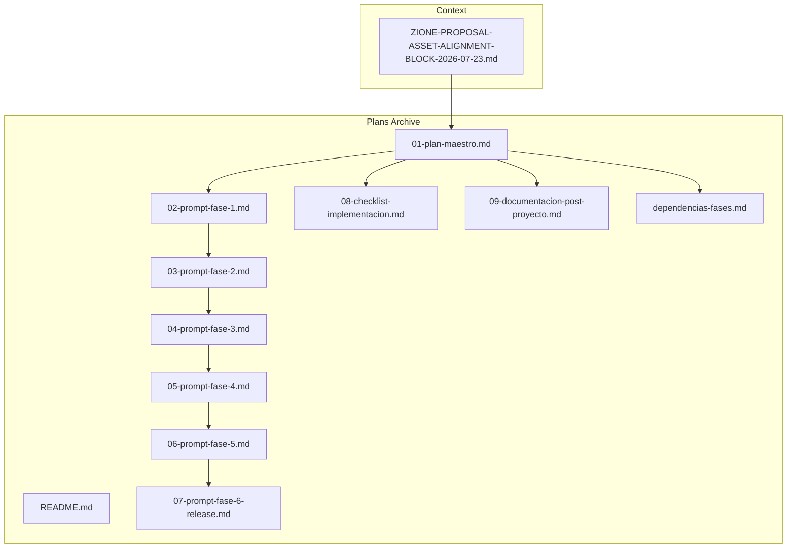
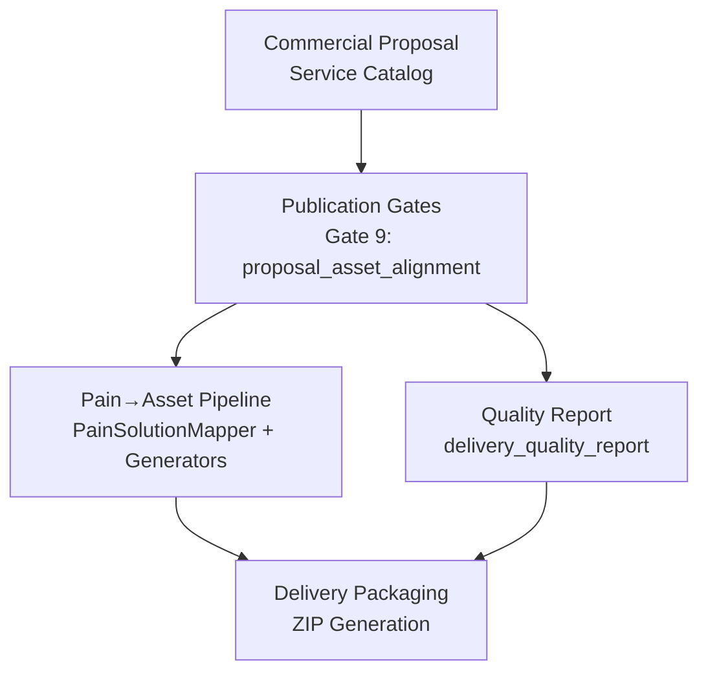
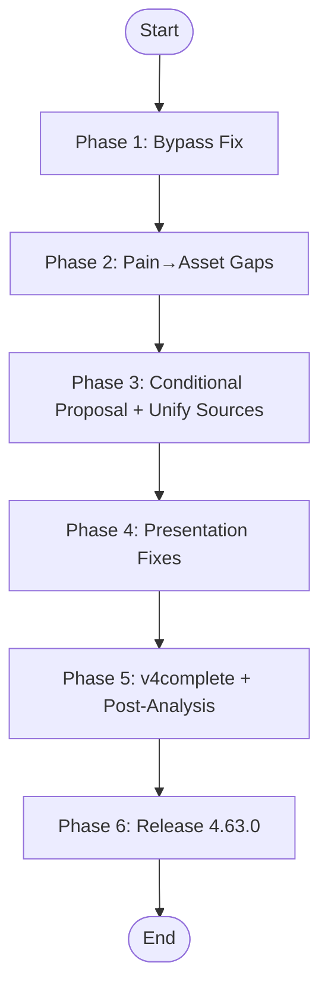
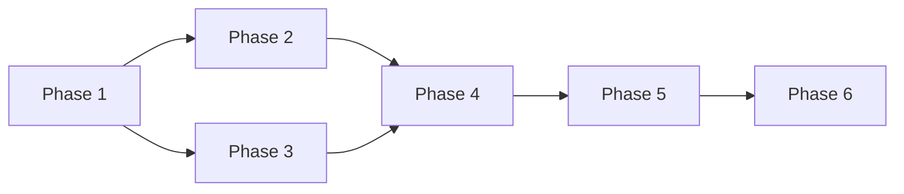

# Asset Alignment and Zione Implementation

<cite>
**Referenced Files in This Document**
- [ZIONE-PROPOSAL-ASSET-ALIGNMENT-BLOCK-2026-07-23.md](file://context/Historico/ZIONE-PROPOSAL-ASSET-ALIGNMENT-BLOCK-2026-07-23.md)
- [README.md](file://plans/Archives/ASSET-ALIGNMENT-ZIONE-2026-07-23/README.md)
- [01-plan-maestro.md](file://plans/Archives/ASSET-ALIGNMENT-ZIONE-2026-07-23/01-plan-maestro.md)
- [dependencias-fases.md](file://plans/Archives/ASSET-ALIGNMENT-ZIONE-2026-07-23/dependencias-fases.md)
- [02-prompt-fase-1.md](file://plans/Archives/ASSET-ALIGNMENT-ZIONE-2026-07-23/02-prompt-fase-1.md)
- [03-prompt-fase-2.md](file://plans/Archives/ASSET-ALIGNMENT-ZIONE-2026-07-23/03-prompt-fase-2.md)
- [04-prompt-fase-3.md](file://plans/Archives/ASSET-ALIGNMENT-ZIONE-2026-07-23/04-prompt-fase-3.md)
- [05-prompt-fase-4.md](file://plans/Archives/ASSET-ALIGNMENT-ZIONE-2026-07-23/05-prompt-fase-4.md)
- [06-prompt-fase-5.md](file://plans/Archives/ASSET-ALIGNMENT-ZIONE-2026-07-23/06-prompt-fase-5.md)
- [07-prompt-fase-6-release.md](file://plans/Archives/ASSET-ALIGNMENT-ZIONE-2026-07-23/07-prompt-fase-6-release.md)
- [08-checklist-implementacion.md](file://plans/Archives/ASSET-ALIGNMENT-ZIONE-2026-07-23/08-checklist-implementacion.md)
- [09-documentacion-post-proyecto.md](file://plans/Archives/ASSET-ALIGNMENT-ZIONE-2026-07-23/09-documentacion-post-proyecto.md)
</cite>

## Table of Contents
1. Introduction
2. Project Structure
3. Core Components
4. Architecture Overview
5. Detailed Component Analysis
6. Dependency Analysis
7. Performance Considerations
8. Troubleshooting Guide
9. Conclusion
10. Appendices

## Introduction
This document explains the Asset Alignment and Zione Implementation methodology used to align digital assets with client proposals and ensure consistency across all deliverables. It details a six-phase implementation plan from initial assessment through release, covering asset specification definition, generation, validation, and integration into commercial proposals. It also documents Zione-specific patterns, asset catalog management, alignment validation procedures, evidence collection, financial scenario modeling, quality assurance steps, automated validation processes, gap identification mechanisms, and feedback loops that maintain ongoing alignment between assets and business requirements.

## Project Structure
The project organizes plans and context around a focused initiative for Zi One Luxury (zione.co). The structure includes:
- Context documentation describing the problem discovery and root causes
- A phased plan repository with master plan, phase prompts, dependencies, checklists, and post-project documentation
- Evidence artifacts produced by execution phases

**Diagram sources**
- [ZIONE-PROPOSAL-ASSET-ALIGNMENT-BLOCK-2026-07-23.md](file://context/Historico/ZIONE-PROPOSAL-ASSET-ALIGNMENT-BLOCK-2026-07-23.md)
- [README.md](file://plans/Archives/ASSET-ALIGNMENT-ZIONE-2026-07-23/README.md)
- [01-plan-maestro.md](file://plans/Archives/ASSET-ALIGNMENT-ZIONE-2026-07-23/01-plan-maestro.md)
- [dependencias-fases.md](file://plans/Archives/ASSET-ALIGNMENT-ZIONE-2026-07-23/dependencias-fases.md)

**Section sources**
- [README.md](file://plans/Archives/ASSET-ALIGNMENT-ZIONE-2026-07-23/README.md)
- [01-plan-maestro.md](file://plans/Archives/ASSET-ALIGNMENT-ZIONE-2026-07-23/01-plan-maestro.md)

## Core Components
The methodology centers on three core components:
- Proposal-to-Asset Mapping: Defines how services promised in commercial proposals map to generated assets and validates alignment via publication gates.
- Pain-to-Asset Pipeline: Detects site conditions (“pains”) and plans/generates corresponding assets; extended with new pain types and enhanced generators.
- Quality Gates and Delivery Packaging: Enforces alignment thresholds, blocks delivery when misaligned, and packages verified assets into client deliverables.

Key responsibilities:
- Define asset specifications and catalogs
- Generate assets based on detected pains or always-promised services
- Validate alignment against proposal promises
- Block delivery if alignment fails
- Package validated assets into ZIP deliveries

**Section sources**
- [ZIONE-PROPOSAL-ASSET-ALIGNMENT-BLOCK-2026-07-23.md](file://context/Historico/ZIONE-PROPOSAL-ASSET-ALIGNMENT-BLOCK-2026-07-23.md)
- [01-plan-maestro.md](file://plans/Archives/ASSET-ALIGNMENT-ZIONE-2026-07-23/01-plan-maestro.md)

## Architecture Overview
The architecture spans four layers:
- Commercial Proposal Layer: Promises specific services mapped to assets.
- Publication Gate Layer: Evaluates alignment and enforces blocking rules.
- Pain-to-Asset Pipeline: Detects pains and generates assets accordingly.
- Delivery Packaging Layer: Packages validated assets into deliverables.

**Diagram sources**
- [ZIONE-PROPOSAL-ASSET-ALIGNMENT-BLOCK-2026-07-23.md](file://context/Historico/ZIONE-PROPOSAL-ASSET-ALIGNMENT-BLOCK-2026-07-23.md)
- [01-plan-maestro.md](file://plans/Archives/ASSET-ALIGNMENT-ZIONE-2026-07-23/01-plan-maestro.md)

## Detailed Component Analysis

### Six-Phase Implementation Plan
The plan executes in six sequential phases, each with clear objectives, tasks, tests, and post-execution documentation.

- Phase 1: Repair bypass of security controls so that Gate 9 failures block delivery and default gate-blocking is enabled.
- Phase 2: Close gaps in Pain→Asset mapping by adding new pain types and enhancing generators to avoid duplication.
- Phase 3: Make the proposal conditional to only promise services with generated assets or present-in-production status; unify service source-of-truth.
- Phase 4: Fix presentation and minor bugs (templates, manifests, labels, tests).
- Phase 5: Execute full v4complete run for Zi One Luxury, verify fixes, and produce post-implementation analysis.
- Phase 6: Release management including version bump, changelog, technical notes, and final validations.

**Diagram sources**
- [01-plan-maestro.md](file://plans/Archives/ASSET-ALIGNMENT-ZIONE-2026-07-23/01-plan-maestro.md)
- [dependencias-fases.md](file://plans/Archives/ASSET-ALIGNMENT-ZIONE-2026-07-23/dependencias-fases.md)

**Section sources**
- [01-plan-maestro.md](file://plans/Archives/ASSET-ALIGNMENT-ZIONE-2026-07-23/01-plan-maestro.md)
- [dependencias-fases.md](file://plans/Archives/ASSET-ALIGNMENT-ZIONE-2026-07-23/dependencias-fases.md)

### Phase 1: Bypass of Security Controls
Objectives:
- Ensure delivery_quality_report consumes the real result of Gate 9 instead of hardcoding success.
- Enable gate-blocking by default so blocked gates prevent document generation.

Key tasks:
- Correct key lookup for proposal_asset_alignment in the quality report.
- Add proposal_asset_alignment to blocking gates list.
- Change environment variable default to enable gate-blocking.

Validation:
- Tests confirm propagation of Gate 9 failure to quality report.
- Tests confirm default behavior enables gate-blocking.

**Section sources**
- [02-prompt-fase-1.md](file://plans/Archives/ASSET-ALIGNMENT-ZIONE-2026-07-23/02-prompt-fase-1.md)

### Phase 2: Pain→Asset Gaps and Enhanced Generators
Objectives:
- Introduce new pain type for low SEO Local score to trigger optimization_guide generation.
- Extend no_og_tags detection to support enhance_existing mode when OG tags exist but are incomplete.
- Remove duplicate key in asset mapping to avoid ambiguity.
- Enhance OpenGraphGenerator to generate only missing tags and avoid duplication.

Key tasks:
- Add low_seo_score pain mapping to optimization_guide.
- Modify detect_pains logic for no_og_tags to activate even when OG tags exist but are incomplete.
- Eliminate duplicated mapping entry.
- Update generator to accept existing tags and produce only missing ones.

Validation:
- New tests cover low_seo_score activation, enhance_existing behavior, and mapping correctness.
- Existing tests pass without regression.

**Section sources**
- [03-prompt-fase-2.md](file://plans/Archives/ASSET-ALIGNMENT-ZIONE-2026-07-23/03-prompt-fase-2.md)

### Phase 3: Conditional Proposal and Unified Service Sources
Objectives:
- Make the proposal conditional to only include services with generated assets or present_in_production status.
- Unify service source-of-truth by deriving lookups from the canonical proposal mapping.

Key tasks:
- Filter services in proposal generation based on asset availability or production presence.
- Derive service lookup from the canonical proposal mapping to eliminate divergence.

Validation:
- Tests verify conditional inclusion and unified lookup keys match the canonical mapping.

**Section sources**
- [04-prompt-fase-3.md](file://plans/Archives/ASSET-ALIGNMENT-ZIONE-2026-07-23/04-prompt-fase-3.md)

### Phase 4: Presentation Fixes and Minor Bugs
Objectives:
- Replace static template text with dynamic variables.
- Fix serialization issues in asset matrix building.
- Synchronize manifest and README with actual ZIP contents.
- Clarify financial labels to distinguish gross vs net values.
- Fix broken test paths.

Key tasks:
- Update templates to use dynamic variables.
- Handle both dict and object inputs in matrix builder.
- Generate manifest and README dynamically from ZIP content.
- Adjust financial label wording for clarity.
- Correct hardcoded test paths.

Validation:
- All related tests pass; quick validations succeed.

**Section sources**
- [05-prompt-fase-4.md](file://plans/Archives/ASSET-ALIGNMENT-ZIONE-2026-07-23/05-prompt-fase-4.md)

### Phase 5: Full Execution and Post-Implementation Analysis
Objectives:
- Run v4complete for Zi One Luxury with all fixes applied.
- Verify that all identified gaps are closed and alignment thresholds are met.
- Produce comprehensive post-implementation analysis with lessons learned.

Key tasks:
- Execute v4complete and capture evidence artifacts.
- Verify Gate 9 passes and assets are generated as expected.
- Confirm quality report reflects real gate results.
- Analyze coherence, readiness, and ZIP contents.

Validation:
- Gate 9 passes with alignment above threshold.
- Assets generated or justified per proposal promises.
- Coherence meets minimum threshold.

**Section sources**
- [06-prompt-fase-5.md](file://plans/Archives/ASSET-ALIGNMENT-ZIONE-2026-07-23/06-prompt-fase-5.md)

### Phase 6: Release Management
Objectives:
- Version bump and synchronization.
- Update changelog and technical notes.
- Final validations and commit.

Key tasks:
- Bump version to target release.
- Sync versions across project files.
- Add structured changelog entry.
- Regenerate system status and domain primer.
- Run final validations and commit changes.

Validation:
- All validations pass; consistency checks succeed.

**Section sources**
- [07-prompt-fase-6-release.md](file://plans/Archives/ASSET-ALIGNMENT-ZIONE-2026-07-23/07-prompt-fase-6-release.md)

### Zione-Specific Implementation Patterns
- Always-promised services: Some assets are always included regardless of pain detection; this pattern ensures consistent value delivery.
- Enhance-existing mode: For assets like Open Graph tags, the system detects existing implementations and generates only missing or improved elements.
- Conditional proposal: Services are only promised if assets are generated or already present in production, preventing empty promises.

These patterns ensure alignment between what is sold and what is delivered while respecting existing site configurations.

**Section sources**
- [03-prompt-fase-2.md](file://plans/Archives/ASSET-ALIGNMENT-ZIONE-2026-07-23/03-prompt-fase-2.md)
- [04-prompt-fase-3.md](file://plans/Archives/ASSET-ALIGNMENT-ZIONE-2026-07-23/04-prompt-fase-3.md)

### Asset Catalog Management
- Centralized catalog defines asset types, templates, output names, and which pains justify their creation.
- Consistency checks ensure catalog entries align with pain mappings and proposal promises.
- Dynamic updates allow catalog evolution without breaking downstream consumers.

**Section sources**
- [ZIONE-PROPOSAL-ASSET-ALIGNMENT-BLOCK-2026-07-23.md](file://context/Historico/ZIONE-PROPOSAL-ASSET-ALIGNMENT-BLOCK-2026-07-23.md)

### Alignment Validation Procedures
- Publication gates evaluate alignment between proposed services and generated assets.
- Quality reports aggregate gate results and enforce blocking policies.
- Automated checks validate asset presence, confidence scores, and coherence metrics.

**Section sources**
- [ZIONE-PROPOSAL-ASSET-ALIGNMENT-BLOCK-2026-07-23.md](file://context/Historico/ZIONE-PROPOSAL-ASSET-ALIGNMENT-BLOCK-2026-07-23.md)

### Evidence Collection Process
- Artifacts captured during execution include diagnostic reports, commercial proposals, audit JSONs, and delivery manifests.
- Evidence directories store phase-specific outputs for traceability and verification.
- Post-implementation analysis synthesizes evidence into actionable insights.

**Section sources**
- [06-prompt-fase-5.md](file://plans/Archives/ASSET-ALIGNMENT-ZIONE-2026-07-23/06-prompt-fase-5.md)

### Financial Scenario Modeling
- Financial scenarios model conservative, realistic, and optimistic outcomes based on direct channel percentages and OTA commissions.
- Labels clarify whether values represent gross commissions or net effects after recommended actions.
- Evidence tiers indicate data source reliability and precision levels.

**Section sources**
- [ZIONE-PROPOSAL-ASSET-ALIGNMENT-BLOCK-2026-07-23.md](file://context/Historico/ZIONE-PROPOSAL-ASSET-ALIGNMENT-BLOCK-2026-07-23.md)

### Quality Assurance Steps
- Automated tests validate gate behavior, asset generation, and proposal consistency.
- Quick validation scripts ensure overall system health.
- Manual checklists verify critical criteria before marking phases complete.

**Section sources**
- [02-prompt-fase-1.md](file://plans/Archives/ASSET-ALIGNMENT-ZIONE-2026-07-23/02-prompt-fase-1.md)
- [08-checklist-implementacion.md](file://plans/Archives/ASSET-ALIGNMENT-ZIONE-2026-07-23/08-checklist-implementacion.md)

### Relationship Between Site Presence Analysis, Asset Generation, and Proposal Consistency
- Site presence analysis identifies existing assets and gaps.
- Asset generation responds to detected pains or always-promised services.
- Proposal consistency ensures only services with available assets or production presence are promised.

This triad maintains alignment throughout the pipeline.

**Section sources**
- [ZIONE-PROPOSAL-ASSET-ALIGNMENT-BLOCK-2026-07-23.md](file://context/Historico/ZIONE-PROPOSAL-ASSET-ALIGNMENT-BLOCK-2026-07-23.md)

### Automated Validation Processes
- Publication gates automatically assess alignment and enforce blocking rules.
- Quality reports consolidate gate results and determine delivery eligibility.
- Test suites validate behavior across components and edge cases.

**Section sources**
- [ZIONE-PROPOSAL-ASSET-ALIGNMENT-BLOCK-2026-07-23.md](file://context/Historico/ZIONE-PROPOSAL-ASSET-ALIGNMENT-BLOCK-2026-07-23.md)

### Gap Identification Mechanisms
- Pain detection identifies site conditions requiring asset generation.
- Matrix builders correlate pains with assets to highlight breaches or missing implementations.
- Conditional logic prevents false positives by considering production presence.

**Section sources**
- [03-prompt-fase-2.md](file://plans/Archives/ASSET-ALIGNMENT-ZIONE-2026-07-23/03-prompt-fase-2.md)

### Feedback Loops for Ongoing Alignment
- Post-implementation analysis captures lessons and identifies residual gaps.
- Changelog and technical notes document changes for future iterations.
- Continuous testing ensures new changes do not reintroduce misalignment.

**Section sources**
- [09-documentacion-post-proyecto.md](file://plans/Archives/ASSET-ALIGNMENT-ZIONE-2026-07-23/09-documentacion-post-proyecto.md)

## Dependency Analysis
Phases depend on prior completions, ensuring foundational fixes precede complex enhancements. Dependencies are explicitly tracked to prevent conflicts and ensure orderly progression.

**Diagram sources**
- [dependencias-fases.md](file://plans/Archives/ASSET-ALIGNMENT-ZIONE-2026-07-23/dependencias-fases.md)

**Section sources**
- [dependencias-fases.md](file://plans/Archives/ASSET-ALIGNMENT-ZIONE-2026-07-23/dependencias-fases.md)

## Performance Considerations
- Minimize redundant asset generation by leveraging enhance_existing mode.
- Optimize pain detection thresholds to reduce false positives.
- Streamline manifest and README generation to reflect actual ZIP contents efficiently.

[No sources needed since this section provides general guidance]

## Troubleshooting Guide
Common issues and resolutions:
- Gate 9 bypass: Ensure quality report consumes real gate results and gate-blocking is enabled by default.
- Missing assets: Verify pain mappings and generator capabilities; add new pain types if necessary.
- Duplicate tags: Use enhance_existing mode to avoid duplicating existing assets.
- Misleading labels: Clarify financial labels to distinguish gross vs net values.
- Broken tests: Update hardcoded paths and fixtures to be dynamic.

**Section sources**
- [02-prompt-fase-1.md](file://plans/Archives/ASSET-ALIGNMENT-ZIONE-2026-07-23/02-prompt-fase-1.md)
- [03-prompt-fase-2.md](file://plans/Archives/ASSET-ALIGNMENT-ZIONE-2026-07-23/03-prompt-fase-2.md)
- [05-prompt-fase-4.md](file://plans/Archives/ASSET-ALIGNMENT-ZIONE-2026-07-23/05-prompt-fase-4.md)

## Conclusion
The Asset Alignment and Zione Implementation methodology provides a robust framework for ensuring digital assets align with client proposals. Through a structured six-phase approach, the system addresses critical bypasses, enhances asset generation, unifies service sources, and enforces quality gates. Continuous validation, evidence collection, and feedback loops maintain alignment over time, delivering consistent and reliable outcomes for clients.

[No sources needed since this section summarizes without analyzing specific files]

## Appendices
- Checklist of completion criteria across all phases
- Post-project documentation summarizing features, metrics, and affected files
- Dependency tracking and conflict resolution strategies

**Section sources**
- [08-checklist-implementacion.md](file://plans/Archives/ASSET-ALIGNMENT-ZIONE-2026-07-23/08-checklist-implementacion.md)
- [09-documentacion-post-proyecto.md](file://plans/Archives/ASSET-ALIGNMENT-ZIONE-2026-07-23/09-documentacion-post-proyecto.md)