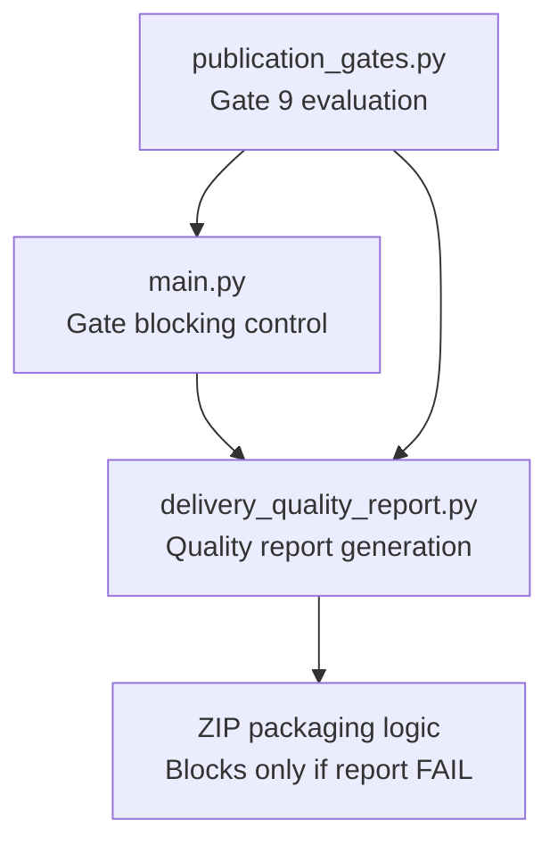
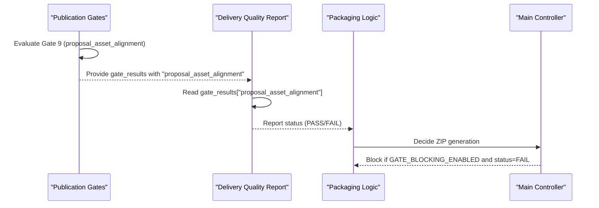
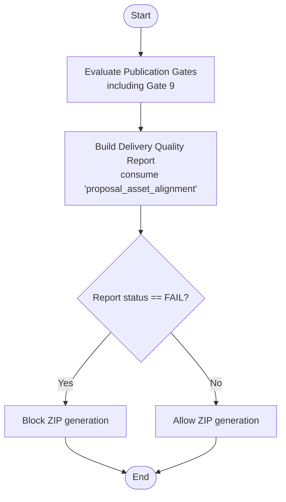
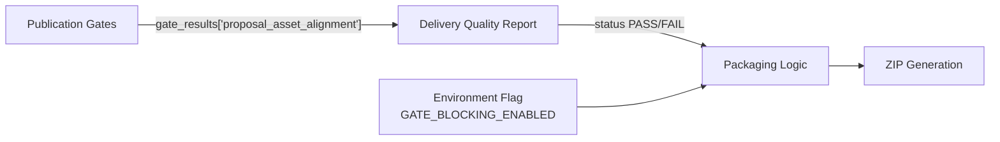

# Phase 1: Security Bypass Repair

<cite>
**Referenced Files in This Document**
- [02-prompt-fase-1.md](file://plans/Archives/ASSET-ALIGNMENT-ZIONE-2026-07-23/02-prompt-fase-1.md)
- [ZIONE-PROPOSAL-ASSET-ALIGNMENT-BLOCK-2026-07-23.md](file://context/Historico/ZIONE-PROPOSAL-ASSET-ALIGNMENT-BLOCK-2026-07-23.md)
- [CONTEXT-DT-2-DELIVERY-CONTRACT-RESIDUAL.md](file://context/Historico/CONTEXT-DT-2-DELIVERY-CONTRACT-RESIDUAL.md)
</cite>

## Table of Contents
1. Introduction
2. Project Structure
3. Core Components
4. Architecture Overview
5. Detailed Component Analysis
6. Dependency Analysis
7. Performance Considerations
8. Troubleshooting Guide
9. Conclusion

## Introduction
This document describes Phase 1 of the Asset Alignment implementation, which repairs a critical security bypass that allowed ZIP delivery even when asset alignment gates failed. The phase focuses on two targeted fixes:
- Correcting the key lookup in the delivery quality report so it consumes the real result of Gate 9 (proposal_asset_alignment).
- Enabling GATE_BLOCKING_ENABLED by default to ensure gate failures actually block document generation.

These changes restore the quality gate system’s ability to properly block deliveries when asset alignment fails and are a prerequisite for all subsequent phases because they re-establish the integrity of the validation pipeline.

## Project Structure
Phase 1 targets two specific files within the codebase:
- modules/quality_gates/delivery_quality_report.py — where the delivery quality report is generated and where the proposal_asset_alignment gate result must be consumed correctly.
- main.py — where the global gating behavior is controlled via an environment variable.

The plan and forensic context for this fix are documented in the Asset Alignment plan and historical audit notes, which detail the three-layer bypass chain and the exact lines requiring correction.

[No sources needed since this diagram shows conceptual workflow, not actual code structure]

## Core Components
- Delivery Quality Report generator: Produces a summary of quality gates and determines whether delivery should proceed. It must consume the real result of Gate 9 from the publication gates.
- Gate blocking control: A global switch that determines whether gate failures prevent document generation. It must be enabled by default to avoid silent bypasses.

Key responsibilities:
- Ensure Gate 9’s outcome is visible to the delivery quality report.
- Ensure the delivery packaging respects gate failures through the quality report status.
- Ensure the global gate blocking flag defaults to a safe value.

**Section sources**
- [02-prompt-fase-1.md:28-60](file://plans/Archives/ASSET-ALIGNMENT-ZIONE-2026-07-23/02-prompt-fase-1.md#L28-L60)
- [02-prompt-fase-1.md:93-115](file://plans/Archives/ASSET-ALIGNMENT-ZIONE-2026-07-23/02-prompt-fase-1.md#L93-L115)

## Architecture Overview
The validation pipeline has three layers that must cooperate to block unsafe deliveries:
- Layer A: Publication Gates evaluate business constraints, including Gate 9 (proposal_asset_alignment).
- Layer B: Delivery Quality Report aggregates gate results and reports PASS/FAIL based on them.
- Layer C: Packaging logic generates ZIPs only if the quality report indicates failure is not required.

Before Phase 1, Layer B ignored Gate 9 due to a wrong key lookup, and Layer A was effectively disabled by default because gate blocking was off. Phase 1 corrects both issues.

**Diagram sources**
- [02-prompt-fase-1.md:178-214](file://plans/Archives/ASSET-ALIGNMENT-ZIONE-2026-07-23/02-prompt-fase-1.md#L178-L214)
- [CONTEXT-DT-2-DELIVERY-CONTRACT-RESIDUAL.md:240-273](file://context/Historico/CONTEXT-DT-2-DELIVERY-CONTRACT-RESIDUAL.md#L240-L273)

## Detailed Component Analysis

### Fix 1: Correct Key Lookup in Delivery Quality Report
Problem:
- The delivery quality report used a wrong key ("proposal_asset") when reading Gate 9’s result from gate_results.
- Because the key never existed, it fell back to a default indicating passed=True, masking failures.

Fix:
- Change the key to "proposal_asset_alignment" so the report consumes the real Gate 9 result.
- Ensure "proposal_asset_alignment" is included in the list of blocking gates so failures can propagate to the overall status.

Impact:
- The quality report now reflects the true state of asset alignment.
- If Gate 9 fails, the quality report can indicate FAIL, enabling downstream blocking.

Code locations and references:
- Key lookup line corrected to use "proposal_asset_alignment".
- Blocking gates list updated to include "proposal_asset_alignment".

**Section sources**
- [02-prompt-fase-1.md:40-60](file://plans/Archives/ASSET-ALIGNMENT-ZIONE-2026-07-23/02-prompt-fase-1.md#L40-L60)
- [CONTEXT-DT-2-DELIVERY-CONTRACT-RESIDUAL.md:240-273](file://context/Historico/CONTEXT-DT-2-DELIVERY-CONTRACT-RESIDUAL.md#L240-L273)

### Fix 2: Enable Gate Blocking by Default
Problem:
- The global gate blocking flag defaulted to falsy, meaning gate failures did not block document generation unless explicitly enabled.

Fix:
- Change the default value of the environment variable controlling gate blocking to "true", ensuring safety by default.

Impact:
- Gate failures will now block ZIP generation unless explicitly overridden.
- Prevents accidental delivery of incomplete or misaligned assets.

Code locations and references:
- Environment variable default changed to enable blocking by default.

**Section sources**
- [02-prompt-fase-1.md:93-115](file://plans/Archives/ASSET-ALIGNMENT-ZIONE-2026-07-23/02-prompt-fase-1.md#L93-L115)

### Validation Pipeline Flow After Fixes

**Diagram sources**
- [02-prompt-fase-1.md:178-214](file://plans/Archives/ASSET-ALIGNMENT-ZIONE-2026-07-23/02-prompt-fase-1.md#L178-L214)

## Dependency Analysis
- Gate 9 evaluation depends on publication gates producing a consistent result under the key "proposal_asset_alignment".
- Delivery quality report depends on consuming that key accurately and including it in blocking logic.
- Packaging logic depends on the quality report’s status and the global gate blocking flag to decide whether to generate ZIPs.

**Diagram sources**
- [CONTEXT-DT-2-DELIVERY-CONTRACT-RESIDUAL.md:240-273](file://context/Historico/CONTEXT-DT-2-DELIVERY-CONTRACT-RESIDUAL.md#L240-L273)
- [02-prompt-fase-1.md:178-214](file://plans/Archives/ASSET-ALIGNMENT-ZIONE-2026-07-23/02-prompt-fase-1.md#L178-L214)

**Section sources**
- [CONTEXT-DT-2-DELIVERY-CONTRACT-RESIDUAL.md:240-273](file://context/Historico/CONTEXT-DT-2-DELIVERY-CONTRACT-RESIDUAL.md#L240-L273)
- [02-prompt-fase-1.md:178-214](file://plans/Archives/ASSET-ALIGNMENT-ZIONE-2026-07-23/02-prompt-fase-1.md#L178-L214)

## Performance Considerations
- The fixes are minimal and localized; they do not introduce new heavy computations.
- Correct key lookup avoids unnecessary fallback logic and ensures accurate status determination early in the pipeline.
- Enabling gate blocking by default may reduce unnecessary ZIP generation when gates fail, improving efficiency.

[No sources needed since this section provides general guidance]

## Troubleshooting Guide
Common issues and resolutions:
- If ZIPs still generate despite Gate 9 failing:
  - Verify the key "proposal_asset_alignment" is present in gate_results.
  - Confirm the delivery quality report includes "proposal_asset_alignment" in its blocking gates list.
  - Ensure GATE_BLOCKING_ENABLED is set to "true" or left at default.
- If tests fail after enabling gate blocking:
  - Adjust test environments to override the flag explicitly where necessary.
  - Do not revert the default; use environment overrides in tests.

**Section sources**
- [02-prompt-fase-1.md:147-175](file://plans/Archives/ASSET-ALIGNMENT-ZIONE-2026-07-23/02-prompt-fase-1.md#L147-L175)

## Conclusion
Phase 1 restores the integrity of the asset alignment validation pipeline by fixing the delivery quality report’s key lookup and enabling gate blocking by default. These changes ensure that asset alignment failures are detected and reported accurately, preventing unauthorized ZIP delivery. This phase is foundational for all subsequent phases, as it establishes reliable gate enforcement and reporting across the system.

[No sources needed since this section summarizes without analyzing specific files]