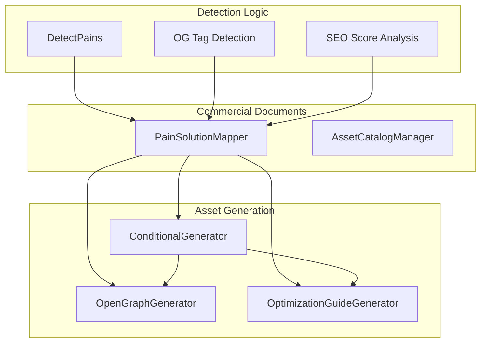
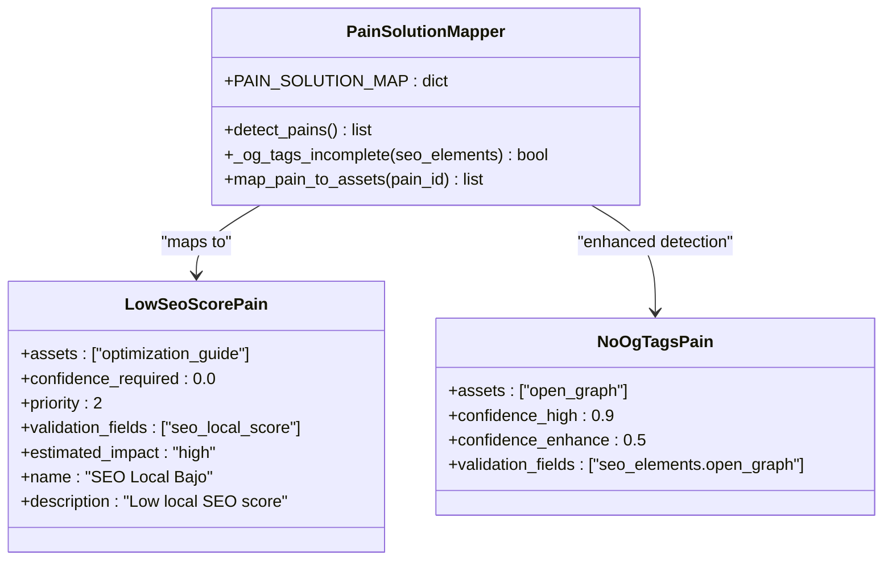
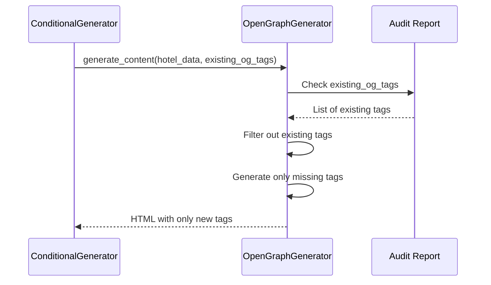
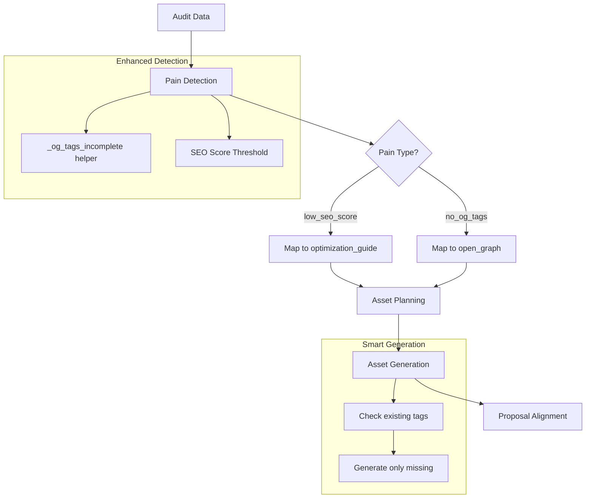
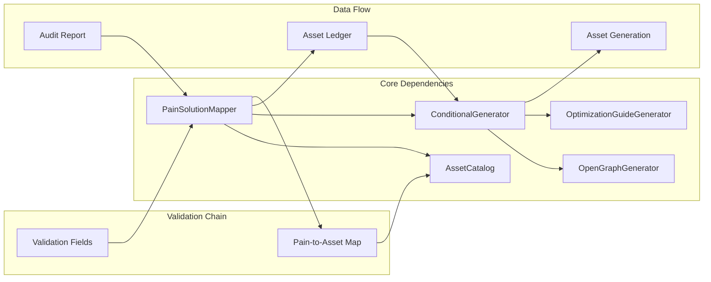

# Phase 2: Pain-to-Asset Gap Resolution

<cite>
**Referenced Files in This Document**
- [03-prompt-fase-2.md](file://plans/Archives/ASSET-ALIGNMENT-ZIONE-2026-07-23/03-prompt-fase-2.md)
- [01-plan-maestro.md](file://plans/Archives/ASSET-ALIGNMENT-ZIONE-2026-07-23/01-plan-maestro.md)
- [ZIONE-PROPOSAL-ASSET-ALIGNMENT-BLOCK-2026-07-23.md](file://context/Historico/ZIONE-PROPOSAL-ASSET-ALIGNMENT-BLOCK-2026-07-23.md)
</cite>

## Table of Contents
1. [Introduction](#introduction)
2. [Project Structure](#project-structure)
3. [Core Components](#core-components)
4. [Architecture Overview](#architecture-overview)
5. [Detailed Component Analysis](#detailed-component-analysis)
6. [Dependency Analysis](#dependency-analysis)
7. [Performance Considerations](#performance-considerations)
8. [Troubleshooting Guide](#troubleshooting-guide)
9. [Conclusion](#conclusion)

## Introduction

Phase 2 represents the most technically complex phase of the Asset Alignment implementation, focusing on closing critical gaps between pain detection and asset generation. This phase addresses three major issues that prevented the system from properly planning and generating optimization assets for hotel websites.

The core objective is to resolve the disconnect between commercial proposals (which promise specific services) and the technical pipeline that plans and generates assets. This phase introduces new pain types, enhances detection logic, extends asset generators, and fixes structural issues in the mapping system.

## Project Structure

The Phase 2 implementation spans multiple modules within the iah-cli architecture:



**Diagram sources**
- [03-prompt-fase-2.md:55-62](file://plans/Archives/ASSET-ALIGNMENT-ZIONE-2026-07-23/03-prompt-fase-2.md#L55-L62)

**Section sources**
- [03-prompt-fase-2.md:55-62](file://plans/Archives/ASSET-ALIGNMENT-ZIONE-2026-07-23/03-prompt-fase-2.md#L55-L62)

## Core Components

### PainSolutionMapper Enhancements

The PainSolutionMapper receives significant modifications to support graduated assessment and new pain types:

#### New `low_seo_score` Pain Type

A new pain type has been added to detect when local SEO scores are significantly below regional averages:



**Diagram sources**
- [03-prompt-fase-2.md:75-87](file://plans/Archives/ASSET-ALIGNMENT-ZIONE-2026-07-23/03-prompt-fase-2.md#L75-L87)

#### Enhanced `no_og_tags` Detection Logic

The detection logic transitions from binary presence checking to graduated assessment:

| Scenario | Condition | Confidence Level | Behavior |
|----------|-----------|------------------|----------|
| No OG Tags | `open_graph == False` | 0.9 (High) | Generate complete OG tags |
| Incomplete OG Tags | `open_graph == True` AND `< 10 tags` | 0.5 (Medium) | Generate missing tags only |
| Complete OG Tags | `open_graph == True` AND `≥ 10 tags` | None | No action needed |

**Section sources**
- [03-prompt-fase-2.md:110-136](file://plans/Archives/ASSET-ALIGNMENT-ZIONE-2026-07-23/03-prompt-fase-2.md#L110-L136)

### OpenGraphGenerator Extension

The OpenGraphGenerator now supports an `enhance_existing` mode that prevents duplication of existing tags:



**Diagram sources**
- [03-prompt-fase-2.md:191-224](file://plans/Archives/ASSET-ALIGNMENT-ZIONE-2026-07-23/03-prompt-fase-2.md#L191-L224)

### Conditional Generator Fix

A duplicate key issue has been resolved in the conditional generator:

**Before:**
```python
"whatsapp_conflict": "whatsapp_button",                        # Line 250 - overwritten
"whatsapp_conflict": ["whatsapp_button", "whatsapp_conflict_guide"],  # Line 251 - survives
```

**After:**
```python
"whatsapp_conflict": ["whatsapp_button", "whatsapp_conflict_guide"],  # Single entry
```

**Section sources**
- [03-prompt-fase-2.md:145-163](file://plans/Archives/ASSET-ALIGNMENT-ZIONE-2026-07-23/03-prompt-fase-2.md#L145-L163)

## Architecture Overview

The Phase 2 implementation creates a cascading effect through the pain→asset→proposal chain:



**Diagram sources**
- [01-plan-maestro.md:82-110](file://plans/Archives/ASSET-ALIGNMENT-ZIONE-2026-07-23/01-plan-maestro.md#L82-L110)

## Detailed Component Analysis

### Pain Solution Mapper Implementation

The PainSolutionMapper serves as the central coordination point for pain detection and asset mapping:

#### Key Modifications:

1. **New `low_seo_score` Pain Configuration**:
   - Assets: `["optimization_guide"]`
   - Validation fields: `["seo_local_score"]`
   - Trigger condition: `seo_local_score < 40`
   - Priority: 2 (medium-high)
   - Estimated impact: high

2. **Enhanced `no_og_tags` Detection**:
   - Binary check replaced with graduated assessment
   - Helper method `_og_tags_incomplete()` evaluates tag completeness
   - Different confidence levels for different scenarios

3. **Validation Field Integration**:
   - Ensures all required validation fields exist in audit data
   - Silences pains when validation fields are missing

**Section sources**
- [03-prompt-fase-2.md:75-94](file://plans/Archives/ASSET-ALIGNMENT-ZIONE-2026-07-23/03-prompt-fase-2.md#L75-L94)

### OpenGraphGenerator Enhancement

The OpenGraphGenerator has been extended to support intelligent tag generation:

#### New Capabilities:

1. **Existing Tag Awareness**:
   - Accepts `existing_og_tags` parameter (optional, default=[])
   - Filters out already present tags from generation
   - Prevents duplicate meta tags in HTML output

2. **Intelligent Generation Logic**:
   - Generates only missing essential tags
   - Creates explanatory notes when all tags are present
   - Maintains backward compatibility with existing behavior

3. **Tag Completeness Assessment**:
   - Evaluates which OG tags are missing
   - Prioritizes essential tags over optional ones
   - Provides actionable recommendations

**Section sources**
- [03-prompt-fase-2.md:191-234](file://plans/Archives/ASSET-ALIGNMENT-ZIONE-2026-07-23/03-prompt-fase-2.md#L191-L234)

### Before/After Behavior Examples

#### Example 1: Low SEO Score Detection

**Before Phase 2:**
- Hotel Zi One Luxury has SEO Local score of 25/100
- No pain detected because no `low_seo_score` pain type existed
- `optimization_guide` asset never planned or generated

**After Phase 2:**
- `low_seo_score` pain detected (25 < 40 threshold)
- `optimization_guide` asset automatically planned
- Optimization guide generated with specific recommendations

#### Example 2: OpenGraph Tag Enhancement

**Before Phase 2:**
- Site has 8 OG tags present (`open_graph: True`)
- `no_og_tags` pain not triggered (binary check)
- `open_graph` asset never planned despite service being promised

**After Phase 2:**
- `_og_tags_incomplete()` detects fewer than 10 tags
- `no_og_tags` pain triggered with confidence 0.5
- `open_graph` asset planned in enhance_existing mode
- Only missing tags generated (no duplication)

**Section sources**
- [03-prompt-fase-2.md:30-38](file://plans/Archives/ASSET-ALIGNMENT-ZIONE-2026-07-23/03-prompt-fase-2.md#L30-L38)

## Dependency Analysis

The Phase 2 changes create several important dependencies and relationships:



**Diagram sources**
- [01-plan-maestro.md:96-110](file://plans/Archives/ASSET-ALIGNMENT-ZIONE-2026-07-23/01-plan-maestro.md#L96-L110)

### Critical Dependencies:

1. **Audit Report Structure**: All pain detection relies on consistent field names in audit reports
2. **Asset Catalog Consistency**: `promised_by` fields must match actual pain types
3. **Generator Interface Compatibility**: Extensions must maintain backward compatibility
4. **Test Coverage**: New functionality requires comprehensive test coverage

**Section sources**
- [01-plan-maestro.md:96-110](file://plans/Archives/ASSET-ALIGNMENT-ZIONE-2026-07-23/01-plan-maestro.md#L96-L110)

## Performance Considerations

Phase 2 introduces several performance considerations:

### Detection Performance:
- **Graduated Assessment**: Additional checks for OG tag completeness add minimal overhead
- **Threshold-Based Logic**: Simple numeric comparisons for SEO score evaluation
- **Helper Method Efficiency**: `_og_tags_incomplete()` uses efficient list operations

### Generation Performance:
- **Selective Generation**: Only missing tags are generated, reducing processing time
- **Existing Tag Filtering**: Efficient set operations for tag comparison
- **Fallback Mechanisms**: Graceful degradation when audit data is incomplete

### Memory Usage:
- **Minimal State**: Most operations are stateless or use temporary variables
- **Efficient Data Structures**: Lists and sets used appropriately for the use cases
- **No Circular References**: Clean separation between components prevents memory leaks

## Troubleshooting Guide

### Common Issues and Solutions:

#### Issue 1: `low_seo_score` Pain Not Detected
**Symptoms**: SEO score is low but no optimization guide is generated
**Causes**:
- Missing `seo_local_score` field in audit report
- Threshold value too high for current implementation
- Validation field name mismatch

**Resolution**:
- Verify audit report structure includes `seo_local_score`
- Check threshold configuration (default: 40)
- Ensure field naming consistency across audit data

#### Issue 2: Duplicate OG Tags Generated
**Symptoms**: HTML contains duplicate meta tags
**Causes**:
- `existing_og_tags` parameter not passed to generator
- Incorrect tag format in existing tags list
- Case sensitivity issues in tag matching

**Resolution**:
- Ensure `conditional_generator.py` passes `existing_og_tags` parameter
- Validate tag format matches expected structure
- Implement case-insensitive tag comparison if needed

#### Issue 3: Asset Not Planned Despite Pain Detection
**Symptoms**: Pain detected but corresponding asset not planned
**Causes**:
- Missing mapping in `PAIN_TO_ASSET` dictionary
- Asset catalog inconsistency
- Validation field failures

**Resolution**:
- Verify pain-to-asset mappings in configuration
- Check asset catalog entries for consistency
- Review validation field requirements

**Section sources**
- [03-prompt-fase-2.md:237-252](file://plans/Archives/ASSET-ALIGNMENT-ZIONE-2026-07-23/03-prompt-fase-2.md#L237-L252)

## Conclusion

Phase 2 of the Asset Alignment implementation successfully addresses the critical gaps between pain detection and asset generation. The implementation introduces sophisticated graduated assessment logic, extends asset generators with intelligent capabilities, and resolves structural issues in the mapping system.

Key achievements include:

1. **Comprehensive Pain Detection**: New `low_seo_score` pain type captures SEO optimization opportunities
2. **Intelligent Asset Generation**: Enhanced OpenGraphGenerator prevents duplication and generates only missing elements
3. **Robust Mapping System**: Fixed duplicate keys and improved consistency in pain-to-asset mappings
4. **Backward Compatibility**: All changes maintain existing functionality while adding new capabilities

The cascading effects through the pain→asset→proposal chain ensure that commercial promises align with technical delivery, creating a more reliable and effective asset generation pipeline. Future phases can build upon this foundation to further enhance the system's intelligence and efficiency.