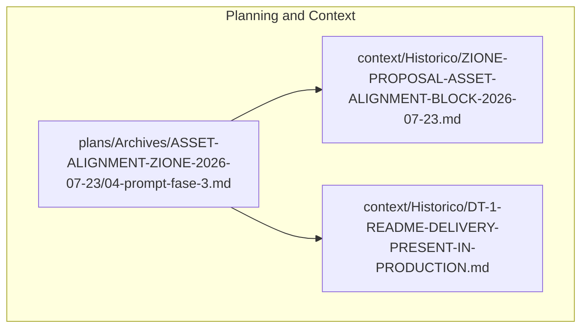
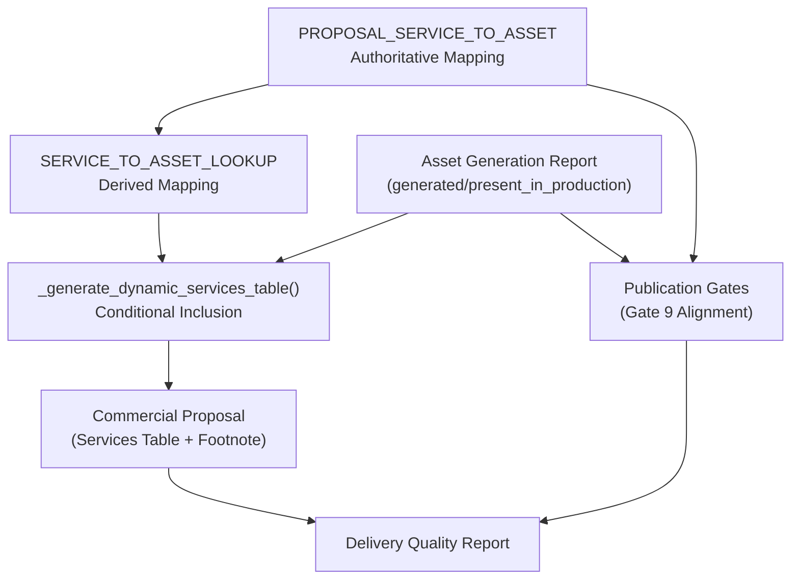
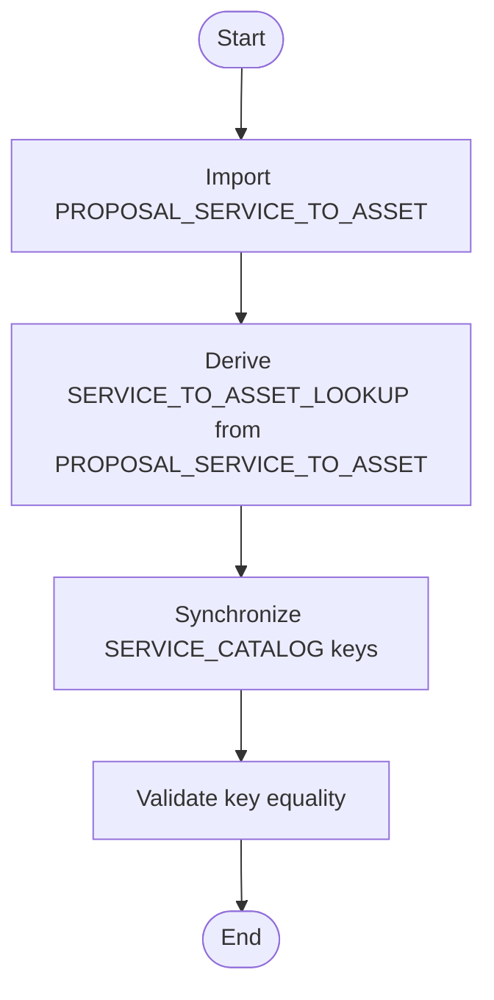
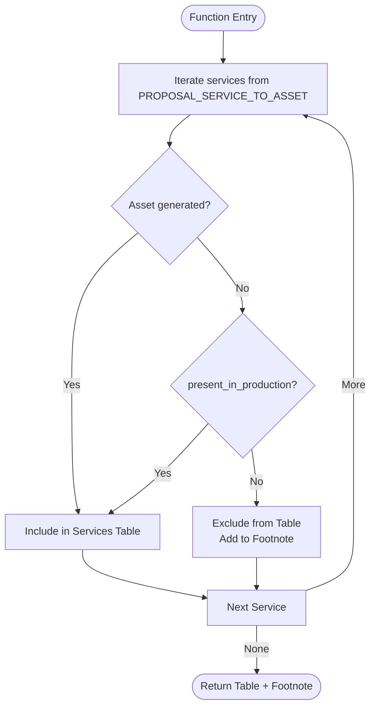
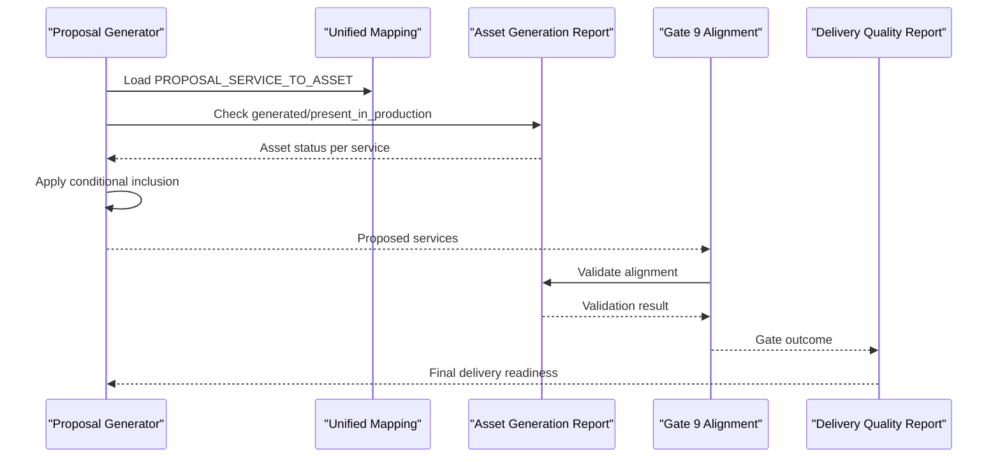
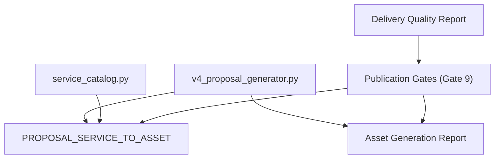

# Phase 3: Proposal Unification and Conditional Logic

<cite>
**Referenced Files in This Document**
- [04-prompt-fase-3.md](file://plans/Archives/ASSET-ALIGNMENT-ZIONE-2026-07-23/04-prompt-fase-3.md)
- [ZIONE-PROPOSAL-ASSET-ALIGNMENT-BLOCK-2026-07-23.md](file://context/Historico/ZIONE-PROPOSAL-ASSET-ALIGNMENT-BLOCK-2026-07-23.md)
- [DT-1-README-DELIVERY-PRESENT-IN-PRODUCTION.md](file://context/Historico/DT-1-README-DELIVERY-PRESENT-IN-PRODUCTION.md)
</cite>

## Table of Contents
1. [Introduction](#introduction)
2. [Project Structure](#project-structure)
3. [Core Components](#core-components)
4. [Architecture Overview](#architecture-overview)
5. [Detailed Component Analysis](#detailed-component-analysis)
6. [Dependency Analysis](#dependency-analysis)
7. [Performance Considerations](#performance-considerations)
8. [Troubleshooting Guide](#troubleshooting-guide)
9. [Conclusion](#conclusion)
10. [Appendices](#appendices)

## Introduction
Phase 3 addresses two intertwined problems that caused asset alignment failures:
- Three divergent sources of truth for service-to-asset mappings (PROPOSAL_SERVICE_TO_ASSET, SERVICE_CATALOG, and SERVICE_TO_ASSET_LOOKUP) created inconsistencies across proposal generation, quality reporting, and gate validation.
- The commercial proposal promised services without verifying whether the corresponding assets were generated or present in production, leading to misleading “pending” or “completed” states.

This phase unifies the authoritative mapping into a single source derived from PROPOSAL_SERVICE_TO_ASSET and introduces conditional proposal logic so that only services with deliverable assets (generated or present_in_production) are promised. It also defines safety net mechanisms to prevent proposals from promising services without deliverable assets, along with migration guidance for consumers and a testing strategy to validate the changes.

## Project Structure
The relevant artifacts for Phase 3 are documented in planning and context files within this repository. These files describe the problem space, the required changes, and the acceptance criteria for implementation and testing.

**Diagram sources**
- [04-prompt-fase-3.md](file://plans/Archives/ASSET-ALIGNMENT-ZIONE-2026-07-23/04-prompt-fase-3.md)
- [ZIONE-PROPOSAL-ASSET-ALIGNMENT-BLOCK-2026-07-23.md](file://context/Historico/ZIONE-PROPOSAL-ASSET-ALIGNMENT-BLOCK-2026-07-23.md)
- [DT-1-README-DELIVERY-PRESENT-IN-PRODUCTION.md](file://context/Historico/DT-1-README-DELIVERY-PRESENT-IN-PRODUCTION.md)

**Section sources**
- [04-prompt-fase-3.md](file://plans/Archives/ASSET-ALIGNMENT-ZIONE-2026-07-23/04-prompt-fase-3.md)
- [ZIONE-PROPOSAL-ASSET-ALIGNMENT-BLOCK-2026-07-23.md](file://context/Historico/ZIONE-PROPOSAL-ASSET-ALIGNMENT-BLOCK-2026-07-23.md)
- [DT-1-README-DELIVERY-PRESENT-IN-PRODUCTION.md](file://context/Historico/DT-1-README-DELIVERY-PRESENT-IN-PRODUCTION.md)

## Core Components
Phase 3 focuses on three core components:
- Unified service-to-asset mapping: Derive SERVICE_TO_ASSET_LOOKUP from PROPOSAL_SERVICE_TO_ASSET to establish a single authoritative source.
- Conditional proposal logic: Modify the dynamic services table generation to include only services with assets generated or marked present_in_production; exclude others and list them in a footnote.
- Safety nets and gates: Ensure publication gates and delivery reports reflect the unified mapping and conditional promises, preventing misalignment between promises and deliverables.

Key acceptance criteria:
- Only services with generated assets or present_in_production appear as promised in the proposal.
- Excluded services are listed in a footnote rather than shown as pending.
- SERVICE_TO_ASSET_LOOKUP has the same keys as PROPOSAL_SERVICE_TO_ASSET.
- Tests validate both conditional behavior and unified mapping.

**Section sources**
- [04-prompt-fase-3.md](file://plans/Archives/ASSET-ALIGNMENT-ZIONE-2026-07-23/04-prompt-fase-3.md)

## Architecture Overview
The architecture centers around a single authoritative mapping and conditional promise enforcement. The proposal generator consults the unified mapping and asset presence data before including services in the final proposal. Publication gates validate alignment against the unified mapping and asset generation results.

**Diagram sources**
- [04-prompt-fase-3.md](file://plans/Archives/ASSET-ALIGNMENT-ZIONE-2026-07-23/04-prompt-fase-3.md)
- [ZIONE-PROPOSAL-ASSET-ALIGNMENT-BLOCK-2026-07-23.md](file://context/Historico/ZIONE-PROPOSAL-ASSET-ALIGNMENT-BLOCK-2026-07-23.md)
- [DT-1-README-DELIVERY-PRESENT-IN-PRODUCTION.md](file://context/Historico/DT-1-README-DELIVERY-PRESENT-IN-PRODUCTION.md)

## Detailed Component Analysis

### Unified Mapping Strategy
Objective: Eliminate divergence by deriving SERVICE_TO_ASSET_LOOKUP from PROPOSAL_SERVICE_TO_ASSET. This ensures all downstream consumers reference the same set of services and assets.

Implementation pattern:
- Import PROPOSAL_SERVICE_TO_ASSET into the service catalog module.
- Define SERVICE_TO_ASSET_LOOKUP as a direct derivation or alias of PROPOSAL_SERVICE_TO_ASSET.
- Synchronize SERVICE_CATALOG keys to match PROPOSAL_SERVICE_TO_ASSET; move or remove extra entries not aligned with the authoritative mapping.

Validation:
- Assert equality of key sets between SERVICE_TO_ASSET_LOOKUP and PROPOSAL_SERVICE_TO_ASSET.
- Confirm that _generate_asset_quality_table() iterates over the same source as _generate_dynamic_services_table().

**Diagram sources**
- [04-prompt-fase-3.md](file://plans/Archives/ASSET-ALIGNMENT-ZIONE-2026-07-23/04-prompt-fase-3.md)

**Section sources**
- [04-prompt-fase-3.md](file://plans/Archives/ASSET-ALIGNMENT-ZIONE-2026-07-23/04-prompt-fase-3.md)

### Conditional Proposal Logic
Objective: Ensure the proposal only promises services when their corresponding assets are generated or present_in_production. Services without deliverable assets should be excluded from the main table and listed in a footnote.

Processing logic:
- For each service in the authoritative mapping:
  - Check if the asset was generated (via asset_generation_report or asset_types).
  - Check if the service is marked present_in_production.
  - If neither condition holds, exclude the service from the main table and add it to the footnote list.
  - Otherwise, include the service with appropriate status (“Completed” or “Present in Production”).

**Diagram sources**
- [04-prompt-fase-3.md](file://plans/Archives/ASSET-ALIGNMENT-ZIONE-2026-07-23/04-prompt-fase-3.md)

**Section sources**
- [04-prompt-fase-3.md](file://plans/Archives/ASSET-ALIGNMENT-ZIONE-2026-07-23/04-prompt-fase-3.md)

### Safety Net Mechanisms
Safety nets ensure that proposals cannot promise services without deliverable assets:
- Gate 9 alignment validates that promised services align with generated assets or present_in_production status.
- Delivery quality reports incorporate gate outcomes and asset generation results to reflect true delivery readiness.
- Consistency checks across asset_generation_report, gate_report, and coherence_validation prevent contradictory states.

**Diagram sources**
- [04-prompt-fase-3.md](file://plans/Archives/ASSET-ALIGNMENT-ZIONE-2026-07-23/04-prompt-fase-3.md)
- [ZIONE-PROPOSAL-ASSET-ALIGNMENT-BLOCK-2026-07-23.md](file://context/Historico/ZIONE-PROPOSAL-ASSET-ALIGNMENT-BLOCK-2026-07-23.md)
- [DT-1-README-DELIVERY-PRESENT-IN-PRODUCTION.md](file://context/Historico/DT-1-README-DELIVERY-PRESENT-IN-PRODUCTION.md)

**Section sources**
- [04-prompt-fase-3.md](file://plans/Archives/ASSET-ALIGNMENT-ZIONE-2026-07-23/04-prompt-fase-3.md)
- [ZIONE-PROPOSAL-ASSET-ALIGNMENT-BLOCK-2026-07-23.md](file://context/Historico/ZIONE-PROPOSAL-ASSET-ALIGNMENT-BLOCK-2026-07-23.md)
- [DT-1-README-DELIVERY-PRESENT-IN-PRODUCTION.md](file://context/Historico/DT-1-README-DELIVERY-PRESENT-IN-PRODUCTION.md)

## Dependency Analysis
Phase 3 introduces dependencies between modules to enforce consistency:
- v4_proposal_generator.py depends on PROPOSAL_SERVICE_TO_ASSET and asset generation reports.
- service_catalog.py imports PROPOSAL_SERVICE_TO_ASSET to derive SERVICE_TO_ASSET_LOOKUP.
- Publication gates depend on unified mapping and asset generation results to validate alignment.

**Diagram sources**
- [04-prompt-fase-3.md](file://plans/Archives/ASSET-ALIGNMENT-ZIONE-2026-07-23/04-prompt-fase-3.md)
- [ZIONE-PROPOSAL-ASSET-ALIGNMENT-BLOCK-2026-07-23.md](file://context/Historico/ZIONE-PROPOSAL-ASSET-ALIGNMENT-BLOCK-2026-07-23.md)
- [DT-1-README-DELIVERY-PRESENT-IN-PRODUCTION.md](file://context/Historico/DT-1-README-DELIVERY-PRESENT-IN-PRODUCTION.md)

**Section sources**
- [04-prompt-fase-3.md](file://plans/Archives/ASSET-ALIGNMENT-ZIONE-2026-07-23/04-prompt-fase-3.md)

## Performance Considerations
- Deriving SERVICE_TO_ASSET_LOOKUP from PROPOSAL_SERVICE_TO_ASSET at import time avoids runtime computation overhead.
- Conditional inclusion in proposal generation adds minimal per-service checks but prevents unnecessary rendering of excluded services.
- Gate validation remains efficient by leveraging precomputed asset generation reports and unified mapping.

[No sources needed since this section provides general guidance]

## Troubleshooting Guide
Common issues and resolutions:
- Divergent keys between SERVICE_TO_ASSET_LOOKUP and PROPOSAL_SERVICE_TO_ASSET: Ensure derivation occurs at import and synchronize SERVICE_CATALOG keys.
- Services appearing as pending without deliverable assets: Verify conditional logic includes checks for generated assets and present_in_production status.
- Misaligned gate outcomes: Cross-check asset_generation_report, gate_report, and coherence_validation for consistency.

**Section sources**
- [04-prompt-fase-3.md](file://plans/Archives/ASSET-ALIGNMENT-ZIONE-2026-07-23/04-prompt-fase-3.md)
- [ZIONE-PROPOSAL-ASSET-ALIGNMENT-BLOCK-2026-07-23.md](file://context/Historico/ZIONE-PROPOSAL-ASSET-ALIGNMENT-BLOCK-2026-07-23.md)
- [DT-1-README-DELIVERY-PRESENT-IN-PRODUCTION.md](file://context/Historico/DT-1-README-DELIVERY-PRESENT-IN-PRODUCTION.md)

## Conclusion
Phase 3 establishes a single authoritative source for service-to-asset mappings and enforces conditional proposal logic to prevent promises without deliverable assets. By deriving SERVICE_TO_ASSET_LOOKUP from PROPOSAL_SERVICE_TO_ASSET and implementing robust safety nets through publication gates and delivery reports, the system resolves inconsistencies that previously caused asset alignment failures. The provided migration strategy and testing approach ensure smooth adoption and validation of these changes.

[No sources needed since this section summarizes without analyzing specific files]

## Appendices
- Migration strategy: Update consumers to rely on SERVICE_TO_ASSET_LOOKUP derived from PROPOSAL_SERVICE_TO_ASSET; remove direct references to SERVICE_CATALOG for service lists.
- Testing approach: Implement tests for conditional services inclusion and unified mapping equality; run existing proposal and alignment tests to confirm no regressions.

[No sources needed since this section provides general guidance]