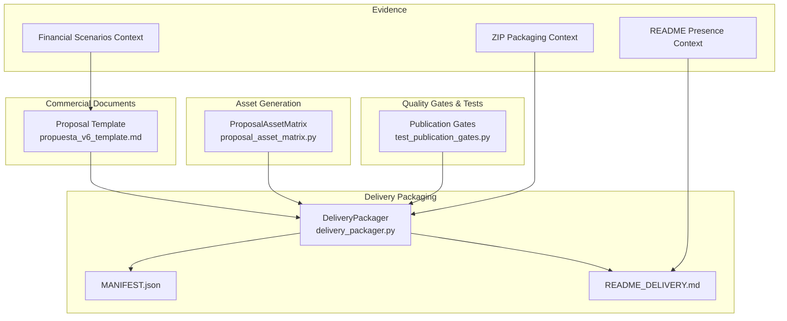
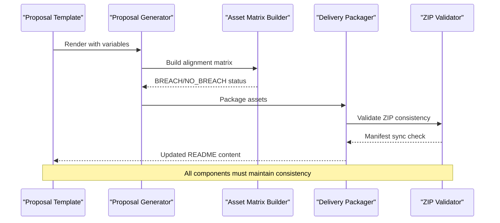
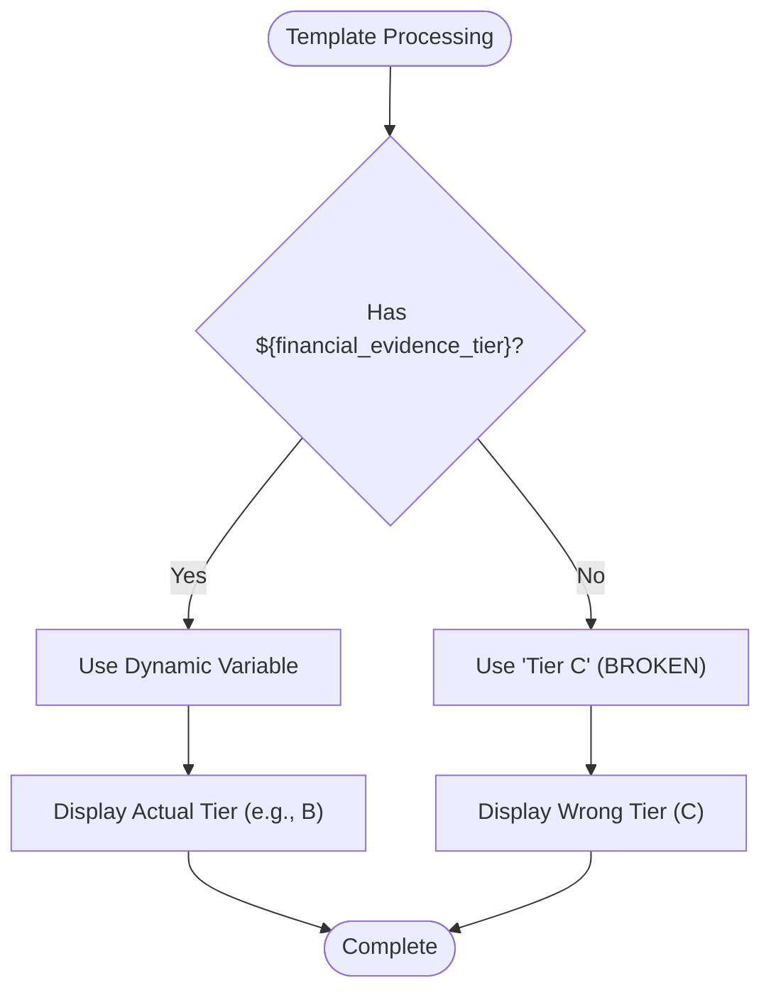
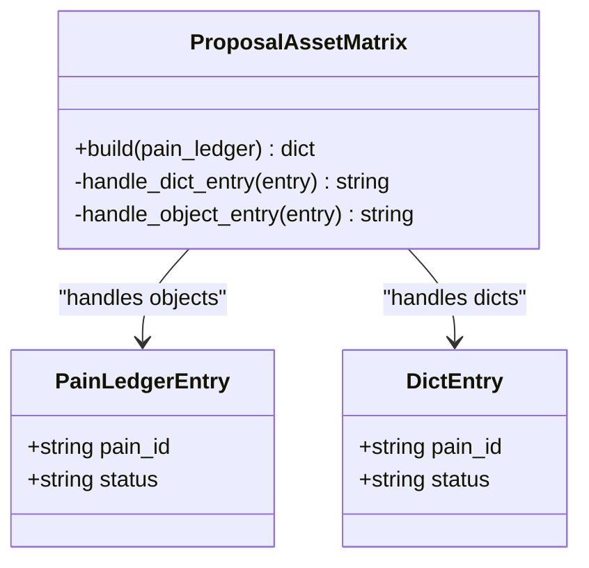
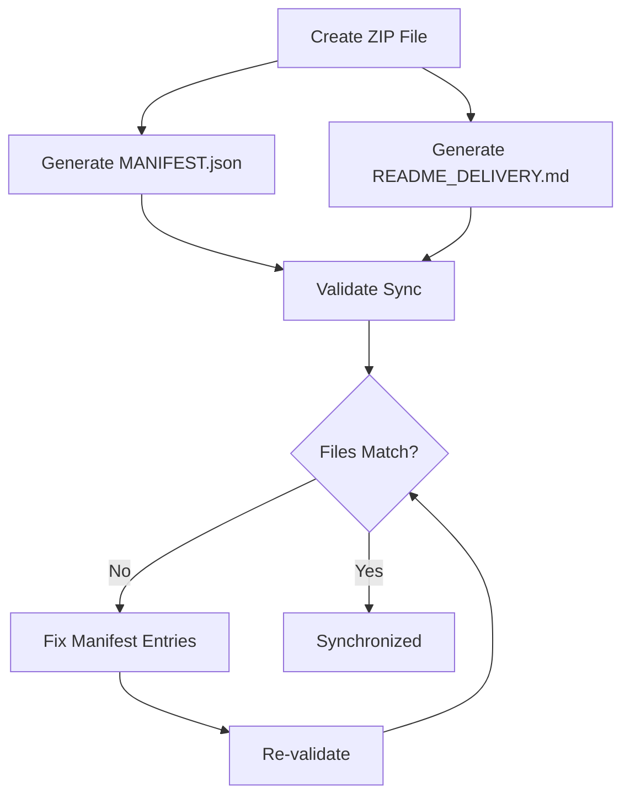
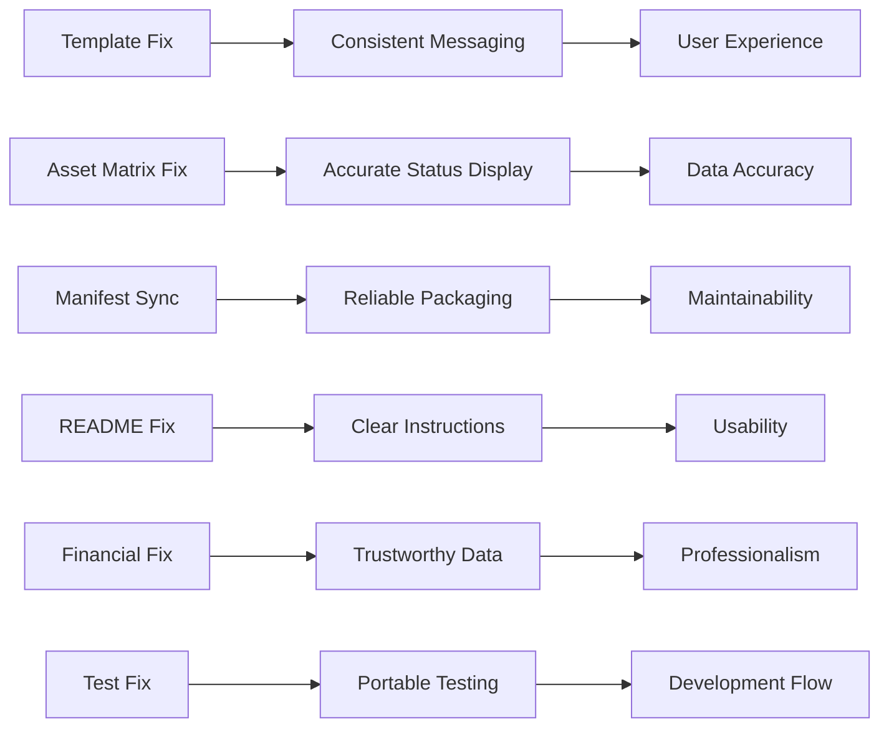

# Phase 4: Presentation Fixes and Minor Bug Corrections

<cite>
**Referenced Files in This Document**
- [05-prompt-fase-4.md](file://plans\Archives\ASSET-ALIGNMENT-ZIONE-2026-07-23\05-prompt-fase-4.md)
- [DT-1-README-DELIVERY-PRESENT-IN-PRODUCTION.md](file://context\Historico\DT-1-README-DELIVERY-PRESENT-IN-PRODUCTION.md)
- [CONTEXT-DELIVERY-ZIP-PACKAGING-BROKEN-2026-08-01.md](file://context\CONTEXT-DELIVERY-ZIP-PACKAGING-BROKEN-2026-08-01.md)
- [03-prompt-fase-B.md](file://plans\Archives\DT-1-DELIVERY-CONTRACT-2026-07-23\03-prompt-fase-B.md)
- [05-prompt-fase-D.md](file://plans\Archives\DT-1-DELIVERY-CONTRACT-2026-07-23\05-prompt-fase-D.md)
- [ZIONE-PROPOSAL-ASSET-ALIGNMENT-BLOCK-2026-07-23.md](file://context\Historico\ZIONE-PROPOSAL-ASSET-ALIGNMENT-BLOCK-2026-07-23.md)
</cite>

## Table of Contents
1. [Introduction](#introduction)
2. [Project Structure](#project-structure)
3. [Core Components](#core-components)
4. [Architecture Overview](#architecture-overview)
5. [Detailed Component Analysis](#detailed-component-analysis)
6. [Dependency Analysis](#dependency-analysis)
7. [Performance Considerations](#performance-considerations)
8. [Troubleshooting Guide](#troubleshooting-guide)
9. [Conclusion](#conclusion)

## Introduction
Phase 4 focuses on six targeted presentation fixes and minor bug corrections that improve the quality, accuracy, and maintainability of delivered assets. The fixes address template hardcoding, serialization issues in asset matrices, synchronization between manifests and ZIP contents, README references to non-existent files, misleading financial figures, and a broken test with hardcoded paths. These changes enhance user experience by ensuring consistent messaging, accurate data representation, and reliable delivery packaging.

## Project Structure
Phase 4 spans multiple modules and evidence artifacts:
- Commercial documents templates for proposal generation
- Asset generation logic for alignment reporting
- Delivery packaging for ZIP creation and manifest validation
- Quality gates and tests for publication readiness
- Evidence reports documenting discrepancies and validations

**Diagram sources**
- [05-prompt-fase-4.md](file://plans\Archives\ASSET-ALIGNMENT-ZIONE-2026-07-23\05-prompt-fase-4.md)
- [DT-1-README-DELIVERY-PRESENT-IN-PRODUCTION.md](file://context\Historico\DT-1-README-DELIVERY-PRESENT-IN-PRODUCTION.md)
- [CONTEXT-DELIVERY-ZIP-PACKAGING-BROKEN-2026-08-01.md](file://context\CONTEXT-DELIVERY-ZIP-PACKAGING-BROKEN-2026-08-01.md)

**Section sources**
- [05-prompt-fase-4.md](file://plans\Archives\ASSET-ALIGNMENT-ZIONE-2026-07-23\05-prompt-fase-4.md)

## Core Components
The six fixes target specific components:
1. Proposal template variable substitution for evidence tier
2. Asset matrix serialization handling for breach statuses
3. Manifest and README synchronization with ZIP contents
4. README reference correction for non-existent files
5. Financial figure accuracy in proposals
6. Test path hardcoding resolution

These components work together to ensure consistent output across all deliverables.

**Section sources**
- [05-prompt-fase-4.md](file://plans\Archives\ASSET-ALIGNMENT-ZIONE-2026-07-23\05-prompt-fase-4.md)

## Architecture Overview
The Phase 4 architecture involves template processing, asset generation, packaging, and validation workflows that must remain synchronized.

**Diagram sources**
- [05-prompt-fase-4.md](file://plans\Archives\ASSET-ALIGNMENT-ZIONE-2026-07-23\05-prompt-fase-4.md)
- [03-prompt-fase-B.md](file://plans\Archives\DT-1-DELIVERY-CONTRACT-2026-07-23\03-prompt-fase-B.md)

## Detailed Component Analysis

### Template Variable Substitution Fix
The proposal template was using hardcoded "Tier C" text instead of dynamic variable substitution. This fix ensures the evidence tier is correctly displayed based on the actual assessment data.

**Diagram sources**
- [05-prompt-fase-4.md](file://plans\Archives\ASSET-ALIGNMENT-ZIONE-2026-07-23\05-prompt-fase-4.md)

**Section sources**
- [05-prompt-fase-4.md](file://plans\Archives\ASSET-ALIGNMENT-ZIONE-2026-07-23\05-prompt-fase-4.md)

### Asset Matrix Serialization Fix
The ProposalAssetMatrix.build() method was failing to handle dictionary inputs from serialized pain_ledger entries, causing all statuses to show as NO_BREACH instead of actual BREACH values.

**Diagram sources**
- [05-prompt-fase-4.md](file://plans\Archives\ASSET-ALIGNMENT-ZIONE-2026-07-23\05-prompt-fase-4.md)

**Section sources**
- [05-prompt-fase-4.md](file://plans\Archives\ASSET-ALIGNMENT-ZIONE-2026-07-23\05-prompt-fase-4.md)

### Manifest and README Synchronization
The MANIFEST.json and README_DELIVERY.md files were not synchronized with actual ZIP contents, causing confusion about available assets and file sizes.

**Diagram sources**
- [CONTEXT-DELIVERY-ZIP-PACKAGING-BROKEN-2026-08-01.md](file://context\CONTEXT-DELIVERY-ZIP-PACKAGING-BROKEN-2026-08-01.md)
- [03-prompt-fase-B.md](file://plans\Archives\DT-1-DELIVERY-CONTRACT-2026-07-23\03-prompt-fase-B.md)

**Section sources**
- [CONTEXT-DELIVERY-ZIP-PACKAGING-BROKEN-2026-08-01.md](file://context\CONTEXT-DELIVERY-ZIP-PACKAGING-BROKEN-2026-08-01.md)
- [03-prompt-fase-B.md](file://plans\Archives\DT-1-DELIVERY-CONTRACT-2026-07-23\03-prompt-fase-B.md)

### README Reference Correction
The README_DELIVERY.md was referencing a non-existent file `boton_whatsapp.html`, creating confusion for users trying to implement assets that are already present in production.

**Section sources**
- [DT-1-README-DELIVERY-PRESENT-IN-PRODUCTION.md](file://context\Historico\DT-1-README-DELIVERY-PRESENT-IN-PRODUCTION.md)

### Financial Figure Accuracy
The proposal contained misleading financial figures, specifically showing $7,192,000 as OTA commission when the actual commission was $20,880,000. This fix ensures accurate financial representation.

**Section sources**
- [ZIONE-PROPOSAL-ASSET-ALIGNMENT-BLOCK-2026-07-23.md](file://context\Historico\ZIONE-PROPOSAL-ASSET-ALIGNMENT-BLOCK-2026-07-23.md)

### Test Path Hardcoding Fix
The test in test_publication_gates.py was using hardcoded paths that broke when executed in different environments. This fix makes the test portable across environments.

**Section sources**
- [05-prompt-fase-4.md](file://plans\Archives\ASSET-ALIGNMENT-ZIONE-2026-07-23\05-prompt-fase-4.md)

## Dependency Analysis
The Phase 4 fixes have specific dependencies and interactions between components:

**Diagram sources**
- [05-prompt-fase-4.md](file://plans\Archives\ASSET-ALIGNMENT-ZIONE-2026-07-23\05-prompt-fase-4.md)

**Section sources**
- [05-prompt-fase-4.md](file://plans\Archives\ASSET-ALIGNMENT-ZIONE-2026-07-23\05-prompt-fase-4.md)

## Performance Considerations
The Phase 4 fixes are primarily presentation and data accuracy improvements that have minimal performance impact. However, they significantly improve:
- User trust through accurate data representation
- Maintainability through consistent variable usage
- Reliability through proper synchronization checks
- Portability through environment-independent testing

## Troubleshooting Guide
Common issues and their resolutions:

1. **Template shows wrong tier**: Ensure `${financial_evidence_tier}` variable is properly substituted
2. **Asset matrix shows all NO_BREACH**: Verify pain_ledger serialization format handling
3. **Manifest doesn't match ZIP**: Run validation checks after package creation
4. **README references missing files**: Update instructions to reflect actual asset availability
5. **Incorrect financial figures**: Cross-check calculations with source data
6. **Tests fail with path errors**: Use relative paths or environment variables

**Section sources**
- [05-prompt-fase-4.md](file://plans\Archives\ASSET-ALIGNMENT-ZIONE-2026-07-23\05-prompt-fase-4.md)

## Conclusion
Phase 4 delivers six critical fixes that collectively improve the quality, accuracy, and maintainability of the iah-cli system. By addressing template hardcoding, serialization issues, synchronization problems, reference errors, financial inaccuracies, and test portability, these fixes ensure that delivered assets are reliable, trustworthy, and easy to maintain. The improvements enhance user experience through consistent messaging, accurate data representation, and clear instructions while maintaining technical excellence through proper code practices and testing standards.