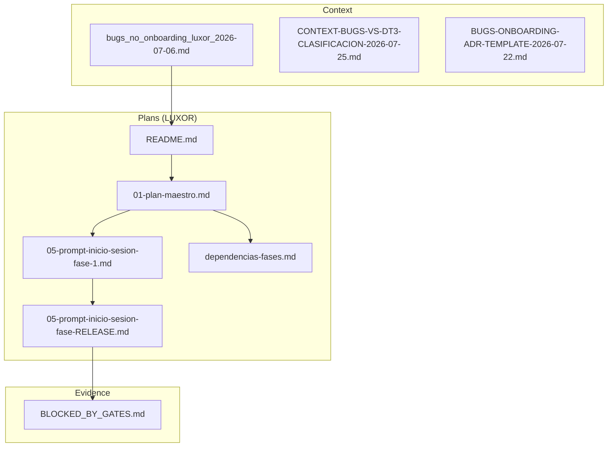
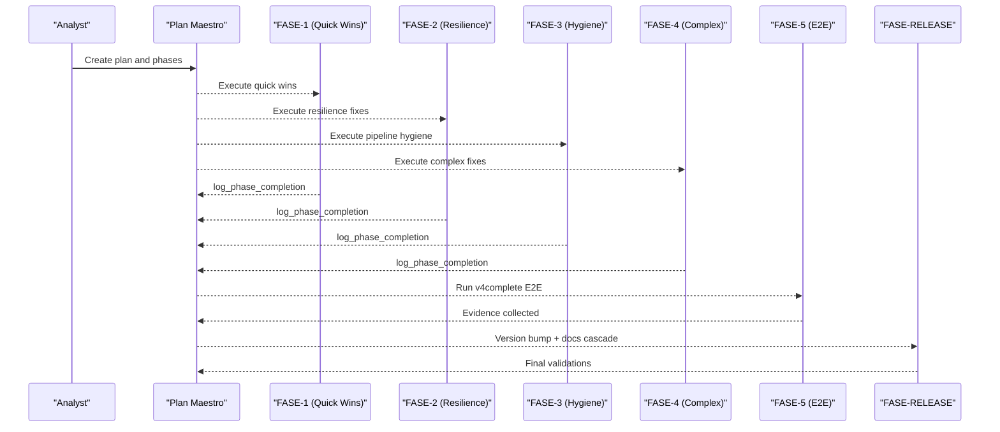
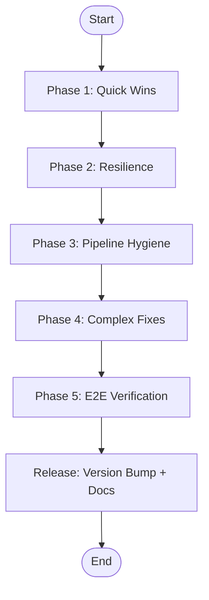
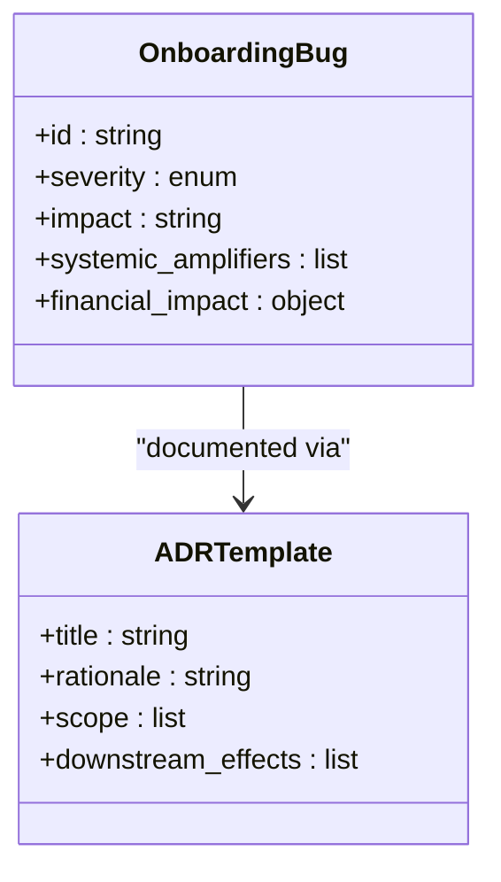
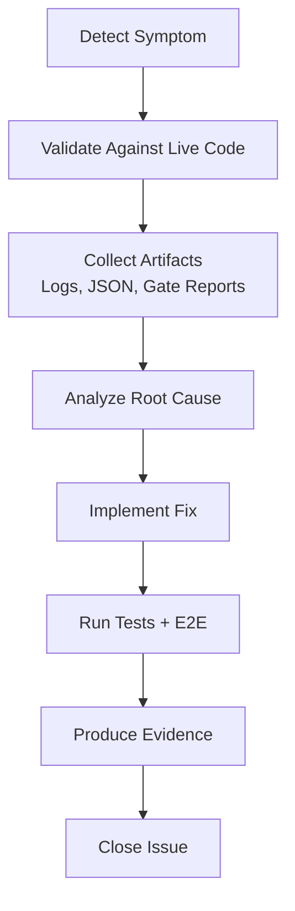
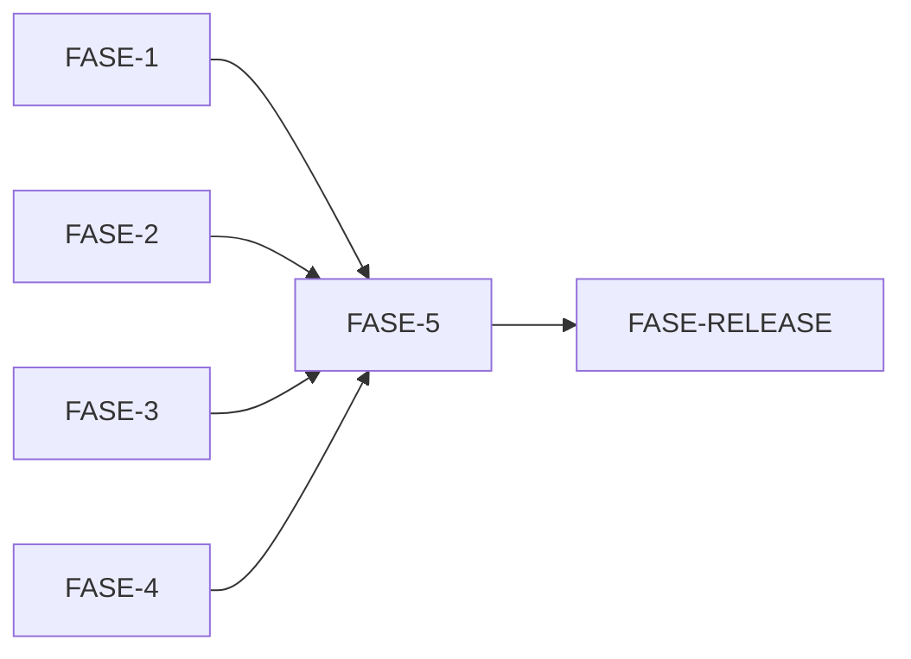

# Bug Fix Workflows and Quality Assurance

<cite>
**Referenced Files in This Document**
- [bugs_no_onboarding_luxor_2026-07-06.md](file://context\Historico\bugs_no_onboarding_luxor_2026-07-06.md)
- [README.md](file://plans\Archives\BUGFIX-LUXOR-2026-07-06\README.md)
- [01-plan-maestro.md](file://plans\Archives\BUGFIX-LUXOR-2026-07-06\01-plan-maestro.md)
- [05-prompt-inicio-sesion-fase-1.md](file://plans\Archives\BUGFIX-LUXOR-2026-07-06\05-prompt-inicio-sesion-fase-1.md)
- [05-prompt-inicio-sesion-fase-RELEASE.md](file://plans\Archives\BUGFIX-LUXOR-2026-07-06\05-prompt-inicio-sesion-fase-RELEASE.md)
- [dependencias-fases.md](file://plans\Archives\BUGFIX-LUXOR-2026-07-06\dependencias-fases.md)
- [CONTEXT-BUGS-VS-DT3-CLASIFICACION-2026-07-25.md](file://context\Historico\CONTEXT-BUGS-VS-DT3-CLASIFICACION-2026-07-25.md)
- [BUGS-ONBOARDING-ADR-TEMPLATE-2026-07-22.md](file://context\Historico\BUGS-ONBOARDING-ADR-TEMPLATE-2026-07-22.md)
- [BLOCKED_BY_GATES.md](file://plans\Archives\DT-4-ROOT-CAUSE-2026-07-25\evidence\BLOCKED_BY_GATES.md)
</cite>

## Table of Contents
1. Introduction
2. Project Structure
3. Core Components
4. Architecture Overview
5. Detailed Component Analysis
6. Dependency Analysis
7. Performance Considerations
8. Troubleshooting Guide
9. Conclusion

## Introduction
This document explains the structured bug fix workflows and quality assurance processes used in the iah-cli project, centered on the LUXOR bugfix methodology. It details how bugs are identified, prioritized, and resolved through phased implementation plans; describes the five-phase approach from initial session setup to release validation; documents the onboarding bug classification system and ADR templates; and outlines evidence-based debugging procedures, common bug patterns, root cause analysis techniques, prevention strategies, quality gates, testing procedures, and validation steps that ensure fixes do not introduce new issues. It also clarifies the relationship between bug reports, implementation plans, and evidence collection, and shows how the workflow maintains code quality while addressing critical issues efficiently.

## Project Structure
The repository organizes bug-fix efforts under .opencode with:
- context/: Forensic analyses, classifications, and ADR templates for bugs and onboarding issues.
- plans/Archives/: Phased implementation plans per bug or feature, including master plans, phase prompts, checklists, dependencies, and post-implementation analysis.
- Evidence artifacts (JSON, logs, gate reports) produced by v4complete runs and quality gates.

**Diagram sources**
- [README.md](file://plans\Archives\BUGFIX-LUXOR-2026-07-06\README.md)
- [01-plan-maestro.md](file://plans\Archives\BUGFIX-LUXOR-2026-07-06\01-plan-maestro.md)
- [05-prompt-inicio-sesion-fase-1.md](file://plans\Archives\BUGFIX-LUXOR-2026-07-06\05-prompt-inicio-sesion-fase-1.md)
- [05-prompt-inicio-sesion-fase-RELEASE.md](file://plans\Archives\BUGFIX-LUXOR-2026-07-06\05-prompt-inicio-sesion-fase-RELEASE.md)
- [dependencias-fases.md](file://plans\Archives\BUGFIX-LUXOR-2026-07-06\dependencias-fases.md)
- [BLOCKED_BY_GATES.md](file://plans\Archives\DT-4-ROOT-CAUSE-2026-07-25\evidence\BLOCKED_BY_GATES.md)

**Section sources**
- [README.md](file://plans\Archives\BUGFIX-LUXOR-2026-07-06\README.md)
- [01-plan-maestro.md](file://plans\Archives\BUGFIX-LUXOR-2026-07-06\01-plan-maestro.md)

## Core Components
- LUXOR Five-Phase Methodology:
  - Phase 1: Quick wins (low-risk fixes).
  - Phase 2: Resilience improvements (e.g., LLM provider configuration).
  - Phase 3: Pipeline hygiene (dead code removal, ordering fixes).
  - Phase 4: Complex technical fixes (e.g., SPA rendering fallback).
  - Phase 5: End-to-end verification using v4complete.
  - Release: Version bump, documentation cascade, validations.
- Onboarding Bug Classification System:
  - Categorization of onboarding-related defects, systemic amplifiers, and financial implications.
  - ADR template usage to capture decisions and traceability.
- Evidence-Based Debugging:
  - Validate against live code, collect execution logs, JSON outputs, and gate reports.
  - Use BLOCKED_BY_GATES.md and other artifacts to diagnose failures.
- Quality Gates and Testing:
  - Publication and delivery quality gates enforce coherence, coverage, evidence, and alignment.
  - Unit tests, regression tests, and E2E runs ensure fixes do not regress.

**Section sources**
- [01-plan-maestro.md](file://plans\Archives\BUGFIX-LUXOR-2026-07-06\01-plan-maestro.md)
- [BUGS-ONBOARDING-ADR-TEMPLATE-2026-07-22.md](file://context\Historico\BUGS-ONBOARDING-ADR-TEMPLATE-2026-07-22.md)
- [BLOCKED_BY_GATES.md](file://plans\Archives\DT-4-ROOT-CAUSE-2026-07-25\evidence\BLOCKED_BY_GATES.md)

## Architecture Overview
The LUXOR workflow orchestrates bug identification, planning, phased implementation, and release validation. Each phase is a self-contained session with strict constraints (one phase per session, iteration limits, task limits), ensuring disciplined progress and traceability.

**Diagram sources**
- [01-plan-maestro.md](file://plans\Archives\BUGFIX-LUXOR-2026-07-06\01-plan-maestro.md)
- [05-prompt-inicio-sesion-fase-1.md](file://plans\Archives\BUGFIX-LUXOR-2026-07-06\05-prompt-inicio-sesion-fase-1.md)
- [05-prompt-inicio-sesion-fase-RELEASE.md](file://plans\Archives\BUGFIX-LUXOR-2026-07-06\05-prompt-inicio-sesion-fase-RELEASE.md)

## Detailed Component Analysis

### LUXOR Five-Phase Methodology
- Phase 1 (Quick Wins): Low-risk fixes such as removing invalid variable references and correcting hardcoded values. Includes targeted unit tests and immediate verification.
- Phase 2 (Resilience): Externalize configuration (e.g., model names) to registries and validate provider catalogs before changes.
- Phase 3 (Pipeline Hygiene): Remove dead code blocks and reorder execution to avoid ineffective gates.
- Phase 4 (Complex Fixes): Integrate runtime dependencies (e.g., Playwright) with graceful fallbacks and timeouts.
- Phase 5 (E2E Verification): Execute v4complete end-to-end, collect evidence, and analyze post-fix outcomes.
- Release: Synchronize versions across files, update CHANGELOG and technical guides, run all validations, and finalize documentation.

**Diagram sources**
- [01-plan-maestro.md](file://plans\Archives\BUGFIX-LUXOR-2026-07-06\01-plan-maestro.md)
- [README.md](file://plans\Archives\BUGFIX-LUXOR-2026-07-06\README.md)

**Section sources**
- [01-plan-maestro.md](file://plans\Archives\BUGFIX-LUXOR-2026-07-06\01-plan-maestro.md)
- [README.md](file://plans\Archives\BUGFIX-LUXOR-2026-07-06\README.md)

### Onboarding Bug Classification System and ADR Templates
- Classification captures severity, impact, and systemic amplifiers (e.g., divergent consumers, false confidence labels).
- ADR templates standardize decision records, capturing rationale, scope, and downstream effects.
- Financial implications are quantified to prioritize fixes that affect revenue projections and ROI calculations.

**Diagram sources**
- [BUGS-ONBOARDING-ADR-TEMPLATE-2026-07-22.md](file://context\Historico\BUGS-ONBOARDING-ADR-TEMPLATE-2026-07-22.md)

**Section sources**
- [BUGS-ONBOARDING-ADR-TEMPLATE-2026-07-22.md](file://context\Historico\BUGS-ONBOARDING-ADR-TEMPLATE-2026-07-22.md)

### Evidence-Based Debugging Procedures
- Validate findings against live code paths and execution logs.
- Collect JSON artifacts (gate reports, financial scenarios, audit reports) to triangulate root causes.
- Use BLOCKED_BY_GATES.md to identify blocking commercial and publication gates.

**Diagram sources**
- [bugs_no_onboarding_luxor_2026-07-06.md](file://context\Historico\bugs_no_onboarding_luxor_2026-07-06.md)
- [BLOCKED_BY_GATES.md](file://plans\Archives\DT-4-ROOT-CAUSE-2026-07-25\evidence\BLOCKED_BY_GATES.md)

**Section sources**
- [bugs_no_onboarding_luxor_2026-07-06.md](file://context\Historico\bugs_no_onboarding_luxor_2026-07-06.md)
- [BLOCKED_BY_GATES.md](file://plans\Archives\DT-4-ROOT-CAUSE-2026-07-25\evidence\BLOCKED_BY_GATES.md)

### Common Bug Patterns and Root Cause Analysis Techniques
- Hardcoded values vs. dynamic configuration: Replace hardcodes with registry-driven values.
- Dead code and ineffective gates: Remove or reorder execution blocks to ensure meaningful checks.
- Divergent consumers: Unify data sources and taxonomies to prevent inconsistent outputs.
- False confidence labels: Ensure metadata reflects actual provenance of values.

Techniques include:
- Cross-referencing multiple sources (pain_ledger, asset matrices, skipped assets).
- Validating gate logic against expected statuses and enums.
- Quantifying financial impacts to prioritize fixes.

**Section sources**
- [CONTEXT-BUGS-VS-DT3-CLASIFICACION-2026-07-25.md](file://context\Historico\CONTEXT-BUGS-VS-DT3-CLASIFICACION-2026-07-25.md)
- [BUGS-ONBOARDING-ADR-TEMPLATE-2026-07-22.md](file://context\Historico\BUGS-ONBOARDING-ADR-TEMPLATE-2026-07-22.md)

### Prevention Strategies
- Enforce consistent taxonomies across modules (e.g., unified source labels).
- Add E2E tests covering onboarding → harness → JSON flows.
- Implement reconciliators post-orchestrator to consolidate multiple truth sources.
- Document and test default cases explicitly to avoid hidden assumptions.

**Section sources**
- [BUGS-ONBOARDING-ADR-TEMPLATE-2026-07-22.md](file://context\Historico\BUGS-ONBOARDING-ADR-TEMPLATE-2026-07-22.md)
- [CONTEXT-BUGS-VS-DT3-CLASIFICACION-2026-07-25.md](file://context\Historico\CONTEXT-BUGS-VS-DT3-CLASIFICACION-2026-07-25.md)

## Dependency Analysis
Phases are largely independent except for E2E verification and release, which depend on prior phases. File conflicts are minimal and resolvable due to non-overlapping edits.

**Diagram sources**
- [dependencias-fases.md](file://plans\Archives\BUGFIX-LUXOR-2026-07-06\dependencias-fases.md)
- [01-plan-maestro.md](file://plans\Archives\BUGFIX-LUXOR-2026-07-06\01-plan-maestro.md)

**Section sources**
- [dependencias-fases.md](file://plans\Archives\BUGFIX-LUXOR-2026-07-06\dependencias-fases.md)
- [01-plan-maestro.md](file://plans\Archives\BUGFIX-LUXOR-2026-07-06\01-plan-maestro.md)

## Performance Considerations
- Prioritize low-risk fixes first to deliver value quickly and reduce complexity for subsequent phases.
- Avoid introducing heavy dependencies without graceful fallbacks (e.g., SPA rendering with Playwright).
- Keep iteration budgets tight per phase to maintain focus and prevent scope creep.

[No sources needed since this section provides general guidance]

## Troubleshooting Guide
- Use BLOCKED_BY_GATES.md to identify blocking commercial and publication gates.
- Review gate reports and financial scenarios to understand why certain metrics fail.
- Re-run v4complete with updated configurations and verify logs for residual errors.

**Section sources**
- [BLOCKED_BY_GATES.md](file://plans\Archives\DT-4-ROOT-CAUSE-2026-07-25\evidence\BLOCKED_BY_GATES.md)

## Conclusion
The LUXOR methodology provides a disciplined, phased approach to bug fixing and quality assurance in iah-cli. By combining evidence-based debugging, robust quality gates, and structured implementation plans, the workflow ensures fixes are effective, verifiable, and free of regressions. The onboarding classification system and ADR templates enhance traceability and decision-making, while prevention strategies address systemic issues proactively.

[No sources needed since this section summarizes without analyzing specific files]