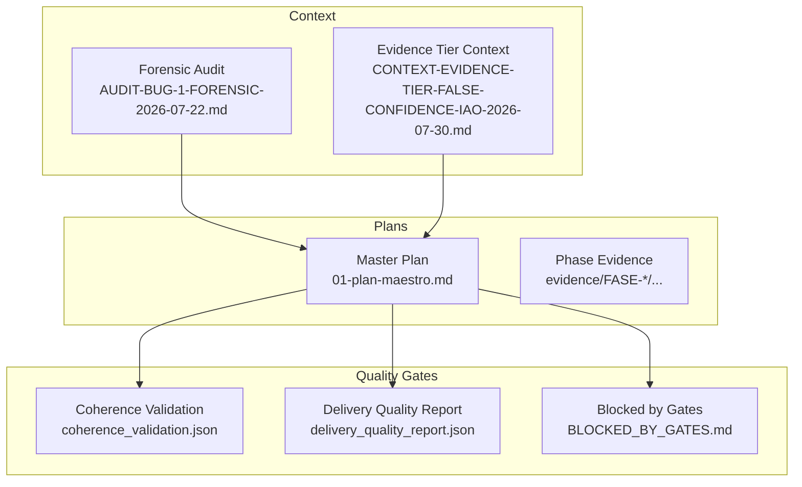
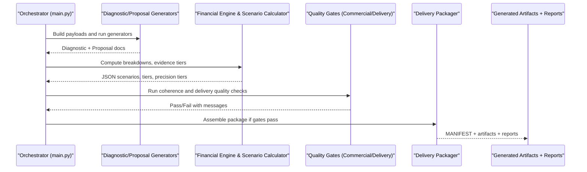
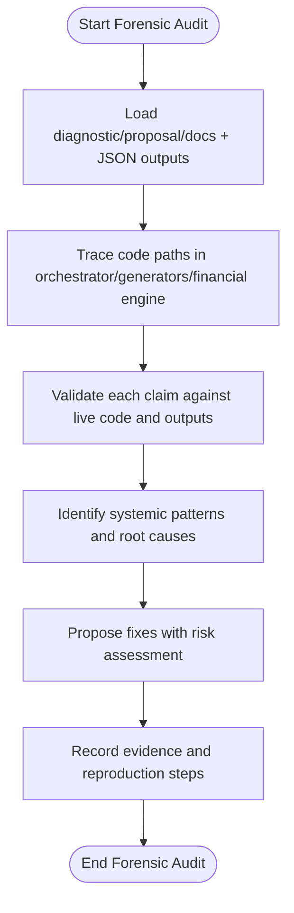
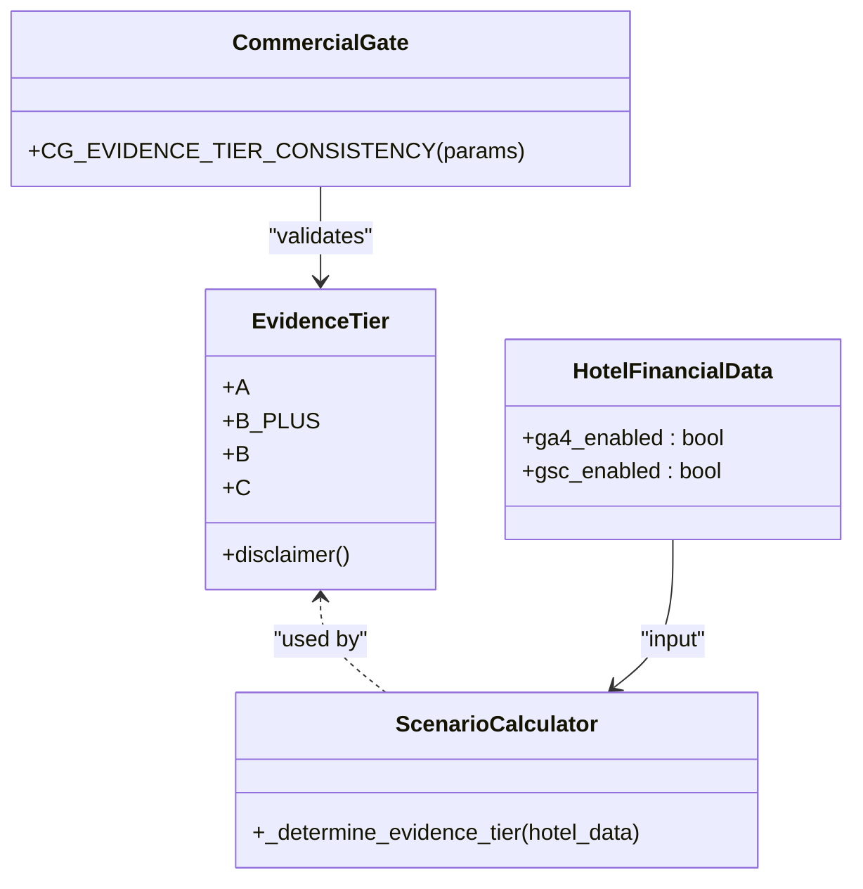
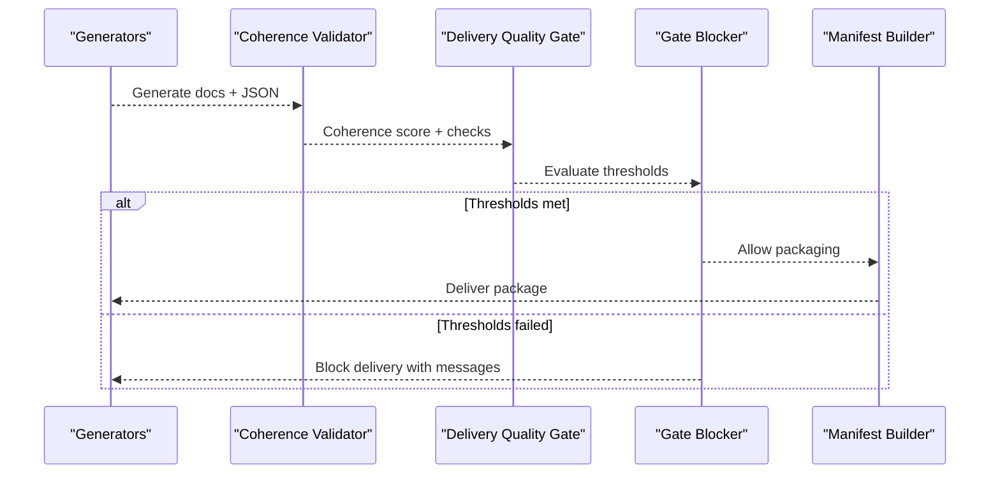

# Evidence-Based Debugging Procedures

<cite>
**Referenced Files in This Document**
- [CONTEXT-EVIDENCE-TIER-FALSE-CONFIDENCE-IAO-2026-07-30.md](file://context/CONTEXT-EVIDENCE-TIER-FALSE-CONFIDENCE-IAO-2026-07-30.md)
- [AUDIT-BUG-1-FORENSIC-2026-07-22.md](file://context/Historico/AUDIT-BUG-1-FORENSIC-2026-07-22.md)
- [01-plan-maestro.md](file://plans/Archives/EVIDENCE-TIER-FALSE-CONFIDENCE-IAO-2026-07-31/01-plan-maestro.md)
- [BLOCKED_BY_GATES.md](file://plans/Archives/EVIDENCE-TIER-FALSE-CONFIDENCE-IAO-2026-07-31/evidence/FASE-5/control-sin-onboarding/BLOCKED_BY_GATES.md)
- [coherence_validation.json](file://plans/Archives/DT-3-TECH-DEBT-2026-07-25/evidence/coherence_validation.json)
- [delivery_quality_report.json](file://plans/Archives/DT-4-ROOT-CAUSE-2026-07-25/evidence/delivery_quality_report.json)
</cite>

## Table of Contents
1. [Introduction](#introduction)
2. [Project Structure](#project-structure)
3. [Core Components](#core-components)
4. [Architecture Overview](#architecture-overview)
5. [Detailed Component Analysis](#detailed-component-analysis)
6. [Dependency Analysis](#dependency-analysis)
7. [Performance Considerations](#performance-considerations)
8. [Troubleshooting Guide](#troubleshooting-guide)
9. [Conclusion](#conclusion)
10. [Appendices](#appendices)

## Introduction
This document defines the evidence-based debugging procedures used across the iah-cli project to investigate, validate, and prevent recurring issues. It explains how evidence is collected, analyzed, and correlated; how logs are interpreted; and how automated quality gates integrate with the QA pipeline to block inconsistent or low-confidence outputs. The approach emphasizes forensic analysis techniques, standardized templates for evidence storage, and clear validation criteria that ensure delivered artifacts are consistent, auditable, and reproducible.

## Project Structure
The repository organizes evidence and plans under .opencode:
- context/: Forensic audits, bug investigations, and contextual analyses.
- plans/Archives/: Phase plans, prompts, checklists, and per-phase evidence directories.
- evidence files (JSON/MD): Coherence validations, delivery quality reports, gate reports, and financial scenarios.

**Diagram sources**
- [AUDIT-BUG-1-FORENSIC-2026-07-22.md](file://context/Historico/AUDIT-BUG-1-FORENSIC-2026-07-22.md)
- [CONTEXT-EVIDENCE-TIER-FALSE-CONFIDENCE-IAO-2026-07-30.md](file://context/CONTEXT-EVIDENCE-TIER-FALSE-CONFIDENCE-IAO-2026-07-30.md)
- [01-plan-maestro.md](file://plans/Archives/EVIDENCE-TIER-FALSE-CONFIDENCE-IAO-2026-07-31/01-plan-maestro.md)
- [coherence_validation.json](file://plans/Archives/DT-3-TECH-DEBT-2026-07-25/evidence/coherence_validation.json)
- [delivery_quality_report.json](file://plans/Archives/DT-4-ROOT-CAUSE-2026-07-25/evidence/delivery_quality_report.json)
- [BLOCKED_BY_GATES.md](file://plans/Archives/EVIDENCE-TIER-FALSE-CONFIDENCE-IAO-2026-07-31/evidence/FASE-5/control-sin-onboarding/BLOCKED_BY_GATES.md)

**Section sources**
- [CONTEXT-EVIDENCE-TIER-FALSE-CONFIDENCE-IAO-2026-07-30.md](file://context/CONTEXT-EVIDENCE-TIER-FALSE-CONFIDENCE-IAO-2026-07-30.md)
- [AUDIT-BUG-1-FORENSIC-2026-07-22.md](file://context/Historico/AUDIT-BUG-1-FORENSIC-2026-07-22.md)
- [01-plan-maestro.md](file://plans/Archives/EVIDENCE-TIER-FALSE-CONFIDENCE-IAO-2026-07-31/01-plan-maestro.md)

## Core Components
- Forensic audit documents: Provide step-by-step verification against live code, trace data flows, and identify systemic bugs.
- Master plan: Defines phases, affected files, risks, and DoD for fixing evidence tier inconsistencies and integrating gates.
- Quality gates: Coherence validation and delivery quality reports enforce consistency and asset alignment before delivery.
- Gate-blocked runs: Evidence of commercial and publication gates preventing delivery when thresholds are not met.

Key responsibilities:
- Collecting evidence from generated outputs (diagnostic, proposal, JSON reports).
- Interpreting logs and JSON metadata to detect contradictions and missing provenance.
- Correlating tiers, confidence levels, and data sources across modules.
- Enforcing pre-delivery checks via automated gates.

**Section sources**
- [CONTEXT-EVIDENCE-TIER-FALSE-CONFIDENCE-IAO-2026-07-30.md](file://context/CONTEXT-EVIDENCE-TIER-FALSE-CONFIDENCE-IAO-2026-07-30.md)
- [AUDIT-BUG-1-FORENSIC-2026-07-22.md](file://context/Historico/AUDIT-BUG-1-FORENSIC-2026-07-22.md)
- [01-plan-maestro.md](file://plans/Archives/EVIDENCE-TIER-FALSE-CONFIDENCE-IAO-2026-07-31/01-plan-maestro.md)

## Architecture Overview
The evidence-based debugging workflow integrates generation, validation, and delivery gating:

**Diagram sources**
- [01-plan-maestro.md](file://plans/Archives/EVIDENCE-TIER-FALSE-CONFIDENCE-IAO-2026-07-31/01-plan-maestro.md)
- [delivery_quality_report.json](file://plans/Archives/DT-4-ROOT-CAUSE-2026-07-25/evidence/delivery_quality_report.json)
- [coherence_validation.json](file://plans/Archives/DT-3-TECH-DEBT-2026-07-25/evidence/coherence_validation.json)

## Detailed Component Analysis

### Forensic Audit Process
- Stepwise verification against live code paths.
- Cross-checking claims with actual output files and logs.
- Identifying systemic patterns (e.g., mismatched vocabularies, false confidence labels).
- Producing actionable fixes prioritized by severity and impact.

**Section sources**
- [AUDIT-BUG-1-FORENSIC-2026-07-22.md](file://context/Historico/AUDIT-BUG-1-FORENSIC-2026-07-22.md)

### Evidence Tier Consistency and Honesty
- Root cause: Two code paths produce conflicting statements about GA4/GSC connectivity.
- Fix strategy: Unify truth source, introduce new tier B+ for onboarding without GA4/GSC, and add a gate to block inconsistent deliveries.
- Downstream consumers must be updated to support the new tier and dynamic disclaimers.

**Diagram sources**
- [CONTEXT-EVIDENCE-TIER-FALSE-CONFIDENCE-IAO-2026-07-30.md](file://context/CONTEXT-EVIDENCE-TIER-FALSE-CONFIDENCE-IAO-2026-07-30.md)
- [01-plan-maestro.md](file://plans/Archives/EVIDENCE-TIER-FALSE-CONFIDENCE-IAO-2026-07-31/01-plan-maestro.md)

**Section sources**
- [CONTEXT-EVIDENCE-TIER-FALSE-CONFIDENCE-IAO-2026-07-30.md](file://context/CONTEXT-EVIDENCE-TIER-FALSE-CONFIDENCE-IAO-2026-07-30.md)
- [01-plan-maestro.md](file://plans/Archives/EVIDENCE-TIER-FALSE-CONFIDENCE-IAO-2026-07-31/01-plan-maestro.md)

### Quality Gates Integration
- Coherence validation ensures assets are justified and financial data validated.
- Delivery quality report enforces coverage, asset alignment, and specificity thresholds.
- Blocked runs demonstrate commercial gates preventing delivery when ROI or messaging fails.

**Diagram sources**
- [coherence_validation.json](file://plans/Archives/DT-3-TECH-DEBT-2026-07-25/evidence/coherence_validation.json)
- [delivery_quality_report.json](file://plans/Archives/DT-4-ROOT-CAUSE-2026-07-25/evidence/delivery_quality_report.json)
- [BLOCKED_BY_GATES.md](file://plans/Archives/EVIDENCE-TIER-FALSE-CONFIDENCE-IAO-2026-07-31/evidence/FASE-5/control-sin-onboarding/BLOCKED_BY_GATES.md)

**Section sources**
- [coherence_validation.json](file://plans/Archives/DT-3-TECH-DEBT-2026-07-25/evidence/coherence_validation.json)
- [delivery_quality_report.json](file://plans/Archives/DT-4-ROOT-CAUSE-2026-07-25/evidence/delivery_quality_report.json)
- [BLOCKED_BY_GATES.md](file://plans/Archives/EVIDENCE-TIER-FALSE-CONFIDENCE-IAO-2026-07-31/evidence/FASE-5/control-sin-onboarding/BLOCKED_BY_GATES.md)

### Evidence Collection Templates and Storage
- Standardized JSON structures for coherence and delivery quality.
- Markdown gate-blocked reports for human-readable diagnostics.
- Per-phase evidence directories capture outputs, reports, and manifests for post-mortem auditing.

Storage procedures:
- Copy generated outputs into phase-specific evidence folders immediately after execution.
- Include financial scenarios, gate reports, and manifests alongside diagnostic/proposal documents.
- Maintain timestamps and version tags for traceability.

Validation criteria:
- Coherence score thresholds and specific asset justification checks.
- Delivery quality gates enforcing minimum alignment and specificity.
- Commercial gates blocking delivery when business viability metrics fail.

**Section sources**
- [coherence_validation.json](file://plans/Archives/DT-3-TECH-DEBT-2026-07-25/evidence/coherence_validation.json)
- [delivery_quality_report.json](file://plans/Archives/DT-4-ROOT-CAUSE-2026-07-25/evidence/delivery_quality_report.json)
- [BLOCKED_BY_GATES.md](file://plans/Archives/EVIDENCE-TIER-FALSE-CONFIDENCE-IAO-2026-07-31/evidence/FASE-5/control-sin-onboarding/BLOCKED_BY_GATES.md)

## Dependency Analysis
Evidence-based debugging depends on tight coupling between:
- Orchestrator logic building payloads and invoking generators.
- Financial engine computing evidence tiers and precision tiers.
- Quality gates validating coherence and delivery readiness.
- Delivery packager assembling final artifacts with enriched metadata.

**Diagram sources**
- [01-plan-maestro.md](file://plans/Archives/EVIDENCE-TIER-FALSE-CONFIDENCE-IAO-2026-07-31/01-plan-maestro.md)

**Section sources**
- [01-plan-maestro.md](file://plans/Archives/EVIDENCE-TIER-FALSE-CONFIDENCE-IAO-2026-07-31/01-plan-maestro.md)

## Performance Considerations
- Minimize redundant computations by centralizing evidence tier determination and reusing results across generators.
- Cache coherence validation results where appropriate to reduce repeated checks.
- Ensure gate evaluations are efficient and avoid heavy I/O during pre-delivery checks.

[No sources needed since this section provides general guidance]

## Troubleshooting Guide
Common issues and resolutions:
- Contradictory evidence tiers: Use the CG-EVIDENCE-TIER-CONSISTENCY gate to block deliveries when Tier A is claimed without GA4/GSC configuration.
- Missing provenance metadata: Ensure JSON outputs include accurate source labels and avoid placeholder values like "handler".
- False confidence labels: Align ValidationSummary confidence and sources with actual value provenance.

Steps to debug:
- Inspect coherence_validation.json for failing checks and warnings.
- Review delivery_quality_report.json for blocked gates and reasons.
- Examine BLOCKED_BY_GATES.md for commercial gate failures and required actions.

**Section sources**
- [coherence_validation.json](file://plans/Archives/DT-3-TECH-DEBT-2026-07-25/evidence/coherence_validation.json)
- [delivery_quality_report.json](file://plans/Archives/DT-4-ROOT-CAUSE-2026-07-25/evidence/delivery_quality_report.json)
- [BLOCKED_BY_GATES.md](file://plans/Archives/EVIDENCE-TIER-FALSE-CONFIDENCE-IAO-2026-07-31/evidence/FASE-5/control-sin-onboarding/BLOCKED_BY_GATES.md)

## Conclusion
The iah-cli project employs a rigorous evidence-based debugging methodology that combines forensic audits, standardized evidence collection, and automated quality gates. By unifying evidence tiers, enriching delivery metadata, and enforcing consistency checks, the system prevents contradictory or low-confidence outputs from reaching clients. Continuous integration of these practices ensures reliable, auditable, and high-quality deliverables.

[No sources needed since this section summarizes without analyzing specific files]

## Appendices
- Reproduction commands and test strategies are documented within phase plans and forensic audits.
- For detailed file-level changes and risk assessments, refer to the master plan and context documents.

[No sources needed since this section provides general guidance]