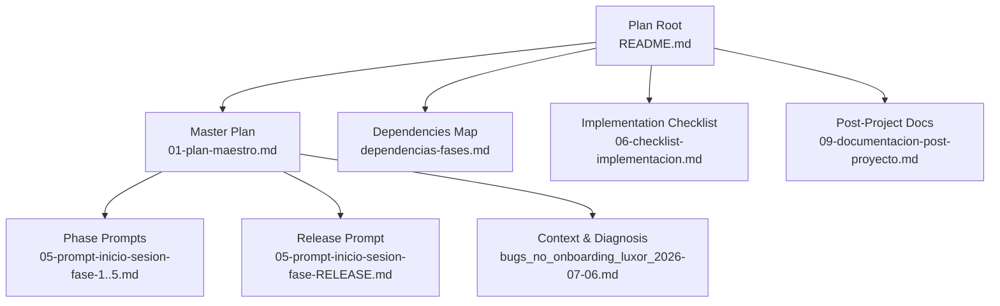
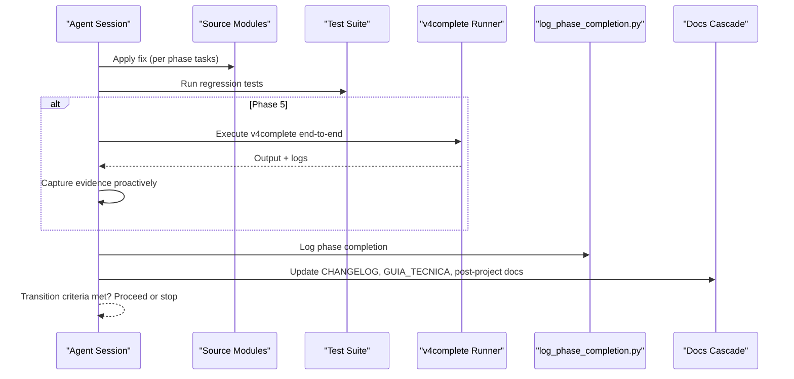
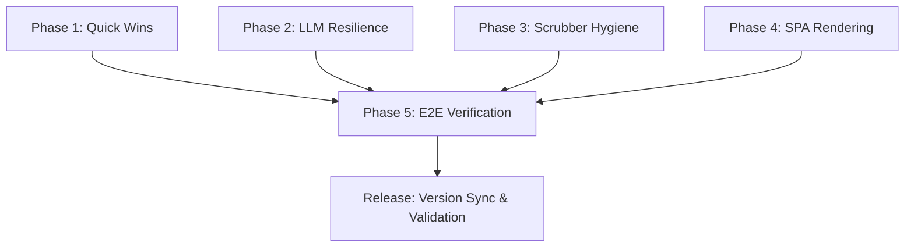

# LUXOR Bugfix Methodology

<cite>
**Referenced Files in This Document**
- [README.md](file://plans\Archives\BUGFIX-LUXOR-2026-07-06\README.md)
- [01-plan-maestro.md](file://plans\Archives\BUGFIX-LUXOR-2026-07-06\01-plan-maestro.md)
- [dependencias-fases.md](file://plans\Archives\BUGFIX-LUXOR-2026-07-06\dependencias-fases.md)
- [06-checklist-implementacion.md](file://plans\Archives\BUGFIX-LUXOR-2026-07-06\06-checklist-implementacion.md)
- [05-prompt-inicio-sesion-fase-1.md](file://plans\Archives\BUGFIX-LUXOR-2026-07-06\05-prompt-inicio-sesion-fase-1.md)
- [05-prompt-inicio-sesion-fase-2.md](file://plans\Archives\BUGFIX-LUXOR-2026-07-06\05-prompt-inicio-sesion-fase-2.md)
- [05-prompt-inicio-sesion-fase-3.md](file://plans\Archives\BUGFIX-LUXOR-2026-07-06\05-prompt-inicio-sesion-fase-3.md)
- [05-prompt-inicio-sesion-fase-4.md](file://plans\Archives\BUGFIX-LUXOR-2026-07-06\05-prompt-inicio-sesion-fase-4.md)
- [05-prompt-inicio-sesion-fase-5.md](file://plans\Archives\BUGFIX-LUXOR-2026-07-06\05-prompt-inicio-sesion-fase-5.md)
- [05-prompt-inicio-sesion-fase-RELEASE.md](file://plans\Archives\BUGFIX-LUXOR-2026-07-06\05-prompt-inicio-sesion-fase-RELEASE.md)
- [bugs_no_onboarding_luxor_2026-07-06.md](file://context\Historico\bugs_no_onboarding_luxor_2026-07-06.md)
</cite>

## Table of Contents
1. [Introduction](#introduction)
2. [Project Structure](#project-structure)
3. [Core Components](#core-components)
4. [Architecture Overview](#architecture-overview)
5. [Detailed Component Analysis](#detailed-component-analysis)
6. [Dependency Analysis](#dependency-analysis)
7. [Performance Considerations](#performance-considerations)
8. [Troubleshooting Guide](#troubleshooting-guide)
9. [Conclusion](#conclusion)
10. [Appendices](#appendices)

## Introduction
This document describes the LUXOR bugfix methodology, a structured five-phase approach (plus release validation) used to resolve critical bugs in the iah-cli system for Luxorhotel. It details each phase from initial session setup through release validation, including prompts, procedures, evidence collection, quality gates, and transition criteria. The methodology ensures systematic bug resolution while maintaining system stability and integrating with the broader quality assurance pipeline.

## Project Structure
The LUXOR bugfix plan is organized as a phased project within the repository’s plans archive. Each phase has a dedicated prompt file that defines objectives, tasks, acceptance criteria, and post-execution steps. Supporting documents include the master plan, dependency map, implementation checklist, and post-project documentation.

**Diagram sources**
- [README.md:1-59](file://plans\Archives\BUGFIX-LUXOR-2026-07-06\README.md#L1-L59)
- [01-plan-maestro.md:1-147](file://plans\Archives\BUGFIX-LUXOR-2026-07-06\01-plan-maestro.md#L1-L147)
- [dependencias-fases.md:1-58](file://plans\Archives\BUGFIX-LUXOR-2026-07-06\dependencias-fases.md#L1-L58)
- [06-checklist-implementacion.md:1-48](file://plans\Archives\BUGFIX-LUXOR-2026-07-06\06-checklist-implementacion.md#L1-L48)
- [09-documentacion-post-proyecto.md:1-39](file://plans\Archives\BUGFIX-LUXOR-2026-07-06\09-documentacion-post-proyecto.md#L1-L39)
- [bugs_no_onboarding_luxor_2026-07-06.md:1-297](file://context\Historico\bugs_no_onboarding_luxor_2026-07-06.md#L1-L297)

**Section sources**
- [README.md:1-59](file://plans\Archives\BUGFIX-LUXOR-2026-07-06\README.md#L1-L59)
- [01-plan-maestro.md:1-147](file://plans\Archives\BUGFIX-LUXOR-2026-07-06\01-plan-maestro.md#L1-L147)

## Core Components
The LUXOR methodology centers on six phases:
- Phase 1: Quick wins (low-risk fixes)
- Phase 2: Resilience improvements (LLM provider externalization)
- Phase 3: Pipeline hygiene (dead code removal)
- Phase 4: SPA rendering integration (Playwright fallback)
- Phase 5: End-to-end verification (v4complete execution and analysis)
- Release: Version bump, synchronization, and final validations

Each phase includes:
- Clear objectives and scope
- Task breakdowns with acceptance criteria
- Immediate verification commands
- Post-execution logging via log_phase_completion.py
- Documentation cascade updates (CHANGELOG, GUIA_TECNICA, post-project docs)

Key quality gates and transition criteria:
- Phases 1–4 are independent; Phase 5 depends on completion of 1–4; Release depends on Phase 5.
- Evidence must be captured proactively after v4complete runs.
- All tests must pass without regressions before advancing.

**Section sources**
- [01-plan-maestro.md:33-68](file://plans\Archives\BUGFIX-LUXOR-2026-07-06\01-plan-maestro.md#L33-L68)
- [dependencias-fases.md:29-42](file://plans\Archives\BUGFIX-LUXOR-2026-07-06\dependencias-fases.md#L29-L42)
- [06-checklist-implementacion.md:14-18](file://plans\Archives\BUGFIX-LUXOR-2026-07-06\06-checklist-implementacion.md#L14-L18)

## Architecture Overview
The LUXOR bugfix workflow orchestrates agent sessions per phase, executing targeted fixes and validations, then aggregating results into evidence and documentation artifacts.

**Diagram sources**
- [05-prompt-inicio-sesion-fase-1.md:147-154](file://plans\Archives\BUGFIX-LUXOR-2026-07-06\05-prompt-inicio-sesion-fase-1.md#L147-L154)
- [05-prompt-inicio-sesion-fase-2.md:100-106](file://plans\Archives\BUGFIX-LUXOR-2026-07-06\05-prompt-inicio-sesion-fase-2.md#L100-L106)
- [05-prompt-inicio-sesion-fase-3.md:116-122](file://plans\Archives\BUGFIX-LUXOR-2026-07-06\05-prompt-inicio-sesion-fase-3.md#L116-L122)
- [05-prompt-inicio-sesion-fase-4.md:190-196](file://plans\Archives\BUGFIX-LUXOR-2026-07-06\05-prompt-inicio-sesion-fase-4.md#L190-L196)
- [05-prompt-inicio-sesion-fase-5.md:149-159](file://plans\Archives\BUGFIX-LUXOR-2026-07-06\05-prompt-inicio-sesion-fase-5.md#L149-L159)
- [05-prompt-inicio-sesion-fase-RELEASE.md:160-173](file://plans\Archives\BUGFIX-LUXOR-2026-07-06\05-prompt-inicio-sesion-fase-RELEASE.md#L160-L173)

## Detailed Component Analysis

### Phase 1: Quick Wins (BUG-2 + BUG-1)
Objectives:
- Remove UnboundLocalError noise in FASE-K by correcting variable reference.
- Use real coordinates from GBP result instead of hardcoded zeros, with range validation.

Tasks:
- Fix variable reference in main.py.
- Replace hardcoded lat/lng with validated gbp_result values in auditors module.
- Add regression tests and run them.

Acceptance criteria:
- No UnboundLocalError in logs.
- Real coordinates used and validated; invalid ranges return early.
- All tests pass.

Evidence and logging:
- Execute log_phase_completion.py upon successful completion.
- Update CHANGELOG and technical notes.

Transition criteria:
- All tasks completed and verified; no regressions.

**Section sources**
- [05-prompt-inicio-sesion-fase-1.md:31-106](file://plans\Archives\BUGFIX-LUXOR-2026-07-06\05-prompt-inicio-sesion-fase-1.md#L31-L106)
- [05-prompt-inicio-sesion-fase-1.md:147-154](file://plans\Archives\BUGFIX-LUXOR-2026-07-06\05-prompt-inicio-sesion-fase-1.md#L147-L154)

### Phase 2: Resilience LLM (OpenRouter Model Externalization)
Objectives:
- Externalize OpenRouter model configuration from hardcoded value to registry.
- Verify current model availability and update registry default if needed.

Tasks:
- Investigate OpenRouter catalog to identify valid model.
- Modify auditor module to read model from provider registry.
- Add mock test verifying payload uses registry model.

Acceptance criteria:
- Hardcoded model removed.
- Registry-driven model selection functional.
- Mock test passes.

Evidence and logging:
- Execute log_phase_completion.py upon successful completion.
- Update CHANGELOG and technical notes.

Transition criteria:
- All tasks completed and verified; no regressions.

**Section sources**
- [05-prompt-inicio-sesion-fase-2.md:30-81](file://plans\Archives\BUGFIX-LUXOR-2026-07-06\05-prompt-inicio-sesion-fase-2.md#L30-L81)
- [05-prompt-inicio-sesion-fase-2.md:100-106](file://plans\Archives\BUGFIX-LUXOR-2026-07-06\05-prompt-inicio-sesion-fase-2.md#L100-L106)

### Phase 3: Pipeline Hygiene (Content Scrubber Dead Code Removal)
Objectives:
- Remove ineffective scrubber block that runs before documents exist.
- Preserve working scrubs post-T4FIX and post-gen.

Tasks:
- Investigate scrubber flow and quality gate dependencies.
- Eliminate or reorganize dead code block.
- Verify existing scrubs remain intact and tests pass.

Acceptance criteria:
- No “[SKIP]” warnings for unavailable documents.
- Quality gate preserved and functional.
- Scrubs post-T4FIX and post-gen continue to work.

Evidence and logging:
- Execute log_phase_completion.py upon successful completion.
- Update CHANGELOG and technical notes.

Transition criteria:
- All tasks completed and verified; no regressions.

**Section sources**
- [05-prompt-inicio-sesion-fase-3.md:30-88](file://plans\Archives\BUGFIX-LUXOR-2026-07-06\05-prompt-inicio-sesion-fase-3.md#L30-L88)
- [05-prompt-inicio-sesion-fase-3.md:116-122](file://plans\Archives\BUGFIX-LUXOR-2026-07-06\05-prompt-inicio-sesion-fase-3.md#L116-L122)

### Phase 4: SPA Rendering with Playwright (Highest Complexity)
Objectives:
- Detect SPAs using heuristics and render with Playwright before SEO audit.
- Implement graceful fallback when Playwright is unavailable or fails.

Tasks:
- Verify Playwright installation and browser availability.
- Integrate SPA detection and rendering logic into auditor modules.
- Add tests for SPA detection, mocked rendering, and fallback behavior.

Acceptance criteria:
- SPA detection implemented and effective.
- Playwright rendering integrated with timeouts and fallback.
- HTML rendered passed to SEO elements detector.
- New tests added and passing.

Evidence and logging:
- Execute log_phase_completion.py upon successful completion.
- Update CHANGELOG and technical notes.

Transition criteria:
- All tasks completed and verified; no regressions.

**Section sources**
- [05-prompt-inicio-sesion-fase-4.md:40-147](file://plans\Archives\BUGFIX-LUXOR-2026-07-06\05-prompt-inicio-sesion-fase-4.md#L40-L147)
- [05-prompt-inicio-sesion-fase-4.md:190-196](file://plans\Archives\BUGFIX-LUXOR-2026-07-06\05-prompt-inicio-sesion-fase-4.md#L190-L196)

### Phase 5: End-to-End Verification with v4complete
Objectives:
- Execute full pipeline against target site to validate all fixes.
- Collect proactive evidence immediately after output generation.
- Verify absence of known errors and confirm metrics thresholds.

Tasks:
- Run v4complete end-to-end (directly or via subagent).
- Save diagnostic and proposal outputs plus audit JSONs to evidence directory.
- Check logs for specific error patterns and verify OG tags detection or Playwright usage.
- Confirm coherence score and publication gates meet targets.

Acceptance criteria:
- No fatal errors during execution.
- Known error patterns absent from logs.
- Coherence score ≥ threshold; publication gates satisfied; no new regressions.

Evidence and logging:
- Mandatory proactive evidence capture post-run.
- Execute log_phase_completion.py upon successful completion.
- Update CHANGELOG and technical notes.

Transition criteria:
- All verifications passed; evidence collected; no regressions.

**Section sources**
- [05-prompt-inicio-sesion-fase-5.md:35-146](file://plans\Archives\BUGFIX-LUXOR-2026-07-06\05-prompt-inicio-sesion-fase-5.md#L35-L146)
- [05-prompt-inicio-sesion-fase-5.md:149-159](file://plans\Archives\BUGFIX-LUXOR-2026-07-06\05-prompt-inicio-sesion-fase-5.md#L149-L159)

### Release: Version Bump and Final Validations
Objectives:
- Bump version to target release and synchronize documentation across files.
- Validate consistency and regenerate status/domain primers.
- Ensure symlinks and validation scripts pass.

Tasks:
- Run diagnostics and doctor checks.
- Edit VERSION.yaml and execute sync script.
- Verify CHANGELOG entry format and completeness.
- Regenerate SYSTEM_STATUS.md and DOMAIN_PRIMER.md.
- Confirm symlink integrity and quick validation suite passes.

Acceptance criteria:
- Version synchronized across required files.
- CHANGELOG entry complete and correctly formatted.
- Doctor and consistency checks pass without discrepancies.
- Validation suite passes quickly.

Evidence and logging:
- Execute log_phase_completion.py at the end of release.
- Confirm version sync gate passes.

Transition criteria:
- All validations passed; release artifacts consistent and documented.

**Section sources**
- [05-prompt-inicio-sesion-fase-RELEASE.md:33-157](file://plans\Archives\BUGFIX-LUXOR-2026-07-06\05-prompt-inicio-sesion-fase-RELEASE.md#L33-L157)
- [05-prompt-inicio-sesion-fase-RELEASE.md:160-173](file://plans\Archives\BUGFIX-LUXOR-2026-07-06\05-prompt-inicio-sesion-fase-RELEASE.md#L160-L173)

## Dependency Analysis
Phases 1–4 are independent and can be executed in any order. Phase 5 depends on completion of 1–4. Release depends on Phase 5. File conflicts are resolved by non-overlapping sections and distinct methods.

**Diagram sources**
- [dependencias-fases.md:3-17](file://plans\Archives\BUGFIX-LUXOR-2026-07-06\dependencias-fases.md#L3-L17)
- [01-plan-maestro.md:33-47](file://plans\Archives\BUGFIX-LUXOR-2026-07-06\01-plan-maestro.md#L33-L47)

**Section sources**
- [dependencias-fases.md:19-33](file://plans\Archives\BUGFIX-LUXOR-2026-07-06\dependencias-fases.md#L19-L33)
- [01-plan-maestro.md:49-54](file://plans\Archives\BUGFIX-LUXOR-2026-07-06\01-plan-maestro.md#L49-L54)

## Performance Considerations
- Iteration budgets per phase are capped at 60 iterations to prevent runaway sessions.
- Long-running tasks (e.g., v4complete) should use terminal timeout or delegate_task strategies to avoid blocking.
- Graceful fallbacks (e.g., Playwright failures) ensure robustness in CI and diverse environments.
- Evidence capture is mandatory post-run to maintain traceability and support post-mortem analysis.

[No sources needed since this section provides general guidance]

## Troubleshooting Guide
Common issues and resolutions:
- UnboundLocalError in financial breakdown: remove or correct variable reference in main.py.
- OpenRouter 404: externalize model to registry and verify current model availability.
- Gemini 403: configure GEMINI_API_KEY in environment; not a code fix.
- Content scrubber “[SKIP]” warnings: eliminate dead code block and preserve working scrubs.
- SPA OG tags not detected: integrate Playwright rendering with fallback.

Verification commands:
- Search logs for specific error patterns to confirm fixes.
- Run targeted unit tests for affected modules.
- Execute v4complete end-to-end and review generated evidence.

**Section sources**
- [bugs_no_onboarding_luxor_2026-07-06.md:46-83](file://context\Historico\bugs_no_onboarding_luxor_2026-07-06.md#L46-L83)
- [bugs_no_onboarding_luxor_2026-07-06.md:85-133](file://context\Historico\bugs_no_onboarding_luxor_2026-07-06.md#L85-L133)
- [bugs_no_onboarding_luxor_2026-07-06.md:135-172](file://context\Historico\bugs_no_onboarding_luxor_2026-07-06.md#L135-L172)
- [bugs_no_onboarding_luxor_2026-07-06.md:174-207](file://context\Historico\bugs_no_onboarding_luxor_2026-07-06.md#L174-L207)

## Conclusion
The LUXOR bugfix methodology provides a disciplined, phased approach to resolving critical issues in iah-cli while preserving system stability. By enforcing strict transition criteria, proactive evidence collection, and comprehensive testing, it integrates seamlessly with the broader QA pipeline and ensures reliable production deployments.

[No sources needed since this section summarizes without analyzing specific files]

## Appendices

### Common LUXOR-Specific Issues, Diagnosis Patterns, and Resolution Strategies
- Lat/lng zero coordinates: diagnose via Places API logs; resolve by using real coordinates with range validation.
- UnboundLocalError in financial breakdown: diagnose via stack traces; resolve by removing incorrect references.
- LLM provider failures: diagnose via error codes; resolve by externalizing models and configuring credentials.
- Scrubber bypass warnings: diagnose via log markers; resolve by eliminating dead code blocks.
- SPA rendering gaps: diagnose via HTML inspection; resolve by integrating Playwright with fallback.

**Section sources**
- [bugs_no_onboarding_luxor_2026-07-06.md:12-44](file://context\Historico\bugs_no_onboarding_luxor_2026-07-06.md#L12-L44)
- [bugs_no_onboarding_luxor_2026-07-06.md:46-83](file://context\Historico\bugs_no_onboarding_luxor_2026-07-06.md#L46-L83)
- [bugs_no_onboarding_luxor_2026-07-06.md:85-133](file://context\Historico\bugs_no_onboarding_luxor_2026-07-06.md#L85-L133)
- [bugs_no_onboarding_luxor_2026-07-06.md:135-172](file://context\Historico\bugs_no_onboarding_luxor_2026-07-06.md#L135-L172)
- [bugs_no_onboarding_luxor_2026-07-06.md:174-207](file://context\Historico\bugs_no_onboarding_luxor_2026-07-06.md#L174-L207)