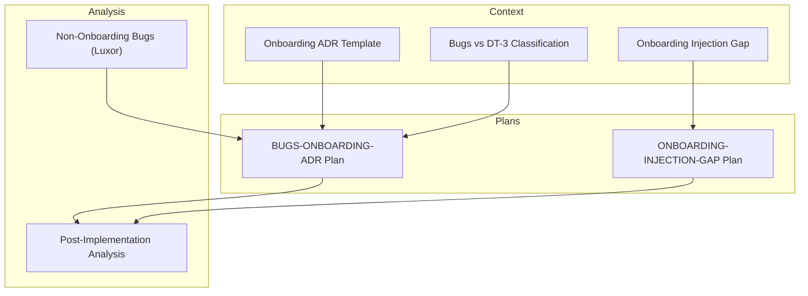
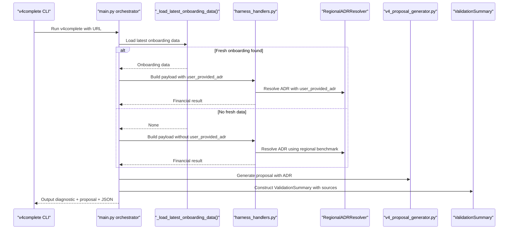
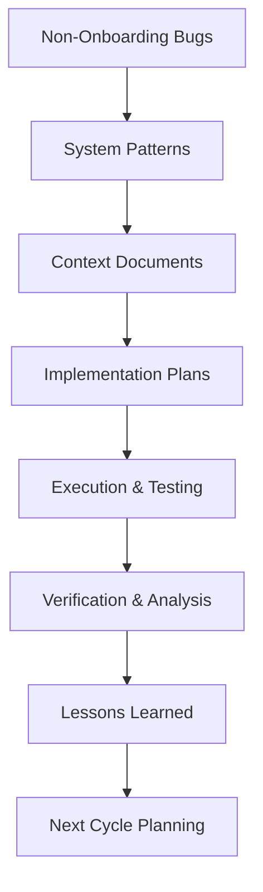

# Onboarding Bug Classification System

<cite>
**Referenced Files in This Document**
- [BUGS-ONBOARDING-ADR-TEMPLATE-2026-07-22.md](file://context/Historico/BUGS-ONBOARDING-ADR-TEMPLATE-2026-07-22.md)
- [CONTEXT-BUGS-VS-DT3-CLASIFICACION-2026-07-25.md](file://context/Historico/CONTEXT-BUGS-VS-DT3-CLASIFICACION-2026-07-25.md)
- [CONTEXT-ONBOARDING-INJECTION-GAP-2026-07-28.md](file://context/Historico/CONTEXT-ONBOARDING-INJECTION-GAP-2026-07-28.md)
- [01-plan-maestro.md (BUGS-ONBOARDING-ADR)](file://plans/Archives/BUGS-ONBOARDING-ADR-2026-07-22/01-plan-maestro.md)
- [08-analisis-post-implementacion.md (BUGS-ONBOARDING-ADR)](file://plans/Archives/BUGS-ONBOARDING-ADR-2026-07-22/08-analisis-post-implementacion.md)
- [01-plan-maestro.md (ONBOARDING-INJECTION-GAP)](file://plans/Archives/ONBOARDING-INJECTION-GAP-2026-07-29/01-plan-maestro.md)
- [bugs_no_onboarding_luxor_2026-07-06.md](file://context/Historico/bugs_no_onboarding_luxor_2026-07-06.md)
</cite>

## Table of Contents
1. [Introduction](#introduction)
2. [Project Structure](#project-structure)
3. [Core Components](#core-components)
4. [Architecture Overview](#architecture-overview)
5. [Detailed Component Analysis](#detailed-component-analysis)
6. [Dependency Analysis](#dependency-analysis)
7. [Performance Considerations](#performance-considerations)
8. [Troubleshooting Guide](#troubleshooting-guide)
9. [Conclusion](#conclusion)
10. [Appendices](#appendices)

## Introduction
This document defines the onboarding bug classification system used across the iah-cli project to identify, categorize, prioritize, and resolve onboarding-related issues that affect the v4complete pipeline’s ability to inject verified hotel data into financial scenarios and commercial documents. It formalizes an ADR-style template for documenting onboarding bugs and their resolutions, establishes a taxonomy covering injection gaps, authentication problems, and data flow failures, and provides severity assessment criteria, priority assignment rules, and escalation procedures. It also maps how classified bugs are transformed into actionable development tasks through phased implementation plans and post-implementation analysis.

## Project Structure
The onboarding bug classification system is documented and operationalized within the .opencode repository:
- Contextual analyses and findings are stored under context/Historico as dated markdown records.
- Implementation plans and execution artifacts are organized under plans/Archives by initiative and date.
- Post-implementation verification and lessons learned are captured in dedicated analysis files.

**Diagram sources**
- [BUGS-ONBOARDING-ADR-TEMPLATE-2026-07-22.md](file://context/Historico/BUGS-ONBOARDING-ADR-TEMPLATE-2026-07-22.md)
- [CONTEXT-BUGS-VS-DT3-CLASIFICACION-2026-07-25.md](file://context/Historico/CONTEXT-BUGS-VS-DT3-CLASIFICACION-2026-07-25.md)
- [CONTEXT-ONBOARDING-INJECTION-GAP-2026-07-28.md](file://context/Historico/CONTEXT-ONBOARDING-INJECTION-GAP-2026-07-28.md)
- [01-plan-maestro.md (BUGS-ONBOARDING-ADR)](file://plans/Archives/BUGS-ONBOARDING-ADR-2026-07-22/01-plan-maestro.md)
- [01-plan-maestro.md (ONBOARDING-INJECTION-GAP)](file://plans/Archives/ONBOARDING-INJECTION-GAP-2026-07-29/01-plan-maestro.md)
- [08-analisis-post-implementacion.md (BUGS-ONBOARDING-ADR)](file://plans/Archives/BUGS-ONBOARDING-ADR-2026-07-22/08-analisis-post-implementacion.md)
- [bugs_no_onboarding_luxor_2026-07-06.md](file://context/Historico/bugs_no_onboarding_luxor_2026-07-06.md)

**Section sources**
- [BUGS-ONBOARDING-ADR-TEMPLATE-2026-07-22.md](file://context/Historico/BUGS-ONBOARDING-ADR-TEMPLATE-2026-07-22.md)
- [CONTEXT-BUGS-VS-DT3-CLASIFICACION-2026-07-25.md](file://context/Historico/CONTEXT-BUGS-VS-DT3-CLASIFICACION-2026-07-25.md)
- [CONTEXT-ONBOARDING-INJECTION-GAP-2026-07-28.md](file://context/Historico/CONTEXT-ONBOARDING-INJECTION-GAP-2026-07-28.md)
- [01-plan-maestro.md (BUGS-ONBOARDING-ADR)](file://plans/Archives/BUGS-ONBOARDING-ADR-2026-07-22/01-plan-maestro.md)
- [01-plan-maestro.md (ONBOARDING-INJECTION-GAP)](file://plans/Archives/ONBOARDING-INJECTION-GAP-2026-07-29/01-plan-maestro.md)
- [08-analisis-post-implementacion.md (BUGS-ONBOARDING-ADR)](file://plans/Archives/BUGS-ONBOARDING-ADR-2026-07-22/08-analisis-post-implementacion.md)
- [bugs_no_onboarding_luxor_2026-07-06.md](file://context/Historico/bugs_no_onboarding_luxor_2026-07-06.md)

## Core Components
The onboarding bug classification system comprises:
- ADR template for structured documentation of onboarding bugs and resolutions.
- Categorization framework for injection gaps, authentication problems, and data flow failures.
- Severity assessment criteria and priority assignment rules.
- Escalation procedures tied to business impact and pipeline blockage.
- Mapping from classified bugs to phased implementation plans and testable DoD.

Key elements:
- Injection gap classification focuses on mismatches between onboard and v4complete identity resolution, freshness windows, and canonical key usage.
- Authentication problem classification covers API keys, provider registry misconfigurations, and credential propagation.
- Data flow failure classification addresses payload omission, handler overrides, parallel consumers, and validation summary inconsistencies.

**Section sources**
- [BUGS-ONBOARDING-ADR-TEMPLATE-2026-07-22.md](file://context/Historico/BUGS-ONBOARDING-ADR-TEMPLATE-2026-07-22.md)
- [CONTEXT-ONBOARDING-INJECTION-GAP-2026-07-28.md](file://context/Historico/CONTEXT-ONBOARDING-INJECTION-GAP-2026-07-28.md)
- [01-plan-maestro.md (BUGS-ONBOARDING-ADR)](file://plans/Archives/BUGS-ONBOARDING-ADR-2026-07-22/01-plan-maestro.md)

## Architecture Overview
The v4complete pipeline is designed to operate in two modes:
- Tier B mode uses regional benchmarks when no fresh onboarding data is available.
- Tier A mode injects verified onboarding data to produce precise financial scenarios and aligned commercial documents.

The architecture includes:
- Orchestration layer that loads onboarding data and constructs payloads.
- Financial engine handlers that may override inputs based on flags or regional resolvers.
- Proposal generator with its own resolver path that can diverge from the main pipeline.
- Validation summary construction that must reflect actual data provenance.

**Diagram sources**
- [CONTEXT-ONBOARDING-INJECTION-GAP-2026-07-28.md](file://context/Historico/CONTEXT-ONBOARDING-INJECTION-GAP-2026-07-28.md)
- [BUGS-ONBOARDING-ADR-TEMPLATE-2026-07-22.md](file://context/Historico/BUGS-ONBOARDING-ADR-TEMPLATE-2026-07-22.md)

## Detailed Component Analysis

### ADR Template for Onboarding Bugs
The ADR template standardizes how onboarding bugs are documented:
- Executive summary with hotel context, execution details, and baseline state.
- Categorized bugs and systemic findings with severity reclassification.
- Evidence chains linking symptoms to root causes across modules.
- Quantified financial impact and downstream effects on outputs.
- Proposed solutions ordered by cost/benefit and architectural robustness.
- Checklist for refactoring and regression testing.

Common patterns include:
- Payload omission of user-provided values leading to fallback to regional benchmarks.
- Handler overrides that ignore onboarding inputs due to feature flags or cache.
- Parallel consumers with independent resolvers producing inconsistent results.
- Taxonomy divergence across layers causing false confidence labels.

**Section sources**
- [BUGS-ONBOARDING-ADR-TEMPLATE-2026-07-22.md](file://context/Historico/BUGS-ONBOARDING-ADR-TEMPLATE-2026-07-22.md)

### Injection Gap Classification
Injection gaps occur when onboarding data fails to reach v4complete due to:
- Slug mismatch between onboard and v4complete identity resolution.
- Hardcoded freshness windows that reject valid operational data.
- Missing canonical key usage (URL-based matching).
- Configurable output directories not propagated to readers.

Resolution strategies emphasize:
- Persisting hotel.url in onboarding YAML as canonical key.
- Normalizing URLs deterministically for matching.
- Removing or configuring freshness checks to align with sales cycles.
- Passing configurable output_dir to loaders consistently.

**Section sources**
- [CONTEXT-ONBOARDING-INJECTION-GAP-2026-07-28.md](file://context/Historico/CONTEXT-ONBOARDING-INJECTION-GAP-2026-07-28.md)
- [01-plan-maestro.md (ONBOARDING-INJECTION-GAP)](file://plans/Archives/ONBOARDING-INJECTION-GAP-2026-07-29/01-plan-maestro.md)

### Authentication Problem Classification
Authentication issues in onboarding contexts involve:
- LLM provider configuration errors (hardcoded models vs registry).
- Missing or misconfigured API keys in environment variables.
- Provider registry not being consumed by code paths.

Mitigations include:
- Externalizing model names to provider_registry.yaml.
- Validating environment variables before execution.
- Ensuring all code paths read from centralized configuration.

**Section sources**
- [bugs_no_onboarding_luxor_2026-07-06.md](file://context/Historico/bugs_no_onboarding_luxor_2026-07-06.md)

### Data Flow Failure Classification
Data flow failures manifest as:
- Payload fields omitted during orchestration.
- Handler logic overriding validated inputs based on flags.
- Parallel consumers computing values independently.
- ValidationSummary deriving confidence from existence flags rather than actual source.

Fixes require:
- Propagating user_provided_adr and occupancy_source in payloads.
- Aligning ValidationSummary logic with actual value provenance.
- Unifying taxonomy across enum, summary, and JSON layers.
- Adding end-to-end tests covering onboarding → harness → JSON → documents.

**Section sources**
- [BUGS-ONBOARDING-ADR-TEMPLATE-2026-07-22.md](file://context/Historico/BUGS-ONBOARDING-ADR-TEMPLATE-2026-07-22.md)
- [01-plan-maestro.md (BUGS-ONBOARDING-ADR)](file://plans/Archives/BUGS-ONBOARDING-ADR-2026-07-22/01-plan-maestro.md)

### Severity Assessment Criteria
Severity levels are assigned based on:
- Impact on financial accuracy (e.g., over/underestimation of ADR, occupancy).
- Blockage of Tier A generation (preventing precise calculations).
- Consistency across outputs (diagnostic, proposal, JSON).
- Presence of workarounds or fallbacks.

Criteria examples:
- Critical: Blocks Tier A, causes significant financial distortion.
- High: Degrades precision, creates inconsistency between surfaces.
- Medium: Partial impact, mitigated by existing logic.
- Low: Cosmetic or non-blocking issues.

**Section sources**
- [CONTEXT-ONBOARDING-INJECTION-GAP-2026-07-28.md](file://context/Historico/CONTEXT-ONBOARDING-INJECTION-GAP-2026-07-28.md)
- [BUGS-ONBOARDING-ADR-TEMPLATE-2026-07-22.md](file://context/Historico/BUGS-ONBOARDING-ADR-TEMPLATE-2026-07-22.md)

### Priority Assignment Rules
Priority is determined by:
- Root cause complexity and scope of changes required.
- Dependencies between fixes (sequential vs parallel execution).
- Business impact urgency (sales cycle alignment, revenue implications).
- Risk of regression and testing overhead.

Rules include:
- Address critical injection gaps first to enable Tier A.
- Fix foundational issues before cascading improvements.
- Group related changes to minimize cross-module risk.
- Validate with end-to-end tests before release.

**Section sources**
- [01-plan-maestro.md (BUGS-ONBOARDING-ADR)](file://plans/Archives/BUGS-ONBOARDING-ADR-2026-07-22/01-plan-maestro.md)
- [01-plan-maestro.md (ONBOARDING-INJECTION-GAP)](file://plans/Archives/ONBOARDING-INJECTION-GAP-2026-07-29/01-plan-maestro.md)

### Escalation Procedures
Escalation follows a structured process:
- Initial classification and severity assignment.
- Impact assessment on pipeline and business outcomes.
- Planning phase with phased implementation strategy.
- Execution with subagents or direct coding as appropriate.
- Verification through v4complete runs and test suites.
- Release with version bump and changelog updates.

Procedures ensure:
- Clear ownership and accountability per phase.
- Automated validation where possible.
- Manual verification for complex integrations.
- Documentation of lessons learned and residual debt.

**Section sources**
- [08-analisis-post-implementacion.md (BUGS-ONBOARDING-ADR)](file://plans/Archives/BUGS-ONBOARDING-ADR-2026-07-22/08-analisis-post-implementacion.md)

## Dependency Analysis
The onboarding bug classification system has clear dependencies:
- Context documents inform plan creation and execution strategy.
- Plans define phases with specific file modifications and tests.
- Post-implementation analysis validates fixes and captures learnings.
- Non-onboarding bugs provide contrast and highlight system-wide patterns.

**Diagram sources**
- [CONTEXT-BUGS-VS-DT3-CLASIFICACION-2026-07-25.md](file://context/Historico/CONTEXT-BUGS-VS-DT3-CLASIFICACION-2026-07-25.md)
- [01-plan-maestro.md (BUGS-ONBOARDING-ADR)](file://plans/Archives/BUGS-ONBOARDING-ADR-2026-07-22/01-plan-maestro.md)
- [08-analisis-post-implementacion.md (BUGS-ONBOARDING-ADR)](file://plans/Archives/BUGS-ONBOARDING-ADR-2026-07-22/08-analisis-post-implementacion.md)

**Section sources**
- [CONTEXT-BUGS-VS-DT3-CLASIFICACION-2026-07-25.md](file://context/Historico/CONTEXT-BUGS-VS-DT3-CLASIFICACION-2026-07-25.md)
- [01-plan-maestro.md (BUGS-ONBOARDING-ADR)](file://plans/Archives/BUGS-ONBOARDING-ADR-2026-07-22/01-plan-maestro.md)
- [08-analisis-post-implementacion.md (BUGS-ONBOARDING-ADR)](file://plans/Archives/BUGS-ONBOARDING-ADR-2026-07-22/08-analisis-post-implementacion.md)

## Performance Considerations
Performance impacts of onboarding bugs include:
- Incorrect ADR and occupancy leading to miscalculated financial scenarios.
- Inconsistent tier assignments affecting document quality and client perception.
- Pipeline delays due to failed data loading or excessive fallback logic.
- Increased testing overhead when end-to-end validation is missing.

Optimization recommendations:
- Implement deterministic URL-based matching to avoid expensive fuzzy comparisons.
- Cache feature flags and regional resolvers to prevent redundant computations.
- Add comprehensive e2e tests to catch regressions early.
- Use configurable freshness windows to balance data validity with usability.

[No sources needed since this section provides general guidance]

## Troubleshooting Guide
Common troubleshooting steps for onboarding issues:
- Verify onboarding YAML exists and contains required fields.
- Check URL normalization and matching logic in loader functions.
- Inspect payload construction for missing user_provided_adr.
- Review handler logic for overrides based on feature flags.
- Validate ValidationSummary confidence and sources consistency.
- Execute v4complete with debug logging to trace data flow.

Diagnostic commands:
- Run v4complete with --force-new to bypass caching.
- Check financial_scenarios.json for input_data values.
- Compare diagnostic and proposal outputs for consistency.
- Verify gate reports for blocked or warning conditions.

**Section sources**
- [CONTEXT-ONBOARDING-INJECTION-GAP-2026-07-28.md](file://context/Historico/CONTEXT-ONBOARDING-INJECTION-GAP-2026-07-28.md)
- [08-analisis-post-implementacion.md (BUGS-ONBOARDING-ADR)](file://plans/Archives/BUGS-ONBOARDING-ADR-2026-07-22/08-analisis-post-implementacion.md)

## Conclusion
The onboarding bug classification system provides a structured approach to identifying, analyzing, and resolving issues that prevent accurate data injection into the v4complete pipeline. By establishing clear categories, severity criteria, and prioritization rules, the system enables systematic improvement of onboarding reliability and financial accuracy. The integration of ADR templates, phased implementation plans, and post-implementation analysis ensures continuous learning and refinement of the system.

[No sources needed since this section summarizes without analyzing specific files]

## Appendices

### Example Bug Patterns and Solutions
- **Pattern**: Slug mismatch between onboard and v4complete
  - **Root Cause**: Different identity resolution strategies
  - **Solution**: Use URL as canonical key with normalization
- **Pattern**: Handler overrides onboarding data
  - **Root Cause**: Feature flags or regional resolvers taking precedence
  - **Solution**: Pass explicit source flags and respect validated inputs
- **Pattern**: Parallel consumer divergence
  - **Root Cause**: Independent resolver instances with different inputs
  - **Solution**: Centralize ADR resolution or pass computed values from orchestrator

### Relationship Between Classification and Implementation Planning
Classified bugs directly inform implementation planning:
- Severity determines phase ordering and resource allocation.
- Category influences which modules require modification.
- Root cause analysis guides architectural decisions.
- DoD criteria ensure measurable outcomes for each phase.

**Section sources**
- [01-plan-maestro.md (BUGS-ONBOARDING-ADR)](file://plans/Archives/BUGS-ONBOARDING-ADR-2026-07-22/01-plan-maestro.md)
- [01-plan-maestro.md (ONBOARDING-INJECTION-GAP)](file://plans/Archives/ONBOARDING-INJECTION-GAP-2026-07-29/01-plan-maestro.md)