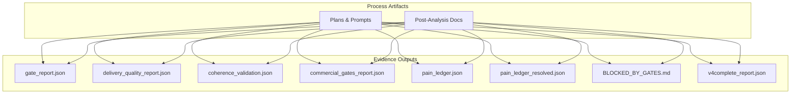
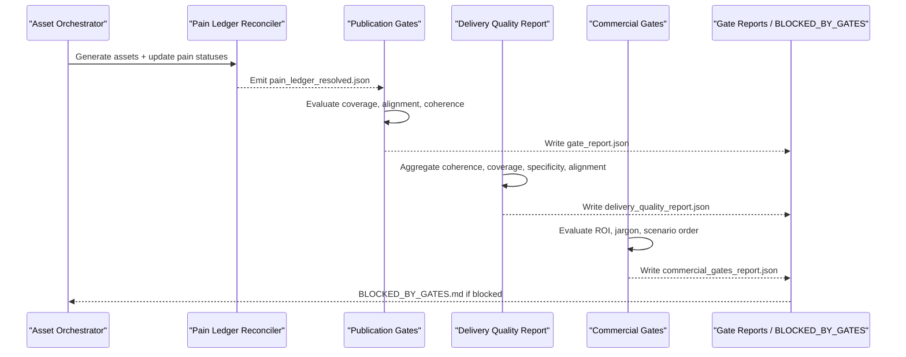
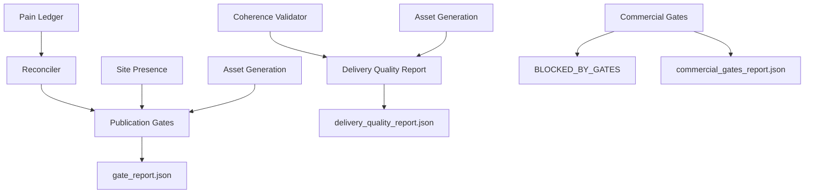

# Quality Gates and Validation Processes

<cite>
**Referenced Files in This Document**
- [CONTEXT-DT-3-POST-ANALYSIS-VALIDATED-2026-07-25.md](file://context/Historico/CONTEXT-DT-3-POST-ANALYSIS-VALIDATED-2026-07-25.md)
- [coherence_validation.json](file://plans/Archives/DT-3-TECH-DEBT-2026-07-25/evidence/coherence_validation.json)
- [delivery_quality_report.json](file://plans/Archives/DT-3-TECH-DEBT-2026-07-25/evidence/delivery_quality_report.json)
- [gate_report_20260727_140459.json](file://plans/Archives/DT-4-ROOT-CAUSE-2026-07-25/evidence/gate_report_20260727_140459.json)
- [BLOCKED_BY_GATES.md](file://plans/Archives/DT-4-ROOT-CAUSE-2026-07-25/evidence/BLOCKED_BY_GATES.md)
- [commercial_gates_report.json](file://plans/Archives/DT-4-ROOT-CAUSE-2026-07-25/evidence/commercial_gates_report.json)
- [pain_ledger.json](file://plans/Archives/DT-3-TECH-DEBT-2026-07-25/evidence/pain_ledger.json)
- [pain_ledger_resolved.json](file://plans/Archives/DT-4-ROOT-CAUSE-2026-07-25/evidence/pain_ledger_resolved.json)
- [v4complete_report_post_fix.json](file://plans/Archives/DT-4-ROOT-CAUSE-2026-07-25/evidence/v4complete_report_post_fix.json)
</cite>

## Table of Contents
1. Introduction
2. Project Structure
3. Core Components
4. Architecture Overview
5. Detailed Component Analysis
6. Dependency Analysis
7. Performance Considerations
8. Troubleshooting Guide
9. Conclusion

## Introduction
This document explains the multi-layered quality gates and validation processes that ensure bug fixes meet project standards. It covers coherence checks, delivery quality assessments, commercial gate evaluations, and gate reports. It also details automated validation scripts, manual review steps, acceptance criteria, scoring mechanisms, pass/fail thresholds, remediation procedures for failures, common failure patterns with root causes and resolutions, and how these gates integrate with the CI/CD pipeline to prevent defective code from reaching production.

## Project Structure
The repository organizes evidence and plans around specific runs and phases. The quality system is evidenced through JSON reports and markdown artifacts generated by automated runs (e.g., v4complete). Key directories include:
- context/Historico: validated post-analysis documents describing issues, root causes, and fixes.
- plans/Archives: per-project or per-phase folders containing execution prompts, checklists, and evidence outputs (JSON reports and markdown).

[No sources needed since this diagram shows conceptual workflow, not actual code structure]

## Core Components
- Publication Gates: Evaluate coverage, alignment, asset confidence, coherence, ethics, content quality, and readiness. They produce a structured gate report and can block publication when critical conditions are not met.
- Delivery Quality Report: Aggregates multiple gates (coherence, coverage, specificity, proposal-asset alignment) into a single assessment used by packaging and release flows.
- Commercial Gates: Assess commercial viability (ROI narrative, jargon usage, scenario ordering), producing a blocking/warning summary.
- Coherence Validator: Computes an overall coherence score from weighted checks (problems have solutions, assets justified, financial data validated, WhatsApp verification, price matches pain, promised assets exist).
- Pain Ledger and Reconciler: Tracks pains and their resolution status; a reconciler consolidates generation outcomes into a resolved ledger consumed by coverage gates.
- Gate Reports and Blocked-by-Gates: Persist results and human-readable guidance for failures.

Acceptance Criteria and Thresholds (from evidence):
- Coherence threshold: ≥ 0.8 (see gate report coherence value).
- Evidence coverage threshold: ≥ 95% (see gate report evidence_coverage).
- Critical recall threshold: ≥ 90% (see gate report critical_recall).
- Asset confidence threshold: ≥ 0.7 per asset (see gate report asset_confidence).
- Coverage gap rule: no silent drops allowed; uncovered pains must be justified or covered (see coverage_no_silent_drop gate).
- Proposal-asset alignment: all promised services must have aligned assets or be present in production (see proposal_asset_alignment gate details).

Scoring Mechanisms:
- Coherence: weighted combination of individual checks; overall_score reflects the final metric.
- Coverage: ratio of covered/justified vs total detected pains; uncovered items cause failure.
- Alignment: counts of aligned vs total services, including presence_in_production entries.
- Commercial gates: binary pass/fail per gate with severity (BLOCKING/WARNING); summary aggregates counts.

**Section sources**
- [gate_report_20260727_140459.json:1-199](file://plans/Archives/DT-4-ROOT-CAUSE-2026-07-25/evidence/gate_report_20260727_140459.json#L1-L199)
- [delivery_quality_report.json:1-51](file://plans/Archives/DT-3-TECH-DEBT-2026-07-25/evidence/delivery_quality_report.json#L1-L51)
- [coherence_validation.json:1-55](file://plans/Archives/DT-3-TECH-DEBT-2026-07-25/evidence/coherence_validation.json#L1-L55)
- [commercial_gates_report.json:1-31](file://plans/Archives/DT-4-ROOT-CAUSE-2026-07-25/evidence/commercial_gates_report.json#L1-L31)
- [pain_ledger.json:1-95](file://plans/Archives/DT-3-TECH-DEBT-2026-07-25/evidence/pain_ledger.json#L1-L95)
- [pain_ledger_resolved.json:1-102](file://plans/Archives/DT-4-ROOT-CAUSE-2026-07-25/evidence/pain_ledger_resolved.json#L1-L102)
- [v4complete_report_post_fix.json:1-390](file://plans/Archives/DT-4-ROOT-CAUSE-2026-07-25/evidence/v4complete_report_post_fix.json#L1-L390)

## Architecture Overview
The quality system integrates several layers:
- Orchestration generates assets and updates pain statuses.
- Post-orchestrator reconciler consolidates outcomes into a resolved ledger.
- Publication gates evaluate coverage and alignment using the resolved ledger and site presence data.
- Delivery quality report aggregates coherence, coverage, specificity, and alignment into a unified assessment.
- Commercial gates assess business viability and can block proposal generation.
- Gate reports and BLOCKED_BY_GATES.md provide actionable feedback.

**Diagram sources**
- [gate_report_20260727_140459.json:1-199](file://plans/Archives/DT-4-ROOT-CAUSE-2026-07-25/evidence/gate_report_20260727_140459.json#L1-L199)
- [delivery_quality_report.json:1-51](file://plans/Archives/DT-3-TECH-DEBT-2026-07-25/evidence/delivery_quality_report.json#L1-L51)
- [commercial_gates_report.json:1-31](file://plans/Archives/DT-4-ROOT-CAUSE-2026-07-25/evidence/commercial_gates_report.json#L1-L31)
- [pain_ledger_resolved.json:1-102](file://plans/Archives/DT-4-ROOT-CAUSE-2026-07-25/evidence/pain_ledger_resolved.json#L1-L102)
- [BLOCKED_BY_GATES.md:1-32](file://plans/Archives/DT-4-ROOT-CAUSE-2026-07-25/evidence/BLOCKED_BY_GATES.md#L1-L32)

## Detailed Component Analysis

### Publication Gates (Coverage and Alignment)
- Coverage gate ensures every detected pain is either covered by an asset or justified (e.g., MAPPED_TO_SERVICE, ASSET_GENERATED, JUSTIFIED_SKIP, BLOCKED). Uncovered items cause failure.
- Alignment gate verifies that all promised services have corresponding assets or are already present in production.
- Coherence gate uses the overall coherence score against a threshold.

Common failure pattern:
- Uncovered pain due to skipped assets not propagated to pain ledger, causing coverage failure even when assets exist on-site. Resolution involves reconciling skipped_assets into pain_ledger_resolved and updating justified statuses.

Thresholds and scoring:
- Coverage ratio computed as covered/total_detected; uncovered list drives failure.
- Alignment percentage includes aligned_count and present_in_production.

Remediation:
- Ensure orchestrator propagates skipped_assets.pain_ids_affected to pain_ledger with appropriate status.
- Update justified statuses to include ASSET_GENERATED where applicable.
- Use SitePresenceChecker data to boost confidence for checks like whatsapp_verified.

**Section sources**
- [CONTEXT-DT-3-POST-ANALYSIS-VALIDATED-2026-07-25.md:1-332](file://context/Historico/CONTEXT-DT-3-POST-ANALYSIS-VALIDATED-2026-07-25.md#L1-L332)
- [gate_report_20260727_140459.json:160-174](file://plans/Archives/DT-4-ROOT-CAUSE-2026-07-25/evidence/gate_report_20260727_140459.json#L160-L174)
- [pain_ledger_resolved.json:1-102](file://plans/Archives/DT-4-ROOT-CAUSE-2026-07-25/evidence/pain_ledger_resolved.json#L1-L102)

### Delivery Quality Report (Coherence, Coverage, Specificity, Alignment)
- Aggregates multiple gates into a single assessment used by packaging/release flows.
- Includes coherence score, coverage failure rate, asset specificity, and proposal-asset alignment.
- Historically had gaps where certain gates were declared but not implemented or defaulted to pass.

Key metrics:
- Coherence score from coherence_validation.json.
- Coverage failure rate from asset_generation_report.
- Specificity average confidence across assets.
- Alignment count vs total services.

Thresholds:
- Coherence ≥ 0.8.
- Coverage failure rate below acceptable threshold.
- All assets above specificity threshold.
- Alignment passes when all promised services are aligned or present in production.

Remediation:
- Implement missing gates and avoid default-pass behavior.
- Ensure consistent consumption of real gate results rather than defaults.

**Section sources**
- [delivery_quality_report.json:1-51](file://plans/Archives/DT-3-TECH-DEBT-2026-07-25/evidence/delivery_quality_report.json#L1-L51)
- [CONTEXT-DT-3-POST-ANALYSIS-VALIDATED-2026-07-25.md:120-170](file://context/Historico/CONTEXT-DT-3-POST-ANALYSIS-VALIDATED-2026-07-25.md#L120-L170)

### Commercial Gates (ROI Narrative, Jargon, Scenario Order)
- Evaluate commercial viability of proposals.
- Blocking gates can prevent proposal generation entirely.
- Warnings indicate areas for improvement without blocking.

Common failures:
- Negative ROI scenarios interpreted incorrectly or presented as recovery arguments.
- Technical jargon in management-facing sections.
- Scenario ordering inconsistencies (optimistic vs realistic).

Thresholds:
- Binary pass/fail per gate with severity classification.
- Summary indicates number of blocking and warning failures.

Remediation:
- Reframe optimistic scenarios to represent break-even or positive net gain appropriately.
- Move technical terms to annexes; keep management view business-focused.
- Adjust onboarding strategy to improve ROI narrative.

**Section sources**
- [commercial_gates_report.json:1-31](file://plans/Archives/DT-4-ROOT-CAUSE-2026-07-25/evidence/commercial_gates_report.json#L1-L31)
- [BLOCKED_BY_GATES.md:17-25](file://plans/Archives/DT-4-ROOT-CAUSE-2026-07-25/evidence/BLOCKED_BY_GATES.md#L17-L25)

### Coherence Validator (Weighted Checks)
- Computes overall coherence score from weighted checks:
  - problems_have_solutions
  - assets_are_justified
  - financial_data_validated
  - whatsapp_verified
  - price_matches_pain
  - promised_assets_exist

Thresholds:
- Overall score must meet threshold (≥ 0.8).
- Individual checks may fail and contribute to errors/warnings.

Remediation:
- Improve data inputs for financial validation.
- Ensure promised assets exist or are justified.
- Boost confidence for whatsapp_verified using SitePresenceChecker data.

**Section sources**
- [coherence_validation.json:1-55](file://plans/Archives/DT-3-TECH-DEBT-2026-07-25/evidence/coherence_validation.json#L1-L55)
- [CONTEXT-DT-3-POST-ANALYSIS-VALIDATED-2026-07-25.md:140-155](file://context/Historico/CONTEXT-DT-3-POST-ANALYSIS-VALIDATED-2026-07-25.md#L140-L155)

### Pain Ledger and Reconciler
- Tracks pains with statuses: DETECTED, DIAGNOSED, MAPPED_TO_SERVICE, ASSET_GENERATED, JUSTIFIED_SKIP, BLOCKED.
- Reconciler consolidates asset generation outcomes and skipped assets into a resolved ledger.
- Coverage gates consume the resolved ledger to determine justification.

Thresholds:
- Resolved statuses must reflect actual outcomes; unresolved pains cause coverage failure.

Remediation:
- Ensure orchestrator updates pain statuses based on asset generation and site presence.
- Include ASSET_GENERATED in justified statuses for coverage evaluation.

**Section sources**
- [pain_ledger.json:1-95](file://plans/Archives/DT-3-TECH-DEBT-2026-07-25/evidence/pain_ledger.json#L1-L95)
- [pain_ledger_resolved.json:1-102](file://plans/Archives/DT-4-ROOT-CAUSE-2026-07-25/evidence/pain_ledger_resolved.json#L1-L102)
- [CONTEXT-DT-3-POST-ANALYSIS-VALIDATED-2026-07-25.md:155-175](file://context/Historico/CONTEXT-DT-3-POST-ANALYSIS-VALIDATED-2026-07-25.md#L155-L175)

### Gate Reports and BLOCKED_BY_GATES
- gate_report.json persists publication gate results, readiness status, and suggestions.
- BLOCKED_BY_GATES.md provides human-readable guidance for failures, including commercial gates when persisted.

Thresholds:
- Readiness status NOT_READY indicates blocking issues.
- Suggestions guide remediation steps.

Remediation:
- Address uncovered pains, alignment issues, and commercial gate failures.
- Re-run validation after fixes.

**Section sources**
- [gate_report_20260727_140459.json:176-193](file://plans/Archives/DT-4-ROOT-CAUSE-2026-07-25/evidence/gate_report_20260727_140459.json#L176-L193)
- [BLOCKED_BY_GATES.md:1-32](file://plans/Archives/DT-4-ROOT-CAUSE-2026-07-25/evidence/BLOCKED_BY_GATES.md#L1-L32)

## Dependency Analysis
Quality gates depend on upstream data and outputs:
- Publication gates rely on pain_ledger_resolved and site presence data.
- Delivery quality report consumes coherence, coverage, specificity, and alignment outputs.
- Commercial gates operate independently but influence proposal generation and blocking.
- Gate reports aggregate results from multiple components.

**Diagram sources**
- [pain_ledger.json:1-95](file://plans/Archives/DT-3-TECH-DEBT-2026-07-25/evidence/pain_ledger.json#L1-L95)
- [pain_ledger_resolved.json:1-102](file://plans/Archives/DT-4-ROOT-CAUSE-2026-07-25/evidence/pain_ledger_resolved.json#L1-L102)
- [coherence_validation.json:1-55](file://plans/Archives/DT-3-TECH-DEBT-2026-07-25/evidence/coherence_validation.json#L1-L55)
- [delivery_quality_report.json:1-51](file://plans/Archives/DT-3-TECH-DEBT-2026-07-25/evidence/delivery_quality_report.json#L1-L51)
- [commercial_gates_report.json:1-31](file://plans/Archives/DT-4-ROOT-CAUSE-2026-07-25/evidence/commercial_gates_report.json#L1-L31)
- [gate_report_20260727_140459.json:1-199](file://plans/Archives/DT-4-ROOT-CAUSE-2026-07-25/evidence/gate_report_20260727_140459.json#L1-L199)

**Section sources**
- [v4complete_report_post_fix.json:214-221](file://plans/Archives/DT-4-ROOT-CAUSE-2026-07-25/evidence/v4complete_report_post_fix.json#L214-L221)

## Performance Considerations
- Minimize redundant reads of large JSON artifacts by caching intermediate results.
- Avoid re-running expensive validations unless inputs change.
- Ensure reconciler runs once per orchestration cycle to prevent inconsistent states.
- Optimize coherence validator by leveraging cached site presence data.

[No sources needed since this section provides general guidance]

## Troubleshooting Guide
Common validation failures and resolutions:
- Coverage failure due to uncovered pain: reconcile skipped_assets into pain_ledger_resolved and update statuses.
- Coherence failure on whatsapp_verified: use SitePresenceChecker to boost confidence.
- Commercial gate blocking on ROI-negative: reframe optimistic scenarios and adjust onboarding strategy.
- Alignment mismatch: ensure proposal_asset_matrix includes present_in_production entries and aligns with publication gates.

Steps:
- Review gate_report.json and delivery_quality_report.json for specific failures.
- Check commercial_gates_report.json for blocking warnings.
- Validate pain_ledger_resolved.json for correct statuses.
- Re-run v4complete after applying fixes.

**Section sources**
- [gate_report_20260727_140459.json:160-193](file://plans/Archives/DT-4-ROOT-CAUSE-2026-07-25/evidence/gate_report_20260727_140459.json#L160-L193)
- [delivery_quality_report.json:1-51](file://plans/Archives/DT-3-TECH-DEBT-2026-07-25/evidence/delivery_quality_report.json#L1-L51)
- [commercial_gates_report.json:1-31](file://plans/Archives/DT-4-ROOT-CAUSE-2026-07-25/evidence/commercial_gates_report.json#L1-L31)
- [pain_ledger_resolved.json:1-102](file://plans/Archives/DT-4-ROOT-CAUSE-2026-07-25/evidence/pain_ledger_resolved.json#L1-L102)

## Conclusion
The quality gates and validation processes form a robust multi-layered system ensuring bug fixes meet project standards. By integrating coherence checks, delivery quality assessments, commercial gate evaluations, and comprehensive reporting, the system prevents defective code from reaching production. Continuous refinement of reconciliation logic, consistent threshold enforcement, and clear remediation guidance enable reliable releases.

[No sources needed since this section summarizes without analyzing specific files]