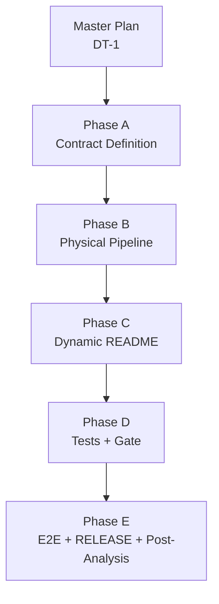
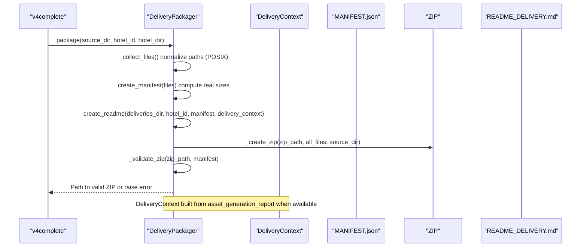
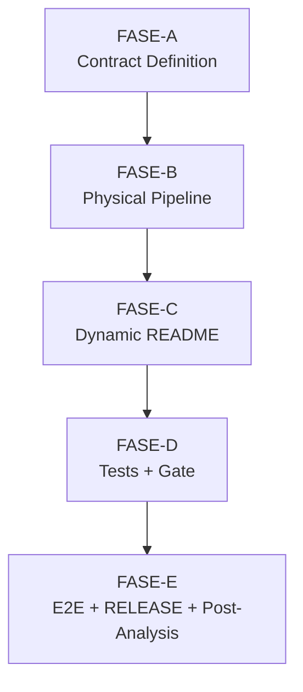

# Delivery Contract Implementation (DT-1)

<cite>
**Referenced Files in This Document**
- [README.md](file://plans\Archives\DT-1-DELIVERY-CONTRACT-2026-07-23\README.md)
- [01-plan-maestro.md](file://plans\Archives\DT-1-DELIVERY-CONTRACT-2026-07-23\01-plan-maestro.md)
- [dependencias-fases.md](file://plans\Archives\DT-1-DELIVERY-CONTRACT-2026-07-23\dependencias-fases.md)
- [02-prompt-fase-A.md](file://plans\Archives\DT-1-DELIVERY-CONTRACT-2026-07-23\02-prompt-fase-A.md)
- [03-prompt-fase-B.md](file://plans\Archives\DT-1-DELIVERY-CONTRACT-2026-07-23\03-prompt-fase-B.md)
- [04-prompt-fase-C.md](file://plans\Archives\DT-1-DELIVERY-CONTRACT-2026-07-23\04-prompt-fase-C.md)
- [05-prompt-fase-D.md](file://plans\Archives\DT-1-DELIVERY-CONTRACT-2026-07-23\05-prompt-fase-D.md)
- [06-prompt-fase-E.md](file://plans\Archives\DT-1-DELIVERY-CONTRACT-2026-07-23\06-prompt-fase-E.md)
- [07-checklist-implementacion.md](file://plans\Archives\DT-1-DELIVERY-CONTRACT-2026-07-23\07-checklist-implementacion.md)
- [08-analisis-post-implementacion.md](file://plans\Archives\DT-1-DELIVERY-CONTRACT-2026-07-23\08-analisis-post-implementacion.md)
- [DT-1-README-DELIVERY-PRESENT-IN-PRODUCTION.md](file://context\Historico\DT-1-README-DELIVERY-PRESENT-IN-PRODUCTION.md)
</cite>

## Table of Contents
1. [Introduction](#introduction)
2. [Project Structure](#project-structure)
3. [Core Components](#core-components)
4. [Architecture Overview](#architecture-overview)
5. [Detailed Component Analysis](#detailed-component-analysis)
6. [Dependency Analysis](#dependency-analysis)
7. [Performance Considerations](#performance-considerations)
8. [Troubleshooting Guide](#troubleshooting-guide)
9. [Conclusion](#conclusion)
10. [Appendices](#appendices)

## Introduction
This document explains the Delivery Contract Implementation methodology used in DT-1, which ensures that delivery packages are consistent across all artifacts and meet business and technical standards before production deployment. The approach defines acceptance criteria, validation steps, and quality gates through a phased workflow (A through E). It establishes a canonical contract for asset states, enforces cross-artifact consistency (README ↔ MANIFEST ↔ ZIP), generates dynamic documentation from real package contents, and validates end-to-end with a live hotel scenario. Evidence collection, gate enforcement, and post-implementation analysis are integral to ensuring reliability and traceability.

## Project Structure
The DT-1 plan is organized into a master plan, phase prompts, dependency mapping, checklists, and post-implementation analysis. Each phase builds on the previous one and contributes to the overall delivery contract:

- Master plan and objectives
- Phase A: Canonical contract definition and evidence sanitation
- Phase B: Physical packaging pipeline fixes (POSIX paths, sizes, filename, validation)
- Phase C: Dynamic README generation from delivery context
- Phase D: Cross-artifact tests and non-regression gate
- Phase E: End-to-end validation (Zi One), release, and post-implementation analysis

**Diagram sources**
- [01-plan-maestro.md](file://plans\Archives\DT-1-DELIVERY-CONTRACT-2026-07-23\01-plan-maestro.md)
- [dependencias-fases.md](file://plans\Archives\DT-1-DELIVERY-CONTRACT-2026-07-23\dependencias-fases.md)

**Section sources**
- [README.md](file://plans\Archives\DT-1-DELIVERY-CONTRACT-2026-07-23\README.md)
- [01-plan-maestro.md](file://plans\Archives\DT-1-DELIVERY-CONTRACT-2026-07-23\01-plan-maestro.md)

## Core Components
The core components define the canonical contract and packaging logic:

- DeliveryAssetState: Enumerates canonical asset states for delivery (delivered, present_in_production, present_with_issues, estimated, failed, indeterminate, not_delivered).
- DeliveryAssetEntry: Dataclass capturing state and attributes per asset (covered, requires_action, requires_review, is_advisory, confidence, source_refs).
- DeliveryContext: Aggregates assets, files, diagnostics/proposal paths, and zip_filename; provides properties grouped by state and factory method from asset_generation_report.json.
- DeliveryPackager: Implements physical packaging (POSIX paths, real sizes, deterministic filename), manifest creation, README generation, and post-zip validation.
- Tests and Gate: Cross-artifact tests ensure README ↔ manifest ↔ ZIP consistency; a non-regression gate blocks invalid packages.

Key acceptance criteria include:
- README must not reference missing files and must reflect actual ZIP structure.
- Manifest must use POSIX paths and record real sizes for metafiles.
- total_files and total_size_bytes must match ZIP contents.
- Advisory guides must be separated from installable assets.
- Non-regression gate must prevent inconsistent packages from being delivered.

**Section sources**
- [02-prompt-fase-A.md](file://plans\Archives\DT-1-DELIVERY-CONTRACT-2026-07-23\02-prompt-fase-A.md)
- [03-prompt-fase-B.md](file://plans\Archives\DT-1-DELIVERY-CONTRACT-2026-07-23\03-prompt-fase-B.md)
- [04-prompt-fase-C.md](file://plans\Archives\DT-1-DELIVERY-CONTRACT-2026-07-23\04-prompt-fase-C.md)
- [05-prompt-fase-D.md](file://plans\Archives\DT-1-DELIVERY-CONTRACT-2026-07-23\05-prompt-fase-D.md)

## Architecture Overview
The architecture unifies asset state interpretation across layers and enforces consistency between README, manifest, and ZIP. It introduces a canonical contract and a validation loop to prevent drift.

**Diagram sources**
- [03-prompt-fase-B.md](file://plans\Archives\DT-1-DELIVERY-CONTRACT-2026-07-23\03-prompt-fase-B.md)
- [04-prompt-fase-C.md](file://plans\Archives\DT-1-DELIVERY-CONTRACT-2026-07-23\04-prompt-fase-C.md)

**Section sources**
- [01-plan-maestro.md](file://plans\Archives\DT-1-DELIVERY-CONTRACT-2026-07-23\01-plan-maestro.md)

## Detailed Component Analysis

### Phase A: Canonical Contract and Evidence Sanitation
- Defines DeliveryAssetState enum and DeliveryAssetEntry dataclass with robust constructors from skipped/generated assets.
- Introduces DeliveryContext with properties grouping assets by state and a factory method from asset_generation_report.json.
- Propagates skipped_assets with presence_status and pain_ids_affected through AssessmentBuilder to maintain semantic consistency.

Acceptance checks:
- Enum has 7 values and is importable.
- Dataclasses correctly map presence_status and preflight statuses to canonical states.
- DeliveryContext.from_asset_generation_report returns empty context gracefully when report is missing/invalid.

**Section sources**
- [02-prompt-fase-A.md](file://plans\Archives\DT-1-DELIVERY-CONTRACT-2026-07-23\02-prompt-fase-A.md)

### Phase B: Physical Packaging Pipeline Fixes
- Normalizes internal paths to POSIX using as_posix() to avoid backslashes in manifest and ZIP.
- Ensures manifest records real sizes for metafiles (README and MANIFEST) via multi-pass writing.
- Computes a single deterministic ZIP filename and caches it for README usage.
- Adds _validate_zip() to compare manifest vs ZIP entries, paths, sizes, and totals.
- Loads DeliveryContext automatically in package() when hotel_dir and asset_generation_report exist.

Acceptance checks:
- No backslash paths in ZIP or manifest.
- Metafile sizes > 0 and totals match ZIP contents within tolerance.
- Validation returns empty errors for well-formed packages.
- Backward compatibility preserved when DeliveryContext is unavailable.

**Section sources**
- [03-prompt-fase-B.md](file://plans\Archives\DT-1-DELIVERY-CONTRACT-2026-07-23\03-prompt-fase-B.md)

### Phase C: Dynamic README Generation
- Rewrites template to remove hardcoded filenames and introduce placeholders for dynamic sections.
- Generates Package Structure from real ZIP destinations.
- Produces sections by state: Already Present, Present but Requires Review, Estimated Assets, Advisory Guides, Evidence.
- Integrates DeliveryContext into create_readme() while preserving legacy behavior when context is absent.

Acceptance checks:
- Template contains no hard-coded asset names.
- Package Structure reflects actual ZIP layout.
- Sections appear conditionally based on asset states.
- ZIP filename in README matches the actual file name.

**Section sources**
- [04-prompt-fase-C.md](file://plans\Archives\DT-1-DELIVERY-CONTRACT-2026-07-23\04-prompt-fase-C.md)

### Phase D: Cross-Artifact Tests and Non-Regression Gate
- Creates comprehensive tests for canonical states, manifest-ZIP consistency, and README-ZIP consistency.
- Enforces non-regression gate by raising an exception if validation fails, preventing invalid ZIP delivery.

Acceptance checks:
- All canonical state transitions covered by tests.
- Manifest paths are POSIX, totals match ZIP, metafile sizes > 0.
- README does not reference missing files and includes correct filename.
- Gate raises DeliveryValidationError for inconsistent packages.

**Section sources**
- [05-prompt-fase-D.md](file://plans\Archives\DT-1-DELIVERY-CONTRACT-2026-07-23\05-prompt-fase-D.md)

### Phase E: End-to-End Validation, Release, and Post-Implementation Analysis
- Executes v4complete for Zi One Luxury, verifies output cleanliness, and captures evidence.
- Validates ZIP, README, manifest, and cross-artifact consistency against acceptance criteria.
- Performs release tasks: version bump, CHANGELOG update, sync versions, documentation updates, validations, and commit.
- Completes post-implementation analysis with metrics, findings matrix, lessons learned, and residual tech debt.

Acceptance checks:
- WhatsApp not listed as deliverable in README; appears in presence/advisory sections.
- Manifest uses POSIX paths and real sizes; totals match ZIP.
- _validate_zip passes without errors.
- Release artifacts updated and validated; commit performed.

**Section sources**
- [06-prompt-fase-E.md](file://plans\Archives\DT-1-DELIVERY-CONTRACT-2026-07-23\06-prompt-fase-E.md)
- [08-analisis-post-implementacion.md](file://plans\Archives\DT-1-DELIVERY-CONTRACT-2026-07-23\08-analisis-post-implementacion.md)

## Dependency Analysis
Phases build sequentially with explicit dependencies and conflict resolution:

Conflict management:
- delivery_packager.py modified in B and C; B defines structure and loads context, C replaces legacy readme call.
- assessment_builder.py modified in A to propagate skipped_assets metadata.
- templates/delivery_readme_template.md modified only in C.
- tests/delivery/test_delivery_contract.py created in D.

**Diagram sources**
- [dependencias-fases.md](file://plans\Archives\DT-1-DELIVERY-CONTRACT-2026-07-23\dependencias-fases.md)

**Section sources**
- [dependencias-fases.md](file://plans\Archives\DT-1-DELIVERY-CONTRACT-2026-07-23\dependencias-fases.md)

## Performance Considerations
- Two/three-pass manifest generation ensures accurate sizes for metafiles without blocking pipeline performance.
- Deterministic filename computation avoids redundant calculations and ensures consistency across artifacts.
- Validation occurs post-zip to catch inconsistencies early; failures prevent delivery, reducing downstream rework.
- Backward compatibility preserves existing behavior when DeliveryContext is unavailable, minimizing risk.

[No sources needed since this section provides general guidance]

## Troubleshooting Guide
Common issues and resolutions:
- Missing README references: Ensure Package Structure derives from real ZIP destinations and README does not contain hard-coded filenames.
- Non-POSIX paths: Normalize all internal paths using as_posix(); validate ZIP namelist for backslashes.
- Incorrect sizes: Rebuild manifest after writing metafiles; verify total_size_bytes matches uncompressed ZIP sum.
- Inconsistent totals: Ensure total_files equals len(zip.namelist()) and total_size_bytes matches actual sums.
- Advisory guides misclassified: Use is_advisory flag and separate sections for non-installable guides.
- Gate failures: Inspect _validate_zip errors; fix path normalization, size calculation, or entry set mismatches.

**Section sources**
- [03-prompt-fase-B.md](file://plans\Archives\DT-1-DELIVERY-CONTRACT-2026-07-23\03-prompt-fase-B.md)
- [05-prompt-fase-D.md](file://plans\Archives\DT-1-DELIVERY-CONTRACT-2026-07-23\05-prompt-fase-D.md)

## Conclusion
The DT-1 Delivery Contract Implementation methodology establishes a robust, verifiable process for producing production-ready delivery packages. By defining a canonical contract, enforcing cross-artifact consistency, generating dynamic documentation, and validating end-to-end with real-world scenarios, it ensures deliverables align with both business requirements and technical standards. The phased approach, evidence collection, and post-implementation analysis provide transparency, traceability, and continuous improvement.

[No sources needed since this section summarizes without analyzing specific files]

## Appendices

### Acceptance Criteria Summary
- README must not reference missing files and must reflect actual ZIP structure.
- Manifest must use POSIX paths and record real sizes for metafiles.
- total_files and total_size_bytes must match ZIP contents.
- Advisory guides must be separated from installable assets.
- Non-regression gate must block inconsistent packages.

**Section sources**
- [01-plan-maestro.md](file://plans\Archives\DT-1-DELIVERY-CONTRACT-2026-07-23\01-plan-maestro.md)

### Evidence Collection and Gate Validation
- Evidence captured during v4complete execution includes ZIP, manifests, reports, and audit artifacts.
- Gate validation enforces consistency checks and prevents invalid deliveries.

**Section sources**
- [06-prompt-fase-E.md](file://plans\Archives\DT-1-DELIVERY-CONTRACT-2026-07-23\06-prompt-fase-E.md)

### Post-Implementation Analysis Methods
- Metrics comparison (expected vs real), findings matrix verification, lessons learned, and residual tech debt documentation.
- Comprehensive review across all phases to identify improvements and risks.

**Section sources**
- [08-analisis-post-implementacion.md](file://plans\Archives\DT-1-DELIVERY-CONTRACT-2026-07-23\08-analisis-post-implementacion.md)