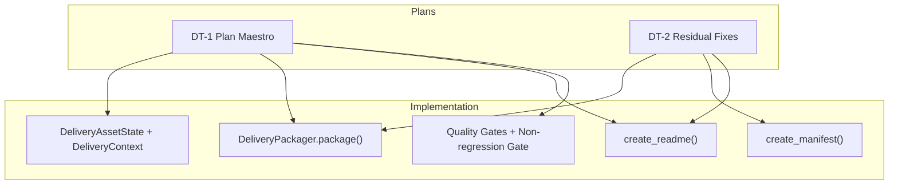
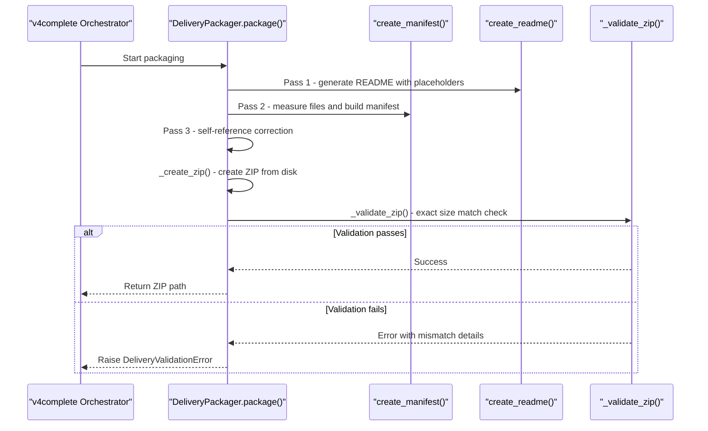
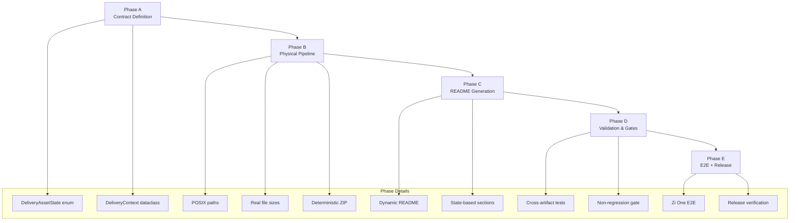
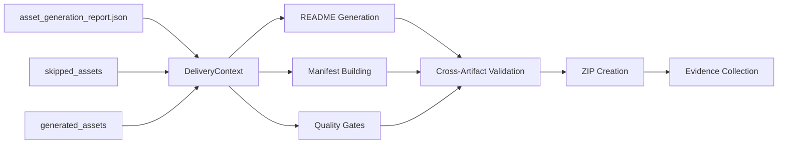

# Delivery Contract Overview and Methodology

<cite>
**Referenced Files in This Document**
- [01-plan-maestro.md](file://plans\Archives\DT-1-DELIVERY-CONTRACT-2026-07-23\01-plan-maestro.md)
- [02-prompt-fase-A.md](file://plans\Archives\DT-1-DELIVERY-CONTRACT-2026-07-23\02-prompt-fase-A.md)
- [05-prompt-fase-D.md](file://plans\Archives\DT-1-DELIVERY-CONTRACT-2026-07-23\05-prompt-fase-D.md)
- [01-plan-maestro.md](file://plans\Archives\DT-2-DELIVERY-CONTRACT-RESIDUAL-2026-07-24\01-plan-maestro.md)
- [02-prompt-fase-A.md](file://plans\Archives\DT-2-DELIVERY-CONTRACT-RESIDUAL-2026-07-24\02-prompt-fase-A.md)
- [CONTEXT-DELIVERY-ZIP-PACKAGING-BROKEN-2026-08-01.md](file://context\CONTEXT-DELIVERY-ZIP-PACKAGING-BROKEN-2026-08-01.md)
</cite>

## Table of Contents
1. Introduction
2. Project Structure
3. Core Components
4. Architecture Overview
5. Detailed Component Analysis
6. Dependency Analysis
7. Performance Considerations
8. Troubleshooting Guide
9. Conclusion

## Introduction
This document explains the Delivery Contract methodology that establishes a canonical contract unifying asset states, physical files, manifests, README documentation, quality gates, and evidence collection. The approach eliminates discrepancies between delivered assets and documented deliverables by enforcing a single source of truth across all delivery artifacts. It also details how this prevents issues such as the WhatsApp button discrepancy where documentation claimed an asset was delivered while it was not present in the ZIP package.

The methodology is implemented through a five-phase strategy:
- Phase A: Define the canonical contract (DeliveryAssetState enum and DeliveryContext dataclass).
- Phase B: Align the physical pipeline (POSIX paths, real sizes, deterministic ZIP, manifest built after writes).
- Phase C: Generate README dynamically from the delivery context.
- Phase D: Cross-artifact validation and non-regression gate.
- Phase E: End-to-end execution with Zi One and release verification.

Business value includes verifiable delivery contracts that improve client trust, reduce support overhead, and provide auditable evidence for every delivered asset.

**Section sources**
- [01-plan-maestro.md:28-53](file://plans\Archives\DT-1-DELIVERY-CONTRACT-2026-07-23\01-plan-maestro.md#L28-L53)
- [01-plan-maestro.md:54-84](file://plans\Archives\DT-1-DELIVERY-CONTRACT-2026-07-23\01-plan-maestro.md#L54-L84)
- [01-plan-maestro.md:86-104](file://plans\Archives\DT-1-DELIVERY-CONTRACT-2026-07-23\01-plan-maestro.md#L86-L104)

## Project Structure
The Delivery Contract spans multiple modules and plans:
- Canonical contract definitions and context construction are defined in Phase A prompts and plan documents.
- Packaging and manifest generation are aligned in Phase B to ensure POSIX paths and accurate file sizes.
- README generation is driven by the delivery context in Phase C.
- Validation and gates are enforced in Phase D.
- End-to-end verification and release are executed in Phase E.

**Diagram sources**
- [01-plan-maestro.md:54-84](file://plans\Archives\DT-1-DELIVERY-CONTRACT-2026-07-23\01-plan-maestro.md#L54-L84)
- [01-plan-maestro.md:45-70](file://plans\Archives\DT-2-DELIVERY-CONTRACT-RESIDUAL-2026-07-24\01-plan-maestro.md#L45-L70)

**Section sources**
- [01-plan-maestro.md:86-104](file://plans\Archives\DT-1-DELIVERY-CONTRACT-2026-07-23\01-plan-maestro.md#L86-L104)
- [01-plan-maestro.md:106-134](file://plans\Archives\DT-2-DELIVERY-CONTRACT-RESIDUAL-2026-07-24\01-plan-maestro.md#L106-L134)

## Core Components
The Delivery Contract centers on two core components:
- DeliveryAssetState enum: canonical states for each asset (delivered, present_in_production, present_with_issues, estimated, failed, indeterminate, not_delivered).
- DeliveryContext dataclass: aggregates assets, zip_filename, files, diagnostics_path, proposal_path, and provides grouped properties for each state.

These components unify asset states across the pipeline, ensuring consistency between generated assets, skipped assets due to presence checks, and advisory guides.

Key responsibilities:
- Normalizing asset states from asset_generation_report.json and skipped_assets.
- Providing filtered views for delivered, present, present_with_issues, estimated, and advisory assets.
- Enabling README sections derived from these groupings.

**Section sources**
- [02-prompt-fase-A.md:37-53](file://plans\Archives\DT-1-DELIVERY-CONTRACT-2026-07-23\02-prompt-fase-A.md#L37-L53)
- [02-prompt-fase-A.md:166-215](file://plans\Archives\DT-1-DELIVERY-CONTRACT-2026-07-23\02-prompt-fase-A.md#L166-L215)
- [02-prompt-fase-A.md:216-312](file://plans\Archives\DT-1-DELIVERY-CONTRACT-2026-07-23\02-prompt-fase-A.md#L216-L312)

## Architecture Overview
The Delivery Contract architecture enforces a strict ordering and immutability principle:
- Pass 1: Generate README with placeholders.
- Pass 2: Build manifest measuring actual file sizes.
- Pass 3: Self-reference correction for MANIFEST.json.
- Final: Create ZIP and validate exact match against manifest.

**Diagram sources**
- [CONTEXT-DELIVERY-ZIP-PACKAGING-BROKEN-2026-08-01.md:36-55](file://context\CONTEXT-DELIVERY-ZIP-PACKAGING-BROKEN-2026-08-01.md#L36-L55)
- [CONTEXT-DELIVERY-ZIP-PACKAGING-BROKEN-2026-08-01.md:146-176](file://context\CONTEXT-DELIVERY-ZIP-PACKAGING-BROKEN-2026-08-01.md#L146-L176)

## Detailed Component Analysis

### DeliveryAssetState Enum
The enum defines seven canonical states for assets:
- DELIVERED: File generated and present in ZIP
- PRESENT_IN_PRODUCTION: Exists in site, verified, without issues
- PRESENT_WITH_ISSUES: Exists in site but with conflicts (e.g., WhatsApp)
- ESTIMATED: Generated with estimated data (ESTIMATED_ prefix)
- FAILED: Generation failed
- INDETERMINATE: Could not verify presence
- NOT_DELIVERED: Not generated and not present in production

This enum ensures consistent state representation across all delivery artifacts.

**Section sources**
- [02-prompt-fase-A.md:37-53](file://plans\Archives\DT-1-DELIVERY-CONTRACT-2026-07-23\02-prompt-fase-A.md#L37-L53)

### DeliveryContext Dataclass
The DeliveryContext dataclass serves as the central contract structure:
- hotel_id: Identifier for the hotel/client
- zip_filename: Final ZIP filename (e.g., zione_20260723.zip)
- assets: List of DeliveryAssetEntry objects
- files: List of files_to_package with destinations
- diagnostics_path: Path to diagnostic documents
- proposal_path: Path to commercial proposal

Key properties include delivered_assets, present_assets, present_with_issues_assets, estimated_assets, and advisory_assets for filtering assets by state.

**Section sources**
- [02-prompt-fase-A.md:166-215](file://plans\Archives\DT-1-DELIVERY-CONTRACT-2026-07-23\02-prompt-fase-A.md#L166-L215)

### README Generation from Delivery Context
README generation is driven by the delivery context rather than static templates:
- Sections are organized by asset state (delivered, present_in_production, present_with_issues, estimated, evidence)
- Package Structure is derived from actual ZIP destination paths
- No hardcoded asset names; everything comes from the canonical contract
- Advisory guides are handled separately with special formatting

This approach ensures README content matches the actual delivered assets.

**Section sources**
- [01-plan-maestro.md:68-84](file://plans\Archives\DT-1-DELIVERY-CONTRACT-2026-07-23\01-plan-maestro.md#L68-L84)
- [01-plan-maestro.md:125-146](file://plans\Archives\DT-1-DELIVERY-CONTRACT-2026-07-23\01-plan-maestro.md#L125-L146)

### Five-Phase Implementation Strategy
The implementation follows a structured five-phase approach:

**Diagram sources**
- [01-plan-maestro.md:86-104](file://plans\Archives\DT-1-DELIVERY-CONTRACT-2026-07-23\01-plan-maestro.md#L86-L104)

**Section sources**
- [01-plan-maestro.md:86-104](file://plans\Archives\DT-1-DELIVERY-CONTRACT-2026-07-23\01-plan-maestro.md#L86-L104)

### WhatsApp Button Discrepancy Prevention
The Delivery Contract specifically addresses the WhatsApp button issue where documentation claimed delivery but the asset was not present in the ZIP:

**Root Cause**: README was generated from static templates rather than actual ZIP contents or canonical asset states.

**Solution**: 
- Asset states are determined from asset_generation_report.json and skipped_assets
- WhatsApp button with presence_verified=true gets state PRESENT_IN_PRODUCTION or PRESENT_WITH_ISSUES
- README sections reflect actual states, not template assumptions
- Cross-artifact validation ensures README ⊆ ZIP ⊆ Manifest

**Section sources**
- [01-plan-maestro.md:13-27](file://plans\Archives\DT-1-DELIVERY-CONTRACT-2026-07-23\01-plan-maestro.md#L13-L27)
- [01-plan-maestro.md:28-33](file://plans\Archives\DT-1-DELIVERY-CONTRACT-2026-07-23\01-plan-maestro.md#L28-L33)

## Dependency Analysis
The Delivery Contract creates clear dependencies between components:

**Diagram sources**
- [02-prompt-fase-A.md:216-312](file://plans\Archives\DT-1-DELIVERY-CONTRACT-2026-07-23\02-prompt-fase-A.md#L216-L312)
- [01-plan-maestro.md:68-84](file://plans\Archives\DT-1-DELIVERY-CONTRACT-2026-07-23\01-plan-maestro.md#L68-L84)

**Section sources**
- [01-plan-maestro.md:96-104](file://plans\Archives\DT-1-DELIVERY-CONTRACT-2026-07-23\01-plan-maestro.md#L96-L104)

## Performance Considerations
The Delivery Contract methodology optimizes performance through:
- Single-pass manifest building after all files are written
- Deterministic ZIP creation with two-pass approach
- Efficient README generation from pre-computed delivery context
- Minimal re-processing of asset states through cached DeliveryContext

Key optimizations:
- Avoid redundant asset state calculations
- Use POSIX paths consistently to prevent cross-platform issues
- Implement early validation to fail fast on inconsistencies
- Cache delivery context to avoid repeated report parsing

## Troubleshooting Guide
Common issues and their resolutions:

**README Size Mismatch**: When README placeholders are replaced after manifest measurement, causing size mismatches. Solution: Re-measure README after placeholder replacement and update manifest accordingly.

**MANIFEST Self-Reference Instability**: Circular dependency when MANIFEST measures its own size. Solution: Use iterative convergence approach with fixed iteration count.

**Silent Fallback Mode**: Exception handling that silently falls back to legacy mode. Solution: Replace with explicit logging and warning flags.

**Test Coverage Gaps**: Tests not exercising production code paths. Solution: Add fixtures with asset_generation_report.json to exercise DeliveryContext mode.

**Section sources**
- [CONTEXT-DELIVERY-ZIP-PACKAGING-BROKEN-2026-08-01.md:146-176](file://context\CONTEXT-DELIVERY-ZIP-PACKAGING-BROKEN-2026-08-01.md#L146-L176)
- [CONTEXT-DELIVERY-ZIP-PACKAGING-BROKEN-2026-08-01.md:256-274](file://context\CONTEXT-DELIVERY-ZIP-PACKAGING-BROKEN-2026-08-01.md#L256-L274)

## Conclusion
The Delivery Contract methodology provides a robust framework for ensuring consistency between delivered assets and documented deliverables. By establishing canonical asset states, unified context management, and strict validation gates, it eliminates discrepancies like the WhatsApp button issue and builds client trust through verifiable delivery contracts.

The five-phase implementation strategy ensures systematic adoption while maintaining backward compatibility. Business benefits include reduced support overhead, improved client confidence, and comprehensive audit trails for compliance requirements.

This approach transforms delivery from a best-effort process into a scientifically verifiable contract that can be trusted by clients and auditors alike.