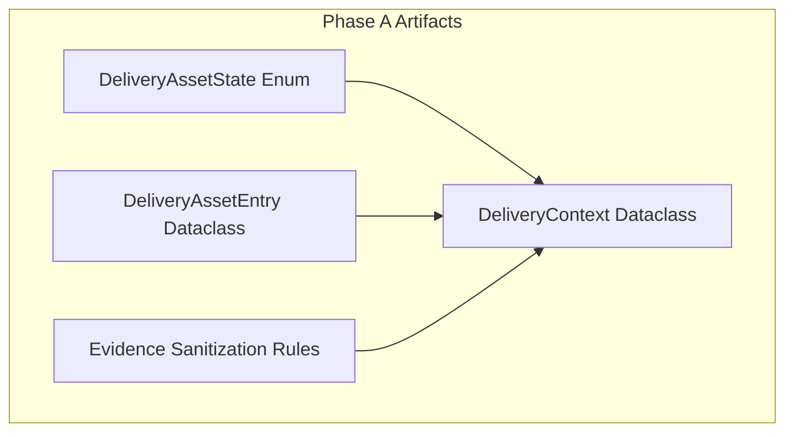
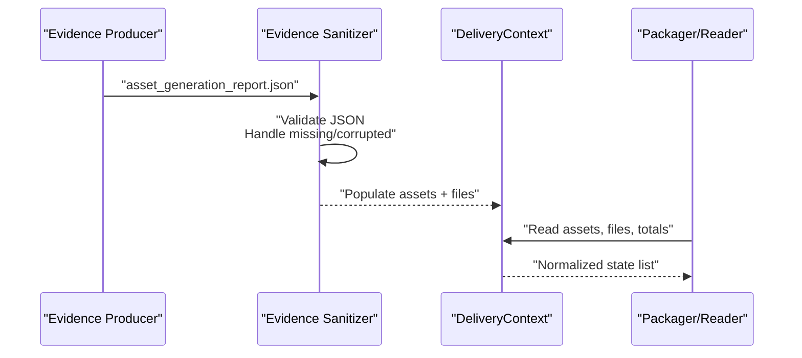
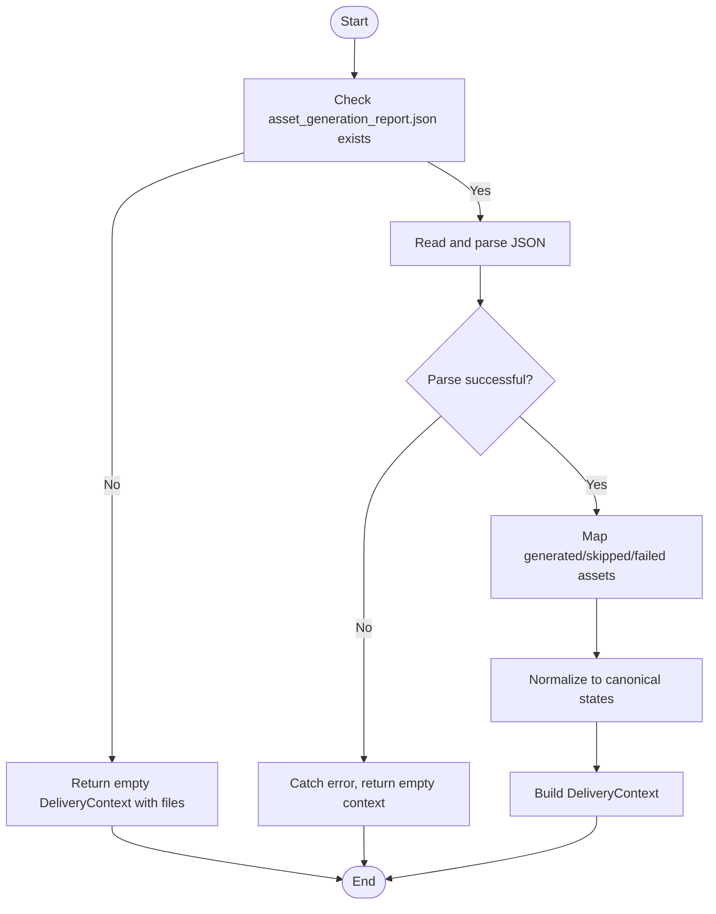
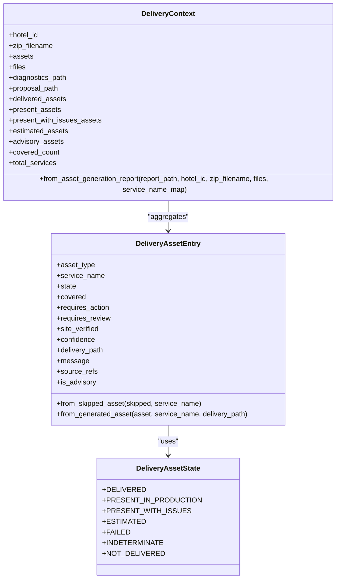

# Phase A: Canonical Contract Definition and Evidence Sanitization

<cite>
**Referenced Files in This Document**
- [02-prompt-fase-A.md](file://plans/Archives/DT-1-DELIVERY-CONTRACT-2026-07-23/02-prompt-fase-A.md)
- [05-prompt-fase-D.md](file://plans/Archives/DT-1-DELIVERY-CONTRACT-2026-07-23/05-prompt-fase-D.md)
- [DT-1-README-DELIVERY-PRESENT-IN-PRODUCTION.md](file://context/Historico/DT-1-README-DELIVERY-PRESENT-IN-PRODUCTION.md)
- [CONTEXT-DT-2-DELIVERY-CONTRACT-RESIDUAL.md](file://context/Historico/CONTEXT-DT-2-DELIVERY-CONTRACT-RESIDUAL.md)
</cite>

## Table of Contents
1. [Introduction](#introduction)
2. [Project Structure](#project-structure)
3. [Core Components](#core-components)
4. [Architecture Overview](#architecture-overview)
5. [Detailed Component Analysis](#detailed-component-analysis)
6. [Dependency Analysis](#dependency-analysis)
7. [Performance Considerations](#performance-considerations)
8. [Troubleshooting Guide](#troubleshooting-guide)
9. [Conclusion](#conclusion)

## Introduction
Phase A establishes the canonical contract for delivery asset states and the evidence sanitization foundation that subsequent phases rely on. It defines a single source of truth for asset states, normalizes how assets are represented, and provides robust mechanisms to handle corrupted or missing evidence files. The result is a stable DeliveryContext that downstream packaging and reporting components can consume without re-implementing business logic.

## Project Structure
Phase A artifacts are defined in planning prompts and contextual documents that specify the canonical enum, dataclasses, and behavior expected from the implementation. These references collectively define:
- The canonical state enum for delivery assets
- The entry model for individual assets
- The aggregate context used by the packager and report generators
- Fallback behavior when evidence is missing or invalid

[No sources needed since this diagram shows conceptual structure]

**Section sources**
- [02-prompt-fase-A.md](file://plans/Archives/DT-1-DELIVERY-CONTRACT-2026-07-23/02-prompt-fase-A.md)
- [05-prompt-fase-D.md](file://plans/Archives/DT-1-DELIVERY-CONTRACT-2026-07-23/05-prompt-fase-D.md)
- [DT-1-README-DELIVERY-PRESENT-IN-PRODUCTION.md](file://context/Historico/DT-1-README-DELIVERY-PRESENT-IN-PRODUCTION.md)
- [CONTEXT-DT-2-DELIVERY-CONTRACT-RESIDUAL.md](file://context/Historico/CONTEXT-DT-2-DELIVERY-CONTRACT-RESIDUAL.md)

## Core Components
Phase A introduces three core components:
- DeliveryAssetState: an enum defining the canonical set of asset states
- DeliveryAssetEntry: a dataclass representing a single asset with its state and metadata
- DeliveryContext: a dataclass aggregating assets, file lists, totals, and package metadata

These components provide a unified contract for all downstream consumers (packager, README generator, manifest builder).

**Section sources**
- [02-prompt-fase-A.md](file://plans/Archives/DT-1-DELIVERY-CONTRACT-2026-07-23/02-prompt-fase-A.md)
- [05-prompt-fase-D.md](file://plans/Archives/DT-1-DELIVERY-CONTRACT-2026-07-23/05-prompt-fase-D.md)
- [DT-1-README-DELIVERY-PRESENT-IN-PRODUCTION.md](file://context/Historico/DT-1-README-DELIVERY-PRESENT-IN-PRODUCTION.md)

## Architecture Overview
The Phase A architecture centers around a canonical contract that normalizes heterogeneous evidence into a consistent DeliveryContext. Consumers such as the packager and documentation generators use this context instead of parsing raw reports directly.

**Diagram sources**
- [02-prompt-fase-A.md](file://plans/Archives/DT-1-DELIVERY-CONTRACT-2026-07-23/02-prompt-fase-A.md)
- [05-prompt-fase-D.md](file://plans/Archives/DT-1-DELIVERY-CONTRACT-2026-07-23/05-prompt-fase-D.md)

## Detailed Component Analysis

### DeliveryAssetState Enum
Defines seven canonical states for assets:
- DELIVERED: Generated file present in the ZIP
- PRESENT_IN_PRODUCTION: Exists on site, verified, no issues
- PRESENT_WITH_ISSUES: Exists but has conflicts or problems
- ESTIMATED: Generated with estimated data
- FAILED: Generation failed
- INDETERMINATE: Presence could not be verified
- NOT_DELIVERED: Not generated and not present in production

Semantic rules:
- Do not infer requires_action=False solely because presence_status indicates existence
- Advisory guides should not require installation actions but may require review

**Section sources**
- [02-prompt-fase-A.md](file://plans/Archives/DT-1-DELIVERY-CONTRACT-2026-07-23/02-prompt-fase-A.md)
- [DT-1-README-DELIVERY-PRESENT-IN-PRODUCTION.md](file://context/Historico/DT-1-README-DELIVERY-PRESENT-IN-PRODUCTION.md)
- [CONTEXT-DT-2-DELIVERY-CONTRACT-RESIDUAL.md](file://context/Historico/CONTEXT-DT-2-DELIVERY-CONTRACT-RESIDUAL.md)

### DeliveryAssetEntry Dataclass
Represents a single asset with:
- asset_type and service_name
- state (from DeliveryAssetState)
- flags: covered, requires_action, requires_review, site_verified
- confidence score
- delivery_path (if applicable)
- message and source_refs for traceability

Factory methods:
- from_skipped_asset: maps skipped entries to canonical states based on presence_status and verification results
- from_generated_asset: maps generated entries to canonical states based on preflight status and filename patterns

Advisory detection:
- Assets whose asset_type ends with “guide” are treated as advisory (no installation required, review recommended)

**Section sources**
- [05-prompt-fase-D.md](file://plans/Archives/DT-1-DELIVERY-CONTRACT-2026-07-23/05-prompt-fase-D.md)
- [02-prompt-fase-A.md](file://plans/Archives/DT-1-DELIVERY-CONTRACT-2026-07-23/02-prompt-fase-A.md)

### DeliveryContext Dataclass
Aggregates:
- hotel_id
- zip_filename (final ZIP name)
- assets (list of DeliveryAssetEntry)
- files (list of dicts describing physical files and POSIX destinations)
- diagnostics_path and proposal_path (optional)

Computed properties:
- delivered_assets, present_assets, present_with_issues_assets, estimated_assets, advisory_assets
- covered_count and total_services

Construction:
- from_asset_generation_report(report_path, hotel_id, zip_filename, files, service_name_map=None):
  - If report_path does not exist, returns an empty context with provided files (legacy fallback)
  - Parses JSON; if invalid, returns an empty context gracefully
  - Maps generated_assets, skipped_assets, and failed_assets to DeliveryAssetEntry instances
  - Resolves human-readable service names via default mapping or provided map

**Section sources**
- [02-prompt-fase-A.md](file://plans/Archives/DT-1-DELIVERY-CONTRACT-2026-07-23/02-prompt-fase-A.md)
- [05-prompt-fase-D.md](file://plans/Archives/DT-1-DELIVERY-CONTRACT-2026-07-23/05-prompt-fase-D.md)

### Evidence Sanitization Process
Handles corrupted or missing asset_generation_report.json:
- Missing report: return an empty DeliveryContext with provided files (legacy mode)
- Invalid JSON: catch parse errors and return an empty context without crashing
- Normalization: map heterogeneous presence statuses and generation outcomes to canonical states
- Traceability: include source_refs and messages for each asset entry

**Diagram sources**
- [02-prompt-fase-A.md](file://plans/Archives/DT-1-DELIVERY-CONTRACT-2026-07-23/02-prompt-fase-A.md)
- [05-prompt-fase-D.md](file://plans/Archives/DT-1-DELIVERY-CONTRACT-2026-07-23/05-prompt-fase-D.md)

### State Transition Examples
Examples derived from tests and specifications:
- Skipped asset with presence_status=exists and site_verified=True → PRESENT_IN_PRODUCTION (covered=True, requires_action=False)
- Skipped asset with presence_status=exists but conflict → PRESENT_WITH_ISSUES (covered=False, requires_action=True, requires_review=True)
- Skipped asset with presence_status=verification_failed → INDETERMINATE (requires_review=True, site_verified=False)
- Generated asset with preflight PASSED → DELIVERED (covered=True, requires_action=True)
- Generated asset with ESTIMATED prefix or WARNING preflight → ESTIMATED (requires_review=True)
- Generated asset with BLOCKED preflight → FAILED (covered=False)
- Advisory guide (asset_type ending with “guide”) → is_advisory=True (requires_action=False, requires_review=True)

**Section sources**
- [05-prompt-fase-D.md](file://plans/Archives/DT-1-DELIVERY-CONTRACT-2026-07-23/05-prompt-fase-D.md)

### Context Validation Rules
- assets list must reflect all generated, skipped, and failed entries
- files list must contain POSIX paths for physical files
- totals: covered_count equals number of assets where covered=True; total_services equals len(assets)
- Advisory assets are excluded from installation-focused sections (e.g., delivered/estimated grouping excludes advisory)

**Section sources**
- [02-prompt-fase-A.md](file://plans/Archives/DT-1-DELIVERY-CONTRACT-2026-07-23/02-prompt-fase-A.md)
- [05-prompt-fase-D.md](file://plans/Archives/DT-1-DELIVERY-CONTRACT-2026-07-23/05-prompt-fase-D.md)

### Error Handling Patterns
- Missing report path: return empty context without raising exceptions
- Invalid JSON: catch parse errors and return empty context
- Advisory vs installable distinction: ensure advisory assets do not imply installation requirements
- Legacy compatibility: when DeliveryContext cannot be built, fall back to legacy behavior without breaking consumers

**Section sources**
- [02-prompt-fase-A.md](file://plans/Archives/DT-1-DELIVERY-CONTRACT-2026-07-23/02-prompt-fase-A.md)
- [05-prompt-fase-D.md](file://plans/Archives/DT-1-DELIVERY-CONTRACT-2026-07-23/05-prompt-fase-D.md)

## Dependency Analysis
Phase A defines the canonical contract consumed by later phases. The dependency relationships are:
- DeliveryAssetEntry depends on DeliveryAssetState
- DeliveryContext aggregates multiple DeliveryAssetEntry instances and files
- Downstream modules depend on DeliveryContext rather than raw reports

**Diagram sources**
- [02-prompt-fase-A.md](file://plans/Archives/DT-1-DELIVERY-CONTRACT-2026-07-23/02-prompt-fase-A.md)
- [05-prompt-fase-D.md](file://plans/Archives/DT-1-DELIVERY-CONTRACT-2026-07-23/05-prompt-fase-D.md)

**Section sources**
- [02-prompt-fase-A.md](file://plans/Archives/DT-1-DELIVERY-CONTRACT-2026-07-23/02-prompt-fase-A.md)
- [05-prompt-fase-D.md](file://plans/Archives/DT-1-DELIVERY-CONTRACT-2026-07-23/05-prompt-fase-D.md)

## Performance Considerations
- Evidence parsing is O(n) over the number of assets in the report
- Mapping service names uses a dictionary lookup (O(1))
- Filtering properties on DeliveryContext iterate over assets once per property; consider caching if accessed frequently
- Avoid repeated JSON parsing by constructing DeliveryContext once per run

[No sources needed since this section provides general guidance]

## Troubleshooting Guide
Common issues and resolutions:
- Missing asset_generation_report.json: Expect an empty DeliveryContext; verify upstream pipeline produces the report
- Invalid JSON in report: Ensure proper formatting; the sanitizer will return an empty context without crashing
- Advisory assets appearing in installation sections: Confirm is_advisory filtering is applied in consumer logic
- Mismatched file counts: Validate that files list reflects final POSiX destinations and that totals are computed after all passes

**Section sources**
- [02-prompt-fase-A.md](file://plans/Archives/DT-1-DELIVERY-CONTRACT-2026-07-23/02-prompt-fase-A.md)
- [05-prompt-fase-D.md](file://plans/Archives/DT-1-DELIVERY-CONTRACT-2026-07-23/05-prompt-fase-D.md)

## Conclusion
Phase A establishes a robust, canonical contract for delivery asset states and a resilient evidence sanitization mechanism. By centralizing asset state representation and context construction, it ensures consistency across packaging, reporting, and validation phases. Subsequent phases build upon this foundation to implement reliable ZIP packaging, manifest generation, and user-facing documentation.