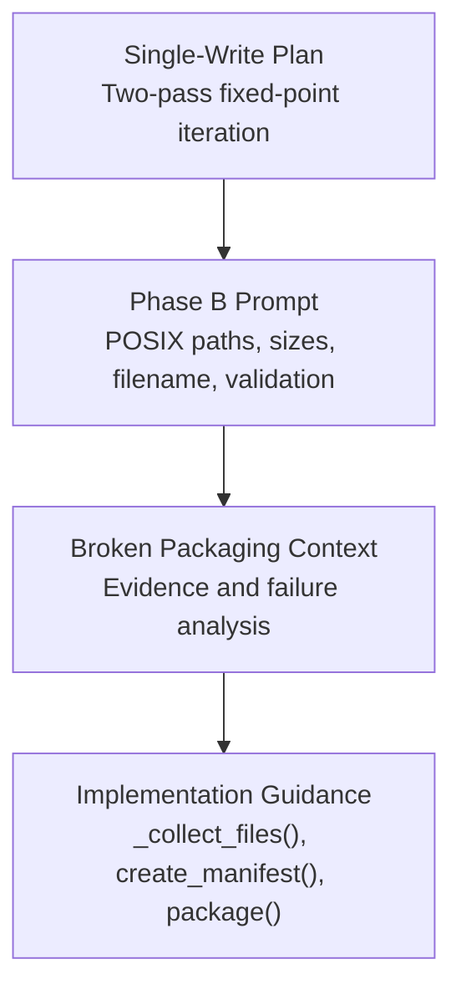
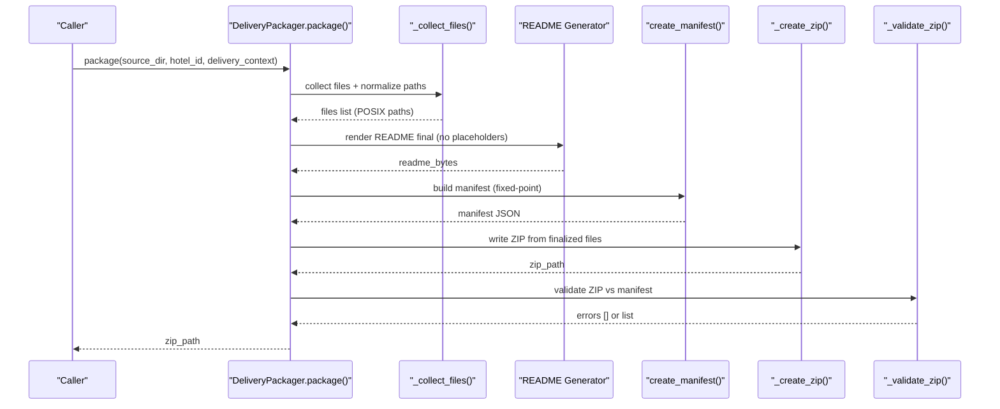
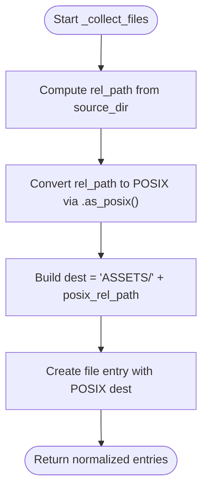
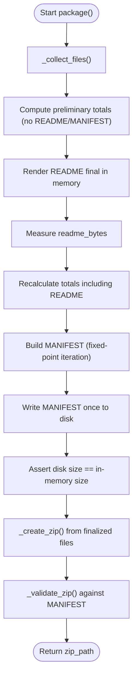
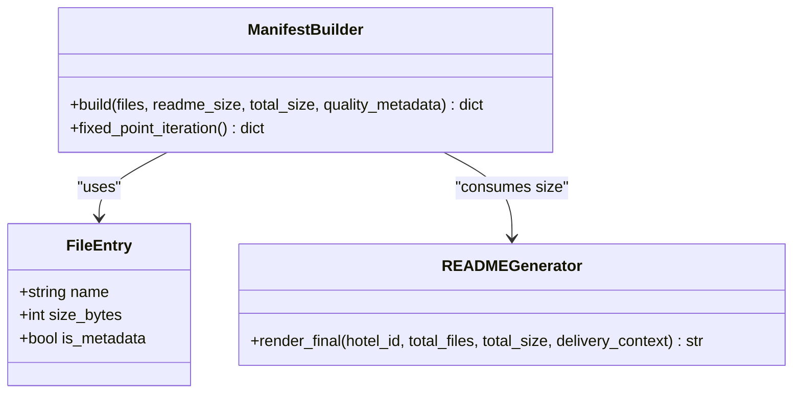
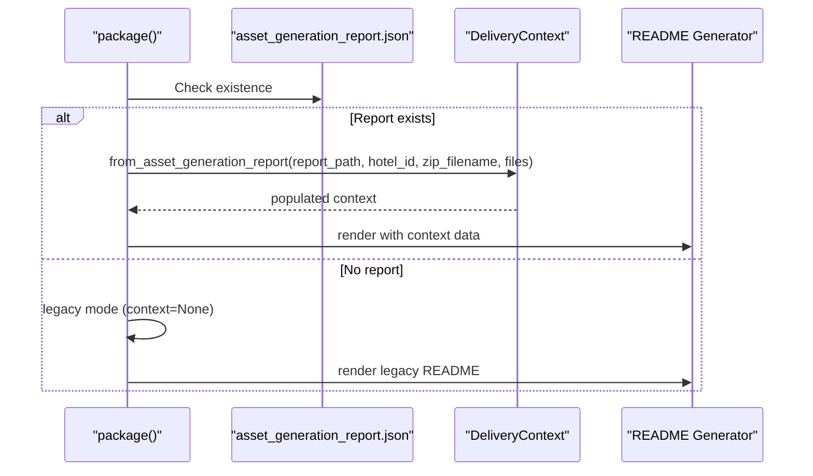
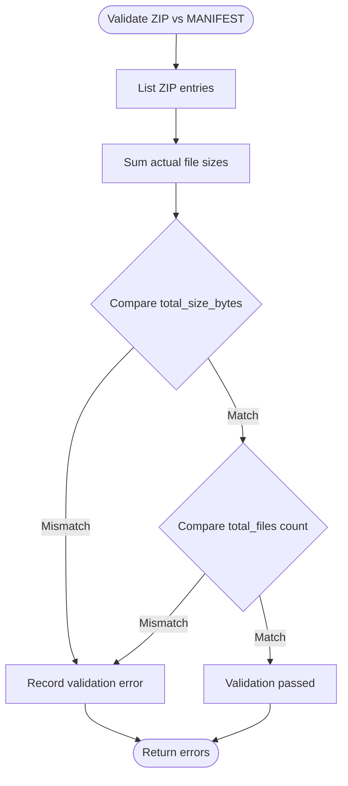
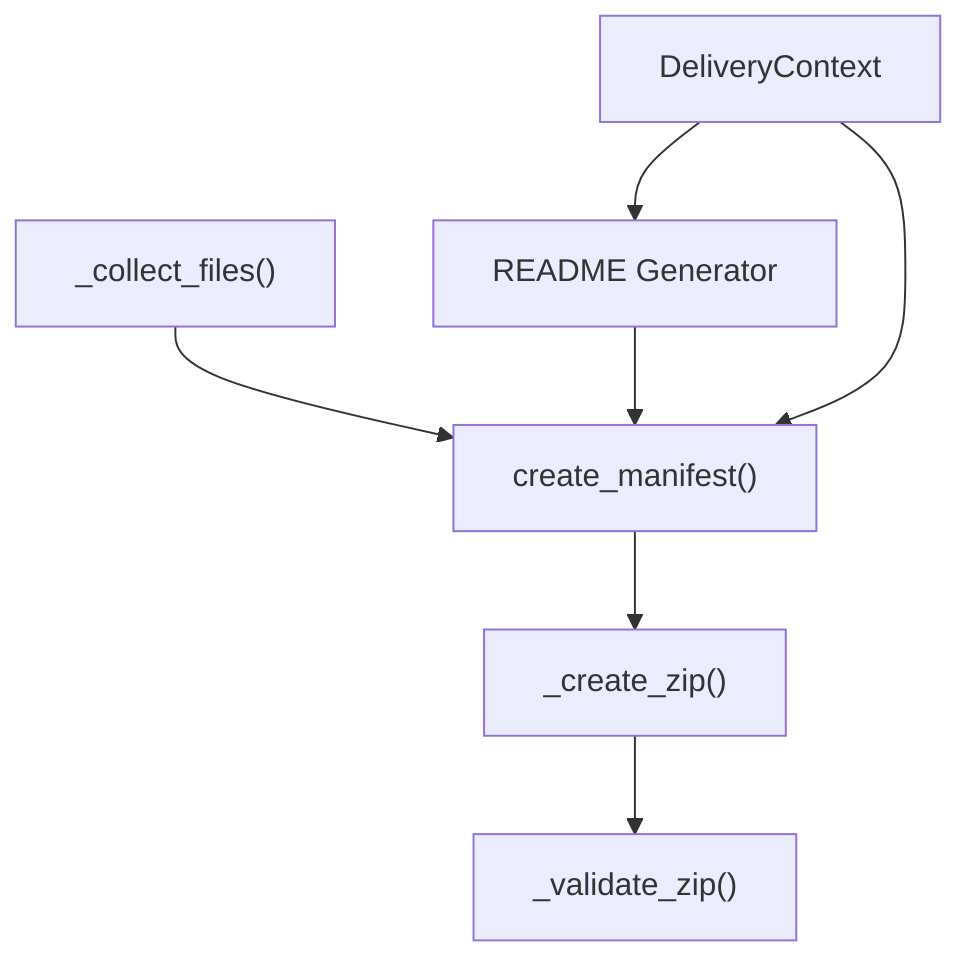

# Phase B: Physical ZIP Pipeline and Manifest Generation

<cite>
**Referenced Files in This Document**
- [03-prompt-fase-B.md](file://plans/Archives/DT-1-DELIVERY-CONTRACT-2026-07-23/03-prompt-fase-B.md)
- [CONTEXT-DELIVERY-ZIP-PACKAGING-BROKEN-2026-08-01.md](file://context/CONTEXT-DELIVERY-ZIP-PACKAGING-BROKEN-2026-08-01.md)
- [03-prompt-fase-B.md](file://plans/DELIVERY-ZIP-SINGLE-WRITE-2026-08-01/03-prompt-fase-B.md)
- [README.md](file://plans/DELIVERY-ZIP-SINGLE-WRITE-2026-08-01/README.md)
</cite>

## Table of Contents
1. [Introduction](#introduction)
2. [Project Structure](#project-structure)
3. [Core Components](#core-components)
4. [Architecture Overview](#architecture-overview)
5. [Detailed Component Analysis](#detailed-component-analysis)
6. [Dependency Analysis](#dependency-analysis)
7. [Performance Considerations](#performance-considerations)
8. [Troubleshooting Guide](#troubleshooting-guide)
9. [Conclusion](#conclusion)

## Introduction
This document specifies the Phase B implementation for the physical ZIP pipeline and manifest generation. It focuses on cross-platform POSIX path normalization, deterministic two-pass ZIP creation with accurate size calculations, and robust manifest generation that includes metadata files such as README_DELIVERY.md and MANIFEST.json. It also documents DeliveryContext integration into the packaging pipeline, real file size calculation and validation, and error handling for permissions, disk space, and integrity verification.

## Project Structure
Phase B is defined by plan artifacts that describe the required changes to the packaging pipeline. The relevant materials include:
- A Phase B prompt detailing POSIX path normalization, manifest sizing, filename consistency, post-ZIP validation, and DeliveryContext loading.
- A context document describing the broken delivery packaging behavior and evidence of failures.
- A single-write architecture plan that redefines the core packaging flow to eliminate measure-then-mutate issues and ensure deterministic output.

**Diagram sources**
- [03-prompt-fase-B.md](file://plans/Archives/DT-1-DELIVERY-CONTRACT-2026-07-23/03-prompt-fase-B.md)
- [CONTEXT-DELIVERY-ZIP-PACKAGING-BROKEN-2026-08-01.md](file://context/CONTEXT-DELIVERY-ZIP-PACKAGING-BROKEN-2026-08-01.md)
- [03-prompt-fase-B.md](file://plans/DELIVERY-ZIP-SINGLE-WRITE-2026-08-01/03-prompt-fase-B.md)

**Section sources**
- [03-prompt-fase-B.md](file://plans/Archives/DT-1-DELIVERY-CONTRACT-2026-07-23/03-prompt-fase-B.md)
- [CONTEXT-DELIVERY-ZIP-PACKAGING-BROKEN-2026-08-01.md](file://context/CONTEXT-DELIVERY-ZIP-PACKAGING-BROKEN-2026-08-01.md)
- [03-prompt-fase-B.md](file://plans/DELIVERY-ZIP-SINGLE-WRITE-2026-08-01/03-prompt-fase-B.md)
- [README.md](file://plans/DELIVERY-ZIP-SINGLE-WRITE-2026-08-01/README.md)

## Core Components
Phase B centers on three primary components within the packaging pipeline:
- POSIX Path Conversion System: Ensures all internal ZIP paths use forward slashes, eliminating Windows backslashes.
- Two-Pass ZIP Creation: Computes sizes deterministically before writing, then creates the ZIP once with final content.
- Manifest Generation: Produces MANIFEST.json after all files are written, including accurate sizes for metadata files like README_DELIVERY.md and MANIFEST.json itself.

Key responsibilities:
- _collect_files(): Normalize paths using POSIX separators.
- create_manifest(): Compute exact sizes for all entries, including self-referencing MANIFEST.json.
- package(): Orchestrate the pipeline, integrate DeliveryContext, and validate ZIP integrity.

**Section sources**
- [03-prompt-fase-B.md](file://plans/Archives/DT-1-DELIVERY-CONTRACT-2026-07-23/03-prompt-fase-B.md)
- [03-prompt-fase-B.md](file://plans/DELIVERY-ZIP-SINGLE-WRITE-2026-08-01/03-prompt-fase-B.md)

## Architecture Overview
The Phase B pipeline follows a deterministic sequence:
1. Collect files and normalize paths to POSIX format.
2. Calculate preliminary totals (excluding README and MANIFEST).
3. Generate final README content in memory with computed totals.
4. Measure README bytes exactly.
5. Recalculate totals including README.
6. Build MANIFEST in memory with fixed-point iteration for self-reference stability.
7. Write MANIFEST once to disk.
8. Assert disk size equals in-memory size.
9. Create ZIP from finalized files.
10. Validate ZIP against MANIFEST with zero tolerance.

**Diagram sources**
- [03-prompt-fase-B.md](file://plans/DELIVERY-ZIP-SINGLE-WRITE-2026-08-01/03-prompt-fase-B.md)

**Section sources**
- [03-prompt-fase-B.md](file://plans/DELIVERY-ZIP-SINGLE-WRITE-2026-08-01/03-prompt-fase-B.md)

## Detailed Component Analysis

### POSIX Path Conversion System
- Purpose: Ensure all internal ZIP paths use forward slashes (/), avoiding Windows-style backslashes (\).
- Implementation focus: Modify path construction in _collect_files() to use .as_posix() for relative paths when building destination strings.
- Impact: Eliminates cross-platform path inconsistencies in ZIP archives and manifests.

**Diagram sources**
- [03-prompt-fase-B.md](file://plans/Archives/DT-1-DELIVERY-CONTRACT-2026-07-23/03-prompt-fase-B.md)

**Section sources**
- [03-prompt-fase-B.md](file://plans/Archives/DT-1-DELIVERY-CONTRACT-2026-07-23/03-prompt-fase-B.md)

### Two-Pass ZIP Creation Process
- Purpose: Achieve deterministic output and accurate size calculations by computing sizes before writing and creating the ZIP only once with final content.
- Steps:
  - Pass 1: Collect files and compute preliminary totals (excluding README and MANIFEST).
  - Render final README in memory without placeholders; measure exact byte size.
  - Recalculate totals including README.
  - Build MANIFEST with fixed-point iteration to stabilize self-reference size.
  - Write MANIFEST once; assert disk size matches in-memory size.
  - Create ZIP from finalized files; validate ZIP against MANIFEST with zero tolerance.

**Diagram sources**
- [03-prompt-fase-B.md](file://plans/DELIVERY-ZIP-SINGLE-WRITE-2026-08-01/03-prompt-fase-B.md)

**Section sources**
- [03-prompt-fase-B.md](file://plans/DELIVERY-ZIP-SINGLE-WRITE-2026-08-01/03-prompt-fase-B.md)

### Manifest Generation After All Files Are Written
- Purpose: Produce an accurate MANIFEST.json that includes real file sizes for all entries, including metadata files like README_DELIVERY.md and MANIFEST.json itself.
- Key aspects:
  - Self-reference: MANIFEST.json includes its own size via fixed-point iteration to converge on stable values.
  - Metadata inclusion: README_DELIVERY.md and other metadata files must have size_bytes > 0.
  - Total accuracy: total_size_bytes should match the sum of actual file sizes within tight tolerance.

**Diagram sources**
- [03-prompt-fase-B.md](file://plans/Archives/DT-1-DELIVERY-CONTRACT-2026-07-23/03-prompt-fase-B.md)
- [03-prompt-fase-B.md](file://plans/DELIVERY-ZIP-SINGLE-WRITE-2026-08-01/03-prompt-fase-B.md)

**Section sources**
- [03-prompt-fase-B.md](file://plans/Archives/DT-1-DELIVERY-CONTRACT-2026-07-23/03-prompt-fase-B.md)
- [03-prompt-fase-B.md](file://plans/DELIVERY-ZIP-SINGLE-WRITE-2026-08-01/03-prompt-fase-B.md)

### DeliveryContext Integration into Packaging Pipeline
- Purpose: Integrate DeliveryContext into package() to provide rich asset state information for dynamic README generation and manifest enrichment.
- Behavior:
  - If asset_generation_report.json exists and hotel_dir is available, construct DeliveryContext via from_asset_generation_report().
  - If not available, fall back to legacy mode with None context.
  - Use context properties (e.g., delivered_assets, present_assets) to enrich README and manifest metadata.

**Diagram sources**
- [03-prompt-fase-B.md](file://plans/Archives/DT-1-DELIVERY-CONTRACT-2026-07-23/03-prompt-fase-B.md)

**Section sources**
- [03-prompt-fase-B.md](file://plans/Archives/DT-1-DELIVERY-CONTRACT-2026-07-23/03-prompt-fase-B.md)

### Real File Size Calculation and Validation
- Purpose: Ensure all file sizes in MANIFEST.json reflect actual byte counts, including metadata files.
- Validation:
  - Compare total_size_bytes with sum of individual file sizes.
  - Verify total_files matches the number of entries in the ZIP namelist.
  - Enforce zero-tolerance validation between ZIP contents and MANIFEST.

**Diagram sources**
- [03-prompt-fase-B.md](file://plans/Archives/DT-1-DELIVERY-CONTRACT-2026-07-23/03-prompt-fase-B.md)

**Section sources**
- [03-prompt-fase-B.md](file://plans/Archives/DT-1-DELIVERY-CONTRACT-2026-07-23/03-prompt-fase-B.md)

## Dependency Analysis
Phase B introduces dependencies between packaging components:
- _collect_files() depends on path normalization utilities to ensure POSIX compatibility.
- create_manifest() depends on finalized README content and file sizes.
- package() orchestrates the entire pipeline and integrates DeliveryContext.
- _validate_zip() depends on both ZIP contents and MANIFEST structure.

**Diagram sources**
- [03-prompt-fase-B.md](file://plans/Archives/DT-1-DELIVERY-CONTRACT-2026-07-23/03-prompt-fase-B.md)
- [03-prompt-fase-B.md](file://plans/DELIVERY-ZIP-SINGLE-WRITE-2026-08-01/03-prompt-fase-B.md)

**Section sources**
- [03-prompt-fase-B.md](file://plans/Archives/DT-1-DELIVERY-CONTRACT-2026-07-23/03-prompt-fase-B.md)
- [03-prompt-fase-B.md](file://plans/DELIVERY-ZIP-SINGLE-WRITE-2026-08-01/03-prompt-fase-B.md)

## Performance Considerations
- Fixed-point iteration for manifest self-reference converges quickly (≤3 iterations), minimizing computational overhead.
- Single-write architecture eliminates redundant passes over files, reducing I/O operations.
- In-memory rendering of README avoids temporary file writes until finalization.
- Zero-tolerance validation ensures correctness but may incur additional I/O for verification.

[No sources needed since this section provides general guidance]

## Troubleshooting Guide
Common issues and resolutions:
- Permission errors during file writes: Ensure write permissions for deliveries directory and handle exceptions gracefully.
- Disk space constraints: Check available space before writing large files; implement pre-flight checks.
- Integrity verification failures: Review validation errors from _validate_zip(); ensure ZIP contents match MANIFEST exactly.
- Legacy mode fallback: When DeliveryContext is unavailable, verify README generation falls back correctly.

**Section sources**
- [CONTEXT-DELIVERY-ZIP-PACKAGING-BROKEN-2026-08-01.md](file://context/CONTEXT-DELIVERY-ZIP-PACKAGING-BROKEN-2026-08-01.md)

## Conclusion
Phase B establishes a robust, deterministic ZIP pipeline with accurate manifest generation and cross-platform path compatibility. By integrating DeliveryContext and enforcing strict validation, the system ensures reliable delivery artifacts. The single-write architecture eliminates previous measurement-mutation bugs, providing a solid foundation for future enhancements.

[No sources needed since this section summarizes without analyzing specific files]