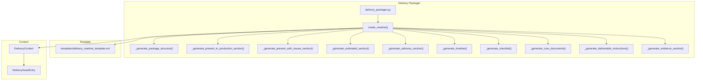
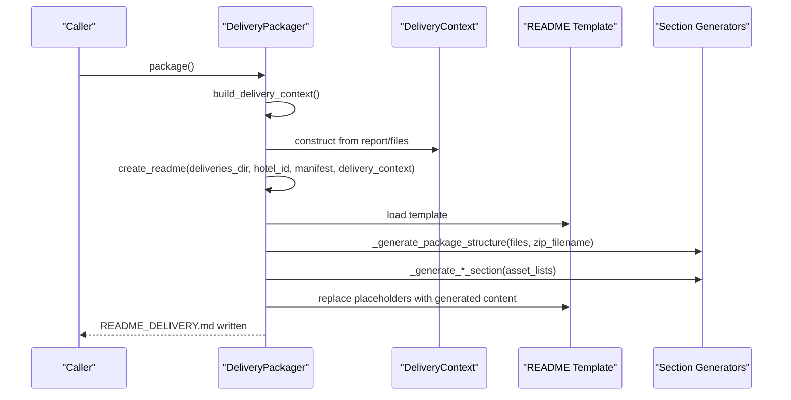
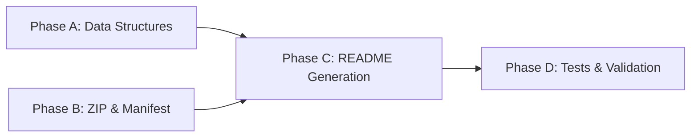

# Phase C: Dynamic README Generation from Delivery Context

<cite>
**Referenced Files in This Document**
- [04-prompt-fase-C.md](file://plans/Archives/DT-1-DELIVERY-CONTRACT-2026-07-23/04-prompt-fase-C.md)
- [02-prompt-fase-A.md](file://plans/Archives/DT-1-DELIVERY-CONTRACT-2026-07-23/02-prompt-fase-A.md)
- [05-prompt-fase-D.md](file://plans/Archives/DT-1-DELIVERY-CONTRACT-2026-07-23/05-prompt-fase-D.md)
- [DT-1-README-DELIVERY-PRESENT-IN-PRODUCTION.md](file://context/Historico/DT-1-README-DELIVERY-PRESENT-IN-PRODUCTION.md)
</cite>

## Table of Contents
1. Introduction
2. Project Structure
3. Core Components
4. Architecture Overview
5. Detailed Component Analysis
6. Dependency Analysis
7. Performance Considerations
8. Troubleshooting Guide
9. Conclusion

## Introduction
Phase C introduces a template-driven, dynamic README generation mechanism that derives its content directly from the delivery context and the actual ZIP package structure. The approach eliminates hardcoded asset names, replaces static placeholders with state-based sections, and ensures the generated README reflects the current delivery status for each asset. It also integrates advisory guides for assets marked as advisory and supports customization through well-defined extension points.

## Project Structure
The Phase C implementation centers around two primary artifacts:
- A modular README template containing placeholders for dynamic sections.
- Logic within the delivery packager to render these sections based on the delivery context and real file destinations.

**Diagram sources**
- [04-prompt-fase-C.md](file://plans/Archives/DT-1-DELIVERY-CONTRACT-2026-07-23/04-prompt-fase-C.md)

**Section sources**
- [04-prompt-fase-C.md](file://plans/Archives/DT-1-DELIVERY-CONTRACT-2026-07-23/04-prompt-fase-C.md)

## Core Components
- Modular README template: Contains placeholders for dynamic sections such as package filename, total files, package structure, core documents, deliverable assets, present-in-production assets, present-with-issues assets, estimated assets, advisory guides, evidence, timeline, and checklist.
- Delivery context integration: The create_readme() function is extended to accept an optional DeliveryContext. When provided, it renders dynamic sections; otherwise, it falls back to legacy behavior using manifest data where available.
- Section generators: Dedicated methods generate content per asset state and advisory classification, ensuring conditional rendering based on presence and issues.
- Package structure derivation: The system builds a tree-like representation from actual ZIP destinations, eliminating hardcoding and reflecting real packaging outcomes.

Key responsibilities:
- Template rendering: Replace placeholders with computed values or section content.
- State-based sections: Render sections only when relevant assets exist.
- Advisory inclusion: Include non-installable advisory guides with appropriate messaging.
- Legacy fallback: Preserve backward compatibility when DeliveryContext is absent.

**Section sources**
- [04-prompt-fase-C.md](file://plans/Archives/DT-1-DELIVERY-CONTRACT-2026-07-23/04-prompt-fase-C.md)

## Architecture Overview
The Phase C architecture connects the delivery packager’s README generation with the delivery context and template. The flow ensures that the README reflects the actual state of assets and package contents.

**Diagram sources**
- [04-prompt-fase-C.md](file://plans/Archives/DT-1-DELIVERY-CONTRACT-2026-07-23/04-prompt-fase-C.md)

## Detailed Component Analysis

### README Template Design
The template is structured as a modular skeleton with clearly defined placeholders. All hardcoded asset names are removed, and dynamic sections are inserted via placeholders. The template includes:
- Basic metadata: hotel ID, generation date, package type, and package filename.
- Overview: total files and size (from manifest or context).
- Package structure: derived from actual ZIP destinations.
- Implementation instructions: core documents, deliverable assets, advisory guides, and state-based sections.
- Evidence, timeline, checklist, and support resources.

Placeholders include:
- {{PACKAGE_FILENAME}}
- {{TOTAL_FILES}}
- {{PACKAGE_STRUCTURE}}
- {{CORE_DOCUMENTS}}
- {{DELIVERABLE_ASSETS}}
- {{PRESENT_IN_PRODUCTION_SECTION}}
- {{PRESENT_WITH_ISSUES_SECTION}}
- {{ESTIMATED_ASSETS_SECTION}}
- {{ADVISORY_GUIDES_SECTION}}
- {{EVIDENCE_SECTION}}
- {{TIMELINE}}
- {{CHECKLIST}}

**Section sources**
- [04-prompt-fase-C.md](file://plans/Archives/DT-1-DELIVERY-CONTRACT-2026-07-23/04-prompt-fase-C.md)

### Package Structure Derivation
The package structure is generated from the final list of files destined for the ZIP. The algorithm groups files by directory, constructs a tree-like text representation, and includes root files, ASSETS subdirectories, and metafiles like MANIFEST.json and README_DELIVERY.md. This ensures the README accurately reflects the packaged contents without hardcoding paths.

Key steps:
- Group files by destination path.
- Separate root-level files from ASSETS subdirectories.
- Generate a formatted tree string with proper indentation and connectors.

**Section sources**
- [04-prompt-fase-C.md](file://plans/Archives/DT-1-DELIVERY-CONTRACT-2026-07-23/04-prompt-fase-C.md)

### Section Generation by Asset State
Sections are conditionally rendered based on asset states:
- Present in production: Assets verified on the site without issues.
- Present with issues: Assets exist but require review due to conflicts or warnings.
- Estimated assets: Generated with estimated data and flagged for review.
- Advisory guides: Non-installable reference materials included for guidance.

Each section generator takes a list of DeliveryAssetEntry objects and produces markdown content accordingly. If no assets match a state, the section is omitted entirely.

**Section sources**
- [04-prompt-fase-C.md](file://plans/Archives/DT-1-DELIVERY-CONTRACT-2026-07-23/04-prompt-fase-C.md)

### Advisory Guides Inclusion
Assets marked as advisory (is_advisory=True) are included in a dedicated section. These are not installable but provide essential guidance for resolving specific issues. The advisory section lists each guide with its service name, path, and contextual message.

**Section sources**
- [04-prompt-fase-C.md](file://plans/Archives/DT-1-DELIVERY-CONTRACT-2026-07-23/04-prompt-fase-C.md)

### create_readme() Integration with Delivery Context
The create_readme() function is extended to accept an optional DeliveryContext parameter. When provided, it uses the context to populate dynamic sections. If absent, it falls back to legacy behavior using manifest data where available. The integration ensures:
- Placeholder replacement for basic metadata.
- Dynamic section generation for package structure, asset states, advisory guides, evidence, timeline, and checklist.
- Backward compatibility for environments without DeliveryContext.

**Section sources**
- [04-prompt-fase-C.md](file://plans/Archives/DT-1-DELIVERY-CONTRACT-2026-07-23/04-prompt-fase-C.md)

### Handling No Assets in Production
When no assets are present in production, the system still generates a valid README with empty sections for those states. The template ensures that missing sections do not break formatting, and the overall document remains informative and usable.

**Section sources**
- [04-prompt-fase-C.md](file://plans/Archives/DT-1-DELIVERY-CONTRACT-2026-07-23/04-prompt-fase-C.md)

### Template Customization and Extension Points
The modular template design allows for easy customization and extension:
- New sections can be added by introducing new placeholders and corresponding generator methods.
- Existing sections can be modified by updating their generator logic.
- Advisory handling can be extended to support additional non-installable asset types.

Extension points include:
- Adding new asset states and corresponding section generators.
- Integrating additional metadata into the overview or timeline.
- Supporting custom advisory formats or categories.

**Section sources**
- [04-prompt-fase-C.md](file://plans/Archives/DT-1-DELIVERY-CONTRACT-2026-07-23/04-prompt-fase-C.md)

## Dependency Analysis
Phase C depends on prior phases for data structures and pipeline integrity:
- DeliveryAssetState, DeliveryAssetEntry, and DeliveryContext were defined in Phase A.
- ZIP packaging and manifest creation were corrected in Phase B.
- Phase C focuses solely on README generation logic and template rendering.

**Diagram sources**
- [02-prompt-fase-A.md](file://plans/Archives/DT-1-DELIVERY-CONTRACT-2026-07-23/02-prompt-fase-A.md)
- [04-prompt-fase-C.md](file://plans/Archives/DT-1-DELIVERY-CONTRACT-2026-07-23/04-prompt-fase-C.md)
- [05-prompt-fase-D.md](file://plans/Archives/DT-1-DELIVERY-CONTRACT-2026-07-23/05-prompt-fase-D.md)

**Section sources**
- [02-prompt-fase-A.md](file://plans/Archives/DT-1-DELIVERY-CONTRACT-2026-07-23/02-prompt-fase-A.md)
- [04-prompt-fase-C.md](file://plans/Archives/DT-1-DELIVERY-CONTRACT-2026-07-23/04-prompt-fase-C.md)
- [05-prompt-fase-D.md](file://plans/Archives/DT-1-DELIVERY-CONTRACT-2026-07-23/05-prompt-fase-D.md)

## Performance Considerations
- Template rendering is lightweight, relying on string replacements and simple list iterations.
- Package structure generation scales linearly with the number of files in the ZIP.
- Conditional section rendering avoids unnecessary processing when no assets match a state.
- Legacy fallback ensures minimal overhead when DeliveryContext is unavailable.

[No sources needed since this section provides general guidance]

## Troubleshooting Guide
Common issues and resolutions:
- Missing DeliveryContext: Ensure the packager passes the context from the asset generation report.
- Empty sections: Verify asset state classification and ensure assets are correctly categorized.
- Incorrect package structure: Check file destination paths and ensure POSIX normalization.
- Advisory guides not appearing: Confirm is_advisory flag is set for relevant assets.

**Section sources**
- [DT-1-README-DELIVERY-PRESENT-IN-PRODUCTION.md](file://context/Historico/DT-1-README-DELIVERY-PRESENT-IN-PRODUCTION.md)

## Conclusion
Phase C transforms the README from a static document into a dynamic, context-driven artifact that accurately reflects the delivery state. By leveraging a modular template and state-based section generation, it ensures clarity, accuracy, and extensibility. The integration with DeliveryContext and robust fallback mechanisms maintain backward compatibility while enabling future enhancements.

[No sources needed since this section summarizes without analyzing specific files]