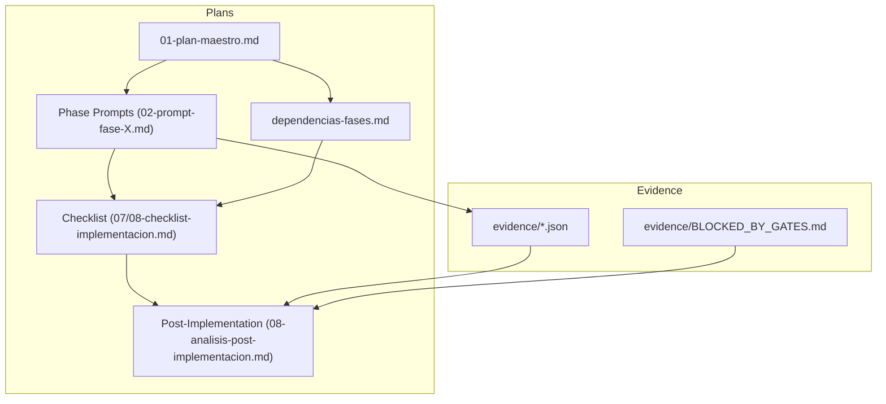
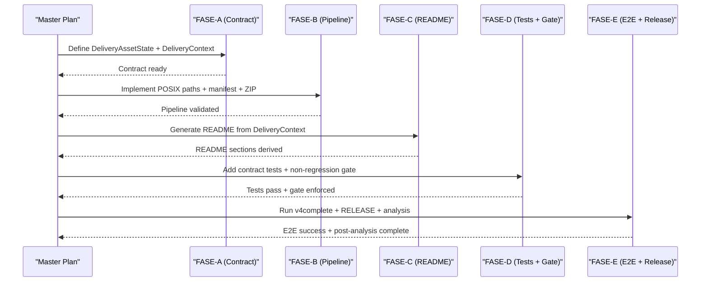
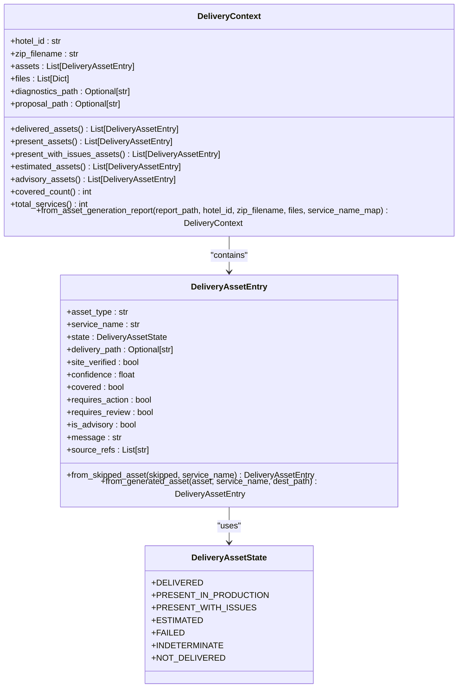
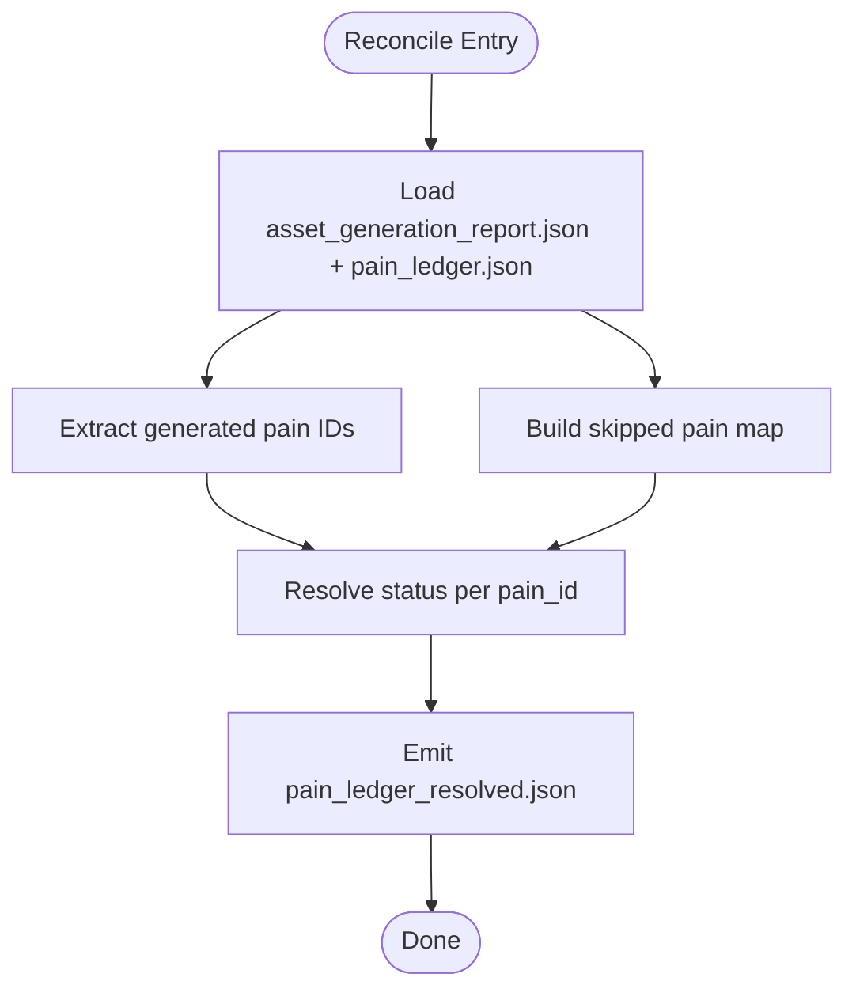
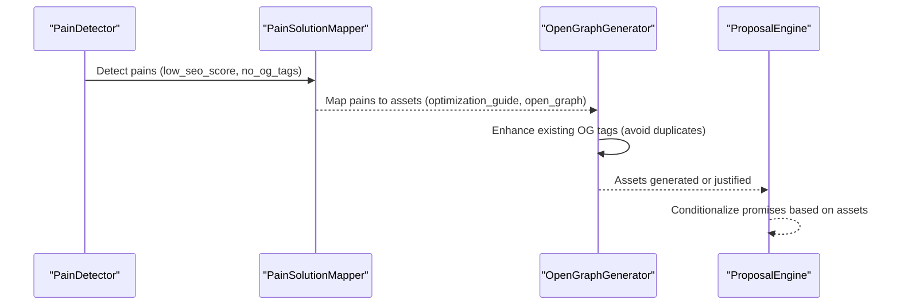
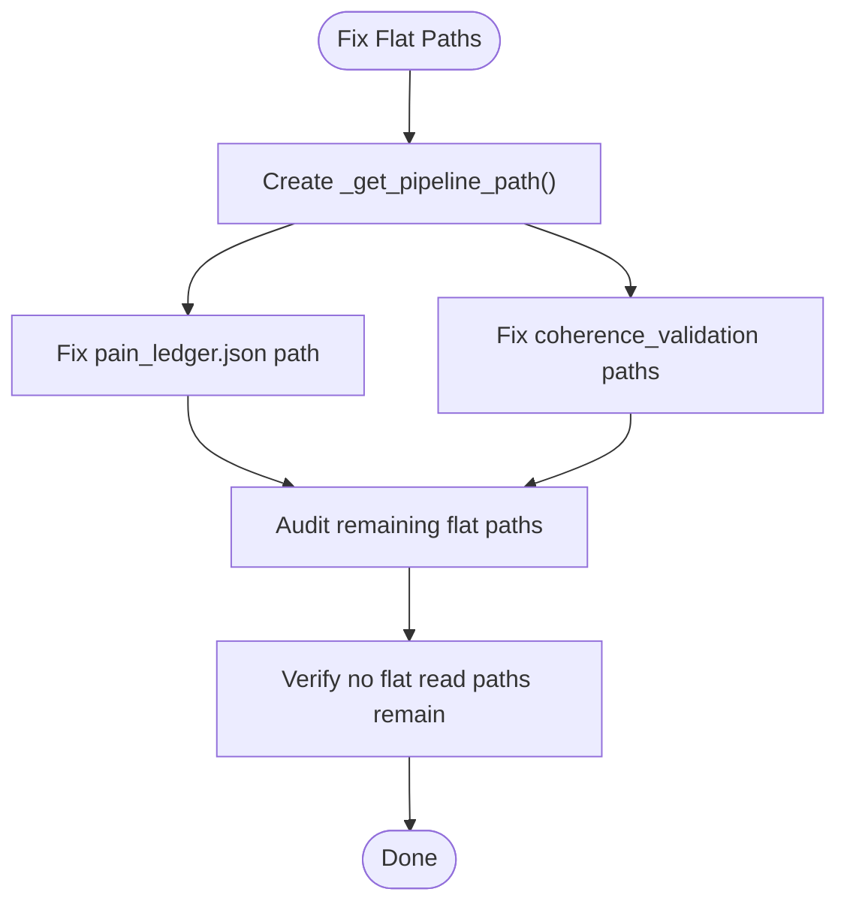
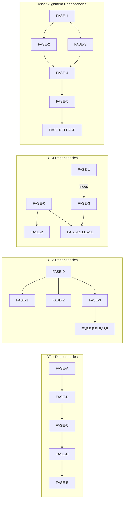

# Implementation Plans and Phases

<cite>
**Referenced Files in This Document**
- [01-plan-maestro.md](file://plans\Archives\DT-1-DELIVERY-CONTRACT-2026-07-23\01-plan-maestro.md)
- [02-prompt-fase-A.md](file://plans\Archives\DT-1-DELIVERY-CONTRACT-2026-07-23\02-prompt-fase-A.md)
- [dependencias-fases.md](file://plans\Archives\DT-1-DELIVERY-CONTRACT-2026-07-23\dependencias-fases.md)
- [08-analisis-post-implementacion.md](file://plans\Archives\DT-1-DELIVERY-CONTRACT-2026-07-23\08-analisis-post-implementacion.md)
- [01-plan-maestro.md](file://plans\Archives\DT-3-TECH-DEBT-2026-07-25\01-plan-maestro.md)
- [02-prompt-fase-0.md](file://plans\Archives\DT-3-TECH-DEBT-2026-07-25\02-prompt-fase-0.md)
- [pain_ledger.json](file://plans\Archives\DT-3-TECH-DEBT-2026-07-25\evidence\pain_ledger.json)
- [01-plan-maestro.md](file://plans\Archives\DT-4-ROOT-CAUSE-2026-07-25\01-plan-maestro.md)
- [02-prompt-fase-0.md](file://plans\Archives\DT-4-ROOT-CAUSE-2026-07-25\02-prompt-fase-0.md)
- [BLOCKED_BY_GATES.md](file://plans\Archives\DT-4-ROOT-CAUSE-2026-07-25\evidence\BLOCKED_BY_GATES.md)
- [01-plan-maestro.md](file://plans\Archives\ASSET-ALIGNMENT-ZIONE-2026-07-23\01-plan-maestro.md)
- [08-checklist-implementacion.md](file://plans\Archives\ASSET-ALIGNMENT-ZIONE-2026-07-23\08-checklist-implementacion.md)
</cite>

## Table of Contents
1. [Introduction](#introduction)
2. [Project Structure](#project-structure)
3. [Core Components](#core-components)
4. [Architecture Overview](#architecture-overview)
5. [Detailed Component Analysis](#detailed-component-analysis)
6. [Dependency Analysis](#dependency-analysis)
7. [Performance Considerations](#performance-considerations)
8. [Troubleshooting Guide](#troubleshooting-guide)
9. [Conclusion](#conclusion)
10. [Appendices](#appendices)

## Introduction
This document explains the implementation planning methodology used across iah-cli projects, focusing on a phased approach driven by master plans (01-plan-maestro.md), phase-specific prompts, dependency tracking, and post-implementation analysis. It documents an evidence-based development process that includes root cause analysis, pain ledger maintenance, and gate validation procedures. It also details the contract-driven development model where delivery contracts define acceptance criteria and validation steps. Examples are drawn from completed implementations: DT-1 Delivery Contract, DT-3 Technical Debt Resolution, DT-4 Root Cause Analysis, and Asset Alignment projects. The methodology emphasizes clear deliverables per phase, testing procedures, quality gates, and iterative feedback loops between phases with continuous validation against business requirements.

## Project Structure
The repository organizes each project plan under .opencode/plans/Archives/<project-id>/ with a consistent set of artifacts:
- 01-plan-maestro.md: Master plan defining objectives, architecture, phases, risks, DoD, and file structure.
- Phase prompts (e.g., 02-prompt-fase-A.md): Detailed instructions for each phase, including tasks, verification, constraints, and post-execution commands.
- dependencias-fases.md: Dependency graph and conflict matrix across phases.
- 07-checklist-implementacion.md or similar: Master tracker for phase completion and tests.
- 08-analisis-post-implementacion.md: Post-implementation analysis with metrics, findings coverage, lessons learned, and residual technical debt.
- evidence/: Evidence artifacts such as JSON reports, gate reports, and logs produced during execution.

**Diagram sources**
- [01-plan-maestro.md:1-172](file://plans\Archives\DT-1-DELIVERY-CONTRACT-2026-07-23\01-plan-maestro.md#L1-L172)
- [02-prompt-fase-A.md:1-379](file://plans\Archives\DT-1-DELIVERY-CONTRACT-2026-07-23\02-prompt-fase-A.md#L1-L379)
- [dependencias-fases.md:1-81](file://plans\Archives\DT-1-DELIVERY-CONTRACT-2026-07-23\dependencias-fases.md#L1-L81)
- [08-analisis-post-implementacion.md:1-276](file://plans\Archives\DT-1-DELIVERY-CONTRACT-2026-07-23\08-analisis-post-implementacion.md#L1-L276)

**Section sources**
- [01-plan-maestro.md:1-172](file://plans\Archives\DT-1-DELIVERY-CONTRACT-2026-07-23\01-plan-maestro.md#L1-L172)
- [01-plan-maestro.md:1-161](file://plans\Archives\DT-3-TECH-DEBT-2026-07-25\01-plan-maestro.md#L1-L161)
- [01-plan-maestro.md:1-178](file://plans\Archives\DT-4-ROOT-CAUSE-2026-07-25\01-plan-maestro.md#L1-L178)
- [01-plan-maestro.md:1-227](file://plans\Archives\ASSET-ALIGNMENT-ZIONE-2026-07-23\01-plan-maestro.md#L1-L227)

## Core Components
The methodology centers around several core components:
- Master Plan (01-plan-maestro.md): Defines scope, architecture, phases, risks, DoD, and artifact structure.
- Phase Prompts: Provide task-level instructions, constraints, verification steps, and post-execution commands.
- Dependency Tracking (dependencias-fases.md): Maps phase dependencies, file conflicts, R3 evaluation, and iteration budgets.
- Checklist Tracker: Tracks phase status, delegate_task mode, test counts, and DoD completion.
- Evidence Collection: JSON reports, gate reports, and markdown logs capturing runtime state and validation results.
- Post-Implementation Analysis: Summarizes execution, metrics vs expectations, findings coverage, lessons learned, and residual debt.

Key patterns observed:
- One phase per session to avoid cross-phase contamination.
- Explicit delegate_task viability matrix per phase (DIRECTA, SUBAGENTE, MIXTO).
- Gate validation integrated into phases (e.g., non-regression gate, commercial gates).
- Evidence-based decisions using pain ledgers and gate reports.

**Section sources**
- [01-plan-maestro.md:86-146](file://plans\Archives\DT-1-DELIVERY-CONTRACT-2026-07-23\01-plan-maestro.md#L86-L146)
- [02-prompt-fase-A.md:1-379](file://plans\Archives\DT-1-DELIVERY-CONTRACT-2026-07-23\02-prompt-fase-A.md#L1-L379)
- [dependencias-fases.md:1-81](file://plans\Archives\DT-1-DELIVERY-CONTRACT-2026-07-23\dependencias-fases.md#L1-L81)
- [08-checklist-implementacion.md:1-24](file://plans\Archives\ASSET-ALIGNMENT-ZIONE-2026-07-23\08-checklist-implementacion.md#L1-L24)

## Architecture Overview
The phased architecture follows a sequential pipeline with explicit dependencies and gates:
- Phase A defines canonical contracts (e.g., DeliveryAssetState, DeliveryContext).
- Phase B implements physical pipeline changes (POSIX paths, real sizes, deterministic ZIP).
- Phase C generates dynamic README sections based on asset states.
- Phase D adds contract tests and non-regression gates.
- Phase E executes E2E (v4complete), RELEASE, and post-implementation analysis.

**Diagram sources**
- [01-plan-maestro.md:86-146](file://plans\Archives\DT-1-DELIVERY-CONTRACT-2026-07-23\01-plan-maestro.md#L86-L146)
- [02-prompt-fase-A.md:1-379](file://plans\Archives\DT-1-DELIVERY-CONTRACT-2026-07-23\02-prompt-fase-A.md#L1-L379)

**Section sources**
- [01-plan-maestro.md:86-146](file://plans\Archives\DT-1-DELIVERY-CONTRACT-2026-07-23\01-plan-maestro.md#L86-L146)
- [01-plan-maestro.md:45-70](file://plans\Archives\ASSET-ALIGNMENT-ZIONE-2026-07-23\01-plan-maestro.md#L45-L70)

## Detailed Component Analysis

### Delivery Contract Model (DT-1)
The DT-1 plan establishes a delivery contract model centered on canonical asset states and context structures. Key elements include:
- DeliveryAssetState enum: Standardizes asset states (delivered, present_in_production, present_with_issues, estimated, failed, indeterminate, not_delivered).
- DeliveryAssetEntry dataclass: Captures state, flags (covered, requires_action, requires_review, is_advisory), and metadata.
- DeliveryContext dataclass: Aggregates assets, files, diagnostics, and proposal paths; provides computed properties for filtering and counting.
- AssessmentBuilder propagation: Ensures skipped_assets with presence_status are propagated coherently.

**Diagram sources**
- [02-prompt-fase-A.md:33-162](file://plans\Archives\DT-1-DELIVERY-CONTRACT-2026-07-23\02-prompt-fase-A.md#L33-L162)
- [02-prompt-fase-A.md:166-313](file://plans\Archives\DT-1-DELIVERY-CONTRACT-2026-07-23\02-prompt-fase-A.md#L166-L313)

**Section sources**
- [02-prompt-fase-A.md:1-379](file://plans\Archives\DT-1-DELIVERY-CONTRACT-2026-07-23\02-prompt-fase-A.md#L1-L379)

### Root Cause Reconciler (DT-4)
DT-4 introduces a post-orchestrator reconciler to unify three disparate sources of truth about pain resolution:
- pain_ledger.json: Current status per pain_id.
- asset_generation_report.json: generated_assets.pain_ids_resolved and skipped_assets.pain_ids_affected.
- Skipped assets presence_status: indicates whether site already has features.

The reconciler emits pain_ledger_resolved.json with consolidated statuses (ASSET_GENERATED, MAPPED_TO_SERVICE, JUSTIFIED_SKIP) and integrates with publication gates and coherence validation.

**Diagram sources**
- [02-prompt-fase-0.md:35-178](file://plans\Archives\DT-4-ROOT-CAUSE-2026-07-25\02-prompt-fase-0.md#L35-L178)

**Section sources**
- [02-prompt-fase-0.md:1-338](file://plans\Archives\DT-4-ROOT-CAUSE-2026-07-25\02-prompt-fase-0.md#L1-L338)

### Asset Alignment Fixes (Asset Alignment Project)
The Asset Alignment project addresses gaps between commercial promises and generated assets:
- PainSolutionMapper enhancements: Adds new pain types (low_seo_score) and modifies detection logic (no_og_tags enhance_existing mode).
- OpenGraphGenerator extension: Supports enhance_existing mode to generate only missing tags without duplication.
- Proposal conditionalization: Ensures proposals only promise services with generated assets or present_in_production.
- Unification of source-of-truth mappings: Consolidates SERVICE_TO_ASSET_LOOKUP from PROPOSAL_SERVICE_TO_ASSET.

**Diagram sources**
- [01-plan-maestro.md:82-114](file://plans\Archives\ASSET-ALIGNMENT-ZIONE-2026-07-23\01-plan-maestro.md#L82-L114)

**Section sources**
- [01-plan-maestro.md:1-227](file://plans\Archives\ASSET-ALIGNMENT-ZIONE-2026-07-23\01-plan-maestro.md#L1-L227)

### Systemic Path Fix (DT-3)
DT-3 resolves systemic path issues where flat paths were left behind after migration to per-hotel structure:
- Helper function _get_pipeline_path(): Centralizes per-hotel path construction.
- Corrected paths for pain_ledger.json and coherence_validation.json reads.
- Audit of remaining flat paths to ensure no residual reads.

**Diagram sources**
- [02-prompt-fase-0.md:35-75](file://plans\Archives\DT-3-TECH-DEBT-2026-07-25\02-prompt-fase-0.md#L35-L75)

**Section sources**
- [02-prompt-fase-0.md:1-152](file://plans\Archives\DT-3-TECH-DEBT-2026-07-25\02-prompt-fase-0.md#L1-L152)

## Dependency Analysis
Phases are strictly ordered with explicit dependencies and conflict matrices:
- DT-1: FASE-A → FASE-B → FASE-C → FASE-D → FASE-E, with file conflict resolution documented.
- DT-3: FASE-0 (root cause) blocks FASE-1, FASE-2, FASE-3; independent phases follow sequentially.
- DT-4: FASE-0 (reconciler) blocks FASE-2 and FASE-RELEASE; other phases are independent but recommended after FASE-0.
- Asset Alignment: FASE-1 (security bypass) blocks all others; FASE-2 and FASE-3 are independent but both require FASE-1; FASE-4 depends on FASE-2+FASE-3.

**Diagram sources**
- [dependencias-fases.md:1-81](file://plans\Archives\DT-1-DELIVERY-CONTRACT-2026-07-23\dependencias-fases.md#L1-L81)
- [01-plan-maestro.md:123-136](file://plans\Archives\DT-3-TECH-DEBT-2026-07-25\01-plan-maestro.md#L123-L136)
- [01-plan-maestro.md:116-132](file://plans\Archives\DT-4-ROOT-CAUSE-2026-07-25\01-plan-maestro.md#L116-L132)
- [01-plan-maestro.md:45-53](file://plans\Archives\ASSET-ALIGNMENT-ZIONE-2026-07-23\01-plan-maestro.md#L45-L53)

**Section sources**
- [dependencias-fases.md:1-81](file://plans\Archives\DT-1-DELIVERY-CONTRACT-2026-07-23\dependencias-fases.md#L1-L81)
- [01-plan-maestro.md:123-136](file://plans\Archives\DT-3-TECH-DEBT-2026-07-25\01-plan-maestro.md#L123-L136)
- [01-plan-maestro.md:116-132](file://plans\Archives\DT-4-ROOT-CAUSE-2026-07-25\01-plan-maestro.md#L116-L132)
- [01-plan-maestro.md:45-53](file://plans\Archives\ASSET-ALIGNMENT-ZIONE-2026-07-23\01-plan-maestro.md#L45-L53)

## Performance Considerations
- Iteration budgets per phase are tracked and validated against estimates (e.g., ~60 iterations max per phase).
- delegate_task modes optimize execution: DIRECTA for code edits without imports, SUBAGENTE for localized changes, MIXTO for long-running commands (v4complete) combined with direct analysis.
- Safety guards (WSL) impact performance by blocking destructive operations; workarounds include alternative cleanup strategies or verifying actual output paths beforehand.
- v4complete runtime varies by hotel complexity; empirical data shows faster execution than estimates for simple sites.

[No sources needed since this section provides general guidance]

## Troubleshooting Guide
Common issues and resolutions:
- WSL safety guard blocking rm -rf: Adapt cleanup to verify timestamps or use alternative paths; ensure prompts account for actual output directories.
- Stale evidence in output directories: Validate timestamps and paths; avoid assuming directory structures without verification.
- Gate failures due to unresolved commercial gates: Review BLOCKED_BY_GATES.md for specific commercial gate messages and resolve before re-executing v4complete.
- Pain ledger inconsistencies: Use reconciler to consolidate states; ensure ASSET_GENERATED is included in justified statuses for coverage gates.

**Section sources**
- [08-analisis-post-implementacion.md:197-232](file://plans\Archives\DT-1-DELIVERY-CONTRACT-2026-07-23\08-analisis-post-implementacion.md#L197-L232)
- [BLOCKED_BY_GATES.md:1-32](file://plans\Archives\DT-4-ROOT-CAUSE-2026-07-25\evidence\BLOCKED_BY_GATES.md#L1-L32)

## Conclusion
The iah-cli implementation planning methodology demonstrates a robust, evidence-based approach to feature development through phased execution, contract-driven design, and rigorous validation. Master plans provide architectural clarity, phase prompts enable precise execution, dependency tracking prevents conflicts, and post-implementation analysis ensures continuous improvement. The integration of pain ledgers and gate validation maintains alignment with business requirements, while iterative feedback loops facilitate adaptive development. This methodology has been successfully applied across multiple projects, delivering reliable outcomes with measurable quality gates and comprehensive documentation.

[No sources needed since this section summarizes without analyzing specific files]

## Appendices

### Example Artifacts and Evidence
- DT-1 Post-Implementation Analysis: Comprehensive metrics, findings coverage, and lessons learned.
- DT-3 Pain Ledger: Evidence of pain states and their resolution status.
- DT-4 Blocked Gates Report: Commercial gate failures requiring resolution before re-execution.

**Section sources**
- [08-analisis-post-implementacion.md:1-276](file://plans\Archives\DT-1-DELIVERY-CONTRACT-2026-07-23\08-analisis-post-implementacion.md#L1-L276)
- [pain_ledger.json:1-95](file://plans\Archives\DT-3-TECH-DEBT-2026-07-25\evidence\pain_ledger.json#L1-L95)
- [BLOCKED_BY_GATES.md:1-32](file://plans\Archives\DT-4-ROOT-CAUSE-2026-07-25\evidence\BLOCKED_BY_GATES.md#L1-L32)