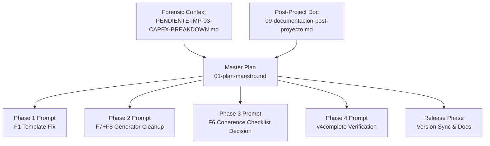
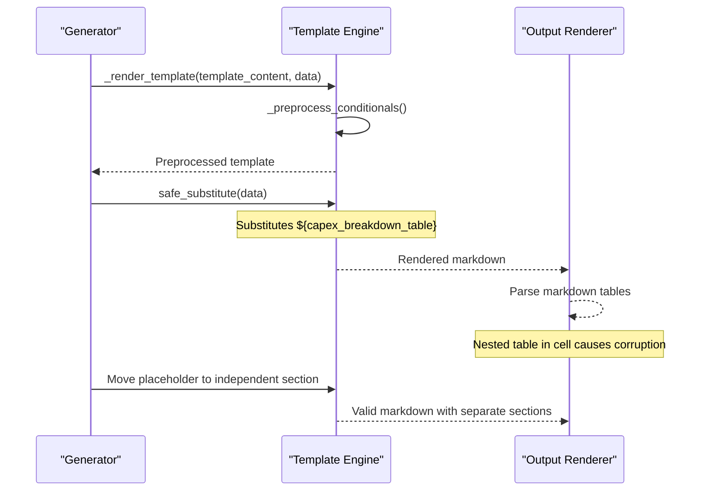
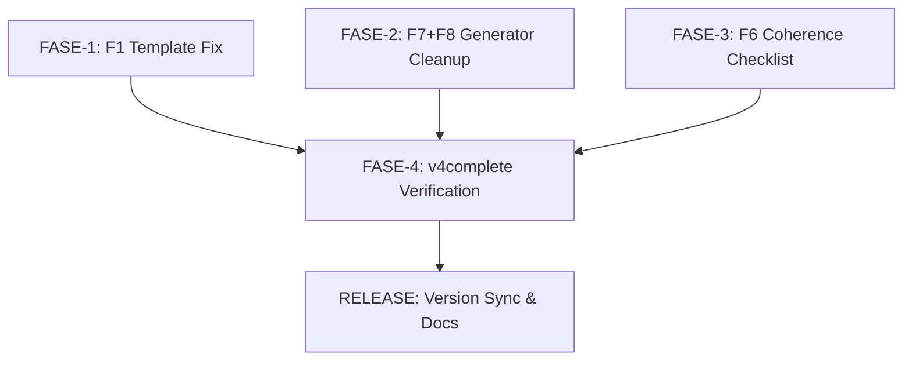

# CAPEX Breakdown Refactoring (v4.60.0)

<cite>
**Referenced Files in This Document**
- [01-plan-maestro.md](file://plans/Archives/REFACTOR-CAPEX-BREAKDOWN-V4.60.0/01-plan-maestro.md)
- [05-prompt-inicio-sesion-fase-1.md](file://plans/Archives/REFACTOR-CAPEX-BREAKDOWN-V4.60.0/05-prompt-inicio-sesion-fase-1.md)
- [05-prompt-inicio-sesion-fase-2.md](file://plans/Archives/REFACTOR-CAPEX-BREAKDOWN-V4.60.0/05-prompt-inicio-sesion-fase-2.md)
- [05-prompt-inicio-sesion-fase-3.md](file://plans/Archives/REFACTOR-CAPEX-BREAKDOWN-V4.60.0/05-prompt-inicio-sesion-fase-3.md)
- [05-prompt-inicio-sesion-fase-4.md](file://plans/Archives/REFACTOR-CAPEX-BREAKDOWN-V4.60.0/05-prompt-inicio-sesion-fase-4.md)
- [05-prompt-inicio-sesion-fase-RELEASE.md](file://plans/Archives/REFACTOR-CAPEX-BREAKDOWN-V4.60.0/05-prompt-inicio-sesion-fase-RELEASE.md)
- [09-documentacion-post-proyecto.md](file://plans/Archives/REFACTOR-CAPEX-BREAKDOWN-V4.60.0/09-documentacion-post-proyecto.md)
- [PENDIENTE-IMP-03-CAPEX-BREAKDOWN.md](file://context/Historico/PENDIENTE-IMP-03-CAPEX-BREAKDOWN.md)
</cite>

## Table of Contents
1. [Introduction](#introduction)
2. [Project Structure](#project-structure)
3. [Core Components](#core-components)
4. [Architecture Overview](#architecture-overview)
5. [Detailed Component Analysis](#detailed-component-analysis)
6. [Dependency Analysis](#dependency-analysis)
7. [Performance Considerations](#performance-considerations)
8. [Troubleshooting Guide](#troubleshooting-guide)
9. [Conclusion](#conclusion)
10. [Appendices](#appendices)

## Introduction
This document provides a comprehensive, code-backed account of the CAPEX Breakdown refactoring effort for v4.60.0. The primary objective was to fix corrupted markdown table rendering caused by improperly nesting a CAPEX breakdown table inside another table cell, and to address related low-severity issues: an invisible coherence checklist feature, orphaned template data keys, and a missing header in a fallback path. The refactoring followed a phased strategy with explicit dependency management between template edits and generator code changes, culminating in end-to-end verification via v4complete and gate checks.

## Project Structure
The refactoring is documented and orchestrated through a set of plan files under the Archives directory, along with forensic context that validates findings against live code. Key artifacts include:
- A master plan outlining objectives, findings, dependencies, and phases.
- Phase-specific prompts detailing tasks, constraints, and verification steps.
- Post-project documentation summarizing changes and metrics.
- Forensic context confirming root causes and evidence from outputs and templates.

**Diagram sources**
- [01-plan-maestro.md:1-40](file://plans/Archives/REFACTOR-CAPEX-BREAKDOWN-V4.60.0/01-plan-maestro.md#L1-L40)
- [PENDIENTE-IMP-03-CAPEX-BREAKDOWN.md:1-20](file://context/Historico/PENDIENTE-IMP-03-CAPEX-BREAKDOWN.md#L1-L20)
- [09-documentacion-post-proyecto.md:1-20](file://plans/Archives/REFACTOR-CAPEX-BREAKDOWN-V4.60.0/09-documentacion-post-proyecto.md#L1-L20)

**Section sources**
- [01-plan-maestro.md:1-40](file://plans/Archives/REFACTOR-CAPEX-BREAKDOWN-V4.60.0/01-plan-maestro.md#L1-L40)
- [PENDIENTE-IMP-03-CAPEX-BREAKDOWN.md:1-20](file://context/Historico/PENDIENTE-IMP-03-CAPEX-BREAKDOWN.md#L1-L20)

## Core Components
The refactoring targets four key findings:
- F1: Template fix to avoid nested markdown tables causing corruption.
- F6: Coherence checklist decision (YAGNI vs integration).
- F7: Removal of orphaned dictionary keys in template data.
- F8: Restoration of a proper header row in the fallback path of the CAPEX breakdown builder.

These components are implemented across two primary files:
- Template file: `propuesta_v6_template.md`
- Generator file: `v4_proposal_generator.py`

Key implementation patterns:
- Template substitution via `string.Template.safe_substitute()` without nested table support.
- Generator methods building markdown tables and fallbacks.
- Test suite ensuring structural integrity of rendered tables.

**Section sources**
- [01-plan-maestro.md:17-27](file://plans/Archives/REFACTOR-CAPEX-BREAKDOWN-V4.60.0/01-plan-maestro.md#L17-L27)
- [PENDIENTE-IMP-03-CAPEX-BREAKDOWN.md:110-126](file://context/Historico/PENDIENTE-IMP-03-CAPEX-BREAKDOWN.md#L110-L126)

## Architecture Overview
The rendering pipeline substitutes placeholders in templates with generated content. When a full markdown table is substituted into a single cell of another table, markdown parsing fails due to lack of nested table support, resulting in corrupted output. The refactoring moves the CAPEX breakdown table out of the cell into its own section, ensuring valid markdown structure.

**Diagram sources**
- [PENDIENTE-IMP-03-CAPEX-BREAKDOWN.md:110-126](file://context/Historico/PENDIENTE-IMP-03-CAPEX-BREAKDOWN.md#L110-L126)
- [05-prompt-inicio-sesion-fase-1.md:24-34](file://plans/Archives/REFACTOR-CAPEX-BREAKDOWN-V4.60.0/05-prompt-inicio-sesion-fase-1.md#L24-L34)

## Detailed Component Analysis

### F1 — Template Fix for Nested Table Corruption
Problem: A CAPEX breakdown table was embedded within a cell of a 4-column table, causing markdown parsing errors due to nested table syntax not being supported.

Solution: Move the `${capex_breakdown_table}` placeholder to a dedicated section after the CAPEX/OPEX note, ensuring it renders as an independent markdown block rather than inside a table cell.

Before and After Examples:
- Before: `${capex_breakdown_table}` placed inside a table row, leading to mismatched pipe counts and broken rows.
- After: `${capex_breakdown_table}` placed under a new heading `### Desglose del Setup Fee (CAPEX)` as a standalone table.

Testing Strategy:
- Added a new test verifying that each row in the CAPEX table has exactly 4 pipes (cells + closing), and that the desglose section exists independently with correct pipe counts.

**Section sources**
- [05-prompt-inicio-sesion-fase-1.md:14-41](file://plans/Archives/REFACTOR-CAPEX-BREAKDOWN-V4.60.0/05-prompt-inicio-sesion-fase-1.md#L14-L41)
- [05-prompt-inicio-sesion-fase-1.md:44-100](file://plans/Archives/REFACTOR-CAPEX-BREAKDOWN-V4.60.0/05-prompt-inicio-sesion-fase-1.md#L44-L100)
- [05-prompt-inicio-sesion-fase-1.md:103-164](file://plans/Archives/REFACTOR-CAPEX-BREAKDOWN-V4.60.0/05-prompt-inicio-sesion-fase-1.md#L103-L164)

### F6 — Coherence Checklist Cleanup (YAGNI Principle)
Problem: The `_build_coherence_checklist()` method existed and generated content, but no template contained the `${coherence_checklist}` placeholder, making the feature invisible and unused. Additionally, there was a hardcoded region fallback (`eje_cafetero`) that ignored the generator’s region parameter.

Decision: Apply YAGNI principle to remove unused code. Eliminate the method and its inclusion in template data to reduce dead code and potential future bugs.

Alternative considered: Integrate the checklist into the template and fix the hardcoded region. However, since the feature was not used, removal was preferred to maintain simplicity.

**Section sources**
- [01-plan-maestro.md:21-23](file://plans/Archives/REFACTOR-CAPEX-BREAKDOWN-V4.60.0/01-plan-maestro.md#L21-L23)
- [05-prompt-inicio-sesion-fase-3.md:11-46](file://plans/Archives/REFACTOR-CAPEX-BREAKDOWN-V4.60.0/05-prompt-inicio-sesion-fase-3.md#L11-L46)
- [PENDIENTE-IMP-03-CAPEX-BREAKDOWN.md:151-176](file://context/Historico/PENDIENTE-IMP-03-CAPEX-BREAKDOWN.md#L151-L176)

### F7 — Orphaned Dictionary Keys Removal
Problem: Nine keys were generated in the template data dictionary but never consumed by any template, representing dead code that wasted CPU cycles and could cause confusion.

Solution: Remove these orphaned keys from the dictionary construction in `_prepare_template_data()`, while preserving local variables that may be used internally for other calculations.

Keys removed included:
- `setup_fee`, `projected_real_gain`, `plan_7d`, `plan_30d`, `plan_60d`, `plan_90d`, `total_investment`, `total_recovered`, `net_benefit`.

Verification:
- Grep commands confirmed zero matches for these keys in the dictionary after cleanup.
- Existing tests continued to pass without modification.

**Section sources**
- [05-prompt-inicio-sesion-fase-2.md:20-57](file://plans/Archives/REFACTOR-CAPEX-BREAKDOWN-V4.60.0/05-prompt-inicio-sesion-fase-2.md#L20-L57)
- [05-prompt-inicio-sesion-fase-2.md:88-136](file://plans/Archives/REFACTOR-CAPEX-BREAKDOWN-V4.60.0/05-prompt-inicio-sesion-fase-2.md#L88-L136)
- [PENDIENTE-IMP-03-CAPEX-BREAKDOWN.md:178-200](file://context/Historico/PENDIENTE-IMP-03-CAPEX-BREAKDOWN.md#L178-L200)

### F8 — Fallback Header Restoration
Problem: The fallback path in `_build_capex_breakdown_table()` returned a single-row table without a header, which would render inconsistently if used as a standalone section.

Solution: Add a proper header row to the fallback output, ensuring consistent markdown table structure even in edge cases where configuration lacks breakdown components.

Implementation:
- Insert header string before returning the fallback row.
- Verified via grep and unit tests.

**Section sources**
- [05-prompt-inicio-sesion-fase-2.md:60-84](file://plans/Archives/REFACTOR-CAPEX-BREAKDOWN-V4.60.0/05-prompt-inicio-sesion-fase-2.md#L60-L84)
- [PENDIENTE-IMP-03-CAPEX-BREAKDOWN.md:201-215](file://context/Historico/PENDIENTE-IMP-03-CAPEX-BREAKDOWN.md#L201-L215)

## Dependency Analysis
The refactoring followed a phased approach with clear dependencies:
- FASE-1 (F1): Template fix — independent, highest complexity.
- FASE-2 (F7+F8): Generator cleanup — independent of FASE-1.
- FASE-3 (F6): Coherence checklist decision — independent of FASE-1 and FASE-2.
- FASE-4: End-to-end verification — dependent on all previous phases.
- RELEASE: Version sync and documentation — dependent on FASE-4.

**Diagram sources**
- [01-plan-maestro.md:28-40](file://plans/Archives/REFACTOR-CAPEX-BREAKDOWN-V4.60.0/01-plan-maestro.md#L28-L40)

**Section sources**
- [01-plan-maestro.md:28-40](file://plans/Archives/REFACTOR-CAPEX-BREAKDOWN-V4.60.0/01-plan-maestro.md#L28-L40)

## Performance Considerations
- Removing orphaned keys (F7) reduces unnecessary computations, particularly avoiding duplicate calls to day-plan builders.
- Ensuring proper table structure (F1, F8) prevents rendering failures and improves downstream processing efficiency.
- YAGNI application (F6) eliminates unused code paths, reducing maintenance overhead.

[No sources needed since this section provides general guidance]

## Troubleshooting Guide
Common issues and resolutions:
- Corrupted markdown tables: Ensure no nested tables; use independent sections for complex content.
- Missing headers in fallbacks: Always include header rows for consistency.
- Unused features: Apply YAGNI to remove dead code and prevent confusion.
- Testing gaps: Add structural integrity tests to catch regressions early.

**Section sources**
- [05-prompt-inicio-sesion-fase-1.md:103-164](file://plans/Archives/REFACTOR-CAPEX-BREAKDOWN-V4.60.0/05-prompt-inicio-sesion-fase-1.md#L103-L164)
- [05-prompt-inicio-sesion-fase-2.md:88-136](file://plans/Archives/REFACTOR-CAPEX-BREAKDOWN-V4.60.0/05-prompt-inicio-sesion-fase-2.md#L88-L136)

## Conclusion
The CAPEX Breakdown refactoring successfully addressed critical rendering issues and improved code quality by eliminating dead code and ensuring robust fallback behavior. The phased approach with clear dependencies and comprehensive testing strategies ensured minimal risk and high confidence in the changes. The application of the YAGNI principle streamlined the codebase by removing unused functionality, while structural fixes prevented markdown corruption and enhanced output reliability.

[No sources needed since this section summarizes without analyzing specific files]

## Appendices

### Phased Implementation Strategy Summary
- FASE-1: Template fix for nested table corruption.
- FASE-2: Generator cleanup (orphaned keys and fallback header).
- FASE-3: Coherence checklist decision (YAGNI).
- FASE-4: End-to-end verification with v4complete.
- RELEASE: Version synchronization and documentation updates.

**Section sources**
- [01-plan-maestro.md:50-61](file://plans/Archives/REFACTOR-CAPEX-BREAKDOWN-V4.60.0/01-plan-maestro.md#L50-L61)
- [05-prompt-inicio-sesion-fase-RELEASE.md:11-19](file://plans/Archives/REFACTOR-CAPEX-BREAKDOWN-V4.60.0/05-prompt-inicio-sesion-fase-RELEASE.md#L11-L19)