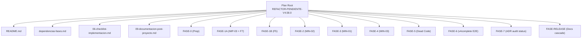
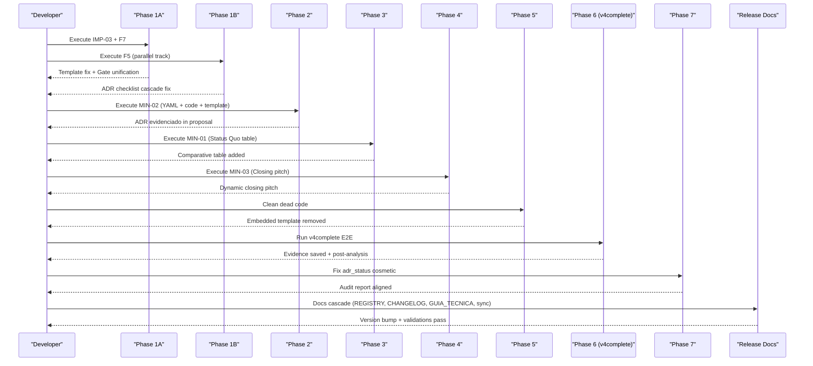
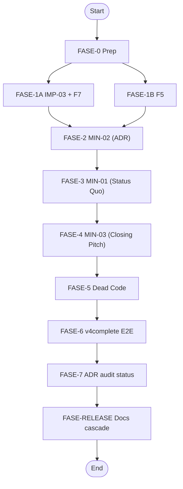

# Pending Functionality Refactoring (v4.58.0)

<cite>
**Referenced Files in This Document**
- [README.md](file://plans\Archives\REFACTOR-PENDIENTE-V4.58.0\README.md)
- [dependencias-fases.md](file://plans\Archives\REFACTOR-PENDIENTE-V4.58.0\dependencias-fases.md)
- [06-checklist-implementacion.md](file://plans\Archives\REFACTOR-PENDIENTE-V4.58.0\06-checklist-implementacion.md)
- [09-documentacion-post-proyecto.md](file://plans\Archives\REFACTOR-PENDIENTE-V4.58.0\09-documentacion-post-proyecto.md)
- [05-prompt-inicio-sesion-fase-1A.md](file://plans\Archives\REFACTOR-PENDIENTE-V4.58.0\05-prompt-inicio-sesion-fase-1A.md)
- [05-prompt-inicio-sesion-fase-1B.md](file://plans\Archives\REFACTOR-PENDIENTE-V4.58.0\05-prompt-inicio-sesion-fase-1B.md)
- [05-prompt-inicio-sesion-fase-2.md](file://plans\Archives\REFACTOR-PENDIENTE-V4.58.0\05-prompt-inicio-sesion-fase-2.md)
- [05-prompt-inicio-sesion-fase-3.md](file://plans\Archives\REFACTOR-PENDIENTE-V4.58.0\05-prompt-inicio-sesion-fase-3.md)
- [05-prompt-inicio-sesion-fase-4.md](file://plans\Archives\REFACTOR-PENDIENTE-V4.58.0\05-prompt-inicio-sesion-fase-4.md)
- [05-prompt-inicio-sesion-fase-5.md](file://plans\Archives\REFACTOR-PENDIENTE-V4.58.0\05-prompt-inicio-sesion-fase-5.md)
- [05-prompt-inicio-sesion-fase-6.md](file://plans\Archives\REFACTOR-PENDIENTE-V4.58.0\05-prompt-inicio-sesion-fase-6.md)
- [05-prompt-inicio-sesion-fase-7.md](file://plans\Archives\REFACTOR-PENDIENTE-V4.58.0\05-prompt-inicio-sesion-fase-7.md)
- [05-prompt-inicio-sesion-fase-RELEASE.md](file://plans\Archives\REFACTOR-PENDIENTE-V4.58.0\05-prompt-inicio-sesion-fase-RELEASE.md)
</cite>

## Table of Contents
1. [Introduction](#introduction)
2. [Project Structure](#project-structure)
3. [Core Components](#core-components)
4. [Architecture Overview](#architecture-overview)
5. [Detailed Component Analysis](#detailed-component-analysis)
6. [Dependency Analysis](#dependency-analysis)
7. [Performance Considerations](#performance-considerations)
8. [Troubleshooting Guide](#troubleshooting-guide)
9. [Conclusion](#conclusion)
10. [Appendices](#appendices)

## Introduction
This document provides a comprehensive, code-backed account of the pending functionality refactoring effort for v4.58.0 across the iah-cli system. It explains the seven-phase implementation approach (plus parallel tracks 1A and 1B), dependency management between phases, risk mitigation strategies, rollback procedures, testing strategies, validation gates, and integration challenges resolved during modernization. The plan targets multiple architectural improvements and code modernization tasks spanning core modules, templates, quality gates, and auditors, culminating in an end-to-end verification using v4complete on Hotel Castilla Real.

## Project Structure
The refactoring plan is organized as a phased execution with explicit prompts per phase, a master checklist, dependency mapping, and post-project documentation. Key artifacts include:
- Phase prompts that define objectives, tasks, constraints, and next steps
- A dependency graph and conflict table to sequence work safely
- A detailed implementation checklist tracking completion and evidence
- Post-project documentation summarizing changes, metrics, and lessons learned

**Diagram sources**
- [README.md](file://plans\Archives\REFACTOR-PENDIENTE-V4.58.0\README.md)
- [dependencias-fases.md](file://plans\Archives\REFACTOR-PENDIENTE-V4.58.0\dependencias-fases.md)
- [06-checklist-implementacion.md](file://plans\Archives\REFACTOR-PENDIENTE-V4.58.0\06-checklist-implementacion.md)
- [09-documentacion-post-proyecto.md](file://plans\Archives\REFACTOR-PENDIENTE-V4.58.0\09-documentacion-post-proyecto.md)

**Section sources**
- [README.md](file://plans\Archives\REFACTOR-PENDIENTE-V4.58.0\README.md)
- [dependencias-fases.md](file://plans\Archives\REFACTOR-PENDIENTE-V4.58.0\dependencias-fases.md)
- [06-checklist-implementacion.md](file://plans\Archives\REFACTOR-PENDIENTE-V4.58.0\06-checklist-implementacion.md)
- [09-documentacion-post-proyecto.md](file://plans\Archives\REFACTOR-PENDIENTE-V4.58.0\09-documentacion-post-proyecto.md)

## Core Components
The refactoring touches several core components:
- Proposal generator pipeline and template rendering
- Quality gates logic for publication readiness
- Regional benchmarks configuration
- Auditor cross-validation for ADR status

Key responsibilities:
- Template placeholders consumption and data injection
- Consistent gate evaluation across modules
- Benchmark-driven values for regional references
- Auditor alignment with benchmark-derived values

**Section sources**
- [06-checklist-implementacion.md](file://plans\Archives\REFACTOR-PENDIENTE-V4.58.0\06-checklist-implementacion.md)
- [09-documentacion-post-proyecto.md](file://plans\Archives\REFACTOR-PENDIENTE-V4.58.0\09-documentacion-post-proyecto.md)

## Architecture Overview
The refactoring follows a sequential phase model with two parallel tracks at the start (1A and 1B) to accelerate low-risk fixes while maintaining strict dependencies for higher-complexity phases.

**Diagram sources**
- [dependencias-fases.md](file://plans\Archives\REFACTOR-PENDIENTE-V4.58.0\dependencias-fases.md)
- [05-prompt-inicio-sesion-fase-1A.md](file://plans\Archives\REFACTOR-PENDIENTE-V4.58.0\05-prompt-inicio-sesion-fase-1A.md)
- [05-prompt-inicio-sesion-fase-1B.md](file://plans\Archives\REFACTOR-PENDIENTE-V4.58.0\05-prompt-inicio-sesion-fase-1B.md)
- [05-prompt-inicio-sesion-fase-2.md](file://plans\Archives\REFACTOR-PENDIENTE-V4.58.0\05-prompt-inicio-sesion-fase-2.md)
- [05-prompt-inicio-sesion-fase-3.md](file://plans\Archives\REFACTOR-PENDIENTE-V4.58.0\05-prompt-inicio-sesion-fase-3.md)
- [05-prompt-inicio-sesion-fase-4.md](file://plans\Archives\REFACTOR-PENDIENTE-V4.58.0\05-prompt-inicio-sesion-fase-4.md)
- [05-prompt-inicio-sesion-fase-5.md](file://plans\Archives\REFACTOR-PENDIENTE-V4.58.0\05-prompt-inicio-sesion-fase-5.md)
- [05-prompt-inicio-sesion-fase-6.md](file://plans\Archives\REFACTOR-PENDIENTE-V4.58.0\05-prompt-inicio-sesion-fase-6.md)
- [05-prompt-inicio-sesion-fase-7.md](file://plans\Archives\REFACTOR-PENDIENTE-V4.58.0\05-prompt-inicio-sesion-fase-7.md)
- [05-prompt-inicio-sesion-fase-RELEASE.md](file://plans\Archives\REFACTOR-PENDIENTE-V4.58.0\05-prompt-inicio-sesion-fase-RELEASE.md)

## Detailed Component Analysis

### Phase 1A: IMP-03 (CAPEX Breakdown) + F7 (Gate Discrepancy)
Objective:
- Add missing CAPEX breakdown placeholder to the proposal template
- Unify financial validity gate logic to use formal evidence tier instead of heuristic source-level checks

Implementation highlights:
- Insert `${capex_breakdown_table}` immediately after `${capex_total}` in the template
- Update `financial_validity` gate to read `evidence_tier` from financial breakdown or assessment consistently
- Regression tests executed to ensure no breakage

Risk and constraints:
- Do not modify proposal generator beyond necessary keys
- Do not touch regional benchmarks yet (reserved for Phase 2)
- Keep embedded template intact (cleanup in Phase 5)

**Section sources**
- [05-prompt-inicio-sesion-fase-1A.md](file://plans\Archives\REFACTOR-PENDIENTE-V4.58.0\05-prompt-inicio-sesion-fase-1A.md)
- [06-checklist-implementacion.md](file://plans\Archives\REFACTOR-PENDIENTE-V4.58.0\06-checklist-implementacion.md)

### Phase 1B: F5 (ADR Checklist Always [PENDING])
Objective:
- Fix coherence checklist ADR field always showing [PENDING] by implementing a cascaded lookup

Implementation highlights:
- Implement `_get_adr_from_benchmarks(region)` helper to load ADR from regional benchmarks
- Modify `_build_coherence_checklist()` to search validated_data → benchmarks → None
- Defensive behavior ensures “Pendiente” when no ADR available; real value shown when present

Risk and constraints:
- Do not modify YAML yet (values added in Phase 2)
- Preserve existing contract of `_build_coherence_checklist()`
- Ensure fallback paths are robust

**Section sources**
- [05-prompt-inicio-sesion-fase-1B.md](file://plans\Archives\REFACTOR-PENDIENTE-V4.58.0\05-prompt-inicio-sesion-fase-1B.md)
- [06-checklist-implementacion.md](file://plans\Archives\REFACTOR-PENDIENTE-V4.58.0\06-checklist-implementacion.md)

### Phase 2: MIN-02 (ADR Evidenciado) — Most Complex
Objective:
- Provide full ADR evidence in the commercial proposal via three layers: YAML config, Python pipeline, and template rendering

Implementation highlights:
- Add `adr` key to all regions in `regional_benchmarks.yaml`
- Pre-compute `adr_display` and `adr_value` before constructing the data dict (avoid dict literal insertion pitfalls)
- Inject `${adr_display}` placeholder into the template under a new “Referencia regional” section

Risk and constraints:
- Triple-layer change increases regression risk; direct execution recommended over delegation
- Validate region names match normalized tuples exactly
- Verify YAML syntax and import paths

**Section sources**
- [05-prompt-inicio-sesion-fase-2.md](file://plans\Archives\REFACTOR-PENDIENTE-V4.58.0\05-prompt-inicio-sesion-fase-2.md)
- [06-checklist-implementacion.md](file://plans\Archives\REFACTOR-PENDIENTE-V4.58.0\06-checklist-implementacion.md)

### Phase 3: MIN-01 (Status Quo vs Implementation)
Objective:
- Introduce a comparative table showing current loss without IAO versus recovery with IAO

Implementation highlights:
- Implement `_build_status_quo_table()` using available financial keys (monthly loss, recovery percentage, recovered amount, ROICR, payback)
- Format COP values with thousands separators using `.replace(',', '.')`
- Insert `${status_quo_table}` placeholder in the template prior to detailed scenarios

Risk and constraints:
- Use actual keys present in financial data scope
- Handle 0/None gracefully by displaying “—”
- Maintain consistent formatting across outputs

**Section sources**
- [05-prompt-inicio-sesion-fase-3.md](file://plans\Archives\REFACTOR-PENDIENTE-V4.58.0\05-prompt-inicio-sesion-fase-3.md)
- [06-checklist-implementacion.md](file://plans\Archives\REFACTOR-PENDIENTE-V4.58.0\06-checklist-implementacion.md)

### Phase 4: MIN-03 (Closing Pitch Dinámico)
Objective:
- Replace static “SIGUIENTE PASO” text with a dynamic closing pitch based on ROICR, payback, and monthly recovery

Implementation highlights:
- Implement `_build_closing_pitch(financial_data, hotel_name)` generating urgency-tiered copy with emoji, COP amounts, payback period, and ROICR
- Replace hardcoded text in template with `${closing_pitch}`
- Inject computed `closing_pitch` into data dict

Risk and constraints:
- Ensure default handling for missing or zero financial values
- Maintain COP formatting and avoid crashes on None inputs

**Section sources**
- [05-prompt-inicio-sesion-fase-4.md](file://plans\Archives\REFACTOR-PENDIENTE-V4.58.0\05-prompt-inicio-sesion-fase-4.md)
- [06-checklist-implementacion.md](file://plans\Archives\REFACTOR-PENDIENTE-V4.58.0\06-checklist-implementacion.md)

### Phase 5: Dead Code Cleanup
Objective:
- Remove embedded template dead code that is never used since external template loading is active

Implementation highlights:
- Exhaustive grep to confirm zero active references to embedded template variables
- Delete multi-line embedded markdown string and associated fallback branches
- Verify generator still instantiates and loads external template successfully

Risk and constraints:
- Only remove dead code; do not alter other logic
- Confirm no test usage of embedded template before deletion

**Section sources**
- [05-prompt-inicio-sesion-fase-5.md](file://plans\Archives\REFACTOR-PENDIENTE-V4.58.0\05-prompt-inicio-sesion-fase-5.md)
- [06-checklist-implementacion.md](file://plans\Archives\REFACTOR-PENDIENTE-V4.58.0\06-checklist-implementacion.md)

### Phase 6: v4complete Hotel Castilla Real (E2E Verification)
Objective:
- Execute v4complete once against Hotel Castilla Real and validate all fixes in real output

Implementation highlights:
- Run v4complete with extended timeout (900s)
- Save evidence files to `evidence/FASE-PENDIENTE-V4COMPLETE/`
- Post-analysis verifies each fix in generated outputs and compares metrics vs baseline

Risk and constraints:
- Mandatory evidence preservation regardless of remaining time
- Retry once on timeout; document failures otherwise

**Section sources**
- [05-prompt-inicio-sesion-fase-6.md](file://plans\Archives\REFACTOR-PENDIENTE-V4.58.0\05-prompt-inicio-sesion-fase-6.md)
- [06-checklist-implementacion.md](file://plans\Archives\REFACTOR-PENDIENTE-V4.58.0\06-checklist-implementacion.md)

### Phase 7: ADR Audit Status Cosmetic Fix
Objective:
- Bridge benchmark ADR to auditor cross-validation so `adr_status` reflects “estimated” instead of “unknown”

Implementation highlights:
- Import `RegionalADRResolver` and resolve regional ADR from GBP address
- Pass `benchmark_region` to `validate_adr()` within `_run_cross_validation()`
- Cache resolution per auditor session to avoid redundant calls

Risk and constraints:
- Do not modify financial_evidence pipeline; only bridge in auditor
- If no clean path exists, mark WONTFIX and document rationale

**Section sources**
- [05-prompt-inicio-sesion-fase-7.md](file://plans\Archives\REFACTOR-PENDIENTE-V4.58.0\05-prompt-inicio-sesion-fase-7.md)
- [06-checklist-implementacion.md](file://plans\Archives\REFACTOR-PENDIENTE-V4.58.0\06-checklist-implementacion.md)

### Phase RELEASE: Documentation Cascade
Objective:
- Complete mandatory documentation cascade: REGISTRY entry, version bump, CHANGELOG, technical notes, and synchronization

Implementation highlights:
- Register plan in REGISTRY.md with complete description and modified files
- Bump VERSION.yaml (MINOR) and run sync scripts
- Add CHANGELOG entry and technical note in GUIA_TECNICA.md
- Validate with quick runs and doctor status

Risk and constraints:
- Direct execution required due to WSL quoting traps
- Ensure no GAPs in documentation audit output

**Section sources**
- [05-prompt-inicio-sesion-fase-RELEASE.md](file://plans\Archives\REFACTOR-PENDIENTE-V4.58.0\05-prompt-inicio-sesion-fase-RELEASE.md)
- [06-checklist-implementacion.md](file://plans\Archives\REFACTOR-PENDIENTE-V4.58.0\06-checklist-implementacion.md)

## Dependency Analysis
Phases are sequenced to minimize conflicts and manage complexity:
- Phases 1A and 1B can proceed in parallel after Phase 0
- Phase 2 must precede 3, 4, 5 due to shared file modifications
- Phase 5 cleanup occurs last to remove dead code introduced earlier
- Phase 6 executes once for E2E verification
- Phase 7 resolves cosmetic audit status
- RELEASE finalizes documentation and versioning

**Diagram sources**
- [dependencias-fases.md](file://plans\Archives\REFACTOR-PENDIENTE-V4.58.0\dependencias-fases.md)

**Section sources**
- [dependencias-fases.md](file://plans\Archives\REFACTOR-PENDIENTE-V4.58.0\dependencias-fases.md)

## Performance Considerations
- v4complete execution uses extended timeout (900s) to accommodate long-running processes
- Avoid unnecessary recomputation by caching regional ADR resolution per auditor session
- Pre-compute derived values before constructing large data dicts to prevent runtime overhead
- Limit iterations per phase to 60 to maintain focus and reduce context switching

[No sources needed since this section provides general guidance]

## Troubleshooting Guide
Common issues and resolutions:
- Test regressions: Investigate pre-existing failures and isolate changes per phase
- YAML parsing errors: Validate syntax after adding new fields
- Template placeholder mismatches: Ensure keys in data dict match placeholders exactly
- Auditor status discrepancies: Bridge benchmark ADR to cross-validation or document WONTFIX
- Documentation gaps: Ensure REGISTRY entries have no GAPs and versions are synchronized

**Section sources**
- [06-checklist-implementacion.md](file://plans\Archives\REFACTOR-PENDIENTE-V4.58.0\06-checklist-implementacion.md)
- [09-documentacion-post-proyecto.md](file://plans\Archives\REFACTOR-PENDIENTE-V4.58.0\09-documentacion-post-proyecto.md)

## Conclusion
The v4.58.0 pending functionality refactoring systematically addressed multiple gaps across proposal generation, quality gates, benchmarks, and auditing. By employing a phased approach with parallel tracks for low-risk fixes and strict sequencing for complex changes, the team achieved measurable improvements in coherence, gate coverage, and output quality. The inclusion of rigorous testing, evidence preservation, and documentation cascade ensured transparency and reproducibility.

[No sources needed since this section summarizes without analyzing specific files]

## Appendices

### Parallel Development Tracks (1A and 1B)
- Track 1A focuses on template enhancement and gate unification
- Track 1B addresses ADR checklist bug with defensive cascading
- Both tracks run concurrently after Phase 0 to accelerate progress

**Section sources**
- [05-prompt-inicio-sesion-fase-1A.md](file://plans\Archives\REFACTOR-PENDIENTE-V4.58.0\05-prompt-inicio-sesion-fase-1A.md)
- [05-prompt-inicio-sesion-fase-1B.md](file://plans\Archives\REFACTOR-PENDIENTE-V4.58.0\05-prompt-inicio-sesion-fase-1B.md)

### Testing Strategies and Validation Procedures
- Each phase includes regression tests executed via pytest with timeouts
- v4complete serves as the single E2E validation point
- Evidence files captured post-execution for traceability
- Quick validations and doctor status checks performed during release

**Section sources**
- [05-prompt-inicio-sesion-fase-6.md](file://plans\Archives\REFACTOR-PENDIENTE-V4.58.0\05-prompt-inicio-sesion-fase-6.md)
- [05-prompt-inicio-sesion-fase-RELEASE.md](file://plans\Archives\REFACTOR-PENDIENTE-V4.58.0\05-prompt-inicio-sesion-fase-RELEASE.md)

### Rollback Procedures
- Maintain clear separation of changes per phase to enable targeted rollbacks
- Preserve evidence and logs for each phase to reconstruct state if needed
- Prefer incremental commits and updates to the checklist for visibility

[No sources needed since this section provides general guidance]