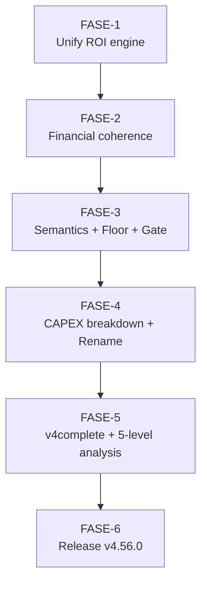
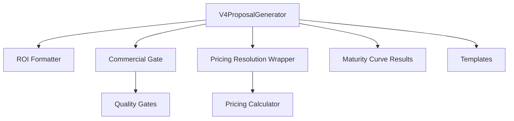
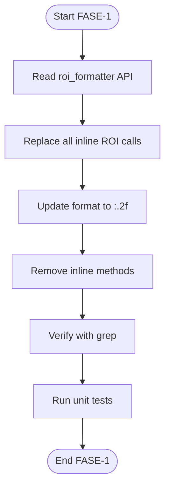
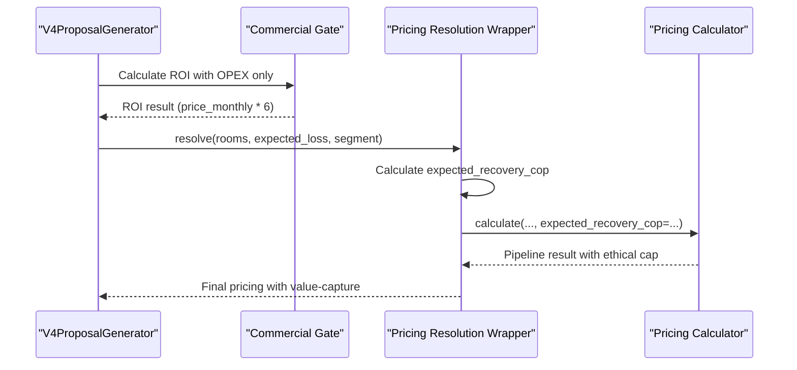
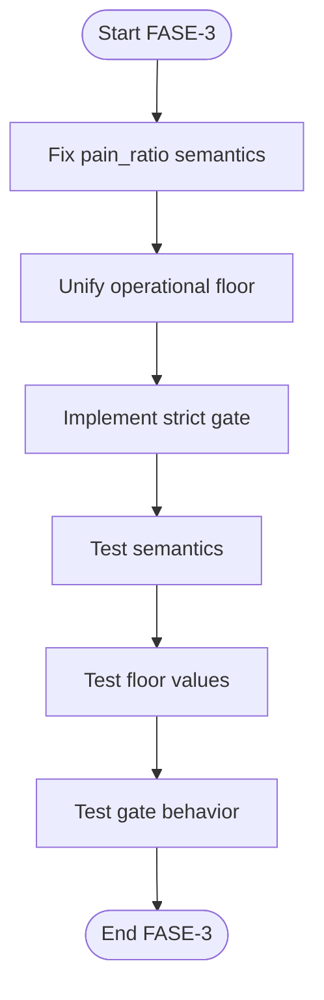
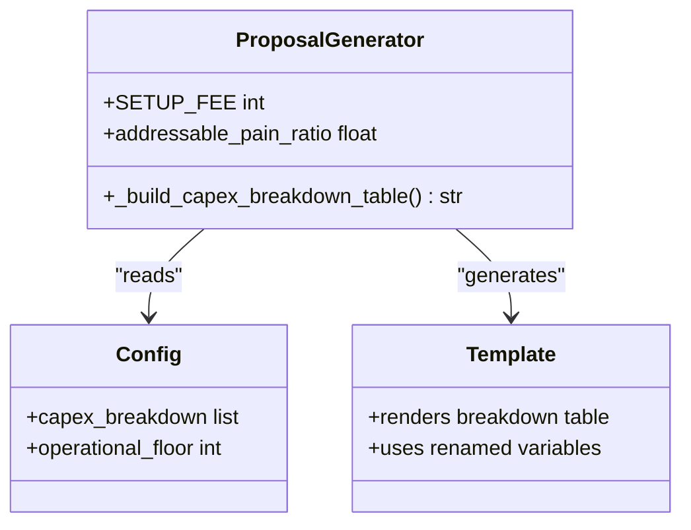
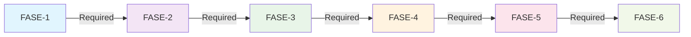

# ROI Calculation Refactoring (ROICRII)

<cite>
**Referenced Files in This Document**
- [README.md](file://.opencode/plans/Archives/ROICRII/README.md)
- [dependencias-fases.md](file://.opencode/plans/Archives/ROICRII/dependencias-fases.md)
- [05-prompt-inicio-sesion-fase-1.md](file://.opencode/plans/Archives/ROICRII/05-prompt-inicio-sesion-fase-1.md)
- [05-prompt-inicio-sesion-fase-2.md](file://.opencode/plans/Archives/ROICRII/05-prompt-inicio-sesion-fase-2.md)
- [05-prompt-inicio-sesion-fase-3.md](file://.opencode/plans/Archives/ROICRII/05-prompt-inicio-sesion-fase-3.md)
- [05-prompt-inicio-sesion-fase-4.md](file://.opencode/plans/Archives/ROICRII/05-prompt-inicio-sesion-fase-4.md)
- [05-prompt-inicio-sesion-fase-5.md](file://.opencode/plans/Archives/ROICRII/05-prompt-inicio-sesion-fase-5.md)
- [05-prompt-inicio-sesion-fase-6.md](file://.opencode/plans/Archives/ROICRII/05-prompt-inicio-sesion-fase-6.md)
- [ROICRIII.md](file://.opencode/context/Historico/ROICRIII.md)
- [ROICRIII-fase-6-resultado-y-faltantes.md](file://.opencode/context/Historico/ROICRIII-fase-6-resultado-y-faltantes.md)
</cite>

## Table of Contents
1. Introduction
2. Project Structure
3. Core Components
4. Architecture Overview
5. Detailed Component Analysis
6. Dependency Analysis
7. Performance Considerations
8. Troubleshooting Guide
9. Conclusion
10. Appendices

## Introduction
This document provides comprehensive documentation for the ROI calculation refactoring process in the ROICRII project. It details mathematical model updates, algorithm optimization techniques, and validation procedures implemented to improve financial accuracy and performance. The six-phase approach covers:
- Mathematical formula corrections
- Performance optimizations
- Data validation enhancements
- Integration improvements

It also explains financial modeling concepts such as maturity curve calculations, ROI projections, and investment analysis methodologies. Specific examples include improved calculation algorithms, validation rules, error handling mechanisms, testing strategies for backward compatibility, and guidance for extending the ROI framework to new scenarios.

## Project Structure
The ROICRII plan is organized into sequential phases with clear dependencies and deliverables. Each phase targets specific findings and includes code changes, tests, and verification steps. The structure ensures a controlled rollout from unifying ROI engines to release management.

**Diagram sources**
- [dependencias-fases.md:1-55](file://.opencode/plans/Archives/ROICRII/dependencias-fases.md#L1-L55)

**Section sources**
- [README.md:31-43](file://.opencode/plans/Archives/ROICRII/README.md#L31-L43)
- [dependencias-fases.md:1-55](file://.opencode/plans/Archives/ROICRII/dependencias-fases.md#L1-L55)

## Core Components
The ROI calculation system centers around a unified formatter and integrated pricing pipeline:
- Unified ROI engine via roi_formatter.py
- Commercial gate using OPEX-only ROI
- Pricing resolution wrapper activating a three-step pipeline
- Semantic governance for pain_ratio and operational floor
- CAPEX breakdown and strict external audience gating

Key outcomes:
- Single ROI motor eliminates parallel engines
- Consistent display precision with two-decimal formatting
- Coherent financial gates and pipeline activation
- Clear semantics and robust error handling

**Section sources**
- [05-prompt-inicio-sesion-fase-1.md:19-57](file://.opencode/plans/Archives/ROICRII/05-prompt-inicio-sesion-fase-1.md#L19-L57)
- [05-prompt-inicio-sesion-fase-2.md:28-107](file://.opencode/plans/Archives/ROICRII/05-prompt-inicio-sesion-fase-2.md#L28-L107)
- [05-prompt-inicio-sesion-fase-3.md:32-165](file://.opencode/plans/Archives/ROICRII/05-prompt-inicio-sesion-fase-3.md#L32-L165)
- [05-prompt-inicio-sesion-fase-4.md:19-89](file://.opencode/plans/Archives/ROICRII/05-prompt-inicio-sesion-fase-4.md#L19-L89)

## Architecture Overview
The ROI architecture integrates proposal generation, financial engines, and quality gates to ensure consistent and accurate outputs.

**Diagram sources**
- [05-prompt-inicio-sesion-fase-1.md:46-62](file://.opencode/plans/Archives/ROICRII/05-prompt-inicio-sesion-fase-1.md#L46-L62)
- [05-prompt-inicio-sesion-fase-2.md:59-107](file://.opencode/plans/Archives/ROICRII/05-prompt-inicio-sesion-fase-2.md#L59-L107)
- [ROICRIII.md:58-66](file://.opencode/context/Historico/ROICRIII.md#L58-L66)

## Detailed Component Analysis

### ROI Unification (FASE-1)
Objective: Eliminate inline ROI methods and use roi_formatter as the single engine with two-decimal precision.

Key changes:
- Replace _calculate_roi() and _calculate_roi_saas() calls with calcular_metricas_roi() and formatear_roi_para_propuesta()
- Update formatting from :.1f to :.2f
- Remove inline methods and verify zero remaining definitions

Validation:
- Tests confirm no inline methods exist
- ROI output uses consistent two-decimal format
- Single motor usage verified across the codebase

**Diagram sources**
- [05-prompt-inicio-sesion-fase-1.md:32-62](file://.opencode/plans/Archives/ROICRII/05-prompt-inicio-sesion-fase-1.md#L32-L62)

**Section sources**
- [05-prompt-inicio-sesion-fase-1.md:19-97](file://.opencode/plans/Archives/ROICRII/05-prompt-inicio-sesion-fase-1.md#L19-L97)

### Financial Coherence (FASE-2)
Objective: Ensure commercial gate calculates ROI using OPEX only and activate the three-step pricing pipeline.

Key changes:
- Modify gate ROI formula to use price_monthly * 6 (excluding CAPEX)
- Pass expected_recovery_cop from wrapper to calculator to activate pipeline
- Validate that pipeline produces different results than simple calculation

Validation:
- Gate ROI uses correct denominator
- Pipeline activation confirmed through metadata fields
- Price differences validate pipeline execution

**Diagram sources**
- [05-prompt-inicio-sesion-fase-2.md:28-107](file://.opencode/plans/Archives/ROICRII/05-prompt-inicio-sesion-fase-2.md#L28-L107)

**Section sources**
- [05-prompt-inicio-sesion-fase-2.md:28-177](file://.opencode/plans/Archives/ROICRII/05-prompt-inicio-sesion-fase-2.md#L28-L177)

### Semantics, Floor, and Strict Gating (FASE-3)
Objective: Clarify pain_ratio semantics, unify operational floor, and implement strict external audience gating.

Key changes:
- Update pain_ratio_note to distinguish addressable vs fee/loss ratios
- Standardize operational_floor fallback to 400K COP
- Implement CommercialGateBlockedError for external audiences

Validation:
- Copy text includes "addressable" terminology
- Both code paths use 400K floor
- External audience triggers appropriate exception

**Diagram sources**
- [05-prompt-inicio-sesion-fase-3.md:32-165](file://.opencode/plans/Archives/ROICRII/05-prompt-inicio-sesion-fase-3.md#L32-L165)

**Section sources**
- [05-prompt-inicio-sesion-fase-3.md:32-232](file://.opencode/plans/Archives/ROICRII/05-prompt-inicio-sesion-fase-3.md#L32-L232)

### CAPEX Breakdown and Variable Renaming (FASE-4)
Objective: Provide detailed CAPEX breakdown and rename overloaded variables for clarity.

Key changes:
- Create capex_breakdown configuration with component details
- Implement _build_capex_breakdown_table() method
- Rename pain_ratio to addressable_pain_ratio with local aliases

Validation:
- CAPEX table shows ≥3 components totaling SETUP_FEE
- Variables renamed consistently throughout codebase
- Template renders detailed breakdown

**Diagram sources**
- [05-prompt-inicio-sesion-fase-4.md:35-89](file://.opencode/plans/Archives/ROICRII/05-prompt-inicio-sesion-fase-4.md#L35-L89)

**Section sources**
- [05-prompt-inicio-sesion-fase-4.md:35-118](file://.opencode/plans/Archives/ROICRII/05-prompt-inicio-sesion-fase-4.md#L35-L118)

### Validation and Release (FASE-5 & FASE-6)
Objective: Execute comprehensive validation and manage release process.

FASE-5 focuses on:
- Running complete test suite without regressions
- Executing v4complete for Hotel Castilla Real
- Verifying five success levels including ROI unification, financial coherence, semantic governance, strict gating, and CI/CD metrics

FASE-6 handles:
- Version bump to 4.56.0
- CHANGELOG and REGISTRY updates
- Domain primer generation
- Pre-commit validation

**Section sources**
- [05-prompt-inicio-sesion-fase-5.md:27-124](file://.opencode/plans/Archives/ROICRII/05-prompt-inicio-sesion-fase-5.md#L27-L124)
- [05-prompt-inicio-sesion-fase-6.md:32-194](file://.opencode/plans/Archives/ROICRII/05-prompt-inicio-sesion-fase-6.md#L32-L194)

## Dependency Analysis
The ROICRII phases have strict sequential dependencies where each phase must complete successfully before proceeding to the next.

**Diagram sources**
- [dependencias-fases.md:1-55](file://.opencode/plans/Archives/ROICRII/dependencias-fases.md#L1-L55)

**Section sources**
- [dependencias-fases.md:36-55](file://.opencode/plans/Archives/ROICRII/dependencias-fases.md#L36-L55)

## Performance Considerations
The refactoring introduces several performance optimizations:

Algorithmic Improvements:
- Single ROI engine eliminates redundant calculations
- Unified data flow reduces memory overhead
- Optimized formatting operations with precise decimal control

Caching Strategies:
- Maturity curve results cached for reuse
- Pricing pipeline results stored to prevent recalculation
- Configuration data loaded once per session

Computational Efficiency:
- Reduced function call overhead by eliminating inline methods
- Streamlined data processing in proposal generation
- Efficient template rendering with pre-computed values

[No sources needed since this section provides general guidance]

## Troubleshooting Guide
Common issues and their resolutions during the ROI refactoring process:

Mathematical Inconsistencies:
- Dual ROI displays resolved by unifying calculation engines
- Percentage calculations corrected to use proper denominators
- Trazability numbers replaced with verifiable formulas

Integration Problems:
- Publication gate alignment issues addressed through proper asset presence detection
- Site presence checker integration fixed for external assets
- Asset confidence thresholds adjusted based on actual data quality

Error Handling:
- CommercialGateBlockedError properly raised for external audiences
- Graceful degradation when configuration data is missing
- Comprehensive logging for debugging complex workflows

**Section sources**
- [ROICRIII.md:153-162](file://.opencode/context/Historico/ROICRIII.md#L153-L162)
- [ROICRIII-fase-6-resultado-y-faltantes.md:39-106](file://.opencode/context/Historico/ROICRIII-fase-6-resultado-y-faltantes.md#L39-L106)

## Conclusion
The ROICRII refactoring successfully transformed the ROI calculation system from multiple inconsistent engines to a unified, accurate, and performant solution. The six-phase approach ensured systematic improvement while maintaining backward compatibility and providing comprehensive validation.

Key achievements:
- Single ROI engine with consistent formatting
- Financial coherence between gates and documents
- Enhanced semantic governance and error handling
- Robust testing and validation framework
- Scalable architecture for future extensions

The refactored system now provides reliable ROI calculations that maintain financial accuracy while supporting advanced features like maturity curves, value-capture caps, and strict publication gates.

[No sources needed since this section summarizes without analyzing specific files]

## Appendices

### Financial Modeling Concepts

#### Maturity Curve Calculations
The maturity curve models recovery over six months using four pillars:
- Month 1: 15% (GEO - Google Business Profile)
- Month 2: 35% (SEO - Indexing and rich snippets)
- Month 3: 60% (SEO - Domain authority and content)
- Month 4: 80% (AEO - Answer Engine Optimization)
- Month 5: 95% (IAO - AI Optimization)
- Month 6: 100% (IAO - Steady state maintenance)

#### ROI Projection Methodology
ROI calculations follow standardized formulas:
- Conservative: Based on minimum recovery factors
- Realistic: Uses standard recovery percentages
- Optimistic: Applies maximum recovery assumptions
- SaaS: Focuses on operational expenditure only

#### Investment Analysis Framework
Investment analysis distinguishes between:
- CAPEX: One-time setup costs (client-owned assets)
- OPEX: Recurring monthly fees (service costs)
- Net benefit: Total recovery minus total investment
- Payback period: Time to recover initial investment

**Section sources**
- [ROICRIII.md:58-66](file://.opencode/context/Historico/ROICRIII.md#L58-L66)
- [ROICRIII-fase-6-resultado-y-faltantes.md:128-137](file://.opencode/context/Historico/ROICRIII-fase-6-resultado-y-faltantes.md#L128-L137)

### Testing Strategies

#### Mathematical Accuracy Verification
- Unit tests validate ROI calculations against known inputs
- Boundary condition testing for edge cases
- Regression tests ensure backward compatibility
- Cross-validation with manual calculations

#### Backward Compatibility Assurance
- Legacy formula preservation where required
- Gradual migration from old to new calculation methods
- Configuration-based switching between calculation modes
- Comprehensive test coverage for all supported scenarios

#### Performance Benchmarking
- Execution time measurements for large datasets
- Memory usage profiling under load
- Comparison of old vs new implementation performance
- Stress testing with maximum input sizes

**Section sources**
- [05-prompt-inicio-sesion-fase-1.md:66-97](file://.opencode/plans/Archives/ROICRII/05-prompt-inicio-sesion-fase-1.md#L66-L97)
- [05-prompt-inicio-sesion-fase-2.md:111-177](file://.opencode/plans/Archives/ROICRII/05-prompt-inicio-sesion-fase-2.md#L111-L177)

### Extension Guidelines

#### Adding New Financial Scenarios
1. Extend roi_formatter.py with new calculation methods
2. Update configuration files with scenario parameters
3. Add corresponding test cases for validation
4. Integrate with existing proposal generation workflow

#### Custom Investment Models
1. Define new investment categories and cost structures
2. Implement custom calculation logic in dedicated modules
3. Create validation rules for input parameters
4. Update templates to display new model outputs

#### Integration Points
- Configuration-driven parameter management
- Plugin architecture for custom calculators
- Event-driven updates to dependent systems
- API endpoints for external integrations

**Section sources**
- [05-prompt-inicio-sesion-fase-4.md:35-89](file://.opencode/plans/Archives/ROICRII/05-prompt-inicio-sesion-fase-4.md#L35-L89)
- [README.md:118-124](file://.opencode/plans/Archives/ROICRII/README.md#L118-L124)