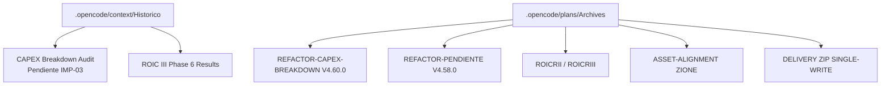
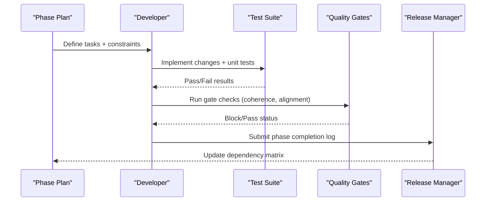
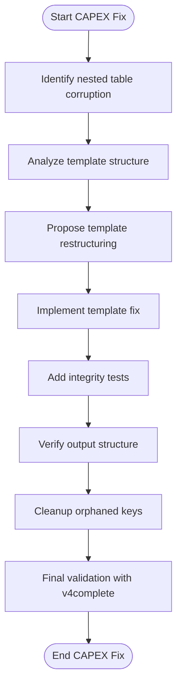
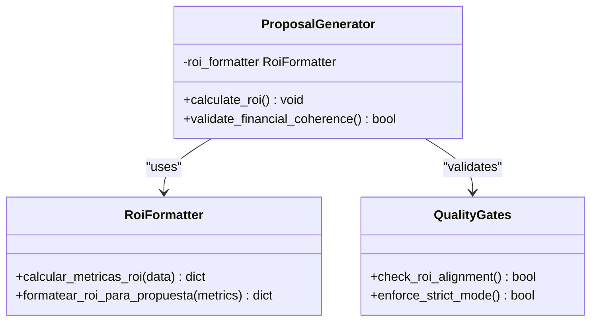
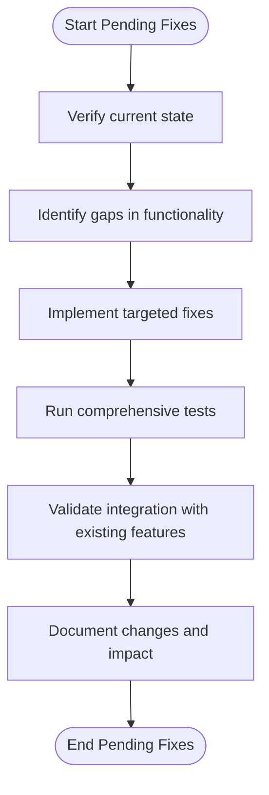
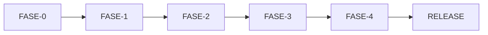

# Refactoring Methodologies and Code Modernization

<cite>
**Referenced Files in This Document**
- [PENDIENTE-IMP-03-CAPEX-BREAKDOWN.md](file://context\Historico\PENDIENTE-IMP-03-CAPEX-BREAKDOWN.md)
- [ROICRIII-fase-6-resultado-y-faltantes.md](file://context\Historico\ROICRIII-fase-6-resultado-y-faltantes.md)
- [REFACTOR-CAPEX-BREAKDOWN-V4.60.0/01-plan-maestro.md](file://plans\Archives\REFACTOR-CAPEX-BREAKDOWN-V4.60.0\01-plan-maestro.md)
- [REFACTOR-PENDIENTE-V4.58.0/README.md](file://plans\Archives\REFACTOR-PENDIENTE-V4.58.0\README.md)
- [ROICRII/README.md](file://plans\Archives\ROICRII\README.md)
- [ROICRII/05-prompt-inicio-sesion-fase-1.md](file://plans\Archives\ROICRII\05-prompt-inicio-sesion-fase-1.md)
- [REFACTOR-PENDIENTE-V4.58.0/05-prompt-inicio-sesion-fase-0.md](file://plans\Archives\REFACTOR-PENDIENTE-V4.58.0\05-prompt-inicio-sesion-fase-0.md)
- [DELIVERY-ZIP-SINGLE-WRITE-2026-08-01/dependencias-fases.md](file://plans\DELIVERY-ZIP-SINGLE-WRITE-2026-08-01\dependencias-fases.md)
- [DT-3-TECH-DEBT-2026-07-25/dependencias-fases.md](file://plans\Archives\DT-3-TECH-DEBT-2026-07-25\dependencias-fases.md)
- [ASSET-ALIGNMENT-ZIONE-2026-07-23/01-plan-maestro.md](file://plans\Archives\ASSET-ALIGNMENT-ZIONE-2026-07-23\01-plan-maestro.md)
- [DELIVERY-ZIP-SINGLE-WRITE-2026-08-01/03-prompt-fase-B.md](file://plans\DELIVERY-ZIP-SINGLE-WRITE-2026-08-01\03-prompt-fase-B.md)
</cite>

## Table of Contents
1. [Introduction](#introduction)
2. [Project Structure](#project-structure)
3. [Core Components](#core-components)
4. [Architecture Overview](#architecture-overview)
5. [Detailed Component Analysis](#detailed-component-analysis)
6. [Dependency Analysis](#dependency-analysis)
7. [Performance Considerations](#performance-considerations)
8. [Troubleshooting Guide](#troubleshooting-guide)
9. [Conclusion](#conclusion)
10. [Appendices](#appendices)

## Introduction
This document explains the systematic refactoring methodologies and code modernization approaches used across the iah-cli project, focusing on complex modules such as CAPEX breakdown calculations and pending functionality improvements. It details phased refactoring strategies with clear milestones, risk mitigation, and backward compatibility considerations. It also documents ROIC (Return on Investment Calculation) refactoring processes, including mathematical model updates, algorithm optimization, and validation procedures. The guide includes examples of code transformation patterns, testing strategies during refactoring, verification methods to ensure functional equivalence, dependency management, incremental delivery approaches, rollback procedures, performance optimizations, code quality improvements, and architectural enhancements achieved through systematic refactoring efforts.

## Project Structure
The repository organizes refactoring plans, context, and evidence under .opencode:
- context/Historico: Forensic audits, post-analysis, and issue tracking for specific refactors (e.g., CAPEX breakdown, ROIC phases).
- plans/Archives: Phase-based plans for multiple refactors (CAPEX breakdown, Pending fixes, ROIC iterations, asset alignment, delivery packaging).
- Each plan follows a consistent structure: master plan, phase prompts, checklists, dependencies, and post-project documentation.

**Section sources**
- [REFACTOR-CAPEX-BREAKDOWN-V4.60.0/01-plan-maestro.md:1-129](file://plans\Archives\REFACTOR-CAPEX-BREAKDOWN-V4.60.0\01-plan-maestro.md#L1-L129)
- [REFACTOR-PENDIENTE-V4.58.0/README.md:1-67](file://plans\Archives\REFACTOR-PENDIENTE-V4.58.0\README.md#L1-L67)

## Core Components
Key components driving the refactoring methodology include:
- Forensic audit documents that verify claims against live code and outputs.
- Phase-based plans with explicit tasks, constraints, and success metrics.
- Dependency matrices and conflict resolution rules ensuring safe sequential execution.
- Validation scripts and test suites to maintain functional equivalence.

Examples:
- CAPEX breakdown refactor identifies nested markdown table corruption and proposes template restructuring.
- ROIC refactors unify ROI calculation engines, standardize formatting, and enforce strict gates.
- Delivery packaging refactor introduces single-write architecture with fixed-point iteration.

**Section sources**
- [PENDIENTE-IMP-03-CAPEX-BREAKDOWN.md:1-360](file://context\Historico\PENDIENTE-IMP-03-CAPEX-BREAKDOWN.md#L1-L360)
- [ROICRII/README.md:27-124](file://plans\Archives\ROICRII\README.md#L27-L124)
- [DELIVERY-ZIP-SINGLE-WRITE-2026-08-01/03-prompt-fase-B.md:170-244](file://plans\DELIVERY-ZIP-SINGLE-WRITE-2026-08-01\03-prompt-fase-B.md#L170-L244)

## Architecture Overview
The refactoring architecture is built around phased execution with strong verification at each stage:
- Phase isolation: Each phase targets specific findings or features.
- Dependency chains: Strict ordering prevents conflicts and ensures stability.
- Evidence-driven decisions: Audits and tests validate changes before release.
- Incremental delivery: Small, verifiable steps reduce risk and enable rollbacks.

**Diagram sources**
- [REFACTOR-CAPEX-BREAKDOWN-V4.60.0/01-plan-maestro.md:50-80](file://plans\Archives\REFACTOR-CAPEX-BREAKDOWN-V4.60.0\01-plan-maestro.md#L50-L80)
- [DELIVERY-ZIP-SINGLE-WRITE-2026-08-01/dependencias-fases.md:30-60](file://plans\DELIVERY-ZIP-SINGLE-WRITE-2026-08-01\03-prompt-fase-B.md#L30-L60)

## Detailed Component Analysis

### CAPEX Breakdown Refactoring
The CAPEX breakdown refactor addresses critical issues in markdown table rendering and dead code cleanup:
- Problem: Nested markdown tables cause corruption when embedding a table within a cell.
- Solution: Restructure templates to avoid nesting; move breakdown to a separate section.
- Additional fixes: Remove orphaned keys, add headers to fallbacks, integrate coherence checklist.

**Diagram sources**
- [PENDIENTE-IMP-03-CAPEX-BREAKDOWN.md:40-127](file://context\Historico\PENDIENTE-IMP-03-CAPEX-BREAKDOWN.md#L40-L127)
- [REFACTOR-CAPEX-BREAKDOWN-V4.60.0/01-plan-maestro.md:64-79](file://plans\Archives\REFACTOR-CAPEX-BREAKDOWN-V4.60.0\01-plan-maestro.md#L64-L79)

**Section sources**
- [PENDIENTE-IMP-03-CAPEX-BREAKDOWN.md:1-360](file://context\Historico\PENDIENTE-IMP-03-CAPEX-BREAKDOWN.md#L1-L360)
- [REFACTOR-CAPEX-BREAKDOWN-V4.60.0/01-plan-maestro.md:1-129](file://plans\Archives\REFACTOR-CAPEX-BREAKDOWN-V4.60.0\01-plan-maestro.md#L1-L129)

### ROIC Refactoring Processes
ROIC refactoring focuses on unifying calculation engines, improving precision, and enforcing strict validation:
- Unification: Replace inline ROI calculators with a centralized formatter.
- Precision: Standardize formatting to two decimal places.
- Validation: Enforce gates to ensure financial coherence and alignment.

**Diagram sources**
- [ROICRII/05-prompt-inicio-sesion-fase-1.md:1-118](file://plans\Archives\ROICRII\05-prompt-inicio-sesion-fase-1.md#L1-L118)
- [ROICRII/README.md:27-124](file://plans\Archives\ROICRII\README.md#L27-L124)

**Section sources**
- [ROICRII/05-prompt-inicio-sesion-fase-1.md:1-118](file://plans\Archives\ROICRII\05-prompt-inicio-sesion-fase-1.md#L1-L118)
- [ROICRIII-fase-6-resultado-y-faltantes.md:1-298](file://context\Historico\ROICRIII-fase-6-resultado-y-faltantes.md#L1-L298)

### Pending Functionality Improvements
Pending improvements address gaps in ADR evidence, status quo sections, and closing pitches:
- Verification: Confirm current state against documented claims.
- Implementation: Add missing functionality while maintaining backward compatibility.
- Testing: Ensure no regressions in existing features.

**Diagram sources**
- [REFACTOR-PENDIENTE-V4.58.0/05-prompt-inicio-sesion-fase-0.md:1-118](file://plans\Archives\REFACTOR-PENDIENTE-V4.58.0\05-prompt-inicio-sesion-fase-0.md#L1-L118)

**Section sources**
- [REFACTOR-PENDIENTE-V4.58.0/README.md:1-67](file://plans\Archives\REFACTOR-PENDIENTE-V4.58.0\README.md#L1-L67)
- [REFACTOR-PENDIENTE-V4.58.0/05-prompt-inicio-sesion-fase-0.md:1-118](file://plans\Archives\REFACTOR-PENDIENTE-V4.58.0\05-prompt-inicio-sesion-fase-0.md#L1-L118)

## Dependency Analysis
Refactoring efforts follow strict dependency chains to prevent conflicts and ensure stability:
- Sequential execution: Phases are ordered to build upon previous work.
- Conflict resolution: File-level conflicts are resolved by enforcing execution order.
- Rollback procedures: Each phase can be rolled back independently if issues arise.

**Diagram sources**
- [DELIVERY-ZIP-SINGLE-WRITE-2026-08-01/dependencias-fases.md:30-60](file://plans\DELIVERY-ZIP-SINGLE-WRITE-2026-08-01\dependencias-fases.md#L30-L60)
- [DT-3-TECH-DEBT-2026-07-25/dependencias-fases.md:36-59](file://plans\Archives\DT-3-TECH-DEBT-2026-07-25\dependencias-fases.md#L36-L59)

**Section sources**
- [DELIVERY-ZIP-SINGLE-WRITE-2026-08-01/dependencias-fases.md:30-60](file://plans\DELIVERY-ZIP-SINGLE-WRITE-2026-08-01\dependencias-fases.md#L30-L60)
- [DT-3-TECH-DEBT-2026-07-25/dependencias-fases.md:36-59](file://plans\Archives\DT-3-TECH-DEBT-2026-07-25\dependencias-fases.md#L36-L59)

## Performance Considerations
Refactoring efforts prioritize performance optimizations:
- Algorithm optimization: Centralized ROI calculations reduce redundant computations.
- Memory efficiency: Single-write architecture minimizes disk I/O operations.
- Validation speed: Targeted tests focus on critical paths without full pipeline execution.

[No sources needed since this section provides general guidance]

## Troubleshooting Guide
Common issues and their resolutions during refactoring:
- Nested table corruption: Restructure templates to avoid markdown nesting.
- Gate failures: Debug integration points between generators and quality gates.
- Confidence thresholds: Enhance data extraction to improve asset confidence scores.

**Section sources**
- [ROICRIII-fase-6-resultado-y-faltantes.md:39-105](file://context\Historico\ROICRIII-fase-6-resultado-y-faltantes.md#L39-L105)
- [ASSET-ALIGNMENT-ZIONE-2026-07-23/01-plan-maestro.md:60-69](file://plans\Archives\ASSET-ALIGNMENT-ZIONE-2026-07-23\01-plan-maestro.md#L60-L69)

## Conclusion
The iah-cli project demonstrates a robust approach to refactoring through systematic methodologies, phased execution, and rigorous validation. By addressing complex modules like CAPEX breakdown calculations and ROIC processes, the project achieves improved code quality, performance, and maintainability. The structured dependency management and incremental delivery ensure stability while enabling continuous modernization.

[No sources needed since this section summarizes without analyzing specific files]

## Appendices
Additional resources and references for further exploration:
- Forensic audit documents provide detailed evidence and verification methods.
- Phase prompts offer step-by-step instructions for implementing changes.
- Dependency matrices ensure safe execution and conflict resolution.

[No sources needed since this section provides general guidance]